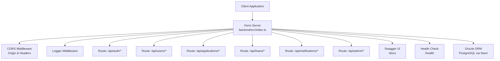
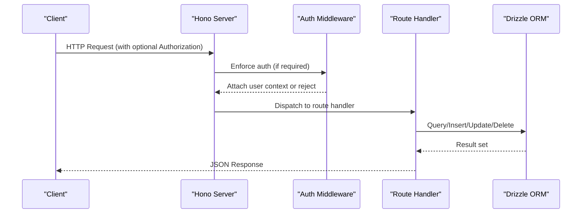
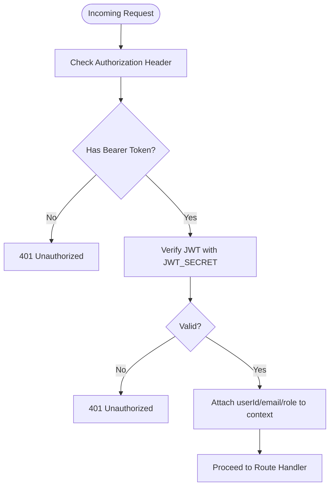
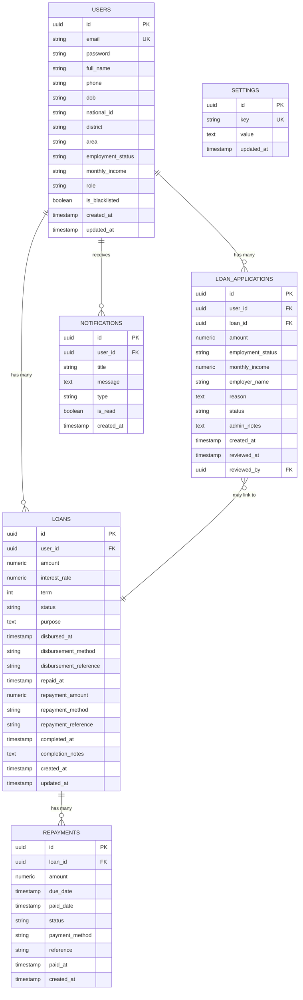
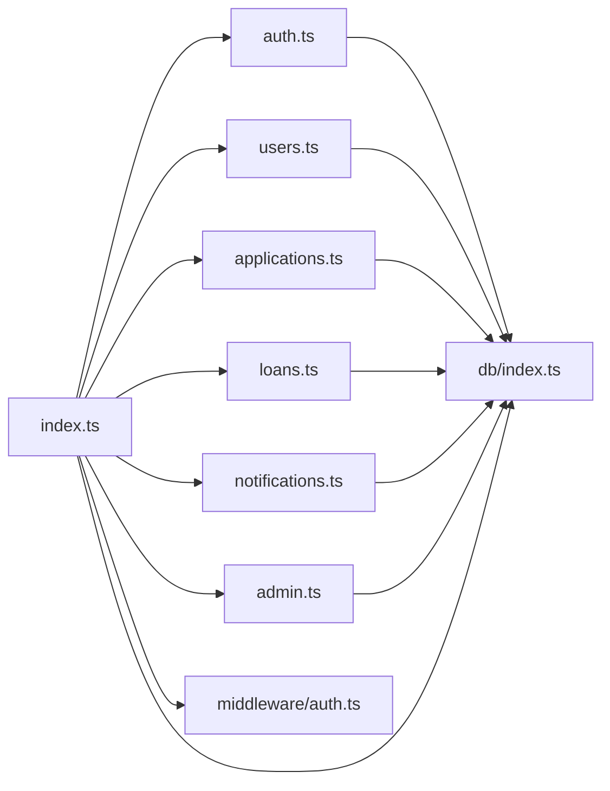

# API Reference

<cite>
**Referenced Files in This Document**
- [backend/src/index.ts](file://backend/src/index.ts)
- [backend/src/middleware/auth.ts](file://backend/src/middleware/auth.ts)
- [backend/src/routes/auth.ts](file://backend/src/routes/auth.ts)
- [backend/src/routes/users.ts](file://backend/src/routes/users.ts)
- [backend/src/routes/applications.ts](file://backend/src/routes/applications.ts)
- [backend/src/routes/loans.ts](file://backend/src/routes/loans.ts)
- [backend/src/routes/notifications.ts](file://backend/src/routes/notifications.ts)
- [backend/src/routes/admin.ts](file://backend/src/routes/admin.ts)
- [backend/src/db/schema.ts](file://backend/src/db/schema.ts)
- [backend/src/db/index.ts](file://backend/src/db/index.ts)
- [backend/drizzle.config.ts](file://backend/drizzle.config.ts)
- [backend/package.json](file://backend/package.json)
- [package.json](file://package.json)
</cite>

## Table of Contents
1. [Introduction](#introduction)
2. [Project Structure](#project-structure)
3. [Core Components](#core-components)
4. [Architecture Overview](#architecture-overview)
5. [Detailed Component Analysis](#detailed-component-analysis)
6. [Dependency Analysis](#dependency-analysis)
7. [Performance Considerations](#performance-considerations)
8. [Troubleshooting Guide](#troubleshooting-guide)
9. [Conclusion](#conclusion)
10. [Appendices](#appendices)

## Introduction
This document provides a comprehensive API reference for the Phoenix Loan backend built with Hono. It covers all public endpoints, HTTP methods, URL patterns, request/response schemas, authentication requirements, parameter validation, error response formats, and operational policies such as CORS and health checks. It also outlines the database schema, middleware behavior, and integration guidance for client applications.

## Project Structure
The backend is organized around a modular routing pattern with dedicated route handlers for authentication, users, applications, loans, notifications, and admin operations. A central server initializes middleware, routes, and the development server.

**Diagram sources**
- [backend/src/index.ts:17-76](file://backend/src/index.ts#L17-L76)
- [backend/src/db/index.ts:40-44](file://backend/src/db/index.ts#L40-L44)

**Section sources**
- [backend/src/index.ts:17-76](file://backend/src/index.ts#L17-L76)
- [backend/src/db/index.ts:40-44](file://backend/src/db/index.ts#L40-L44)

## Core Components
- Server and Routing
  - Central server initializes logging, CORS, health check, Swagger UI, and mounts route groups under /api and /api/admin.
  - CORS allows specific origins and headers, enabling browser clients to communicate securely.
- Authentication Middleware
  - Validates Authorization header bearer tokens and attaches user identity to the request context.
  - Provides admin-only enforcement for protected endpoints.
- Parameter Validation
  - Uses zod schemas and @hono/zod-validator to enforce strict request validation for endpoints requiring JSON bodies.
- Database Access
  - Drizzle ORM connects to PostgreSQL via Neon with a typed schema for users, loans, applications, repayments, notifications, and settings.

**Section sources**
- [backend/src/index.ts:19-26](file://backend/src/index.ts#L19-L26)
- [backend/src/middleware/auth.ts:10-47](file://backend/src/middleware/auth.ts#L10-L47)
- [backend/src/routes/auth.ts:12-31](file://backend/src/routes/auth.ts#L12-L31)
- [backend/src/db/index.ts:40-44](file://backend/src/db/index.ts#L40-L44)

## Architecture Overview
The API follows a layered architecture:
- Transport: Hono server with Node adapter
- Middleware: Logging, CORS, JWT-based authentication
- Routing: Route modules per domain (auth, users, applications, loans, notifications, admin)
- Persistence: Drizzle ORM with PostgreSQL schema

**Diagram sources**
- [backend/src/index.ts:54-61](file://backend/src/index.ts#L54-L61)
- [backend/src/middleware/auth.ts:10-47](file://backend/src/middleware/auth.ts#L10-L47)
- [backend/src/routes/auth.ts:33-93](file://backend/src/routes/auth.ts#L33-L93)

## Detailed Component Analysis

### Authentication Endpoints
- Base Path: /api
- Methods and Paths
  - POST /api/register
    - Description: Registers a new user with KYC fields.
    - Authentication: None
    - Request Schema (JSON):
      - email: string (required, email format)
      - password: string (required, min length 6)
      - fullName: string (required, min length 2)
      - phone: string (optional)
      - dob: string (optional)
      - nationalId: string (optional)
      - district: string (optional)
      - area: string (optional)
      - employmentStatus: string (optional)
      - monthlyIncome: string (optional)
    - Response: { message: string, user: { id, email, fullName, role }, token: string }
    - Status Codes: 201 Created, 400 Bad Request (duplicate email), 500 Internal Server Error
  - POST /api/login
    - Description: Logs in an existing user and returns a JWT token.
    - Authentication: None
    - Request Schema (JSON):
      - email: string (required, email format)
      - password: string (required)
    - Response: { message: string, user: { id, email, fullName, role, ... }, token: string }
    - Status Codes: 200 OK, 401 Unauthorized (invalid credentials), 500 Internal Server Error

- Notes
  - Token payload includes: userId, email, role.
  - Token expiration is configured server-side during signing.

**Section sources**
- [backend/src/routes/auth.ts:33-93](file://backend/src/routes/auth.ts#L33-L93)
- [backend/src/routes/auth.ts:96-143](file://backend/src/routes/auth.ts#L96-L143)
- [backend/src/middleware/auth.ts:20-36](file://backend/src/middleware/auth.ts#L20-L36)

### Users Endpoints
- Base Path: /api/users
- Methods and Paths
  - GET /api/users/
    - Description: Fetch all users (admin only).
    - Authentication: Required (admin)
    - Response: { users: [ { id, email, fullName, role, isBlacklisted, createdAt, updatedAt, loans[], applications[] }, ... ] }
    - Status Codes: 200 OK, 403 Forbidden (non-admin), 500 Internal Server Error
  - GET /api/users/profile
    - Description: Fetch current user’s profile.
    - Authentication: Required (via X-User-Id header)
    - Response: { user: { id, email, fullName, phone, role, isBlacklisted, createdAt, updatedAt, loans[], applications[] } }
    - Status Codes: 200 OK, 401 Unauthorized, 404 Not Found, 500 Internal Server Error
  - PUT /api/users/profile
    - Description: Update current user’s profile (fullName, phone).
    - Authentication: Required (via X-User-Id header)
    - Request Schema (JSON): { fullName: string, phone: string }
    - Response: { message: string, user: { id, email, fullName, phone, role, isBlacklisted } }
    - Status Codes: 200 OK, 401 Unauthorized, 500 Internal Server Error
  - GET /api/users/:id
    - Description: Fetch a specific user by ID (admin only).
    - Authentication: Required (admin)
    - Response: { user: { id, email, fullName, phone, role, isBlacklisted, createdAt, updatedAt, loans[], applications[] } }
    - Status Codes: 200 OK, 403 Forbidden, 404 Not Found, 500 Internal Server Error
  - PUT /api/users/:id/blacklist
    - Description: Toggle blacklist status (admin only).
    - Authentication: Required (admin)
    - Response: { message: string, user: { id, isBlacklisted } }
    - Status Codes: 200 OK, 403 Forbidden, 404 Not Found, 500 Internal Server Error
  - PUT /api/users/:id/password
    - Description: Admin updates another user’s password (minimum 6 characters).
    - Authentication: Required (admin)
    - Request Schema (JSON): { password: string (min length 6) }
    - Response: { message: string }
    - Status Codes: 200 OK, 400 Bad Request (weak password), 403 Forbidden, 404 Not Found, 500 Internal Server Error

- Notes
  - Profile retrieval and updates rely on the X-User-Id header for temporary identification until auth middleware is applied consistently.

**Section sources**
- [backend/src/routes/users.ts:8-39](file://backend/src/routes/users.ts#L8-L39)
- [backend/src/routes/users.ts:41-69](file://backend/src/routes/users.ts#L41-L69)
- [backend/src/routes/users.ts:72-107](file://backend/src/routes/users.ts#L72-L107)
- [backend/src/routes/users.ts:109-134](file://backend/src/routes/users.ts#L109-L134)
- [backend/src/routes/users.ts:137-161](file://backend/src/routes/users.ts#L137-L161)
- [backend/src/routes/users.ts:166-194](file://backend/src/routes/users.ts#L166-L194)

### Applications Endpoints
- Base Path: /api/applications
- Methods and Paths
  - GET /api/applications/
    - Description: Fetch all applications (admin only).
    - Authentication: Required (admin)
    - Response: { applications: [ { id, userId, amount, employmentStatus, monthlyIncome, employerName, reason, status, adminNotes, createdAt, reviewedAt, reviewedBy, user:{}, loan:{}, reviewer:{} }, ... ] }
    - Status Codes: 200 OK, 403 Forbidden, 500 Internal Server Error
  - GET /api/applications/my-applications
    - Description: Fetch current user’s applications.
    - Authentication: Required (via X-User-Id header)
    - Response: { applications: [ { id, userId, amount, employmentStatus, monthlyIncome, employerName, reason, status, adminNotes, createdAt, reviewedAt, reviewedBy, loan:{} }, ... ] }
    - Status Codes: 200 OK, 401 Unauthorized, 500 Internal Server Error
  - GET /api/applications/:id
    - Description: Fetch a specific application by ID.
    - Authentication: Required (admin)
    - Response: { application: { id, userId, amount, employmentStatus, monthlyIncome, employerName, reason, status, adminNotes, createdAt, reviewedAt, reviewedBy, user:{}, loan:{} } }
    - Status Codes: 200 OK, 403 Forbidden, 404 Not Found, 500 Internal Server Error
  - POST /api/applications/
    - Description: Submit a new loan application.
    - Authentication: Required (via X-User-Id header)
    - Request Schema (JSON):
      - amount: string (required)
      - employmentStatus: string (required)
      - monthlyIncome: string (required)
      - employerName: string (optional)
      - reason: string (required)
    - Response: { message: string, application: { id, userId, amount, employmentStatus, monthlyIncome, employerName, reason, status:'pending' } }
    - Status Codes: 201 Created, 401 Unauthorized, 500 Internal Server Error
  - PATCH /api/applications/:id/review
    - Description: Update application status and admin notes (admin only).
    - Authentication: Required (admin)
    - Request Schema (JSON):
      - status: enum('pending','under_review','approved','rejected') (required)
      - adminNotes: string (optional)
    - Response: { message: string, application: { id, status, adminNotes, reviewedAt, reviewedBy } }
    - Status Codes: 200 OK, 403 Forbidden, 500 Internal Server Error

- Notes
  - Validation enforced via zod schemas for creation and review operations.

**Section sources**
- [backend/src/routes/applications.ts:24-53](file://backend/src/routes/applications.ts#L24-L53)
- [backend/src/routes/applications.ts:55-77](file://backend/src/routes/applications.ts#L55-L77)
- [backend/src/routes/applications.ts:79-108](file://backend/src/routes/applications.ts#L79-L108)
- [backend/src/routes/applications.ts:110-138](file://backend/src/routes/applications.ts#L110-L138)
- [backend/src/routes/applications.ts:140-165](file://backend/src/routes/applications.ts#L140-L165)

### Loans Endpoints
- Base Path: /api/loans
- Methods and Paths
  - GET /api/loans/
    - Description: Fetch all loans (admin only).
    - Authentication: Required (admin)
    - Response: { loans: [ { id, userId, amount, interestRate, term, status, purpose, createdAt, updatedAt, user:{id,fullName,email}, repayments[] }, ... ] }
    - Status Codes: 200 OK, 403 Forbidden, 500 Internal Server Error
  - GET /api/loans/my-loans
    - Description: Fetch current user’s loans.
    - Authentication: Required (via X-User-Id header)
    - Response: { loans: [ { id, userId, amount, interestRate, term, status, purpose, createdAt, updatedAt, repayments[] }, ... ] }
    - Status Codes: 200 OK, 401 Unauthorized, 500 Internal Server Error
  - GET /api/loans/:id
    - Description: Fetch a specific loan by ID.
    - Authentication: Required (admin)
    - Response: { loan: { id, userId, amount, interestRate, term, status, purpose, createdAt, updatedAt, user:{id,fullName,email}, repayments[] } }
    - Status Codes: 200 OK, 403 Forbidden, 404 Not Found, 500 Internal Server Error
  - POST /api/loans/
    - Description: Create a new loan (admin only).
    - Authentication: Required (admin)
    - Request Schema (JSON):
      - amount: string (required)
      - interestRate: string (required)
      - term: number (required, months)
      - purpose: string (optional)
    - Response: { message: string, loan: { id, userId, amount, interestRate, term, status:'pending' } }
    - Status Codes: 201 Created, 403 Forbidden, 500 Internal Server Error
  - PATCH /api/loans/:id/status
    - Description: Update loan status (admin only).
    - Authentication: Required (admin)
    - Request Schema (JSON): { status: string }
    - Response: { message: string, loan: { id, status } }
    - Status Codes: 200 OK, 403 Forbidden, 500 Internal Server Error
  - PATCH /api/loans/:id/disburse
    - Description: Mark loan as disbursed (admin only).
    - Authentication: Required (admin)
    - Request Schema (JSON): { disbursementMethod: string, disbursementReference: string }
    - Response: { message: string, loan: { id, status:'disbursed', disbursedAt, disbursementMethod, disbursementReference } }
    - Status Codes: 200 OK, 403 Forbidden, 500 Internal Server Error
  - PATCH /api/loans/:id/repaid
    - Description: Mark loan as repaid and record repayment (admin only).
    - Authentication: Required (admin)
    - Request Schema (JSON): { repaymentAmount: string, repaymentMethod: string, repaymentReference: string }
    - Response: { message: string, loan: { id, status:'completed', repaidAt, repaymentAmount, repaymentMethod, repaymentReference } }
    - Status Codes: 200 OK, 403 Forbidden, 500 Internal Server Error
  - PATCH /api/loans/:id/complete
    - Description: Mark loan as completed (admin only).
    - Authentication: Required (admin)
    - Request Schema (JSON): { completionNotes: string }
    - Response: { message: string, loan: { id, status:'completed', completedAt, completionNotes } }
    - Status Codes: 200 OK, 403 Forbidden, 500 Internal Server Error

- Notes
  - Disbursement and repayment endpoints persist additional fields for auditability.
  - Validation enforced via zod schemas for creation.

**Section sources**
- [backend/src/routes/loans.ts:92-113](file://backend/src/routes/loans.ts#L92-L113)
- [backend/src/routes/loans.ts:115-138](file://backend/src/routes/loans.ts#L115-L138)
- [backend/src/routes/loans.ts:140-168](file://backend/src/routes/loans.ts#L140-L168)
- [backend/src/routes/loans.ts:170-197](file://backend/src/routes/loans.ts#L170-L197)
- [backend/src/routes/loans.ts:199-222](file://backend/src/routes/loans.ts#L199-L222)
- [backend/src/routes/loans.ts:224-250](file://backend/src/routes/loans.ts#L224-L250)
- [backend/src/routes/loans.ts:252-290](file://backend/src/routes/loans.ts#L252-L290)
- [backend/src/routes/loans.ts:292-317](file://backend/src/routes/loans.ts#L292-L317)

### Notifications Endpoints
- Base Path: /api/notifications
- Methods and Paths
  - GET /api/notifications/
    - Description: Fetch current user’s notifications (latest 50).
    - Authentication: Required (via X-User-Id header)
    - Response: { notifications: [ { id, userId, title, message, type, isRead, createdAt }, ... ], unreadCount: number }
    - Status Codes: 200 OK, 401 Unauthorized, 500 Internal Server Error
  - PATCH /api/notifications/:id/read
    - Description: Mark a specific notification as read.
    - Authentication: Required (admin or owner via X-User-Id)
    - Response: { message: string }
    - Status Codes: 200 OK, 500 Internal Server Error
  - PATCH /api/notifications/read-all
    - Description: Mark all current user’s notifications as read.
    - Authentication: Required (via X-User-Id header)
    - Response: { message: string }
    - Status Codes: 200 OK, 401 Unauthorized, 500 Internal Server Error
  - POST /api/notifications/
    - Description: Create a notification for the current user.
    - Authentication: Required (via X-User-Id header)
    - Request Schema (JSON): { title: string, message: string, type: string }
    - Response: { notification: { id, userId, title, message, type, isRead:false, createdAt } }
    - Status Codes: 201 Created, 401 Unauthorized, 500 Internal Server Error
  - DELETE /api/notifications/read
    - Description: Clear all read notifications for the current user.
    - Authentication: Required (via X-User-Id header)
    - Response: { message: string }
    - Status Codes: 200 OK, 401 Unauthorized, 500 Internal Server Error

**Section sources**
- [backend/src/routes/notifications.ts:8-33](file://backend/src/routes/notifications.ts#L8-L33)
- [backend/src/routes/notifications.ts:35-49](file://backend/src/routes/notifications.ts#L35-L49)
- [backend/src/routes/notifications.ts:51-69](file://backend/src/routes/notifications.ts#L51-L69)
- [backend/src/routes/notifications.ts:71-90](file://backend/src/routes/notifications.ts#L71-L90)
- [backend/src/routes/notifications.ts:92-103](file://backend/src/routes/notifications.ts#L92-L103)

### Admin Endpoints
- Base Path: /api/admin
- Methods and Paths
  - GET /api/admin/users
    - Description: Fetch all users with a normalized response shape.
    - Authentication: Required (admin)
    - Response: { users: [ { id, fullName, email, phone, creditScore, loanLimit, isKycVerified, joinedAt, district, employmentStatus, monthlyIncome }, ... ] }
    - Status Codes: 200 OK, 500 Internal Server Error
  - GET /api/admin/loans
    - Description: Fetch all loan applications with user details.
    - Authentication: Required (admin)
    - Response: { loans: [ { id, userId, amount, employmentStatus, monthlyIncome, employerName, reason, status, adminNotes, createdAt, reviewedAt, reviewedBy, user:{id,fullName,email,phone} }, ... ] }
    - Status Codes: 200 OK, 500 Internal Server Error
  - GET /api/admin/stats
    - Description: Compute dashboard statistics (counts and totals).
    - Authentication: Required (admin)
    - Response: { stats: { totalUsers, totalLoans, activeLoans, completedLoans, totalDisbursed } }
    - Status Codes: 200 OK, 500 Internal Server Error
  - GET /api/admin/settings
    - Description: Retrieve all settings as a key-value map.
    - Authentication: Required (admin)
    - Response: { settings: { [key]: any } }
    - Status Codes: 200 OK, 500 Internal Server Error
  - PUT /api/admin/settings
    - Description: Upsert settings (key-value pairs).
    - Authentication: Required (admin)
    - Request Schema (JSON): { [key]: any }
    - Response: { message: string }
    - Status Codes: 200 OK, 500 Internal Server Error

**Section sources**
- [backend/src/routes/admin.ts:8-35](file://backend/src/routes/admin.ts#L8-L35)
- [backend/src/routes/admin.ts:37-61](file://backend/src/routes/admin.ts#L37-L61)
- [backend/src/routes/admin.ts:63-94](file://backend/src/routes/admin.ts#L63-L94)
- [backend/src/routes/admin.ts:96-113](file://backend/src/routes/admin.ts#L96-L113)
- [backend/src/routes/admin.ts:115-137](file://backend/src/routes/admin.ts#L115-L137)

### Authentication and Authorization
- Authentication Middleware
  - Validates Authorization header for Bearer token.
  - Verifies JWT using JWT_SECRET and attaches userId, email, role to context.
  - Returns 401 Unauthorized for missing/invalid tokens.
- Admin Middleware
  - Ensures role equals 'admin'; otherwise returns 403 Forbidden.
- Header Requirements
  - Authorization: Bearer <token> (when required)
  - X-User-Id: Temporary user identifier header used by several endpoints until auth middleware is consistently applied.

**Diagram sources**
- [backend/src/middleware/auth.ts:10-47](file://backend/src/middleware/auth.ts#L10-L47)

**Section sources**
- [backend/src/middleware/auth.ts:10-47](file://backend/src/middleware/auth.ts#L10-L47)

### Error Response Formats
- Standardized Error Payload
  - { error: string }
- Typical Status Codes
  - 400 Bad Request: Validation errors, weak passwords
  - 401 Unauthorized: Missing/invalid token or missing X-User-Id
  - 403 Forbidden: Non-admin access to admin-only endpoints
  - 404 Not Found: Resource not found
  - 500 Internal Server Error: Unexpected server errors

**Section sources**
- [backend/src/routes/auth.ts:42-44](file://backend/src/routes/auth.ts#L42-L44)
- [backend/src/routes/auth.ts:108-120](file://backend/src/routes/auth.ts#L108-L120)
- [backend/src/routes/users.ts:46-48](file://backend/src/routes/users.ts#L46-L48)
- [backend/src/routes/users.ts:171-173](file://backend/src/routes/users.ts#L171-L173)
- [backend/src/routes/applications.ts:116-118](file://backend/src/routes/applications.ts#L116-L118)
- [backend/src/routes/loans.ts:121-123](file://backend/src/routes/loans.ts#L121-L123)
- [backend/src/routes/notifications.ts:13-15](file://backend/src/routes/notifications.ts#L13-L15)

### CORS and Security
- CORS Configuration
  - Allowed Origins: localhost ports and LAN IPs used during development
  - Credentials: enabled
  - Methods: GET, POST, PUT, PATCH, DELETE, OPTIONS
  - Headers: Content-Type, Authorization, X-User-Id
- Security Considerations
  - Use HTTPS in production.
  - Store JWT_SECRET securely.
  - Apply auth middleware consistently to sensitive endpoints.
  - Validate and sanitize all inputs using zod schemas.

**Section sources**
- [backend/src/index.ts:21-26](file://backend/src/index.ts#L21-L26)

### API Versioning and Documentation
- Versioning Strategy
  - OpenAPI document indicates version 1.0.0; no explicit URL versioning scheme observed.
- Documentation
  - OpenAPI spec served at /doc
  - Interactive Swagger UI at /docs

**Section sources**
- [backend/src/index.ts:34-52](file://backend/src/index.ts#L34-L52)

### Rate Limiting and Usage Limits
- Observed Policies
  - No explicit rate limiting middleware or quotas are configured in the server.
- Recommendations
  - Introduce rate limiting per IP or per token.
  - Apply quotas for bulk operations (e.g., fetching large lists).
  - Monitor and log rate-limit triggers.

**Section sources**
- [backend/src/index.ts:19-26](file://backend/src/index.ts#L19-L26)

### Real-Time Communication (WebSockets)
- Current Implementation
  - No WebSocket endpoints or real-time channels are exposed in the backend.
- Recommendations
  - Integrate a WebSocket library (e.g., ws) for notifications or live dashboards.
  - Secure WS connections with the same auth mechanisms.

**Section sources**
- [backend/package.json:22-35](file://backend/package.json#L22-L35)

### Database Schema Overview
The backend uses a typed schema with relations for users, loans, applications, repayments, notifications, and settings.

**Diagram sources**
- [backend/src/db/schema.ts:4-96](file://backend/src/db/schema.ts#L4-L96)

**Section sources**
- [backend/src/db/schema.ts:4-96](file://backend/src/db/schema.ts#L4-L96)

### Client Integration Examples
- Authentication
  - Registration: Send POST /api/register with email, password, fullName, and optional KYC fields.
  - Login: Send POST /api/login with email and password; store returned token.
  - Subsequent Requests: Include Authorization: Bearer <token>.
- User Profile
  - GET /api/users/profile to retrieve profile.
  - PUT /api/users/profile to update fullName and phone.
- Applications
  - POST /api/applications with amount, employmentStatus, monthlyIncome, reason.
  - GET /api/applications/my-applications to list personal applications.
- Loans
  - Admin: POST /api/loans to create a loan; PATCH /api/loans/:id/status, /:id/disburse, /:id/repaid, /:id/complete.
- Notifications
  - GET /api/notifications/, PATCH /api/notifications/:id/read, PATCH /api/notifications/read-all, POST /api/notifications/, DELETE /api/notifications/read.

- Example Headers
  - Authorization: Bearer <token>
  - X-User-Id: <user-id> (temporary until auth middleware is applied)

**Section sources**
- [backend/src/routes/auth.ts:33-93](file://backend/src/routes/auth.ts#L33-L93)
- [backend/src/routes/users.ts:41-107](file://backend/src/routes/users.ts#L41-L107)
- [backend/src/routes/applications.ts:110-165](file://backend/src/routes/applications.ts#L110-L165)
- [backend/src/routes/loans.ts:170-317](file://backend/src/routes/loans.ts#L170-L317)
- [backend/src/routes/notifications.ts:8-103](file://backend/src/routes/notifications.ts#L8-L103)

### Client SDK Usage
- Current State
  - No dedicated client SDK is provided in the repository.
- Recommended Approach
  - Create a lightweight SDK module that encapsulates:
    - Base URL configuration
    - Auth token storage and injection
    - Typed request builders for each endpoint
    - Error normalization
  - Example structure:
    - Initialize with baseURL and token
    - Export functions for each endpoint group (auth, users, applications, loans, notifications, admin)
    - Re-export zod schemas for client-side validation

**Section sources**
- [backend/src/index.ts:54-61](file://backend/src/index.ts#L54-L61)

## Dependency Analysis
- External Dependencies
  - Hono for routing and middleware
  - @hono/zod-validator for request validation
  - jsonwebtoken for JWT signing/verification
  - bcryptjs for password hashing
  - Drizzle ORM with Neon for PostgreSQL
  - dotenv for environment variables
- Internal Coupling
  - Routes depend on db/index.ts for database access.
  - Middleware depends on environment variables for JWT_SECRET.
  - Swagger UI consumes the OpenAPI spec endpoint.

**Diagram sources**
- [backend/src/index.ts:54-61](file://backend/src/index.ts#L54-L61)
- [backend/src/db/index.ts:40-44](file://backend/src/db/index.ts#L40-L44)

**Section sources**
- [backend/src/index.ts:54-61](file://backend/src/index.ts#L54-L61)
- [backend/src/db/index.ts:40-44](file://backend/src/db/index.ts#L40-L44)

## Performance Considerations
- Database Queries
  - Prefer selective field projections and joins only when necessary.
  - Use ordering and pagination for large collections.
- Middleware
  - Keep logging minimal in production to reduce overhead.
- Validation
  - Leverage zod schemas to fail fast on invalid inputs.
- CORS
  - Limit allowed origins to trusted domains in production.

[No sources needed since this section provides general guidance]

## Troubleshooting Guide
- Common Issues
  - 401 Unauthorized: Ensure Authorization header is present and valid; confirm JWT_SECRET is set.
  - 403 Forbidden: Verify role is admin for admin-only endpoints.
  - 404 Not Found: Confirm resource IDs exist.
  - 500 Internal Server Error: Check server logs for database connectivity and query errors.
- Environment Variables
  - DATABASE_URL must be defined; otherwise, connection fails early.
- CORS Errors
  - Confirm client origin is included in allowed origins.

**Section sources**
- [backend/src/db/index.ts:31-38](file://backend/src/db/index.ts#L31-L38)
- [backend/src/middleware/auth.ts:14-35](file://backend/src/middleware/auth.ts#L14-L35)
- [backend/src/index.ts:21-26](file://backend/src/index.ts#L21-L26)

## Conclusion
The Phoenix Loan API provides a well-structured set of endpoints for authentication, user management, loan applications, loans, notifications, and administrative functions. It leverages Hono for routing, zod for validation, JWT for authentication, and Drizzle ORM for database operations. While CORS and rate limiting are not yet configured, the foundation is solid for secure and scalable production deployment.

## Appendices

### Health and Documentation Endpoints
- GET /health: Returns server health status.
- GET /doc: Returns OpenAPI specification.
- GET /docs: Serves interactive Swagger UI.

**Section sources**
- [backend/src/index.ts:28-52](file://backend/src/index.ts#L28-L52)

### Database Setup and Migration
- Drizzle Kit configuration points to the schema and database URL.
- Use scripts to push schema or generate migrations.

**Section sources**
- [backend/drizzle.config.ts:6-13](file://backend/drizzle.config.ts#L6-L13)
- [backend/package.json:11-13](file://backend/package.json#L11-L13)