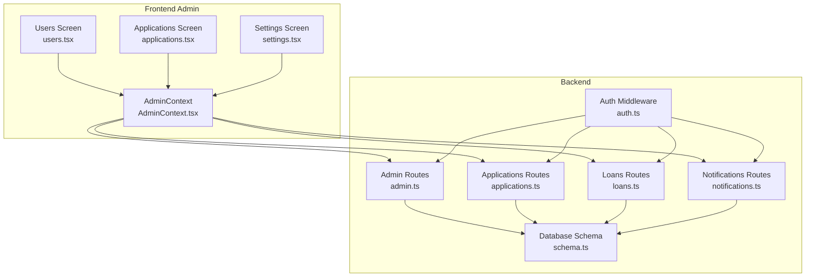
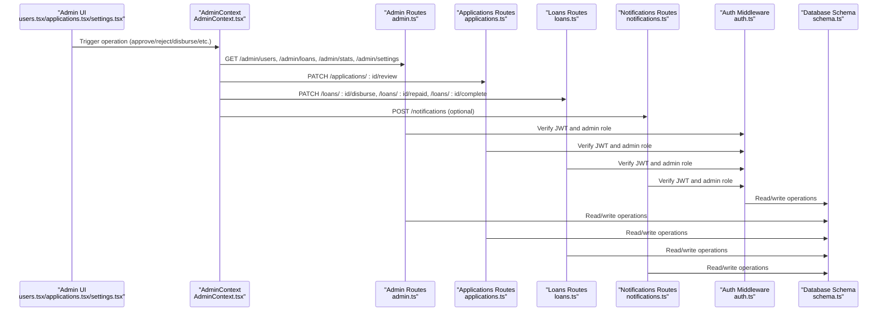
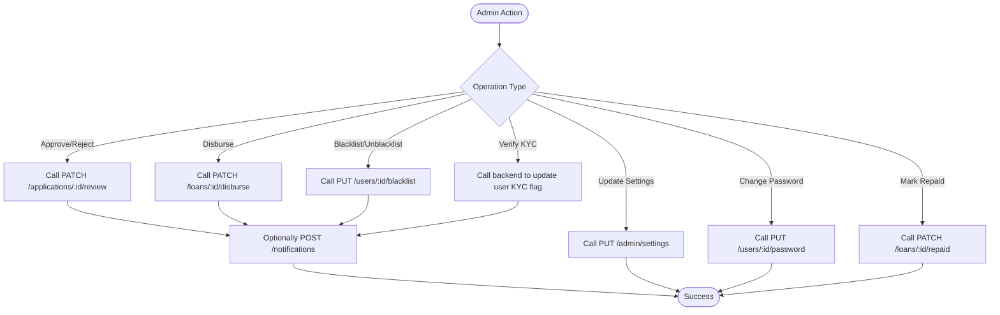
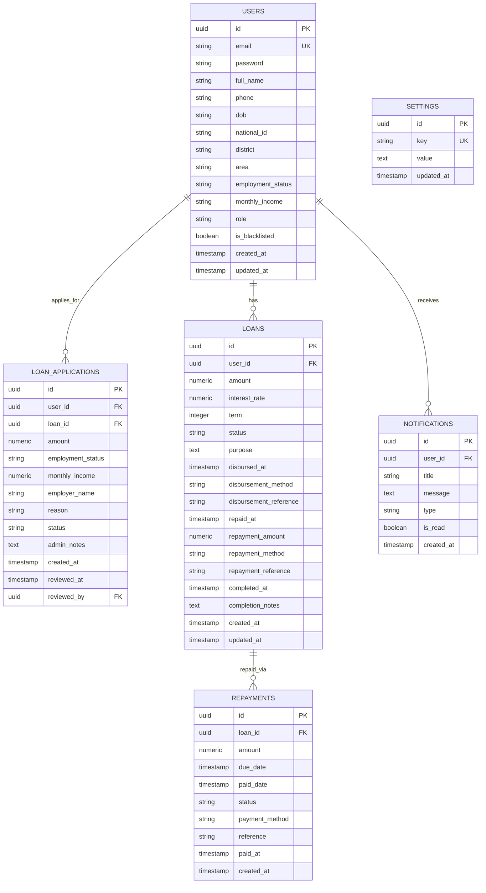
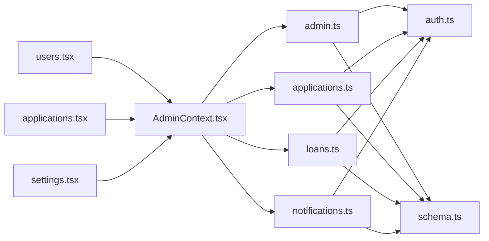

# Administrative API

<cite>
**Referenced Files in This Document**
- [admin.ts](file://backend/src/routes/admin.ts)
- [auth.ts](file://backend/src/middleware/auth.ts)
- [schema.ts](file://backend/src/db/schema.ts)
- [applications.ts](file://backend/src/routes/applications.ts)
- [loans.ts](file://backend/src/routes/loans.ts)
- [notifications.ts](file://backend/src/routes/notifications.ts)
- [AdminContext.tsx](file://contexts/AdminContext.tsx)
- [users.tsx](file://app/admin/(tabs)/users.tsx)
- [applications.tsx](file://app/admin/(tabs)/applications.tsx)
- [settings.tsx](file://app/admin/(tabs)/settings.tsx)
- [auth.ts](file://backend/src/routes/auth.ts)
</cite>

## Table of Contents
1. [Introduction](#introduction)
2. [Project Structure](#project-structure)
3. [Core Components](#core-components)
4. [Architecture Overview](#architecture-overview)
5. [Detailed Component Analysis](#detailed-component-analysis)
6. [Dependency Analysis](#dependency-analysis)
7. [Performance Considerations](#performance-considerations)
8. [Troubleshooting Guide](#troubleshooting-guide)
9. [Conclusion](#conclusion)
10. [Appendices](#appendices)

## Introduction
This document provides comprehensive API documentation for administrative endpoints powering the Phoenix Loan platform. It covers admin user management, loan officer controls, system configuration, and reporting capabilities. It also explains administrative workflows such as user verification, blacklist management, and system settings modification, along with concrete examples of admin operations, bulk-like management via paginated lists, and configuration changes. Security considerations, authentication requirements, role-based permissions, and audit logging are addressed alongside practical guidance for performance and troubleshooting.

## Project Structure
The administrative functionality spans backend routes, middleware, database schema, and frontend admin screens:
- Backend routes expose admin endpoints for users, loans/applications, settings, and statistics.
- Middleware enforces JWT-based authentication and admin-only access.
- Database schema defines users, loans, applications, repayments, notifications, and settings.
- Frontend admin screens orchestrate admin operations and synchronize state with backend endpoints.

**Diagram sources**
- [admin.ts:1-171](file://backend/src/routes/admin.ts#L1-L171)
- [auth.ts:1-48](file://backend/src/middleware/auth.ts#L1-L48)
- [schema.ts:1-146](file://backend/src/db/schema.ts#L1-L146)
- [applications.ts:1-168](file://backend/src/routes/applications.ts#L1-L168)
- [loans.ts:1-320](file://backend/src/routes/loans.ts#L1-L320)
- [notifications.ts:1-106](file://backend/src/routes/notifications.ts#L1-L106)
- [AdminContext.tsx:1-528](file://contexts/AdminContext.tsx#L1-L528)
- [users.tsx](file://app/admin/(tabs)/users.tsx#L1-L530)
- [applications.tsx](file://app/admin/(tabs)/applications.tsx#L1-L457)
- [settings.tsx](file://app/admin/(tabs)/settings.tsx#L1-L493)

**Section sources**
- [admin.ts:1-171](file://backend/src/routes/admin.ts#L1-L171)
- [auth.ts:1-48](file://backend/src/middleware/auth.ts#L1-L48)
- [schema.ts:1-146](file://backend/src/db/schema.ts#L1-L146)
- [applications.ts:1-168](file://backend/src/routes/applications.ts#L1-L168)
- [loans.ts:1-320](file://backend/src/routes/loans.ts#L1-L320)
- [notifications.ts:1-106](file://backend/src/routes/notifications.ts#L1-L106)
- [AdminContext.tsx:1-528](file://contexts/AdminContext.tsx#L1-L528)
- [users.tsx](file://app/admin/(tabs)/users.tsx#L1-L530)
- [applications.tsx](file://app/admin/(tabs)/applications.tsx#L1-L457)
- [settings.tsx](file://app/admin/(tabs)/settings.tsx#L1-L493)

## Core Components
- Admin routes: Provide paginated user and loan lists, dashboard statistics, and system settings retrieval and updates.
- Authentication and authorization middleware: Enforce JWT-based authentication and admin-only access.
- Database schema: Defines entities and relationships for users, loans, applications, repayments, notifications, and settings.
- Admin frontend context and screens: Orchestrate admin operations, manage state, and call backend endpoints.

Key responsibilities:
- Admin user management: Fetch users with pagination, verify KYC, blacklist/unblacklist users, update credit scores and loan limits, change passwords.
- Loan officer controls: Approve/reject applications, disburse loans, mark loans as repaid/completed.
- System configuration: Manage interest rates, penalties, processing fees, loan parameters, and disbursement channels.
- Reporting and analytics: Retrieve dashboard statistics and derive revenue metrics client-side.

**Section sources**
- [admin.ts:8-171](file://backend/src/routes/admin.ts#L8-L171)
- [auth.ts:10-47](file://backend/src/middleware/auth.ts#L10-L47)
- [schema.ts:4-96](file://backend/src/db/schema.ts#L4-L96)
- [AdminContext.tsx:77-521](file://contexts/AdminContext.tsx#L77-L521)
- [users.tsx](file://app/admin/(tabs)/users.tsx#L111-L335)
- [applications.tsx](file://app/admin/(tabs)/applications.tsx#L25-L250)
- [settings.tsx](file://app/admin/(tabs)/settings.tsx#L174-L407)

## Architecture Overview
Administrative operations flow from the admin frontend through the context layer to backend routes, enforced by middleware, and persisted via the database schema.

**Diagram sources**
- [admin.ts:1-171](file://backend/src/routes/admin.ts#L1-L171)
- [applications.ts:140-165](file://backend/src/routes/applications.ts#L140-L165)
- [loans.ts:224-317](file://backend/src/routes/loans.ts#L224-L317)
- [notifications.ts:71-90](file://backend/src/routes/notifications.ts#L71-L90)
- [auth.ts:10-47](file://backend/src/middleware/auth.ts#L10-L47)
- [schema.ts:4-96](file://backend/src/db/schema.ts#L4-L96)
- [AdminContext.tsx:311-413](file://contexts/AdminContext.tsx#L311-L413)
- [users.tsx](file://app/admin/(tabs)/users.tsx#L318-L335)
- [applications.tsx](file://app/admin/(tabs)/applications.tsx#L170-L250)
- [settings.tsx](file://app/admin/(tabs)/settings.tsx#L188-L196)

## Detailed Component Analysis

### Admin Authentication and Authorization
- JWT-based authentication: Requests must include an Authorization header with a Bearer token.
- Role enforcement: Admin-only endpoints require the user’s role to be admin.
- Token payload includes user identity and role for downstream authorization checks.

Security considerations:
- Use HTTPS in production.
- Store JWT_SECRET securely.
- Enforce strict CORS and origin policies.
- Log unauthorized attempts and consider rate limiting.

**Section sources**
- [auth.ts:10-47](file://backend/src/middleware/auth.ts#L10-L47)

### Admin User Management Endpoints
- GET /admin/users
  - Purpose: Paginated retrieval of users with derived fields (credit score, loan limit, KYC verification).
  - Query parameters: page, limit (capped at 100).
  - Response: users array and pagination metadata.
  - Example operation: Bulk viewing users for verification and blacklist decisions.

- PUT /admin/settings
  - Purpose: Upsert system settings as key-value pairs stored as JSON.
  - Request body: Arbitrary JSON object representing settings.
  - Response: Success message upon update.

- GET /admin/settings
  - Purpose: Retrieve current system settings.
  - Response: settings object with parsed values.

- GET /admin/stats
  - Purpose: Dashboard statistics (total users, total loans, active/complete counts, total disbursed).
  - Response: stats object with aggregated metrics.

- GET /admin/loans
  - Purpose: Paginated retrieval of loan applications with associated user data.
  - Query parameters: page, limit (capped at 100).
  - Response: loans array enriched with user details and pagination metadata.

- GET /users/:id/password
  - Purpose: Change a user’s password (frontend-triggered).
  - Request body: { password: "<new_password>" }.
  - Response: Success or error.

- PUT /users/:id/blacklist
  - Purpose: Toggle a user’s blacklist status.
  - Response: Updated user object reflecting isBlacklisted.

- PATCH /applications/:id/review
  - Purpose: Approve or reject a loan application; optionally attach admin notes.
  - Request body: { status: "approved|rejected", adminNotes?: string }.
  - Response: Updated application.

- PATCH /loans/:id/disburse
  - Purpose: Mark a loan as disbursed with disbursement method and reference.
  - Request body: { disbursementMethod: string, disbursementReference: string }.
  - Response: Updated loan.

- PATCH /loans/:id/repaid
  - Purpose: Mark a loan as repaid with repayment details; creates a repayment record.
  - Request body: { repaymentAmount: number, repaymentMethod: string, repaymentReference: string }.
  - Response: Updated loan.

- POST /notifications
  - Purpose: Send a notification to a user (used by admin actions).
  - Headers: X-User-Id to target recipient.
  - Request body: { title: string, message: string, type: string }.
  - Response: Created notification.

Operational workflows:
- User verification: Approve application → send success notification → optionally disburse.
- Blacklist management: Toggle blacklist status per user; affects eligibility and access.
- Bulk-like management: Use pagination to iterate through users and apply batch-style operations (e.g., verify KYC, update credit scores, adjust loan limits).

**Section sources**
- [admin.ts:8-171](file://backend/src/routes/admin.ts#L8-L171)
- [applications.ts:140-165](file://backend/src/routes/applications.ts#L140-L165)
- [loans.ts:224-317](file://backend/src/routes/loans.ts#L224-L317)
- [notifications.ts:71-90](file://backend/src/routes/notifications.ts#L71-L90)
- [users.tsx](file://app/admin/(tabs)/users.tsx#L318-L335)
- [applications.tsx](file://app/admin/(tabs)/applications.tsx#L170-L250)
- [settings.tsx](file://app/admin/(tabs)/settings.tsx#L188-L196)

### Admin Frontend Operations and Workflows
- Users screen:
  - Search and filter users.
  - Actions: Verify KYC, set loan limit, edit credit score, blacklist/unblacklist, change password.
  - Uses AdminContext to call backend endpoints and update local state.

- Applications screen:
  - Filter by status, approve/reject, disburse, or mark as repaid.
  - Uses AdminContext to call backend endpoints and update local state.

- Settings screen:
  - Configure interest rates, penalties, processing fee, loan parameters, and disbursement channels.
  - Save settings to backend via PUT /admin/settings.

**Diagram sources**
- [users.tsx](file://app/admin/(tabs)/users.tsx#L318-L335)
- [applications.tsx](file://app/admin/(tabs)/applications.tsx#L170-L250)
- [settings.tsx](file://app/admin/(tabs)/settings.tsx#L188-L196)
- [applications.ts:140-165](file://backend/src/routes/applications.ts#L140-L165)
- [loans.ts:224-317](file://backend/src/routes/loans.ts#L224-L317)
- [notifications.ts:71-90](file://backend/src/routes/notifications.ts#L71-L90)

**Section sources**
- [users.tsx](file://app/admin/(tabs)/users.tsx#L111-L335)
- [applications.tsx](file://app/admin/(tabs)/applications.tsx#L25-L250)
- [settings.tsx](file://app/admin/(tabs)/settings.tsx#L174-L407)
- [AdminContext.tsx:311-478](file://contexts/AdminContext.tsx#L311-L478)

### Data Models and Relationships

**Diagram sources**
- [schema.ts:4-96](file://backend/src/db/schema.ts#L4-L96)

**Section sources**
- [schema.ts:4-96](file://backend/src/db/schema.ts#L4-L96)

## Dependency Analysis
- Admin routes depend on Drizzle ORM for database access and on the auth middleware for authorization.
- Frontend AdminContext orchestrates calls to admin routes and maintains local state for users, loans, and settings.
- Applications and Loans routes support admin operations and integrate with Notifications for user communication.

**Diagram sources**
- [admin.ts:1-171](file://backend/src/routes/admin.ts#L1-L171)
- [auth.ts:1-48](file://backend/src/middleware/auth.ts#L1-L48)
- [schema.ts:1-146](file://backend/src/db/schema.ts#L1-L146)
- [applications.ts:1-168](file://backend/src/routes/applications.ts#L1-L168)
- [loans.ts:1-320](file://backend/src/routes/loans.ts#L1-L320)
- [notifications.ts:1-106](file://backend/src/routes/notifications.ts#L1-L106)
- [AdminContext.tsx:1-528](file://contexts/AdminContext.tsx#L1-L528)
- [users.tsx](file://app/admin/(tabs)/users.tsx#L1-L530)
- [applications.tsx](file://app/admin/(tabs)/applications.tsx#L1-L457)
- [settings.tsx](file://app/admin/(tabs)/settings.tsx#L1-L493)

**Section sources**
- [admin.ts:1-171](file://backend/src/routes/admin.ts#L1-L171)
- [auth.ts:1-48](file://backend/src/middleware/auth.ts#L1-L48)
- [schema.ts:1-146](file://backend/src/db/schema.ts#L1-L146)
- [applications.ts:1-168](file://backend/src/routes/applications.ts#L1-L168)
- [loans.ts:1-320](file://backend/src/routes/loans.ts#L1-L320)
- [notifications.ts:1-106](file://backend/src/routes/notifications.ts#L1-L106)
- [AdminContext.tsx:1-528](file://contexts/AdminContext.tsx#L1-L528)
- [users.tsx](file://app/admin/(tabs)/users.tsx#L1-L530)
- [applications.tsx](file://app/admin/(tabs)/applications.tsx#L1-L457)
- [settings.tsx](file://app/admin/(tabs)/settings.tsx#L1-L493)

## Performance Considerations
- Pagination: Admin endpoints support page and limit parameters with a maximum limit of 100 to prevent oversized payloads.
- Aggregation queries: Stats endpoint uses database-level aggregations for efficient computation.
- Single-pass user enrichment: Loan listings fetch user data in a single query to avoid N+1 selects.
- Client caching: AdminContext caches loan data locally and refreshes from server on demand.

Recommendations:
- Use limit and page parameters consistently for large datasets.
- Prefer server-side filtering and sorting where applicable.
- Monitor database query plans for joins and aggregations.

**Section sources**
- [admin.ts:10-47](file://backend/src/routes/admin.ts#L10-L47)
- [admin.ts:96-125](file://backend/src/routes/admin.ts#L96-L125)
- [admin.ts:67-84](file://backend/src/routes/admin.ts#L67-L84)
- [AdminContext.tsx:200-285](file://contexts/AdminContext.tsx#L200-L285)

## Troubleshooting Guide
Common issues and resolutions:
- Unauthorized access: Ensure Authorization header with a valid Bearer token is present; admin role is required for admin endpoints.
- Invalid token: Verify JWT_SECRET correctness and token expiration.
- Internal server errors: Check backend logs for SQL exceptions or middleware failures.
- Notification delivery: Confirm X-User-Id header is set when posting notifications.
- Settings persistence: Validate that PUT /admin/settings receives a valid JSON object.

Audit logging recommendations:
- Log all admin actions (approve/reject/disburse/mark repaid/blacklist/update settings).
- Track timestamps, admin actor, affected records, and outcomes.
- Retain logs for compliance and incident response.

**Section sources**
- [auth.ts:10-47](file://backend/src/middleware/auth.ts#L10-L47)
- [notifications.ts:71-90](file://backend/src/routes/notifications.ts#L71-L90)
- [admin.ts:146-168](file://backend/src/routes/admin.ts#L146-L168)

## Conclusion
The administrative API provides a robust foundation for managing users, processing loan applications, configuring system parameters, and generating reports. With JWT-based authentication, admin-only enforcement, and a clear separation between frontend orchestration and backend routes, the system supports secure and scalable admin workflows. Following the security and performance recommendations herein will help maintain reliability and trust in production environments.

## Appendices

### API Reference Summary

- Authentication
  - Header: Authorization: Bearer <token>
  - Role: admin required for admin endpoints

- Admin Endpoints
  - GET /admin/users?page&limit
  - GET /admin/loans?page&limit
  - GET /admin/stats
  - GET /admin/settings
  - PUT /admin/settings
  - PUT /users/:id/blacklist
  - PUT /users/:id/password
  - PATCH /applications/:id/review
  - PATCH /loans/:id/disburse
  - PATCH /loans/:id/repaid
  - POST /notifications

- Example Admin Operations
  - Approve application: PATCH /applications/:id/review with status approved
  - Disburse loan: PATCH /loans/:id/disburse with method and reference
  - Mark repaid: PATCH /loans/:id/repaid with repayment details
  - Update settings: PUT /admin/settings with configuration object
  - Toggle blacklist: PUT /users/:id/blacklist
  - Change password: PUT /users/:id/password

[No sources needed since this section summarizes previously analyzed content]