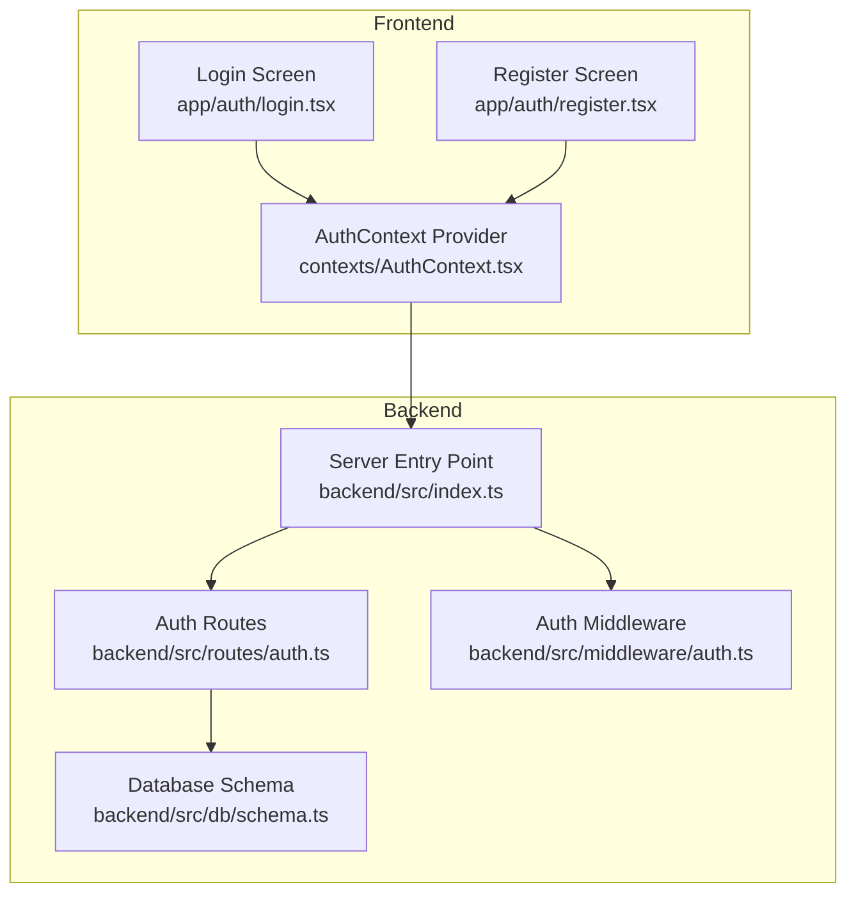
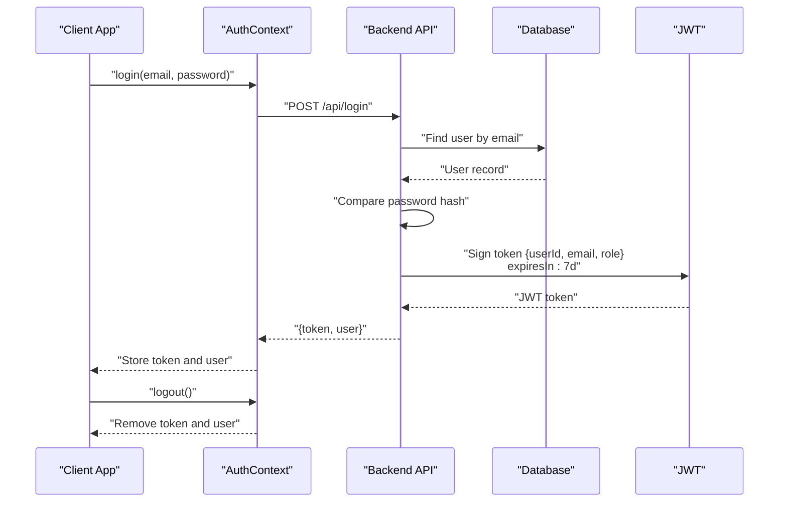
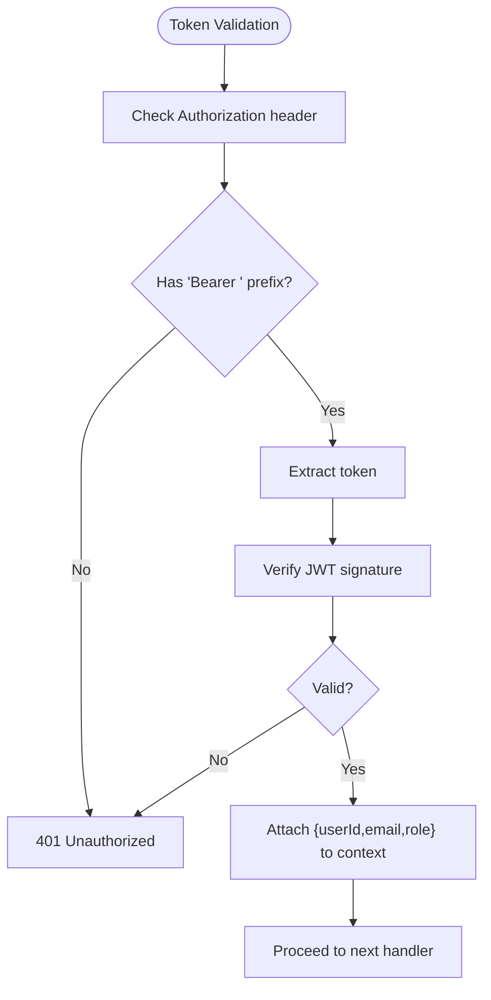
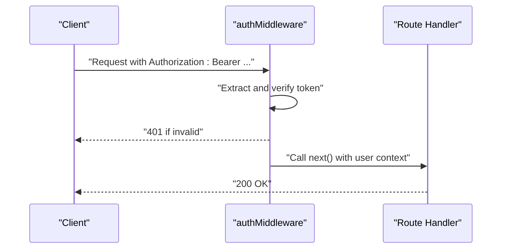
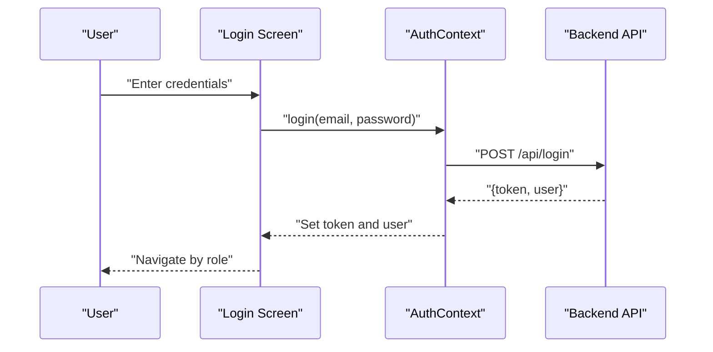
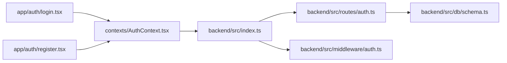

# Authentication API

<cite>
**Referenced Files in This Document**
- [auth.ts](file://backend/src/routes/auth.ts)
- [auth.ts](file://backend/src/middleware/auth.ts)
- [index.ts](file://backend/src/index.ts)
- [schema.ts](file://backend/src/db/schema.ts)
- [AuthContext.tsx](file://contexts/AuthContext.tsx)
- [login.tsx](file://app/auth/login.tsx)
- [register.tsx](file://app/auth/register.tsx)
- [index.ts](file://backend/src/index.ts)
- [package.json](file://backend/package.json)
</cite>

## Table of Contents
1. [Introduction](#introduction)
2. [Project Structure](#project-structure)
3. [Core Components](#core-components)
4. [Architecture Overview](#architecture-overview)
5. [Detailed Component Analysis](#detailed-component-analysis)
6. [Dependency Analysis](#dependency-analysis)
7. [Performance Considerations](#performance-considerations)
8. [Troubleshooting Guide](#troubleshooting-guide)
9. [Conclusion](#conclusion)

## Introduction
This document provides comprehensive API documentation for the authentication endpoints in the Phoenix Loan application. It covers login, registration, and logout flows, along with JWT token generation, validation, and refresh mechanisms. It also explains the authentication middleware, token expiration policies, user registration validation rules, and security measures. The document includes concrete examples of requests and responses, parameter specifications, error handling, and best practices for session management and security.

## Project Structure
The authentication system spans the backend API server, database schema, and the frontend React Native application with an authentication context. The backend exposes REST endpoints under /api, while the frontend consumes these endpoints via an AuthContext provider.

**Diagram sources**
- [index.ts:54-61](file://backend/src/index.ts#L54-L61)
- [auth.ts:10-145](file://backend/src/routes/auth.ts#L10-L145)
- [auth.ts:10-36](file://backend/src/middleware/auth.ts#L10-L36)
- [schema.ts:4-21](file://backend/src/db/schema.ts#L4-L21)
- [AuthContext.tsx:56-119](file://contexts/AuthContext.tsx#L56-L119)
- [login.tsx:101-134](file://app/auth/login.tsx#L101-L134)
- [register.tsx:237-250](file://app/auth/register.tsx#L237-L250)

**Section sources**
- [index.ts:54-61](file://backend/src/index.ts#L54-L61)
- [auth.ts:10-145](file://backend/src/routes/auth.ts#L10-L145)
- [auth.ts:10-36](file://backend/src/middleware/auth.ts#L10-L36)
- [schema.ts:4-21](file://backend/src/db/schema.ts#L4-L21)
- [AuthContext.tsx:56-119](file://contexts/AuthContext.tsx#L56-L119)
- [login.tsx:101-134](file://app/auth/login.tsx#L101-L134)
- [register.tsx:237-250](file://app/auth/register.tsx#L237-L250)

## Core Components
- Backend authentication routes (/api/login, /api/register)
- Authentication middleware for protected routes
- Frontend AuthContext for login, register, and logout
- Database schema for user records and roles
- JWT configuration and token policies

**Section sources**
- [auth.ts:33-93](file://backend/src/routes/auth.ts#L33-L93)
- [auth.ts:96-143](file://backend/src/routes/auth.ts#L96-L143)
- [auth.ts:10-36](file://backend/src/middleware/auth.ts#L10-L36)
- [schema.ts:4-21](file://backend/src/db/schema.ts#L4-L21)
- [AuthContext.tsx:56-119](file://contexts/AuthContext.tsx#L56-L119)

## Architecture Overview
The authentication flow consists of:
- Frontend screens submit credentials to the backend via AuthContext.
- Backend validates input, checks user existence and passwords, and issues JWT tokens.
- Subsequent requests include Authorization: Bearer tokens validated by middleware.
- Protected routes can enforce admin-only access.

**Diagram sources**
- [AuthContext.tsx:56-79](file://contexts/AuthContext.tsx#L56-L79)
- [auth.ts:96-143](file://backend/src/routes/auth.ts#L96-L143)
- [schema.ts:4-21](file://backend/src/db/schema.ts#L4-L21)

**Section sources**
- [AuthContext.tsx:56-79](file://contexts/AuthContext.tsx#L56-L79)
- [auth.ts:96-143](file://backend/src/routes/auth.ts#L96-L143)
- [schema.ts:4-21](file://backend/src/db/schema.ts#L4-L21)

## Detailed Component Analysis

### Authentication Endpoints

#### POST /api/register
- Purpose: Create a new user account with KYC fields.
- Request body schema:
  - email: string (required, valid email)
  - password: string (required, minimum length 6)
  - fullName: string (required, minimum length 2)
  - phone: string (optional)
  - dob: string (optional)
  - nationalId: string (optional)
  - district: string (optional)
  - area: string (optional)
  - employmentStatus: string (optional)
  - monthlyIncome: string (optional)
- Response:
  - 201 Created: { message, user, token }
  - 400 Bad Request: { error } if email already exists
  - 500 Internal Server Error: { error }
- Notes:
  - Password is hashed before storage.
  - Token issued with 7-day expiration.
  - Role defaults to "user".

Example request:
- POST /api/register
- Headers: Content-Type: application/json
- Body: {"email":"user@example.com","password":"pass123","fullName":"John Doe","phone":"+265999123456"}

Example response (success):
- 201 Created
- Body: {"message":"Registration successful","user":{"id":"...","email":"user@example.com","fullName":"John Doe","role":"user"},"token":"<JWT>"}

**Section sources**
- [auth.ts:13-25](file://backend/src/routes/auth.ts#L13-L25)
- [auth.ts:33-93](file://backend/src/routes/auth.ts#L33-L93)
- [schema.ts:4-21](file://backend/src/db/schema.ts#L4-L21)

#### POST /api/login
- Purpose: Authenticate an existing user.
- Request body schema:
  - email: string (required, valid email)
  - password: string (required)
- Response:
  - 200 OK: { message, user (without password), token }
  - 401 Unauthorized: { error } if user not found or invalid credentials
  - 500 Internal Server Error: { error }
- Notes:
  - Token issued with 7-day expiration.
  - Role included in token payload.

Example request:
- POST /api/login
- Headers: Content-Type: application/json
- Body: {"email":"user@example.com","password":"pass123"}

Example response (success):
- 200 OK
- Body: {"message":"Login successful","user":{"id":"...","email":"user@example.com","fullName":"John Doe","role":"user"},"token":"<JWT>"}

**Section sources**
- [auth.ts:27-30](file://backend/src/routes/auth.ts#L27-L30)
- [auth.ts:96-143](file://backend/src/routes/auth.ts#L96-L143)
- [schema.ts:4-21](file://backend/src/db/schema.ts#L4-L21)

#### Logout
- Purpose: Clear local session state.
- Frontend behavior:
  - Removes stored token and user from AsyncStorage.
  - No server-side token invalidation endpoint is defined.
- Implementation:
  - AuthContext.logout removes AsyncStorage items and clears state.

Example invocation:
- AuthContext.logout()

**Section sources**
- [AuthContext.tsx:114-119](file://contexts/AuthContext.tsx#L114-L119)

### JWT Token Generation, Validation, and Expiration
- Generation:
  - Payload includes: userId, email, role.
  - Secret: process.env.JWT_SECRET.
  - Expiration: 7 days.
- Validation:
  - Middleware extracts Authorization header, verifies Bearer token, decodes payload, and attaches user info to context.
- Refresh mechanism:
  - Not implemented in current codebase. Clients should re-authenticate after token expiry.

**Diagram sources**
- [auth.ts:10-36](file://backend/src/middleware/auth.ts#L10-L36)

**Section sources**
- [auth.ts:70-74](file://backend/src/routes/auth.ts#L70-L74)
- [auth.ts:122-127](file://backend/src/routes/auth.ts#L122-L127)
- [auth.ts:10-36](file://backend/src/middleware/auth.ts#L10-L36)

### Authentication Middleware and Admin Access
- authMiddleware:
  - Validates Authorization header.
  - Verifies JWT and sets context variables: userId, email, role.
- adminMiddleware:
  - Enforces role-based access requiring role == "admin".
- Usage:
  - Apply authMiddleware to protected routes.
  - Apply adminMiddleware for admin-only endpoints.

**Diagram sources**
- [auth.ts:10-36](file://backend/src/middleware/auth.ts#L10-L36)

**Section sources**
- [auth.ts:10-36](file://backend/src/middleware/auth.ts#L10-L36)
- [auth.ts:39-47](file://backend/src/middleware/auth.ts#L39-L47)

### Frontend Authentication Flow (Screens and Context)
- Login screen:
  - Collects email and password.
  - Calls AuthContext.login, navigates based on role.
- Register screen:
  - Multi-step form collecting personal, residence, and security details.
  - Calls AuthContext.register, stores token and user.
- AuthContext:
  - Provides login, register, logout methods.
  - Persists token and user to AsyncStorage.
  - Uses EXPO_PUBLIC_API_URL for backend base URL.

**Diagram sources**
- [login.tsx:101-134](file://app/auth/login.tsx#L101-L134)
- [AuthContext.tsx:56-79](file://contexts/AuthContext.tsx#L56-L79)

**Section sources**
- [login.tsx:80-134](file://app/auth/login.tsx#L80-L134)
- [register.tsx:178-250](file://app/auth/register.tsx#L178-L250)
- [AuthContext.tsx:56-119](file://contexts/AuthContext.tsx#L56-L119)

### User Registration Validation Rules
- Backend validation (Zod):
  - email: valid email format.
  - password: minimum 6 characters.
  - fullName: minimum 2 characters.
  - Optional fields: phone, dob, nationalId, district, area, employmentStatus, monthlyIncome.
- Frontend validation (multi-step):
  - Personal info: fullName, phone (valid international pattern), email, dob, nationalId.
  - Residence: district selection, area, employmentStatus, monthlyIncome.
  - Security: password min length 6, confirm password must match.

**Section sources**
- [auth.ts:13-25](file://backend/src/routes/auth.ts#L13-L25)
- [register.tsx:198-225](file://app/auth/register.tsx#L198-L225)

### Password Strength Requirements
- Minimum 6 characters enforced by both frontend and backend.
- Passwords are hashed using bcrypt before storage.

**Section sources**
- [auth.ts:15-47](file://backend/src/routes/auth.ts#L15-L47)
- [register.tsx:219-224](file://app/auth/register.tsx#L219-L224)

### Account Verification Processes
- No explicit email verification or account activation endpoint is implemented in the backend routes.
- KYC fields are collected during registration but no verification status is exposed in the returned user object.

**Section sources**
- [auth.ts:33-93](file://backend/src/routes/auth.ts#L33-L93)
- [schema.ts:4-21](file://backend/src/db/schema.ts#L4-L21)

### Session Management and Token Expiration
- Token lifetime: 7 days.
- No refresh endpoint is implemented; clients should re-authenticate after expiry.
- Frontend stores token and user in AsyncStorage for persistence across sessions.

**Section sources**
- [auth.ts:70-74](file://backend/src/routes/auth.ts#L70-L74)
- [AuthContext.tsx:70-74](file://contexts/AuthContext.tsx#L70-L74)

### Security Measures
- Password hashing with bcrypt.
- JWT-based stateless authentication with secret key.
- CORS configured for allowed origins and credentials.
- Role-based access control via adminMiddleware.

**Section sources**
- [auth.ts:47-47](file://backend/src/routes/auth.ts#L47-L47)
- [auth.ts:10-36](file://backend/src/middleware/auth.ts#L10-L36)
- [index.ts:21-26](file://backend/src/index.ts#L21-L26)
- [auth.ts:39-47](file://backend/src/middleware/auth.ts#L39-L47)

## Dependency Analysis
- Backend dependencies:
  - Hono for routing and middleware.
  - jsonwebtoken for JWT signing/verification.
  - bcryptjs for password hashing.
  - Zod and @hono/zod-validator for request validation.
  - Drizzle ORM for database operations.
- Frontend dependencies:
  - AsyncStorage for token persistence.
  - AuthContext for centralized auth state.

**Diagram sources**
- [index.ts:54-61](file://backend/src/index.ts#L54-L61)
- [auth.ts:10-145](file://backend/src/routes/auth.ts#L10-L145)
- [auth.ts:10-36](file://backend/src/middleware/auth.ts#L10-L36)
- [schema.ts:4-21](file://backend/src/db/schema.ts#L4-L21)
- [AuthContext.tsx:56-119](file://contexts/AuthContext.tsx#L56-L119)
- [login.tsx:101-134](file://app/auth/login.tsx#L101-L134)
- [register.tsx:237-250](file://app/auth/register.tsx#L237-L250)

**Section sources**
- [package.json:22-34](file://backend/package.json#L22-L34)
- [index.ts:54-61](file://backend/src/index.ts#L54-L61)
- [auth.ts:10-145](file://backend/src/routes/auth.ts#L10-L145)
- [auth.ts:10-36](file://backend/src/middleware/auth.ts#L10-L36)
- [schema.ts:4-21](file://backend/src/db/schema.ts#L4-L21)
- [AuthContext.tsx:56-119](file://contexts/AuthContext.tsx#L56-L119)
- [login.tsx:101-134](file://app/auth/login.tsx#L101-L134)
- [register.tsx:237-250](file://app/auth/register.tsx#L237-L250)

## Performance Considerations
- Token verification is lightweight; ensure JWT_SECRET is strong and environment-specific.
- Avoid excessive logging in production to reduce overhead.
- Consider implementing rate limiting for login/register endpoints to mitigate brute-force attacks.

## Troubleshooting Guide
Common errors and resolutions:
- 400 Bad Request on registration:
  - Cause: Email already registered or invalid input.
  - Resolution: Ensure unique email and meet validation criteria.
- 401 Unauthorized on login:
  - Cause: Missing or invalid Authorization header, or invalid credentials.
  - Resolution: Re-authenticate and ensure correct credentials.
- 500 Internal Server Error:
  - Cause: Unexpected server-side failure.
  - Resolution: Check server logs and environment variables (DATABASE_URL, JWT_SECRET).

**Section sources**
- [auth.ts:42-44](file://backend/src/routes/auth.ts#L42-L44)
- [auth.ts:108-120](file://backend/src/routes/auth.ts#L108-L120)
- [auth.ts:14-16](file://backend/src/middleware/auth.ts#L14-L16)
- [auth.ts:29-31](file://backend/src/middleware/auth.ts#L29-L31)

## Conclusion
The Phoenix Loan authentication system provides secure, stateless JWT-based login and registration with robust validation and role-based access control. While token refresh is not implemented, the system offers clear separation of concerns between frontend and backend, with persistent token storage on the client. Extending the system with email verification, refresh tokens, and enhanced security measures would further strengthen the authentication flow.