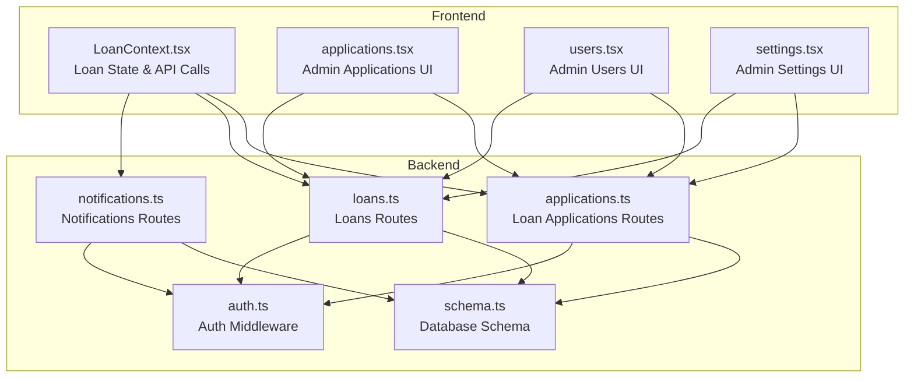
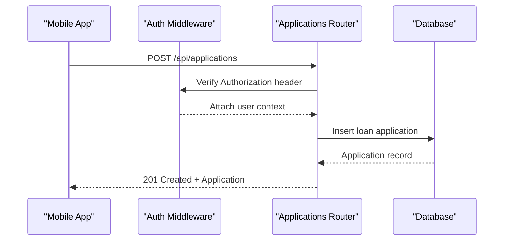
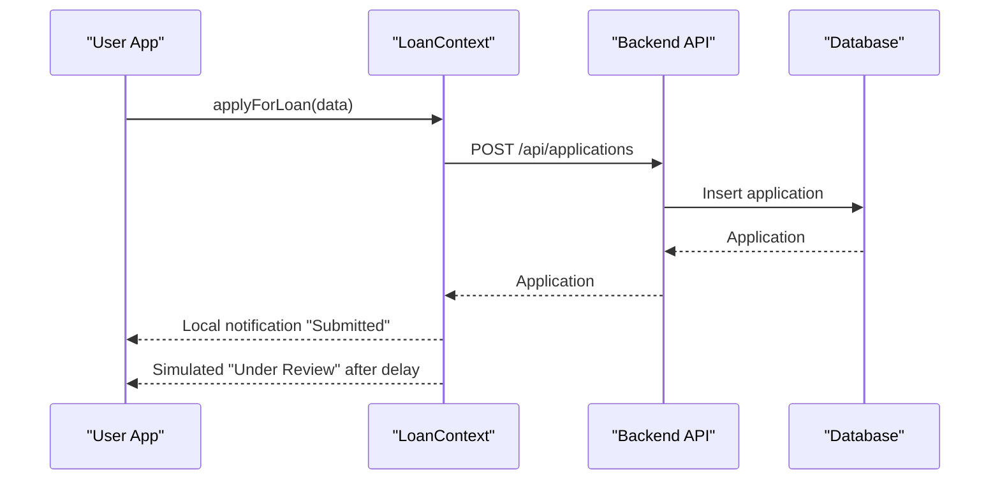
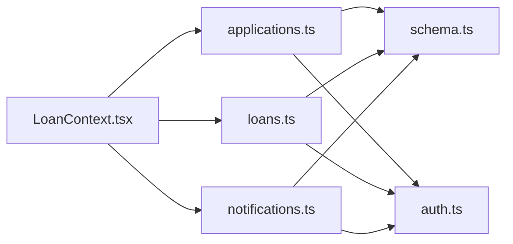

# Loan Management API

<cite>
**Referenced Files in This Document**
- [applications.ts](file://backend/src/routes/applications.ts)
- [loans.ts](file://backend/src/routes/loans.ts)
- [schema.ts](file://backend/src/db/schema.ts)
- [auth.ts](file://backend/src/middleware/auth.ts)
- [notifications.ts](file://backend/src/routes/notifications.ts)
- [LoanContext.tsx](file://contexts/LoanContext.tsx)
- [applications.tsx](file://app/admin/(tabs)/applications.tsx)
- [users.tsx](file://app/admin/(tabs)/users.tsx)
- [settings.tsx](file://app/admin/(tabs)/settings.tsx)
</cite>

## Table of Contents
1. [Introduction](#introduction)
2. [Project Structure](#project-structure)
3. [Core Components](#core-components)
4. [Architecture Overview](#architecture-overview)
5. [Detailed Component Analysis](#detailed-component-analysis)
6. [Dependency Analysis](#dependency-analysis)
7. [Performance Considerations](#performance-considerations)
8. [Troubleshooting Guide](#troubleshooting-guide)
9. [Conclusion](#conclusion)

## Introduction
This document provides comprehensive API documentation for the Phoenix loan management system. It covers endpoints for loan applications and loans, including submission, status updates, retrieval, and administrative controls. It also documents the loan lifecycle, approval workflows, status tracking, and administrative settings. Where applicable, it explains how the frontend consumes the backend APIs and outlines conceptual workflows for loan calculation and repayment scheduling.

## Project Structure
The backend is organized around route handlers grouped by domain (applications, loans, notifications, admin). Data modeling is handled via Drizzle ORM schema definitions. The frontend integrates with the backend through React Native components and context providers.

**Diagram sources**
- [applications.ts:1-168](file://backend/src/routes/applications.ts#L1-L168)
- [loans.ts:1-320](file://backend/src/routes/loans.ts#L1-L320)
- [notifications.ts:1-106](file://backend/src/routes/notifications.ts#L1-L106)
- [schema.ts:1-146](file://backend/src/db/schema.ts#L1-L146)
- [auth.ts:1-48](file://backend/src/middleware/auth.ts#L1-L48)
- [LoanContext.tsx:1-336](file://contexts/LoanContext.tsx#L1-L336)
- [applications.tsx](file://app/admin/(tabs)/applications.tsx#L1-L457)
- [users.tsx](file://app/admin/(tabs)/users.tsx#L1-L530)
- [settings.tsx](file://app/admin/(tabs)/settings.tsx#L1-L493)

**Section sources**
- [applications.ts:1-168](file://backend/src/routes/applications.ts#L1-L168)
- [loans.ts:1-320](file://backend/src/routes/loans.ts#L1-L320)
- [notifications.ts:1-106](file://backend/src/routes/notifications.ts#L1-L106)
- [schema.ts:1-146](file://backend/src/db/schema.ts#L1-L146)
- [auth.ts:1-48](file://backend/src/middleware/auth.ts#L1-L48)
- [LoanContext.tsx:1-336](file://contexts/LoanContext.tsx#L1-L336)
- [applications.tsx](file://app/admin/(tabs)/applications.tsx#L1-L457)
- [users.tsx](file://app/admin/(tabs)/users.tsx#L1-L530)
- [settings.tsx](file://app/admin/(tabs)/settings.tsx#L1-L493)

## Core Components
- Loan Applications API: Handles creation, retrieval, and admin review of loan applications.
- Loans API: Manages loan lifecycle including creation, status updates, disbursement, marking as repaid, and completion.
- Notifications API: Retrieves, marks as read, and manages user notifications.
- Authentication Middleware: Provides JWT-based authentication and admin role checks.
- Database Schema: Defines tables for users, loans, applications, repayments, notifications, and settings.

**Section sources**
- [applications.ts:1-168](file://backend/src/routes/applications.ts#L1-L168)
- [loans.ts:1-320](file://backend/src/routes/loans.ts#L1-L320)
- [notifications.ts:1-106](file://backend/src/routes/notifications.ts#L1-L106)
- [auth.ts:1-48](file://backend/src/middleware/auth.ts#L1-L48)
- [schema.ts:1-146](file://backend/src/db/schema.ts#L1-L146)

## Architecture Overview
The backend exposes REST-like endpoints using Hono. Requests are validated with Zod schemas. Authentication is enforced via middleware. Data persistence is handled by Drizzle ORM against PostgreSQL. The frontend interacts with these endpoints through context hooks and screens.

**Diagram sources**
- [applications.ts:110-138](file://backend/src/routes/applications.ts#L110-L138)
- [auth.ts:10-36](file://backend/src/middleware/auth.ts#L10-L36)

**Section sources**
- [applications.ts:1-168](file://backend/src/routes/applications.ts#L1-L168)
- [auth.ts:1-48](file://backend/src/middleware/auth.ts#L1-L48)

## Detailed Component Analysis

### Loan Applications API
Endpoints for managing loan applications:
- GET /api/applications
  - Description: Retrieve all applications with related user, loan, and reviewer details.
  - Authentication: Requires admin role.
  - Response: applications array.
- GET /api/applications/my-applications
  - Description: Retrieve current user’s applications.
  - Authentication: Requires X-User-Id header.
  - Response: applications array.
- GET /api/applications/:id
  - Description: Retrieve a specific application with related user and loan details.
  - Authentication: Requires admin role.
  - Response: application object.
- POST /api/applications
  - Description: Submit a new loan application.
  - Authentication: Requires X-User-Id header.
  - Request body:
    - amount: string
    - employmentStatus: string
    - monthlyIncome: string
    - employerName: string (optional)
    - reason: string
  - Response: application object.
- PATCH /api/applications/:id/review
  - Description: Admin reviews an application and updates status.
  - Authentication: Requires admin role.
  - Request body:
    - status: enum pending, under_review, approved, rejected
    - adminNotes: string (optional)
  - Response: application object.

Example request (submit application):
- Method: POST
- URL: /api/applications
- Headers: Authorization: Bearer <token>, X-User-Id: <user-id>
- Body:
  - amount: "150000"
  - employmentStatus: "Employed"
  - monthlyIncome: "25000"
  - employerName: "Acme Corp"
  - reason: "Personal loan"

Example response (submit application):
- Status: 201 Created
- Body: { message: "Application submitted successfully", application: { id, amount, status, createdAt, ... } }

Status update operation (admin review):
- Method: PATCH
- URL: /api/applications/:id/review
- Headers: Authorization: Bearer <token>, X-User-Id: <admin-id>
- Body: { status: "approved", adminNotes: "Eligible for funding" }
- Response: { message: "Application reviewed successfully", application: { ... } }

Retrieval query (user applications):
- Method: GET
- URL: /api/applications/my-applications
- Headers: X-User-Id: <user-id>
- Response: { applications: [...] }

**Section sources**
- [applications.ts:24-165](file://backend/src/routes/applications.ts#L24-L165)

### Loans API
Endpoints for managing loans:
- GET /api/loans
  - Description: Retrieve all loans with related user and repayments.
  - Authentication: Requires admin role.
  - Response: loans array.
- GET /api/loans/my-loans
  - Description: Retrieve current user’s loans.
  - Authentication: Requires X-User-Id header.
  - Response: loans array.
- GET /api/loans/:id
  - Description: Retrieve a specific loan with related user and repayments.
  - Authentication: Requires admin role.
  - Response: loan object.
- POST /api/loans
  - Description: Create a new loan.
  - Authentication: Requires X-User-Id header.
  - Request body:
    - amount: string
    - interestRate: string
    - term: number
    - purpose: string (optional)
  - Response: loan object.
- PATCH /api/loans/:id/status
  - Description: Update loan status (admin).
  - Authentication: Requires admin role.
  - Request body: { status: string }
  - Response: loan object.
- PATCH /api/loans/:id/disburse
  - Description: Mark loan as disbursed (admin).
  - Authentication: Requires admin role.
  - Request body: { disbursementMethod: string, disbursementReference: string }
  - Response: loan object.
- PATCH /api/loans/:id/repaid
  - Description: Mark loan as repaid (admin).
  - Authentication: Requires admin role.
  - Request body: { repaymentAmount: string, repaymentMethod: string, repaymentReference: string }
  - Response: loan object.
- PATCH /api/loans/:id/complete
  - Description: Mark loan as completed (admin).
  - Authentication: Requires admin role.
  - Request body: { completionNotes: string }
  - Response: loan object.

Example request (create loan):
- Method: POST
- URL: /api/loans
- Headers: Authorization: Bearer <token>, X-User-Id: <user-id>
- Body: { amount: "150000", interestRate: "12.5", term: 6, purpose: "Personal" }
- Response: { message: "Loan created successfully", loan: { id, amount, interestRate, term, status, ... } }

Example response (disburse loan):
- Status: 200 OK
- Body: { message: "Loan disbursed successfully", loan: { status: "disbursed", disbursedAt, disbursementMethod, disbursementReference, ... } }

Example response (mark as repaid):
- Status: 200 OK
- Body: { message: "Loan marked as repaid", loan: { status: "completed", repaidAt, repaymentAmount, repaymentMethod, repaymentReference, ... } }

**Section sources**
- [loans.ts:92-317](file://backend/src/routes/loans.ts#L92-L317)

### Notifications API
Endpoints for managing notifications:
- GET /api/notifications
  - Description: Retrieve paginated notifications for the current user.
  - Authentication: Requires X-User-Id header.
  - Response: { notifications: [...], unreadCount: number }
- PATCH /api/notifications/:id/read
  - Description: Mark a notification as read.
  - Authentication: Requires admin role.
  - Response: { message: "Notification marked as read" }
- PATCH /api/notifications/read-all
  - Description: Mark all notifications as read for the user.
  - Authentication: Requires X-User-Id header.
  - Response: { message: "All notifications marked as read" }
- POST /api/notifications
  - Description: Create a notification.
  - Authentication: Requires X-User-Id header.
  - Request body: { title: string, message: string, type: string }
  - Response: { notification: { id, title, message, type, isRead, createdAt } }
- DELETE /api/notifications/read
  - Description: Delete all read notifications for the user.
  - Authentication: Requires X-User-Id header.
  - Response: { message: "Read notifications cleared" }

**Section sources**
- [notifications.ts:8-103](file://backend/src/routes/notifications.ts#L8-L103)

### Authentication and Authorization
- Auth middleware:
  - Validates Authorization header bearer token.
  - Decodes JWT and attaches user context (userId, email, role).
  - Returns 401 Unauthorized for invalid or missing tokens.
- Admin middleware:
  - Ensures role is admin; otherwise returns 403 Forbidden.

Usage:
- Apply auth middleware to routes requiring user identity.
- Apply admin middleware to admin-only routes.

**Section sources**
- [auth.ts:10-47](file://backend/src/middleware/auth.ts#L10-L47)

### Frontend Integration and Workflows
- LoanContext (frontend):
  - Submits applications via POST /api/applications.
  - Loads user applications via GET /api/applications/my-applications.
  - Emits local notifications and simulates status transitions.
- Admin screens:
  - AdminApplicationsScreen: Approves, rejects, disburses, and completes loans.
  - AdminUsersScreen: Manages user KYC verification, limits, scores, and passwords.
  - AdminSettingsScreen: Configures interest rates, penalties, processing fees, and disbursement channels.

**Diagram sources**
- [LoanContext.tsx:198-261](file://contexts/LoanContext.tsx#L198-L261)
- [applications.ts:110-138](file://backend/src/routes/applications.ts#L110-L138)

**Section sources**
- [LoanContext.tsx:198-261](file://contexts/LoanContext.tsx#L198-L261)
- [applications.tsx](file://app/admin/(tabs)/applications.tsx#L155-L250)
- [users.tsx](file://app/admin/(tabs)/users.tsx#L278-L335)
- [settings.tsx](file://app/admin/(tabs)/settings.tsx#L174-L196)

## Dependency Analysis
- Route handlers depend on:
  - Drizzle ORM for database operations.
  - Zod schemas for request validation.
  - Auth middleware for authentication and authorization.
- Database schema defines relationships among users, loans, applications, repayments, and notifications.
- Frontend context depends on backend endpoints for data synchronization.

**Diagram sources**
- [applications.ts:1-168](file://backend/src/routes/applications.ts#L1-L168)
- [loans.ts:1-320](file://backend/src/routes/loans.ts#L1-L320)
- [notifications.ts:1-106](file://backend/src/routes/notifications.ts#L1-L106)
- [schema.ts:1-146](file://backend/src/db/schema.ts#L1-L146)
- [auth.ts:1-48](file://backend/src/middleware/auth.ts#L1-L48)
- [LoanContext.tsx:1-336](file://contexts/LoanContext.tsx#L1-L336)

**Section sources**
- [applications.ts:1-168](file://backend/src/routes/applications.ts#L1-L168)
- [loans.ts:1-320](file://backend/src/routes/loans.ts#L1-L320)
- [notifications.ts:1-106](file://backend/src/routes/notifications.ts#L1-L106)
- [schema.ts:1-146](file://backend/src/db/schema.ts#L1-L146)
- [auth.ts:1-48](file://backend/src/middleware/auth.ts#L1-L48)
- [LoanContext.tsx:1-336](file://contexts/LoanContext.tsx#L1-L336)

## Performance Considerations
- Pagination: Admin endpoints support page and limit parameters to avoid large result sets.
- Aggregation queries: Stats endpoint uses COUNT and SUM to compute metrics efficiently.
- Column existence checks: Loans router ensures required columns exist with defensive ALTER TABLE statements.
- Indexing: Consider adding indexes on frequently queried columns (e.g., userId, status, createdAt) in production.

[No sources needed since this section provides general guidance]

## Troubleshooting Guide
Common issues and resolutions:
- Unauthorized Access
  - Symptom: 401 Unauthorized on protected endpoints.
  - Cause: Missing or invalid Authorization header.
  - Resolution: Ensure Bearer token is present and valid.
- Missing User Identity
  - Symptom: 401 Unauthorized on endpoints requiring X-User-Id.
  - Cause: Missing X-User-Id header.
  - Resolution: Include X-User-Id header with a valid user identifier.
- Validation Errors
  - Symptom: 400 Bad Request on POST/PUT/PATCH.
  - Cause: Request body does not match Zod schema.
  - Resolution: Verify field types and required fields per endpoint schema.
- Internal Server Errors
  - Symptom: 500 Internal Server Error.
  - Cause: Database errors or unhandled exceptions.
  - Resolution: Check server logs and ensure database connectivity and migrations are applied.

**Section sources**
- [applications.ts:110-138](file://backend/src/routes/applications.ts#L110-L138)
- [loans.ts:170-197](file://backend/src/routes/loans.ts#L170-L197)
- [notifications.ts:8-33](file://backend/src/routes/notifications.ts#L8-L33)
- [auth.ts:14-31](file://backend/src/middleware/auth.ts#L14-L31)

## Conclusion
The Phoenix loan management system provides a clear set of REST-like endpoints for loan applications and loans, with robust validation, authentication, and administrative controls. The frontend integrates seamlessly with these endpoints to deliver a responsive user experience. The schema supports a complete loan lifecycle, and the admin screens enable effective oversight and configuration.