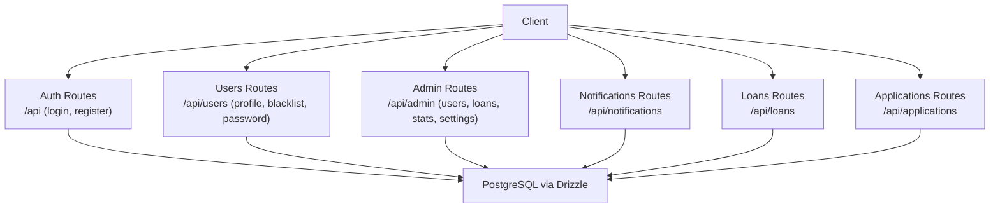
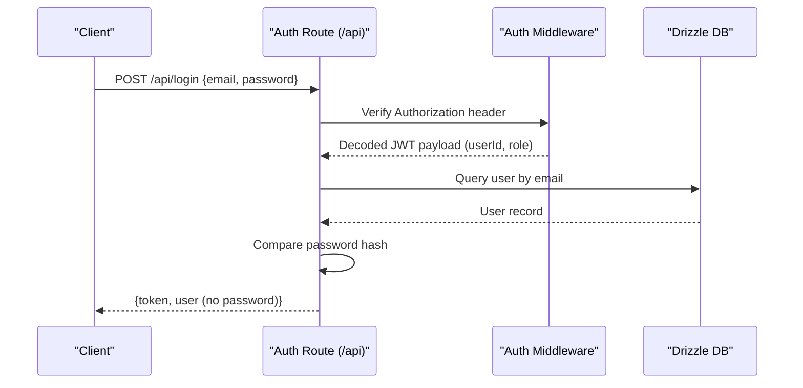
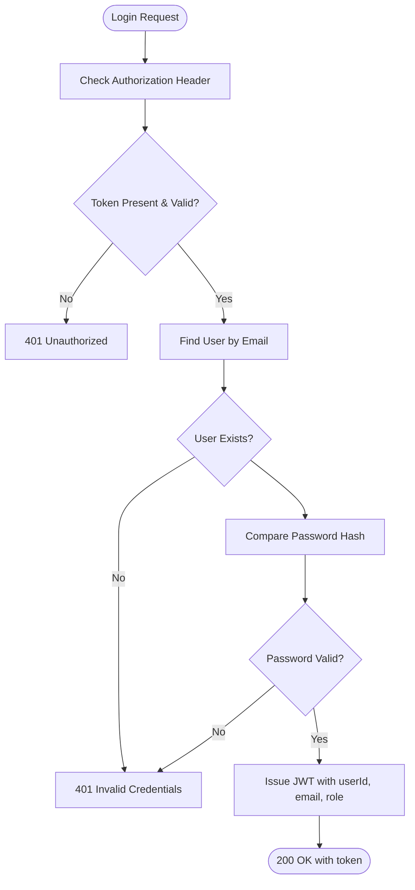
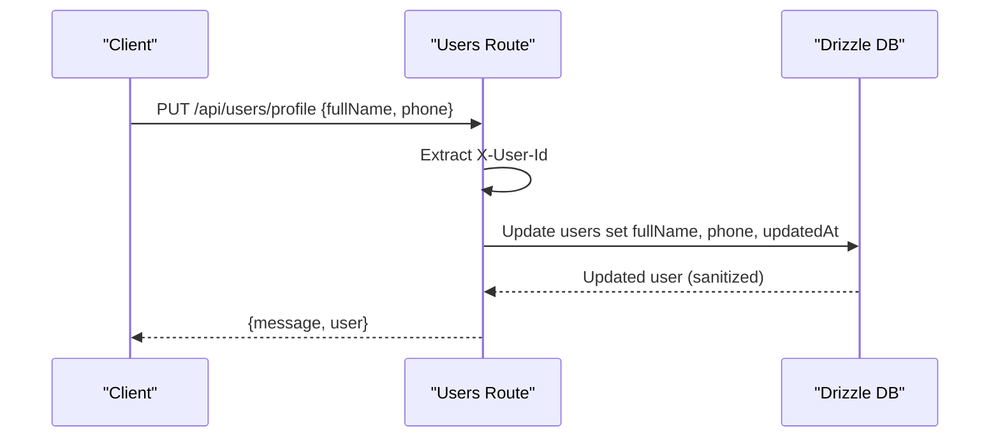
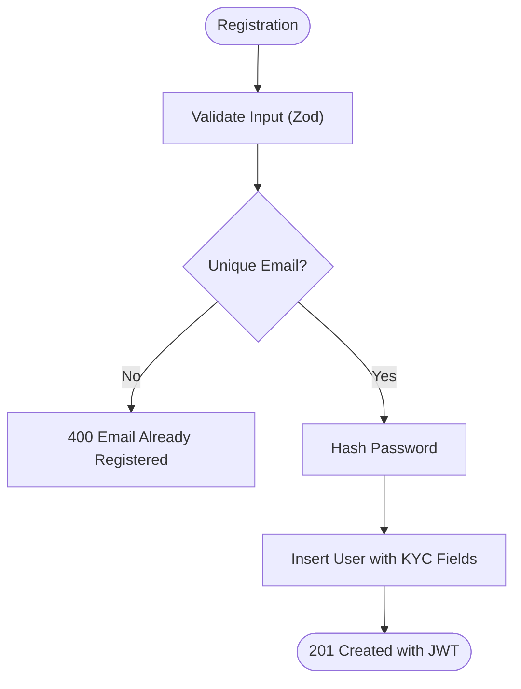
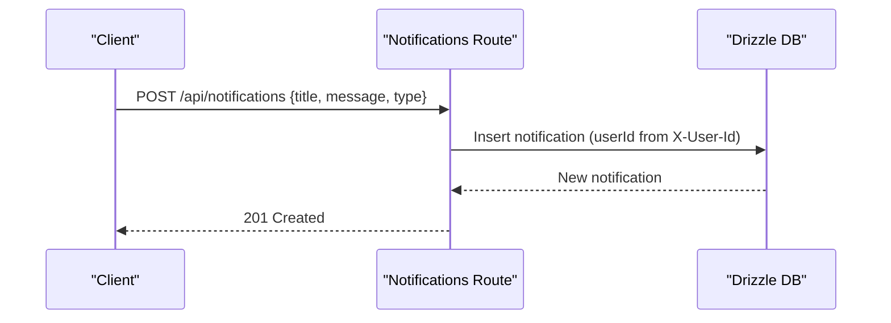
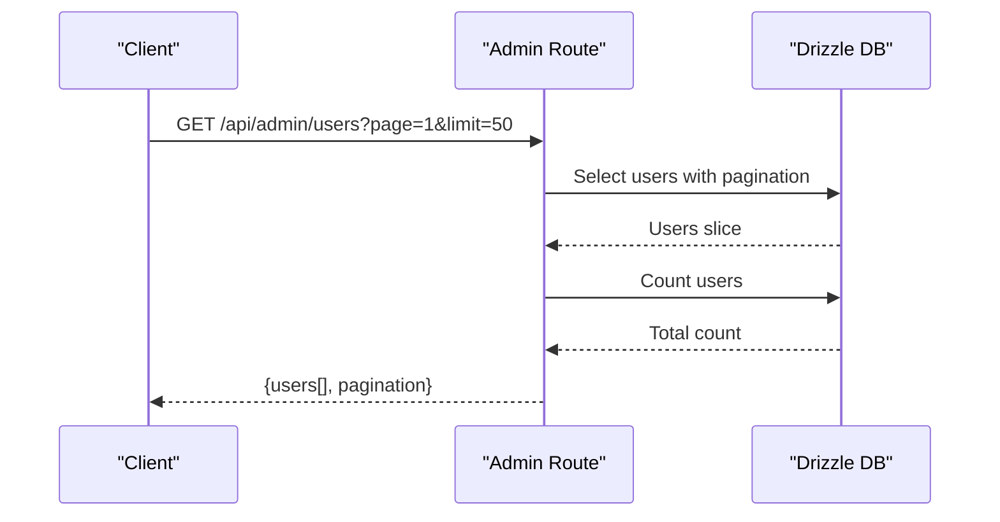
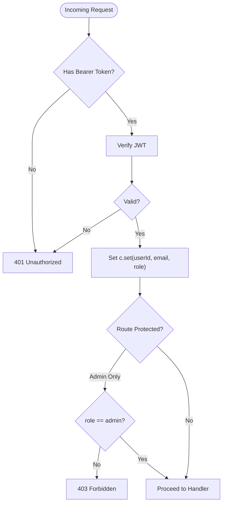
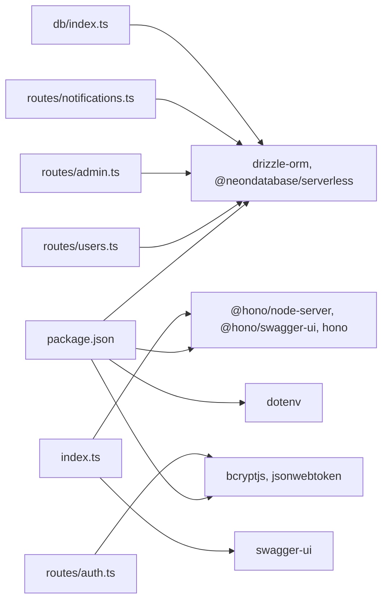
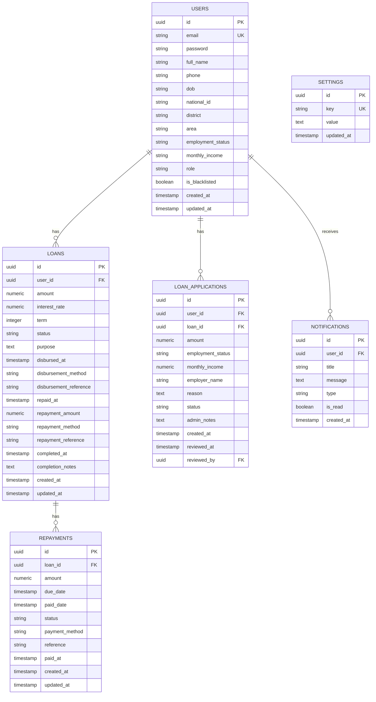

# User Management API

<cite>
**Referenced Files in This Document**
- [backend/src/index.ts](file://backend/src/index.ts)
- [backend/src/middleware/auth.ts](file://backend/src/middleware/auth.ts)
- [backend/src/db/index.ts](file://backend/src/db/index.ts)
- [backend/src/db/schema.ts](file://backend/src/db/schema.ts)
- [backend/src/routes/auth.ts](file://backend/src/routes/auth.ts)
- [backend/src/routes/users.ts](file://backend/src/routes/users.ts)
- [backend/src/routes/notifications.ts](file://backend/src/routes/notifications.ts)
- [backend/src/routes/admin.ts](file://backend/src/routes/admin.ts)
- [backend/src/routes/applications.ts](file://backend/src/routes/applications.ts)
- [backend/create-notifications-table.sql](file://backend/create-notifications-table.sql)
- [backend/create-admin-user.sql](file://backend/create-admin-user.sql)
- [backend/package.json](file://backend/package.json)
</cite>

## Table of Contents
1. [Introduction](#introduction)
2. [Project Structure](#project-structure)
3. [Core Components](#core-components)
4. [Architecture Overview](#architecture-overview)
5. [Detailed Component Analysis](#detailed-component-analysis)
6. [Dependency Analysis](#dependency-analysis)
7. [Performance Considerations](#performance-considerations)
8. [Troubleshooting Guide](#troubleshooting-guide)
9. [Conclusion](#conclusion)
10. [Appendices](#appendices)

## Introduction
This document provides comprehensive API documentation for the user management system. It covers user profile operations, KYC verification, profile updates, user search/filtering, notifications, subscriptions, and communication preferences. It also explains role-based access control, permission systems, administrative user management, profile data validation, image upload handling, document verification processes, and data privacy/GDPR compliance measures.

## Project Structure
The backend is built with Hono and Drizzle ORM, exposing REST endpoints under `/api`. Authentication is JWT-based, with middleware enforcing authorization and roles. The database schema defines users, loans, applications, repayments, notifications, and settings.

**Diagram sources**
- [backend/src/index.ts:54-61](file://backend/src/index.ts#L54-L61)
- [backend/src/db/index.ts:42](file://backend/src/db/index.ts#L42)

**Section sources**
- [backend/src/index.ts:54-61](file://backend/src/index.ts#L54-L61)
- [backend/src/db/index.ts:42](file://backend/src/db/index.ts#L42)

## Core Components
- Authentication and Authorization
  - JWT-based authentication with bearer tokens.
  - Role enforcement: user/admin.
- User Management
  - Profile retrieval and updates.
  - KYC fields: date of birth, national ID/passport.
  - Administrative actions: blacklist toggling, password reset.
- Notifications
  - CRUD operations for user-specific notifications.
  - Read/unread state management.
- Admin Dashboard
  - User listing with pagination.
  - Loan/applications listing with pagination.
  - System statistics aggregation.
  - Settings management (key-value store).
- Data Validation
  - Zod schemas for registration and application submission.
- Database Schema
  - Strongly typed tables with relations and constraints.

**Section sources**
- [backend/src/middleware/auth.ts:10-47](file://backend/src/middleware/auth.ts#L10-L47)
- [backend/src/routes/auth.ts:12-30](file://backend/src/routes/auth.ts#L12-L30)
- [backend/src/routes/users.ts:41-194](file://backend/src/routes/users.ts#L41-L194)
- [backend/src/routes/notifications.ts:8-103](file://backend/src/routes/notifications.ts#L8-L103)
- [backend/src/routes/admin.ts:8-168](file://backend/src/routes/admin.ts#L8-L168)
- [backend/src/db/schema.ts:4-96](file://backend/src/db/schema.ts#L4-L96)

## Architecture Overview
The system uses a layered architecture:
- HTTP Layer: Hono routes.
- Middleware Layer: Auth and admin guards.
- Service/Data Layer: Drizzle ORM with PostgreSQL.
- CORS and Logging: Hono middleware.

**Diagram sources**
- [backend/src/routes/auth.ts:95-142](file://backend/src/routes/auth.ts#L95-L142)
- [backend/src/middleware/auth.ts:10-36](file://backend/src/middleware/auth.ts#L10-L36)

**Section sources**
- [backend/src/index.ts:19-26](file://backend/src/index.ts#L19-L26)
- [backend/src/middleware/auth.ts:10-47](file://backend/src/middleware/auth.ts#L10-L47)
- [backend/src/db/index.ts:40-44](file://backend/src/db/index.ts#L40-L44)

## Detailed Component Analysis

### Authentication and Authorization
- Endpoints
  - POST /api/login: Validates credentials and returns a JWT.
  - POST /api/register: Creates a new user with optional KYC fields and returns a JWT.
- Validation
  - Registration schema enforces email, password minimum length, full name, and optional KYC fields.
  - Login schema enforces email and password presence.
- Security
  - Passwords are hashed with bcrypt.
  - JWT secret is loaded from environment variables.
- Access Control
  - Auth middleware validates bearer tokens and sets user context.
  - Admin middleware restricts routes to admin role.

**Diagram sources**
- [backend/src/routes/auth.ts:95-142](file://backend/src/routes/auth.ts#L95-L142)
- [backend/src/middleware/auth.ts:10-36](file://backend/src/middleware/auth.ts#L10-L36)

**Section sources**
- [backend/src/routes/auth.ts:32-93](file://backend/src/routes/auth.ts#L32-L93)
- [backend/src/routes/auth.ts:95-142](file://backend/src/routes/auth.ts#L95-L142)
- [backend/src/middleware/auth.ts:10-47](file://backend/src/middleware/auth.ts#L10-L47)

### User Profile Operations
- Retrieve Own Profile
  - GET /api/users/profile
  - Requires X-User-Id header (temporary; later protected by auth middleware).
  - Returns user profile excluding sensitive fields and includes related loans/applications.
- Update Own Profile
  - PUT /api/users/profile
  - Accepts fullName and phone.
  - Updates timestamps and returns sanitized user object.
- Retrieve Single User (Admin)
  - GET /api/users/:id
  - Returns user with related loans/applications.
- Blacklist Toggle (Admin)
  - PUT /api/users/:id/blacklist
  - Toggles isBlacklisted flag.
- Admin Reset User Password
  - PUT /api/users/:id/password
  - Enforces minimum password length, hashes, and updates.

**Diagram sources**
- [backend/src/routes/users.ts:72-107](file://backend/src/routes/users.ts#L72-L107)

**Section sources**
- [backend/src/routes/users.ts:41-194](file://backend/src/routes/users.ts#L41-L194)

### KYC Verification and Profile Data
- KYC Fields
  - dob, nationalId, district, area, employmentStatus, monthlyIncome.
- Verification Logic
  - Admin endpoint computes isKycVerified based on presence of dob and nationalId.
- Data Validation
  - Registration schema enforces field constraints.
- Image Upload Handling
  - Not implemented in current routes; recommended to add multipart/form-data endpoints for documents/images and store secure URLs.

**Diagram sources**
- [backend/src/routes/auth.ts:32-93](file://backend/src/routes/auth.ts#L32-L93)

**Section sources**
- [backend/src/routes/auth.ts:12-30](file://backend/src/routes/auth.ts#L12-L30)
- [backend/src/routes/admin.ts:25-47](file://backend/src/routes/admin.ts#L25-L47)
- [backend/src/db/schema.ts:4-21](file://backend/src/db/schema.ts#L4-L21)

### Notifications Management
- List Notifications
  - GET /api/notifications/
  - Returns last 50 notifications and unread count for the user.
- Mark One as Read
  - PATCH /api/notifications/:id/read
- Mark All as Read
  - PATCH /api/notifications/read-all
- Create Notification
  - POST /api/notifications/ {title, message, type}
- Clear Read Notifications
  - DELETE /api/notifications/read

**Diagram sources**
- [backend/src/routes/notifications.ts:71-90](file://backend/src/routes/notifications.ts#L71-L90)

**Section sources**
- [backend/src/routes/notifications.ts:8-103](file://backend/src/routes/notifications.ts#L8-L103)
- [backend/create-notifications-table.sql:1-30](file://backend/create-notifications-table.sql#L1-L30)

### Subscription Handling and Communication Preferences
- Current Implementation
  - No explicit subscription endpoints are present in the codebase.
- Recommended Approach
  - Introduce a subscriptions table linked to users.
  - Endpoints for subscribing/unsubscribing to notification types.
  - Preference endpoints to manage communication channels (email, SMS).

[No sources needed since this section provides general guidance]

### Administrative User Management
- List Users with Pagination
  - GET /api/admin/users?page&limit
  - Returns formatted user list including computed isKycVerified.
- Manage Loans/Applications
  - GET /api/admin/loans?page&limit
  - Aggregates user data for each loan.
- Dashboard Stats
  - GET /api/admin/stats
  - Counts and totals for users, loans, and disbursed amounts.
- Settings Management
  - GET /api/admin/settings
  - PUT /api/admin/settings {key: value}

**Diagram sources**
- [backend/src/routes/admin.ts:8-47](file://backend/src/routes/admin.ts#L8-L47)

**Section sources**
- [backend/src/routes/admin.ts:8-168](file://backend/src/routes/admin.ts#L8-L168)

### User Search and Filtering
- Current Capabilities
  - Paginated listing of users and loans.
  - KYC verification computed client-side in admin route.
- Recommendations
  - Add query parameters for filtering by role, status, district, employment status.
  - Add sorting options and full-text search on names/email.

[No sources needed since this section provides general guidance]

### Role-Based Access Control (RBAC)
- Roles
  - user: default role for regular users.
  - admin: administrative access.
- Guards
  - Auth middleware: extracts userId, email, role from JWT.
  - Admin middleware: enforces role == admin.

**Diagram sources**
- [backend/src/middleware/auth.ts:10-47](file://backend/src/middleware/auth.ts#L10-L47)

**Section sources**
- [backend/src/middleware/auth.ts:10-47](file://backend/src/middleware/auth.ts#L10-L47)

### Data Privacy and GDPR Compliance
- Data Minimization
  - Passwords are excluded from profile responses.
  - Sensitive fields are optional during registration.
- Consent and Transparency
  - Implement consent banners and terms for data collection.
- Data Subject Rights
  - Right to erasure: add user deletion endpoint and cascade deletes.
  - Data portability: export user data endpoint.
- Security Measures
  - JWT secrets and bcrypt hashing are used.
  - CORS configured for trusted origins.
- Recommendations
  - Add audit logs for profile changes.
  - Implement data retention policies and automated purges.
  - Add cookie consent and privacy policy links.

[No sources needed since this section provides general guidance]

## Dependency Analysis
External dependencies include Hono, Drizzle ORM, bcrypt, jsonwebtoken, and dotenv. Internal dependencies connect routes to middleware and database.

**Diagram sources**
- [backend/package.json:22-34](file://backend/package.json#L22-L34)
- [backend/src/index.ts:6-11](file://backend/src/index.ts#L6-L11)
- [backend/src/db/index.ts:1-44](file://backend/src/db/index.ts#L1-L44)

**Section sources**
- [backend/package.json:22-34](file://backend/package.json#L22-L34)
- [backend/src/index.ts:6-11](file://backend/src/index.ts#L6-L11)
- [backend/src/db/index.ts:1-44](file://backend/src/db/index.ts#L1-L44)

## Performance Considerations
- Pagination
  - Admin endpoints use limit/offset to prevent large payloads.
- Indexes
  - Notifications table includes indexes on user_id, created_at, type, is_read.
- Aggregation Queries
  - Admin stats use SQL COUNT and COALESCE for efficient totals.
- Recommendations
  - Add indexes on users.email and notifications.title for faster lookups.
  - Use connection pooling and consider read replicas for reporting endpoints.

**Section sources**
- [backend/src/routes/admin.ts:11-25](file://backend/src/routes/admin.ts#L11-L25)
- [backend/create-notifications-table.sql:19-23](file://backend/create-notifications-table.sql#L19-L23)

## Troubleshooting Guide
- Authentication Failures
  - Missing or invalid Authorization header yields 401.
  - Invalid JWT payload yields 401.
- Authorization Failures
  - Non-admin access to admin routes yields 403.
- Database Connectivity
  - DATABASE_URL must be set; otherwise startup fails.
- CORS Issues
  - Ensure client origins are whitelisted in CORS middleware.
- Notification Table
  - Ensure notifications table exists; use provided SQL script to create.

**Section sources**
- [backend/src/middleware/auth.ts:14-47](file://backend/src/middleware/auth.ts#L14-L47)
- [backend/src/db/index.ts:31-38](file://backend/src/db/index.ts#L31-L38)
- [backend/src/index.ts:21-26](file://backend/src/index.ts#L21-L26)
- [backend/create-notifications-table.sql:1-30](file://backend/create-notifications-table.sql#L1-L30)

## Conclusion
The user management API provides robust authentication, user profile operations, admin capabilities, and notifications. It supports KYC verification and includes strong security foundations. Extending it with image/document uploads, subscription management, advanced search/filtering, and comprehensive GDPR features will further enhance the platform’s capabilities.

## Appendices

### API Reference Summary

- Authentication
  - POST /api/login
  - POST /api/register
- User
  - GET /api/users/profile
  - PUT /api/users/profile
  - GET /api/users/:id
  - PUT /api/users/:id/blacklist
  - PUT /api/users/:id/password
- Notifications
  - GET /api/notifications/
  - PATCH /api/notifications/:id/read
  - PATCH /api/notifications/read-all
  - POST /api/notifications/
  - DELETE /api/notifications/read
- Admin
  - GET /api/admin/users?page&limit
  - GET /api/admin/loans?page&limit
  - GET /api/admin/stats
  - GET /api/admin/settings
  - PUT /api/admin/settings
- Applications
  - GET /api/applications/my-applications
  - POST /api/applications/
  - PATCH /api/applications/:id/review

**Section sources**
- [backend/src/routes/auth.ts:32-142](file://backend/src/routes/auth.ts#L32-L142)
- [backend/src/routes/users.ts:41-194](file://backend/src/routes/users.ts#L41-L194)
- [backend/src/routes/notifications.ts:8-103](file://backend/src/routes/notifications.ts#L8-L103)
- [backend/src/routes/admin.ts:8-168](file://backend/src/routes/admin.ts#L8-L168)
- [backend/src/routes/applications.ts:55-165](file://backend/src/routes/applications.ts#L55-L165)

### Database Schema Overview

**Diagram sources**
- [backend/src/db/schema.ts:4-96](file://backend/src/db/schema.ts#L4-L96)

### Admin Setup
- Create admin user
  - Use provided SQL script to insert/update admin credentials.
- Verify
  - Confirm admin exists with role=admin.

**Section sources**
- [backend/create-admin-user.sql:4-26](file://backend/create-admin-user.sql#L4-L26)