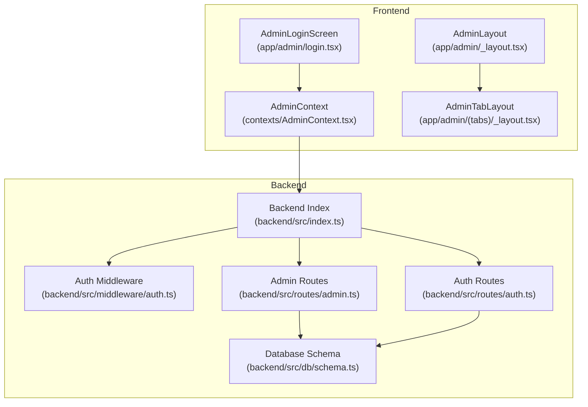
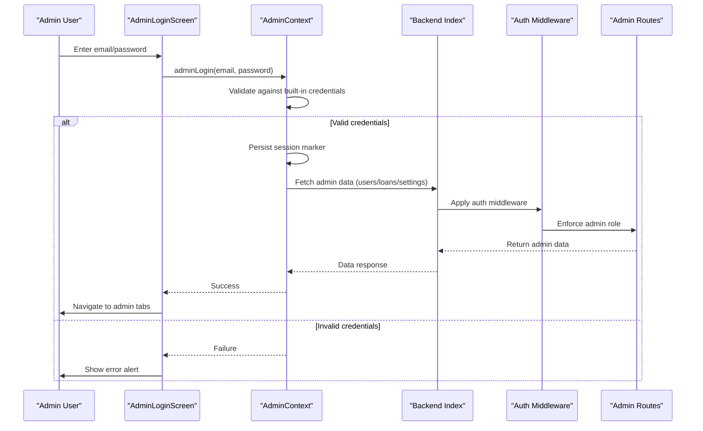
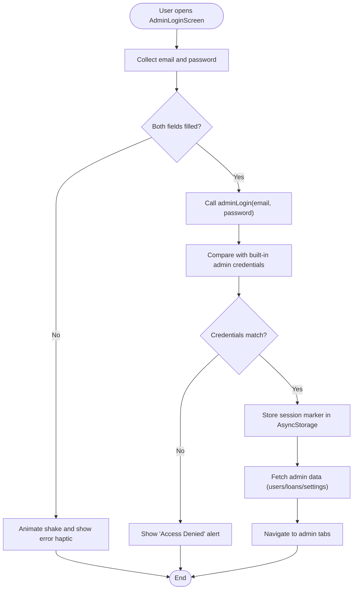
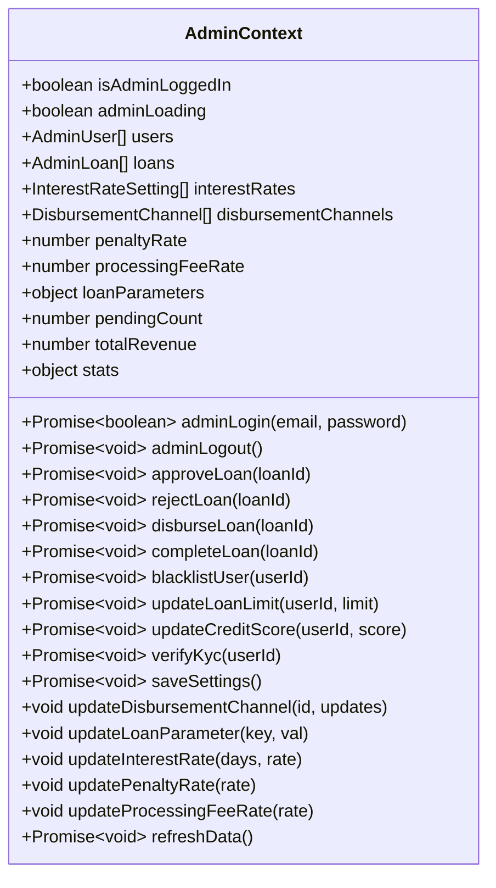
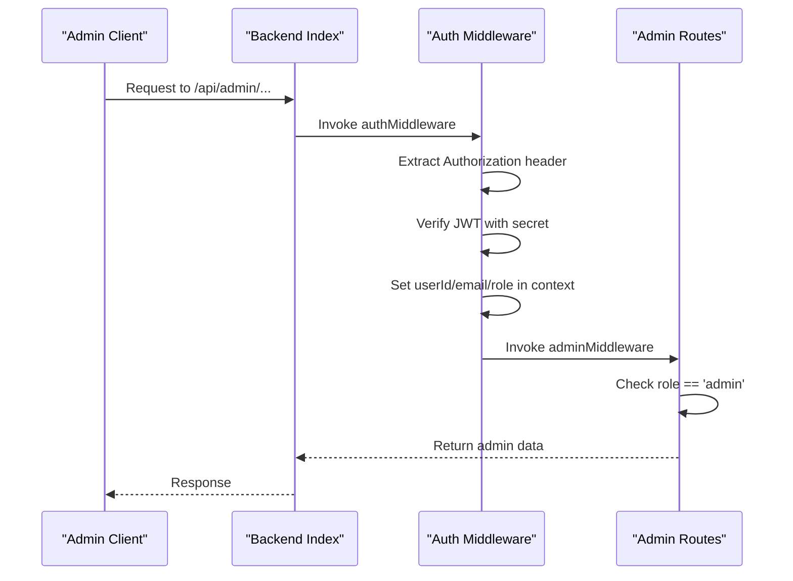
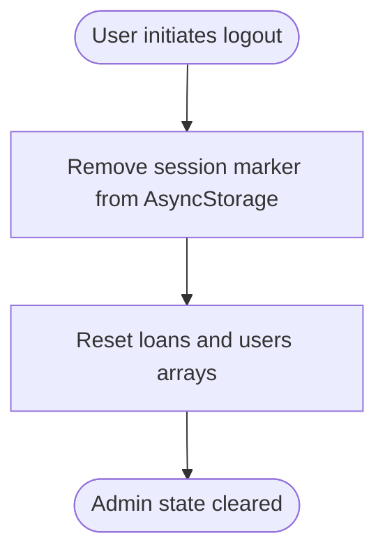
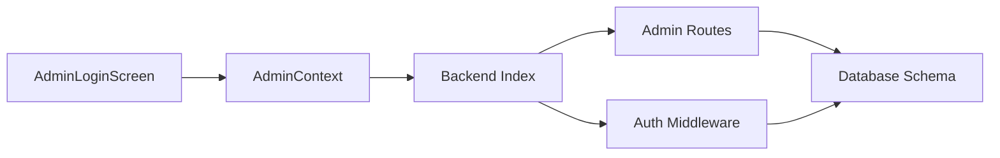

# Admin Authentication

<cite>
**Referenced Files in This Document**
- [AdminLoginScreen](file://app/admin/login.tsx)
- [AdminContext](file://contexts/AdminContext.tsx)
- [AdminLayout](file://app/admin/_layout.tsx)
- [AdminTabLayout](file://app/admin/(tabs)/_layout.tsx)
- [Backend Auth Middleware](file://backend/src/middleware/auth.ts)
- [Admin Routes](file://backend/src/routes/admin.ts)
- [Auth Routes](file://backend/src/routes/auth.ts)
- [Backend Index](file://backend/src/index.ts)
- [Database Schema](file://backend/src/db/schema.ts)
- [Create Admin SQL](file://backend/create-admin-user.sql)
- [Generate Admin Hash Script](file://backend/generate-admin-hash.js)
</cite>

## Table of Contents
1. [Introduction](#introduction)
2. [Project Structure](#project-structure)
3. [Core Components](#core-components)
4. [Architecture Overview](#architecture-overview)
5. [Detailed Component Analysis](#detailed-component-analysis)
6. [Dependency Analysis](#dependency-analysis)
7. [Performance Considerations](#performance-considerations)
8. [Troubleshooting Guide](#troubleshooting-guide)
9. [Conclusion](#conclusion)

## Introduction
This document explains the administrative authentication system for the Phoenix Loan platform. It covers the admin login process, credential validation, session management, role-based access controls, and permission hierarchies. It also documents JWT token handling for admin sessions, refresh mechanisms, and security considerations. Practical examples illustrate admin login flows, error handling for invalid credentials, and logout procedures. The admin middleware implementation, route protection, and unauthorized access handling are addressed, along with security best practices for admin authentication, password policies, and account lockout mechanisms.

## Project Structure
The admin authentication system spans the frontend React Native application and the backend Hono server:
- Frontend admin login and session management live in the React Native screens and context provider.
- Backend routes expose admin endpoints protected by middleware that validates JWT tokens and enforces role-based access.
- Database schema defines user roles and supports admin privileges.

**Diagram sources**
- [AdminLoginScreen:1-306](file://app/admin/login.tsx#L1-L306)
- [AdminContext:1-528](file://contexts/AdminContext.tsx#L1-L528)
- [AdminLayout:1-12](file://app/admin/_layout.tsx#L1-L12)
- [AdminTabLayout](file://app/admin/(tabs)/_layout.tsx#L1-L107)
- [Backend Index:1-76](file://backend/src/index.ts#L1-L76)
- [Backend Auth Middleware:1-48](file://backend/src/middleware/auth.ts#L1-L48)
- [Admin Routes:1-171](file://backend/src/routes/admin.ts#L1-L171)
- [Auth Routes:1-146](file://backend/src/routes/auth.ts#L1-L146)
- [Database Schema:1-146](file://backend/src/db/schema.ts#L1-L146)

**Section sources**
- [AdminLoginScreen:1-306](file://app/admin/login.tsx#L1-L306)
- [AdminContext:1-528](file://contexts/AdminContext.tsx#L1-L528)
- [AdminLayout:1-12](file://app/admin/_layout.tsx#L1-L12)
- [AdminTabLayout](file://app/admin/(tabs)/_layout.tsx#L1-L107)
- [Backend Index:1-76](file://backend/src/index.ts#L1-L76)
- [Backend Auth Middleware:1-48](file://backend/src/middleware/auth.ts#L1-L48)
- [Admin Routes:1-171](file://backend/src/routes/admin.ts#L1-L171)
- [Auth Routes:1-146](file://backend/src/routes/auth.ts#L1-L146)
- [Database Schema:1-146](file://backend/src/db/schema.ts#L1-L146)

## Core Components
- AdminLoginScreen: Handles admin login UI, input validation, and calls the AdminContext login function. Presents feedback for invalid credentials and navigates on success.
- AdminContext: Manages admin session state, loads cached data, performs admin login/logout, and exposes admin actions (approve/reject/disburse/complete loans, manage users/settings).
- Backend Auth Middleware: Validates Authorization headers and JWT tokens, sets user context variables, and enforces admin-only access.
- Admin Routes: Provides admin endpoints for fetching users, loans, settings, and statistics.
- Database Schema: Defines the users table with role-based permissions and related entities.

Key responsibilities:
- Session persistence: AdminContext stores a simple session marker in AsyncStorage to indicate logged-in state.
- Credential validation: AdminContext compares provided credentials against built-in admin credentials.
- Role enforcement: Backend middleware checks the role claim to restrict access to admin-only routes.
- Data synchronization: AdminContext fetches and caches admin data from backend endpoints.

**Section sources**
- [AdminLoginScreen:42-59](file://app/admin/login.tsx#L42-L59)
- [AdminContext:135-302](file://contexts/AdminContext.tsx#L135-L302)
- [Backend Auth Middleware:10-47](file://backend/src/middleware/auth.ts#L10-L47)
- [Admin Routes:8-168](file://backend/src/routes/admin.ts#L8-L168)
- [Database Schema:4-21](file://backend/src/db/schema.ts#L4-L21)

## Architecture Overview
The admin authentication architecture combines client-side session management with server-side JWT validation and role-based access control.

**Diagram sources**
- [AdminLoginScreen:42-59](file://app/admin/login.tsx#L42-L59)
- [AdminContext:287-295](file://contexts/AdminContext.tsx#L287-L295)
- [Backend Index:54-61](file://backend/src/index.ts#L54-L61)
- [Backend Auth Middleware:10-47](file://backend/src/middleware/auth.ts#L10-L47)
- [Admin Routes:8-47](file://backend/src/routes/admin.ts#L8-L47)

## Detailed Component Analysis

### Admin Login Flow
The admin login flow is implemented in the React Native frontend and validated by the AdminContext provider.

Practical example steps:
- Enter admin email and password in the login screen.
- Submitting empty fields triggers UI feedback without network calls.
- On successful validation, the app persists a session marker and navigates to the admin dashboard tabs.

Security considerations:
- Built-in credentials are embedded in the frontend for demo purposes. In production, replace with backend authentication that issues JWT tokens.

**Diagram sources**
- [AdminLoginScreen:42-59](file://app/admin/login.tsx#L42-L59)
- [AdminContext:287-295](file://contexts/AdminContext.tsx#L287-L295)

**Section sources**
- [AdminLoginScreen:42-59](file://app/admin/login.tsx#L42-L59)
- [AdminContext:287-295](file://contexts/AdminContext.tsx#L287-L295)

### Admin Context Provider
The AdminContext provider manages admin session state, data loading, and admin actions.

Key behaviors:
- Session persistence: Uses AsyncStorage to persist a session marker and restore state on app launch.
- Data loading: Fetches users, loans, and settings from backend endpoints and merges with local cache.
- Admin actions: Exposes functions to modify loan statuses, user attributes, and system settings.

**Diagram sources**
- [AdminContext:77-115](file://contexts/AdminContext.tsx#L77-L115)

**Section sources**
- [AdminContext:135-302](file://contexts/AdminContext.tsx#L135-L302)
- [AdminContext:199-285](file://contexts/AdminContext.tsx#L199-L285)
- [AdminContext:311-413](file://contexts/AdminContext.tsx#L311-L413)
- [AdminContext:462-491](file://contexts/AdminContext.tsx#L462-L491)

### Backend Authentication Middleware and Admin Routes
The backend enforces JWT validation and admin-only access for admin endpoints.

Role-based access control:
- The auth middleware decodes the JWT and attaches user identity to the request context.
- The admin middleware enforces that only requests with role set to 'admin' are permitted.

**Diagram sources**
- [Backend Index:54-61](file://backend/src/index.ts#L54-L61)
- [Backend Auth Middleware:10-47](file://backend/src/middleware/auth.ts#L10-L47)
- [Admin Routes:8-47](file://backend/src/routes/admin.ts#L8-L47)

**Section sources**
- [Backend Auth Middleware:10-47](file://backend/src/middleware/auth.ts#L10-L47)
- [Admin Routes:8-47](file://backend/src/routes/admin.ts#L8-L47)
- [Database Schema:4-21](file://backend/src/db/schema.ts#L4-L21)

### JWT Token Handling and Security Considerations
Current implementation:
- The frontend uses a simple session marker in AsyncStorage for admin login.
- The backend issues JWT tokens for regular user authentication but does not implement admin JWT login in the frontend.

Recommendations for production:
- Replace the frontend admin login with a backend-authenticated flow that obtains a JWT from an admin login endpoint.
- Configure a dedicated JWT secret and expiration policy suitable for admin sessions.
- Implement token refresh mechanisms using a refresh token strategy (separate short-lived access tokens and long-lived refresh tokens).
- Enforce HTTPS and secure cookie flags for token transport.
- Add rate limiting and account lockout mechanisms to mitigate brute-force attacks.

Note: The backend already demonstrates JWT issuance for user authentication and includes a JWT secret environment variable usage pattern.

**Section sources**
- [AdminContext:287-295](file://contexts/AdminContext.tsx#L287-L295)
- [Auth Routes:95-143](file://backend/src/routes/auth.ts#L95-L143)
- [Backend Auth Middleware:20-31](file://backend/src/middleware/auth.ts#L20-L31)

### Logout Procedures
The AdminContext provides an adminLogout function that clears the session marker and resets cached data.

Practical example steps:
- Trigger adminLogout from the admin UI.
- The provider removes the session marker and clears local state.
- Subsequent navigation attempts will detect the lack of a valid session and redirect to the login screen.

**Diagram sources**
- [AdminContext:297-302](file://contexts/AdminContext.tsx#L297-L302)

**Section sources**
- [AdminContext:297-302](file://contexts/AdminContext.tsx#L297-L302)

### Route Protection and Unauthorized Access Handling
Route protection is enforced by middleware:
- authMiddleware validates the presence and validity of the Authorization header and JWT signature.
- adminMiddleware ensures the role claim equals 'admin' before allowing access to admin routes.

Unauthorized access handling:
- Missing or malformed Authorization header results in a 401 Unauthorized response.
- Invalid or expired tokens result in a 401 Unauthorized response.
- Non-admin users attempting admin routes receive a 403 Forbidden response.

**Section sources**
- [Backend Auth Middleware:14-31](file://backend/src/middleware/auth.ts#L14-L31)
- [Backend Auth Middleware:42-44](file://backend/src/middleware/auth.ts#L42-L44)

### Practical Examples

#### Example: Successful Admin Login Flow
- User enters admin credentials in AdminLoginScreen.
- adminLogin compares credentials and, on success, stores a session marker and loads admin data.
- The app navigates to the admin tabs layout.

#### Example: Error Handling for Invalid Credentials
- AdminLoginScreen animates and alerts the user when credentials are missing or incorrect.
- The provider returns failure without changing session state.

#### Example: Admin Actions via AdminContext
- Approve/reject/disburse/complete loans update both local state and call backend endpoints.
- Settings updates are persisted to backend settings and reflected in the UI.

**Section sources**
- [AdminLoginScreen:42-59](file://app/admin/login.tsx#L42-L59)
- [AdminContext:311-361](file://contexts/AdminContext.tsx#L311-L361)
- [AdminContext:363-413](file://contexts/AdminContext.tsx#L363-L413)
- [AdminContext:462-478](file://contexts/AdminContext.tsx#L462-L478)

## Dependency Analysis
The admin authentication system exhibits layered dependencies:
- Frontend depends on AdminContext for session and data management.
- AdminContext depends on backend endpoints for data and on AsyncStorage for persistence.
- Backend depends on auth middleware for JWT validation and admin middleware for role enforcement.
- Admin routes depend on database schema for data retrieval and updates.

**Diagram sources**
- [AdminLoginScreen:1-306](file://app/admin/login.tsx#L1-L306)
- [AdminContext:1-528](file://contexts/AdminContext.tsx#L1-L528)
- [Backend Index:1-76](file://backend/src/index.ts#L1-L76)
- [Backend Auth Middleware:1-48](file://backend/src/middleware/auth.ts#L1-L48)
- [Admin Routes:1-171](file://backend/src/routes/admin.ts#L1-L171)
- [Database Schema:1-146](file://backend/src/db/schema.ts#L1-L146)

**Section sources**
- [AdminContext:135-302](file://contexts/AdminContext.tsx#L135-L302)
- [Backend Index:54-61](file://backend/src/index.ts#L54-L61)
- [Backend Auth Middleware:10-47](file://backend/src/middleware/auth.ts#L10-L47)
- [Admin Routes:8-47](file://backend/src/routes/admin.ts#L8-L47)
- [Database Schema:4-21](file://backend/src/db/schema.ts#L4-L21)

## Performance Considerations
- Minimize network calls: AdminContext batches admin data fetches and caches data locally to reduce repeated requests.
- Pagination: Admin routes support pagination to limit payload sizes for users and loans lists.
- Local caching: AsyncStorage is used to maintain offline-friendly state and reduce server load.

[No sources needed since this section provides general guidance]

## Troubleshooting Guide
Common issues and resolutions:
- Login fails immediately with no network call:
  - Ensure both email and password fields are populated before submission.
  - Confirm the built-in admin credentials match the expected values.
- Invalid credentials error:
  - Verify the entered credentials match the built-in admin credentials.
  - For production, ensure the backend admin login endpoint is implemented and returns a valid JWT.
- Session not persisting:
  - Check AsyncStorage availability and permissions on the device/emulator.
  - Confirm the session marker is being written and read correctly during app startup.
- Admin routes returning unauthorized:
  - Ensure Authorization headers are present and contain a valid Bearer token.
  - Verify the token’s role claim equals 'admin'.
- CORS errors:
  - Confirm the backend CORS configuration allows the frontend origin.

**Section sources**
- [AdminLoginScreen:42-59](file://app/admin/login.tsx#L42-L59)
- [AdminContext:150-162](file://contexts/AdminContext.tsx#L150-L162)
- [Backend Auth Middleware:14-31](file://backend/src/middleware/auth.ts#L14-L31)
- [Backend Index:21-26](file://backend/src/index.ts#L21-L26)

## Conclusion
The Phoenix Loan admin authentication system currently uses a simple frontend-based admin login with built-in credentials and AsyncStorage for session persistence. For production, integrate backend JWT authentication for admin users, implement robust token refresh and security measures, and enforce strict role-based access control. The backend middleware and admin routes provide a strong foundation for protecting sensitive admin endpoints, while the AdminContext offers a flexible provider for managing admin state and actions.