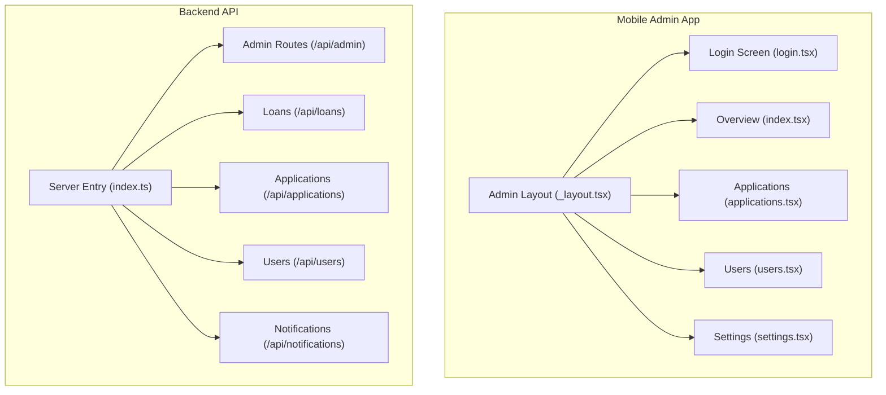
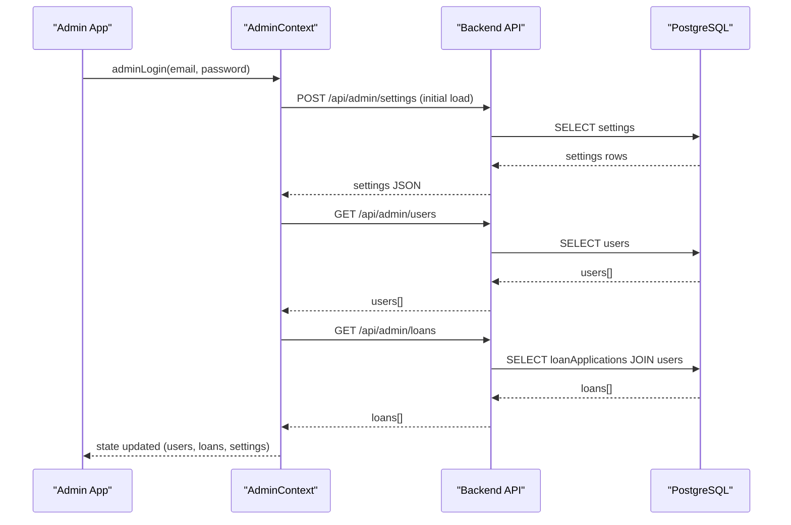
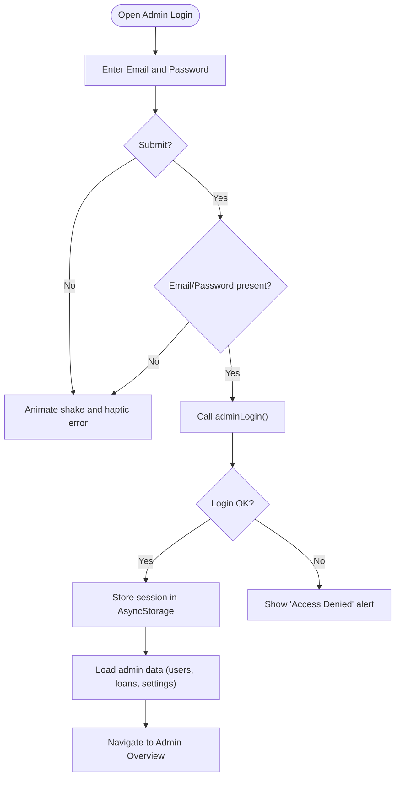
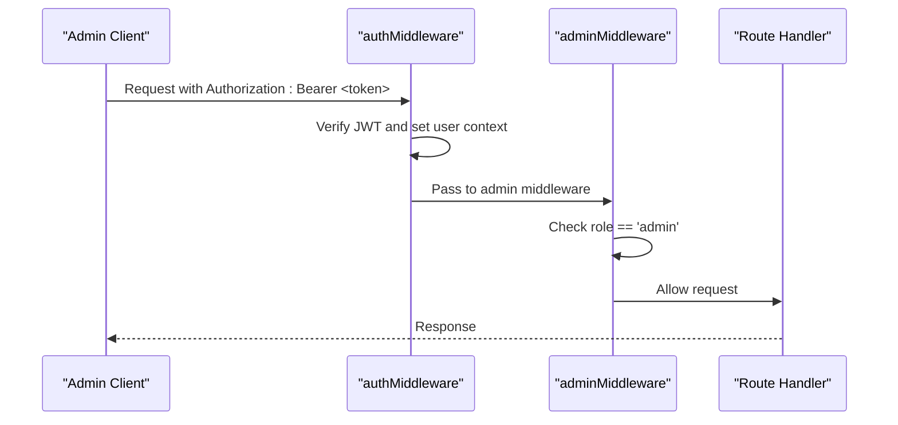
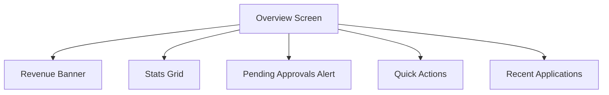
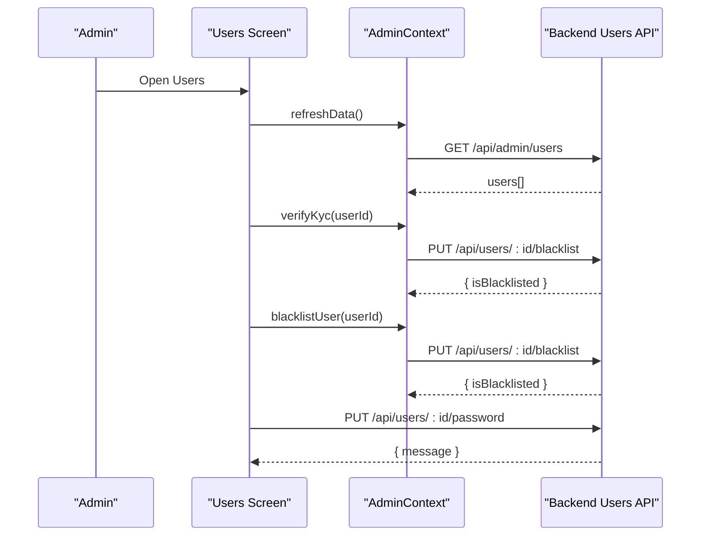
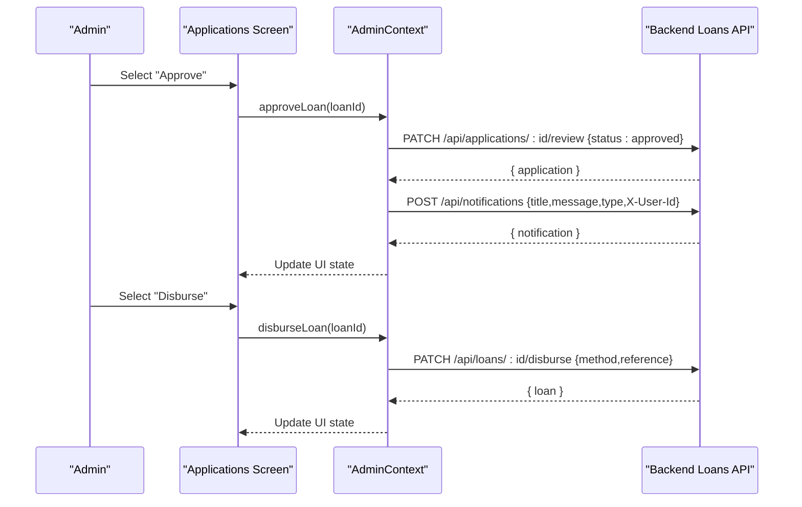
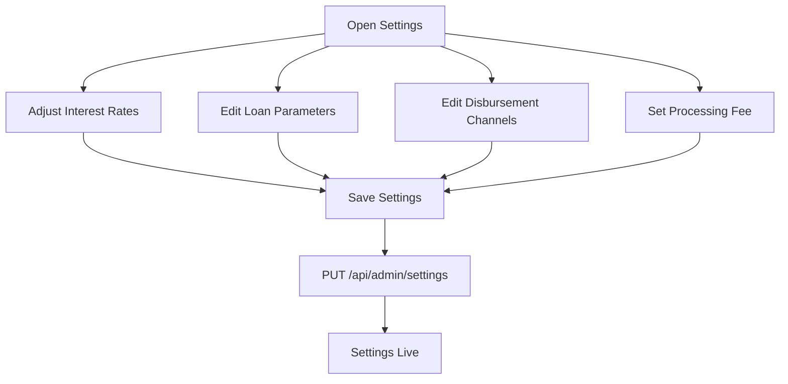
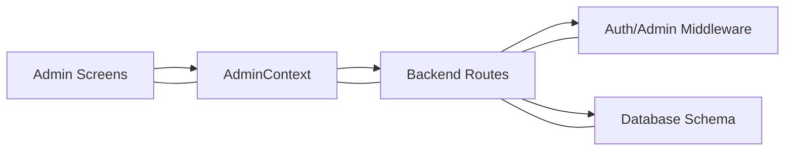
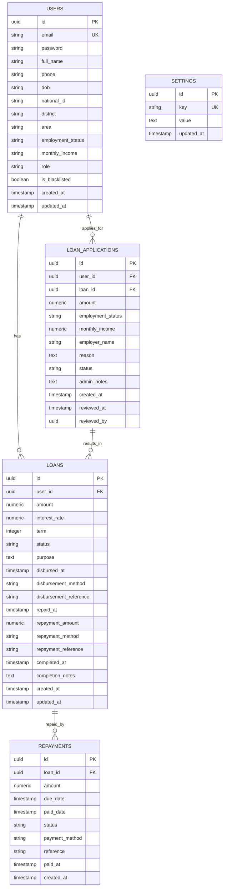

# Administrative Interface

<cite>
**Referenced Files in This Document**
- [login.tsx](file://app/admin/login.tsx)
- [AdminContext.tsx](file://contexts/AdminContext.tsx)
- [admin.ts](file://backend/src/routes/admin.ts)
- [auth.ts](file://backend/src/middleware/auth.ts)
- [_layout.tsx](file://app/admin/_layout.tsx)
- [index.tsx](file://app/admin/(tabs)/index.tsx)
- [applications.tsx](file://app/admin/(tabs)/applications.tsx)
- [users.tsx](file://app/admin/(tabs)/users.tsx)
- [settings.tsx](file://app/admin/(tabs)/settings.tsx)
- [applications.ts](file://backend/src/routes/applications.ts)
- [users.ts](file://backend/src/routes/users.ts)
- [loans.ts](file://backend/src/routes/loans.ts)
- [schema.ts](file://backend/src/db/schema.ts)
- [index.ts](file://backend/src/index.ts)
- [notifications.ts](file://backend/src/routes/notifications.ts)
</cite>

## Table of Contents
1. [Introduction](#introduction)
2. [Project Structure](#project-structure)
3. [Core Components](#core-components)
4. [Architecture Overview](#architecture-overview)
5. [Detailed Component Analysis](#detailed-component-analysis)
6. [Dependency Analysis](#dependency-analysis)
7. [Performance Considerations](#performance-considerations)
8. [Troubleshooting Guide](#troubleshooting-guide)
9. [Conclusion](#conclusion)
10. [Appendices](#appendices)

## Introduction
This document describes the administrative dashboard interface for the Phoenix Loan platform. It covers admin login, role-based access controls, dashboard overview, user management, loan administration, administrative settings, API endpoints, and operational best practices. The goal is to provide both technical and non-technical stakeholders with a clear understanding of how administrators interact with the system and how backend services support these capabilities.

## Project Structure
The admin interface is organized as a separate section of the mobile app with dedicated screens for overview, applications, users, and settings. Backend services expose admin-specific endpoints grouped under /api/admin, while general user and loan endpoints are exposed under /api/... These are mounted in the backend entrypoint and protected by middleware where appropriate.

**Diagram sources**
- [index.ts:54-61](file://backend/src/index.ts#L54-L61)
- [_layout.tsx:1-12](file://app/admin/_layout.tsx#L1-L12)
- [login.tsx:17-164](file://app/admin/login.tsx#L17-L164)
- [index.tsx](file://app/admin/(tabs)/index.tsx#L121-L298)
- [applications.tsx](file://app/admin/(tabs)/applications.tsx#L155-L328)
- [users.tsx](file://app/admin/(tabs)/users.tsx#L278-L399)
- [settings.tsx](file://app/admin/(tabs)/settings.tsx#L174-L407)
- [admin.ts:1-140](file://backend/src/routes/admin.ts#L1-L140)
- [loans.ts:1-320](file://backend/src/routes/loans.ts#L1-L320)
- [applications.ts:1-168](file://backend/src/routes/applications.ts#L1-L168)
- [users.ts:1-197](file://backend/src/routes/users.ts#L1-L197)
- [notifications.ts:1-106](file://backend/src/routes/notifications.ts#L1-L106)

**Section sources**
- [index.ts:54-61](file://backend/src/index.ts#L54-L61)
- [_layout.tsx:1-12](file://app/admin/_layout.tsx#L1-L12)

## Core Components
- Admin Login Screen: Provides secure admin authentication with visual feedback and credential checks.
- Admin Context: Centralizes admin state, data fetching, and administrative actions (approve/reject/disburse/complete), plus settings management.
- Admin Routes: Expose admin-only endpoints for users, loans, settings, and statistics.
- Middleware: Enforces JWT-based authentication and admin-only access for sensitive endpoints.

Key responsibilities:
- Authentication and session persistence
- Data caching and offline fallback
- Action orchestration for loan lifecycle and user management
- Settings synchronization with backend

**Section sources**
- [login.tsx:17-164](file://app/admin/login.tsx#L17-L164)
- [AdminContext.tsx:135-528](file://contexts/AdminContext.tsx#L135-L528)
- [admin.ts:1-140](file://backend/src/routes/admin.ts#L1-L140)
- [auth.ts:10-47](file://backend/src/middleware/auth.ts#L10-L47)

## Architecture Overview
The admin portal follows a client-state-driven architecture with a backend API providing admin endpoints. AdminContext coordinates data fetching and mutations, while the backend enforces role-based access and persists state.

**Diagram sources**
- [AdminContext.tsx:199-285](file://contexts/AdminContext.tsx#L199-L285)
- [admin.ts:9-61](file://backend/src/routes/admin.ts#L9-L61)

**Section sources**
- [AdminContext.tsx:199-285](file://contexts/AdminContext.tsx#L199-L285)
- [admin.ts:9-61](file://backend/src/routes/admin.ts#L9-L61)

## Detailed Component Analysis

### Admin Login Process
- Validates presence of credentials and triggers animated feedback on failure.
- On success, stores a session marker and loads admin data.
- Uses a demo credential set embedded in the frontend context.

**Diagram sources**
- [login.tsx:42-59](file://app/admin/login.tsx#L42-L59)
- [AdminContext.tsx:287-295](file://contexts/AdminContext.tsx#L287-L295)

**Section sources**
- [login.tsx:42-59](file://app/admin/login.tsx#L42-L59)
- [AdminContext.tsx:287-295](file://contexts/AdminContext.tsx#L287-L295)

### Role-Based Access Controls
- Authentication middleware extracts JWT from Authorization header and attaches user identity to context.
- Admin middleware checks role equals "admin" and blocks unauthorized requests.
- Admin endpoints are mounted under /api/admin and protected by these middlewares.

**Diagram sources**
- [auth.ts:10-47](file://backend/src/middleware/auth.ts#L10-L47)

**Section sources**
- [auth.ts:10-47](file://backend/src/middleware/auth.ts#L10-L47)

### Dashboard Overview Functionality
- Displays total revenue, user count, pending approvals, and key stats cards.
- Provides quick actions to review applications, manage users, and configure settings.
- Shows recent loan applications with status badges and navigation to the applications list.

**Diagram sources**
- [index.tsx](file://app/admin/(tabs)/index.tsx#L121-L298)

**Section sources**
- [index.tsx](file://app/admin/(tabs)/index.tsx#L121-L298)

### User Management Controls
- Profile viewing: Users screen lists users with KYC status, blacklist status, and quick info.
- KYC verification: Admin can mark users as verified.
- Blacklist management: Toggle blacklist status per user.
- User search: Filter users by name, email, or phone.
- Password management: Admin can update a user’s password via a dedicated endpoint.

**Diagram sources**
- [users.tsx](file://app/admin/(tabs)/users.tsx#L278-L399)
- [AdminContext.tsx:415-440](file://contexts/AdminContext.tsx#L415-L440)
- [users.ts:137-161](file://backend/src/routes/users.ts#L137-L161)
- [users.ts:166-194](file://backend/src/routes/users.ts#L166-L194)

**Section sources**
- [users.tsx](file://app/admin/(tabs)/users.tsx#L278-L399)
- [AdminContext.tsx:415-440](file://contexts/AdminContext.tsx#L415-L440)
- [users.ts:137-161](file://backend/src/routes/users.ts#L137-L161)
- [users.ts:166-194](file://backend/src/routes/users.ts#L166-L194)

### Loan Administration Features
- Application review: Approve or reject applications with notifications.
- Disbursement tracking: Mark loans as disbursed with method and reference.
- Status updates: Track repayment and completion.
- Bulk operations: AdminContext exposes functions for approve/reject/disburse/complete; UI confirms actions before invoking.

**Diagram sources**
- [applications.tsx](file://app/admin/(tabs)/applications.tsx#L155-L328)
- [AdminContext.tsx:311-386](file://contexts/AdminContext.tsx#L311-L386)
- [applications.ts:140-165](file://backend/src/routes/applications.ts#L140-L165)
- [loans.ts:224-250](file://backend/src/routes/loans.ts#L224-L250)
- [notifications.ts:72-90](file://backend/src/routes/notifications.ts#L72-L90)

**Section sources**
- [applications.tsx](file://app/admin/(tabs)/applications.tsx#L155-L328)
- [AdminContext.tsx:311-386](file://contexts/AdminContext.tsx#L311-L386)
- [applications.ts:140-165](file://backend/src/routes/applications.ts#L140-L165)
- [loans.ts:224-250](file://backend/src/routes/loans.ts#L224-L250)
- [notifications.ts:72-90](file://backend/src/routes/notifications.ts#L72-L90)

### Administrative Settings Management
- Interest rates: Per-term rate sliders with validation and live preview.
- Processing fee: Flat percentage editable via modal.
- Loan parameters: Min/max amounts and durations.
- Disbursement channels: Editable channel numbers and enable/disable toggles.
- Save settings: Persist to backend settings table.

**Diagram sources**
- [settings.tsx](file://app/admin/(tabs)/settings.tsx#L174-L407)
- [AdminContext.tsx:462-478](file://contexts/AdminContext.tsx#L462-L478)
- [admin.ts:96-137](file://backend/src/routes/admin.ts#L96-L137)

**Section sources**
- [settings.tsx](file://app/admin/(tabs)/settings.tsx#L174-L407)
- [AdminContext.tsx:462-478](file://contexts/AdminContext.tsx#L462-L478)
- [admin.ts:96-137](file://backend/src/routes/admin.ts#L96-L137)

### Admin API Endpoints
- Admin data
  - GET /api/admin/users → Returns users with derived KYC and limits.
  - GET /api/admin/loans → Returns applications with user info.
  - GET /api/admin/stats → Returns totals and counts.
  - GET /api/admin/settings → Returns current settings.
  - PUT /api/admin/settings → Upserts settings by key.
- Loans
  - PATCH /api/loans/:id/disburse → Mark as disbursed.
  - PATCH /api/loans/:id/repaid → Mark as repaid and record repayment.
  - PATCH /api/loans/:id/status → Generic status update.
- Applications
  - PATCH /api/applications/:id/review → Approve/reject/update status.
- Users
  - PUT /api/users/:id/blacklist → Toggle blacklist.
  - PUT /api/users/:id/password → Admin-set password.
- Notifications
  - POST /api/notifications → Create notification for a user.

**Section sources**
- [admin.ts:8-137](file://backend/src/routes/admin.ts#L8-L137)
- [loans.ts:224-290](file://backend/src/routes/loans.ts#L224-L290)
- [applications.ts:140-165](file://backend/src/routes/applications.ts#L140-L165)
- [users.ts:137-194](file://backend/src/routes/users.ts#L137-L194)
- [notifications.ts:72-90](file://backend/src/routes/notifications.ts#L72-L90)

### Reporting Features
- Overview dashboard computes:
  - Total loans, active loans, completed, rejected.
  - Total disbursed and repaid amounts.
  - Pending approvals count.
  - Total revenue computed from interest and processing fees on completed loans.

These metrics are derived client-side from loaded loan data.

**Section sources**
- [AdminContext.tsx:493-508](file://contexts/AdminContext.tsx#L493-L508)
- [index.tsx](file://app/admin/(tabs)/index.tsx#L187-L214)

### Practical Administrative Workflows
- Approve a loan application:
  - Navigate to Applications, select “Approve”, confirm, and observe notification sent to the user.
- Disburse a loan:
  - From Applications, select “Mark as Disbursed” and provide disbursement details.
- Manage a user:
  - In Users, verify KYC, adjust loan limit/score, toggle blacklist, or change password.
- Configure rates:
  - In Settings, adjust interest rates per term, processing fee, and loan parameters.

**Section sources**
- [applications.tsx](file://app/admin/(tabs)/applications.tsx#L170-L250)
- [AdminContext.tsx:311-386](file://contexts/AdminContext.tsx#L311-L386)
- [users.tsx](file://app/admin/(tabs)/users.tsx#L318-L335)
- [settings.tsx](file://app/admin/(tabs)/settings.tsx#L188-L196)

### Audit Logging and Monitoring
- Backend logs requests and errors via middleware.
- Health check endpoint available at /health.
- Swagger UI documentation served at /docs.

Operational guidance:
- Monitor /health for service availability.
- Use /docs to inspect endpoints and payloads.
- Review backend logs for error traces during admin operations.

**Section sources**
- [index.ts:20-31](file://backend/src/index.ts#L20-L31)
- [index.ts:34-52](file://backend/src/index.ts#L34-L52)

### Security Considerations and Best Practices
- Admin access requires a valid JWT with role=admin.
- Admin credentials in the frontend are for demonstration; replace with secure authentication in production.
- Use HTTPS and restrict CORS origins in production.
- Regularly rotate secrets and enforce strong passwords.
- Limit admin sessions and log out after extended inactivity.

**Section sources**
- [auth.ts:10-47](file://backend/src/middleware/auth.ts#L10-L47)
- [login.tsx:128-135](file://app/admin/login.tsx#L128-L135)

## Dependency Analysis
The admin UI depends on AdminContext for state and actions, which in turn calls backend endpoints. Backend routes depend on the schema and middleware for data integrity and access control.

**Diagram sources**
- [AdminContext.tsx:135-528](file://contexts/AdminContext.tsx#L135-L528)
- [admin.ts:1-140](file://backend/src/routes/admin.ts#L1-L140)
- [auth.ts:10-47](file://backend/src/middleware/auth.ts#L10-L47)
- [schema.ts:1-146](file://backend/src/db/schema.ts#L1-L146)

**Section sources**
- [AdminContext.tsx:135-528](file://contexts/AdminContext.tsx#L135-L528)
- [admin.ts:1-140](file://backend/src/routes/admin.ts#L1-L140)
- [auth.ts:10-47](file://backend/src/middleware/auth.ts#L10-L47)
- [schema.ts:1-146](file://backend/src/db/schema.ts#L1-L146)

## Performance Considerations
- Client-side caching: AdminContext caches loans and users locally and refreshes on demand.
- Offline resilience: Falls back to AsyncStorage when network fails.
- Batch operations: Settings updates are saved as a single PUT to reduce round-trips.
- UI responsiveness: Animations and haptics provide feedback without blocking operations.

[No sources needed since this section provides general guidance]

## Troubleshooting Guide
Common issues and resolutions:
- Login denied: Ensure credentials match the demo credentials; verify backend health and CORS configuration.
- Data not loading: Use the refresh control; check backend logs for errors; confirm AsyncStorage cache integrity.
- Disbursement/repayment failures: Confirm loan status and required fields; retry with valid payload.
- Settings not saving: Verify network connectivity and that PUT /api/admin/settings succeeds.

**Section sources**
- [login.tsx:52-58](file://app/admin/login.tsx#L52-L58)
- [AdminContext.tsx:480-491](file://contexts/AdminContext.tsx#L480-L491)
- [loans.ts:224-250](file://backend/src/routes/loans.ts#L224-L250)
- [admin.ts:115-137](file://backend/src/routes/admin.ts#L115-L137)

## Conclusion
The administrative dashboard integrates a secure login, robust role-based access control, and comprehensive tools for managing users, reviewing loan applications, configuring rates, and monitoring performance. The backend provides admin-focused endpoints with clear data contracts and middleware enforcement. Following the recommended best practices ensures a secure and reliable admin experience.

[No sources needed since this section summarizes without analyzing specific files]

## Appendices

### Data Models Overview

**Diagram sources**
- [schema.ts:4-146](file://backend/src/db/schema.ts#L4-L146)