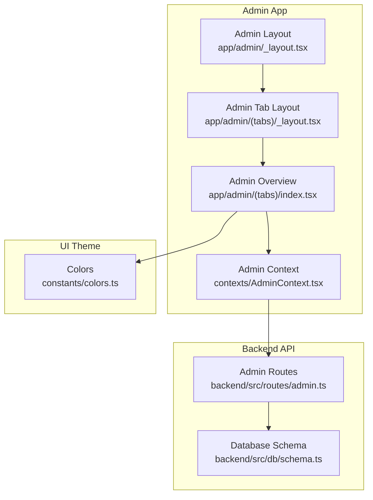
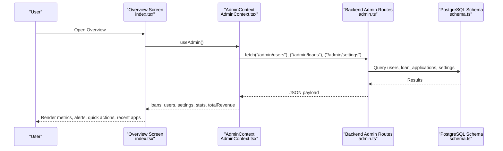
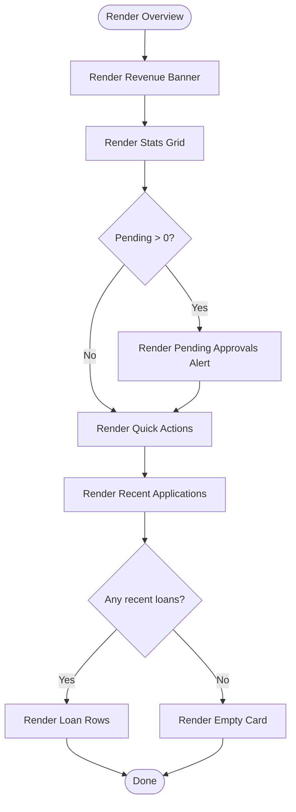
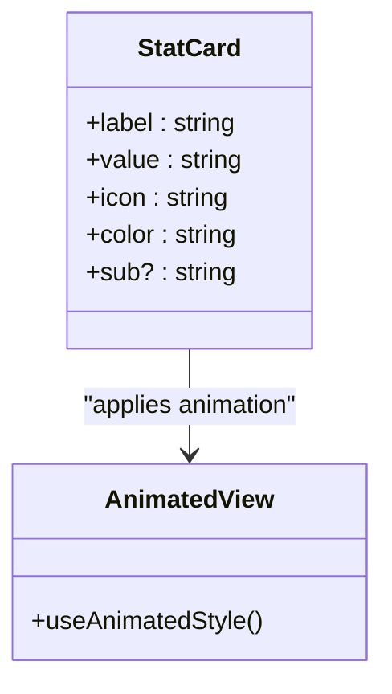
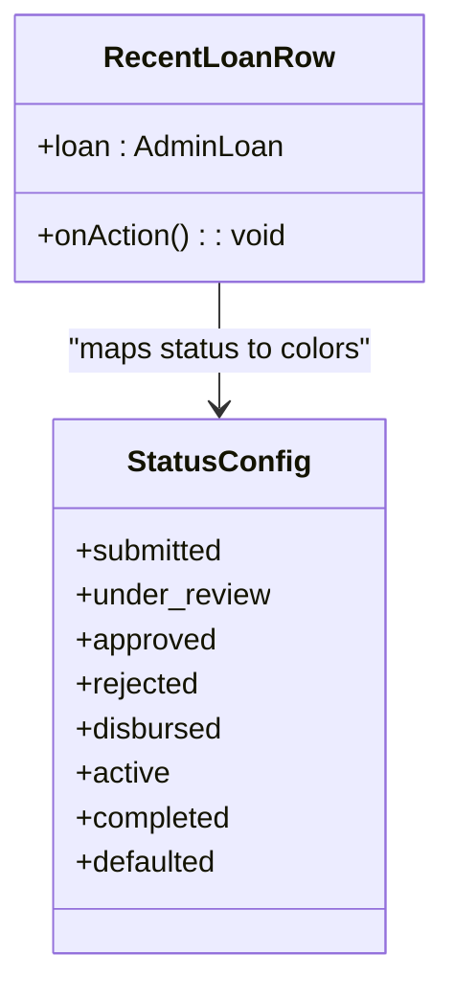
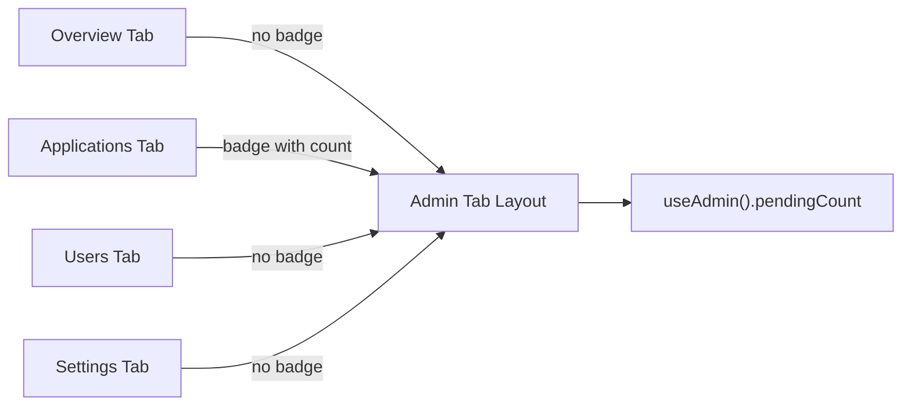
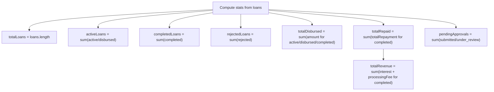
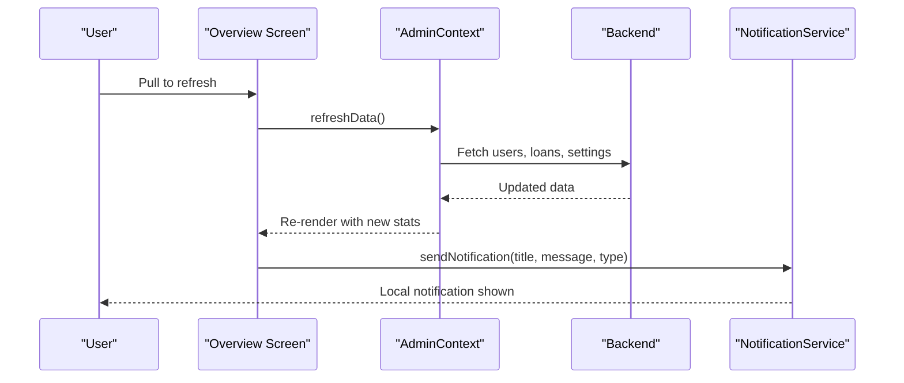
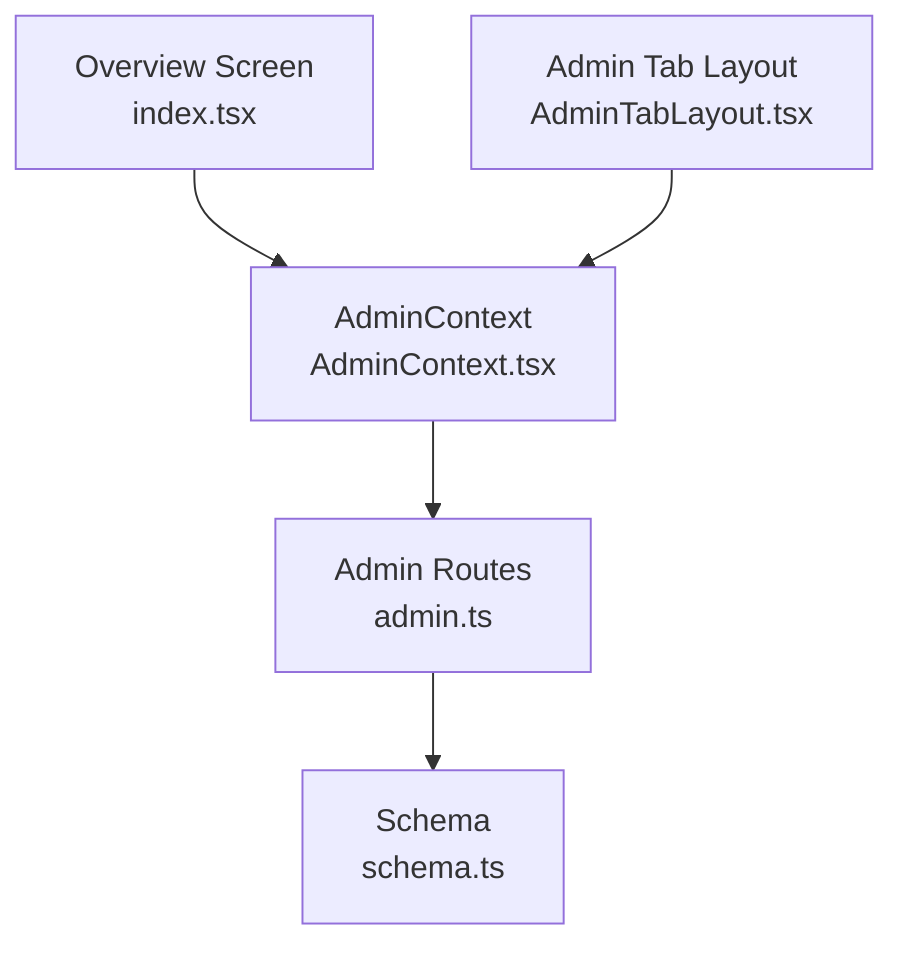

# Dashboard Overview

<cite>
**Referenced Files in This Document**
- [index.tsx](file://app/admin/(tabs)/index.tsx)
- [AdminContext.tsx](file://contexts/AdminContext.tsx)
- [admin.ts](file://backend/src/routes/admin.ts)
- [schema.ts](file://backend/src/db/schema.ts)
- [colors.ts](file://constants/colors.ts)
- [_layout.tsx](file://app/admin/_layout.tsx)
- [AdminTabLayout.tsx](file://app/admin/(tabs)/_layout.tsx)
- [applications.tsx](file://app/admin/(tabs)/applications.tsx)
- [users.tsx](file://app/admin/(tabs)/users.tsx)
- [settings.tsx](file://app/admin/(tabs)/settings.tsx)
- [NotificationService.ts](file://services/NotificationService.ts)
</cite>

## Table of Contents
1. [Introduction](#introduction)
2. [Project Structure](#project-structure)
3. [Core Components](#core-components)
4. [Architecture Overview](#architecture-overview)
5. [Detailed Component Analysis](#detailed-component-analysis)
6. [Dependency Analysis](#dependency-analysis)
7. [Performance Considerations](#performance-considerations)
8. [Troubleshooting Guide](#troubleshooting-guide)
9. [Conclusion](#conclusion)

## Introduction
This document provides comprehensive documentation for the admin dashboard overview interface. It explains the main dashboard layout, key metrics display, system health indicators, navigation structure across admin tabs, overview statistics, recent activity feeds, quick access controls, dashboard widgets, data visualization components, and real-time update mechanisms. It also covers customization options, metric calculations, performance monitoring displays, responsive design considerations, and personalization features.

## Project Structure
The admin dashboard is organized as a React Native application with Expo Router for navigation. The overview screen resides under the admin tabs and integrates with a centralized AdminContext for state management and data fetching. Backend APIs expose endpoints for users, loans, settings, and stats, backed by a PostgreSQL schema via Drizzle ORM.

**Diagram sources**
- [index.tsx](file://app/admin/(tabs)/index.tsx#L121-L298)
- [AdminContext.tsx:135-521](file://contexts/AdminContext.tsx#L135-L521)
- [AdminTabLayout.tsx](file://app/admin/(tabs)/_layout.tsx#L8-L89)
- [_layout.tsx:4-11](file://app/admin/_layout.tsx#L4-L11)
- [admin.ts:6-171](file://backend/src/routes/admin.ts#L6-L171)
- [schema.ts:4-96](file://backend/src/db/schema.ts#L4-L96)
- [colors.ts:5-46](file://constants/colors.ts#L5-L46)

**Section sources**
- [index.tsx](file://app/admin/(tabs)/index.tsx#L121-L298)
- [AdminContext.tsx:135-521](file://contexts/AdminContext.tsx#L135-L521)
- [AdminTabLayout.tsx](file://app/admin/(tabs)/_layout.tsx#L8-L89)
- [_layout.tsx:4-11](file://app/admin/_layout.tsx#L4-L11)
- [admin.ts:6-171](file://backend/src/routes/admin.ts#L6-L171)
- [schema.ts:4-96](file://backend/src/db/schema.ts#L4-L96)
- [colors.ts:5-46](file://constants/colors.ts#L5-L46)

## Core Components
- Admin Overview Screen: Displays revenue banner, key metrics cards, pending approvals alert, quick actions, and recent applications feed.
- Admin Context: Centralized state provider managing loans, users, settings, and calculation of stats and revenue.
- Admin Tab Layout: Bottom navigation with badges for pending approvals and active tab highlighting.
- Backend Admin Routes: Provides users, loans, settings, and stats endpoints consumed by the context.
- Color System: Defines theme tokens for light/dark modes and admin-specific surfaces.

Key responsibilities:
- Overview screen composes reusable components (StatCard, RecentLoanRow) and applies animations for engaging UX.
- Context aggregates data from backend, computes derived metrics, and exposes actions to update state and notify users.
- Tab layout reflects system health via a badge indicating pending approvals.

**Section sources**
- [index.tsx](file://app/admin/(tabs)/index.tsx#L17-L100)
- [AdminContext.tsx:493-508](file://contexts/AdminContext.tsx#L493-L508)
- [AdminTabLayout.tsx](file://app/admin/(tabs)/_layout.tsx#L9-L89)
- [admin.ts:9-125](file://backend/src/routes/admin.ts#L9-L125)
- [colors.ts:5-46](file://constants/colors.ts#L5-L46)

## Architecture Overview
The admin dashboard follows a layered architecture:
- Presentation Layer: React Native screens and animated components.
- State Management: AdminContext encapsulates data fetching, caching, and derived computations.
- Backend Integration: REST endpoints for users, loans, settings, and stats.
- Persistence: PostgreSQL schema with Drizzle ORM; Async storage fallback for offline scenarios.

**Diagram sources**
- [index.tsx](file://app/admin/(tabs)/index.tsx#L121-L133)
- [AdminContext.tsx:199-285](file://contexts/AdminContext.tsx#L199-L285)
- [admin.ts:9-144](file://backend/src/routes/admin.ts#L9-L144)
- [schema.ts:49-63](file://backend/src/db/schema.ts#L49-L63)

## Detailed Component Analysis

### Overview Screen Components
- Revenue Banner: Highlights total revenue, user count, and pending approvals with gradient styling.
- Stats Grid: Four StatCards displaying total loans, active loans, completed, and rejected counts with animated entrance.
- Pending Approvals Alert: Prominent call-to-action with gradient background and badge indicating pending items.
- Quick Actions: Three-tile grid for rapid navigation to applications, users, and settings.
- Recent Applications Feed: Scrollable list of recent loan applications with status badges and action affordances.
- Empty State: Friendly message when no applications are present.

**Diagram sources**
- [index.tsx](file://app/admin/(tabs)/index.tsx#L165-L292)

**Section sources**
- [index.tsx](file://app/admin/(tabs)/index.tsx#L165-L292)

### StatCard Component
- Purpose: Present a single metric with icon, value, label, and optional subtitle.
- Behavior: Uses react-native-reanimated for spring-in animation and fade-in effect.
- Styling: Responsive card with themed borders and icon background.

**Diagram sources**
- [index.tsx](file://app/admin/(tabs)/index.tsx#L17-L43)

**Section sources**
- [index.tsx](file://app/admin/(tabs)/index.tsx#L17-L43)

### RecentLoanRow Component
- Purpose: Display a single recent loan application with status dot, applicant name, amount, and status badge.
- Behavior: Pressable row with subtle press opacity change; status colors mapped per status.
- Data: Receives loan object and action handler for navigation.

**Diagram sources**
- [index.tsx](file://app/admin/(tabs)/index.tsx#L66-L100)

**Section sources**
- [index.tsx](file://app/admin/(tabs)/index.tsx#L66-L100)

### Navigation Structure and System Health Indicators
- Admin Tab Layout: Bottom navigation with four tabs (Overview, Applications, Users, Settings). Active tab uses accent color; inactive tabs use muted variants. A red badge appears on the Applications tab reflecting pending approvals count.
- Pending Approvals Badge: Dynamically computed from context stats and displayed via a small overlay on the Applications tab icon.

**Diagram sources**
- [AdminTabLayout.tsx](file://app/admin/(tabs)/_layout.tsx#L9-L89)
- [AdminContext.tsx:503-503](file://contexts/AdminContext.tsx#L503-L503)

**Section sources**
- [AdminTabLayout.tsx](file://app/admin/(tabs)/_layout.tsx#L9-L89)
- [AdminContext.tsx:503-503](file://contexts/AdminContext.tsx#L503-L503)

### Metrics Display and Calculations
- Stats: Derived from the loans array using context memoization. Includes total loans, active/disbursed/completed/rejected counts, total disbursed amount, total repaid amount, and pending approvals.
- Total Revenue: Computed from interest and processing fee portions of completed loans.
- Pending Count: Equal to pending approvals derived from stats.

**Diagram sources**
- [AdminContext.tsx:493-508](file://contexts/AdminContext.tsx#L493-L508)

**Section sources**
- [AdminContext.tsx:493-508](file://contexts/AdminContext.tsx#L493-L508)

### Real-Time Updates and Notifications
- Refresh Mechanism: Pull-to-refresh on overview and applications screens triggers context refreshData, which clears caches and reloads data from backend.
- Notifications: Backend endpoints support sending notifications to users. The admin overview can trigger notifications upon loan actions (approve/reject), which are persisted locally and posted to backend when available.

**Diagram sources**
- [index.tsx](file://app/admin/(tabs)/index.tsx#L127-L131)
- [AdminContext.tsx:480-491](file://contexts/AdminContext.tsx#L480-L491)
- [NotificationService.ts:116-134](file://services/NotificationService.ts#L116-L134)

**Section sources**
- [index.tsx](file://app/admin/(tabs)/index.tsx#L127-L131)
- [AdminContext.tsx:480-491](file://contexts/AdminContext.tsx#L480-L491)
- [NotificationService.ts:116-134](file://services/NotificationService.ts#L116-L134)

### Dashboard Widgets and Data Visualization
- Stat Cards: Four metric cards with icons and animated entrance.
- Revenue Banner: Gradient-styled summary with user and pending counts.
- Status Badges: Color-coded labels per loan/application status.
- Credit Meter Bar (in Users): Horizontal progress bar representing credit scores.

Note: No chart libraries are integrated; visualizations rely on simple colored bars and badges.

**Section sources**
- [index.tsx](file://app/admin/(tabs)/index.tsx#L165-L214)
- [users.tsx](file://app/admin/(tabs)/users.tsx#L12-L36)

### Quick Access Controls
- Overview Quick Actions: Navigate to Applications, Users, and Settings with icon tiles.
- Applications Filters: Horizontal scrolling chips to filter by status.
- Users Search: Text input with focus styling and clear button.
- Settings Sliders and Modals: Adjust rates, parameters, and channels with inline editing.

**Section sources**
- [index.tsx](file://app/admin/(tabs)/index.tsx#L242-L263)
- [applications.tsx](file://app/admin/(tabs)/applications.tsx#L278-L301)
- [users.tsx](file://app/admin/(tabs)/users.tsx#L351-L368)
- [settings.tsx](file://app/admin/(tabs)/settings.tsx#L132-L172)

### Examples of Customization Options
- Settings Configuration: Interest rates per term, late penalty rate, processing fee percentage, loan parameter bounds, and disbursement channel numbers.
- Rate Summary: Visual grid showing configured rates and processing fee contribution.
- Admin Account: Email, password placeholder, and session status.

**Section sources**
- [settings.tsx](file://app/admin/(tabs)/settings.tsx#L264-L350)
- [AdminContext.tsx:119-145](file://contexts/AdminContext.tsx#L119-L145)

### Performance Monitoring Displays
- Stats Aggregation: Backend admin stats endpoint uses SQL aggregation for efficient computation.
- Pagination: Users and loans endpoints support pagination to limit payload sizes.
- Offline Fallback: Async storage caching with merge logic ensures partial data availability when offline.

**Section sources**
- [admin.ts:96-125](file://backend/src/routes/admin.ts#L96-L125)
- [admin.ts:49-94](file://backend/src/routes/admin.ts#L49-L94)
- [AdminContext.tsx:246-284](file://contexts/AdminContext.tsx#L246-L284)

### Responsive Design Considerations
- Safe Area Insets: Top padding adapts to device safe areas.
- Web Height Adjustment: Additional bottom spacing on web platform.
- Scroll Container: Full-screen scroll with controlled padding and indicator visibility.
- Adaptive Styles: Theme-aware colors and borders for light/dark modes.

**Section sources**
- [index.tsx](file://app/admin/(tabs)/index.tsx#L122-L123)
- [AdminTabLayout.tsx](file://app/admin/(tabs)/_layout.tsx#L38-L38)
- [colors.ts:48-63](file://constants/colors.ts#L48-L63)

### Dashboard Personalization Features
- Theme Support: Light/dark color schemes with consistent tokens.
- Tab Appearance: Dynamic tab bar background and blur on iOS; solid background on Android/web.
- Status Badges: Visual indicators for pending approvals and KYC verification states.

**Section sources**
- [colors.ts:48-63](file://constants/colors.ts#L48-L63)
- [AdminTabLayout.tsx](file://app/admin/(tabs)/_layout.tsx#L44-L49)

## Dependency Analysis
The overview screen depends on AdminContext for data and actions, which in turn depends on backend routes and the database schema. The tab layout depends on AdminContext for the pending approvals count.

**Diagram sources**
- [index.tsx](file://app/admin/(tabs)/index.tsx#L121-L124)
- [AdminContext.tsx:199-285](file://contexts/AdminContext.tsx#L199-L285)
- [admin.ts:6-171](file://backend/src/routes/admin.ts#L6-L171)
- [schema.ts:4-96](file://backend/src/db/schema.ts#L4-L96)
- [AdminTabLayout.tsx](file://app/admin/(tabs)/_layout.tsx#L9-L9)

**Section sources**
- [index.tsx](file://app/admin/(tabs)/index.tsx#L121-L124)
- [AdminContext.tsx:199-285](file://contexts/AdminContext.tsx#L199-L285)
- [admin.ts:6-171](file://backend/src/routes/admin.ts#L6-L171)
- [schema.ts:4-96](file://backend/src/db/schema.ts#L4-L96)
- [AdminTabLayout.tsx](file://app/admin/(tabs)/_layout.tsx#L9-L9)

## Performance Considerations
- Efficient Backend Queries: Aggregation queries for stats and paginated endpoints reduce payload sizes.
- Client-Side Memoization: Stats and total revenue are memoized based on loans to avoid recomputation.
- Animation Optimization: Reanimated animations are lightweight and triggered once per mount.
- Offline Resilience: Async storage fallback prevents blank screens during network failures.

## Troubleshooting Guide
- Data Not Loading: Verify backend connectivity and ensure DATABASE_URL is configured. Check context refreshData logs and Async storage keys.
- Pending Badge Incorrect: Confirm pendingCount derivation from stats and that Applications tab icon renders the badge.
- Notifications Not Visible: On Expo Go, push tokens are not supported; local notifications will still appear. Backend persistence requires a valid user session header.

**Section sources**
- [AdminContext.tsx:480-491](file://contexts/AdminContext.tsx#L480-L491)
- [admin.ts:31-38](file://backend/src/routes/admin.ts#L31-L38)
- [NotificationService.ts:26-69](file://services/NotificationService.ts#L26-L69)

## Conclusion
The admin dashboard overview provides a comprehensive, responsive, and personalized interface for monitoring key metrics, reviewing recent activity, and performing quick administrative tasks. Its architecture leverages a centralized context for data management, robust backend endpoints for efficient data retrieval, and a clean UI with theme-aware components. The system supports real-time updates via refresh mechanisms and notifications, with performance optimizations and offline resilience built-in.