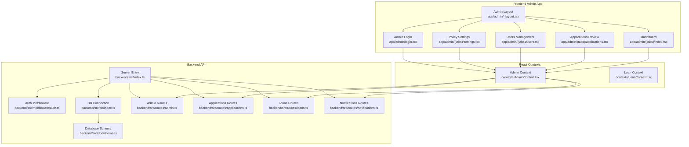
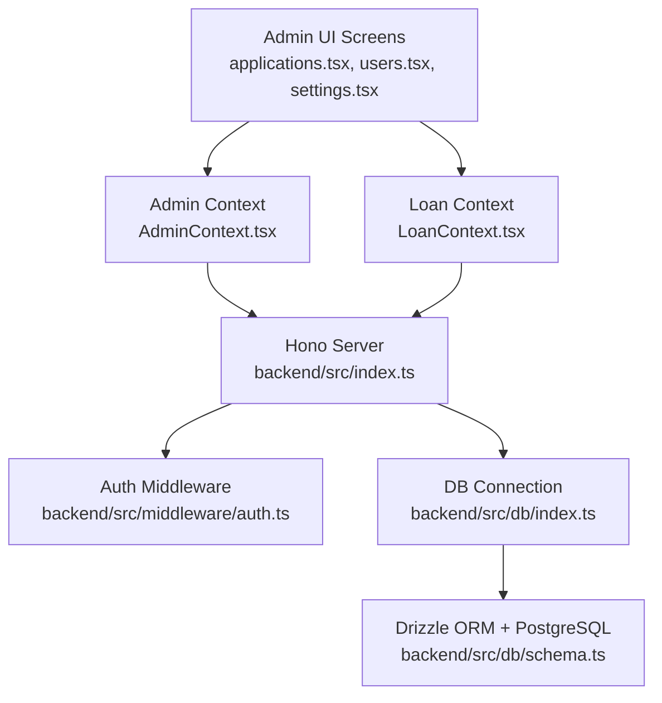
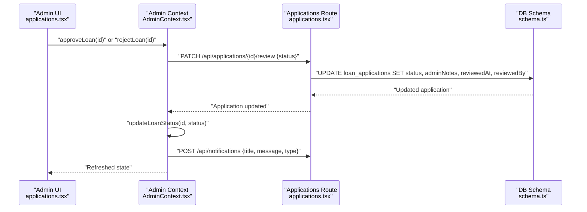
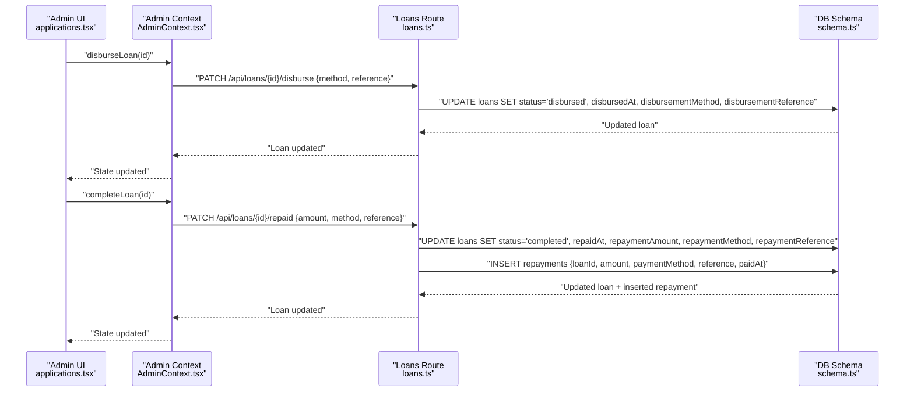
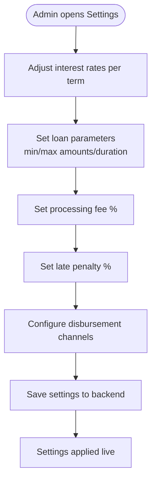
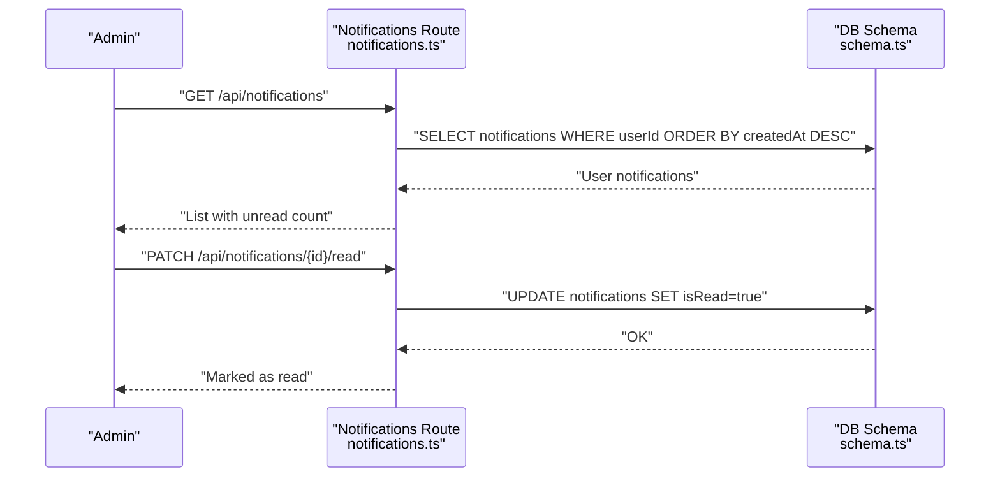
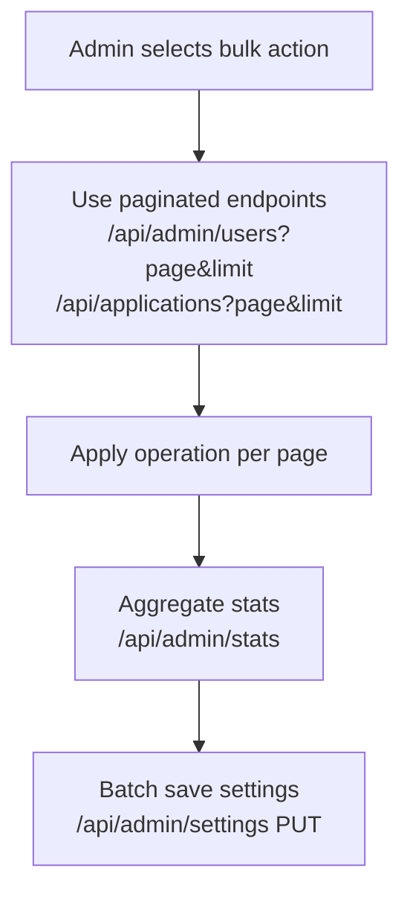
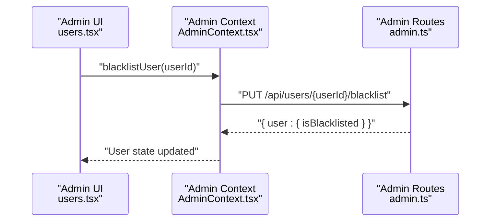
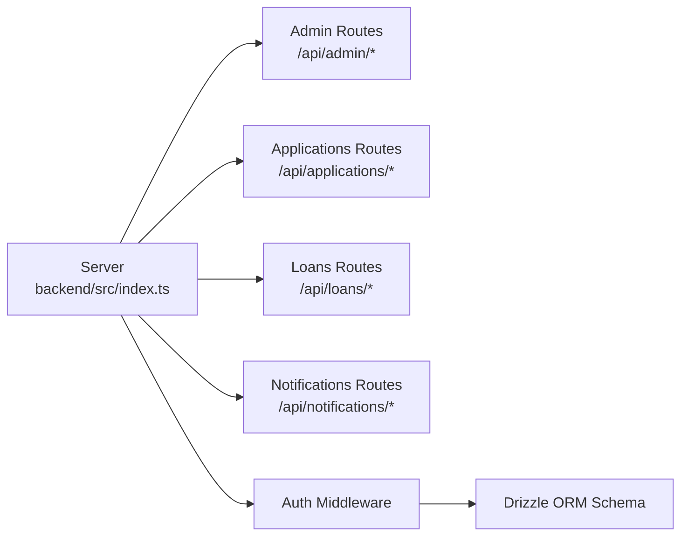

# Loan Administration

<cite>
**Referenced Files in This Document**
- [backend/src/index.ts](file://backend/src/index.ts)
- [backend/src/db/index.ts](file://backend/src/db/index.ts)
- [backend/src/db/schema.ts](file://backend/src/db/schema.ts)
- [backend/src/middleware/auth.ts](file://backend/src/middleware/auth.ts)
- [backend/src/routes/admin.ts](file://backend/src/routes/admin.ts)
- [backend/src/routes/applications.ts](file://backend/src/routes/applications.ts)
- [backend/src/routes/loans.ts](file://backend/src/routes/loans.ts)
- [backend/src/routes/notifications.ts](file://backend/src/routes/notifications.ts)
- [contexts/AdminContext.tsx](file://contexts/AdminContext.tsx)
- [contexts/LoanContext.tsx](file://contexts/LoanContext.tsx)
- [app/admin/_layout.tsx](file://app/admin/_layout.tsx)
- [app/admin/login.tsx](file://app/admin/login.tsx)
- [app/admin/(tabs)/index.tsx](file://app/admin/(tabs)/index.tsx)
- [app/admin/(tabs)/applications.tsx](file://app/admin/(tabs)/applications.tsx)
- [app/admin/(tabs)/settings.tsx](file://app/admin/(tabs)/settings.tsx)
- [app/admin/(tabs)/users.tsx](file://app/admin/(tabs)/users.tsx)
</cite>

## Table of Contents
1. [Introduction](#introduction)
2. [Project Structure](#project-structure)
3. [Core Components](#core-components)
4. [Architecture Overview](#architecture-overview)
5. [Detailed Component Analysis](#detailed-component-analysis)
6. [Dependency Analysis](#dependency-analysis)
7. [Performance Considerations](#performance-considerations)
8. [Troubleshooting Guide](#troubleshooting-guide)
9. [Conclusion](#conclusion)
10. [Appendices](#appendices)

## Introduction
This document describes the administrative loan management system for Phoenix Loan Services. It covers the end-to-end loan lifecycle from application review to disbursement and repayment monitoring, along with administrative controls for policy management, user oversight, and operational dashboards. The system integrates a React Native admin app with a Hono-based backend using Drizzle ORM for PostgreSQL persistence. Administrative features include loan application review, status transitions, disbursement and repayment tracking, policy configuration, and user management.

## Project Structure
The system comprises:
- Backend API built with Hono, exposing REST endpoints for applications, loans, users, notifications, and admin operations.
- Frontend admin application with screens for dashboard, applications review, users management, and settings.
- Shared contexts for admin and loan workflows, plus database schema and authentication middleware.

**Diagram sources**
- [backend/src/index.ts:54-61](file://backend/src/index.ts#L54-L61)
- [backend/src/middleware/auth.ts:10-47](file://backend/src/middleware/auth.ts#L10-L47)
- [backend/src/db/index.ts:40-44](file://backend/src/db/index.ts#L40-L44)
- [backend/src/db/schema.ts:1-146](file://backend/src/db/schema.ts#L1-L146)
- [backend/src/routes/admin.ts:1-171](file://backend/src/routes/admin.ts#L1-L171)
- [backend/src/routes/applications.ts:1-168](file://backend/src/routes/applications.ts#L1-L168)
- [backend/src/routes/loans.ts:1-320](file://backend/src/routes/loans.ts#L1-L320)
- [backend/src/routes/notifications.ts:1-106](file://backend/src/routes/notifications.ts#L1-L106)
- [contexts/AdminContext.tsx:135-521](file://contexts/AdminContext.tsx#L135-L521)
- [contexts/LoanContext.tsx:82-336](file://contexts/LoanContext.tsx#L82-L336)
- [app/admin/_layout.tsx:1-12](file://app/admin/_layout.tsx#L1-L12)

**Section sources**
- [backend/src/index.ts:17-76](file://backend/src/index.ts#L17-L76)
- [backend/src/db/index.ts:1-44](file://backend/src/db/index.ts#L1-L44)
- [backend/src/db/schema.ts:1-146](file://backend/src/db/schema.ts#L1-L146)
- [contexts/AdminContext.tsx:135-521](file://contexts/AdminContext.tsx#L135-L521)
- [contexts/LoanContext.tsx:82-336](file://contexts/LoanContext.tsx#L82-L336)
- [app/admin/_layout.tsx:1-12](file://app/admin/_layout.tsx#L1-L12)

## Core Components
- Admin API surface:
  - Applications: CRUD and review workflow with status transitions.
  - Loans: Lifecycle management including disbursement and repayment.
  - Admin dashboard: stats aggregation and settings management.
  - Notifications: retrieval, marking read, and creation.
- Admin UI:
  - Login with credential checks.
  - Dashboard overview with revenue and pending counts.
  - Applications review cards with actions per status.
  - Users management with KYC verification, limits, scores, and blacklisting.
  - Policy settings for rates, parameters, and disbursement channels.
- Contexts:
  - AdminContext orchestrates admin operations, settings synchronization, and statistics.
  - LoanContext manages user-side loan lifecycle and notifications.

Key implementation references:
- Admin routes and settings: [backend/src/routes/admin.ts:1-171](file://backend/src/routes/admin.ts#L1-L171)
- Applications review: [backend/src/routes/applications.ts:140-165](file://backend/src/routes/applications.ts#L140-L165)
- Loans lifecycle: [backend/src/routes/loans.ts:224-317](file://backend/src/routes/loans.ts#L224-L317)
- Notifications: [backend/src/routes/notifications.ts:8-103](file://backend/src/routes/notifications.ts#L8-L103)
- Admin UI screens: [app/admin/(tabs)/applications.tsx:155-328](file://app/admin/(tabs)/applications.tsx#L155-L328), [app/admin/(tabs)/users.tsx:278-399](file://app/admin/(tabs)/users.tsx#L278-L399), [app/admin/(tabs)/settings.tsx:174-407](file://app/admin/(tabs)/settings.tsx#L174-L407)
- Contexts: [contexts/AdminContext.tsx:135-521](file://contexts/AdminContext.tsx#L135-L521), [contexts/LoanContext.tsx:82-336](file://contexts/LoanContext.tsx#L82-L336)

**Section sources**
- [backend/src/routes/admin.ts:1-171](file://backend/src/routes/admin.ts#L1-L171)
- [backend/src/routes/applications.ts:140-165](file://backend/src/routes/applications.ts#L140-L165)
- [backend/src/routes/loans.ts:224-317](file://backend/src/routes/loans.ts#L224-L317)
- [backend/src/routes/notifications.ts:8-103](file://backend/src/routes/notifications.ts#L8-L103)
- [contexts/AdminContext.tsx:135-521](file://contexts/AdminContext.tsx#L135-L521)
- [contexts/LoanContext.tsx:82-336](file://contexts/LoanContext.tsx#L82-L336)
- [app/admin/(tabs)/applications.tsx:155-328](file://app/admin/(tabs)/applications.tsx#L155-L328)
- [app/admin/(tabs)/users.tsx:278-399](file://app/admin/(tabs)/users.tsx#L278-L399)
- [app/admin/(tabs)/settings.tsx:174-407](file://app/admin/(tabs)/settings.tsx#L174-L407)

## Architecture Overview
The system follows a layered architecture:
- Presentation layer: React Native admin app with screens and navigation.
- Business logic layer: React contexts coordinate API calls and state.
- API layer: Hono routes expose endpoints for applications, loans, admin, and notifications.
- Persistence layer: Drizzle ORM with PostgreSQL schema for users, loans, applications, repayments, notifications, and settings.

**Diagram sources**
- [backend/src/index.ts:54-61](file://backend/src/index.ts#L54-L61)
- [backend/src/middleware/auth.ts:10-47](file://backend/src/middleware/auth.ts#L10-L47)
- [backend/src/db/index.ts:40-44](file://backend/src/db/index.ts#L40-L44)
- [backend/src/db/schema.ts:1-146](file://backend/src/db/schema.ts#L1-L146)
- [contexts/AdminContext.tsx:135-521](file://contexts/AdminContext.tsx#L135-L521)
- [contexts/LoanContext.tsx:82-336](file://contexts/LoanContext.tsx#L82-L336)
- [app/admin/(tabs)/applications.tsx:155-328](file://app/admin/(tabs)/applications.tsx#L155-L328)
- [app/admin/(tabs)/users.tsx:278-399](file://app/admin/(tabs)/users.tsx#L278-L399)
- [app/admin/(tabs)/settings.tsx:174-407](file://app/admin/(tabs)/settings.tsx#L174-L407)

## Detailed Component Analysis

### Loan Application Review Workflow
Administrators review applications and decide approval or rejection. The process includes:
- Fetching applications with related user and loan data.
- Updating application status with admin notes and timestamps.
- Sending notifications to applicants upon outcomes.

**Diagram sources**
- [app/admin/(tabs)/applications.tsx:170-250](file://app/admin/(tabs)/applications.tsx#L170-L250)
- [contexts/AdminContext.tsx:311-361](file://contexts/AdminContext.tsx#L311-L361)
- [backend/src/routes/applications.ts:140-165](file://backend/src/routes/applications.ts#L140-L165)
- [backend/src/db/schema.ts:48-63](file://backend/src/db/schema.ts#L48-L63)

**Section sources**
- [backend/src/routes/applications.ts:24-108](file://backend/src/routes/applications.ts#L24-L108)
- [backend/src/routes/applications.ts:140-165](file://backend/src/routes/applications.ts#L140-L165)
- [contexts/AdminContext.tsx:311-361](file://contexts/AdminContext.tsx#L311-L361)
- [app/admin/(tabs)/applications.tsx:170-250](file://app/admin/(tabs)/applications.tsx#L170-L250)

### Disbursement and Repayment Tracking
Administrators can mark loans as disbursed and repaid, updating status and associated metadata. Repayment records are persisted separately.

**Diagram sources**
- [app/admin/(tabs)/applications.tsx:206-250](file://app/admin/(tabs)/applications.tsx#L206-L250)
- [contexts/AdminContext.tsx:363-413](file://contexts/AdminContext.tsx#L363-L413)
- [backend/src/routes/loans.ts:224-317](file://backend/src/routes/loans.ts#L224-L317)
- [backend/src/db/schema.ts:23-77](file://backend/src/db/schema.ts#L23-L77)

**Section sources**
- [backend/src/routes/loans.ts:224-317](file://backend/src/routes/loans.ts#L224-L317)
- [contexts/AdminContext.tsx:363-413](file://contexts/AdminContext.tsx#L363-L413)
- [app/admin/(tabs)/applications.tsx:206-250](file://app/admin/(tabs)/applications.tsx#L206-L250)

### Risk Evaluation and Automated Underwriting
Risk evaluation and automated underwriting are configured via policy settings:
- Interest rates by term (weekly bands).
- Processing fee percentage.
- Penalty rate for late payments.
- Loan parameters (min/max amounts, min/max durations).
- Disbursement channels (mobile money and bank accounts).

**Diagram sources**
- [app/admin/(tabs)/settings.tsx:174-407](file://app/admin/(tabs)/settings.tsx#L174-L407)
- [contexts/AdminContext.tsx:462-478](file://contexts/AdminContext.tsx#L462-L478)
- [backend/src/routes/admin.ts:127-168](file://backend/src/routes/admin.ts#L127-L168)

**Section sources**
- [app/admin/(tabs)/settings.tsx:174-407](file://app/admin/(tabs)/settings.tsx#L174-L407)
- [contexts/AdminContext.tsx:462-478](file://contexts/AdminContext.tsx#L462-L478)
- [backend/src/routes/admin.ts:127-168](file://backend/src/routes/admin.ts#L127-L168)

### Compliance Reporting and Audit Trail
- Notifications provide audit-like records for key events (approval, rejection, disbursement, repayment).
- Admin endpoints support retrieving and managing notifications.
- Application and loan updates capture timestamps and reviewer/admin metadata.

**Diagram sources**
- [backend/src/routes/notifications.ts:8-103](file://backend/src/routes/notifications.ts#L8-L103)
- [backend/src/db/schema.ts:79-88](file://backend/src/db/schema.ts#L79-L88)

**Section sources**
- [backend/src/routes/notifications.ts:8-103](file://backend/src/routes/notifications.ts#L8-L103)
- [backend/src/db/schema.ts:79-88](file://backend/src/db/schema.ts#L79-L88)

### Bulk Operations and Batch Processing
- Admin dashboard aggregates stats across all loans and users.
- Pagination is supported for users and applications to enable batch operations at scale.
- Settings can be saved as a batch to update policy configuration atomically.

**Diagram sources**
- [backend/src/routes/admin.ts:9-47](file://backend/src/routes/admin.ts#L9-L47)
- [backend/src/routes/admin.ts:49-94](file://backend/src/routes/admin.ts#L49-L94)
- [backend/src/routes/admin.ts:146-168](file://backend/src/routes/admin.ts#L146-L168)

**Section sources**
- [backend/src/routes/admin.ts:9-47](file://backend/src/routes/admin.ts#L9-L47)
- [backend/src/routes/admin.ts:49-94](file://backend/src/routes/admin.ts#L49-L94)
- [backend/src/routes/admin.ts:146-168](file://backend/src/routes/admin.ts#L146-L168)

### Emergency Intervention Capabilities
- Administrators can blacklist users and adjust credit scores and loan limits.
- Immediate UI feedback and confirmation dialogs are used for sensitive actions.

**Diagram sources**
- [app/admin/(tabs)/users.tsx:300-335](file://app/admin/(tabs)/users.tsx#L300-L335)
- [contexts/AdminContext.tsx:415-425](file://contexts/AdminContext.tsx#L415-L425)
- [backend/src/routes/admin.ts:146-168](file://backend/src/routes/admin.ts#L146-L168)

**Section sources**
- [app/admin/(tabs)/users.tsx:300-335](file://app/admin/(tabs)/users.tsx#L300-L335)
- [contexts/AdminContext.tsx:415-425](file://contexts/AdminContext.tsx#L415-L425)
- [backend/src/routes/admin.ts:146-168](file://backend/src/routes/admin.ts#L146-L168)

## Dependency Analysis
- API routing:
  - Server mounts routes under /api with dedicated namespaces for admin, applications, loans, users, and notifications.
- Authentication:
  - JWT-based middleware validates tokens and enforces admin-only access for admin routes.
- Database:
  - Drizzle ORM schema defines tables and relations for users, loans, applications, repayments, notifications, and settings.

**Diagram sources**
- [backend/src/index.ts:54-61](file://backend/src/index.ts#L54-L61)
- [backend/src/middleware/auth.ts:10-47](file://backend/src/middleware/auth.ts#L10-L47)
- [backend/src/db/schema.ts:1-146](file://backend/src/db/schema.ts#L1-L146)

**Section sources**
- [backend/src/index.ts:54-61](file://backend/src/index.ts#L54-L61)
- [backend/src/middleware/auth.ts:10-47](file://backend/src/middleware/auth.ts#L10-L47)
- [backend/src/db/schema.ts:1-146](file://backend/src/db/schema.ts#L1-L146)

## Performance Considerations
- Pagination: Admin endpoints for users and applications use page and limit parameters to control payload sizes.
- Aggregation: Dashboard stats use SQL aggregations to minimize data transfer.
- Local caching: AdminContext caches data and supports refresh to reduce network overhead.
- Column existence checks: Loans route ensures optional columns exist before updates.

Recommendations:
- Index frequently queried columns (e.g., status, createdAt) in production.
- Use connection pooling and timeouts appropriately configured.
- Consider background jobs for heavy batch operations.

**Section sources**
- [backend/src/routes/admin.ts:9-47](file://backend/src/routes/admin.ts#L9-L47)
- [backend/src/routes/admin.ts:96-125](file://backend/src/routes/admin.ts#L96-L125)
- [contexts/AdminContext.tsx:480-491](file://contexts/AdminContext.tsx#L480-L491)
- [backend/src/routes/loans.ts:10-79](file://backend/src/routes/loans.ts#L10-L79)

## Troubleshooting Guide
Common issues and resolutions:
- Unauthorized access:
  - Ensure Authorization header with Bearer token is present and valid.
  - Admin endpoints require role=admin.
- Missing X-User-Id:
  - Some endpoints rely on X-User-Id header for user-scoped operations.
- Network errors:
  - Verify DATABASE_URL environment variable and connectivity.
  - Confirm CORS origins and credentials configuration.
- Settings save failures:
  - Validate JSON structure for settings keys and values.
- Disbursement/Repayment errors:
  - Confirm loan exists and status allows the requested transition.

Operational checks:
- Health endpoint: GET /health
- API docs: GET /docs (Swagger UI)

**Section sources**
- [backend/src/middleware/auth.ts:10-47](file://backend/src/middleware/auth.ts#L10-L47)
- [backend/src/db/index.ts:31-38](file://backend/src/db/index.ts#L31-L38)
- [backend/src/index.ts:29-52](file://backend/src/index.ts#L29-L52)
- [contexts/AdminContext.tsx:462-478](file://contexts/AdminContext.tsx#L462-L478)
- [backend/src/routes/loans.ts:224-317](file://backend/src/routes/loans.ts#L224-L317)

## Conclusion
The Phoenix Loan Administration system provides a comprehensive, admin-driven workflow for loan lifecycle management. It integrates a React Native admin interface with a robust backend API and database schema, enabling efficient review, disbursement, repayment tracking, and policy configuration. Built-in notifications and audit-friendly updates support compliance and transparency. The modular design and pagination facilitate scalability and batch operations.

## Appendices

### API Endpoint Reference (Selected)
- Applications
  - GET /api/applications
  - GET /api/applications/my-applications
  - GET /api/applications/:id
  - POST /api/applications
  - PATCH /api/applications/:id/review
- Loans
  - GET /api/loans
  - GET /api/loans/my-loans
  - GET /api/loans/:id
  - POST /api/loans
  - PATCH /api/loans/:id/status
  - PATCH /api/loans/:id/disburse
  - PATCH /api/loans/:id/repaid
  - PATCH /api/loans/:id/complete
- Admin
  - GET /api/admin/users
  - GET /api/admin/loans
  - GET /api/admin/stats
  - GET /api/admin/settings
  - PUT /api/admin/settings
- Notifications
  - GET /api/notifications
  - PATCH /api/notifications/:id/read
  - PATCH /api/notifications/read-all
  - POST /api/notifications

**Section sources**
- [backend/src/routes/applications.ts:24-165](file://backend/src/routes/applications.ts#L24-L165)
- [backend/src/routes/loans.ts:92-317](file://backend/src/routes/loans.ts#L92-L317)
- [backend/src/routes/admin.ts:9-168](file://backend/src/routes/admin.ts#L9-L168)
- [backend/src/routes/notifications.ts:8-103](file://backend/src/routes/notifications.ts#L8-L103)