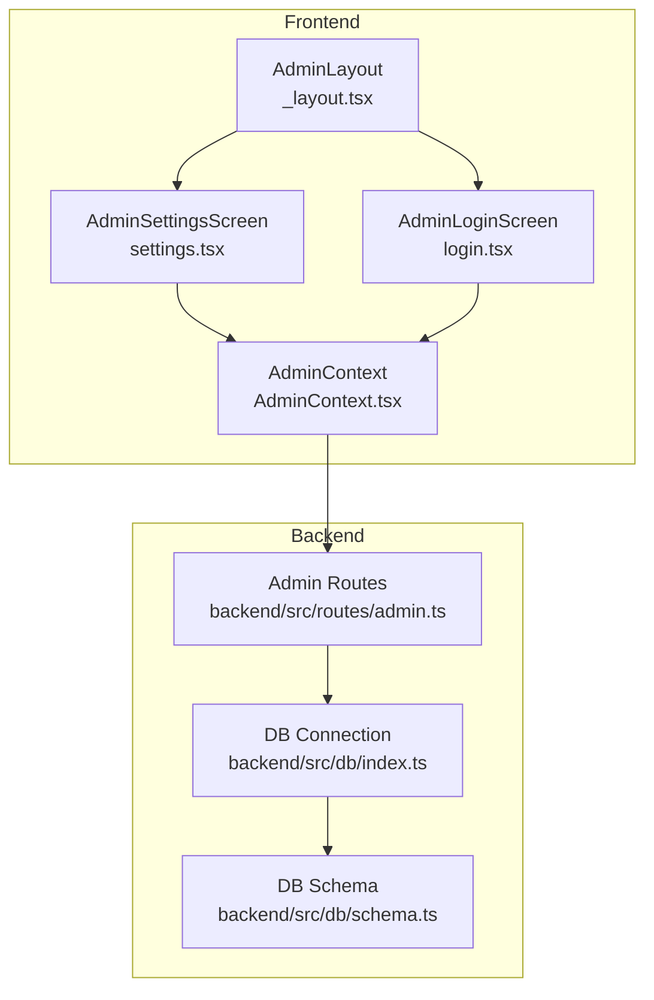
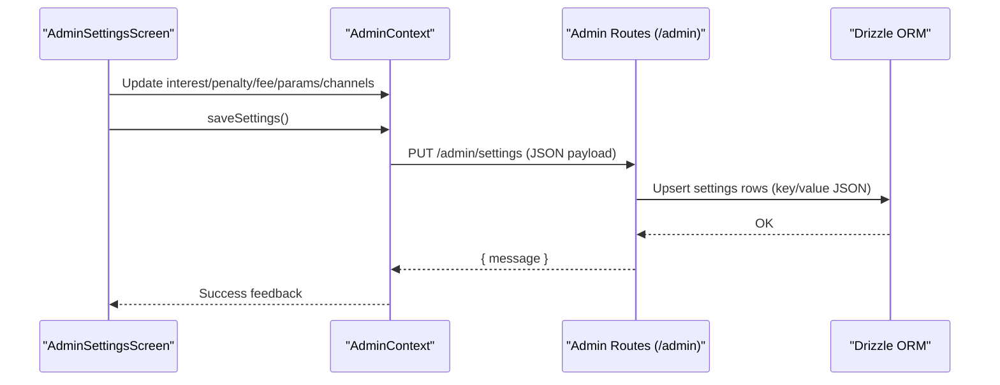
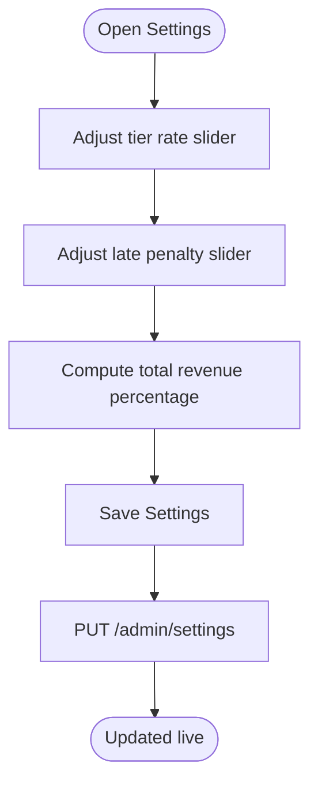
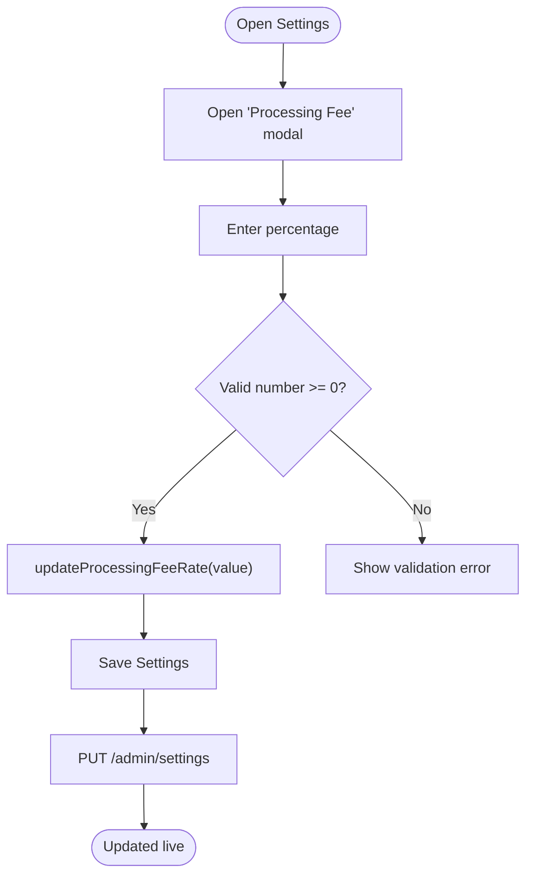
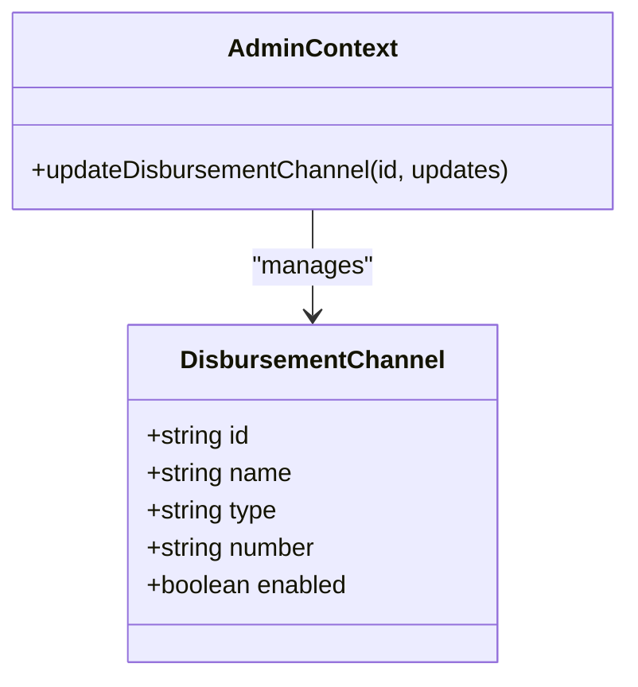
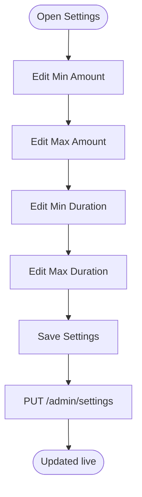
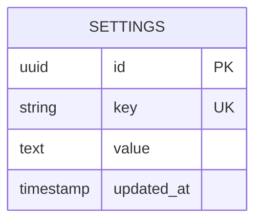
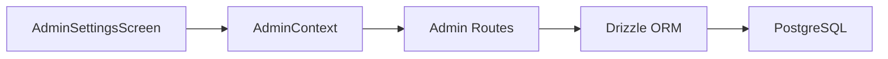

# System Settings

<cite>
**Referenced Files in This Document**
- [settings.tsx](file://app/admin/(tabs)/settings.tsx)
- [AdminContext.tsx](file://contexts/AdminContext.tsx)
- [admin.ts](file://backend/src/routes/admin.ts)
- [schema.ts (backend db)](file://backend/src/db/schema.ts)
- [index.ts (backend db)](file://backend/src/db/index.ts)
- [login.tsx](file://app/admin/login.tsx)
- [_layout.tsx (admin)](file://app/admin/_layout.tsx)
- [README.md](file://README.md)
- [BACKEND_SETUP.md](file://BACKEND_SETUP.md)
- [SECURITY_EMERGENCY.md](file://SECURITY_EMERGENCY.md)
</cite>

## Table of Contents
1. [Introduction](#introduction)
2. [Project Structure](#project-structure)
3. [Core Components](#core-components)
4. [Architecture Overview](#architecture-overview)
5. [Detailed Component Analysis](#detailed-component-analysis)
6. [Dependency Analysis](#dependency-analysis)
7. [Performance Considerations](#performance-considerations)
8. [Troubleshooting Guide](#troubleshooting-guide)
9. [Conclusion](#conclusion)
10. [Appendices](#appendices)

## Introduction
This document describes the administrative system configuration interface for Phoenix Loan Services, focusing on how administrators configure and manage system parameters. It covers:
- Interest rate management (rate calculation, effective date handling, historical tracking)
- Processing fee configuration and fee structure management
- Disbursement channels and payment method configurations
- System-wide policy settings and business rule configuration
- Operational parameters and maintenance modes
- Backup and restore procedures, emergency shutdown capabilities
- Examples of configuration workflows, parameter validation, and change management

## Project Structure
The administrative settings interface is implemented as a React Native screen backed by a context provider that communicates with a Hono-based backend. Settings are persisted in a PostgreSQL database via Drizzle ORM.

**Diagram sources**
- [settings.tsx:174-407](file://app/admin/(tabs)/settings.tsx#L174-L407)
- [AdminContext.tsx:135-521](file://contexts/AdminContext.tsx#L135-L521)
- [login.tsx:17-306](file://app/admin/login.tsx#L17-L306)
- [_layout.tsx:1-12](file://app/admin/_layout.tsx#L1-L12)
- [admin.ts:127-170](file://backend/src/routes/admin.ts#L127-L170)
- [index.ts (backend db):1-44](file://backend/src/db/index.ts#L1-L44)
- [schema.ts (backend db):90-96](file://backend/src/db/schema.ts#L90-L96)

**Section sources**
- [settings.tsx:174-407](file://app/admin/(tabs)/settings.tsx#L174-L407)
- [AdminContext.tsx:135-521](file://contexts/AdminContext.tsx#L135-L521)
- [admin.ts:127-170](file://backend/src/routes/admin.ts#L127-L170)
- [schema.ts (backend db):90-96](file://backend/src/db/schema.ts#L90-L96)

## Core Components
- AdminSettingsScreen: Presents interest rates, penalties, processing fees, loan parameters, and disbursement channels. Provides inline editing via modals and a Save button to persist changes.
- AdminContext: Holds current settings state, applies local updates, and persists them to the backend via PUT /admin/settings.
- Backend Admin Routes: Fetches current settings and updates them in the settings table.
- Database Schema: Defines the settings table with key/value pairs stored as JSON.

Key responsibilities:
- Interest Rate Configuration: Sliders for multiple tiers and a late penalty rate.
- Processing Fee Configuration: Flat percentage editable via modal.
- Loan Parameters: Minimum/maximum amounts and durations.
- Disbursement Channels: Mobile money and bank channels with editable numbers.
- Persistence: saveSettings sends the entire settings payload to the backend.

**Section sources**
- [settings.tsx:174-407](file://app/admin/(tabs)/settings.tsx#L174-L407)
- [AdminContext.tsx:462-478](file://contexts/AdminContext.tsx#L462-L478)
- [admin.ts:127-170](file://backend/src/routes/admin.ts#L127-L170)
- [schema.ts (backend db):90-96](file://backend/src/db/schema.ts#L90-L96)

## Architecture Overview
The settings configuration flow connects the UI to the backend and database.

**Diagram sources**
- [settings.tsx:188-196](file://app/admin/(tabs)/settings.tsx#L188-L196)
- [AdminContext.tsx:462-478](file://contexts/AdminContext.tsx#L462-L478)
- [admin.ts:146-168](file://backend/src/routes/admin.ts#L146-L168)
- [schema.ts (backend db):90-96](file://backend/src/db/schema.ts#L90-L96)

## Detailed Component Analysis

### Interest Rate Management
- Configuration surface:
  - Multiple tiers defined by days and labels, each with a configurable rate.
  - Late penalty rate as a separate percentage.
- Calculation and presentation:
  - Sliders enforce minimum/maximum bounds and step increments.
  - Total revenue percentage computed client-side as the sum of interest rates plus processing fee.
- Effective date handling:
  - Current implementation does not model per-effective-date rate sets. Rates are represented as a static array of tiers.
- Historical tracking:
  - No explicit historical audit is implemented in the UI or backend for rate changes.

**Diagram sources**
- [settings.tsx:264-293](file://app/admin/(tabs)/settings.tsx#L264-L293)
- [settings.tsx:232](file://app/admin/(tabs)/settings.tsx#L232)
- [AdminContext.tsx:462-478](file://contexts/AdminContext.tsx#L462-L478)

**Section sources**
- [settings.tsx:264-293](file://app/admin/(tabs)/settings.tsx#L264-L293)
- [settings.tsx:232](file://app/admin/(tabs)/settings.tsx#L232)
- [AdminContext.tsx:450-460](file://contexts/AdminContext.tsx#L450-L460)

### Processing Fee Configuration and Fee Structure Management
- Configuration surface:
  - Flat processing fee percentage editable via modal.
- Validation:
  - Numeric input validated to be a non-negative float; converted to fraction before update.
- Fee structure:
  - Single flat-rate fee applied uniformly across loans.

**Diagram sources**
- [settings.tsx:198-212](file://app/admin/(tabs)/settings.tsx#L198-L212)
- [AdminContext.tsx:458-460](file://contexts/AdminContext.tsx#L458-L460)
- [admin.ts:146-168](file://backend/src/routes/admin.ts#L146-L168)

**Section sources**
- [settings.tsx:198-212](file://app/admin/(tabs)/settings.tsx#L198-L212)
- [AdminContext.tsx:458-460](file://contexts/AdminContext.tsx#L458-L460)

### Disbursement Channel Settings and Payment Methods
- Configuration surface:
  - Disbursement channels include mobile money and bank accounts with editable numbers.
- Editing:
  - Each channel’s number is editable via modal.
- Integration parameters:
  - Disbursement method and reference fields are present in the backend schema for loans; the admin settings screen exposes channel numbers for configuration.

**Diagram sources**
- [AdminContext.tsx:69-75](file://contexts/AdminContext.tsx#L69-L75)
- [AdminContext.tsx:442-444](file://contexts/AdminContext.tsx#L442-L444)
- [schema.ts (backend db):24-46](file://backend/src/db/schema.ts#L24-L46)

**Section sources**
- [settings.tsx:310-327](file://app/admin/(tabs)/settings.tsx#L310-L327)
- [AdminContext.tsx:442-444](file://contexts/AdminContext.tsx#L442-L444)
- [schema.ts (backend db):24-46](file://backend/src/db/schema.ts#L24-L46)

### Loan Parameters and Business Rule Configuration
- Parameters managed:
  - Minimum and maximum loan amounts
  - Minimum and maximum loan durations (days)
- Editing:
  - All parameters are editable via modals with numeric validation.
- Business rules:
  - No explicit rule engine is implemented; parameters are stored and applied by the frontend mapping logic.

**Diagram sources**
- [settings.tsx:295-308](file://app/admin/(tabs)/settings.tsx#L295-L308)
- [AdminContext.tsx:446-448](file://contexts/AdminContext.tsx#L446-L448)

**Section sources**
- [settings.tsx:295-308](file://app/admin/(tabs)/settings.tsx#L295-L308)
- [AdminContext.tsx:446-448](file://contexts/AdminContext.tsx#L446-L448)

### System-wide Policy Management
- Policies stored as key/value pairs in the settings table.
- Current keys observed in the frontend context loader:
  - interestRates
  - disbursementChannels
  - loanParameters
  - penaltyRate
  - processingFeeRate

**Diagram sources**
- [schema.ts (backend db):90-96](file://backend/src/db/schema.ts#L90-L96)

**Section sources**
- [admin.ts:127-144](file://backend/src/routes/admin.ts#L127-L144)
- [AdminContext.tsx:228-235](file://contexts/AdminContext.tsx#L228-L235)

### Operational Parameters and Maintenance Modes
- Session management:
  - Admin login state is persisted locally; logging out clears cached data and session.
- Maintenance and emergency:
  - No dedicated maintenance mode or emergency shutdown endpoints are exposed in the admin routes.
  - Emergency actions (repository privacy, credential removal) are documented separately.

**Section sources**
- [login.tsx:287-302](file://app/admin/login.tsx#L287-L302)
- [AdminContext.tsx:297-302](file://contexts/AdminContext.tsx#L297-L302)
- [SECURITY_EMERGENCY.md:1-53](file://SECURITY_EMERGENCY.md#L1-L53)

## Dependency Analysis
- Frontend depends on AdminContext for state and persistence.
- AdminContext depends on backend admin routes for fetching/updating settings.
- Backend admin routes depend on Drizzle ORM and the settings table.

**Diagram sources**
- [settings.tsx:174-181](file://app/admin/(tabs)/settings.tsx#L174-L181)
- [AdminContext.tsx:462-478](file://contexts/AdminContext.tsx#L462-L478)
- [admin.ts:127-170](file://backend/src/routes/admin.ts#L127-L170)
- [index.ts (backend db):1-44](file://backend/src/db/index.ts#L1-L44)
- [schema.ts (backend db):90-96](file://backend/src/db/schema.ts#L90-L96)

**Section sources**
- [settings.tsx:174-181](file://app/admin/(tabs)/settings.tsx#L174-L181)
- [AdminContext.tsx:462-478](file://contexts/AdminContext.tsx#L462-L478)
- [admin.ts:127-170](file://backend/src/routes/admin.ts#L127-L170)

## Performance Considerations
- Settings retrieval uses a single GET /admin/settings returning a flattened key/value map.
- Updates batch all settings in one PUT request, minimizing network round-trips.
- Client-side computations (e.g., total revenue percentage) are lightweight.

[No sources needed since this section provides general guidance]

## Troubleshooting Guide
- Settings not saving:
  - Verify backend connectivity and that PUT /admin/settings returns success.
  - Check database connection and environment variables.
- Unexpected values after reload:
  - Confirm that the frontend context merges backend settings into state.
- Login/logout issues:
  - Ensure local session storage is writable and credentials match the admin context defaults.

**Section sources**
- [admin.ts:146-168](file://backend/src/routes/admin.ts#L146-L168)
- [index.ts (backend db):31-44](file://backend/src/db/index.ts#L31-L44)
- [login.tsx:42-59](file://app/admin/login.tsx#L42-L59)
- [AdminContext.tsx:297-302](file://contexts/AdminContext.tsx#L297-L302)

## Conclusion
The administrative settings interface provides a comprehensive, user-friendly way to configure interest rates, processing fees, loan parameters, and disbursement channels. While the current implementation focuses on immediate configuration and persistence, future enhancements could include:
- Per-effective-date rate sets and historical audits
- Explicit rule validation and enforcement
- Dedicated maintenance and emergency shutdown endpoints
- Backup/restore of settings via export/import mechanisms

[No sources needed since this section summarizes without analyzing specific files]

## Appendices

### Configuration Workflows and Examples
- Interest rate configuration:
  - Adjust sliders for each tier and penalty; save to persist.
- Processing fee configuration:
  - Enter a percentage in the modal; ensure non-negative numeric input.
- Loan parameter configuration:
  - Edit min/max amounts and durations via numeric modals.
- Disbursement channel configuration:
  - Edit channel numbers for mobile money and bank channels.

**Section sources**
- [settings.tsx:198-212](file://app/admin/(tabs)/settings.tsx#L198-L212)
- [settings.tsx:295-308](file://app/admin/(tabs)/settings.tsx#L295-L308)
- [settings.tsx:310-327](file://app/admin/(tabs)/settings.tsx#L310-L327)

### Parameter Validation and Change Management
- Validation:
  - Numeric inputs sanitized and parsed; invalid entries are rejected.
- Change management:
  - Local state updates immediately; save persists to backend.
- Audit:
  - No built-in audit trail for settings changes.

**Section sources**
- [settings.tsx:198-212](file://app/admin/(tabs)/settings.tsx#L198-L212)
- [AdminContext.tsx:462-478](file://contexts/AdminContext.tsx#L462-L478)

### Backup and Restore Procedures
- Current state:
  - Settings are stored in the settings table as JSON.
  - No dedicated backup/restore endpoints are exposed.
- Recommended procedure:
  - Export settings via GET /admin/settings and store externally.
  - To restore, issue PUT /admin/settings with exported payload.

**Section sources**
- [admin.ts:127-144](file://backend/src/routes/admin.ts#L127-L144)
- [admin.ts:146-168](file://backend/src/routes/admin.ts#L146-L168)

### System Maintenance and Emergency Shutdown
- Maintenance:
  - No dedicated maintenance mode endpoints are present.
- Emergency:
  - Follow repository security emergency actions to protect credentials and access.

**Section sources**
- [SECURITY_EMERGENCY.md:1-53](file://SECURITY_EMERGENCY.md#L1-L53)