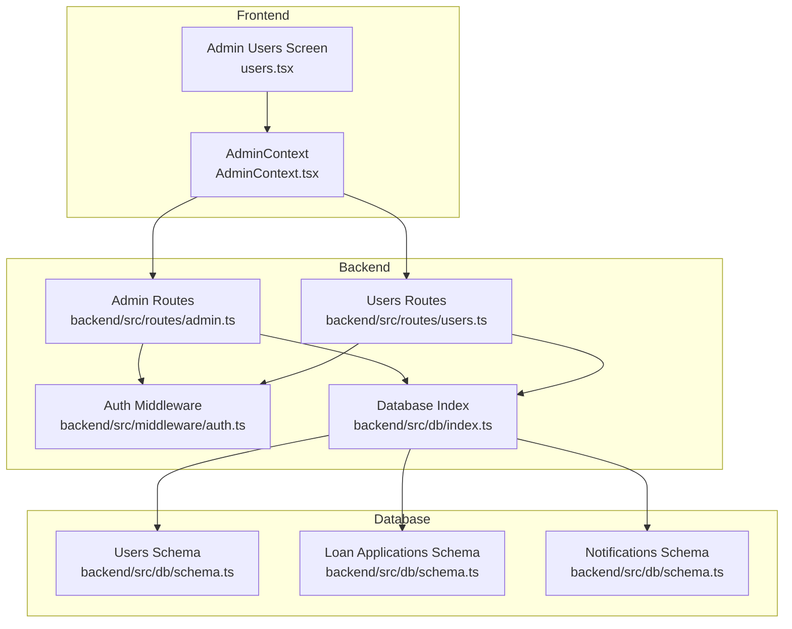
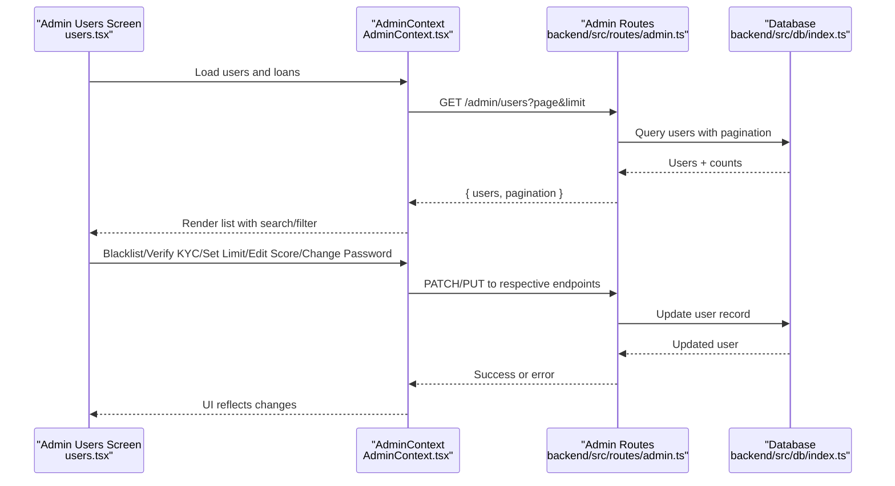
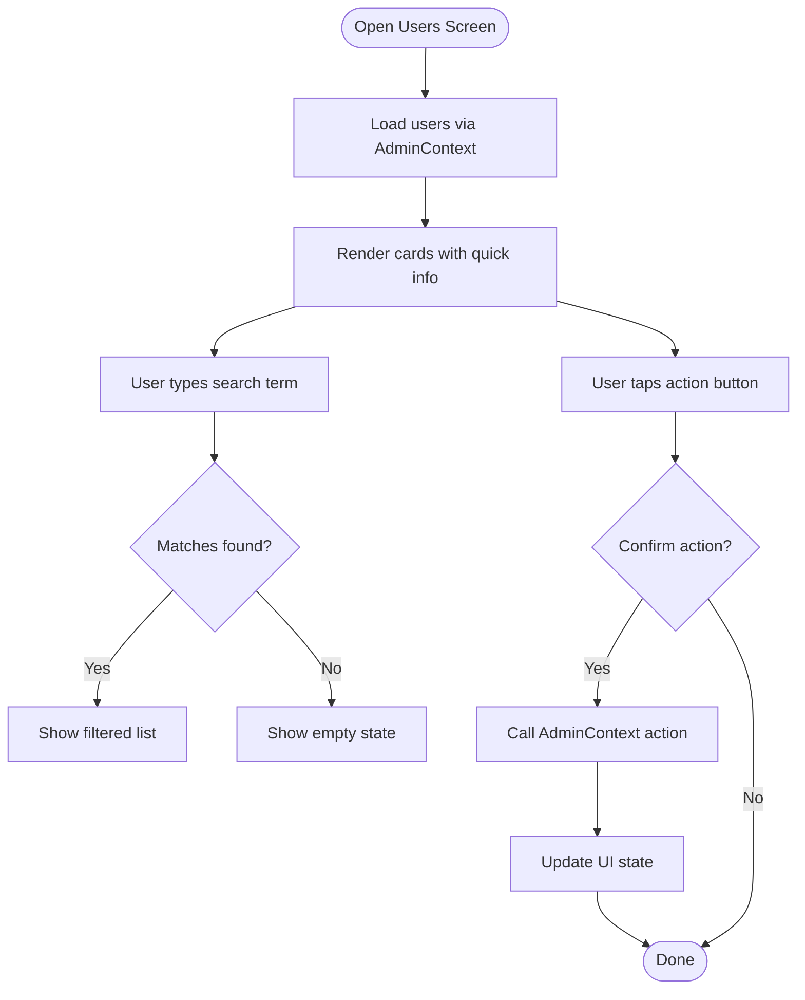
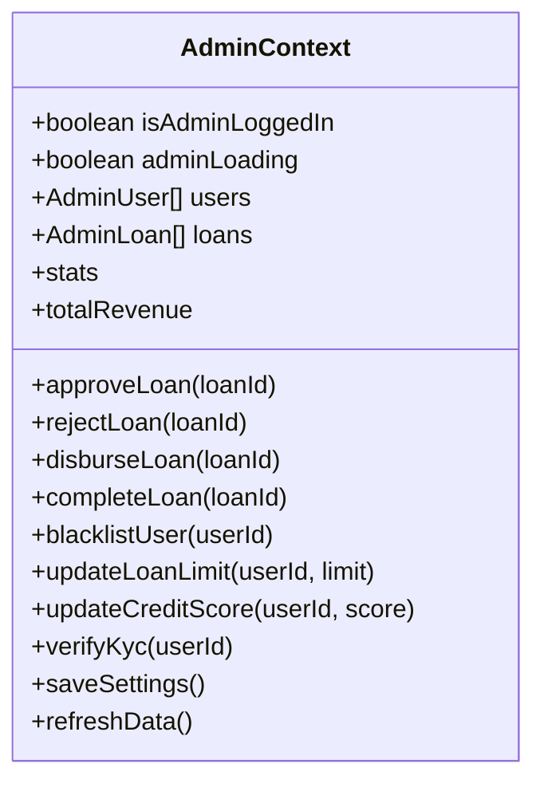
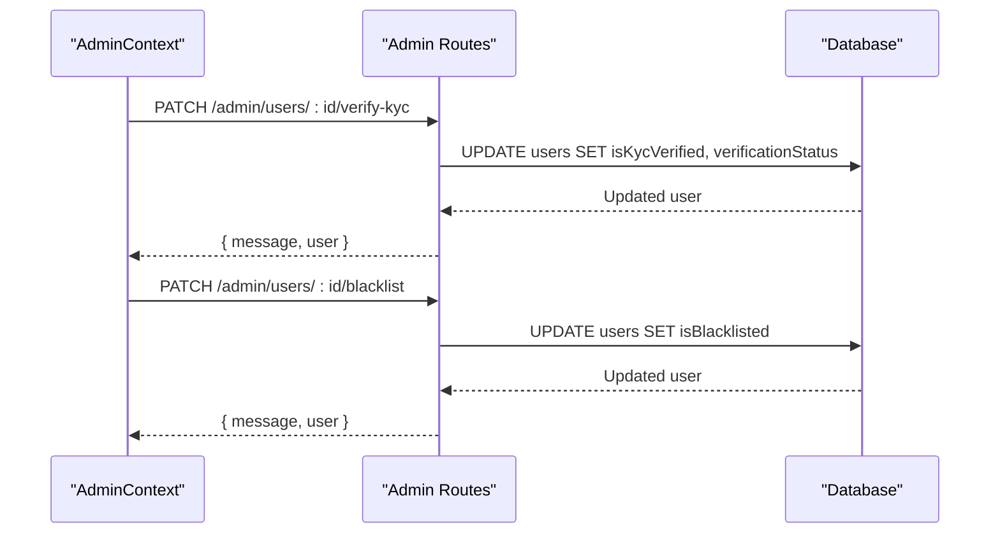
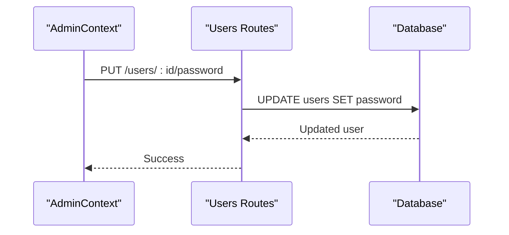
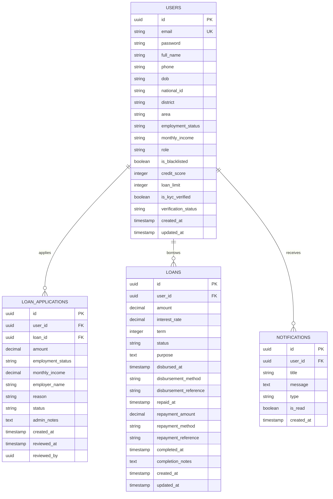
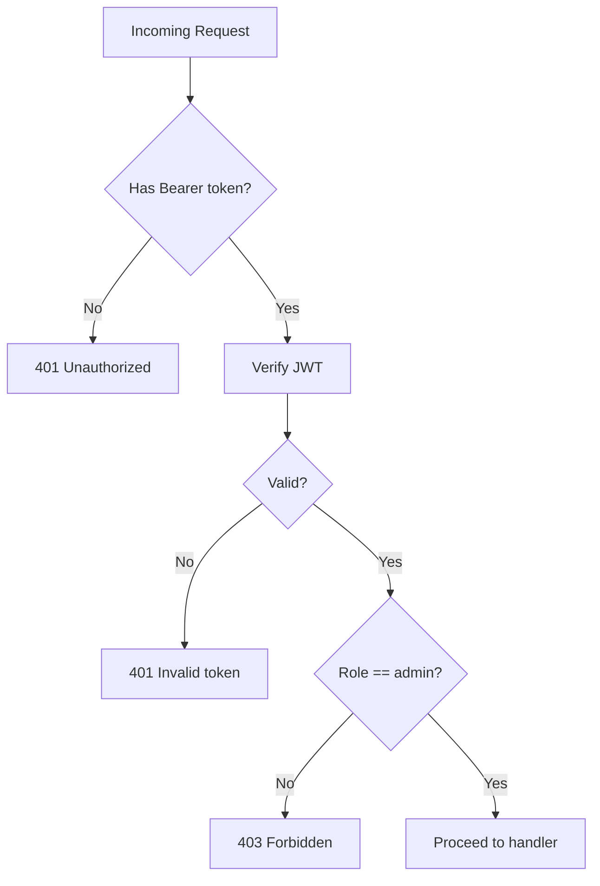
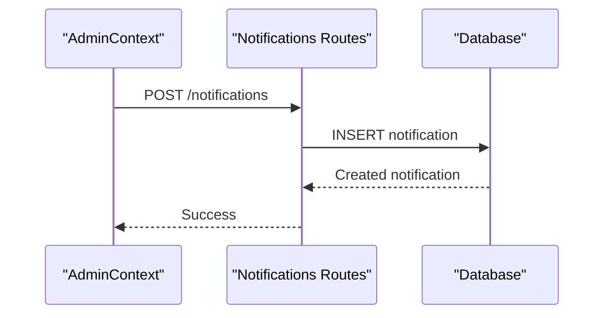
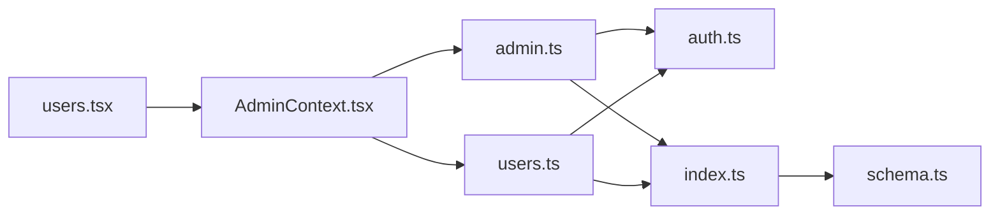

# User Management

<cite>
**Referenced Files in This Document**
- [users.tsx](file://app/admin/(tabs)/users.tsx)
- [AdminContext.tsx](file://contexts/AdminContext.tsx)
- [admin.ts](file://backend/src/routes/admin.ts)
- [users.ts](file://backend/src/routes/users.ts)
- [schema.ts](file://backend/src/db/schema.ts)
- [auth.ts](file://backend/src/middleware/auth.ts)
- [index.ts](file://backend/src/db/index.ts)
- [notifications.ts](file://backend/src/routes/notifications.ts)
- [index.tsx](file://app/admin/(tabs)/index.tsx)
</cite>

## Table of Contents
1. [Introduction](#introduction)
2. [Project Structure](#project-structure)
3. [Core Components](#core-components)
4. [Architecture Overview](#architecture-overview)
5. [Detailed Component Analysis](#detailed-component-analysis)
6. [Dependency Analysis](#dependency-analysis)
7. [Performance Considerations](#performance-considerations)
8. [Troubleshooting Guide](#troubleshooting-guide)
9. [Conclusion](#conclusion)
10. [Appendices](#appendices)

## Introduction
This document describes the administrative user management system for the Phoenix lending platform. It covers how administrators view user profiles, manage KYC verification, blacklist users, adjust credit scores and loan limits, change passwords, and perform bulk-like operations via search and pagination. It also documents analytics, activity monitoring, compliance reporting, audit trails, and user communication features.

## Project Structure
The user management system spans three layers:
- Frontend (React Native): Admin screens and state management for user lists, actions, and analytics.
- Backend (Hono server): Admin routes for user CRUD, KYC, blacklist toggling, and analytics.
- Database (PostgreSQL via Drizzle): Schema for users, applications, loans, repayments, and notifications.

**Diagram sources**
- [users.tsx](file://app/admin/(tabs)/users.tsx#L278-L399)
- [AdminContext.tsx:135-541](file://contexts/AdminContext.tsx#L135-L541)
- [admin.ts:1-543](file://backend/src/routes/admin.ts#L1-L543)
- [users.ts:1-197](file://backend/src/routes/users.ts#L1-L197)
- [auth.ts:1-48](file://backend/src/middleware/auth.ts#L1-L48)
- [index.ts:1-44](file://backend/src/db/index.ts#L1-L44)
- [schema.ts:1-151](file://backend/src/db/schema.ts#L1-L151)

**Section sources**
- [users.tsx](file://app/admin/(tabs)/users.tsx#L278-L399)
- [AdminContext.tsx:135-541](file://contexts/AdminContext.tsx#L135-L541)
- [admin.ts:1-543](file://backend/src/routes/admin.ts#L1-L543)
- [users.ts:1-197](file://backend/src/routes/users.ts#L1-L197)
- [schema.ts:1-151](file://backend/src/db/schema.ts#L1-L151)
- [auth.ts:1-48](file://backend/src/middleware/auth.ts#L1-L48)
- [index.ts:1-44](file://backend/src/db/index.ts#L1-L44)

## Core Components
- Admin Users Screen: Presents a paginated, searchable list of users with quick actions (KYC verify, set limit, edit score, password, blacklist).
- AdminContext: Centralizes admin state, network requests, and analytics computations.
- Admin Routes: Provides user management endpoints (KYC, credit score, loan limit, blacklist, password) with pagination and statistics.
- Users Routes: Supports admin-only user listing and profile operations.
- Database Schema: Defines user, application, loan, repayment, and notification entities and relationships.
- Auth Middleware: Enforces JWT-based authentication and admin-only access.

**Section sources**
- [users.tsx](file://app/admin/(tabs)/users.tsx#L278-L399)
- [AdminContext.tsx:135-541](file://contexts/AdminContext.tsx#L135-L541)
- [admin.ts:8-49](file://backend/src/routes/admin.ts#L8-L49)
- [users.ts:8-39](file://backend/src/routes/users.ts#L8-L39)
- [schema.ts:4-26](file://backend/src/db/schema.ts#L4-L26)
- [auth.ts:10-47](file://backend/src/middleware/auth.ts#L10-L47)

## Architecture Overview
The admin panel retrieves user data from backend endpoints, caches it locally, and exposes actions that mutate user records and statuses. Analytics are computed client-side from loaded datasets.

**Diagram sources**
- [users.tsx](file://app/admin/(tabs)/users.tsx#L278-L399)
- [AdminContext.tsx:435-460](file://contexts/AdminContext.tsx#L435-L460)
- [admin.ts:8-49](file://backend/src/routes/admin.ts#L8-L49)
- [index.ts:40-44](file://backend/src/db/index.ts#L40-L44)

## Detailed Component Analysis

### Admin Users Screen (UI)
- Displays a paginated, searchable list of users with quick stats and badges for KYC and blacklist status.
- Supports inline editing modals for loan limit, credit score, and password.
- Provides action buttons per user: Verify KYC, Set Limit, Edit Score, Change Password, Blacklist/Unblacklist.
- Implements pull-to-refresh to reload data from the backend.

**Diagram sources**
- [users.tsx](file://app/admin/(tabs)/users.tsx#L278-L399)

**Section sources**
- [users.tsx](file://app/admin/(tabs)/users.tsx#L278-L399)

### AdminContext (State and Actions)
- Loads users and loans from backend endpoints and merges with cached data.
- Exposes actions for:
  - Verify KYC
  - Update loan limit
  - Update credit score
  - Blacklist/unblacklist user
  - Change user password
  - Save settings and refresh data
- Computes analytics such as pending approvals, total revenue, and stats.

**Diagram sources**
- [AdminContext.tsx:77-115](file://contexts/AdminContext.tsx#L77-L115)

**Section sources**
- [AdminContext.tsx:135-541](file://contexts/AdminContext.tsx#L135-L541)

### Admin Routes (Backend)
- Pagination: GET /admin/users supports page and limit parameters with total and total pages.
- KYC Verification: PATCH /admin/users/:id/verify-kyc sets isKycVerified and verificationStatus.
- Credit Score: PATCH /admin/users/:id/credit-score validates and updates creditScore.
- Loan Limit: PATCH /admin/users/:id/loan-limit validates and updates loanLimit.
- Blacklist Toggle: PATCH /admin/users/:id/blacklist flips isBlacklisted.
- Password Update: PATCH /admin/users/:id/password hashes and updates password.
- Single User Details: GET /admin/users/:id returns comprehensive user profile.
- Dashboard Stats: GET /admin/stats aggregates totals and counts.

**Diagram sources**
- [admin.ts:309-342](file://backend/src/routes/admin.ts#L309-L342)
- [admin.ts:424-462](file://backend/src/routes/admin.ts#L424-L462)

**Section sources**
- [admin.ts:8-49](file://backend/src/routes/admin.ts#L8-L49)
- [admin.ts:309-342](file://backend/src/routes/admin.ts#L309-L342)
- [admin.ts:344-382](file://backend/src/routes/admin.ts#L344-L382)
- [admin.ts:384-422](file://backend/src/routes/admin.ts#L384-L422)
- [admin.ts:424-462](file://backend/src/routes/admin.ts#L424-L462)
- [admin.ts:464-500](file://backend/src/routes/admin.ts#L464-L500)
- [admin.ts:502-540](file://backend/src/routes/admin.ts#L502-L540)
- [admin.ts:98-127](file://backend/src/routes/admin.ts#L98-L127)

### Users Routes (Backend)
- Admin-only listing: GET /admin/users returns users with related loans and applications.
- Profile operations: GET /users/profile and PUT /users/profile support profile updates.
- Single user: GET /users/:id returns user with related loans and applications.
- Blacklist toggle: PUT /users/:id/blacklist flips isBlacklisted.
- Password update: PUT /users/:id/password hashes and updates password.

**Diagram sources**
- [users.ts:165-194](file://backend/src/routes/users.ts#L165-L194)

**Section sources**
- [users.ts:8-39](file://backend/src/routes/users.ts#L8-L39)
- [users.ts:109-134](file://backend/src/routes/users.ts#L109-L134)
- [users.ts:136-161](file://backend/src/routes/users.ts#L136-L161)
- [users.ts:165-194](file://backend/src/routes/users.ts#L165-L194)

### Database Schema
- Users table includes personal info, KYC flags, credit score, loan limit, blacklist flag, and verification status.
- Loan applications and loans tables connect users to financial data.
- Notifications table stores user-specific messages.

**Diagram sources**
- [schema.ts:4-26](file://backend/src/db/schema.ts#L4-L26)
- [schema.ts:28-51](file://backend/src/db/schema.ts#L28-L51)
- [schema.ts:53-68](file://backend/src/db/schema.ts#L53-L68)
- [schema.ts:84-93](file://backend/src/db/schema.ts#L84-L93)

**Section sources**
- [schema.ts:1-151](file://backend/src/db/schema.ts#L1-L151)

### Authentication and Authorization
- JWT-based auth middleware extracts user identity from Authorization header.
- Admin-only middleware enforces role checks for protected endpoints.

**Diagram sources**
- [auth.ts:10-47](file://backend/src/middleware/auth.ts#L10-L47)

**Section sources**
- [auth.ts:1-48](file://backend/src/middleware/auth.ts#L1-L48)

### Notifications and Communication
- Notifications endpoint supports fetching, marking read, clearing read notifications, and posting new notifications.
- AdminContext sends notifications to users upon loan decisions.

**Diagram sources**
- [notifications.ts:72-90](file://backend/src/routes/notifications.ts#L72-L90)

**Section sources**
- [notifications.ts:8-90](file://backend/src/routes/notifications.ts#L8-L90)
- [AdminContext.tsx:311-335](file://contexts/AdminContext.tsx#L311-L335)

## Dependency Analysis
- Frontend depends on AdminContext for state and network operations.
- AdminContext depends on backend routes for user management and analytics.
- Backend routes depend on database connections and schema definitions.
- Auth middleware protects admin endpoints.

**Diagram sources**
- [users.tsx](file://app/admin/(tabs)/users.tsx#L278-L399)
- [AdminContext.tsx:135-541](file://contexts/AdminContext.tsx#L135-L541)
- [admin.ts:1-543](file://backend/src/routes/admin.ts#L1-L543)
- [users.ts:1-197](file://backend/src/routes/users.ts#L1-L197)
- [auth.ts:1-48](file://backend/src/middleware/auth.ts#L1-L48)
- [index.ts:1-44](file://backend/src/db/index.ts#L1-L44)
- [schema.ts:1-151](file://backend/src/db/schema.ts#L1-L151)

**Section sources**
- [users.tsx](file://app/admin/(tabs)/users.tsx#L278-L399)
- [AdminContext.tsx:135-541](file://contexts/AdminContext.tsx#L135-L541)
- [admin.ts:1-543](file://backend/src/routes/admin.ts#L1-L543)
- [users.ts:1-197](file://backend/src/routes/users.ts#L1-L197)
- [auth.ts:1-48](file://backend/src/middleware/auth.ts#L1-L48)
- [index.ts:1-44](file://backend/src/db/index.ts#L1-L44)
- [schema.ts:1-151](file://backend/src/db/schema.ts#L1-L151)

## Performance Considerations
- Pagination: Admin routes limit and offset queries to control payload sizes.
- Aggregation: Stats endpoints use database aggregations to compute totals efficiently.
- Client caching: AdminContext caches loans and users locally and refreshes on demand.
- Network efficiency: Bulk-like operations are simulated via search and pagination; true bulk operations require backend enhancements.

[No sources needed since this section provides general guidance]

## Troubleshooting Guide
- Unauthorized or invalid token: Ensure Authorization header contains a valid Bearer token; admin role required.
- User not found: Verify user ID exists in the database.
- Password update errors: Ensure new password meets minimum length requirements.
- Network failures: AdminContext falls back to cached data; retry after connectivity is restored.
- Notification delivery: Confirm X-User-Id header is present for notification endpoints.

**Section sources**
- [auth.ts:10-47](file://backend/src/middleware/auth.ts#L10-L47)
- [users.ts:165-194](file://backend/src/routes/users.ts#L165-L194)
- [AdminContext.tsx:266-284](file://contexts/AdminContext.tsx#L266-L284)
- [notifications.ts:8-90](file://backend/src/routes/notifications.ts#L8-L90)

## Conclusion
The administrative user management system provides a robust foundation for viewing user profiles, managing KYC and blacklist status, adjusting credit scores and loan limits, changing passwords, and monitoring analytics. The UI integrates seamlessly with backend endpoints and local caching to deliver responsive operations, while the schema and middleware ensure data integrity and access control.

[No sources needed since this section summarizes without analyzing specific files]

## Appendices

### Practical Workflows

- View user profile and account history
  - Navigate to Users screen and tap a user card to expand details.
  - Account history is derived from related loans and applications loaded by AdminContext.

- Search and filter users
  - Use the search bar to filter by name, email, or phone number.
  - Combine with pagination for large datasets.

- Bulk-like operations
  - Use search to isolate target users; then apply actions (KYC verify, set limit, edit score, blacklist, change password) individually or in batches via repeated actions.

- KYC verification workflow
  - From the user card, press “Verify KYC” to set isKycVerified and verificationStatus.

- Identity verification procedures
  - Admin routes expose PATCH /admin/users/:id/verify-kyc to mark users verified.

- Blacklist management and user status changes
  - Toggle blacklist status from the user card; AdminContext calls PATCH /admin/users/:id/blacklist.

- Account suspension/reinstatement
  - Use blacklist toggle to suspend or reinstate access.

- User analytics and activity monitoring
  - Overview screen computes pending approvals, total revenue, and stats from loaded datasets.

- Compliance reporting
  - Use dashboard stats and user lists to compile compliance metrics.

- Audit trails
  - Track changes via AdminContext actions and backend logs; consider adding explicit audit logs to the database for production compliance.

- User communication
  - AdminContext sends notifications to users upon loan decisions; notifications endpoints support CRUD operations.

**Section sources**
- [users.tsx](file://app/admin/(tabs)/users.tsx#L278-L399)
- [AdminContext.tsx:311-335](file://contexts/AdminContext.tsx#L311-L335)
- [admin.ts:309-342](file://backend/src/routes/admin.ts#L309-L342)
- [admin.ts:424-462](file://backend/src/routes/admin.ts#L424-L462)
- [index.tsx](file://app/admin/(tabs)/index.tsx#L121-L298)
- [notifications.ts:72-90](file://backend/src/routes/notifications.ts#L72-L90)