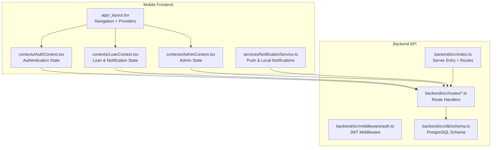
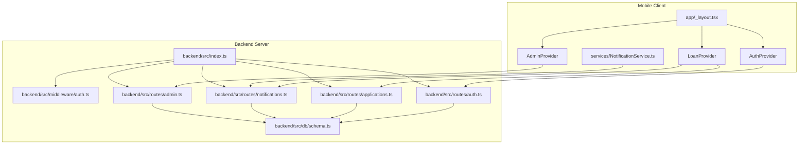
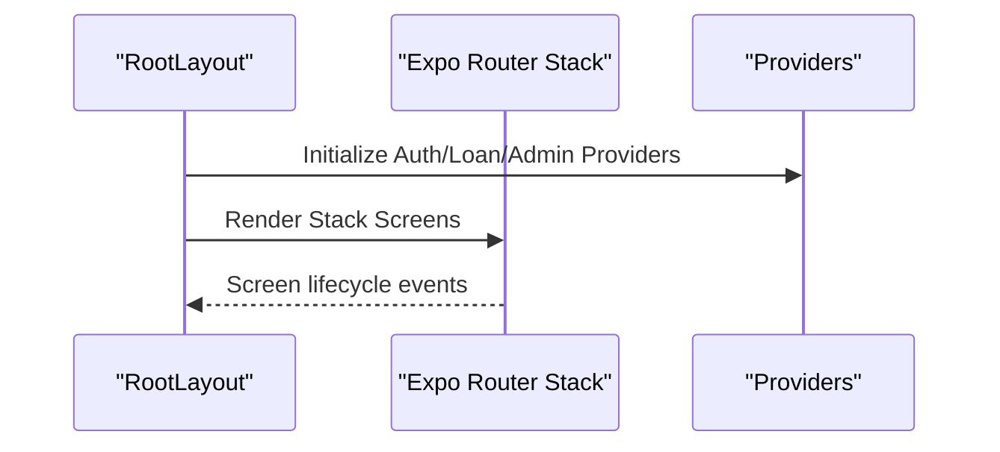
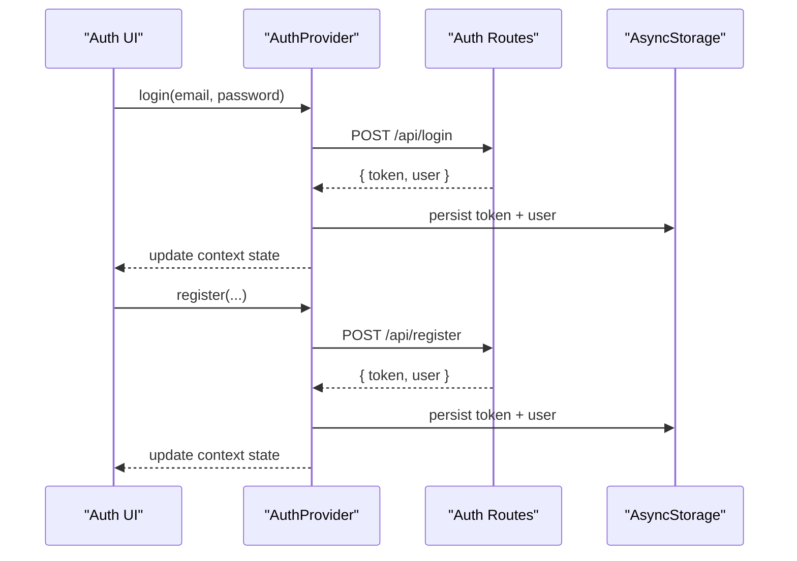
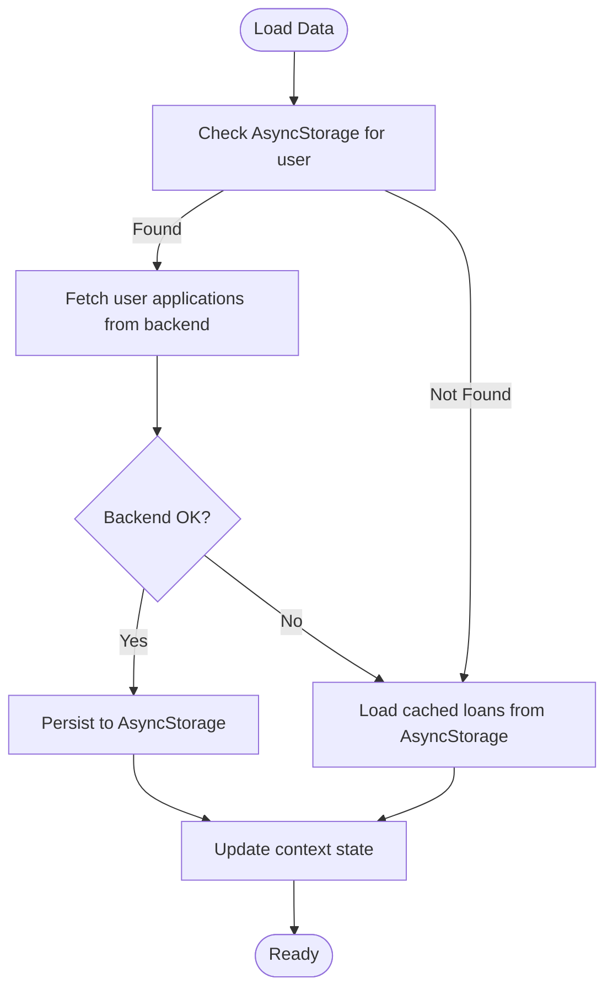
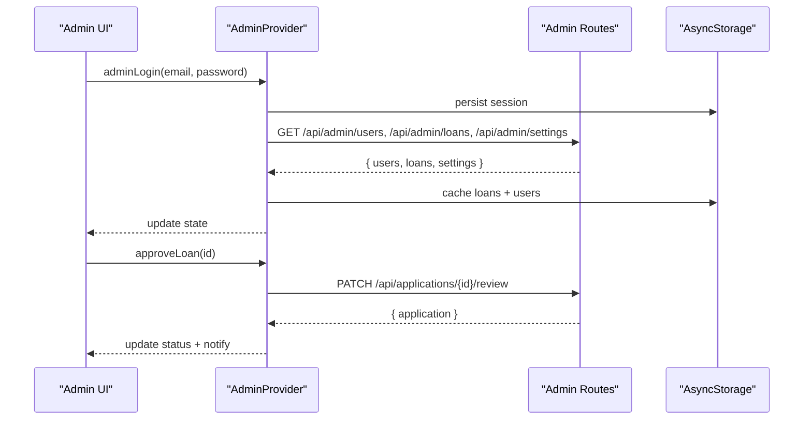
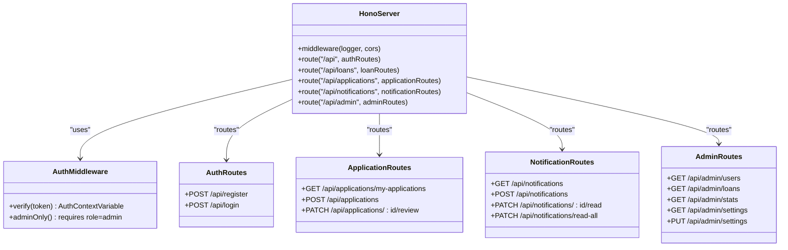
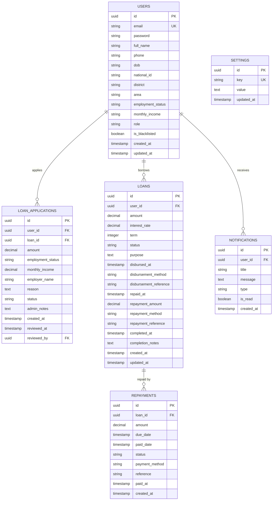
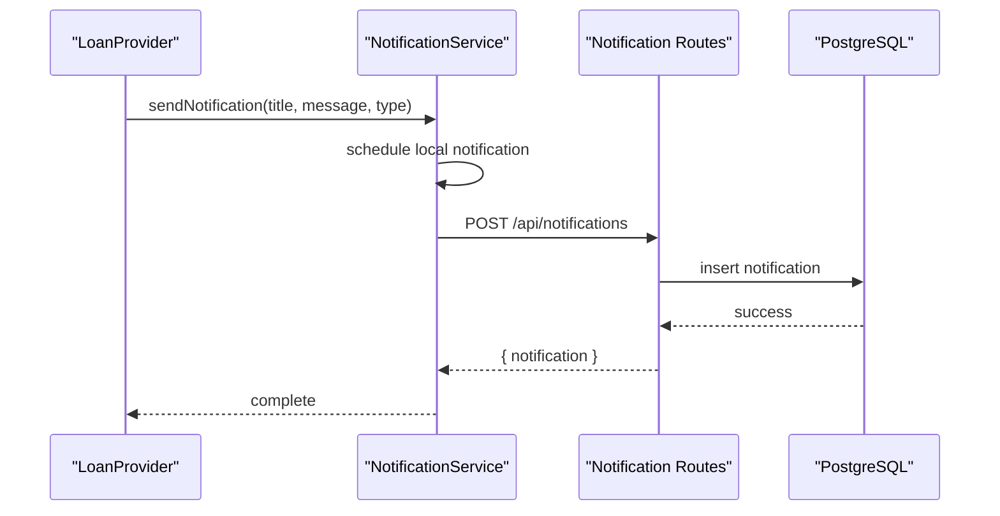
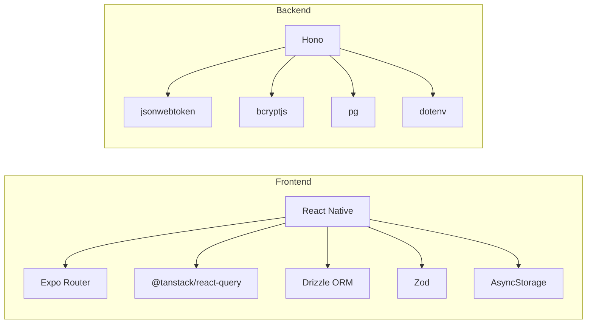

# Architecture Overview

<cite>
**Referenced Files in This Document**
- [package.json](file://package.json)
- [backend/package.json](file://backend/package.json)
- [app/_layout.tsx](file://app/_layout.tsx)
- [contexts/AuthContext.tsx](file://contexts/AuthContext.tsx)
- [contexts/AdminContext.tsx](file://contexts/AdminContext.tsx)
- [contexts/LoanContext.tsx](file://contexts/LoanContext.tsx)
- [backend/src/index.ts](file://backend/src/index.ts)
- [backend/src/middleware/auth.ts](file://backend/src/middleware/auth.ts)
- [backend/src/routes/auth.ts](file://backend/src/routes/auth.ts)
- [backend/src/routes/admin.ts](file://backend/src/routes/admin.ts)
- [backend/src/routes/applications.ts](file://backend/src/routes/applications.ts)
- [backend/src/routes/notifications.ts](file://backend/src/routes/notifications.ts)
- [backend/src/db/schema.ts](file://backend/src/db/schema.ts)
- [services/NotificationService.ts](file://services/NotificationService.ts)
- [app.json](file://app.json)
- [README.md](file://README.md)
- [BACKEND_SETUP.md](file://BACKEND_SETUP.md)
- [PUSH_NOTIFICATIONS_SETUP.md](file://PUSH_NOTIFICATIONS_SETUP.md)
</cite>

## Table of Contents
1. [Introduction](#introduction)
2. [Project Structure](#project-structure)
3. [Core Components](#core-components)
4. [Architecture Overview](#architecture-overview)
5. [Detailed Component Analysis](#detailed-component-analysis)
6. [Dependency Analysis](#dependency-analysis)
7. [Performance Considerations](#performance-considerations)
8. [Troubleshooting Guide](#troubleshooting-guide)
9. [Conclusion](#conclusion)
10. [Appendices](#appendices)

## Introduction
This document presents the architectural design of the PHOENIX loan management system. The system follows a mobile-first approach with a React Native frontend built using Expo Router for navigation and a Node.js backend powered by the Hono framework. The architecture emphasizes clean separation of concerns through patterns such as Provider Pattern for state management, Repository Pattern for database operations, and Middleware Pattern for authentication. Cross-cutting concerns include JWT-based authentication, PostgreSQL-backed persistence, and push/local notification services.

## Project Structure
The repository is organized into two primary areas:
- Mobile application (Expo + React Native) under the root directory, including navigation layout, global providers, UI components, and services.
- Backend API under the backend/ directory, including route handlers, middleware, database schema, and configuration.

**Diagram sources**
- [app/_layout.tsx:31-82](file://app/_layout.tsx#L31-L82)
- [contexts/AuthContext.tsx:31-126](file://contexts/AuthContext.tsx#L31-L126)
- [contexts/LoanContext.tsx:82-329](file://contexts/LoanContext.tsx#L82-L329)
- [contexts/AdminContext.tsx:135-521](file://contexts/AdminContext.tsx#L135-L521)
- [services/NotificationService.ts:26-135](file://services/NotificationService.ts#L26-L135)
- [backend/src/index.ts:17-76](file://backend/src/index.ts#L17-L76)
- [backend/src/middleware/auth.ts:10-47](file://backend/src/middleware/auth.ts#L10-L47)
- [backend/src/routes/auth.ts:10-146](file://backend/src/routes/auth.ts#L10-L146)
- [backend/src/db/schema.ts:1-146](file://backend/src/db/schema.ts#L1-L146)

**Section sources**
- [package.json:1-84](file://package.json#L1-L84)
- [backend/package.json:1-46](file://backend/package.json#L1-L46)
- [app/_layout.tsx:1-83](file://app/_layout.tsx#L1-L83)
- [backend/src/index.ts:1-76](file://backend/src/index.ts#L1-L76)

## Core Components
- Navigation and Layout: Expo Router Stack navigator orchestrates screens and integrates global providers at the root level.
- Global Providers:
  - AuthProvider manages user authentication state, token persistence, and login/logout flows.
  - LoanProvider handles loan applications, repayment tracking, notifications, and offline caching.
  - AdminProvider supports admin operations, settings, and offline data fallback.
- Backend API: Hono-based server exposing REST endpoints for authentication, applications, loans, users, notifications, and admin functions.
- Database: Drizzle ORM with PostgreSQL schema covering users, loans, applications, repayments, notifications, and settings.
- Notifications: Local and push notification service with fallback behavior and backend persistence.

**Section sources**
- [app/_layout.tsx:31-82](file://app/_layout.tsx#L31-L82)
- [contexts/AuthContext.tsx:31-135](file://contexts/AuthContext.tsx#L31-L135)
- [contexts/LoanContext.tsx:82-336](file://contexts/LoanContext.tsx#L82-L336)
- [contexts/AdminContext.tsx:135-528](file://contexts/AdminContext.tsx#L135-L528)
- [backend/src/index.ts:17-76](file://backend/src/index.ts#L17-L76)
- [backend/src/db/schema.ts:1-146](file://backend/src/db/schema.ts#L1-L146)
- [services/NotificationService.ts:1-135](file://services/NotificationService.ts#L1-L135)

## Architecture Overview
The PHOENIX architecture combines a React Native mobile frontend with a Node.js backend using Hono. The frontend uses a Provider Pattern to centralize state and a navigation system based on Expo Router. The backend enforces authentication via middleware and exposes REST endpoints backed by PostgreSQL through Drizzle ORM. Notifications integrate local and push channels with graceful fallbacks.

**Diagram sources**
- [app/_layout.tsx:31-82](file://app/_layout.tsx#L31-L82)
- [contexts/AuthContext.tsx:31-126](file://contexts/AuthContext.tsx#L31-L126)
- [contexts/LoanContext.tsx:82-329](file://contexts/LoanContext.tsx#L82-L329)
- [contexts/AdminContext.tsx:135-521](file://contexts/AdminContext.tsx#L135-L521)
- [services/NotificationService.ts:26-135](file://services/NotificationService.ts#L26-L135)
- [backend/src/index.ts:17-76](file://backend/src/index.ts#L17-L76)
- [backend/src/middleware/auth.ts:10-47](file://backend/src/middleware/auth.ts#L10-L47)
- [backend/src/routes/auth.ts:10-146](file://backend/src/routes/auth.ts#L10-L146)
- [backend/src/routes/applications.ts:1-168](file://backend/src/routes/applications.ts#L1-L168)
- [backend/src/routes/notifications.ts:1-106](file://backend/src/routes/notifications.ts#L1-L106)
- [backend/src/routes/admin.ts:1-140](file://backend/src/routes/admin.ts#L1-L140)
- [backend/src/db/schema.ts:1-146](file://backend/src/db/schema.ts#L1-L146)

## Detailed Component Analysis

### Navigation and Layout (Expo Router)
- The root layout composes the provider stack and defines top-level screens using a Stack navigator.
- Providers are nested to ensure proper context propagation to all screens.

**Diagram sources**
- [app/_layout.tsx:31-82](file://app/_layout.tsx#L31-L82)

**Section sources**
- [app/_layout.tsx:19-29](file://app/_layout.tsx#L19-L29)
- [app/_layout.tsx:65-81](file://app/_layout.tsx#L65-L81)

### Authentication State Management (Provider Pattern)
- AuthProvider encapsulates login, registration, logout, and token persistence.
- Uses AsyncStorage for offline persistence and communicates with backend endpoints.

**Diagram sources**
- [contexts/AuthContext.tsx:56-119](file://contexts/AuthContext.tsx#L56-L119)
- [backend/src/routes/auth.ts:96-143](file://backend/src/routes/auth.ts#L96-L143)

**Section sources**
- [contexts/AuthContext.tsx:31-135](file://contexts/AuthContext.tsx#L31-L135)
- [backend/src/routes/auth.ts:10-146](file://backend/src/routes/auth.ts#L10-L146)

### Loan and Notification State (Provider Pattern)
- LoanProvider manages loan applications, repayment tracking, and notifications.
- Implements offline-first caching with AsyncStorage and syncs with backend when available.
- Integrates with NotificationService for local and push notifications.

**Diagram sources**
- [contexts/LoanContext.tsx:91-176](file://contexts/LoanContext.tsx#L91-L176)

**Section sources**
- [contexts/LoanContext.tsx:82-336](file://contexts/LoanContext.tsx#L82-L336)
- [services/NotificationService.ts:1-135](file://services/NotificationService.ts#L1-L135)

### Admin State and Offline Capabilities
- AdminProvider centralizes admin operations and settings.
- Implements offline data fallback using AsyncStorage and refresh mechanisms.

**Diagram sources**
- [contexts/AdminContext.tsx:287-335](file://contexts/AdminContext.tsx#L287-L335)
- [contexts/AdminContext.tsx:462-478](file://contexts/AdminContext.tsx#L462-L478)
- [backend/src/routes/admin.ts:8-35](file://backend/src/routes/admin.ts#L8-L35)
- [backend/src/routes/applications.ts:140-165](file://backend/src/routes/applications.ts#L140-L165)

**Section sources**
- [contexts/AdminContext.tsx:135-528](file://contexts/AdminContext.tsx#L135-L528)
- [backend/src/routes/admin.ts:1-140](file://backend/src/routes/admin.ts#L1-L140)
- [backend/src/routes/applications.ts:1-168](file://backend/src/routes/applications.ts#L1-L168)

### Backend API Layer (Hono + Middleware + Repository Pattern)
- Hono server initializes middleware, CORS, logging, and routes.
- Authentication middleware validates JWT and injects user context.
- Route handlers implement CRUD operations backed by Drizzle ORM queries.

**Diagram sources**
- [backend/src/index.ts:17-76](file://backend/src/index.ts#L17-L76)
- [backend/src/middleware/auth.ts:10-47](file://backend/src/middleware/auth.ts#L10-L47)
- [backend/src/routes/auth.ts:10-146](file://backend/src/routes/auth.ts#L10-L146)
- [backend/src/routes/applications.ts:1-168](file://backend/src/routes/applications.ts#L1-L168)
- [backend/src/routes/notifications.ts:1-106](file://backend/src/routes/notifications.ts#L1-L106)
- [backend/src/routes/admin.ts:1-140](file://backend/src/routes/admin.ts#L1-L140)

**Section sources**
- [backend/src/index.ts:1-76](file://backend/src/index.ts#L1-L76)
- [backend/src/middleware/auth.ts:1-48](file://backend/src/middleware/auth.ts#L1-L48)
- [backend/src/routes/auth.ts:1-146](file://backend/src/routes/auth.ts#L1-L146)
- [backend/src/routes/applications.ts:1-168](file://backend/src/routes/applications.ts#L1-L168)
- [backend/src/routes/notifications.ts:1-106](file://backend/src/routes/notifications.ts#L1-L106)
- [backend/src/routes/admin.ts:1-140](file://backend/src/routes/admin.ts#L1-L140)

### Database Schema and Repository Pattern
- Drizzle ORM schema defines tables for users, loans, applications, repayments, notifications, and settings.
- Route handlers act as repositories, performing CRUD operations against the schema.

**Diagram sources**
- [backend/src/db/schema.ts:1-146](file://backend/src/db/schema.ts#L1-L146)

**Section sources**
- [backend/src/db/schema.ts:1-146](file://backend/src/db/schema.ts#L1-L146)

### Notifications Service
- Local and push notification handling with Expo Notifications.
- Fallback to local notifications when remote tokens are unavailable.
- Backend persistence for notifications with read/unread tracking.

**Diagram sources**
- [services/NotificationService.ts:116-135](file://services/NotificationService.ts#L116-L135)
- [contexts/LoanContext.tsx:183-196](file://contexts/LoanContext.tsx#L183-L196)
- [backend/src/routes/notifications.ts:71-90](file://backend/src/routes/notifications.ts#L71-L90)

**Section sources**
- [services/NotificationService.ts:1-135](file://services/NotificationService.ts#L1-L135)
- [contexts/LoanContext.tsx:182-309](file://contexts/LoanContext.tsx#L182-L309)
- [backend/src/routes/notifications.ts:1-106](file://backend/src/routes/notifications.ts#L1-L106)

## Dependency Analysis
- Frontend dependencies include React Native, Expo ecosystem packages, React Query for caching, Drizzle ORM, and Zod for validation.
- Backend dependencies include Hono, Drizzle ORM, JWT, bcrypt, and PostgreSQL driver.
- The frontend providers depend on backend endpoints for authentication, applications, notifications, and admin data.
- The backend depends on the database schema and environment configuration for secrets and endpoints.

**Diagram sources**
- [package.json:22-68](file://package.json#L22-L68)
- [backend/package.json:22-34](file://backend/package.json#L22-L34)

**Section sources**
- [package.json:1-84](file://package.json#L1-L84)
- [backend/package.json:1-46](file://backend/package.json#L1-L46)

## Performance Considerations
- Offline-first state management reduces network dependency and improves responsiveness.
- React Query client enables efficient caching and background refetching.
- Drizzle ORM minimizes SQL overhead with typed queries and joins.
- Hono’s minimal footprint ensures low latency for API requests.
- Notification service prioritizes local delivery to guarantee user feedback even without backend connectivity.

[No sources needed since this section provides general guidance]

## Troubleshooting Guide
- Authentication failures: Verify JWT secret and ensure Authorization headers are present for protected routes.
- CORS errors: Confirm allowed origins and credentials in the backend CORS configuration.
- Database connectivity: Validate the Neon connection string and SSL settings.
- Push notifications: Use development builds for remote push tokens; local notifications work in Expo Go.

**Section sources**
- [backend/src/middleware/auth.ts:10-47](file://backend/src/middleware/auth.ts#L10-L47)
- [backend/src/index.ts:21-26](file://backend/src/index.ts#L21-L26)
- [BACKEND_SETUP.md:76-83](file://BACKEND_SETUP.md#L76-L83)
- [PUSH_NOTIFICATIONS_SETUP.md:15-45](file://PUSH_NOTIFICATIONS_SETUP.md#L15-L45)

## Conclusion
PHOENIX demonstrates a cohesive mobile-first architecture that leverages modern tools and patterns. The Provider Pattern centralizes state, Expo Router streamlines navigation, and Hono delivers a lightweight, maintainable backend. The system’s offline-first design, robust authentication, and notification pipeline provide a solid foundation for scalable loan management.

[No sources needed since this section summarizes without analyzing specific files]

## Appendices

### Infrastructure Requirements
- Database: PostgreSQL (via Neon) with Drizzle ORM schema.
- Authentication: JWT with bcrypt password hashing.
- Notifications: Expo Notifications for local and push alerts with backend persistence.
- Environment: Exposed API URL and secrets configured for both frontend and backend.

**Section sources**
- [backend/src/db/schema.ts:1-146](file://backend/src/db/schema.ts#L1-L146)
- [backend/src/routes/auth.ts:46-74](file://backend/src/routes/auth.ts#L46-L74)
- [services/NotificationService.ts:26-135](file://services/NotificationService.ts#L26-L135)
- [app.json:59-68](file://app.json#L59-L68)
- [README.md:144-152](file://README.md#L144-L152)