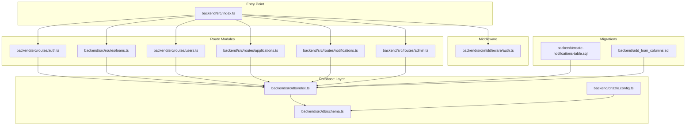
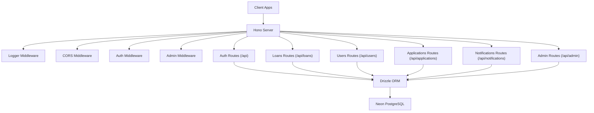
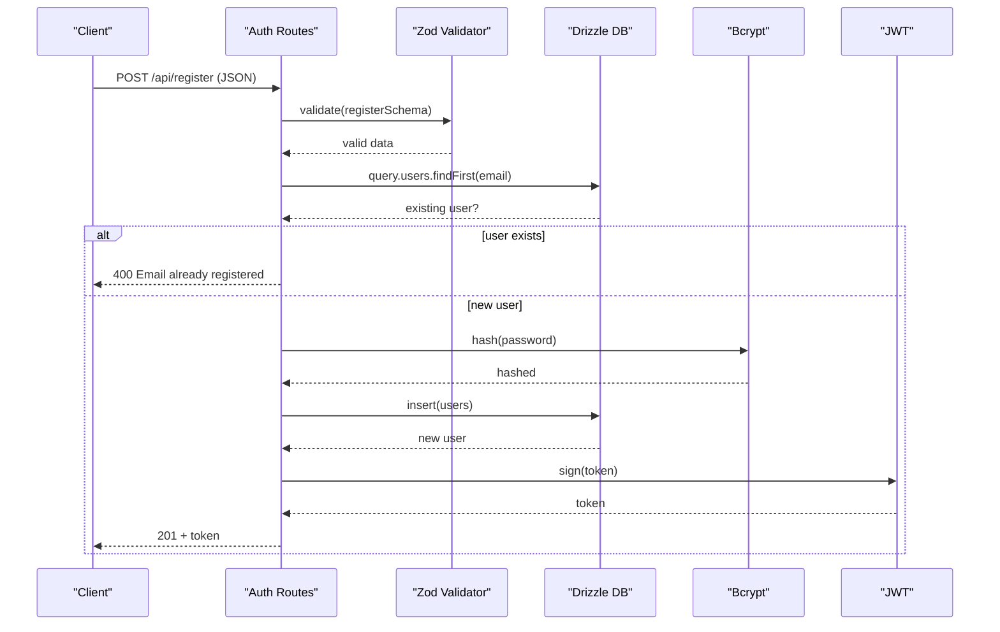
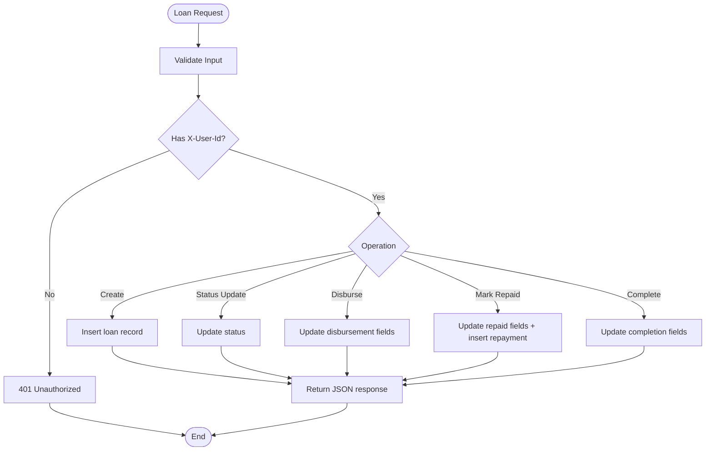
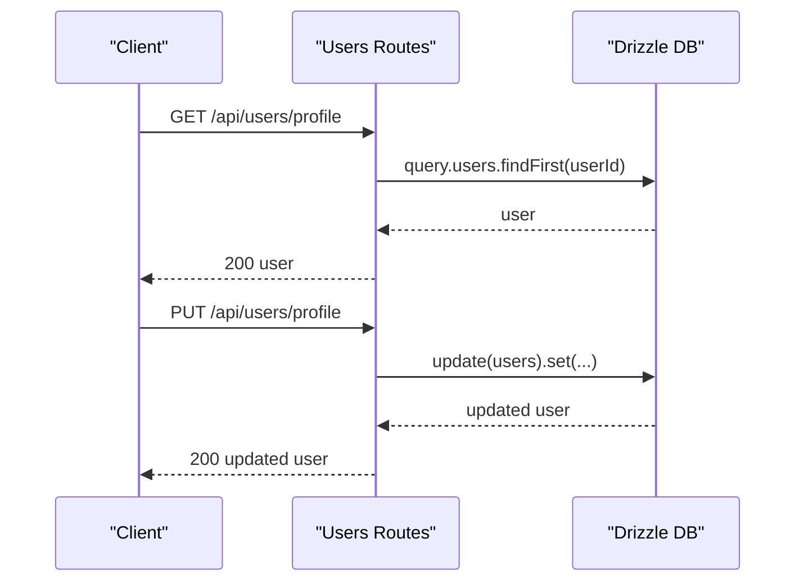
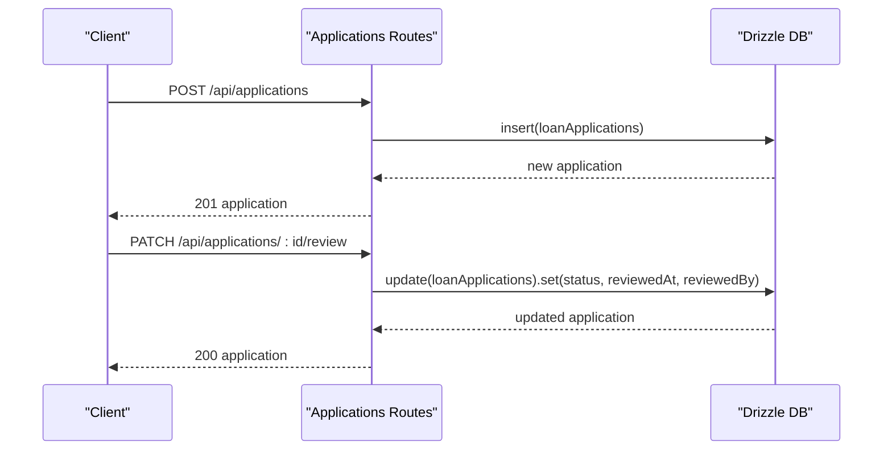
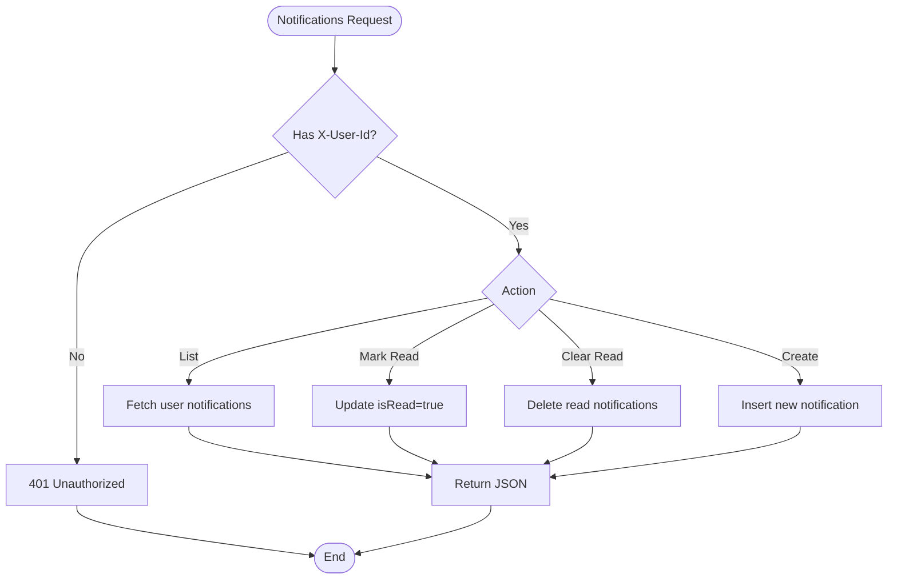
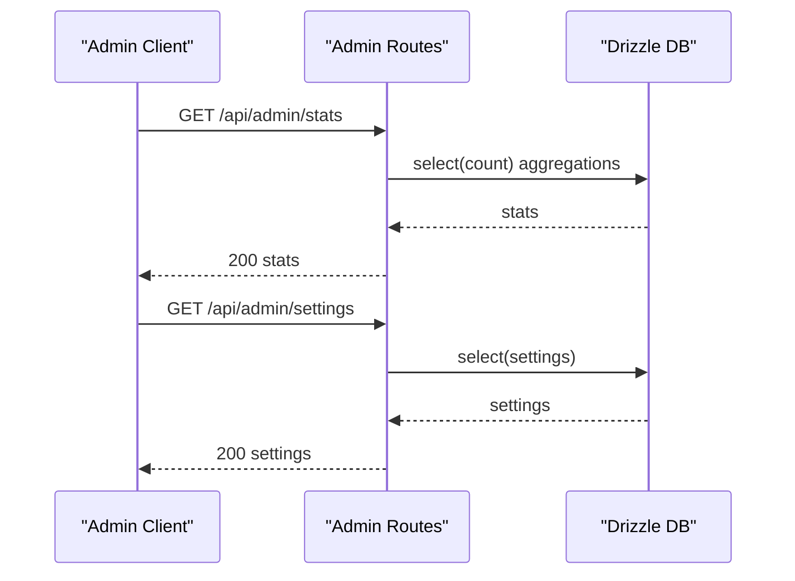
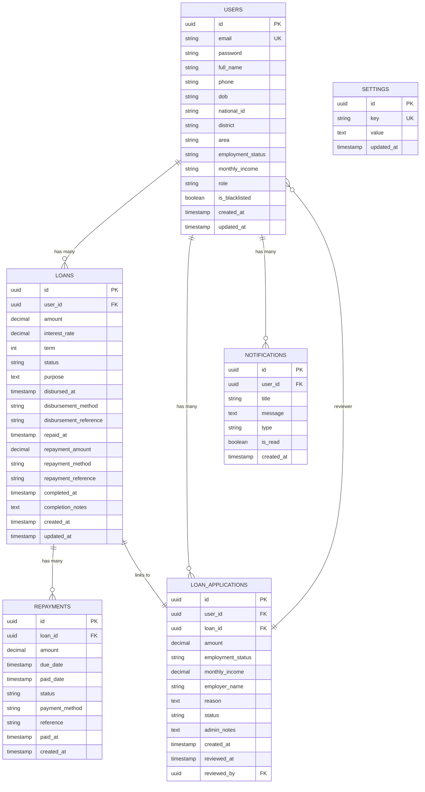
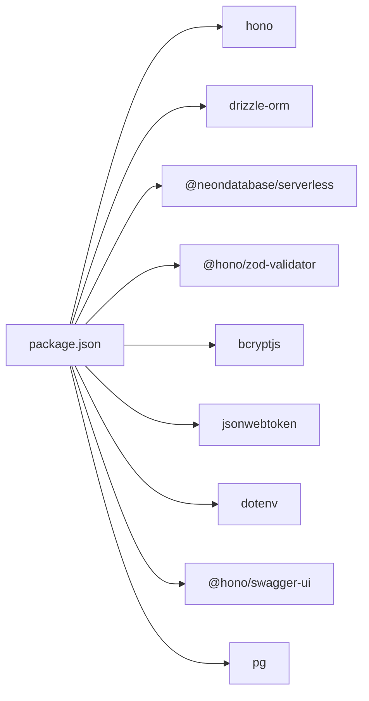

# Backend Architecture

<cite>
**Referenced Files in This Document**
- [backend/src/index.ts](file://backend/src/index.ts)
- [backend/package.json](file://backend/package.json)
- [backend/src/middleware/auth.ts](file://backend/src/middleware/auth.ts)
- [backend/src/db/index.ts](file://backend/src/db/index.ts)
- [backend/src/db/schema.ts](file://backend/src/db/schema.ts)
- [backend/src/routes/auth.ts](file://backend/src/routes/auth.ts)
- [backend/src/routes/loans.ts](file://backend/src/routes/loans.ts)
- [backend/src/routes/users.ts](file://backend/src/routes/users.ts)
- [backend/src/routes/admin.ts](file://backend/src/routes/admin.ts)
- [backend/src/routes/applications.ts](file://backend/src/routes/applications.ts)
- [backend/src/routes/notifications.ts](file://backend/src/routes/notifications.ts)
- [backend/drizzle.config.ts](file://backend/drizzle.config.ts)
- [backend/create-notifications-table.sql](file://backend/create-notifications-table.sql)
- [backend/add_loan_columns.sql](file://backend/add_loan_columns.sql)
- [backend/README.md](file://backend/README.md)
</cite>

## Table of Contents
1. [Introduction](#introduction)
2. [Project Structure](#project-structure)
3. [Core Components](#core-components)
4. [Architecture Overview](#architecture-overview)
5. [Detailed Component Analysis](#detailed-component-analysis)
6. [Dependency Analysis](#dependency-analysis)
7. [Performance Considerations](#performance-considerations)
8. [Security Implementation](#security-implementation)
9. [Error Handling Strategies](#error-handling-strategies)
10. [API Versioning Approaches](#api-versioning-approaches)
11. [Scalability Considerations](#scalability-considerations)
12. [Troubleshooting Guide](#troubleshooting-guide)
13. [Conclusion](#conclusion)

## Introduction
This document describes the backend architecture for the PHOENIX Node.js API server. The system is built with the Hono framework, uses Drizzle ORM with PostgreSQL (via Neon) for persistence, and implements JWT-based authentication and authorization. The API follows a modular route organization separating authentication, loans, users, applications, notifications, and administrative functions. The document explains middleware patterns, database layer design, separation of concerns, security measures, error handling, and scalability considerations.

## Project Structure
The backend is organized into clear layers:
- Entry point initializes the Hono app, middleware, and mounts modular route groups
- Middleware handles authentication and authorization
- Database layer defines schema and connection management
- Route modules encapsulate API endpoints per domain
- Drizzle configuration and SQL migration helpers support schema management

**Diagram sources**
- [backend/src/index.ts:1-76](file://backend/src/index.ts#L1-L76)
- [backend/src/middleware/auth.ts:1-48](file://backend/src/middleware/auth.ts#L1-L48)
- [backend/src/db/index.ts:1-44](file://backend/src/db/index.ts#L1-L44)
- [backend/src/db/schema.ts:1-146](file://backend/src/db/schema.ts#L1-L146)
- [backend/drizzle.config.ts:1-14](file://backend/drizzle.config.ts#L1-L14)
- [backend/src/routes/auth.ts:1-146](file://backend/src/routes/auth.ts#L1-L146)
- [backend/src/routes/loans.ts:1-320](file://backend/src/routes/loans.ts#L1-L320)
- [backend/src/routes/users.ts:1-197](file://backend/src/routes/users.ts#L1-L197)
- [backend/src/routes/applications.ts:1-168](file://backend/src/routes/applications.ts#L1-L168)
- [backend/src/routes/notifications.ts:1-106](file://backend/src/routes/notifications.ts#L1-L106)
- [backend/src/routes/admin.ts:1-171](file://backend/src/routes/admin.ts#L1-L171)
- [backend/create-notifications-table.sql:1-30](file://backend/create-notifications-table.sql#L1-L30)
- [backend/add_loan_columns.sql:1-12](file://backend/add_loan_columns.sql#L1-L12)

**Section sources**
- [backend/src/index.ts:1-76](file://backend/src/index.ts#L1-L76)
- [backend/package.json:1-46](file://backend/package.json#L1-L46)

## Core Components
- Hono server initialization with middleware stack and route mounting
- JWT-based authentication and admin-only authorization middleware
- Drizzle ORM with Neon HTTP driver for PostgreSQL connectivity
- Modular route groups for authentication, loans, users, applications, notifications, and admin
- OpenAPI/Swagger documentation endpoint

Key implementation highlights:
- Centralized CORS configuration supporting multiple frontend origins
- Health check endpoint for service monitoring
- Modular route registration under /api and /api/admin namespaces
- Zod-based input validation integrated with Hono

**Section sources**
- [backend/src/index.ts:1-76](file://backend/src/index.ts#L1-L76)
- [backend/src/middleware/auth.ts:1-48](file://backend/src/middleware/auth.ts#L1-L48)
- [backend/src/db/index.ts:1-44](file://backend/src/db/index.ts#L1-L44)
- [backend/src/db/schema.ts:1-146](file://backend/src/db/schema.ts#L1-L146)
- [backend/src/routes/auth.ts:1-146](file://backend/src/routes/auth.ts#L1-L146)
- [backend/src/routes/loans.ts:1-320](file://backend/src/routes/loans.ts#L1-L320)
- [backend/src/routes/users.ts:1-197](file://backend/src/routes/users.ts#L1-L197)
- [backend/src/routes/applications.ts:1-168](file://backend/src/routes/applications.ts#L1-L168)
- [backend/src/routes/notifications.ts:1-106](file://backend/src/routes/notifications.ts#L1-L106)
- [backend/src/routes/admin.ts:1-171](file://backend/src/routes/admin.ts#L1-L171)
- [backend/drizzle.config.ts:1-14](file://backend/drizzle.config.ts#L1-L14)

## Architecture Overview
The system follows a layered architecture:
- Presentation layer: Hono routes grouped by domain
- Application layer: Middleware for auth and admin checks
- Domain logic: Route handlers orchestrate database operations
- Data access layer: Drizzle ORM with Neon PostgreSQL driver
- Persistence: PostgreSQL schema with foreign key relationships

**Diagram sources**
- [backend/src/index.ts:1-76](file://backend/src/index.ts#L1-L76)
- [backend/src/middleware/auth.ts:1-48](file://backend/src/middleware/auth.ts#L1-L48)
- [backend/src/db/index.ts:1-44](file://backend/src/db/index.ts#L1-L44)

## Detailed Component Analysis

### Authentication Module
The authentication module provides user registration and login with JWT issuance. It validates input using Zod, hashes passwords with bcrypt, and returns tokens containing user identity and role.

**Diagram sources**
- [backend/src/routes/auth.ts:1-146](file://backend/src/routes/auth.ts#L1-L146)
- [backend/src/db/index.ts:1-44](file://backend/src/db/index.ts#L1-L44)

**Section sources**
- [backend/src/routes/auth.ts:1-146](file://backend/src/routes/auth.ts#L1-L146)

### Loans Management Module
The loans module supports CRUD operations and administrative actions like status updates, disbursement, marking as repaid, and completion. It ensures required columns exist via dynamic ALTER statements and uses nested queries with relations.

**Diagram sources**
- [backend/src/routes/loans.ts:1-320](file://backend/src/routes/loans.ts#L1-L320)

**Section sources**
- [backend/src/routes/loans.ts:1-320](file://backend/src/routes/loans.ts#L1-L320)

### Users Management Module
The users module exposes profile retrieval and updates for authenticated users, and administrative endpoints for listing users, toggling blacklist status, and updating passwords.

**Diagram sources**
- [backend/src/routes/users.ts:1-197](file://backend/src/routes/users.ts#L1-L197)

**Section sources**
- [backend/src/routes/users.ts:1-197](file://backend/src/routes/users.ts#L1-L197)

### Applications Module
The applications module manages loan applications with user submission and admin review workflows, including status transitions and reviewer metadata.

**Diagram sources**
- [backend/src/routes/applications.ts:1-168](file://backend/src/routes/applications.ts#L1-L168)

**Section sources**
- [backend/src/routes/applications.ts:1-168](file://backend/src/routes/applications.ts#L1-L168)

### Notifications Module
The notifications module provides endpoints to list, mark as read, bulk clear, and create user-specific notifications.

**Diagram sources**
- [backend/src/routes/notifications.ts:1-106](file://backend/src/routes/notifications.ts#L1-L106)

**Section sources**
- [backend/src/routes/notifications.ts:1-106](file://backend/src/routes/notifications.ts#L1-L106)

### Admin Module
The admin module provides paginated user and loan listing, dashboard statistics, and settings management with aggregation queries and JSON-stored settings.

**Diagram sources**
- [backend/src/routes/admin.ts:1-171](file://backend/src/routes/admin.ts#L1-L171)

**Section sources**
- [backend/src/routes/admin.ts:1-171](file://backend/src/routes/admin.ts#L1-L171)

### Database Schema and Relations
The schema defines core entities with relations and type exports for type-safe operations.

**Diagram sources**
- [backend/src/db/schema.ts:1-146](file://backend/src/db/schema.ts#L1-L146)

**Section sources**
- [backend/src/db/schema.ts:1-146](file://backend/src/db/schema.ts#L1-L146)

## Dependency Analysis
The backend uses a focused set of libraries:
- Hono for routing and middleware
- Drizzle ORM with Neon HTTP driver for PostgreSQL
- Zod for input validation
- bcryptjs for password hashing
- jsonwebtoken for JWT operations
- dotenv for environment configuration

**Diagram sources**
- [backend/package.json:1-46](file://backend/package.json#L1-L46)

**Section sources**
- [backend/package.json:1-46](file://backend/package.json#L1-L46)

## Performance Considerations
- Database connectivity: Neon HTTP driver with explicit timeout configuration
- Pagination: Admin endpoints implement page/limit with count aggregation
- Indexing: Migration script creates indexes on notifications table for performance
- Column existence checks: Loans module ensures required columns exist via defensive ALTER statements
- Query optimization: Route handlers use selective field projections and relations to minimize payload sizes

[No sources needed since this section provides general guidance]

## Security Implementation
- Authentication: JWT-based bearer tokens validated by middleware
- Authorization: Admin-only endpoints guarded by role check middleware
- Input validation: Zod schemas enforce strict request validation
- Password handling: bcrypt used for secure hashing
- Environment configuration: DATABASE_URL and JWT_SECRET loaded from .env
- CORS: Whitelisted origins and headers for controlled cross-origin access

**Section sources**
- [backend/src/middleware/auth.ts:1-48](file://backend/src/middleware/auth.ts#L1-L48)
- [backend/src/routes/auth.ts:1-146](file://backend/src/routes/auth.ts#L1-L146)
- [backend/src/index.ts:19-26](file://backend/src/index.ts#L19-L26)

## Error Handling Strategies
- Consistent error responses: All route handlers return structured JSON errors with appropriate HTTP status codes
- Centralized middleware: Logger and CORS applied globally
- Validation errors: Zod validator integrates with Hono to produce consistent validation failures
- Database errors: Route handlers wrap operations in try/catch blocks and log detailed errors
- Environment validation: Database URL checked at startup with descriptive error messages

**Section sources**
- [backend/src/routes/auth.ts:89-92](file://backend/src/routes/auth.ts#L89-L92)
- [backend/src/routes/loans.ts:109-112](file://backend/src/routes/loans.ts#L109-L112)
- [backend/src/routes/users.ts:35-38](file://backend/src/routes/users.ts#L35-L38)
- [backend/src/routes/applications.ts:49-52](file://backend/src/routes/applications.ts#L49-L52)
- [backend/src/routes/notifications.ts:30-32](file://backend/src/routes/notifications.ts#L30-L32)
- [backend/src/routes/admin.ts:43-46](file://backend/src/routes/admin.ts#L43-L46)
- [backend/src/db/index.ts:33-38](file://backend/src/db/index.ts#L33-L38)

## API Versioning Approaches
- Current implementation does not include explicit versioning in URLs or headers
- Suggested approach: Introduce /api/v1/ prefix in route mounting and maintain backward compatibility by deprecating older endpoints gradually

[No sources needed since this section provides general guidance]

## Scalability Considerations
- Horizontal scaling: Stateless Hono routes enable easy deployment behind load balancers
- Database scaling: Neon serverless provides auto-scaling capabilities
- Connection pooling: Drizzle with Neon HTTP driver manages connections efficiently
- Caching opportunities: Consider adding Redis for session storage and frequently accessed aggregates
- Monitoring: Health check endpoint and structured logs support observability

[No sources needed since this section provides general guidance]

## Troubleshooting Guide
Common issues and resolutions:
- Database connection errors: Verify DATABASE_URL in .env and ensure IP is whitelisted in Neon dashboard
- Port conflicts: Change PORT environment variable or stop conflicting processes
- CORS errors: Add frontend origins to CORS configuration and environment variables
- JWT validation failures: Ensure JWT_SECRET matches across deployments
- Missing notifications table: Apply create-notifications-table.sql migration
- Missing loan columns: Run add_loan_columns.sql to add disbursement/repayment fields

**Section sources**
- [backend/README.md:158-172](file://backend/README.md#L158-L172)
- [backend/create-notifications-table.sql:1-30](file://backend/create-notifications-table.sql#L1-L30)
- [backend/add_loan_columns.sql:1-12](file://backend/add_loan_columns.sql#L1-L12)
- [backend/src/db/index.ts:33-38](file://backend/src/db/index.ts#L33-L38)

## Conclusion
The PHOENIX backend leverages Hono for a lightweight, fast API foundation, Drizzle ORM for type-safe database operations, and JWT for secure authentication. The modular route organization promotes maintainability, while middleware enforces consistent cross-cutting concerns. The PostgreSQL schema with relations supports complex loan workflows, and the admin module provides operational insights. With proper environment configuration, migrations, and production hardening, the system is well-positioned for growth and reliability.