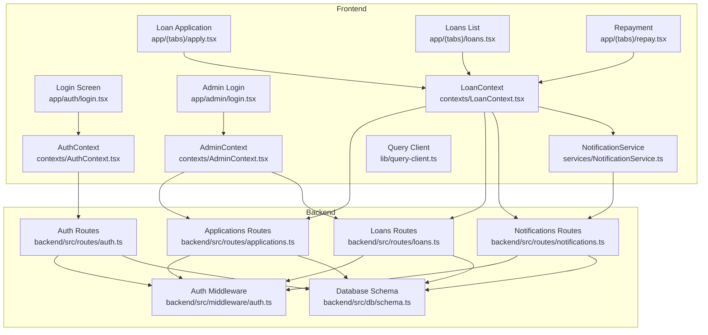
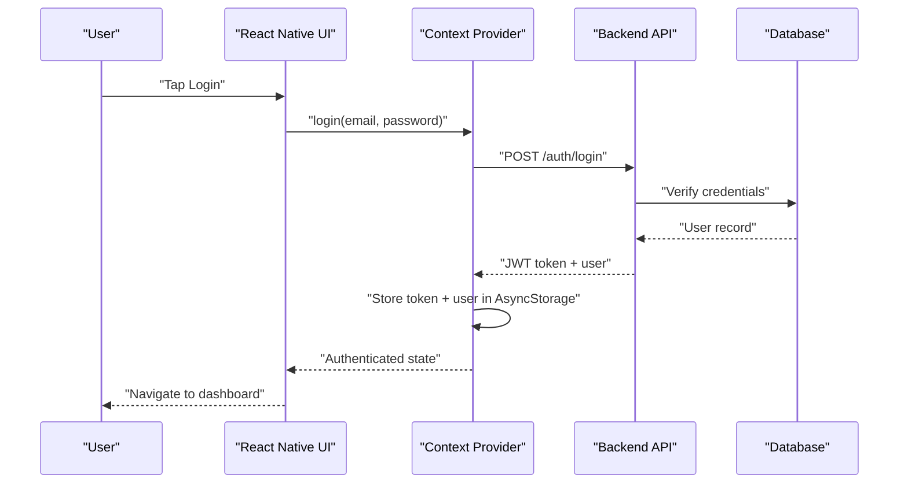
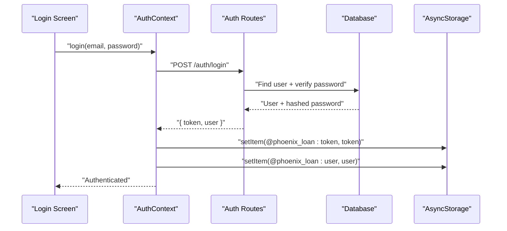
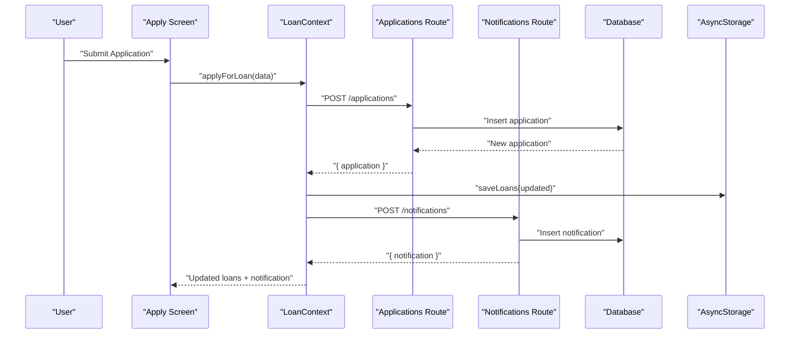
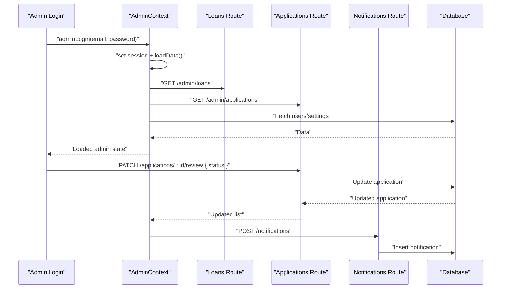
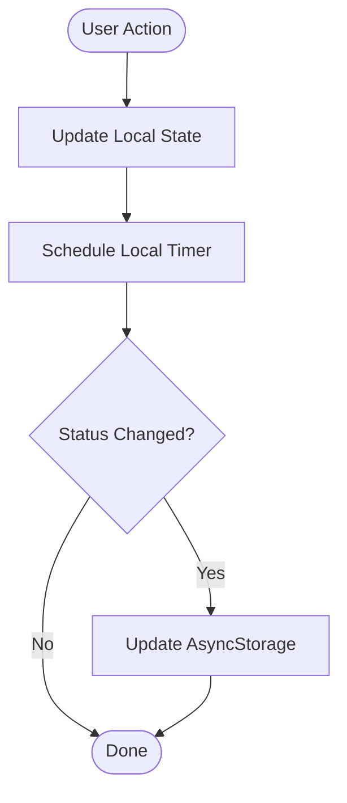
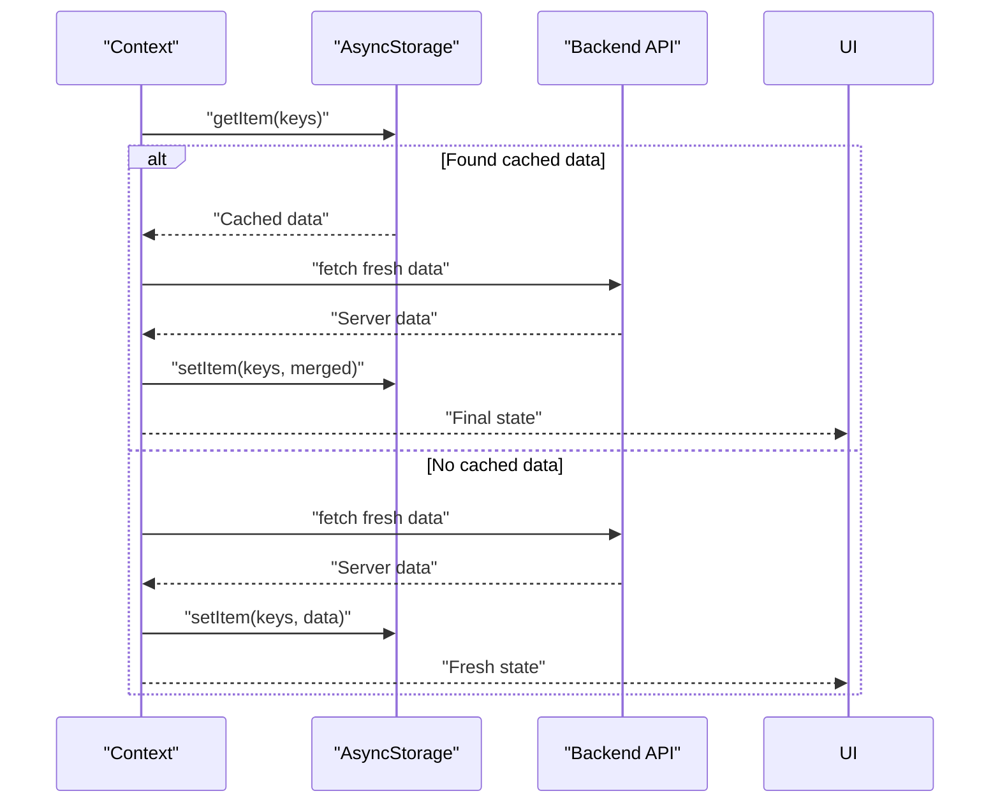
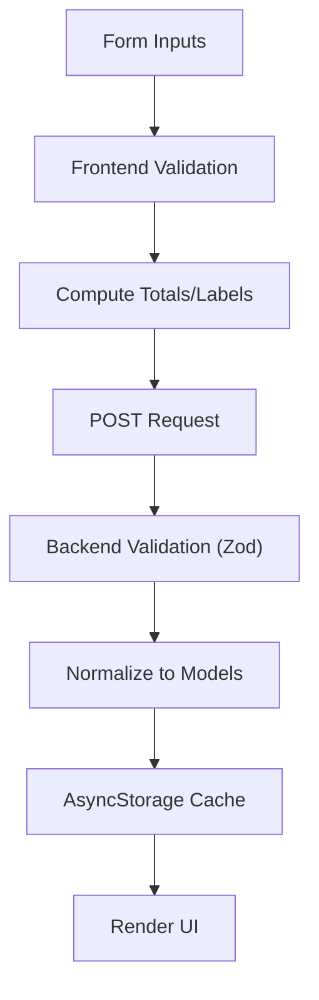
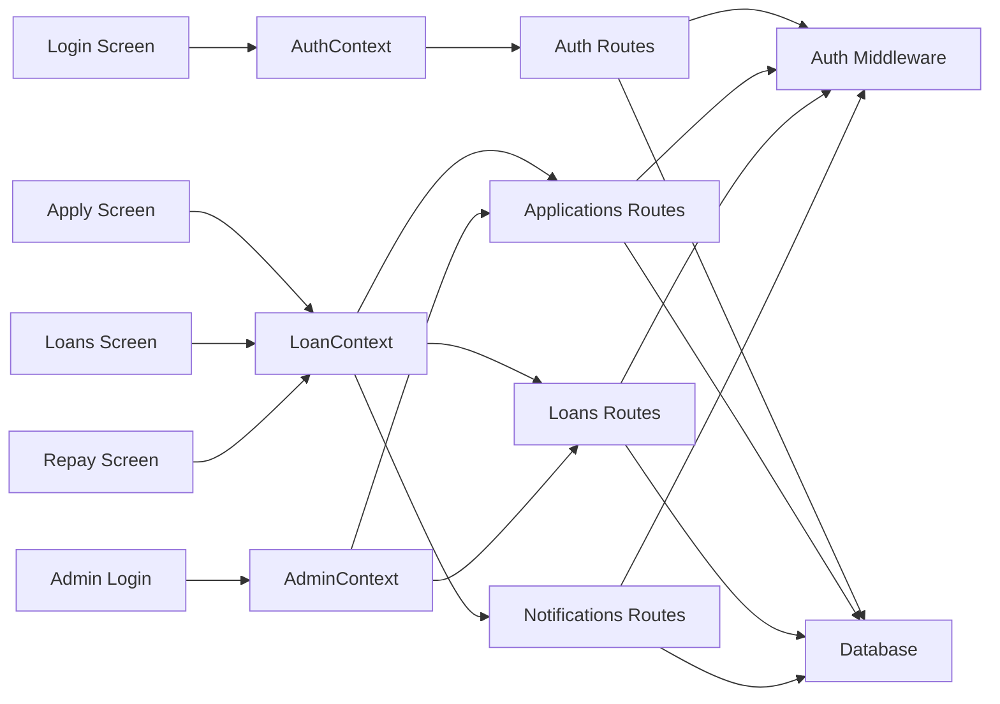

# Data Flow Architecture

<cite>
**Referenced Files in This Document**
- [AuthContext.tsx](file://contexts/AuthContext.tsx)
- [LoanContext.tsx](file://contexts/LoanContext.tsx)
- [AdminContext.tsx](file://contexts/AdminContext.tsx)
- [auth.ts](file://backend/src/routes/auth.ts)
- [applications.ts](file://backend/src/routes/applications.ts)
- [loans.ts](file://backend/src/routes/loans.ts)
- [notifications.ts](file://backend/src/routes/notifications.ts)
- [auth.ts](file://backend/src/middleware/auth.ts)
- [NotificationService.ts](file://services/NotificationService.ts)
- [query-client.ts](file://lib/query-client.ts)
- [login.tsx](file://app/auth/login.tsx)
- [apply.tsx](file://app/(tabs)/apply.tsx)
- [loans.tsx](file://app/(tabs)/loans.tsx)
- [repay.tsx](file://app/(tabs)/repay.tsx)
- [login.tsx](file://app/admin/login.tsx)
</cite>

## Table of Contents
1. [Introduction](#introduction)
2. [Project Structure](#project-structure)
3. [Core Components](#core-components)
4. [Architecture Overview](#architecture-overview)
5. [Detailed Component Analysis](#detailed-component-analysis)
6. [Dependency Analysis](#dependency-analysis)
7. [Performance Considerations](#performance-considerations)
8. [Troubleshooting Guide](#troubleshooting-guide)
9. [Conclusion](#conclusion)

## Introduction
This document describes the complete data flow architecture of the PHOENIX system, covering user interactions, context providers, API calls, database operations, bidirectional state synchronization, authentication, loan application workflow, real-time notifications, error handling, retries, and offline strategies. It explains how frontend state management integrates with backend services and how real-time updates and push notifications are handled.

## Project Structure
The PHOENIX system follows a React Native + Hono backend architecture with:
- Frontend: React Native screens and context providers managing state and API interactions
- Backend: Hono microservice with routes for authentication, applications, loans, and notifications
- Middleware: JWT-based authentication and role checks
- Services: Push notification handling and persistence
- Utilities: Query client for standardized API requests

**Diagram sources**
- [login.tsx:80-134](file://app/auth/login.tsx#L80-L134)
- [apply.tsx](file://app/(tabs)/apply.tsx#L125-L255)
- [loans.tsx](file://app/(tabs)/loans.tsx#L309-L440)
- [repay.tsx](file://app/(tabs)/repay.tsx#L225-L449)
- [login.tsx:17-59](file://app/admin/login.tsx#L17-L59)
- [AuthContext.tsx:31-126](file://contexts/AuthContext.tsx#L31-L126)
- [LoanContext.tsx:82-336](file://contexts/LoanContext.tsx#L82-L336)
- [AdminContext.tsx:135-528](file://contexts/AdminContext.tsx#L135-L528)
- [auth.ts:96-143](file://backend/src/routes/auth.ts#L96-L143)
- [applications.ts:111-138](file://backend/src/routes/applications.ts#L111-L138)
- [loans.ts:116-138](file://backend/src/routes/loans.ts#L116-L138)
- [notifications.ts:9-33](file://backend/src/routes/notifications.ts#L9-L33)
- [auth.ts:10-36](file://backend/src/middleware/auth.ts#L10-L36)
- [NotificationService.ts:26-69](file://services/NotificationService.ts#L26-L69)
- [query-client.ts:8-81](file://lib/query-client.ts#L8-L81)

**Section sources**
- [AuthContext.tsx:1-135](file://contexts/AuthContext.tsx#L1-L135)
- [LoanContext.tsx:1-336](file://contexts/LoanContext.tsx#L1-L336)
- [AdminContext.tsx:1-528](file://contexts/AdminContext.tsx#L1-L528)
- [auth.ts:1-146](file://backend/src/routes/auth.ts#L1-L146)
- [applications.ts:1-168](file://backend/src/routes/applications.ts#L1-L168)
- [loans.ts:1-320](file://backend/src/routes/loans.ts#L1-L320)
- [notifications.ts:1-106](file://backend/src/routes/notifications.ts#L1-L106)
- [auth.ts:1-48](file://backend/src/middleware/auth.ts#L1-L48)
- [NotificationService.ts:1-135](file://services/NotificationService.ts#L1-L135)
- [query-client.ts:1-81](file://lib/query-client.ts#L1-L81)

## Core Components
- Authentication Context: Manages user login, registration, token storage, and logout with AsyncStorage and backend APIs.
- Loan Context: Orchestrates loan application lifecycle, notifications, local caching, and real-time-like status updates.
- Admin Context: Provides administrative controls, loan approvals/disbursals, and settings management.
- Backend Routes: Handle auth, applications, loans, and notifications with validation and database operations.
- Middleware: Enforces JWT-based authentication and role checks.
- Notification Service: Handles local and backend push notifications.

**Section sources**
- [AuthContext.tsx:31-126](file://contexts/AuthContext.tsx#L31-L126)
- [LoanContext.tsx:82-336](file://contexts/LoanContext.tsx#L82-L336)
- [AdminContext.tsx:135-528](file://contexts/AdminContext.tsx#L135-L528)
- [auth.ts:96-143](file://backend/src/routes/auth.ts#L96-L143)
- [applications.ts:111-138](file://backend/src/routes/applications.ts#L111-L138)
- [loans.ts:116-138](file://backend/src/routes/loans.ts#L116-L138)
- [notifications.ts:9-33](file://backend/src/routes/notifications.ts#L9-L33)
- [auth.ts:10-36](file://backend/src/middleware/auth.ts#L10-L36)
- [NotificationService.ts:26-69](file://services/NotificationService.ts#L26-L69)

## Architecture Overview
The system implements a unidirectional data flow pattern with explicit bidirectional updates:
- Frontend state is initialized from AsyncStorage and refreshed from backend APIs.
- User actions trigger context functions that call backend endpoints.
- Backend responds with normalized data, persisted to AsyncStorage for offline resilience.
- Real-time updates are simulated locally and synchronized with backend when available.
- Notifications are delivered locally and persisted to backend.

**Diagram sources**
- [login.tsx:101-134](file://app/auth/login.tsx#L101-L134)
- [AuthContext.tsx:56-79](file://contexts/AuthContext.tsx#L56-L79)
- [auth.ts:96-143](file://backend/src/routes/auth.ts#L96-L143)

## Detailed Component Analysis

### Authentication Flow
The authentication flow ensures secure access with JWT tokens and role-based routing:
- Login validates credentials against the database, generates a JWT, and stores it in AsyncStorage.
- Registration hashes passwords, creates user records, and returns a token.
- AuthContext exposes login, register, and logout functions.
- UI screens validate inputs and handle errors, redirecting based on role.

**Diagram sources**
- [login.tsx:101-134](file://app/auth/login.tsx#L101-L134)
- [AuthContext.tsx:56-79](file://contexts/AuthContext.tsx#L56-L79)
- [auth.ts:96-143](file://backend/src/routes/auth.ts#L96-L143)

**Section sources**
- [AuthContext.tsx:31-126](file://contexts/AuthContext.tsx#L31-L126)
- [auth.ts:96-143](file://backend/src/routes/auth.ts#L96-L143)
- [login.tsx:80-134](file://app/auth/login.tsx#L80-L134)

### Loan Application Workflow
Loan applications progress through submission, review, disbursement, and repayment:
- Users fill out a three-step form calculating interest and totals.
- Submission posts to backend and immediately updates local state with a temporary ID.
- Notifications are sent locally and persisted to backend.
- Admin portal approves/disburses/compiles loans with real-time-like updates.

**Diagram sources**
- [apply.tsx](file://app/(tabs)/apply.tsx#L209-L254)
- [LoanContext.tsx:198-261](file://contexts/LoanContext.tsx#L198-L261)
- [applications.ts:111-138](file://backend/src/routes/applications.ts#L111-L138)
- [notifications.ts:72-90](file://backend/src/routes/notifications.ts#L72-L90)

**Section sources**
- [apply.tsx](file://app/(tabs)/apply.tsx#L125-L255)
- [LoanContext.tsx:82-261](file://contexts/LoanContext.tsx#L82-L261)
- [applications.ts:111-138](file://backend/src/routes/applications.ts#L111-L138)
- [notifications.ts:9-33](file://backend/src/routes/notifications.ts#L9-L33)

### Admin Management and Loan Lifecycle
Administrators manage users, settings, and loan statuses:
- Admin login sets a session flag in AsyncStorage and loads data from backend.
- Approve/disburse/complete loan endpoints update status and notify applicants.
- Settings are persisted to backend and cached locally.

**Diagram sources**
- [login.tsx:42-59](file://app/admin/login.tsx#L42-L59)
- [AdminContext.tsx:287-335](file://contexts/AdminContext.tsx#L287-L335)
- [loans.ts:225-250](file://backend/src/routes/loans.ts#L225-L250)
- [applications.ts:141-165](file://backend/src/routes/applications.ts#L141-L165)
- [notifications.ts:72-90](file://backend/src/routes/notifications.ts#L72-L90)

**Section sources**
- [AdminContext.tsx:135-335](file://contexts/AdminContext.tsx#L135-L335)
- [loans.ts:225-250](file://backend/src/routes/loans.ts#L225-L250)
- [applications.ts:141-165](file://backend/src/routes/applications.ts#L141-L165)
- [notifications.ts:72-90](file://backend/src/routes/notifications.ts#L72-L90)

### Real-Time Updates and Push Notifications
Real-time-like updates are achieved through:
- Immediate local state updates upon user actions.
- Scheduled local timers to simulate status transitions.
- Local push notifications via Expo Notifications.
- Backend notifications persisted to database and synced to AsyncStorage.

**Diagram sources**
- [LoanContext.tsx:249-258](file://contexts/LoanContext.tsx#L249-L258)
- [NotificationService.ts:116-134](file://services/NotificationService.ts#L116-L134)

**Section sources**
- [LoanContext.tsx:183-261](file://contexts/LoanContext.tsx#L183-L261)
- [NotificationService.ts:26-69](file://services/NotificationService.ts#L26-L69)
- [NotificationService.ts:116-134](file://services/NotificationService.ts#L116-L134)

### Bidirectional Data Flow Between Frontend and Backend
Bidirectional synchronization occurs via:
- Initial load from AsyncStorage, followed by backend refresh.
- Offline-first caching with AsyncStorage fallback.
- Periodic refreshes triggered by UI actions.

**Diagram sources**
- [LoanContext.tsx:91-176](file://contexts/LoanContext.tsx#L91-L176)
- [AdminContext.tsx:199-285](file://contexts/AdminContext.tsx#L199-L285)

**Section sources**
- [LoanContext.tsx:91-176](file://contexts/LoanContext.tsx#L91-L176)
- [AdminContext.tsx:199-285](file://contexts/AdminContext.tsx#L199-L285)

### Data Validation, Transformation, and Caching
Validation and transformation patterns:
- Frontend forms validate inputs and compute derived values (interest, totals).
- Backend routes validate payloads using zod schemas.
- Contexts transform raw API responses into normalized application models.
- Caching uses AsyncStorage keys for loans, notifications, and admin sessions.

**Diagram sources**
- [apply.tsx](file://app/(tabs)/apply.tsx#L155-L162)
- [applications.ts:11-17](file://backend/src/routes/applications.ts#L11-L17)
- [LoanContext.tsx:108-129](file://contexts/LoanContext.tsx#L108-L129)

**Section sources**
- [apply.tsx](file://app/(tabs)/apply.tsx#L155-L162)
- [applications.ts:11-17](file://backend/src/routes/applications.ts#L11-L17)
- [LoanContext.tsx:108-129](file://contexts/LoanContext.tsx#L108-L129)

## Dependency Analysis
The system exhibits clear separation of concerns:
- UI components depend on context providers for state and actions.
- Contexts depend on backend routes and AsyncStorage for persistence.
- Backend routes depend on middleware for authentication and database for persistence.
- Notification service bridges local and backend notification systems.

**Diagram sources**
- [login.tsx:80-134](file://app/auth/login.tsx#L80-L134)
- [apply.tsx](file://app/(tabs)/apply.tsx#L125-L255)
- [loans.tsx](file://app/(tabs)/loans.tsx#L309-L440)
- [repay.tsx](file://app/(tabs)/repay.tsx#L225-L449)
- [login.tsx:17-59](file://app/admin/login.tsx#L17-L59)
- [AuthContext.tsx:31-126](file://contexts/AuthContext.tsx#L31-L126)
- [LoanContext.tsx:82-336](file://contexts/LoanContext.tsx#L82-L336)
- [AdminContext.tsx:135-528](file://contexts/AdminContext.tsx#L135-L528)
- [auth.ts:96-143](file://backend/src/routes/auth.ts#L96-L143)
- [applications.ts:111-138](file://backend/src/routes/applications.ts#L111-L138)
- [loans.ts:116-138](file://backend/src/routes/loans.ts#L116-L138)
- [notifications.ts:9-33](file://backend/src/routes/notifications.ts#L9-L33)
- [auth.ts:10-36](file://backend/src/middleware/auth.ts#L10-L36)

**Section sources**
- [AuthContext.tsx:31-126](file://contexts/AuthContext.tsx#L31-L126)
- [LoanContext.tsx:82-336](file://contexts/LoanContext.tsx#L82-L336)
- [AdminContext.tsx:135-528](file://contexts/AdminContext.tsx#L135-L528)
- [auth.ts:96-143](file://backend/src/routes/auth.ts#L96-L143)
- [applications.ts:111-138](file://backend/src/routes/applications.ts#L111-L138)
- [loans.ts:116-138](file://backend/src/routes/loans.ts#L116-L138)
- [notifications.ts:9-33](file://backend/src/routes/notifications.ts#L9-L33)
- [auth.ts:10-36](file://backend/src/middleware/auth.ts#L10-L36)

## Performance Considerations
- Asynchronous initialization: Contexts load from AsyncStorage and refresh from backend concurrently to minimize startup latency.
- Local caching: AsyncStorage reduces network calls and enables offline usability.
- Batched data fetching: Admin context uses Promise.allSettled to parallelize multiple backend calls.
- Minimal re-renders: Context values are memoized to prevent unnecessary UI updates.
- Query client defaults: React Query configured with infinite staleTime and no automatic retries to avoid redundant network traffic.

[No sources needed since this section provides general guidance]

## Troubleshooting Guide
Common issues and resolutions:
- Authentication failures: Validate credentials, check JWT secret, and ensure proper error propagation from backend routes.
- Network errors: Implement manual retry logic around critical endpoints and surface user-friendly alerts.
- Offline scenarios: Confirm AsyncStorage fallback paths and verify that cached data is merged with server responses.
- Notification delivery: Verify push token registration (non-Expo Go) and backend notification posting.

**Section sources**
- [auth.ts:96-143](file://backend/src/routes/auth.ts#L96-L143)
- [LoanContext.tsx:132-134](file://contexts/LoanContext.tsx#L132-L134)
- [NotificationService.ts:26-69](file://services/NotificationService.ts#L26-L69)
- [NotificationService.ts:93-114](file://services/NotificationService.ts#L93-L114)

## Conclusion
PHOENIX implements a robust, offline-first data flow architecture with clear boundaries between frontend contexts and backend services. Authentication is secured via JWT, loan workflows are fully modeled with realistic status transitions, and notifications bridge local and backend systems. The design balances responsiveness, reliability, and maintainability through caching, validation, and structured error handling.