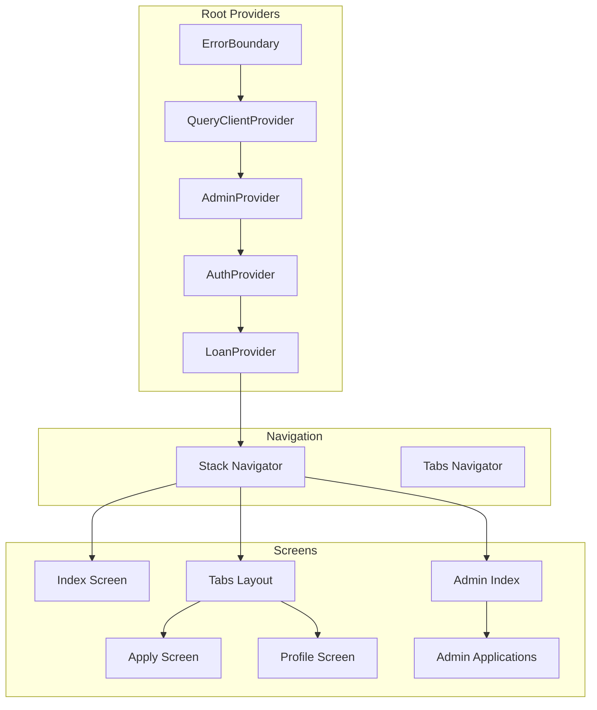
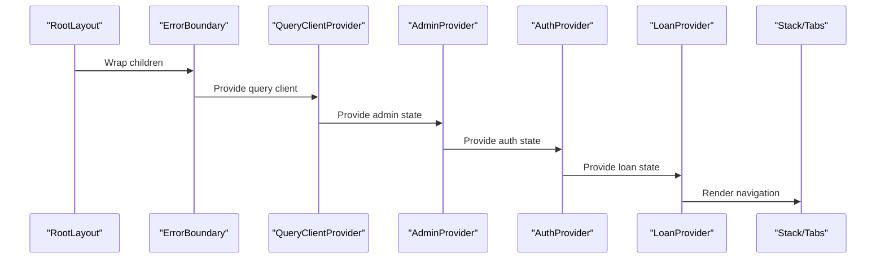
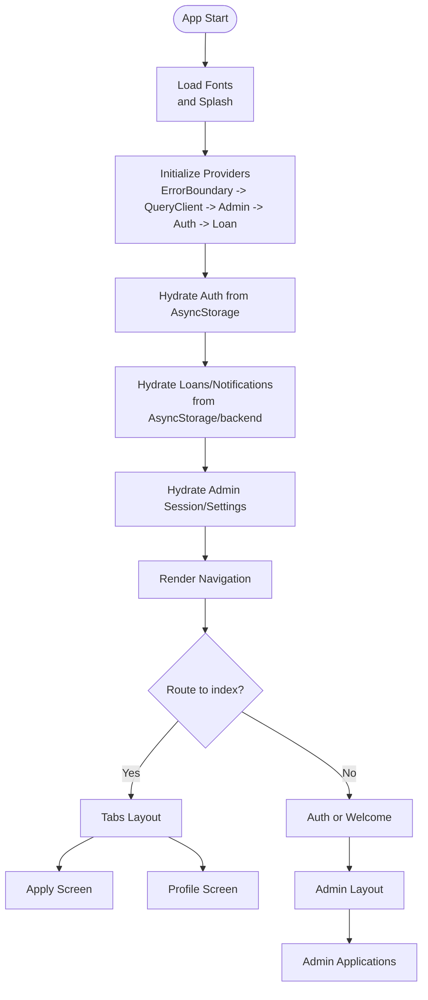
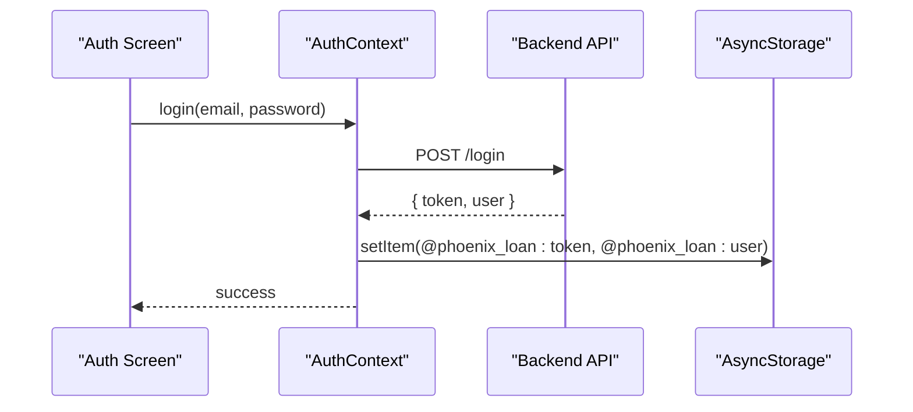
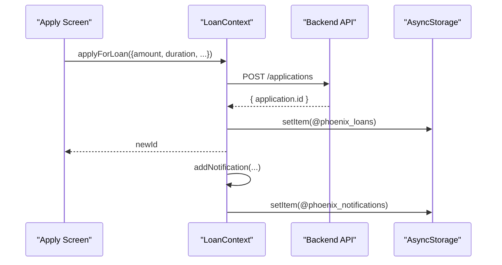
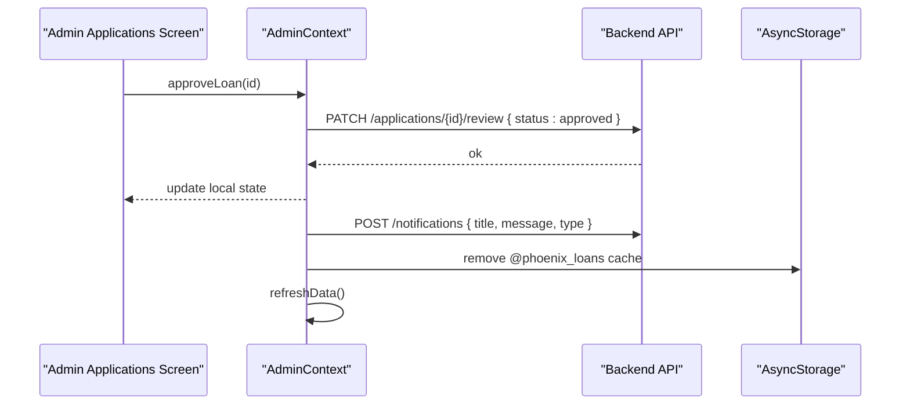
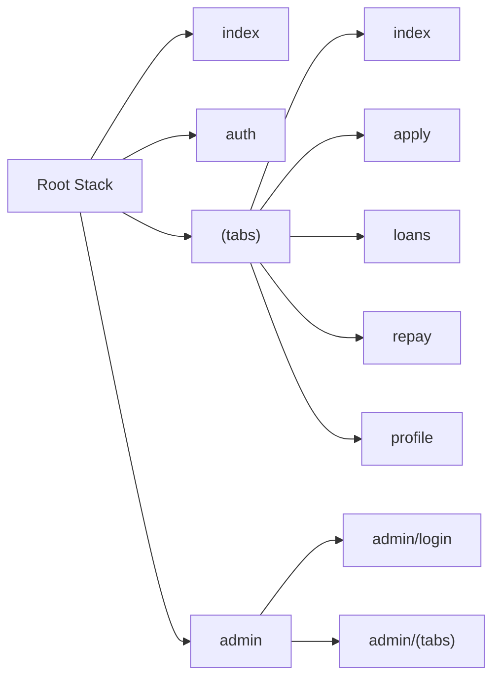
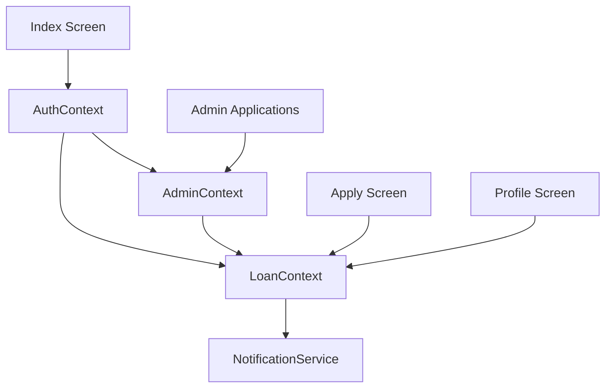

# Frontend Architecture

<cite>
**Referenced Files in This Document**
- [app/_layout.tsx](file://app/_layout.tsx)
- [contexts/AuthContext.tsx](file://contexts/AuthContext.tsx)
- [contexts/LoanContext.tsx](file://contexts/LoanContext.tsx)
- [contexts/AdminContext.tsx](file://contexts/AdminContext.tsx)
- [lib/query-client.ts](file://lib/query-client.ts)
- [app/(tabs)/_layout.tsx](file://app/(tabs)/_layout.tsx)
- [app/admin/_layout.tsx](file://app/admin/_layout.tsx)
- [components/ErrorBoundary.tsx](file://components/ErrorBoundary.tsx)
- [services/NotificationService.ts](file://services/NotificationService.ts)
- [app/index.tsx](file://app/index.tsx)
- [app/(tabs)/apply.tsx](file://app/(tabs)/apply.tsx)
- [app/(tabs)/profile.tsx](file://app/(tabs)/profile.tsx)
- [app/admin/(tabs)/applications.tsx](file://app/admin/(tabs)/applications.tsx)
</cite>

## Table of Contents
1. [Introduction](#introduction)
2. [Project Structure](#project-structure)
3. [Core Components](#core-components)
4. [Architecture Overview](#architecture-overview)
5. [Detailed Component Analysis](#detailed-component-analysis)
6. [Dependency Analysis](#dependency-analysis)
7. [Performance Considerations](#performance-considerations)
8. [Troubleshooting Guide](#troubleshooting-guide)
9. [Conclusion](#conclusion)

## Introduction
This document describes the frontend architecture of the PHOENIX React Native application. It focuses on the Provider Pattern using React Context for state management across three primary contexts: AuthContext, LoanContext, and AdminContext. It also explains the hierarchical provider structure in the root layout, the Expo Router navigation system with a tab-based interface, and the integration patterns between UI components and state management. Finally, it covers performance considerations and mobile-specific optimizations relevant to React Native development.

## Project Structure
The frontend is organized around:
- Root layout orchestrating providers and navigation
- Feature-based screens under app/(tabs) and app/admin
- Context providers for global state
- Shared components and services

**Diagram sources**
- [app/_layout.tsx:31-82](file://app/_layout.tsx#L31-L82)
- [app/(tabs)/_layout.tsx:141-146](file://app/(tabs)/_layout.tsx#L141-L146)
- [app/admin/_layout.tsx:4-11](file://app/admin/_layout.tsx#L4-L11)

**Section sources**
- [app/_layout.tsx:17-82](file://app/_layout.tsx#L17-L82)
- [app/(tabs)/_layout.tsx:12-146](file://app/(tabs)/_layout.tsx#L12-L146)
- [app/admin/_layout.tsx:1-12](file://app/admin/_layout.tsx#L1-L12)

## Core Components
This section documents the Provider Pattern and the three core contexts that manage global state.

- AuthContext
  - Manages user authentication state, token persistence, and login/logout flows.
  - Uses AsyncStorage for persistence and exposes a minimal set of actions via a typed context.
  - Provides a hook to consume context safely.

- LoanContext
  - Centralizes loan application state, notifications, and related actions.
  - Integrates with backend APIs for fetching applications and notifications, with local caching via AsyncStorage.
  - Exposes helpers for calculating interest and durations, and manages unread counts and active loans.

- AdminContext
  - Admin-only state and actions for managing users, loans, and platform settings.
  - Handles admin login/logout, loan lifecycle transitions, and settings persistence.
  - Includes statistics and counters derived from the loaded datasets.

**Section sources**
- [contexts/AuthContext.tsx:1-135](file://contexts/AuthContext.tsx#L1-L135)
- [contexts/LoanContext.tsx:1-336](file://contexts/LoanContext.tsx#L1-L336)
- [contexts/AdminContext.tsx:1-528](file://contexts/AdminContext.tsx#L1-L528)

## Architecture Overview
The root layout composes providers and navigation in a strict hierarchy to ensure proper initialization order and availability of global state across screens.

- Initialization order
  - ErrorBoundary wraps everything to catch rendering errors early.
  - QueryClientProvider initializes TanStack Query for data fetching.
  - AdminProvider initializes admin session and settings.
  - AuthProvider loads persisted user/token and exposes auth actions.
  - LoanProvider hydrates loans and notifications from backend and cache.
  - Navigation renders Stack and Tabs.

- Navigation structure
  - Root Stack defines top-level routes: index, auth, (tabs), admin, +not-found.
  - Tabs layout defines five tabs: Home, Apply, Loans, Repay, Profile.
  - Admin layout defines admin login and admin (tabs) routes.

**Diagram sources**
- [app/_layout.tsx:66-81](file://app/_layout.tsx#L66-L81)
- [app/(tabs)/_layout.tsx:141-146](file://app/(tabs)/_layout.tsx#L141-L146)
- [app/admin/_layout.tsx:4-11](file://app/admin/_layout.tsx#L4-L11)

**Section sources**
- [app/_layout.tsx:31-82](file://app/_layout.tsx#L31-L82)
- [app/(tabs)/_layout.tsx:12-146](file://app/(tabs)/_layout.tsx#L12-L146)
- [app/admin/_layout.tsx:1-12](file://app/admin/_layout.tsx#L1-L12)

## Detailed Component Analysis

### Provider Hierarchy and Global State Flow
- Provider composition
  - ErrorBoundary -> QueryClientProvider -> AdminProvider -> AuthProvider -> LoanProvider -> Navigation.
  - This ensures that navigation and screens can safely consume all contexts.

- State hydration and persistence
  - AuthContext persists tokens and user data in AsyncStorage and hydrates on startup.
  - LoanContext hydrates from AsyncStorage and falls back to backend when available.
  - AdminContext hydrates admin session and settings, with fallbacks to cached data.

- Navigation-driven state access
  - Screens under tabs consume LoanContext for notifications and active loan state.
  - AuthContext is used to decide initial routing and to log out.
  - Admin screens consume AdminContext for administrative actions.

**Diagram sources**
- [app/_layout.tsx:31-82](file://app/_layout.tsx#L31-L82)
- [contexts/AuthContext.tsx:36-54](file://contexts/AuthContext.tsx#L36-L54)
- [contexts/LoanContext.tsx:87-176](file://contexts/LoanContext.tsx#L87-L176)
- [contexts/AdminContext.tsx:146-162](file://contexts/AdminContext.tsx#L146-L162)
- [app/index.tsx:6-22](file://app/index.tsx#L6-L22)

**Section sources**
- [app/_layout.tsx:66-81](file://app/_layout.tsx#L66-L81)
- [contexts/AuthContext.tsx:36-126](file://contexts/AuthContext.tsx#L36-L126)
- [contexts/LoanContext.tsx:87-328](file://contexts/LoanContext.tsx#L87-L328)
- [contexts/AdminContext.tsx:135-521](file://contexts/AdminContext.tsx#L135-L521)

### AuthContext: Authentication State Management
- Responsibilities
  - Persist and restore token and user profile.
  - Provide login, register, and logout actions.
  - Expose loading state for initial hydration.

- Integration patterns
  - Used in index screen to redirect based on auth state.
  - Consumed by LoanContext to attach user identifiers for backend requests.

**Diagram sources**
- [contexts/AuthContext.tsx:56-119](file://contexts/AuthContext.tsx#L56-L119)

**Section sources**
- [contexts/AuthContext.tsx:1-135](file://contexts/AuthContext.tsx#L1-L135)
- [app/index.tsx:6-22](file://app/index.tsx#L6-L22)

### LoanContext: Loan Lifecycle and Notifications
- Responsibilities
  - Manage loan applications, notifications, and unread counts.
  - Calculate interest and durations.
  - Submit applications, upload repayment proofs, rate loans, and mark notifications read.
  - Integrate with backend APIs and maintain local cache.

- Integration patterns
  - Apply screen uses LoanContext to submit applications and show progress.
  - Profile screen displays notifications and unread count.
  - Tabs layout integrates unread count into the Profile tab badge.

**Diagram sources**
- [app/(tabs)/apply.tsx:125-255](file://app/(tabs)/apply.tsx#L125-L255)
- [contexts/LoanContext.tsx:198-261](file://contexts/LoanContext.tsx#L198-L261)

**Section sources**
- [contexts/LoanContext.tsx:1-336](file://contexts/LoanContext.tsx#L1-L336)
- [app/(tabs)/apply.tsx:125-255](file://app/(tabs)/apply.tsx#L125-L255)
- [app/(tabs)/profile.tsx:127-154](file://app/(tabs)/profile.tsx#L127-L154)
- [app/(tabs)/_layout.tsx:12-38](file://app/(tabs)/_layout.tsx#L12-L38)

### AdminContext: Administrative Operations
- Responsibilities
  - Admin login/logout and session persistence.
  - Approve/reject/disburse/complete loans.
  - Update platform settings and user attributes.
  - Compute statistics and counters.

- Integration patterns
  - Admin applications screen consumes AdminContext to manage loan statuses and settings.

**Diagram sources**
- [app/admin/(tabs)/applications.tsx:155-250](file://app/admin/(tabs)/applications.tsx#L155-L250)
- [contexts/AdminContext.tsx:311-335](file://contexts/AdminContext.tsx#L311-L335)

**Section sources**
- [contexts/AdminContext.tsx:1-528](file://contexts/AdminContext.tsx#L1-L528)
- [app/admin/(tabs)/applications.tsx:155-250](file://app/admin/(tabs)/applications.tsx#L155-L250)

### Navigation and Tab-Based Interface
- Root Stack
  - Defines top-level routes: index, auth, (tabs), admin, +not-found.
  - Controls header visibility globally.

- Tabs Layout
  - Implements a native or classic tab bar depending on device capabilities.
  - Displays an unread notifications badge in the Profile tab.

- Admin Layout
  - Wraps admin login and admin (tabs) routes.

**Diagram sources**
- [app/_layout.tsx:19-28](file://app/_layout.tsx#L19-L28)
- [app/(tabs)/_layout.tsx:141-146](file://app/(tabs)/_layout.tsx#L141-L146)
- [app/admin/_layout.tsx:4-11](file://app/admin/_layout.tsx#L4-L11)

**Section sources**
- [app/_layout.tsx:19-28](file://app/_layout.tsx#L19-L28)
- [app/(tabs)/_layout.tsx:12-146](file://app/(tabs)/_layout.tsx#L12-L146)
- [app/admin/_layout.tsx:1-12](file://app/admin/_layout.tsx#L1-L12)

### Error Handling and Resilience
- ErrorBoundary
  - Class-based error boundary that catches rendering errors and renders a fallback UI.
  - Provides a reset mechanism to recover after an error.

- Integration
  - Wrapped around providers to ensure UI stability even if a child component throws.

**Section sources**
- [components/ErrorBoundary.tsx:16-54](file://components/ErrorBoundary.tsx#L16-L54)
- [app/_layout.tsx:66-81](file://app/_layout.tsx#L66-L81)

### Push Notifications and Offline Behavior
- NotificationService
  - Registers for push notifications on supported platforms.
  - Sends local notifications and posts notifications to backend when available.
  - Handles permissions and platform-specific channel configuration.

- Offline behavior
  - LoanContext and AdminContext fall back to AsyncStorage when backend is unavailable.

**Section sources**
- [services/NotificationService.ts:26-134](file://services/NotificationService.ts#L26-L134)
- [contexts/LoanContext.tsx:136-176](file://contexts/LoanContext.tsx#L136-L176)
- [contexts/AdminContext.tsx:264-284](file://contexts/AdminContext.tsx#L264-L284)

## Dependency Analysis
- Provider dependencies
  - AdminProvider depends on AsyncStorage and backend APIs.
  - AuthProvider depends on AsyncStorage and backend auth endpoints.
  - LoanProvider depends on AsyncStorage, backend APIs, and NotificationService.
  - AdminContext depends on AdminProvider for session state.

- Navigation dependencies
  - Tabs depend on LoanContext for unread count.
  - Index screen depends on AuthContext for routing decisions.

**Diagram sources**
- [contexts/AuthContext.tsx:1-135](file://contexts/AuthContext.tsx#L1-L135)
- [contexts/LoanContext.tsx:1-336](file://contexts/LoanContext.tsx#L1-L336)
- [contexts/AdminContext.tsx:1-528](file://contexts/AdminContext.tsx#L1-L528)
- [services/NotificationService.ts:1-135](file://services/NotificationService.ts#L1-L135)
- [app/index.tsx:1-23](file://app/index.tsx#L1-L23)
- [app/(tabs)/apply.tsx:1-816](file://app/(tabs)/apply.tsx#L1-L816)
- [app/(tabs)/profile.tsx:1-618](file://app/(tabs)/profile.tsx#L1-L618)
- [app/admin/(tabs)/applications.tsx:1-457](file://app/admin/(tabs)/applications.tsx#L1-L457)

**Section sources**
- [lib/query-client.ts:67-81](file://lib/query-client.ts#L67-L81)
- [contexts/LoanContext.tsx:136-176](file://contexts/LoanContext.tsx#L136-L176)

## Performance Considerations
- Provider initialization
  - Keep providers lightweight; avoid heavy synchronous work in constructors.
  - Use lazy hydration and caching to minimize startup latency.

- State updates
  - Memoize derived values (e.g., unreadCount, activeLoan) to prevent unnecessary re-renders.
  - Batch state updates when possible to reduce render churn.

- Network and caching
  - TanStack Query default options disable refetch on window focus and retries to reduce network overhead.
  - Use AsyncStorage for offline-first behavior and reduce API calls.

- UI rendering
  - Use FlatList for long lists in admin applications to virtualize rows.
  - Avoid deep object cloning; prefer immutable updates to keep renders predictable.

- Memory management
  - Clean up timers and subscriptions in useEffect cleanup functions.
  - Avoid retaining large datasets in memory; rely on AsyncStorage for persistence.

[No sources needed since this section provides general guidance]

## Troubleshooting Guide
- ErrorBoundary
  - If a screen crashes, the ErrorBoundary will display a fallback UI. Use the reset button to recover.
  - Provide an onError callback to capture error details for diagnostics.

- Authentication issues
  - Verify AsyncStorage keys for token and user profile.
  - Confirm backend auth endpoints are reachable and returning expected shapes.

- Loan application failures
  - Check backend application endpoint and ensure X-User-Id header is present.
  - Inspect AsyncStorage keys for @phoenix_loans and @phoenix_notifications.

- Admin operations
  - Ensure admin session is active and AsyncStorage indicates an active session.
  - Confirm backend endpoints for approvals, disbursements, and completions.

**Section sources**
- [components/ErrorBoundary.tsx:16-54](file://components/ErrorBoundary.tsx#L16-L54)
- [contexts/AuthContext.tsx:36-126](file://contexts/AuthContext.tsx#L36-L126)
- [contexts/LoanContext.tsx:198-261](file://contexts/LoanContext.tsx#L198-L261)
- [contexts/AdminContext.tsx:146-162](file://contexts/AdminContext.tsx#L146-L162)

## Conclusion
PHOENIX employs a robust Provider Pattern with a clear hierarchical structure to manage authentication, loan lifecycle, and administrative operations. The root layout composes ErrorBoundary, TanStack Query, and the three contexts in a deterministic order, ensuring reliable state access across screens. The Expo Router-based navigation provides a tabbed interface with integrated notifications and admin workflows. Performance and resilience are addressed through memoization, caching, and offline-first strategies, while error handling is centralized via a class-based ErrorBoundary.