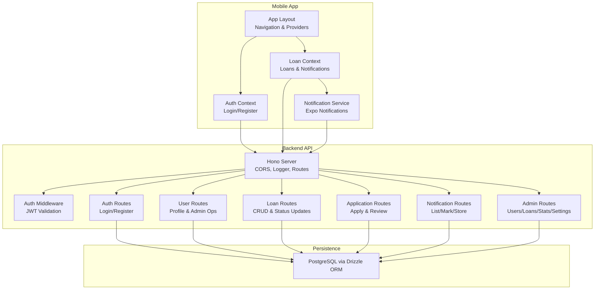
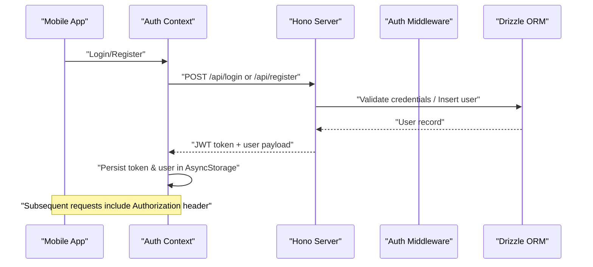
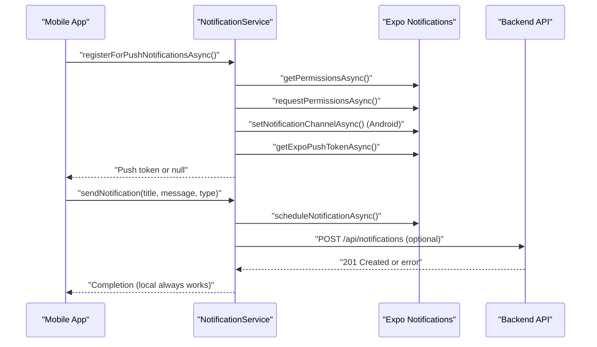
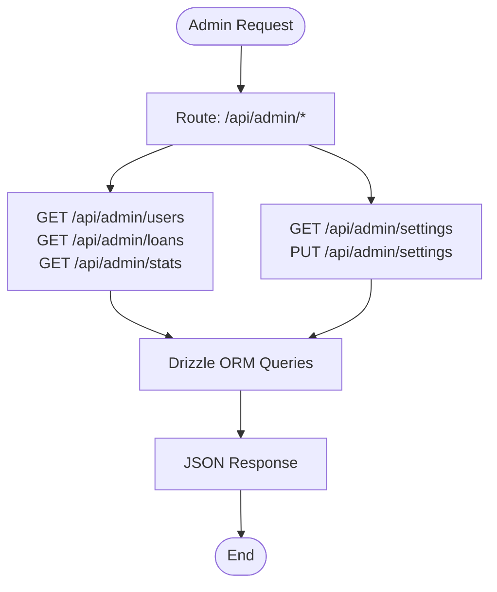
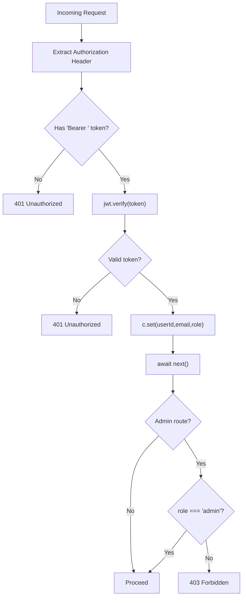
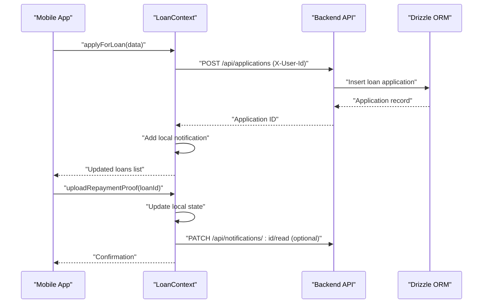
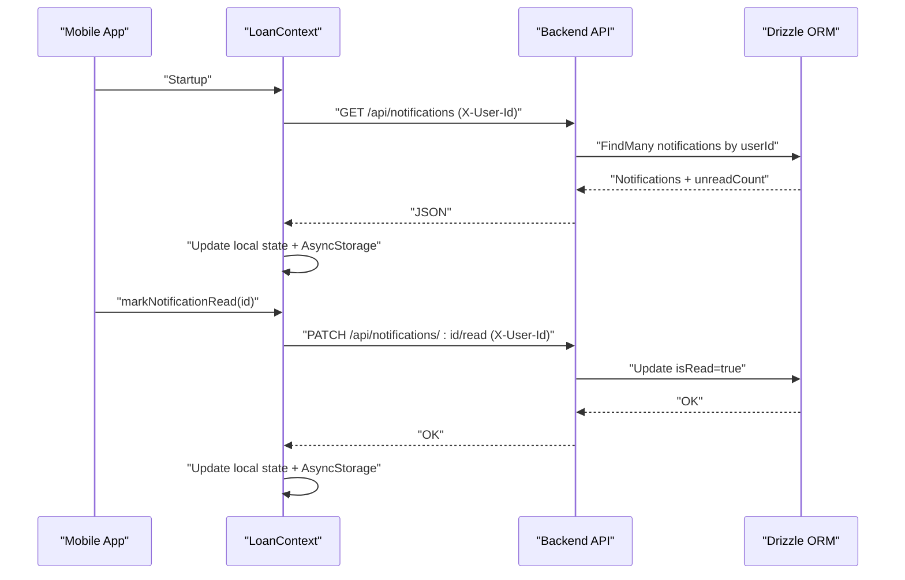
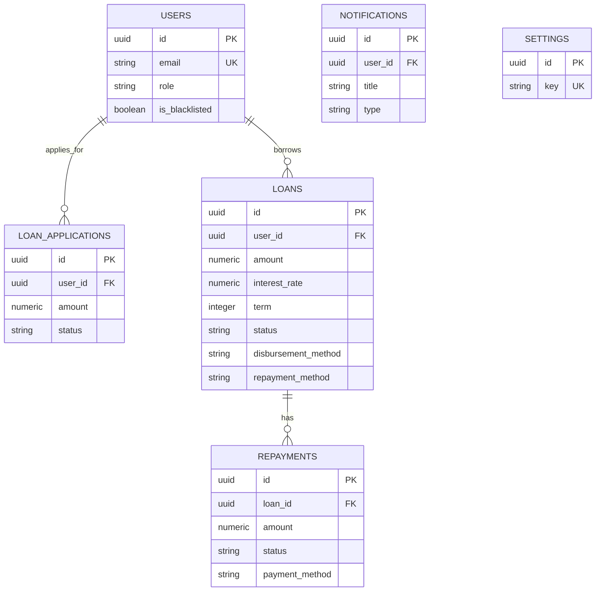
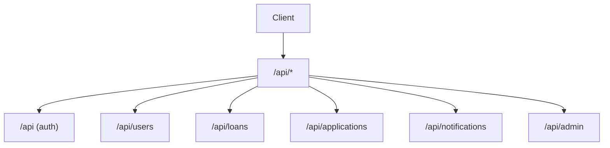
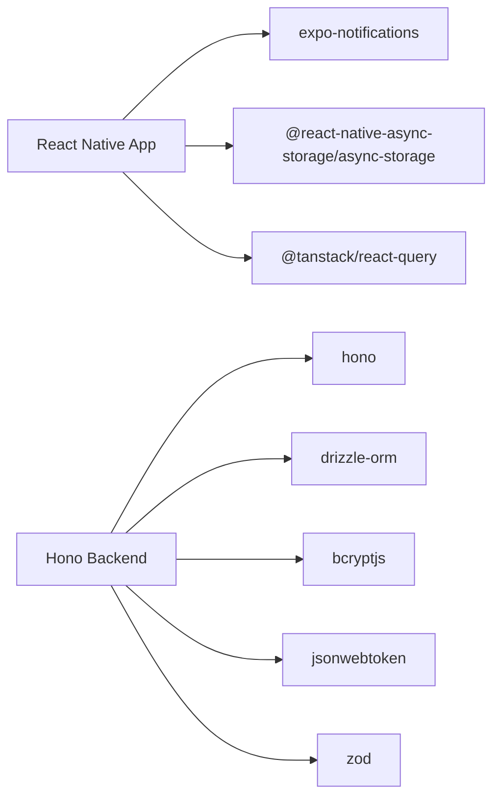

# Integration Patterns

<cite>
**Referenced Files in This Document**
- [backend/src/middleware/auth.ts](file://backend/src/middleware/auth.ts)
- [services/NotificationService.ts](file://services/NotificationService.ts)
- [backend/src/routes/admin.ts](file://backend/src/routes/admin.ts)
- [backend/src/routes/notifications.ts](file://backend/src/routes/notifications.ts)
- [contexts/AuthContext.tsx](file://contexts/AuthContext.tsx)
- [backend/src/routes/auth.ts](file://backend/src/routes/auth.ts)
- [backend/src/routes/users.ts](file://backend/src/routes/users.ts)
- [backend/src/db/schema.ts](file://backend/src/db/schema.ts)
- [app/_layout.tsx](file://app/_layout.tsx)
- [backend/src/index.ts](file://backend/src/index.ts)
- [backend/src/routes/applications.ts](file://backend/src/routes/applications.ts)
- [backend/src/routes/loans.ts](file://backend/src/routes/loans.ts)
- [contexts/LoanContext.tsx](file://contexts/LoanContext.tsx)
- [components/NotificationTest.tsx](file://components/NotificationTest.tsx)
- [package.json](file://package.json)
</cite>

## Table of Contents
1. [Introduction](#introduction)
2. [Project Structure](#project-structure)
3. [Core Components](#core-components)
4. [Architecture Overview](#architecture-overview)
5. [Detailed Component Analysis](#detailed-component-analysis)
6. [Dependency Analysis](#dependency-analysis)
7. [Performance Considerations](#performance-considerations)
8. [Troubleshooting Guide](#troubleshooting-guide)
9. [Conclusion](#conclusion)
10. [Appendices](#appendices)

## Introduction
This document describes the integration patterns implemented in the PHOENIX system. It covers:
- Push notification integration with Expo Notifications, including registration, permissions, and message delivery
- Administrative API integration patterns for loan officer workflows and user management
- Authentication middleware integration with JWT token validation and role-based access control
- External service integrations including mobile payment providers and third-party verification services
- Webhook implementations, API gateway patterns, and service-to-service communication
- Integration testing strategies, error propagation, and fallback mechanisms for reliable operation

## Project Structure
The system comprises:
- A React Native mobile app with Expo Router navigation and context providers
- A backend API built with Hono, exposing REST endpoints for authentication, users, loans, applications, notifications, and administration
- A PostgreSQL-backed persistence layer via Drizzle ORM
- A notification service integrating with Expo Notifications

**Diagram sources**
- [app/_layout.tsx:19-82](file://app/_layout.tsx#L19-L82)
- [contexts/AuthContext.tsx:31-126](file://contexts/AuthContext.tsx#L31-L126)
- [contexts/LoanContext.tsx:82-329](file://contexts/LoanContext.tsx#L82-L329)
- [services/NotificationService.ts:26-135](file://services/NotificationService.ts#L26-L135)
- [backend/src/index.ts:17-76](file://backend/src/index.ts#L17-L76)
- [backend/src/middleware/auth.ts:10-47](file://backend/src/middleware/auth.ts#L10-L47)
- [backend/src/routes/auth.ts:10-146](file://backend/src/routes/auth.ts#L10-L146)
- [backend/src/routes/users.ts:6-197](file://backend/src/routes/users.ts#L6-L197)
- [backend/src/routes/loans.ts:8-320](file://backend/src/routes/loans.ts#L8-L320)
- [backend/src/routes/applications.ts:8-168](file://backend/src/routes/applications.ts#L8-L168)
- [backend/src/routes/notifications.ts:6-106](file://backend/src/routes/notifications.ts#L6-L106)
- [backend/src/routes/admin.ts:6-171](file://backend/src/routes/admin.ts#L6-L171)
- [backend/src/db/schema.ts:1-146](file://backend/src/db/schema.ts#L1-L146)

**Section sources**
- [backend/src/index.ts:17-76](file://backend/src/index.ts#L17-L76)
- [package.json:22-68](file://package.json#L22-L68)

## Core Components
- Authentication and Authorization
  - JWT-based authentication with middleware validating tokens and setting user context variables
  - Role-based access control with an admin-only middleware
- Push Notifications
  - Expo Notifications integration for device registration, permission handling, channel creation, and local notification scheduling
  - Backend notification persistence and retrieval via dedicated endpoints
- Administrative Workflows
  - Admin APIs for user listing, loan listing, statistics, and settings management
- Loan Officer and User Management
  - User profile management, blacklist toggling, and password updates
  - Loan lifecycle management including status updates, disbursement, and repayment
  - Application review workflow for administrators
- Persistence
  - PostgreSQL schema with tables for users, loans, applications, repayments, notifications, and settings

**Section sources**
- [backend/src/middleware/auth.ts:10-47](file://backend/src/middleware/auth.ts#L10-L47)
- [services/NotificationService.ts:26-135](file://services/NotificationService.ts#L26-L135)
- [backend/src/routes/admin.ts:8-171](file://backend/src/routes/admin.ts#L8-L171)
- [backend/src/routes/users.ts:8-197](file://backend/src/routes/users.ts#L8-L197)
- [backend/src/routes/loans.ts:92-320](file://backend/src/routes/loans.ts#L92-L320)
- [backend/src/routes/applications.ts:24-168](file://backend/src/routes/applications.ts#L24-L168)
- [backend/src/db/schema.ts:4-96](file://backend/src/db/schema.ts#L4-L96)

## Architecture Overview
The system follows a client-server architecture:
- Mobile app communicates with the backend via HTTP requests
- Backend routes are mounted under a base path and protected by middleware
- Authentication middleware injects user identity into the request context
- Admin-only endpoints enforce role checks
- Notifications are persisted in the database and synchronized with local storage

**Diagram sources**
- [contexts/AuthContext.tsx:56-112](file://contexts/AuthContext.tsx#L56-L112)
- [backend/src/routes/auth.ts:95-143](file://backend/src/routes/auth.ts#L95-L143)
- [backend/src/middleware/auth.ts:10-36](file://backend/src/middleware/auth.ts#L10-L36)

**Section sources**
- [backend/src/index.ts:54-61](file://backend/src/index.ts#L54-L61)
- [backend/src/middleware/auth.ts:10-47](file://backend/src/middleware/auth.ts#L10-L47)

## Detailed Component Analysis

### Push Notification Integration with Expo Notifications
- Registration and Permissions
  - Detects device capabilities and platform-specific behavior
  - Requests notification permissions and sets up Android channels
  - Retrieves Expo push token for remote delivery
- Local and Remote Delivery
  - Schedules local notifications immediately
  - Optionally posts notifications to backend for persistence
- Fallback Behavior
  - Local notifications continue to work even if backend posting fails
  - Token retrieval errors are handled gracefully

**Diagram sources**
- [services/NotificationService.ts:26-135](file://services/NotificationService.ts#L26-L135)
- [app/_layout.tsx:50-61](file://app/_layout.tsx#L50-L61)
- [backend/src/routes/notifications.ts:72-90](file://backend/src/routes/notifications.ts#L72-L90)

**Section sources**
- [services/NotificationService.ts:26-135](file://services/NotificationService.ts#L26-L135)
- [app/_layout.tsx:50-61](file://app/_layout.tsx#L50-L61)
- [backend/src/routes/notifications.ts:8-103](file://backend/src/routes/notifications.ts#L8-L103)

### Administrative API Integration Patterns
- User Management
  - Pagination and safe field exposure
  - Blacklist toggling and password updates
- Loan Management
  - Listing with related user data
  - Status updates, disbursement, marking as repaid, and completion
- Statistics and Settings
  - Aggregation queries for dashboard metrics
  - Dynamic settings management with JSON values

**Diagram sources**
- [backend/src/routes/admin.ts:8-171](file://backend/src/routes/admin.ts#L8-L171)
- [backend/src/db/schema.ts:4-96](file://backend/src/db/schema.ts#L4-L96)

**Section sources**
- [backend/src/routes/admin.ts:8-171](file://backend/src/routes/admin.ts#L8-L171)
- [backend/src/routes/users.ts:8-197](file://backend/src/routes/users.ts#L8-L197)
- [backend/src/routes/loans.ts:92-320](file://backend/src/routes/loans.ts#L92-L320)

### Authentication Middleware and Role-Based Access Control
- JWT Validation
  - Extracts Bearer token from Authorization header
  - Verifies token using a secret and sets user context variables
- Admin Access
  - Enforces role-based restriction for privileged endpoints

**Diagram sources**
- [backend/src/middleware/auth.ts:10-47](file://backend/src/middleware/auth.ts#L10-L47)

**Section sources**
- [backend/src/middleware/auth.ts:10-47](file://backend/src/middleware/auth.ts#L10-L47)

### Loan Officer Workflows and User Management
- Application Lifecycle
  - Submit applications with validation
  - Retrieve user’s applications
  - Admin review with status updates and reviewer metadata
- Loan Lifecycle
  - Create loans with validation
  - Update status, disburse with payment method/reference, mark repaid, and complete
- User Profile and Admin Actions
  - Retrieve and update profile
  - Toggle blacklist and update passwords

**Diagram sources**
- [contexts/LoanContext.tsx:198-261](file://contexts/LoanContext.tsx#L198-L261)
- [contexts/LoanContext.tsx:263-273](file://contexts/LoanContext.tsx#L263-L273)
- [backend/src/routes/applications.ts:111-138](file://backend/src/routes/applications.ts#L111-L138)
- [backend/src/routes/notifications.ts:36-49](file://backend/src/routes/notifications.ts#L36-L49)

**Section sources**
- [contexts/LoanContext.tsx:198-309](file://contexts/LoanContext.tsx#L198-L309)
- [backend/src/routes/applications.ts:24-168](file://backend/src/routes/applications.ts#L24-L168)
- [backend/src/routes/loans.ts:170-317](file://backend/src/routes/loans.ts#L170-L317)
- [backend/src/routes/users.ts:42-194](file://backend/src/routes/users.ts#L42-L194)

### Notification Persistence and Retrieval
- Endpoint Design
  - List notifications per user with unread count
  - Mark individual or all notifications as read
  - Create notifications with type categorization
  - Delete read notifications
- Frontend Integration
  - Fetches notifications on startup and merges with AsyncStorage
  - Provides immediate local updates and async backend synchronization

**Diagram sources**
- [contexts/LoanContext.tsx:136-158](file://contexts/LoanContext.tsx#L136-L158)
- [contexts/LoanContext.tsx:282-295](file://contexts/LoanContext.tsx#L282-L295)
- [backend/src/routes/notifications.ts:8-103](file://backend/src/routes/notifications.ts#L8-L103)

**Section sources**
- [backend/src/routes/notifications.ts:8-103](file://backend/src/routes/notifications.ts#L8-L103)
- [contexts/LoanContext.tsx:136-158](file://contexts/LoanContext.tsx#L136-L158)

### External Service Integrations
- Mobile Payment Providers
  - Disbursement and repayment methods are modeled as enumerated values in the schema
  - Admin endpoints accept provider-specific identifiers and references
- Third-Party Verification Services
  - KYC fields are captured during registration and surfaced in user listings
  - Administrative dashboards compute derived attributes (e.g., KYC completeness)

**Diagram sources**
- [backend/src/db/schema.ts:4-96](file://backend/src/db/schema.ts#L4-L96)

**Section sources**
- [backend/src/db/schema.ts:24-77](file://backend/src/db/schema.ts#L24-L77)
- [backend/src/routes/loans.ts:224-290](file://backend/src/routes/loans.ts#L224-L290)
- [backend/src/routes/applications.ts:111-138](file://backend/src/routes/applications.ts#L111-L138)

### API Gateway Patterns and Service-to-Service Communication
- Base Path Routing
  - Routes are mounted under a base path to avoid conflicts and organize endpoints
- CORS and Headers
  - Configured origins and allowed headers including a custom X-User-Id header for user scoping
- Health and Documentation
  - Health check endpoint and Swagger UI for API documentation

**Diagram sources**
- [backend/src/index.ts:54-61](file://backend/src/index.ts#L54-L61)
- [backend/src/index.ts:20-26](file://backend/src/index.ts#L20-L26)

**Section sources**
- [backend/src/index.ts:17-76](file://backend/src/index.ts#L17-L76)

### Webhook Implementations
- Current Implementation Status
  - No explicit webhook endpoints are present in the backend routes
  - Notifications are stored in the database and retrieved via GET endpoints
- Recommended Pattern
  - Introduce a webhook endpoint under a dedicated route (e.g., /api/webhooks/notifications)
  - Validate signatures using a shared secret
  - De-duplicate events and handle retries with exponential backoff
  - Store event payloads and statuses for audit and replay

[No sources needed since this section provides general guidance]

### Integration Testing Strategies
- Unit Testing
  - Mock Drizzle ORM for database interactions
  - Stub JWT verification and AsyncStorage for context modules
- Integration Testing
  - Spin up a test database and seed schema
  - Test end-to-end flows: authentication, application submission, notification persistence
- Error Propagation and Fallbacks
  - Prefer local notifications when backend posting fails
  - Graceful degradation: load from AsyncStorage if backend is unavailable
  - Log and surface user-friendly messages without leaking internal errors

**Section sources**
- [services/NotificationService.ts:121-134](file://services/NotificationService.ts#L121-L134)
- [contexts/LoanContext.tsx:132-158](file://contexts/LoanContext.tsx#L132-L158)

## Dependency Analysis
- Client Dependencies
  - Expo Notifications, AsyncStorage, React Query for caching, and Zod for validation
- Backend Dependencies
  - Hono for routing, Drizzle ORM for database operations, bcrypt for password hashing, jsonwebtoken for JWT
- Coupling and Cohesion
  - Routes are cohesive around domain concerns (auth, users, loans, applications, notifications, admin)
  - Middleware enforces cross-cutting concerns (authentication, authorization)

**Diagram sources**
- [package.json:22-68](file://package.json#L22-L68)
- [backend/src/routes/auth.ts:1-10](file://backend/src/routes/auth.ts#L1-L10)

**Section sources**
- [package.json:22-68](file://package.json#L22-L68)
- [backend/src/routes/auth.ts:1-10](file://backend/src/routes/auth.ts#L1-L10)

## Performance Considerations
- Pagination and Limits
  - Admin endpoints implement pagination and enforce maximum limits to prevent heavy queries
- Aggregation Queries
  - Dashboard statistics use aggregation to minimize data transfer
- Network Efficiency
  - Combine backend fetches with local storage to reduce network calls
  - Batch notification reads and writes where appropriate

**Section sources**
- [backend/src/routes/admin.ts:10-47](file://backend/src/routes/admin.ts#L10-L47)
- [backend/src/routes/admin.ts:96-125](file://backend/src/routes/admin.ts#L96-L125)
- [contexts/LoanContext.tsx:132-158](file://contexts/LoanContext.tsx#L132-L158)

## Troubleshooting Guide
- Authentication Failures
  - Ensure Authorization header includes a valid Bearer token
  - Confirm JWT_SECRET is configured and consistent across environments
- Permission Denied
  - Admin-only endpoints require role=admin; verify user role assignment
- Notification Issues
  - On Expo Go, device push tokens are not available; local notifications still work
  - If backend posting fails, local notifications remain unaffected
- CORS Errors
  - Verify allowed origins and credentials configuration in CORS middleware
- Database Schema Mismatches
  - Loan table migration logic adds missing columns; ensure migrations are applied

**Section sources**
- [backend/src/middleware/auth.ts:14-31](file://backend/src/middleware/auth.ts#L14-L31)
- [services/NotificationService.ts:28-36](file://services/NotificationService.ts#L28-L36)
- [services/NotificationService.ts:121-134](file://services/NotificationService.ts#L121-L134)
- [backend/src/index.ts:21-26](file://backend/src/index.ts#L21-L26)
- [backend/src/routes/loans.ts:11-82](file://backend/src/routes/loans.ts#L11-L82)

## Conclusion
PHOENIX integrates a robust set of patterns for authentication, notifications, administrative workflows, and persistence. The system emphasizes reliability through local fallbacks, structured middleware for security, and clear separation of concerns across routes. Extending the system with webhooks and additional external integrations should follow the established patterns for error handling, fallbacks, and consistent API design.

## Appendices
- API Endpoints Overview
  - Authentication: POST /api/login, POST /api/register
  - Users: GET /api/users/profile, PUT /api/users/profile, GET /api/users/:id (admin), PUT /api/users/:id/blacklist (admin), PUT /api/users/:id/password (admin)
  - Loans: GET /api/loans/my-loans, GET /api/loans/:id, POST /api/loans/, PATCH /api/loans/:id/status, PATCH /api/loans/:id/disburse, PATCH /api/loans/:id/repaid, PATCH /api/loans/:id/complete
  - Applications: GET /api/applications/my-applications, POST /api/applications/, GET /api/applications/:id, PATCH /api/applications/:id/review
  - Notifications: GET /api/notifications/, PATCH /api/notifications/:id/read, PATCH /api/notifications/read-all, POST /api/notifications/, DELETE /api/notifications/read
  - Admin: GET /api/admin/users, GET /api/admin/loans, GET /api/admin/stats, GET /api/admin/settings, PUT /api/admin/settings

[No sources needed since this section summarizes endpoint locations without analyzing specific files]