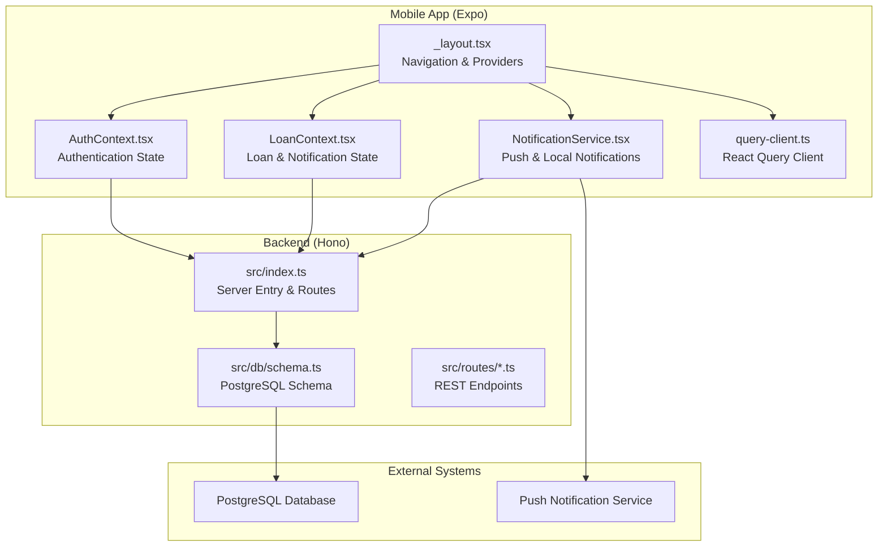
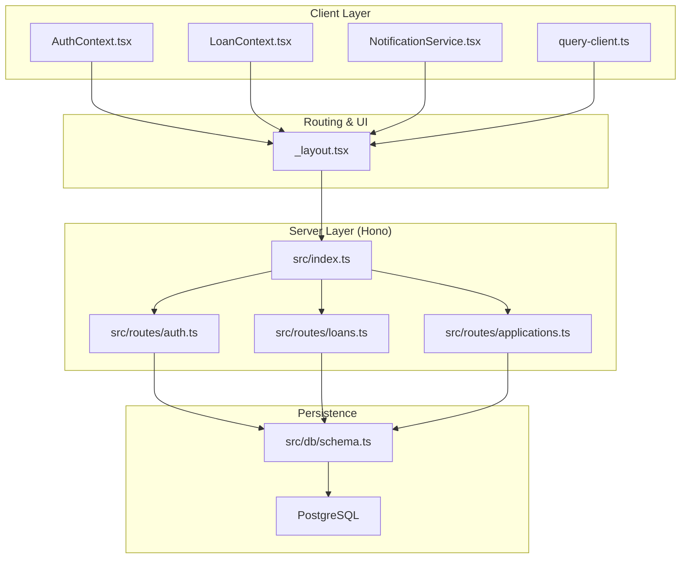
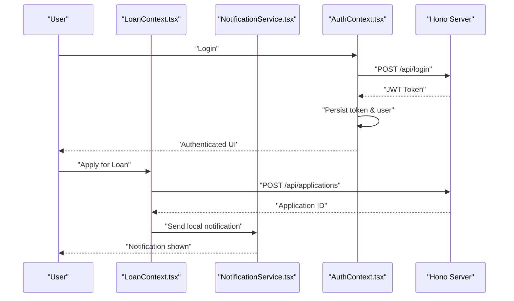
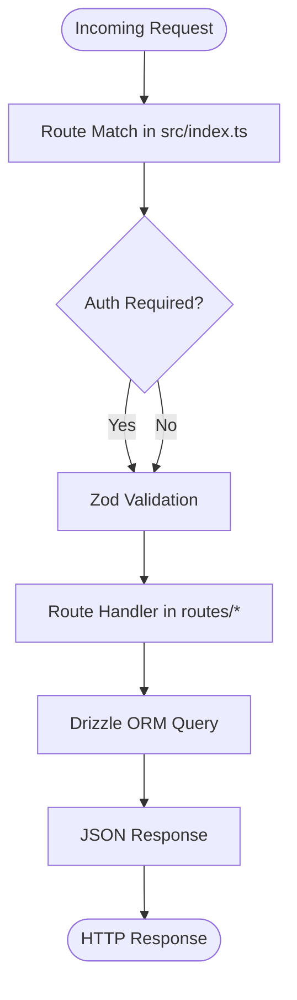
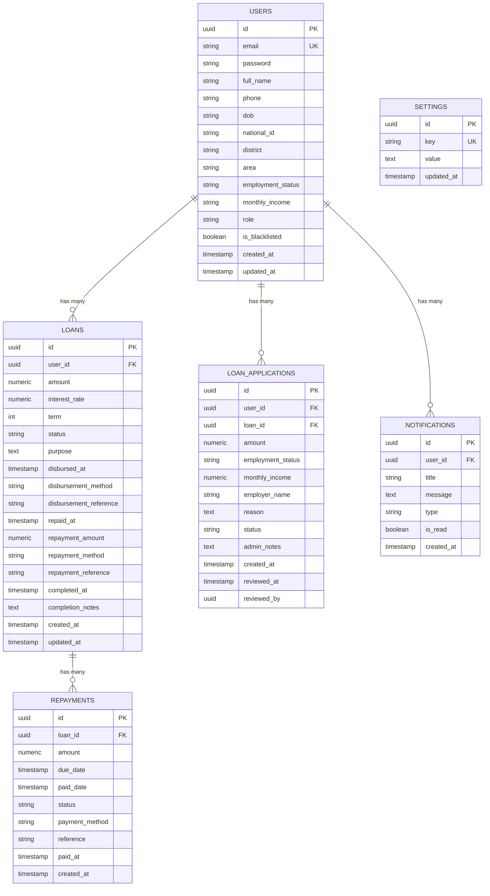
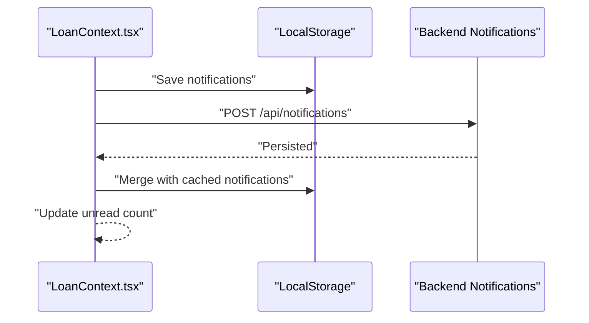
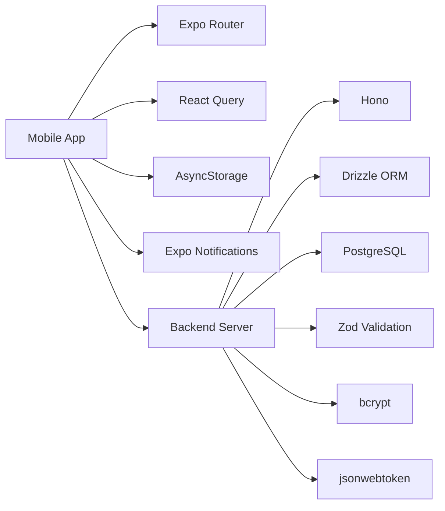

# System Architecture

<cite>
**Referenced Files in This Document**
- [package.json](file://package.json)
- [backend/package.json](file://backend/package.json)
- [app.json](file://app.json)
- [eas.json](file://eas.json)
- [README.md](file://README.md)
- [backend/src/index.ts](file://backend/src/index.ts)
- [backend/src/db/schema.ts](file://backend/src/db/schema.ts)
- [backend/src/routes/auth.ts](file://backend/src/routes/auth.ts)
- [backend/src/routes/loans.ts](file://backend/src/routes/loans.ts)
- [backend/src/routes/applications.ts](file://backend/src/routes/applications.ts)
- [app/_layout.tsx](file://app/_layout.tsx)
- [contexts/AuthContext.tsx](file://contexts/AuthContext.tsx)
- [contexts/LoanContext.tsx](file://contexts/LoanContext.tsx)
- [lib/query-client.ts](file://lib/query-client.ts)
- [services/NotificationService.ts](file://services/NotificationService.ts)
</cite>

## Table of Contents
1. [Introduction](#introduction)
2. [Project Structure](#project-structure)
3. [Core Components](#core-components)
4. [Architecture Overview](#architecture-overview)
5. [Detailed Component Analysis](#detailed-component-analysis)
6. [Dependency Analysis](#dependency-analysis)
7. [Performance Considerations](#performance-considerations)
8. [Troubleshooting Guide](#troubleshooting-guide)
9. [Conclusion](#conclusion)
10. [Appendices](#appendices)

## Introduction
This document describes the system architecture for PHOENIX, a mobile-first loan management platform targeting the Malawian microfinance market. The platform consists of:
- A React Native mobile application built with Expo Router for navigation and Context API for state management
- A Node.js backend service using the Hono framework for lightweight API development
- A PostgreSQL database managed via Drizzle ORM
- Offline-first capabilities and push notifications for real-time engagement
- Deployment topology supporting development, preview, and production builds

The architecture emphasizes scalability, security, and performance optimization for resource-constrained environments, with clear separation of concerns between the mobile client and backend services.

## Project Structure
The repository is organized into distinct areas:
- Mobile application under the root directory with routing, contexts, UI components, and services
- Backend services under the backend directory implementing API routes, database schema, and ORM configuration
- Shared configuration files for Expo, EAS builds, and TypeScript

**Diagram sources**
- [app/_layout.tsx:1-83](file://app/_layout.tsx#L1-L83)
- [contexts/AuthContext.tsx:1-135](file://contexts/AuthContext.tsx#L1-L135)
- [contexts/LoanContext.tsx:1-336](file://contexts/LoanContext.tsx#L1-L336)
- [services/NotificationService.ts:1-135](file://services/NotificationService.ts#L1-L135)
- [lib/query-client.ts:1-81](file://lib/query-client.ts#L1-L81)
- [backend/src/index.ts:1-76](file://backend/src/index.ts#L1-L76)
- [backend/src/db/schema.ts:1-146](file://backend/src/db/schema.ts#L1-L146)

**Section sources**
- [package.json:1-84](file://package.json#L1-L84)
- [backend/package.json:1-46](file://backend/package.json#L1-L46)
- [app.json:1-77](file://app.json#L1-L77)
- [eas.json:1-22](file://eas.json#L1-L22)

## Core Components
- Mobile application
  - Navigation: Expo Router Stack layout orchestrating screens and nested routes
  - State management: Context providers for authentication, loans, and admin
  - Offline-first: AsyncStorage-backed persistence for loans and notifications
  - Notifications: Local and push notifications with fallback mechanisms
  - Data fetching: React Query client configured for controlled caching and retries
- Backend API
  - Lightweight server: Hono-based routes for authentication, loans, applications, users, notifications, and admin
  - Database: PostgreSQL schema defined with Drizzle ORM and relations
  - CORS and logging: Centralized middleware for cross-origin requests and request logging
- Configuration
  - Expo app configuration for iOS/Android/web, plugins, and EAS build profiles
  - EAS configuration for development, preview, and production distributions

**Section sources**
- [app/_layout.tsx:1-83](file://app/_layout.tsx#L1-L83)
- [contexts/AuthContext.tsx:1-135](file://contexts/AuthContext.tsx#L1-L135)
- [contexts/LoanContext.tsx:1-336](file://contexts/LoanContext.tsx#L1-L336)
- [services/NotificationService.ts:1-135](file://services/NotificationService.ts#L1-L135)
- [lib/query-client.ts:1-81](file://lib/query-client.ts#L1-L81)
- [backend/src/index.ts:1-76](file://backend/src/index.ts#L1-L76)
- [backend/src/db/schema.ts:1-146](file://backend/src/db/schema.ts#L1-L146)
- [app.json:1-77](file://app.json#L1-L77)
- [eas.json:1-22](file://eas.json#L1-L22)

## Architecture Overview
The system follows a thin-client architecture:
- The mobile app handles UI, offline persistence, and user interactions
- The backend exposes REST endpoints secured with JWT and validated by Zod schemas
- Drizzle ORM connects to PostgreSQL for persistent data storage
- Push notifications integrate with the device’s native notification system and a backend notifications endpoint

**Diagram sources**
- [app/_layout.tsx:1-83](file://app/_layout.tsx#L1-L83)
- [contexts/AuthContext.tsx:1-135](file://contexts/AuthContext.tsx#L1-L135)
- [contexts/LoanContext.tsx:1-336](file://contexts/LoanContext.tsx#L1-L336)
- [services/NotificationService.ts:1-135](file://services/NotificationService.ts#L1-L135)
- [lib/query-client.ts:1-81](file://lib/query-client.ts#L1-L81)
- [backend/src/index.ts:1-76](file://backend/src/index.ts#L1-L76)
- [backend/src/routes/auth.ts:1-146](file://backend/src/routes/auth.ts#L1-L146)
- [backend/src/routes/loans.ts:1-320](file://backend/src/routes/loans.ts#L1-L320)
- [backend/src/routes/applications.ts:1-168](file://backend/src/routes/applications.ts#L1-L168)
- [backend/src/db/schema.ts:1-146](file://backend/src/db/schema.ts#L1-L146)

## Detailed Component Analysis

### Mobile Application Layer
- Navigation and Providers
  - Stack layout defines top-level screens and nested tab groups
  - Providers wrap the UI tree to supply authentication, loan, and admin state
  - Splash screen and font loading orchestration
- Authentication Context
  - Manages login, registration, and logout flows
  - Stores tokens and user data in AsyncStorage
  - Integrates with backend endpoints for secure authentication
- Loan and Notification Context
  - Implements offline-first state with AsyncStorage
  - Provides CRUD-like operations for loan applications and notifications
  - Emits local notifications and persists to backend when available
- React Query Client
  - Centralized API client with strict error handling and controlled caching
  - Configured to avoid automatic refetches and retries for stability in constrained environments

**Diagram sources**
- [contexts/AuthContext.tsx:56-112](file://contexts/AuthContext.tsx#L56-L112)
- [contexts/LoanContext.tsx:198-261](file://contexts/LoanContext.tsx#L198-L261)
- [services/NotificationService.ts:116-134](file://services/NotificationService.ts#L116-L134)
- [backend/src/routes/applications.ts:110-138](file://backend/src/routes/applications.ts#L110-L138)

**Section sources**
- [app/_layout.tsx:19-82](file://app/_layout.tsx#L19-L82)
- [contexts/AuthContext.tsx:31-126](file://contexts/AuthContext.tsx#L31-L126)
- [contexts/LoanContext.tsx:82-329](file://contexts/LoanContext.tsx#L82-L329)
- [lib/query-client.ts:46-81](file://lib/query-client.ts#L46-L81)

### Backend API Layer
- Server Entry
  - Initializes Hono app, loads environment variables, applies CORS and logging middleware
  - Exposes health checks and Swagger UI for documentation
  - Routes mounted under /api for auth, loans, applications, users, notifications, and admin
- Authentication Route
  - Validates inputs with Zod
  - Hashes passwords with bcrypt and issues JWT tokens
  - Returns user data without sensitive fields
- Loans Route
  - Ensures backward-compatible database columns
  - Supports listing, retrieving, creating, and updating loan lifecycle states
  - Admin endpoints for disbursement and marking loans as repaid or completed
- Applications Route
  - Manages loan applications with status transitions
  - Includes admin review endpoints and user-centric retrieval
- Database Schema
  - Defines users, loans, loan applications, repayments, notifications, and settings tables
  - Establishes relations between entities for referential integrity

**Diagram sources**
- [backend/src/index.ts:54-61](file://backend/src/index.ts#L54-L61)
- [backend/src/routes/auth.ts:33-93](file://backend/src/routes/auth.ts#L33-L93)
- [backend/src/routes/loans.ts:171-197](file://backend/src/routes/loans.ts#L171-L197)
- [backend/src/routes/applications.ts:110-138](file://backend/src/routes/applications.ts#L110-L138)
- [backend/src/db/schema.ts:4-146](file://backend/src/db/schema.ts#L4-L146)

**Section sources**
- [backend/src/index.ts:17-76](file://backend/src/index.ts#L17-L76)
- [backend/src/routes/auth.ts:10-146](file://backend/src/routes/auth.ts#L10-L146)
- [backend/src/routes/loans.ts:8-320](file://backend/src/routes/loans.ts#L8-L320)
- [backend/src/routes/applications.ts:8-168](file://backend/src/routes/applications.ts#L8-L168)
- [backend/src/db/schema.ts:1-146](file://backend/src/db/schema.ts#L1-L146)

### Data Model
The backend uses PostgreSQL with Drizzle ORM to define core entities and relationships.

**Diagram sources**
- [backend/src/db/schema.ts:4-146](file://backend/src/db/schema.ts#L4-L146)

**Section sources**
- [backend/src/db/schema.ts:1-146](file://backend/src/db/schema.ts#L1-L146)

### Notifications and Offline Capabilities
- Push Notifications
  - Device permission handling and channel configuration for Android
  - Local notifications for immediate feedback
  - Backend persistence via notifications endpoint
- Offline Persistence
  - AsyncStorage stores loans and notifications to ensure availability without network
  - Context merges backend data with local cache and updates state accordingly

**Diagram sources**
- [contexts/LoanContext.tsx:183-196](file://contexts/LoanContext.tsx#L183-L196)
- [services/NotificationService.ts:93-114](file://services/NotificationService.ts#L93-L114)

**Section sources**
- [services/NotificationService.ts:26-69](file://services/NotificationService.ts#L26-L69)
- [contexts/LoanContext.tsx:136-176](file://contexts/LoanContext.tsx#L136-L176)

## Dependency Analysis
- Mobile app dependencies
  - Expo Router for declarative routing
  - React Query for data fetching and caching
  - Async Storage for offline persistence
  - Expo Notifications for push/local alerts
- Backend dependencies
  - Hono for minimal server setup
  - Drizzle ORM and PostgreSQL driver for database operations
  - Zod for request validation and bcrypt/jwt for security
- Build and deployment
  - EAS for development, preview, and production builds
  - Expo app.json configures plugins, icons, and notification channels

**Diagram sources**
- [package.json:22-68](file://package.json#L22-L68)
- [backend/package.json:22-34](file://backend/package.json#L22-L34)
- [app.json:35-61](file://app.json#L35-L61)
- [eas.json:6-17](file://eas.json#L6-L17)

**Section sources**
- [package.json:22-68](file://package.json#L22-L68)
- [backend/package.json:22-34](file://backend/package.json#L22-L34)
- [app.json:35-61](file://app.json#L35-L61)
- [eas.json:6-17](file://eas.json#L6-L17)

## Performance Considerations
- Mobile app
  - Controlled caching and disabled auto-refetch to reduce network overhead
  - Minimal bundle size and optimized startup time for low-end devices
- Backend
  - Lightweight Hono server with minimal middleware for fast request handling
  - Zod validation reduces error handling overhead
  - PostgreSQL schema normalized to minimize redundant reads
- Offline-first
  - AsyncStorage ensures responsive UI even without connectivity
  - Local notifications mitigate latency for time-sensitive events

[No sources needed since this section provides general guidance]

## Troubleshooting Guide
- Authentication failures
  - Verify JWT secret and environment configuration
  - Confirm bcrypt hashing and password comparison logic
- Network errors
  - Check CORS origins and credentials configuration
  - Validate API URLs and headers (including X-User-Id)
- Notifications not appearing
  - Ensure device permissions are granted
  - Confirm notification channel creation on Android
  - Verify backend notifications endpoint is reachable
- Database migration issues
  - Use Drizzle Kit commands to push schema or generate migrations
  - Ensure PostgreSQL connection string is correctly configured

**Section sources**
- [backend/src/routes/auth.ts:96-143](file://backend/src/routes/auth.ts#L96-L143)
- [backend/src/index.ts:21-26](file://backend/src/index.ts#L21-L26)
- [services/NotificationService.ts:26-69](file://services/NotificationService.ts#L26-L69)
- [README.md:144-174](file://README.md#L144-L174)

## Conclusion
PHOENIX employs a clean, modular architecture that prioritizes mobile-first UX, offline resilience, and scalable backend services. The combination of Expo Router, Context API, Hono, Drizzle ORM, and PostgreSQL enables a robust foundation for serving the Malawian microfinance market. Security is enforced through JWT and Zod validation, while performance is optimized via controlled caching, minimal server overhead, and offline-first state management.

[No sources needed since this section summarizes without analyzing specific files]

## Appendices
- Deployment topology
  - Development: Expo CLI with hot reload and EAS development builds
  - Preview: Internal distribution via EAS
  - Production: Auto-incremented releases with EAS
- External integrations
  - Push notifications via Expo Notifications
  - Future integrations can target mobile money providers through disbursement/payment methods defined in the schema

**Section sources**
- [README.md:184-204](file://README.md#L184-L204)
- [eas.json:6-17](file://eas.json#L6-L17)
- [backend/src/db/schema.ts:32-40](file://backend/src/db/schema.ts#L32-L40)