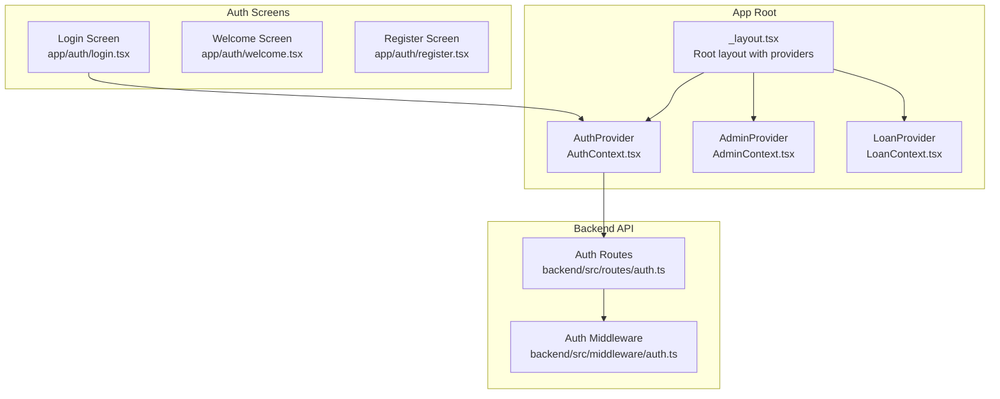
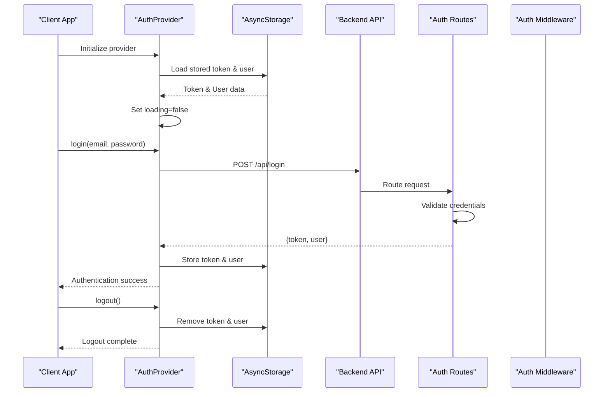
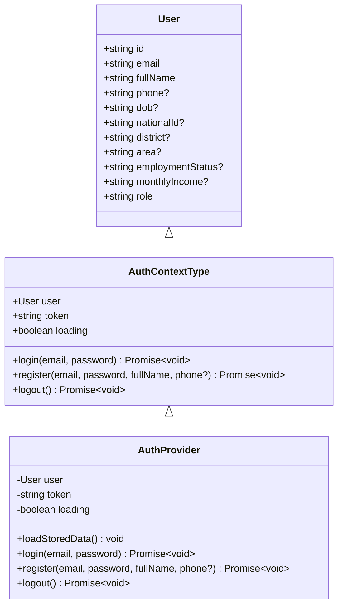
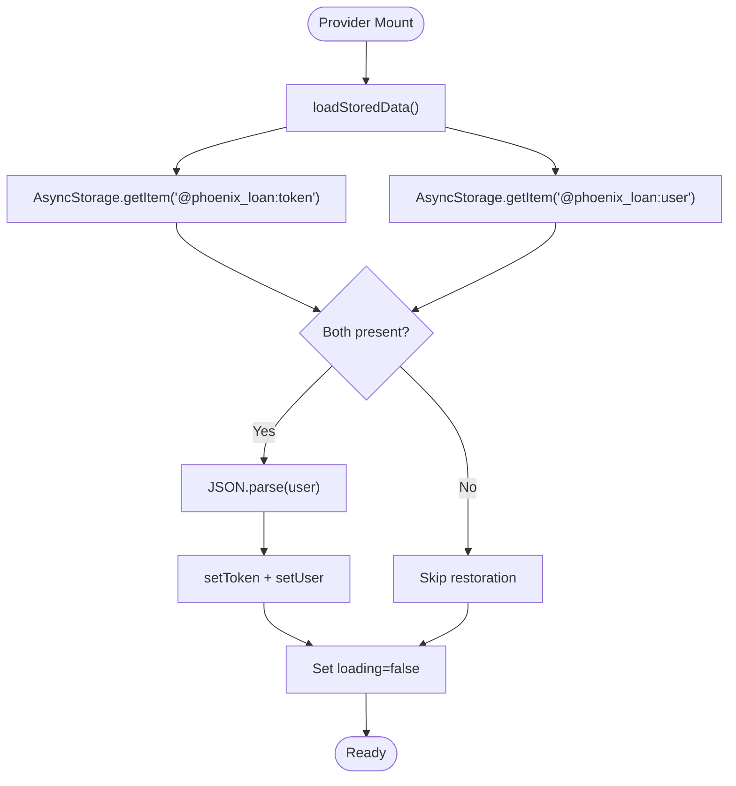
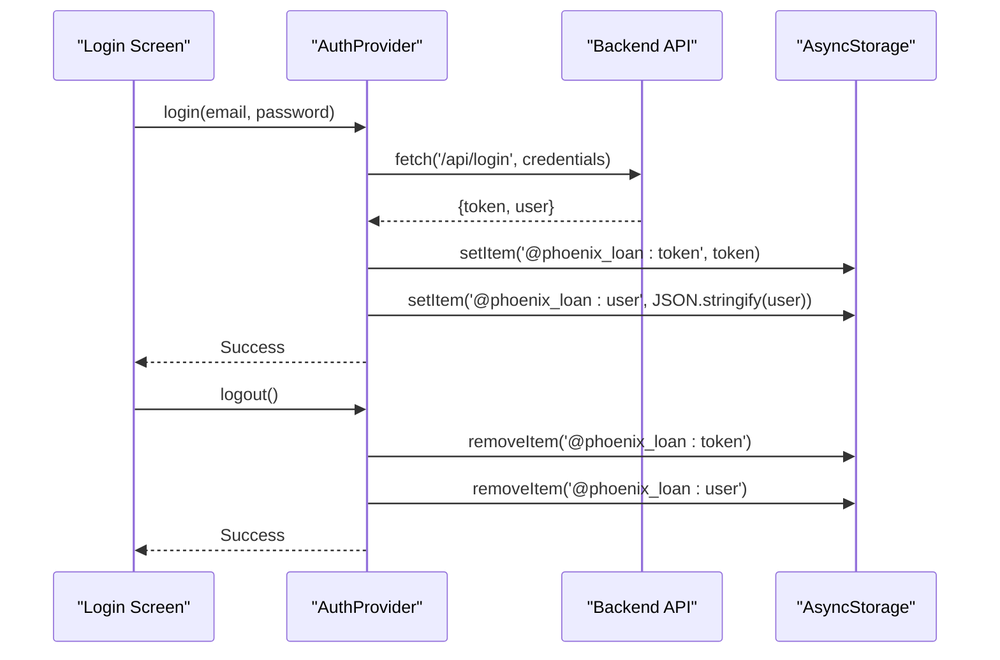
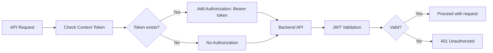
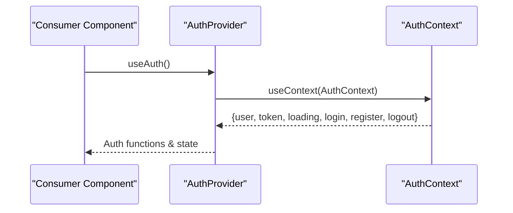
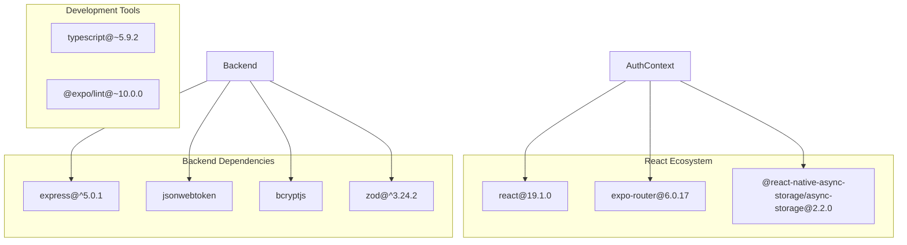

# Auth Context Provider

<cite>
**Referenced Files in This Document**
- [AuthContext.tsx](file://contexts/AuthContext.tsx)
- [login.tsx](file://app/auth/login.tsx)
- [_layout.tsx](file://app/_layout.tsx)
- [auth.ts](file://backend/src/routes/auth.ts)
- [auth.ts](file://backend/src/middleware/auth.ts)
- [package.json](file://package.json)
</cite>

## Table of Contents
1. [Introduction](#introduction)
2. [Project Structure](#project-structure)
3. [Core Components](#core-components)
4. [Architecture Overview](#architecture-overview)
5. [Detailed Component Analysis](#detailed-component-analysis)
6. [Dependency Analysis](#dependency-analysis)
7. [Performance Considerations](#performance-considerations)
8. [Troubleshooting Guide](#troubleshooting-guide)
9. [Conclusion](#conclusion)

## Introduction
This document provides comprehensive technical documentation for the AuthContext provider implementation used for authentication state management in the Phoenix Loan application. It explains the React Context pattern, user object structure, token handling, loading states, provider initialization, AsyncStorage integration for persistent storage, and the complete authentication lifecycle. It also covers error handling patterns, state synchronization between components, mobile storage mechanisms, security considerations for token storage, debugging techniques, and common initialization issues.

## Project Structure
The authentication system is organized around a React Context provider that manages user authentication state and integrates with AsyncStorage for persistence. The provider is initialized at the root level and consumed by various screens and components throughout the application.



**Diagram sources**
- [_layout.tsx:31-82](file://app/_layout.tsx#L31-L82)
- [AuthContext.tsx:31-126](file://contexts/AuthContext.tsx#L31-L126)
- [login.tsx:80-134](file://app/auth/login.tsx#L80-L134)
- [auth.ts:95-143](file://backend/src/routes/auth.ts#L95-L143)
- [auth.ts:10-36](file://backend/src/middleware/auth.ts#L10-L36)

**Section sources**
- [_layout.tsx:31-82](file://app/_layout.tsx#L31-L82)
- [AuthContext.tsx:31-126](file://contexts/AuthContext.tsx#L31-L126)

## Core Components
The authentication system centers around the AuthContext provider, which exposes user state, authentication methods, and loading indicators to consuming components.

Key aspects:
- User object structure with comprehensive profile fields
- Token-based authentication with JWT
- AsyncStorage integration for persistent storage
- Loading state management during initialization
- Error handling for authentication operations

**Section sources**
- [AuthContext.tsx:6-27](file://contexts/AuthContext.tsx#L6-L27)
- [AuthContext.tsx:31-126](file://contexts/AuthContext.tsx#L31-L126)

## Architecture Overview
The authentication architecture follows a layered approach with clear separation between frontend context management, backend API services, and middleware validation.



**Diagram sources**
- [AuthContext.tsx:36-54](file://contexts/AuthContext.tsx#L36-L54)
- [AuthContext.tsx:56-79](file://contexts/AuthContext.tsx#L56-L79)
- [AuthContext.tsx:114-119](file://contexts/AuthContext.tsx#L114-L119)
- [auth.ts:95-143](file://backend/src/routes/auth.ts#L95-L143)
- [auth.ts:10-36](file://backend/src/middleware/auth.ts#L10-L36)

## Detailed Component Analysis

### AuthContext Provider Implementation
The AuthContext provider encapsulates the complete authentication state management logic with robust error handling and persistence mechanisms.



**Diagram sources**
- [AuthContext.tsx:20-27](file://contexts/AuthContext.tsx#L20-L27)
- [AuthContext.tsx:6-18](file://contexts/AuthContext.tsx#L6-L18)
- [AuthContext.tsx:31-126](file://contexts/AuthContext.tsx#L31-L126)

#### Initialization Process
The provider performs asynchronous initialization to restore persisted authentication state:



**Diagram sources**
- [AuthContext.tsx:36-54](file://contexts/AuthContext.tsx#L36-L54)

#### Authentication Lifecycle
The authentication lifecycle encompasses login, registration, and logout operations with comprehensive error handling:



**Diagram sources**
- [AuthContext.tsx:56-79](file://contexts/AuthContext.tsx#L56-L79)
- [AuthContext.tsx:114-119](file://contexts/AuthContext.tsx#L114-L119)
- [login.tsx:101-134](file://app/auth/login.tsx#L101-L134)

**Section sources**
- [AuthContext.tsx:31-126](file://contexts/AuthContext.tsx#L31-L126)

### User Object Structure
The User interface defines a comprehensive profile structure supporting both customer and administrative roles:

```mermaid
erDiagram
USER {
string id PK
string email UK
string fullName
string phone?
string dob?
string nationalId?
string district?
string area?
string employmentStatus?
string monthlyIncome?
string role
}
PROFILE {
string userId FK
string fullName
string phone?
string dob?
string nationalId?
string district?
string area?
string employmentStatus?
string monthlyIncome?
}
USER ||--|| PROFILE : "has_profile"
```

**Diagram sources**
- [AuthContext.tsx:6-18](file://contexts/AuthContext.tsx#L6-L18)

Key user fields include:
- Basic identification (id, email, fullName)
- Contact information (phone)
- Demographic data (dob, nationalId)
- Location details (district, area)
- Employment information (employmentStatus, monthlyIncome)
- Role-based access control (role)

**Section sources**
- [AuthContext.tsx:6-18](file://contexts/AuthContext.tsx#L6-L18)

### Token Handling and Security
The authentication system implements JWT-based token management with secure storage practices:



**Diagram sources**
- [auth.ts:10-36](file://backend/src/middleware/auth.ts#L10-L36)

Security considerations include:
- JWT token verification with expiration handling
- Role-based access control
- Secure token storage using AsyncStorage
- Environment variable configuration for API URLs

**Section sources**
- [AuthContext.tsx:4](file://contexts/AuthContext.tsx#L4)
- [auth.ts:10-36](file://backend/src/middleware/auth.ts#L10-L36)

### AsyncStorage Integration
The provider integrates with AsyncStorage for persistent authentication state management:

| Storage Key | Purpose | Data Type | Expiration |
|-------------|---------|-----------|------------|
| `@phoenix_loan:token` | Authentication token | String | JWT expiration |
| `@phoenix_loan:user` | User profile data | JSON string | Synced with token |

Storage operations include:
- Asynchronous retrieval during initialization
- Immediate persistence after successful authentication
- Cleanup during logout operations

**Section sources**
- [AuthContext.tsx:42-47](file://contexts/AuthContext.tsx#L42-L47)
- [AuthContext.tsx:73-74](file://contexts/AuthContext.tsx#L73-L74)
- [AuthContext.tsx:117-118](file://contexts/AuthContext.tsx#L117-L118)

### Context Usage Examples
Components consume the AuthContext through the useAuth hook:



Common usage patterns include:
- Form validation and submission
- Conditional rendering based on authentication state
- Navigation routing based on user roles
- Loading state management during authentication operations

**Section sources**
- [AuthContext.tsx:128-134](file://contexts/AuthContext.tsx#L128-L134)
- [login.tsx:83-134](file://app/auth/login.tsx#L83-L134)

## Dependency Analysis
The authentication system relies on several key dependencies for proper operation:



**Diagram sources**
- [package.json:22-68](file://package.json#L22-L68)

Key dependencies and their roles:
- React and React Native for core framework functionality
- AsyncStorage for mobile-specific persistent storage
- Express for backend API server
- JWT for secure token-based authentication
- Bcrypt for password hashing
- Zod for runtime validation

**Section sources**
- [package.json:22-68](file://package.json#L22-L68)

## Performance Considerations
The authentication system incorporates several performance optimizations:

- **Lazy initialization**: Authentication state is loaded asynchronously during provider mount
- **Minimal re-renders**: Context state is structured to minimize unnecessary component updates
- **Efficient storage**: AsyncStorage operations are batched and optimized
- **Error boundaries**: Comprehensive error handling prevents cascading failures

Best practices for optimal performance:
- Avoid excessive context subscriptions in components
- Implement proper loading states to prevent UI blocking
- Cache frequently accessed authentication data
- Monitor AsyncStorage read/write operations

## Troubleshooting Guide

### Common Initialization Issues
1. **Provider not wrapping components**: Ensure AuthProvider is included in the root layout
2. **AsyncStorage corruption**: Implement fallback mechanisms for corrupted data
3. **Network timeouts**: Add retry logic for authentication requests
4. **Token expiration**: Implement automatic refresh mechanisms

### Debugging Techniques
1. **Console logging**: Enable detailed logging for authentication flows
2. **Network inspection**: Monitor API requests and responses
3. **State inspection**: Use React DevTools to inspect context state
4. **AsyncStorage inspection**: Verify stored token and user data integrity

### Error Handling Patterns
The system implements comprehensive error handling:
- Try-catch blocks around authentication operations
- User-friendly error messages for invalid credentials
- Graceful degradation when network requests fail
- Proper cleanup of authentication state on errors

**Section sources**
- [AuthContext.tsx:49-50](file://contexts/AuthContext.tsx#L49-L50)
- [AuthContext.tsx:75-78](file://contexts/AuthContext.tsx#L75-L78)
- [login.tsx:127-130](file://app/auth/login.tsx#L127-L130)

## Conclusion
The AuthContext provider implementation provides a robust, scalable solution for authentication state management in the Phoenix Loan application. It effectively combines React Context patterns with AsyncStorage persistence, implements comprehensive error handling, and maintains security through JWT-based token management. The modular architecture allows for easy maintenance and extension while providing reliable authentication experiences across both customer and administrative interfaces.

The implementation demonstrates best practices in modern React development, including proper state management, error handling, and performance optimization. The integration with backend services ensures secure authentication flows while maintaining responsive user experiences.