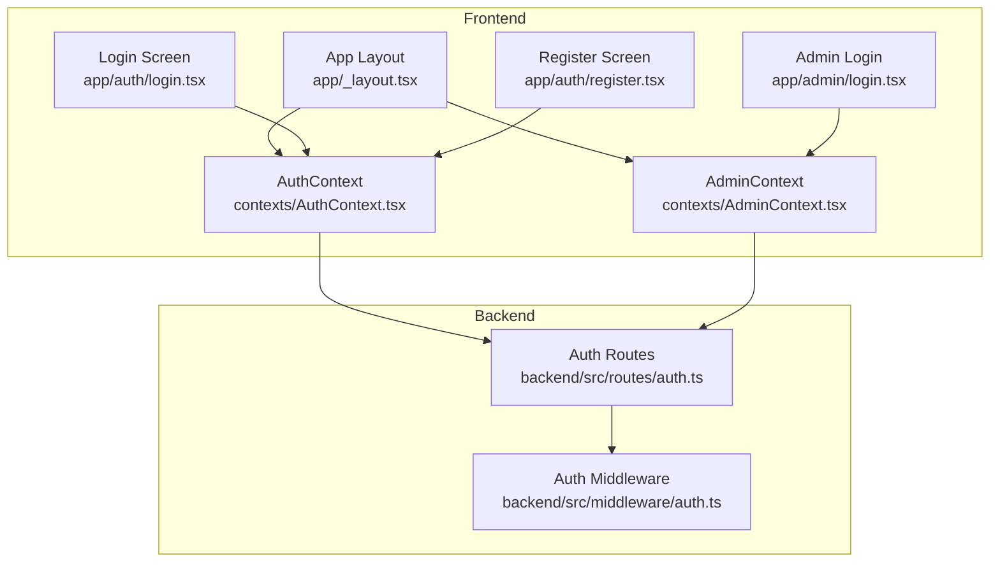
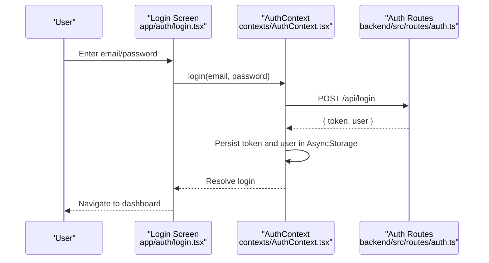
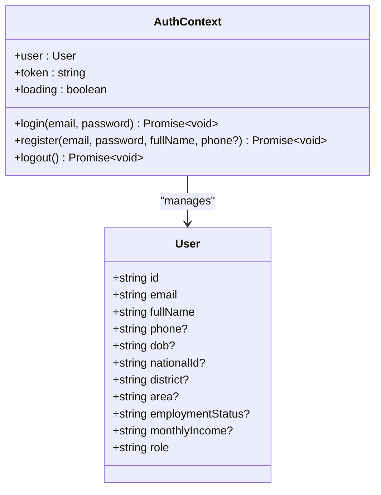
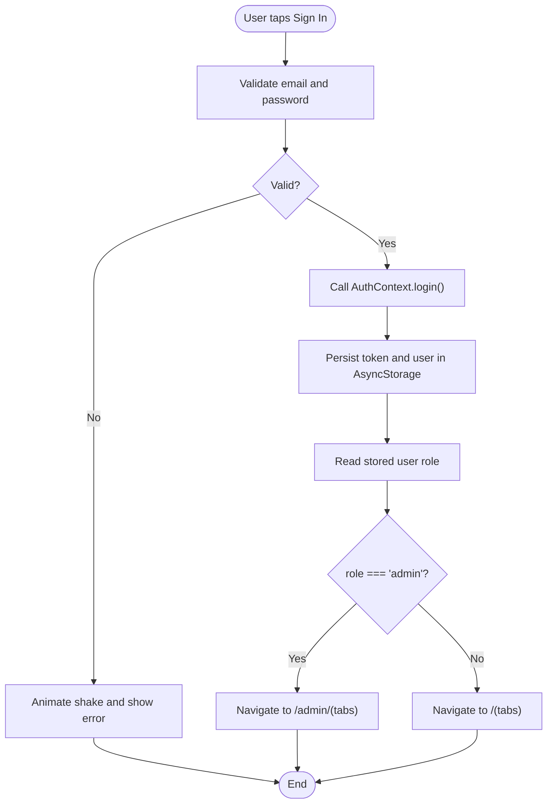
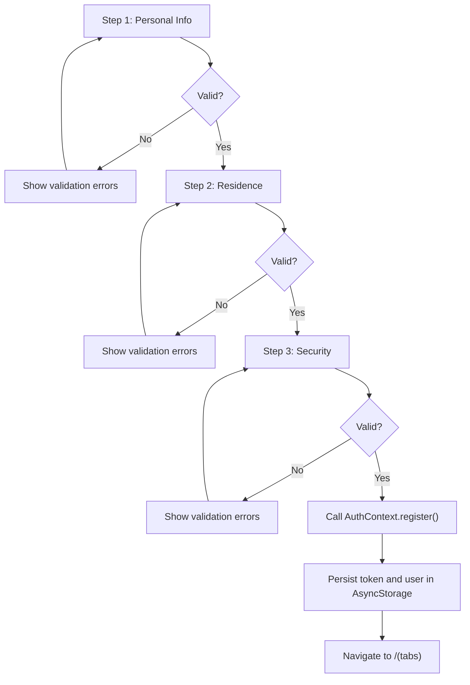
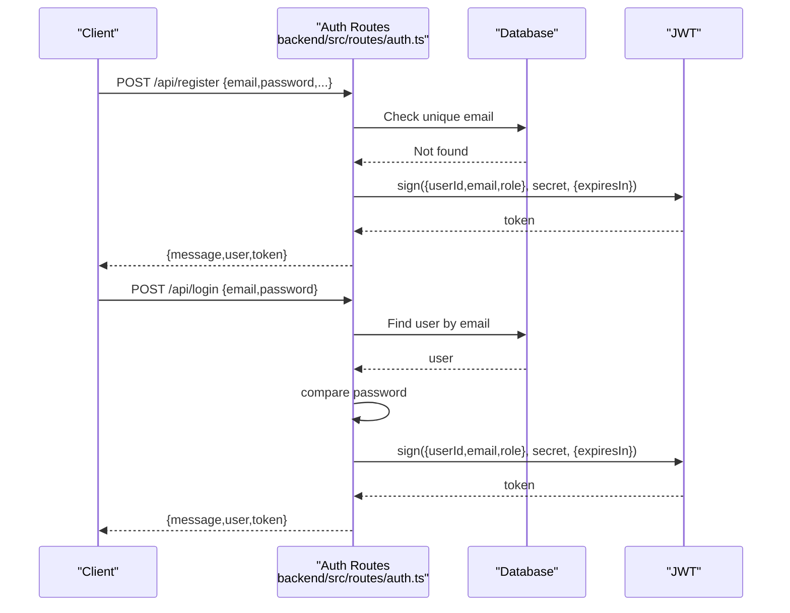
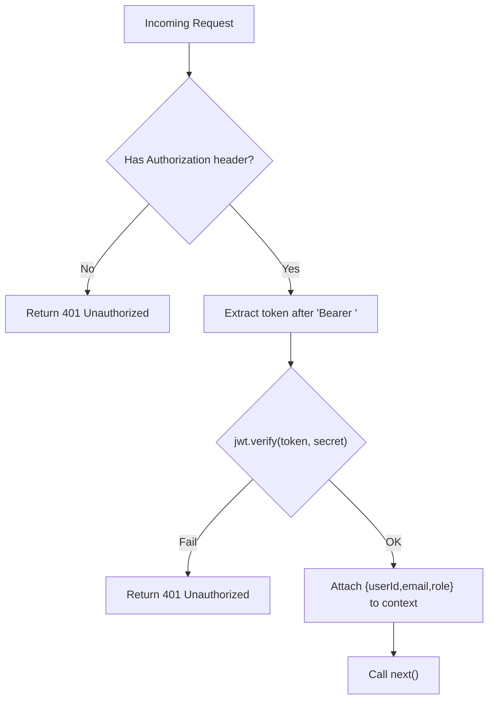
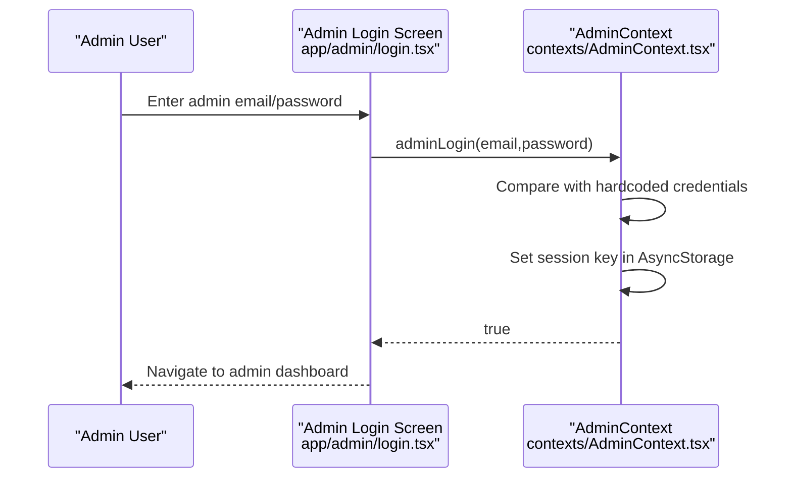
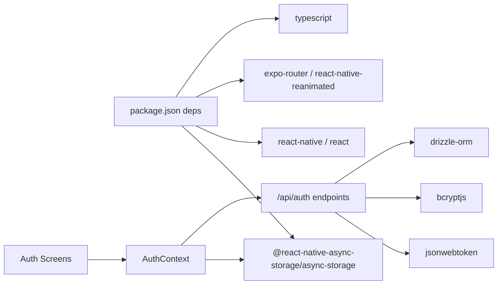

# Authentication System

<cite>
**Referenced Files in This Document**
- [AuthContext.tsx](file://contexts/AuthContext.tsx)
- [login.tsx](file://app/auth/login.tsx)
- [register.tsx](file://app/auth/register.tsx)
- [auth.ts](file://backend/src/routes/auth.ts)
- [auth.ts](file://backend/src/middleware/auth.ts)
- [app/_layout.tsx](file://app/_layout.tsx)
- [AdminContext.tsx](file://contexts/AdminContext.tsx)
- [admin/login.tsx](file://app/admin/login.tsx)
- [package.json](file://package.json)
- [query-client.ts](file://lib/query-client.ts)
</cite>

## Table of Contents
1. [Introduction](#introduction)
2. [Project Structure](#project-structure)
3. [Core Components](#core-components)
4. [Architecture Overview](#architecture-overview)
5. [Detailed Component Analysis](#detailed-component-analysis)
6. [Dependency Analysis](#dependency-analysis)
7. [Performance Considerations](#performance-considerations)
8. [Troubleshooting Guide](#troubleshooting-guide)
9. [Conclusion](#conclusion)
10. [Appendices](#appendices)

## Introduction
This document explains the authentication system for the Phoenix Loan application. It covers JWT token-based authentication, session management with persistent storage, user registration and login flows, and administrative access. It also documents the AuthContext provider, middleware authentication, secure storage practices, and backend integration. While the current implementation does not include automatic token refresh or mobile biometric authentication, this document outlines how to extend the system to support those features securely.

## Project Structure
The authentication system spans three layers:
- Frontend React Native application with React Context providers
- Backend Hono API server with JWT middleware and protected routes
- Shared AsyncStorage for session persistence

**Diagram sources**
- [app/_layout.tsx:31-82](file://app/_layout.tsx#L31-L82)
- [AuthContext.tsx:31-126](file://contexts/AuthContext.tsx#L31-L126)
- [login.tsx:80-134](file://app/auth/login.tsx#L80-L134)
- [register.tsx:178-250](file://app/auth/register.tsx#L178-L250)
- [AdminContext.tsx:135-302](file://contexts/AdminContext.tsx#L135-L302)
- [admin/login.tsx:17-59](file://app/admin/login.tsx#L17-59)
- [auth.ts:10-146](file://backend/src/routes/auth.ts#L10-L146)
- [auth.ts:10-48](file://backend/src/middleware/auth.ts#L10-L48)

**Section sources**
- [app/_layout.tsx:31-82](file://app/_layout.tsx#L31-L82)
- [AuthContext.tsx:31-126](file://contexts/AuthContext.tsx#L31-L126)
- [auth.ts:10-146](file://backend/src/routes/auth.ts#L10-L146)
- [auth.ts:10-48](file://backend/src/middleware/auth.ts#L10-L48)

## Core Components
- AuthContext: Provides user state, JWT token, login, register, and logout actions backed by AsyncStorage.
- Login and Register screens: Collect credentials, validate inputs, and call AuthContext methods.
- Backend auth routes: Handle registration and login, returning JWT tokens and sanitized user data.
- Auth middleware: Validates Authorization headers and decodes JWT claims.
- AdminContext: Manages admin sessions independently of user JWT tokens.

Key implementation references:
- Token and user persistence: [AuthContext.tsx:40-54](file://contexts/AuthContext.tsx#L40-L54), [AuthContext.tsx:70-79](file://contexts/AuthContext.tsx#L70-L79), [AuthContext.tsx:101-112](file://contexts/AuthContext.tsx#L101-L112)
- Login flow: [login.tsx:101-134](file://app/auth/login.tsx#L101-L134)
- Registration flow: [register.tsx:227-250](file://app/auth/register.tsx#L227-L250)
- Backend login: [auth.ts:95-143](file://backend/src/routes/auth.ts#L95-L143)
- Backend register: [auth.ts:32-93](file://backend/src/routes/auth.ts#L32-L93)
- Middleware: [auth.ts:10-48](file://backend/src/middleware/auth.ts#L10-L48)
- Admin session: [AdminContext.tsx:135-162](file://contexts/AdminContext.tsx#L135-L162), [AdminContext.tsx:287-295](file://contexts/AdminContext.tsx#L287-L295)

**Section sources**
- [AuthContext.tsx:40-119](file://contexts/AuthContext.tsx#L40-L119)
- [login.tsx:101-134](file://app/auth/login.tsx#L101-L134)
- [register.tsx:227-250](file://app/auth/register.tsx#L227-L250)
- [auth.ts:32-143](file://backend/src/routes/auth.ts#L32-L143)
- [auth.ts:10-48](file://backend/src/middleware/auth.ts#L10-L48)
- [AdminContext.tsx:135-295](file://contexts/AdminContext.tsx#L135-L295)

## Architecture Overview
The authentication architecture follows a standard JWT pattern:
- Clients send credentials to backend endpoints.
- Backend validates credentials and returns a signed JWT.
- Client stores the token and uses it for subsequent requests.
- Middleware verifies tokens on protected routes.

**Diagram sources**
- [login.tsx:101-134](file://app/auth/login.tsx#L101-L134)
- [AuthContext.tsx:56-79](file://contexts/AuthContext.tsx#L56-L79)
- [auth.ts:95-143](file://backend/src/routes/auth.ts#L95-L143)

**Section sources**
- [login.tsx:101-134](file://app/auth/login.tsx#L101-L134)
- [AuthContext.tsx:56-79](file://contexts/AuthContext.tsx#L56-L79)
- [auth.ts:95-143](file://backend/src/routes/auth.ts#L95-L143)

## Detailed Component Analysis

### AuthContext Provider
AuthContext manages:
- Loading persisted session on startup
- Login and registration requests
- Token and user state updates
- Logout cleanup

**Diagram sources**
- [AuthContext.tsx:6-27](file://contexts/AuthContext.tsx#L6-L27)
- [AuthContext.tsx:31-126](file://contexts/AuthContext.tsx#L31-L126)

Key behaviors:
- Load stored token and user on mount: [AuthContext.tsx:40-54](file://contexts/AuthContext.tsx#L40-L54)
- Login posts credentials and persists token/user: [AuthContext.tsx:56-79](file://contexts/AuthContext.tsx#L56-L79)
- Registration posts user data and persists token/user: [AuthContext.tsx:81-112](file://contexts/AuthContext.tsx#L81-L112)
- Logout removes persisted token/user: [AuthContext.tsx:114-119](file://contexts/AuthContext.tsx#L114-L119)

**Section sources**
- [AuthContext.tsx:40-119](file://contexts/AuthContext.tsx#L40-L119)

### Login Process
The login screen validates inputs, calls AuthContext.login, and navigates based on user role.

**Diagram sources**
- [login.tsx:93-134](file://app/auth/login.tsx#L93-L134)
- [AuthContext.tsx:56-79](file://contexts/AuthContext.tsx#L56-L79)

**Section sources**
- [login.tsx:93-134](file://app/auth/login.tsx#L93-L134)
- [AuthContext.tsx:56-79](file://contexts/AuthContext.tsx#L56-L79)

### Registration Workflow
The registration screen collects KYC details across steps, validates inputs, and calls AuthContext.register.

**Diagram sources**
- [register.tsx:198-250](file://app/auth/register.tsx#L198-L250)
- [AuthContext.tsx:81-112](file://contexts/AuthContext.tsx#L81-L112)

**Section sources**
- [register.tsx:198-250](file://app/auth/register.tsx#L198-L250)
- [AuthContext.tsx:81-112](file://contexts/AuthContext.tsx#L81-L112)

### Backend Authentication Endpoints
- POST /api/register: Validates input, checks uniqueness, hashes password, inserts user, signs JWT, returns token and user.
- POST /api/login: Finds user by email, compares password, signs JWT, returns token and user.

**Diagram sources**
- [auth.ts:32-93](file://backend/src/routes/auth.ts#L32-L93)
- [auth.ts:95-143](file://backend/src/routes/auth.ts#L95-L143)

**Section sources**
- [auth.ts:32-93](file://backend/src/routes/auth.ts#L32-L93)
- [auth.ts:95-143](file://backend/src/routes/auth.ts#L95-L143)

### Middleware Authentication
The auth middleware extracts the Authorization header, verifies the JWT, and attaches user claims to the request context. Admin middleware enforces role-based access.

**Diagram sources**
- [auth.ts:10-48](file://backend/src/middleware/auth.ts#L10-L48)

**Section sources**
- [auth.ts:10-48](file://backend/src/middleware/auth.ts#L10-L48)

### Session Management and Secure Storage
- AsyncStorage keys:
  - @phoenix_loan:token (JWT)
  - @phoenix_loan:user (user object)
- On logout, both keys are removed.
- Admin sessions use a separate key @phoenix_admin_session.

References:
- Load stored data: [AuthContext.tsx:40-54](file://contexts/AuthContext.tsx#L40-L54)
- Persist token/user on login/register: [AuthContext.tsx:70-79](file://contexts/AuthContext.tsx#L70-L79), [AuthContext.tsx:101-112](file://contexts/AuthContext.tsx#L101-L112)
- Remove on logout: [AuthContext.tsx:114-119](file://contexts/AuthContext.tsx#L114-L119)
- Admin session: [AdminContext.tsx:150-162](file://contexts/AdminContext.tsx#L150-L162), [AdminContext.tsx:287-295](file://contexts/AdminContext.tsx#L287-L295)

**Section sources**
- [AuthContext.tsx:40-119](file://contexts/AuthContext.tsx#L40-L119)
- [AdminContext.tsx:150-295](file://contexts/AdminContext.tsx#L150-L295)

### Administrative Access
Admin login bypasses JWT and uses hardcoded credentials. Sessions are persisted in AsyncStorage.

**Diagram sources**
- [admin/login.tsx:42-59](file://app/admin/login.tsx#L42-L59)
- [AdminContext.tsx:287-295](file://contexts/AdminContext.tsx#L287-L295)

**Section sources**
- [admin/login.tsx:42-59](file://app/admin/login.tsx#L42-L59)
- [AdminContext.tsx:287-295](file://contexts/AdminContext.tsx#L287-L295)

### Password Reset Procedures
There is no explicit password reset flow in the current codebase. The admin panel includes a route to update a user’s password, but no frontend UI or backend endpoint for user-initiated resets is present.

References:
- Admin user password update call: [admin/users.tsx:321-335](file://app/admin/(tabs)/users.tsx#L321-L335)

**Section sources**
- [admin/users.tsx:321-335](file://app/admin/(tabs)/users.tsx#L321-L335)

### Biometric Authentication Support
There is no biometric authentication implementation in the current codebase. The profile screen UI includes a “Biometric Login” setting switch, but no integration with mobile biometric APIs is implemented.

References:
- Biometric setting UI: [profile.tsx:332-341](file://app/(tabs)/profile.tsx#L332-L341)
- Device features and permissions guide: [device_features_and_permissions.md](file://.local/skills/expo/references/device_features_and_permissions.md#L27)

**Section sources**
- [profile.tsx:332-341](file://app/(tabs)/profile.tsx#L332-L341)
- [device_features_and_permissions.md:27](file://.local/skills/expo/references/device_features_and_permissions.md#L27)

## Dependency Analysis
- Frontend depends on AsyncStorage for persistence and on backend endpoints for authentication.
- Backend depends on JWT for token signing/verification and on database for user lookup.
- AdminContext is independent of JWT and uses a simple credential check.

**Diagram sources**
- [package.json:22-68](file://package.json#L22-L68)
- [AuthContext.tsx:1-2](file://contexts/AuthContext.tsx#L1-L2)
- [auth.ts:1-8](file://backend/src/routes/auth.ts#L1-L8)

**Section sources**
- [package.json:22-68](file://package.json#L22-L68)
- [AuthContext.tsx:1-2](file://contexts/AuthContext.tsx#L1-L2)
- [auth.ts:1-8](file://backend/src/routes/auth.ts#L1-L8)

## Performance Considerations
- Token lifetime: Current backend sets token expiry to seven days. Consider shorter expirations with refresh mechanisms for improved security.
- Network calls: Batch and deduplicate requests; avoid redundant fetches during navigation.
- UI responsiveness: Keep async operations off the main thread; animations and haptics should be lightweight.
- Storage: AsyncStorage is synchronous; keep payloads small and avoid frequent writes.

## Troubleshooting Guide
Common issues and resolutions:
- Login fails with invalid credentials:
  - Verify email exists and password matches hash on backend.
  - Check frontend error handling and alert messages.
  - References: [auth.ts:108-120](file://backend/src/routes/auth.ts#L108-L120), [login.tsx:127-133](file://app/auth/login.tsx#L127-L133)
- Registration fails due to duplicate email:
  - Ensure uniqueness check passes before insertion.
  - Reference: [auth.ts:42-44](file://backend/src/routes/auth.ts#L42-L44)
- Token not found or expired:
  - Confirm Authorization header includes "Bearer " prefix.
  - Verify JWT_SECRET environment variable is set on backend.
  - Reference: [auth.ts:14-16](file://backend/src/middleware/auth.ts#L14-L16)
- Admin login not persisting:
  - Confirm AsyncStorage key @phoenix_admin_session is set and read correctly.
  - Reference: [AdminContext.tsx:150-162](file://contexts/AdminContext.tsx#L150-L162)
- AsyncStorage errors:
  - Wrap reads/writes in try/catch and provide fallbacks.
  - Reference: [AuthContext.tsx:49-50](file://contexts/AuthContext.tsx#L49-L50), [AdminContext.tsx:266-284](file://contexts/AdminContext.tsx#L266-L284)

**Section sources**
- [auth.ts:42-120](file://backend/src/routes/auth.ts#L42-L120)
- [login.tsx:127-133](file://app/auth/login.tsx#L127-L133)
- [auth.ts:14-16](file://backend/src/middleware/auth.ts#L14-L16)
- [AdminContext.tsx:150-162](file://contexts/AdminContext.tsx#L150-L162)
- [AuthContext.tsx:49-50](file://contexts/AuthContext.tsx#L49-L50)
- [AdminContext.tsx:266-284](file://contexts/AdminContext.tsx#L266-L284)

## Conclusion
The Phoenix Loan application implements a robust JWT-based authentication system with secure storage via AsyncStorage and a clear separation between user and admin access. While automatic token refresh and biometric authentication are not currently implemented, the architecture supports straightforward extensions to these features. The backend middleware ensures consistent protection of routes, and the frontend provides intuitive login and registration experiences.

## Appendices

### API Definitions
- POST /api/register
  - Body: { email, password, fullName, phone?, dob?, nationalId?, district?, area?, employmentStatus?, monthlyIncome? }
  - Success: 201 { message, user, token }
  - Errors: 400 (duplicate email), 500 (internal error)
  - Reference: [auth.ts:32-93](file://backend/src/routes/auth.ts#L32-L93)

- POST /api/login
  - Body: { email, password }
  - Success: 200 { message, user, token }
  - Errors: 401 (invalid credentials), 500 (internal error)
  - Reference: [auth.ts:95-143](file://backend/src/routes/auth.ts#L95-L143)

- Middleware
  - Header: Authorization: Bearer <token>
  - Success: Attaches { userId, email, role } to context
  - Errors: 401 (missing/invalid token), 500 (server error)
  - Reference: [auth.ts:10-48](file://backend/src/middleware/auth.ts#L10-L48)

### Environment Variables
- JWT_SECRET: Secret key for signing JWTs on backend.
- EXPO_PUBLIC_API_URL: Base URL for API requests from frontend.
- EXPO_PUBLIC_DOMAIN: Used by query client to construct API URLs.

References:
- Backend routes use JWT_SECRET: [auth.ts:72](file://backend/src/routes/auth.ts#L72)
- Frontend AuthContext uses EXPO_PUBLIC_API_URL: [AuthContext.tsx:4](file://contexts/AuthContext.tsx#L4)
- Query client uses EXPO_PUBLIC_DOMAIN: [query-client.ts:8-18](file://lib/query-client.ts#L8-L18)