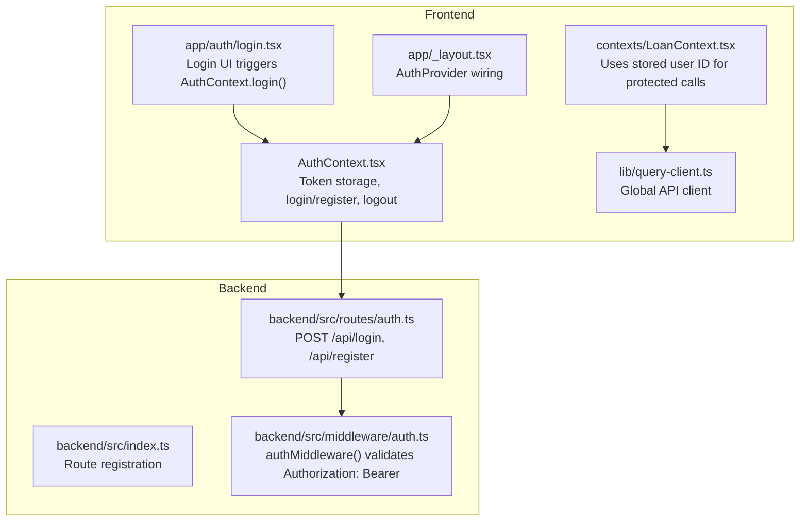
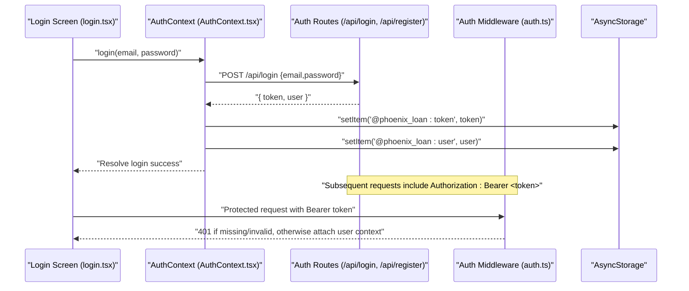
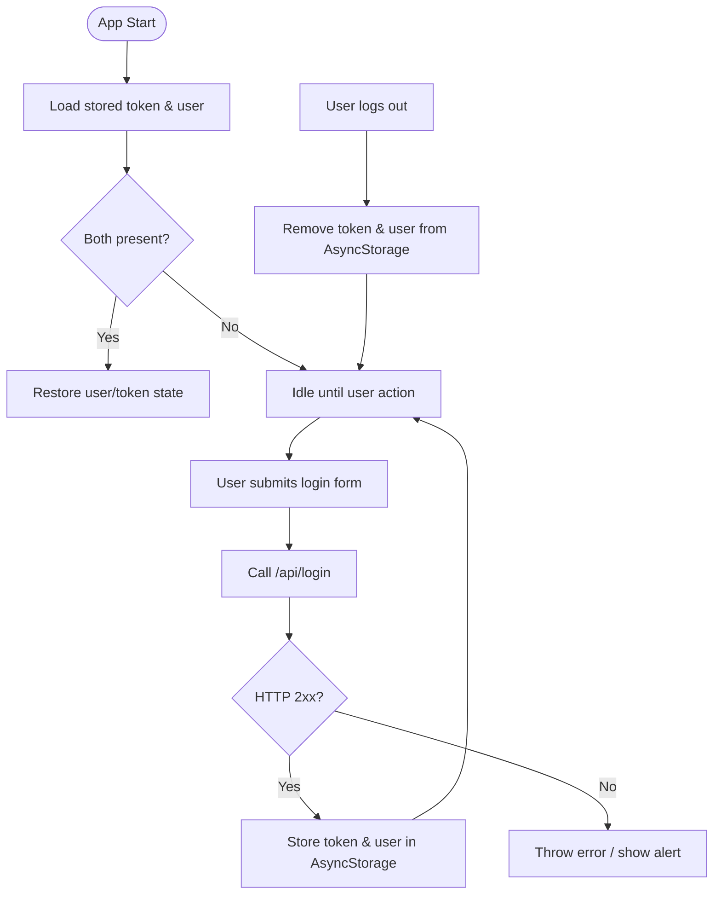
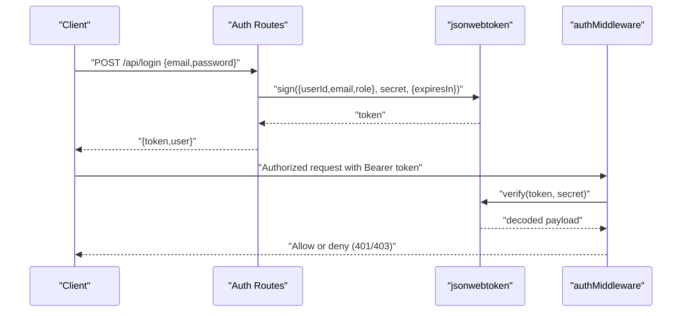
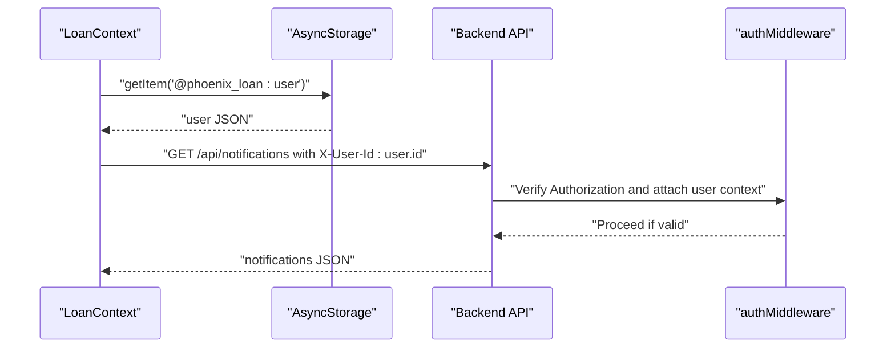
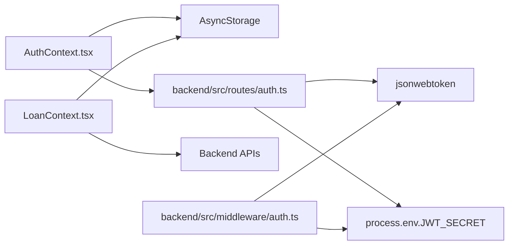

# JWT Token Management

<cite>
**Referenced Files in This Document**
- [AuthContext.tsx](file://contexts/AuthContext.tsx)
- [login.tsx](file://app/auth/login.tsx)
- [auth.ts](file://backend/src/routes/auth.ts)
- [auth.ts](file://backend/src/middleware/auth.ts)
- [index.ts](file://backend/src/index.ts)
- [LoanContext.tsx](file://contexts/LoanContext.tsx)
- [query-client.ts](file://lib/query-client.ts)
- [app/_layout.tsx](file://app/_layout.tsx)
</cite>

## Table of Contents
1. [Introduction](#introduction)
2. [Project Structure](#project-structure)
3. [Core Components](#core-components)
4. [Architecture Overview](#architecture-overview)
5. [Detailed Component Analysis](#detailed-component-analysis)
6. [Dependency Analysis](#dependency-analysis)
7. [Performance Considerations](#performance-considerations)
8. [Troubleshooting Guide](#troubleshooting-guide)
9. [Conclusion](#conclusion)

## Introduction
This document explains the JWT token management implementation across the frontend and backend systems. It covers token generation during authentication, validation performed by backend middleware, secure storage using AsyncStorage on the frontend, automatic cleanup on logout, and practical patterns for including tokens in API requests. It also outlines the relationship between frontend token handling and backend authentication middleware, validation patterns, and security considerations, along with debugging techniques and common issues.

## Project Structure
The token lifecycle spans three primary areas:
- Frontend authentication provider and screens that trigger login/register and persist tokens
- Backend authentication routes that issue JWTs and middleware that validates them
- Supporting contexts and utilities that consume tokens for protected API calls

**Diagram sources**
- [AuthContext.tsx:1-135](file://contexts/AuthContext.tsx#L1-L135)
- [login.tsx:1-314](file://app/auth/login.tsx#L1-L314)
- [LoanContext.tsx:1-336](file://contexts/LoanContext.tsx#L1-L336)
- [query-client.ts:1-80](file://lib/query-client.ts#L1-L80)
- [app/_layout.tsx:1-83](file://app/_layout.tsx#L1-L83)
- [backend/src/index.ts:1-76](file://backend/src/index.ts#L1-L76)
- [backend/src/routes/auth.ts:1-146](file://backend/src/routes/auth.ts#L1-L146)
- [backend/src/middleware/auth.ts:1-48](file://backend/src/middleware/auth.ts#L1-L48)

**Section sources**
- [AuthContext.tsx:1-135](file://contexts/AuthContext.tsx#L1-L135)
- [login.tsx:1-314](file://app/auth/login.tsx#L1-L314)
- [LoanContext.tsx:1-336](file://contexts/LoanContext.tsx#L1-L336)
- [query-client.ts:1-80](file://lib/query-client.ts#L1-L80)
- [app/_layout.tsx:1-83](file://app/_layout.tsx#L1-L83)
- [backend/src/index.ts:1-76](file://backend/src/index.ts#L1-L76)
- [backend/src/routes/auth.ts:1-146](file://backend/src/routes/auth.ts#L1-L146)
- [backend/src/middleware/auth.ts:1-48](file://backend/src/middleware/auth.ts#L1-L48)

## Core Components
- Frontend AuthContext: Manages user state, JWT storage, login/register, and logout. Tokens are persisted to AsyncStorage and cleared on logout.
- Backend Authentication Routes: Issue signed JWTs with a defined TTL and return both user and token to the client.
- Backend Auth Middleware: Extracts the Authorization header, verifies the JWT signature, and attaches user claims to the request context.
- Protected API Consumers: Use stored user identity to call backend endpoints that require authenticated access.

Key token behaviors:
- Storage: AsyncStorage keys for token and user are used consistently across login/register and logout.
- Expiration: JWTs are issued with an expiration period by the backend; the frontend does not currently implement pre-expiration checks.
- Cleanup: Logout removes both token and user from AsyncStorage.

**Section sources**
- [AuthContext.tsx:40-119](file://contexts/AuthContext.tsx#L40-L119)
- [auth.ts:69-127](file://backend/src/routes/auth.ts#L69-L127)
- [auth.ts:10-36](file://backend/src/middleware/auth.ts#L10-L36)
- [LoanContext.tsx:95-159](file://contexts/LoanContext.tsx#L95-L159)

## Architecture Overview
The authentication flow connects frontend and backend through a standardized JWT mechanism.

**Diagram sources**
- [login.tsx:101-134](file://app/auth/login.tsx#L101-L134)
- [AuthContext.tsx:56-79](file://contexts/AuthContext.tsx#L56-L79)
- [auth.ts:95-143](file://backend/src/routes/auth.ts#L95-L143)
- [auth.ts:10-36](file://backend/src/middleware/auth.ts#L10-L36)

## Detailed Component Analysis

### Frontend Token Storage and Lifecycle
- Storage keys: The frontend persists the JWT and user object under dedicated AsyncStorage keys.
- Load on startup: On app initialization, the provider reads stored token and user to restore session.
- Login/Register: On success, the returned token and user are stored.
- Logout: Clears both token and user from storage.

**Diagram sources**
- [AuthContext.tsx:40-54](file://contexts/AuthContext.tsx#L40-L54)
- [AuthContext.tsx:56-119](file://contexts/AuthContext.tsx#L56-L119)
- [login.tsx:101-134](file://app/auth/login.tsx#L101-L134)

**Section sources**
- [AuthContext.tsx:40-119](file://contexts/AuthContext.tsx#L40-L119)
- [login.tsx:101-134](file://app/auth/login.tsx#L101-L134)

### Backend JWT Generation and Validation
- Generation: The backend signs a JWT containing user identity and role with an expiration period and returns it to the client alongside user data.
- Validation: The middleware extracts the Authorization header, verifies the token against the configured secret, and attaches user claims to the request context for downstream handlers.

**Diagram sources**
- [auth.ts:69-127](file://backend/src/routes/auth.ts#L69-L127)
- [auth.ts:10-36](file://backend/src/middleware/auth.ts#L10-L36)

**Section sources**
- [auth.ts:69-127](file://backend/src/routes/auth.ts#L69-L127)
- [auth.ts:10-36](file://backend/src/middleware/auth.ts#L10-L36)

### Protected API Calls and Token Usage
- Protected endpoints: The frontend uses stored user identity to call backend endpoints that require authenticated access.
- Header pattern: Requests include the stored user ID in a custom header to identify the requester on the backend.
- Global client: A centralized API client handles base URL construction and response validation.

**Diagram sources**
- [LoanContext.tsx:95-159](file://contexts/LoanContext.tsx#L95-L159)
- [auth.ts:10-36](file://backend/src/middleware/auth.ts#L10-L36)

**Section sources**
- [LoanContext.tsx:95-159](file://contexts/LoanContext.tsx#L95-L159)
- [auth.ts:10-36](file://backend/src/middleware/auth.ts#L10-L36)

### Token Expiration Handling
- Backend sets expiration: JWTs are issued with an expiration period by the backend.
- Frontend behavior: There is no explicit pre-expiration refresh mechanism in the current implementation. Requests may fail with 401 when tokens expire, requiring re-authentication.

Recommendations:
- Implement a token refresh flow: On receiving 401 responses, attempt silent refresh or redirect to login.
- Add token expiry checks: Parse token exp claim and proactively prompt re-login before expiry.

**Section sources**
- [auth.ts:69-127](file://backend/src/routes/auth.ts#L69-L127)
- [LoanContext.tsx:132-158](file://contexts/LoanContext.tsx#L132-L158)

### Security Considerations
- Secret management: Ensure the JWT signing secret is securely configured in environment variables on the backend.
- Transport security: Use HTTPS in production to protect tokens in transit.
- Header hygiene: The middleware strictly requires the Authorization header with the Bearer scheme; malformed or missing tokens are rejected.
- Client-side storage: AsyncStorage is used for tokens; consider platform-specific secure storage options for production-grade apps.

**Section sources**
- [auth.ts:10-36](file://backend/src/middleware/auth.ts#L10-L36)
- [AuthContext.tsx:42-47](file://contexts/AuthContext.tsx#L42-L47)

## Dependency Analysis
- AuthContext depends on AsyncStorage for persistence and on backend auth endpoints for issuing tokens.
- LoanContext depends on AsyncStorage to retrieve the stored user and on the backend for protected endpoints.
- Backend routes depend on jsonwebtoken for signing and on environment variables for secrets.
- Backend middleware depends on jsonwebtoken for verification and enforces Authorization header parsing.

**Diagram sources**
- [AuthContext.tsx:1-135](file://contexts/AuthContext.tsx#L1-L135)
- [LoanContext.tsx:1-336](file://contexts/LoanContext.tsx#L1-L336)
- [auth.ts:1-146](file://backend/src/routes/auth.ts#L1-L146)
- [auth.ts:1-48](file://backend/src/middleware/auth.ts#L1-L48)

**Section sources**
- [AuthContext.tsx:1-135](file://contexts/AuthContext.tsx#L1-L135)
- [LoanContext.tsx:1-336](file://contexts/LoanContext.tsx#L1-L336)
- [auth.ts:1-146](file://backend/src/routes/auth.ts#L1-L146)
- [auth.ts:1-48](file://backend/src/middleware/auth.ts#L1-L48)

## Performance Considerations
- Minimize redundant network calls: Persist user and token to avoid repeated login attempts.
- Batched data loads: Use caching and local storage to reduce repeated backend calls for notifications and loan data.
- Avoid unnecessary re-renders: Memoize derived values in contexts to prevent excessive recomputation.

[No sources needed since this section provides general guidance]

## Troubleshooting Guide
Common issues and debugging techniques:
- Missing Authorization header: Ensure requests include the Authorization header with the Bearer scheme; otherwise, the middleware returns 401.
- Invalid token: If token verification fails, the middleware returns 401; confirm the JWT secret and token issuer.
- Token not persisted: After login/register, verify AsyncStorage keys are set; on logout, confirm they are removed.
- 401 responses in protected endpoints: Confirm the stored user ID is included in the appropriate header for backend identification.
- Environment variables: Ensure the JWT secret is configured in the backend environment.

**Section sources**
- [auth.ts:10-36](file://backend/src/middleware/auth.ts#L10-L36)
- [AuthContext.tsx:40-119](file://contexts/AuthContext.tsx#L40-L119)
- [LoanContext.tsx:95-159](file://contexts/LoanContext.tsx#L95-L159)

## Conclusion
The system implements a straightforward JWT-based authentication flow with clear separation between frontend token storage and backend validation. Tokens are generated on login/register, persisted securely on the device, and validated centrally by middleware. While the current implementation focuses on basic token issuance and validation, adding proactive token refresh and stricter client-side expiration handling would further improve resilience and user experience.