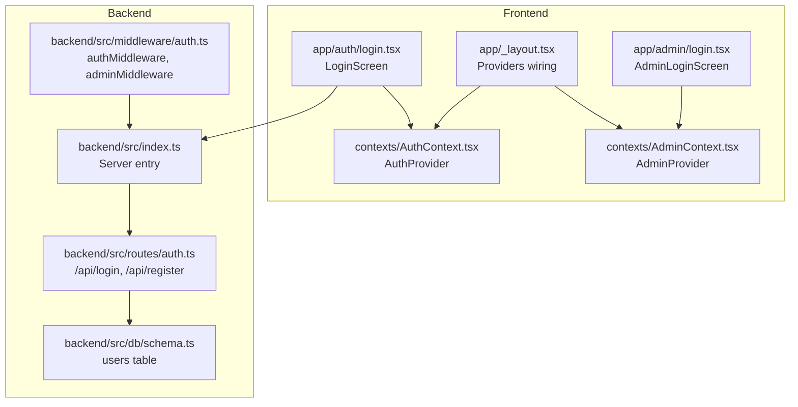
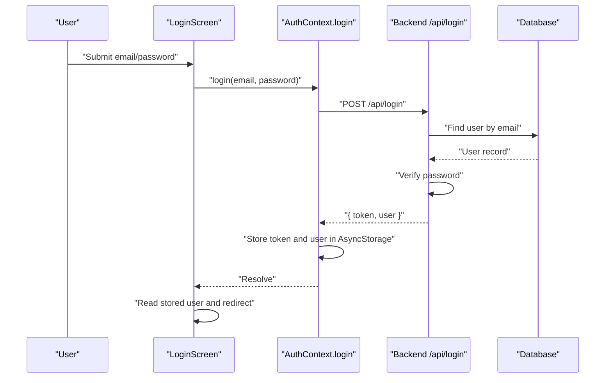
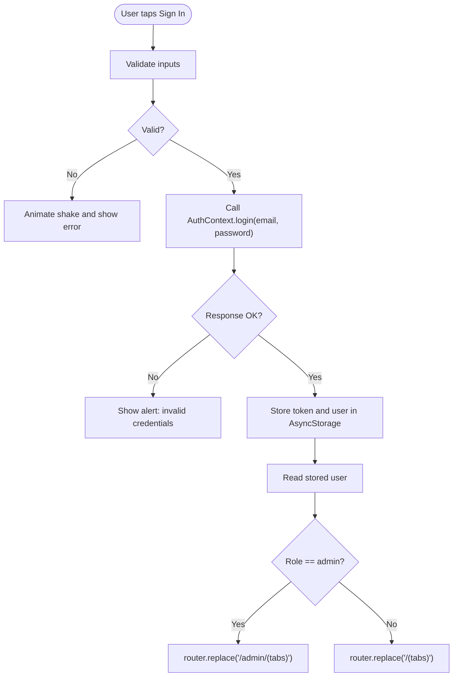
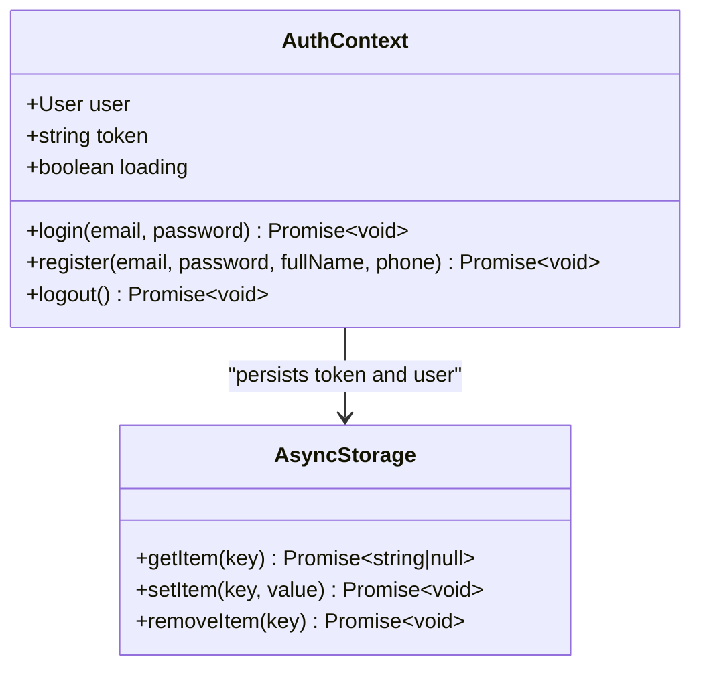
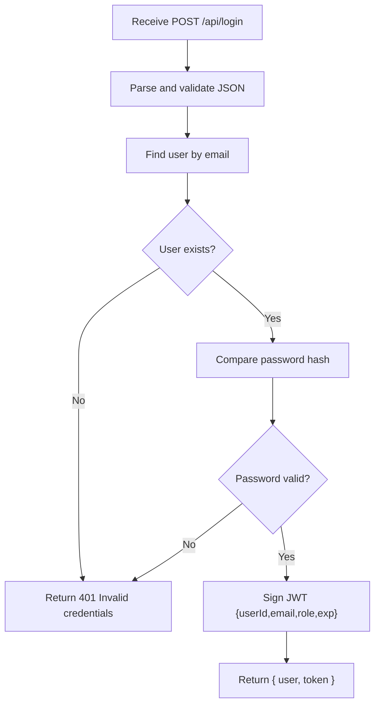
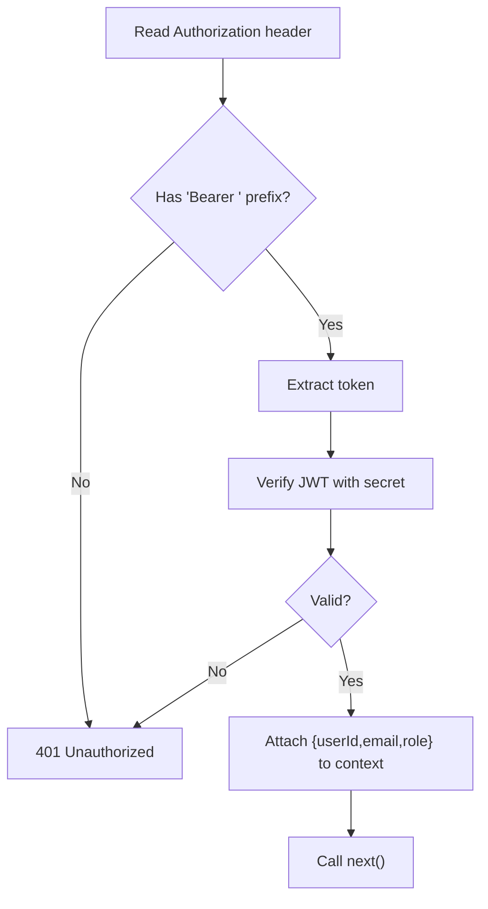
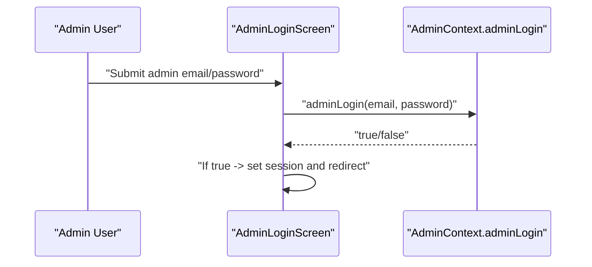
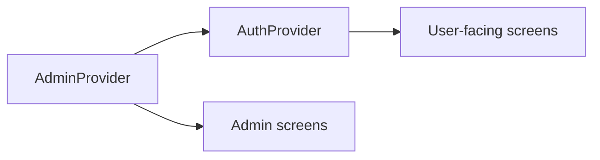
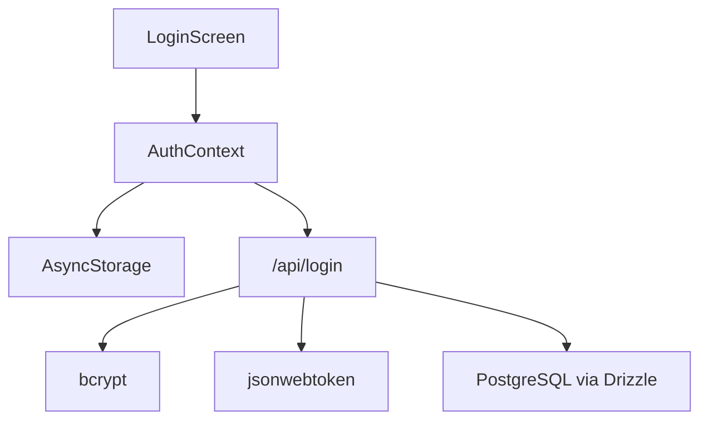

# Login Process

<cite>
**Referenced Files in This Document**
- [app/_layout.tsx](file://app/_layout.tsx)
- [app/auth/login.tsx](file://app/auth/login.tsx)
- [contexts/AuthContext.tsx](file://contexts/AuthContext.tsx)
- [backend/src/routes/auth.ts](file://backend/src/routes/auth.ts)
- [backend/src/middleware/auth.ts](file://backend/src/middleware/auth.ts)
- [backend/src/index.ts](file://backend/src/index.ts)
- [backend/src/db/schema.ts](file://backend/src/db/schema.ts)
- [app/admin/login.tsx](file://app/admin/login.tsx)
- [contexts/AdminContext.tsx](file://contexts/AdminContext.tsx)
- [components/ErrorBoundary.tsx](file://components/ErrorBoundary.tsx)
</cite>

## Table of Contents
1. [Introduction](#introduction)
2. [Project Structure](#project-structure)
3. [Core Components](#core-components)
4. [Architecture Overview](#architecture-overview)
5. [Detailed Component Analysis](#detailed-component-analysis)
6. [Dependency Analysis](#dependency-analysis)
7. [Performance Considerations](#performance-considerations)
8. [Troubleshooting Guide](#troubleshooting-guide)
9. [Conclusion](#conclusion)

## Introduction
This document explains the complete login process for the Phoenix Loan application, covering frontend form handling, API integration, backend validation, token handling, session establishment, and redirect flows. It also documents the relationship between the login component and the AuthContext provider, token storage mechanisms, and how redirects are determined based on user roles. Security considerations, common login issues, and user experience optimizations are included to help developers and operators maintain a robust and user-friendly authentication flow.

## Project Structure
The login flow spans three layers:
- Frontend screens and providers: user-facing login screen, AuthContext provider, and AdminContext provider
- Backend API: authentication routes and middleware for JWT verification
- Database: user records and role fields

**Diagram sources**
- [app/auth/login.tsx:1-314](file://app/auth/login.tsx#L1-L314)
- [contexts/AuthContext.tsx:1-135](file://contexts/AuthContext.tsx#L1-L135)
- [app/_layout.tsx:1-83](file://app/_layout.tsx#L1-L83)
- [contexts/AdminContext.tsx:1-528](file://contexts/AdminContext.tsx#L1-L528)
- [app/admin/login.tsx:1-306](file://app/admin/login.tsx#L1-L306)
- [backend/src/index.ts:1-76](file://backend/src/index.ts#L1-L76)
- [backend/src/routes/auth.ts:1-146](file://backend/src/routes/auth.ts#L1-L146)
- [backend/src/middleware/auth.ts:1-48](file://backend/src/middleware/auth.ts#L1-L48)
- [backend/src/db/schema.ts:1-146](file://backend/src/db/schema.ts#L1-L146)

**Section sources**
- [app/_layout.tsx:1-83](file://app/_layout.tsx#L1-L83)
- [contexts/AuthContext.tsx:1-135](file://contexts/AuthContext.tsx#L1-L135)
- [contexts/AdminContext.tsx:1-528](file://contexts/AdminContext.tsx#L1-L528)
- [app/auth/login.tsx:1-314](file://app/auth/login.tsx#L1-L314)
- [app/admin/login.tsx:1-306](file://app/admin/login.tsx#L1-L306)
- [backend/src/index.ts:1-76](file://backend/src/index.ts#L1-L76)
- [backend/src/routes/auth.ts:1-146](file://backend/src/routes/auth.ts#L1-L146)
- [backend/src/middleware/auth.ts:1-48](file://backend/src/middleware/auth.ts#L1-L48)
- [backend/src/db/schema.ts:1-146](file://backend/src/db/schema.ts#L1-L146)

## Core Components
- LoginScreen (user): renders the login form, validates inputs, triggers AuthContext.login, stores tokens and user data, and redirects based on role.
- AuthContext (provider): manages user session state, persists tokens and user data to AsyncStorage, and exposes login/register/logout functions.
- AdminLoginScreen (admin): handles admin portal login with demo credentials and sets admin session state.
- AdminContext (provider): manages admin session state and data caching; admin login does not call the backend login endpoint.
- Backend auth routes: validate credentials, compare passwords, sign JWT, and return user and token.
- Backend auth middleware: verifies Authorization header and decodes JWT to attach user context.

**Section sources**
- [app/auth/login.tsx:80-134](file://app/auth/login.tsx#L80-L134)
- [contexts/AuthContext.tsx:56-79](file://contexts/AuthContext.tsx#L56-L79)
- [contexts/AuthContext.tsx:40-54](file://contexts/AuthContext.tsx#L40-L54)
- [app/admin/login.tsx:42-59](file://app/admin/login.tsx#L42-L59)
- [contexts/AdminContext.tsx:287-295](file://contexts/AdminContext.tsx#L287-L295)
- [backend/src/routes/auth.ts:95-143](file://backend/src/routes/auth.ts#L95-L143)
- [backend/src/middleware/auth.ts:10-36](file://backend/src/middleware/auth.ts#L10-L36)

## Architecture Overview
The login flow integrates frontend and backend components as follows:
- Frontend LoginScreen calls AuthContext.login with email and password.
- AuthContext.login performs an HTTP POST to /api/login, parses the JSON response, and on success stores token and user in AsyncStorage and state.
- On success, LoginScreen reads the stored user and redirects to either /admin/(tabs) (admin) or / (tabs) (regular user).
- Backend auth routes validate credentials, verify password, sign JWT, and return token and user.
- Auth middleware enforces Authorization header and role checks for protected routes.

**Diagram sources**
- [app/auth/login.tsx:101-134](file://app/auth/login.tsx#L101-L134)
- [contexts/AuthContext.tsx:56-79](file://contexts/AuthContext.tsx#L56-L79)
- [backend/src/routes/auth.ts:95-143](file://backend/src/routes/auth.ts#L95-L143)
- [backend/src/db/schema.ts:4-21](file://backend/src/db/schema.ts#L4-L21)

**Section sources**
- [app/auth/login.tsx:101-134](file://app/auth/login.tsx#L101-L134)
- [contexts/AuthContext.tsx:56-79](file://contexts/AuthContext.tsx#L56-L79)
- [backend/src/routes/auth.ts:95-143](file://backend/src/routes/auth.ts#L95-L143)
- [backend/src/db/schema.ts:4-21](file://backend/src/db/schema.ts#L4-L21)

## Detailed Component Analysis

### Frontend Login Screen (User)
- Renders two input fields: email and password, with icons and validation feedback.
- Validates presence of email and password length; on failure, triggers animated shake and haptic error feedback.
- Calls AuthContext.login; on success, stores token and user in AsyncStorage and redirects based on role.
- Uses gradient button, keyboard avoidance, and safe area insets for responsive UX.

**Diagram sources**
- [app/auth/login.tsx:93-134](file://app/auth/login.tsx#L93-L134)
- [contexts/AuthContext.tsx:56-79](file://contexts/AuthContext.tsx#L56-L79)

**Section sources**
- [app/auth/login.tsx:16-78](file://app/auth/login.tsx#L16-L78)
- [app/auth/login.tsx:93-134](file://app/auth/login.tsx#L93-L134)
- [app/auth/login.tsx:118-126](file://app/auth/login.tsx#L118-L126)

### AuthContext Provider
- Provides login, register, logout, and state (user, token, loading).
- On mount, loads persisted token and user from AsyncStorage.
- login(email, password):
  - Sends POST to /api/login with JSON payload.
  - On HTTP error, throws error with message.
  - On success, sets token and user in state and AsyncStorage.
- register(...) mirrors login but for registration.
- logout removes token and user from AsyncStorage.

**Diagram sources**
- [contexts/AuthContext.tsx:20-27](file://contexts/AuthContext.tsx#L20-L27)
- [contexts/AuthContext.tsx:40-54](file://contexts/AuthContext.tsx#L40-L54)
- [contexts/AuthContext.tsx:56-79](file://contexts/AuthContext.tsx#L56-L79)
- [contexts/AuthContext.tsx:114-119](file://contexts/AuthContext.tsx#L114-L119)

**Section sources**
- [contexts/AuthContext.tsx:31-54](file://contexts/AuthContext.tsx#L31-L54)
- [contexts/AuthContext.tsx:56-79](file://contexts/AuthContext.tsx#L56-L79)
- [contexts/AuthContext.tsx:114-119](file://contexts/AuthContext.tsx#L114-L119)

### Backend Authentication Routes
- POST /api/login:
  - Validates input schema (email, password).
  - Finds user by email.
  - Compares password hash.
  - Signs JWT with userId, email, role, expires in 7 days.
  - Returns { message, user, token } without sensitive fields.
- POST /api/register:
  - Validates input schema (email, password, fullName, optional fields).
  - Checks uniqueness of email.
  - Hashes password and inserts user with role 'user'.
  - Returns { message, user, token }.

**Diagram sources**
- [backend/src/routes/auth.ts:95-143](file://backend/src/routes/auth.ts#L95-L143)
- [backend/src/db/schema.ts:4-21](file://backend/src/db/schema.ts#L4-L21)

**Section sources**
- [backend/src/routes/auth.ts:95-143](file://backend/src/routes/auth.ts#L95-L143)
- [backend/src/db/schema.ts:4-21](file://backend/src/db/schema.ts#L4-L21)

### Authorization Middleware
- Extracts Authorization header and expects "Bearer <token>".
- Verifies JWT using secret and attaches decoded { userId, email, role } to context.
- Returns 401 for missing/invalid tokens.
- Admin middleware checks role equals 'admin'.

**Diagram sources**
- [backend/src/middleware/auth.ts:10-36](file://backend/src/middleware/auth.ts#L10-L36)

**Section sources**
- [backend/src/middleware/auth.ts:10-36](file://backend/src/middleware/auth.ts#L10-L36)

### Admin Login Flow
- AdminLoginScreen uses AdminContext.adminLogin with hardcoded demo credentials.
- On success, sets admin session state and redirects to admin dashboard.
- Does not call backend /api/login; admin session is stored locally.

**Diagram sources**
- [app/admin/login.tsx:42-59](file://app/admin/login.tsx#L42-L59)
- [contexts/AdminContext.tsx:287-295](file://contexts/AdminContext.tsx#L287-L295)

**Section sources**
- [app/admin/login.tsx:42-59](file://app/admin/login.tsx#L42-L59)
- [contexts/AdminContext.tsx:287-295](file://contexts/AdminContext.tsx#L287-L295)

### Providers Wiring
- Root layout composes providers in order: AdminProvider -> AuthProvider -> LoanProvider.
- This ensures AuthContext is available to LoginScreen and AdminContext is available to AdminLoginScreen.

**Diagram sources**
- [app/_layout.tsx:68-78](file://app/_layout.tsx#L68-L78)

**Section sources**
- [app/_layout.tsx:68-78](file://app/_layout.tsx#L68-L78)

## Dependency Analysis
- Frontend depends on:
  - AuthContext for authentication state and token persistence.
  - AsyncStorage for offline resilience.
  - Expo Router for navigation.
- Backend depends on:
  - Drizzle ORM and PostgreSQL for user storage.
  - bcrypt for password hashing.
  - jsonwebtoken for JWT signing.
  - zValidator for request validation.

**Diagram sources**
- [app/auth/login.tsx:80-134](file://app/auth/login.tsx#L80-L134)
- [contexts/AuthContext.tsx:56-79](file://contexts/AuthContext.tsx#L56-L79)
- [backend/src/routes/auth.ts:95-143](file://backend/src/routes/auth.ts#L95-L143)
- [backend/src/db/schema.ts:4-21](file://backend/src/db/schema.ts#L4-L21)

**Section sources**
- [contexts/AuthContext.tsx:56-79](file://contexts/AuthContext.tsx#L56-L79)
- [backend/src/routes/auth.ts:95-143](file://backend/src/routes/auth.ts#L95-L143)
- [backend/src/db/schema.ts:4-21](file://backend/src/db/schema.ts#L4-L21)

## Performance Considerations
- Token and user caching: AuthContext loads persisted token and user on startup to avoid redundant network calls during cold starts.
- Local admin login: AdminContext avoids network requests by validating demo credentials locally, reducing latency for admin access.
- Input validation: Client-side validation prevents unnecessary network requests for malformed inputs.
- Redirect logic: Reading AsyncStorage synchronously after login avoids race conditions and ensures accurate role-based routing.

[No sources needed since this section provides general guidance]

## Troubleshooting Guide
Common issues and resolutions:
- Invalid credentials:
  - Backend returns 401 with "Invalid credentials".
  - Frontend shows an alert and triggers haptic feedback.
- Network errors:
  - AuthContext.login catches and rethrows errors; ensure API_URL is configured and backend is reachable.
  - Root layout wraps the app with ErrorBoundary to capture rendering errors.
- Missing Authorization header:
  - Protected routes return 401; ensure the Authorization header is present and formatted as "Bearer <token>".
- Admin access denied:
  - Admin middleware returns 403 if role is not admin; verify admin session state.

**Section sources**
- [backend/src/routes/auth.ts:108-120](file://backend/src/routes/auth.ts#L108-L120)
- [app/auth/login.tsx:127-133](file://app/auth/login.tsx#L127-L133)
- [contexts/AuthContext.tsx:75-78](file://contexts/AuthContext.tsx#L75-L78)
- [components/ErrorBoundary.tsx:16-54](file://components/ErrorBoundary.tsx#L16-L54)
- [backend/src/middleware/auth.ts:14-31](file://backend/src/middleware/auth.ts#L14-L31)
- [contexts/AdminContext.tsx:287-295](file://contexts/AdminContext.tsx#L287-L295)

## Conclusion
The Phoenix Loan login process combines a responsive frontend login screen with a robust AuthContext provider and backend authentication routes. Tokens are securely stored in AsyncStorage, enabling seamless session restoration and role-aware redirects. Admin access is handled separately with a local session for quick access to the admin portal. The system leverages middleware for secure route protection and includes clear error handling and user feedback to optimize the user experience.