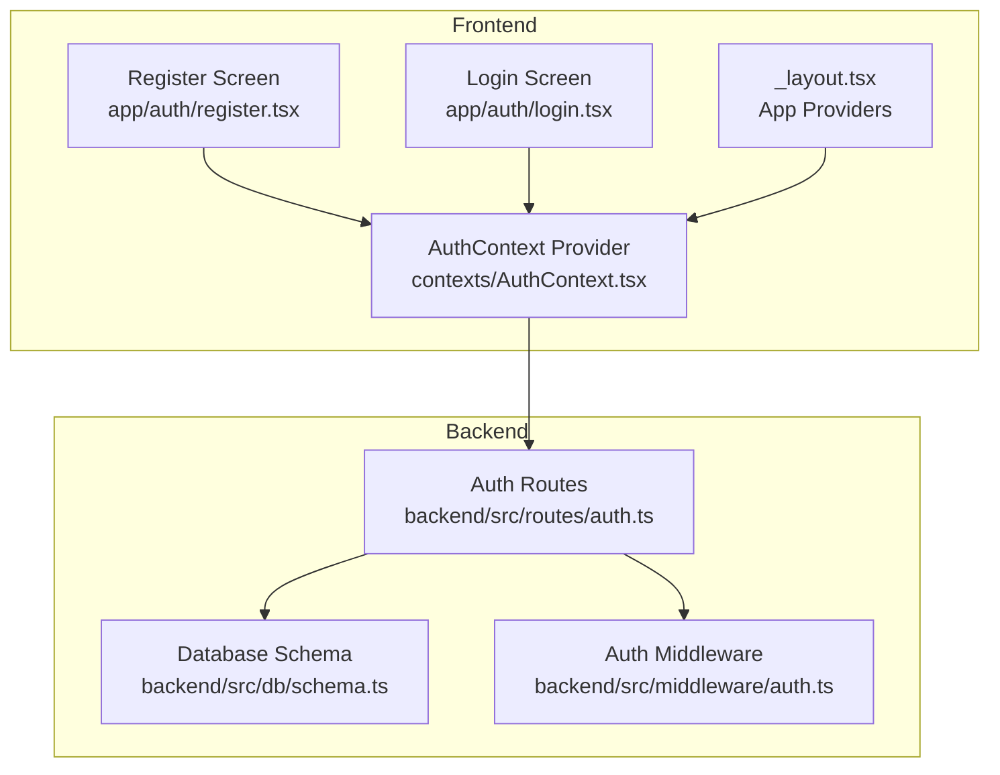
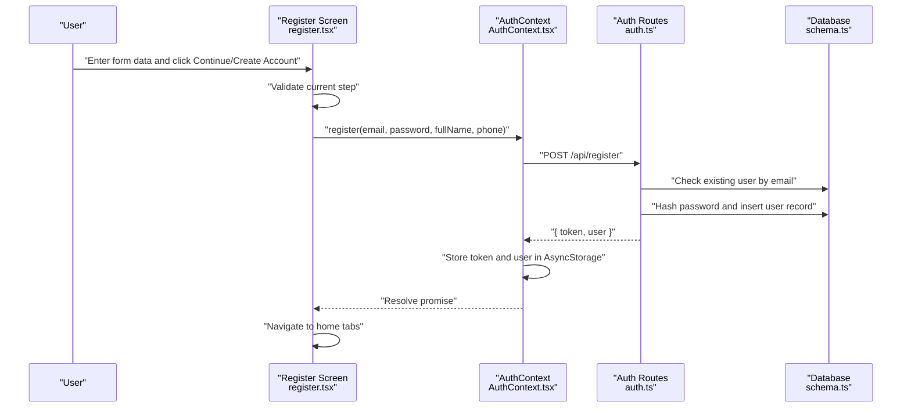
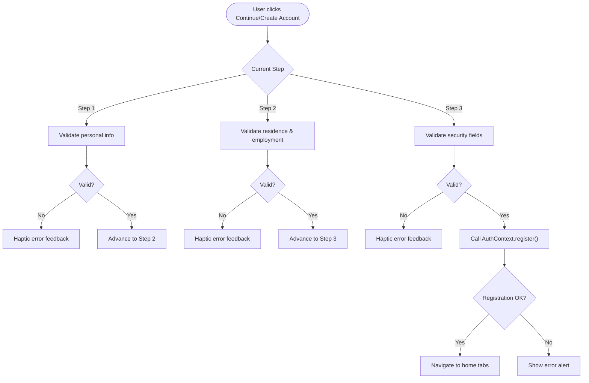
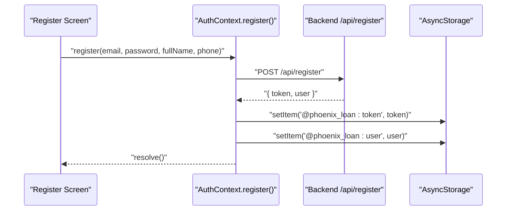
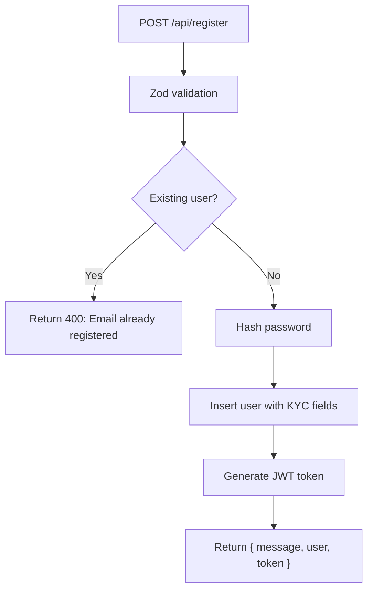
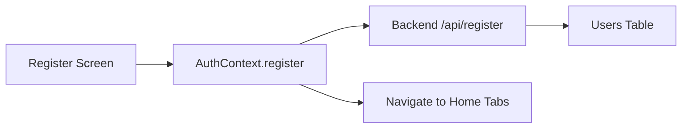
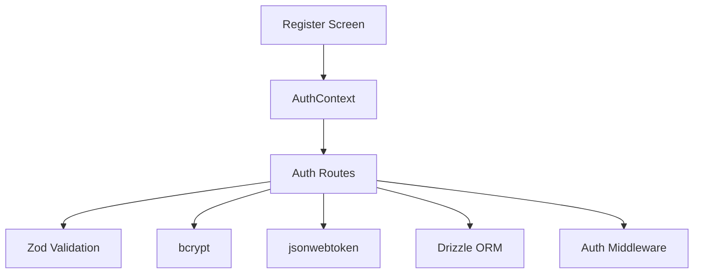

# Registration Process

<cite>
**Referenced Files in This Document**
- [register.tsx](file://app/auth/register.tsx)
- [AuthContext.tsx](file://contexts/AuthContext.tsx)
- [auth.ts](file://backend/src/routes/auth.ts)
- [schema.ts](file://backend/src/db/schema.ts)
- [login.tsx](file://app/auth/login.tsx)
- [_layout.tsx](file://app/_layout.tsx)
- [auth.ts](file://backend/src/middleware/auth.ts)
</cite>

## Table of Contents
1. [Introduction](#introduction)
2. [Project Structure](#project-structure)
3. [Core Components](#core-components)
4. [Architecture Overview](#architecture-overview)
5. [Detailed Component Analysis](#detailed-component-analysis)
6. [Dependency Analysis](#dependency-analysis)
7. [Performance Considerations](#performance-considerations)
8. [Troubleshooting Guide](#troubleshooting-guide)
9. [Conclusion](#conclusion)

## Introduction
This document provides comprehensive documentation for the user registration process in the Phoenix Loan application. It covers the multi-step registration flow, form validation, user data collection, backend registration API integration, user data sanitization, and account creation workflows. It also explains the relationship between the registration component, the AuthContext provider, and automatic login upon successful registration, along with common registration issues, validation patterns, and user onboarding considerations.

## Project Structure
The registration process spans both the frontend and backend layers:
- Frontend: Registration UI, form validation, and AuthContext integration
- Backend: Registration API endpoint, data validation, password hashing, and JWT token generation
- Shared data model: PostgreSQL schema for user records

**Diagram sources**
- [register.tsx:178-384](file://app/auth/register.tsx#L178-L384)
- [AuthContext.tsx:31-126](file://contexts/AuthContext.tsx#L31-L126)
- [login.tsx:80-134](file://app/auth/login.tsx#L80-L134)
- [_layout.tsx:65-78](file://app/_layout.tsx#L65-L78)
- [auth.ts:10-146](file://backend/src/routes/auth.ts#L10-L146)
- [schema.ts:4-21](file://backend/src/db/schema.ts#L4-L21)
- [auth.ts:10-47](file://backend/src/middleware/auth.ts#L10-L47)

**Section sources**
- [register.tsx:178-384](file://app/auth/register.tsx#L178-L384)
- [AuthContext.tsx:31-126](file://contexts/AuthContext.tsx#L31-L126)
- [auth.ts:10-146](file://backend/src/routes/auth.ts#L10-L146)
- [schema.ts:4-21](file://backend/src/db/schema.ts#L4-L21)
- [_layout.tsx:65-78](file://app/_layout.tsx#L65-L78)

## Core Components
- Registration Screen: Multi-step form collecting personal, residence, and security information with inline validation and haptic feedback.
- AuthContext Provider: Centralized authentication state, token management, and registration/login/logout functions.
- Backend Auth Routes: Zod-based validation, duplicate email checks, password hashing, user creation, and JWT token issuance.
- Database Schema: PostgreSQL schema defining user fields including KYC attributes and roles.

Key responsibilities:
- Frontend: Validate user input, collect form data, call AuthContext.register, and navigate on success.
- Backend: Validate incoming payload, prevent duplicate registrations, hash passwords, persist user data, and issue JWT tokens.
- Context: Store tokens and user data in AsyncStorage, expose register/login functions to components.

**Section sources**
- [register.tsx:178-250](file://app/auth/register.tsx#L178-L250)
- [AuthContext.tsx:81-112](file://contexts/AuthContext.tsx#L81-L112)
- [auth.ts:33-93](file://backend/src/routes/auth.ts#L33-L93)
- [schema.ts:4-21](file://backend/src/db/schema.ts#L4-L21)

## Architecture Overview
The registration flow integrates frontend and backend components:

**Diagram sources**
- [register.tsx:227-250](file://app/auth/register.tsx#L227-L250)
- [AuthContext.tsx:81-112](file://contexts/AuthContext.tsx#L81-L112)
- [auth.ts:33-93](file://backend/src/routes/auth.ts#L33-L93)
- [schema.ts:4-21](file://backend/src/db/schema.ts#L4-L21)

## Detailed Component Analysis

### Registration Screen (Multi-Step Form)
The registration screen implements a three-step wizard:
- Step 1: Personal Information (name, phone, email, date of birth, national ID)
- Step 2: Residence and Employment (district, area/village, employment status, monthly income)
- Step 3: Security (password and confirm password)

Validation rules per step:
- Step 1: Full name minimum length, phone number format, valid email, date of birth required, national ID minimum length.
- Step 2: District selection, area minimum length, employment status selection, monthly income required.
- Step 3: Password minimum length, password confirmation match.

Success handling:
- On step 3 success, the component calls AuthContext.register with collected form data.
- On success, navigates to the main application tabs route.
- On failure, displays an alert with a generic error message.

**Diagram sources**
- [register.tsx:198-250](file://app/auth/register.tsx#L198-L250)

**Section sources**
- [register.tsx:178-384](file://app/auth/register.tsx#L178-L384)

### AuthContext Provider (Registration Integration)
AuthContext exposes the register function that performs the following:
- Sends a POST request to the backend registration endpoint with email, password, full name, and optional phone.
- Parses the response and stores the JWT token and user data in AsyncStorage.
- Sets the user and token state for immediate UI updates.

Automatic login behavior:
- On successful registration, the frontend receives a token and user object from the backend and persists them locally.
- The registration screen then navigates to the main application tabs, effectively logging the user in automatically.

**Diagram sources**
- [AuthContext.tsx:81-112](file://contexts/AuthContext.tsx#L81-L112)

**Section sources**
- [AuthContext.tsx:81-112](file://contexts/AuthContext.tsx#L81-L112)

### Backend Registration Endpoint
The backend registration endpoint enforces strict validation and security:
- Zod schema validates incoming payload: email, password (minimum length), full name, plus optional KYC fields.
- Duplicate email check prevents multiple accounts with the same email.
- Password hashing using bcrypt before storing.
- User insertion includes all KYC fields and assigns role as "user".
- JWT token generation with expiration for session management.

Response payload includes a success message, user object (without sensitive fields), and token.

**Diagram sources**
- [auth.ts:33-93](file://backend/src/routes/auth.ts#L33-L93)

**Section sources**
- [auth.ts:33-93](file://backend/src/routes/auth.ts#L33-L93)

### Database Schema and User Model
The backend defines the users table with fields for:
- Identity: id, email (unique), password
- Profile: full_name, phone
- KYC: date_of_birth, national_id, district, area, employment_status, monthly_income
- Access control: role (default "user"), timestamps
- Compliance: is_blacklisted flag

This schema supports the registration flow by capturing all collected KYC data during registration.

**Section sources**
- [schema.ts:4-21](file://backend/src/db/schema.ts#L4-L21)

### Relationship Between Registration Component, AuthContext, and Automatic Login
- Registration Screen collects form data and triggers AuthContext.register.
- AuthContext.register sends the request to the backend and persists the token/user.
- The registration screen navigates to the main tabs route, completing the automatic login flow.

**Diagram sources**
- [register.tsx:227-250](file://app/auth/register.tsx#L227-L250)
- [AuthContext.tsx:81-112](file://contexts/AuthContext.tsx#L81-L112)
- [auth.ts:33-93](file://backend/src/routes/auth.ts#L33-L93)

**Section sources**
- [register.tsx:227-250](file://app/auth/register.tsx#L227-L250)
- [AuthContext.tsx:81-112](file://contexts/AuthContext.tsx#L81-L112)

## Dependency Analysis
- Frontend depends on AuthContext for authentication operations and AsyncStorage for persistence.
- AuthContext depends on the backend registration endpoint for account creation.
- Backend registration depends on Zod validation, bcrypt for password hashing, JWT for tokens, and Drizzle ORM for database operations.
- Middleware ensures protected routes can verify JWT tokens and enforce roles.

**Diagram sources**
- [register.tsx:178-384](file://app/auth/register.tsx#L178-L384)
- [AuthContext.tsx:81-112](file://contexts/AuthContext.tsx#L81-L112)
- [auth.ts:10-146](file://backend/src/routes/auth.ts#L10-L146)
- [auth.ts:10-47](file://backend/src/middleware/auth.ts#L10-L47)

**Section sources**
- [AuthContext.tsx:81-112](file://contexts/AuthContext.tsx#L81-L112)
- [auth.ts:10-146](file://backend/src/routes/auth.ts#L10-L146)
- [auth.ts:10-47](file://backend/src/middleware/auth.ts#L10-L47)

## Performance Considerations
- Network latency: Registration involves network calls; consider showing loading indicators and disabling the submit button while processing.
- Validation: Client-side validation reduces unnecessary backend calls; ensure server-side validation remains strict.
- Token storage: AsyncStorage is synchronous; keep payloads minimal to reduce serialization overhead.
- Database writes: Password hashing adds CPU cost; ensure adequate server resources for concurrent registrations.

## Troubleshooting Guide
Common registration issues and resolutions:
- Duplicate email: Backend returns a 400 error indicating the email is already registered. Prompt the user to sign in or use another email.
- Invalid credentials on login after registration: Ensure the registration succeeded and the token was stored. Check AsyncStorage keys and verify the backend JWT secret is configured.
- Phone number format errors: The frontend validates phone numbers; ensure international format is used consistently.
- Password mismatch: Confirm both password fields match and meet minimum length requirements.
- Navigation failures: Verify the navigation target exists and that the AuthContext provider wraps the application layout.

Operational checks:
- Confirm the backend server is running and reachable.
- Verify environment variables (JWT secret, database URL) are correctly set.
- Ensure the frontend API URL points to the correct backend endpoint.

**Section sources**
- [auth.ts:42-44](file://backend/src/routes/auth.ts#L42-L44)
- [AuthContext.tsx:81-112](file://contexts/AuthContext.tsx#L81-L112)
- [register.tsx:227-250](file://app/auth/register.tsx#L227-L250)

## Conclusion
The Phoenix Loan registration process combines a user-friendly multi-step form with robust backend validation and secure account creation. The AuthContext provider centralizes authentication logic, enabling seamless automatic login upon successful registration. The backend enforces strict validation, handles password hashing, and issues secure JWT tokens. Together, these components deliver a reliable onboarding experience with clear error handling and user feedback.