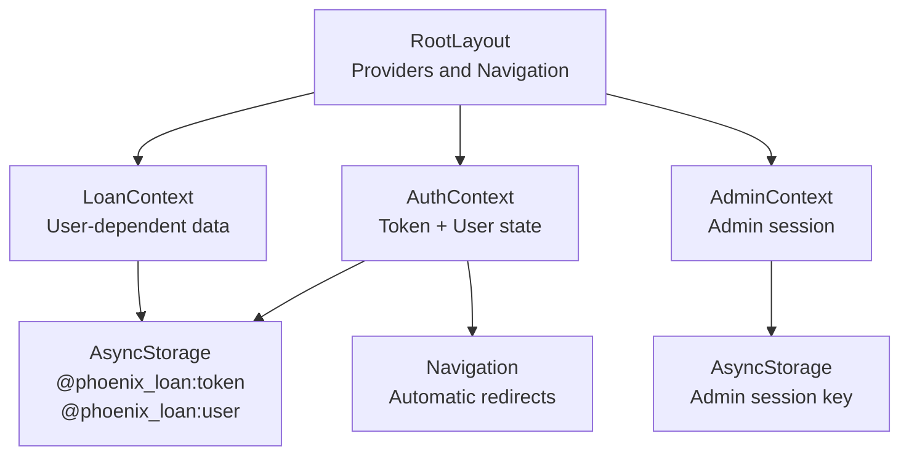
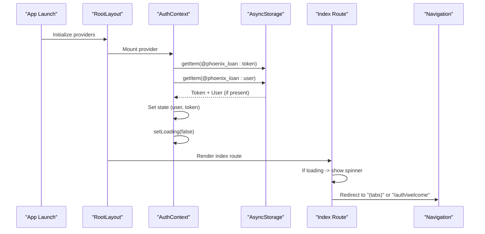
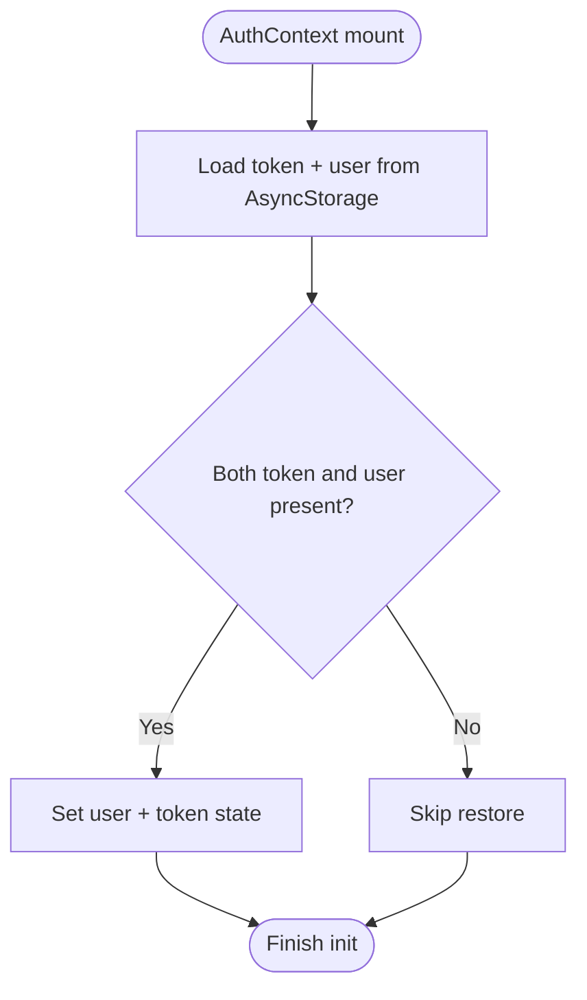
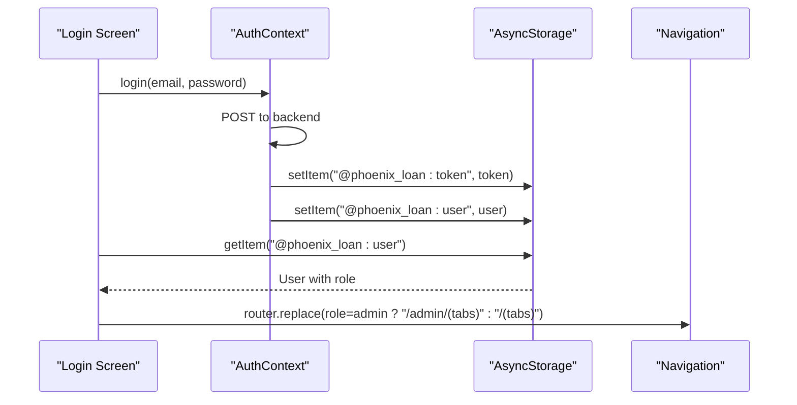
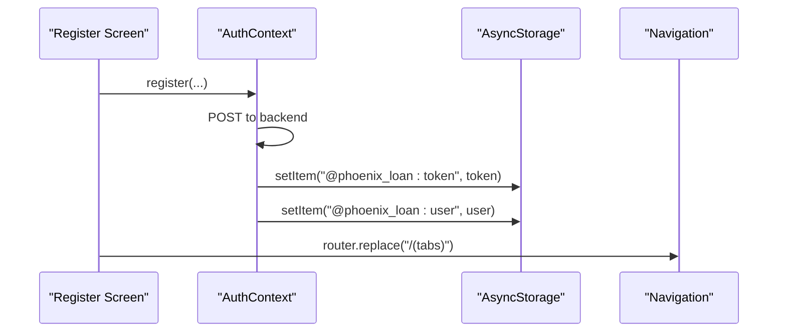
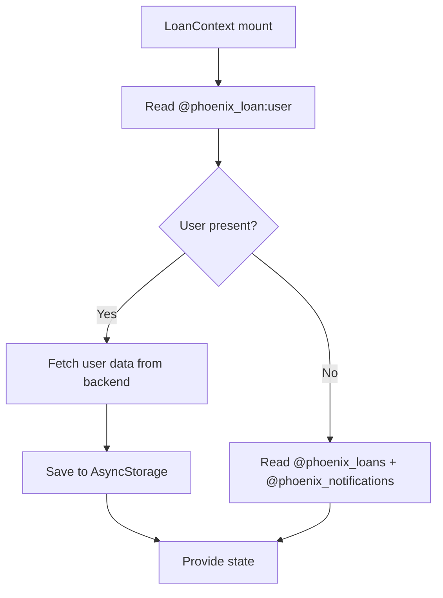
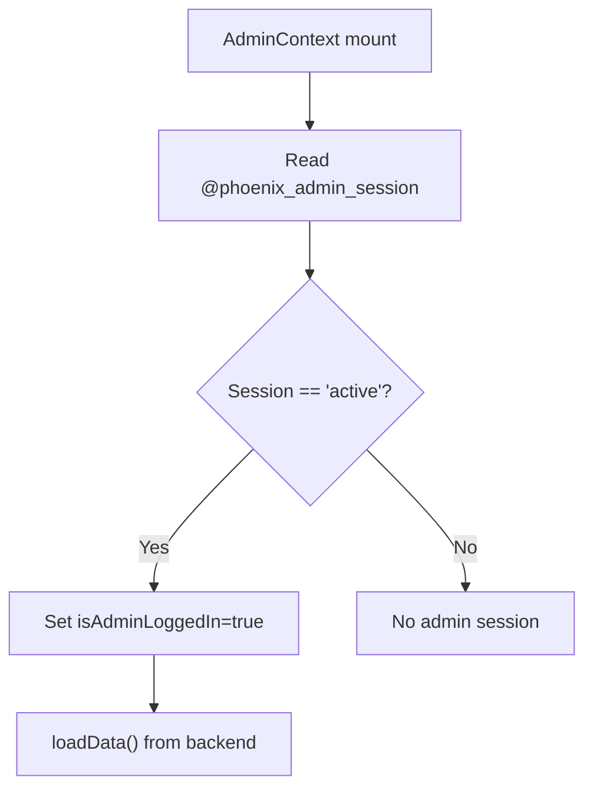
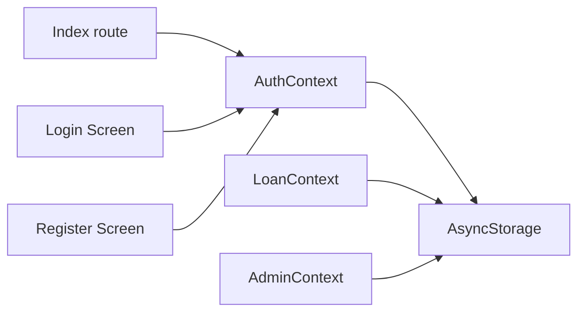

# Session Persistence

<cite>
**Referenced Files in This Document**
- [AuthContext.tsx](file://contexts/AuthContext.tsx)
- [RootLayout.tsx](file://app/_layout.tsx)
- [Index.tsx](file://app/index.tsx)
- [Login.tsx](file://app/auth/login.tsx)
- [Register.tsx](file://app/auth/register.tsx)
- [Welcome.tsx](file://app/auth/welcome.tsx)
- [LoanContext.tsx](file://contexts/LoanContext.tsx)
- [AdminContext.tsx](file://contexts/AdminContext.tsx)
- [auth.ts](file://backend/src/middleware/auth.ts)
</cite>

## Table of Contents
1. [Introduction](#introduction)
2. [Project Structure](#project-structure)
3. [Core Components](#core-components)
4. [Architecture Overview](#architecture-overview)
5. [Detailed Component Analysis](#detailed-component-analysis)
6. [Dependency Analysis](#dependency-analysis)
7. [Performance Considerations](#performance-considerations)
8. [Troubleshooting Guide](#troubleshooting-guide)
9. [Conclusion](#conclusion)

## Introduction
This document explains how user sessions are persisted and restored across app restarts, enabling automatic login and seamless navigation. It covers AsyncStorage-backed persistence for tokens and user data, the initialization flow at app launch, automatic redirection logic, and error handling for corrupted or missing session data. It also outlines the relationship between session persistence and navigation, security considerations, and practical troubleshooting steps.

## Project Structure
The session lifecycle spans three layers:
- App bootstrap and providers: Root layout initializes providers and navigation.
- Authentication context: Manages token and user state, persists to AsyncStorage, and exposes login/logout.
- Navigation: Redirects based on authentication state and user role.



**Diagram sources**
- [RootLayout.tsx:31-81](file://app/_layout.tsx#L31-L81)
- [AuthContext.tsx:31-126](file://contexts/AuthContext.tsx#L31-L126)
- [LoanContext.tsx:82-176](file://contexts/LoanContext.tsx#L82-L176)
- [AdminContext.tsx:135-162](file://contexts/AdminContext.tsx#L135-L162)

**Section sources**
- [RootLayout.tsx:31-81](file://app/_layout.tsx#L31-L81)
- [AuthContext.tsx:31-126](file://contexts/AuthContext.tsx#L31-L126)
- [LoanContext.tsx:82-176](file://contexts/LoanContext.tsx#L82-L176)
- [AdminContext.tsx:135-162](file://contexts/AdminContext.tsx#L135-L162)

## Core Components
- AuthContext: Loads persisted token and user on startup, stores after login, clears on logout.
- RootLayout: Wraps the app with providers and defines top-level navigation screens.
- Index: Redirects to authenticated tabs or welcome screen based on loading and user state.
- LoanContext: Reads user from AsyncStorage to hydrate user-dependent data and notifications.
- AdminContext: Manages admin session state using AsyncStorage and loads admin data on startup.

Key AsyncStorage keys:
- @phoenix_loan:token
- @phoenix_loan:user
- @phoenix_loans
- @phoenix_notifications
- @phoenix_admin_session

**Section sources**
- [AuthContext.tsx:31-126](file://contexts/AuthContext.tsx#L31-L126)
- [RootLayout.tsx:31-81](file://app/_layout.tsx#L31-L81)
- [Index.tsx:6-22](file://app/index.tsx#L6-L22)
- [LoanContext.tsx:82-176](file://contexts/LoanContext.tsx#L82-L176)
- [AdminContext.tsx:135-162](file://contexts/AdminContext.tsx#L135-L162)

## Architecture Overview
The session persistence architecture ensures:
- On app launch, AuthContext reads AsyncStorage to restore token and user.
- Navigation checks loading and user state to decide initial route.
- After login, AuthContext writes token and user to AsyncStorage and triggers role-based redirect.
- LoanContext and AdminContext rely on AsyncStorage-persisted user/session to hydrate data.



**Diagram sources**
- [AuthContext.tsx:36-54](file://contexts/AuthContext.tsx#L36-L54)
- [Index.tsx:6-22](file://app/index.tsx#L6-L22)
- [RootLayout.tsx:31-81](file://app/_layout.tsx#L31-L81)

## Detailed Component Analysis

### AuthContext: Session Persistence and Initialization
- Initialization: On mount, loads token and user from AsyncStorage and sets loading to false.
- Login: Calls backend, receives token and user, sets state, and persists both to AsyncStorage.
- Logout: Clears user/token and removes AsyncStorage entries.
- Role-based redirect: Login screen reads AsyncStorage to detect role and navigates accordingly.



**Diagram sources**
- [AuthContext.tsx:36-54](file://contexts/AuthContext.tsx#L36-L54)

**Section sources**
- [AuthContext.tsx:36-54](file://contexts/AuthContext.tsx#L36-L54)
- [AuthContext.tsx:56-119](file://contexts/AuthContext.tsx#L56-L119)
- [Login.tsx:101-134](file://app/auth/login.tsx#L101-L134)

### App Layout and Automatic Redirect Logic
- RootLayout composes providers and defines top-level stacks.
- Index route shows a spinner while AuthContext is loading, then redirects:
  - To "(tabs)" if user exists.
  - To "/auth/welcome" otherwise.

```mermaid
flowchart TD
A["Index route render"] --> B{"AuthContext.loading?"}
B --> |true| C["Show spinner"]
B --> |false| D{"AuthContext.user exists?"}
D --> |true| E["Redirect to \"(tabs)\""]
D --> |false| F["Redirect to \"/auth/welcome\""]
```

**Diagram sources**
- [Index.tsx:6-22](file://app/index.tsx#L6-L22)

**Section sources**
- [RootLayout.tsx:31-81](file://app/_layout.tsx#L31-L81)
- [Index.tsx:6-22](file://app/index.tsx#L6-L22)

### Login Flow and Role-Based Redirect
- Validates credentials, calls AuthContext.login, and persists token/user.
- Immediately reads AsyncStorage to determine role and redirects to appropriate tabbed layout.



**Diagram sources**
- [Login.tsx:101-134](file://app/auth/login.tsx#L101-L134)
- [AuthContext.tsx:56-79](file://contexts/AuthContext.tsx#L56-L79)

**Section sources**
- [Login.tsx:101-134](file://app/auth/login.tsx#L101-L134)
- [AuthContext.tsx:56-79](file://contexts/AuthContext.tsx#L56-L79)

### Registration Flow and Post-Registration Redirect
- Calls AuthContext.register, persists token/user, and redirects to user tabs.



**Diagram sources**
- [Register.tsx:239-250](file://app/auth/register.tsx#L239-L250)
- [AuthContext.tsx:81-112](file://contexts/AuthContext.tsx#L81-L112)

**Section sources**
- [Register.tsx:239-250](file://app/auth/register.tsx#L239-L250)
- [AuthContext.tsx:81-112](file://contexts/AuthContext.tsx#L81-L112)

### LoanContext Hydration Using AsyncStorage-Persisted User
- On mount, reads "@phoenix_loan:user" to determine current user ID.
- Fetches user-specific data from backend and falls back to AsyncStorage caches if needed.



**Diagram sources**
- [LoanContext.tsx:87-176](file://contexts/LoanContext.tsx#L87-L176)

**Section sources**
- [LoanContext.tsx:87-176](file://contexts/LoanContext.tsx#L87-L176)

### AdminContext Session Persistence
- On mount, reads "@phoenix_admin_session". If "active", marks admin logged in and loads admin data.
- Provides adminLogin/adminLogout that manage AsyncStorage session state.



**Diagram sources**
- [AdminContext.tsx:146-162](file://contexts/AdminContext.tsx#L146-L162)

**Section sources**
- [AdminContext.tsx:146-162](file://contexts/AdminContext.tsx#L146-L162)
- [AdminContext.tsx:287-302](file://contexts/AdminContext.tsx#L287-L302)

## Dependency Analysis
- AuthContext depends on AsyncStorage for token and user persistence.
- Index route depends on AuthContext loading and user state for navigation decisions.
- Login/Register depend on AuthContext to persist token/user and trigger redirects.
- LoanContext depends on AsyncStorage-persisted user to hydrate user-specific data.
- AdminContext manages admin session independently but shares AsyncStorage usage patterns.



**Diagram sources**
- [AuthContext.tsx:31-126](file://contexts/AuthContext.tsx#L31-L126)
- [Index.tsx:6-22](file://app/index.tsx#L6-L22)
- [Login.tsx:101-134](file://app/auth/login.tsx#L101-L134)
- [Register.tsx:239-250](file://app/auth/register.tsx#L239-L250)
- [LoanContext.tsx:82-176](file://contexts/LoanContext.tsx#L82-L176)
- [AdminContext.tsx:135-162](file://contexts/AdminContext.tsx#L135-L162)

**Section sources**
- [AuthContext.tsx:31-126](file://contexts/AuthContext.tsx#L31-L126)
- [Index.tsx:6-22](file://app/index.tsx#L6-L22)
- [Login.tsx:101-134](file://app/auth/login.tsx#L101-L134)
- [Register.tsx:239-250](file://app/auth/register.tsx#L239-L250)
- [LoanContext.tsx:82-176](file://contexts/LoanContext.tsx#L82-L176)
- [AdminContext.tsx:135-162](file://contexts/AdminContext.tsx#L135-L162)

## Performance Considerations
- AsyncStorage I/O occurs on mount; keep payloads small (token + compact user object).
- Batch reads/writes where possible to reduce IO overhead.
- Avoid synchronous heavy work on the main thread during hydration.
- Use memoization for derived values (e.g., unread counts) to prevent unnecessary re-renders.

## Troubleshooting Guide
Common issues and resolutions:
- Corrupted or partial session data
  - Symptom: App stuck on loading spinner or unexpected redirects.
  - Action: Clear AsyncStorage entries for token and user, then restart the app.
  - Keys to clear: @phoenix_loan:token, @phoenix_loan:user.
  - Evidence: AuthContext reads and writes these keys during init and login.

- Missing user data after login
  - Symptom: Login succeeds but navigation does not redirect to tabs.
  - Action: Verify AsyncStorage write succeeded and that the user object includes role.
  - Evidence: Login screen reads AsyncStorage to determine role and navigate.

- Admin session not recognized
  - Symptom: Admin portal shows login despite recent admin login.
  - Action: Confirm AsyncStorage session key equals "active".
  - Evidence: AdminContext reads @phoenix_admin_session on mount.

- Backend token validation failures
  - Symptom: Network requests fail with unauthorized errors.
  - Action: Ensure Authorization header is set with the JWT token from AsyncStorage.
  - Evidence: Backend middleware expects Bearer token and validates it.

- Offline data hydration
  - Symptom: Loan or notification lists empty when offline.
  - Action: Confirm AsyncStorage caches exist; LoanContext falls back to cached data.
  - Evidence: LoanContext reads @phoenix_loans and @phoenix_notifications.

**Section sources**
- [AuthContext.tsx:40-54](file://contexts/AuthContext.tsx#L40-L54)
- [Login.tsx:118-126](file://app/auth/login.tsx#L118-L126)
- [AdminContext.tsx:150-162](file://contexts/AdminContext.tsx#L150-L162)
- [LoanContext.tsx:161-170](file://contexts/LoanContext.tsx#L161-L170)
- [auth.ts:10-36](file://backend/src/middleware/auth.ts#L10-L36)

## Conclusion
Session persistence relies on AsyncStorage to restore token and user state at startup, enabling automatic login and seamless navigation. AuthContext orchestrates persistence and role-aware redirects, while Index route enforces safe navigation based on loading and user presence. LoanContext and AdminContext complement this by hydrating user-dependent data and managing admin sessions respectively. Robust error handling and troubleshooting practices ensure reliability across restarts and offline scenarios.