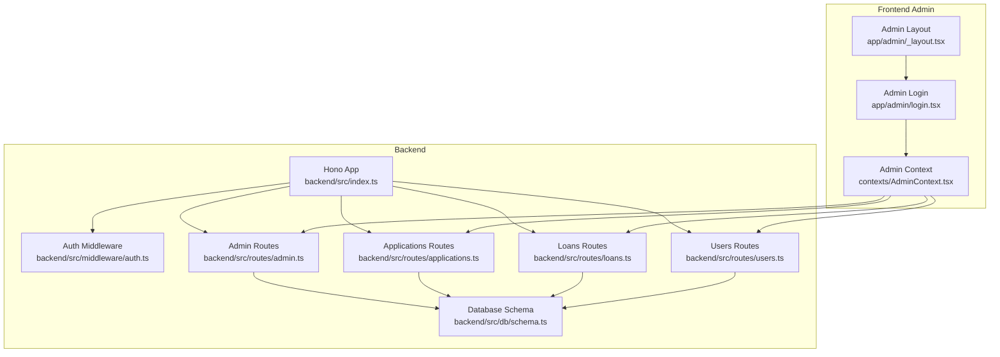
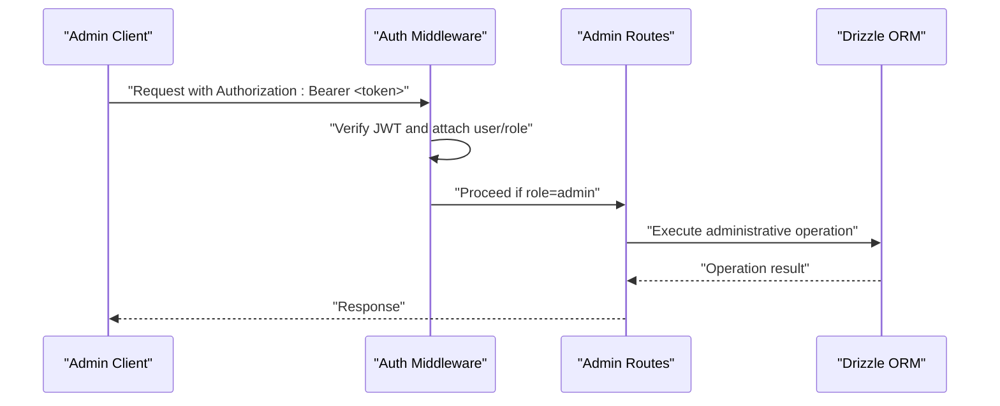
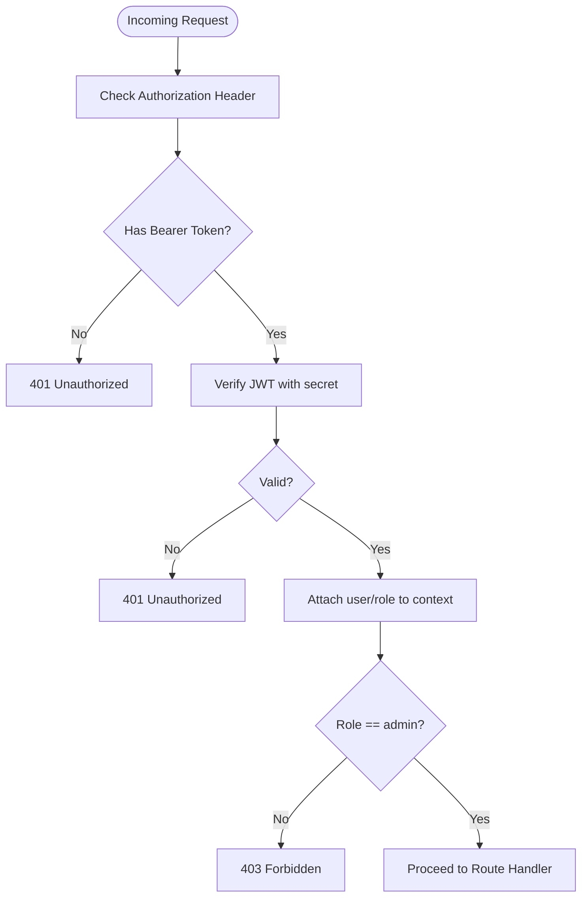
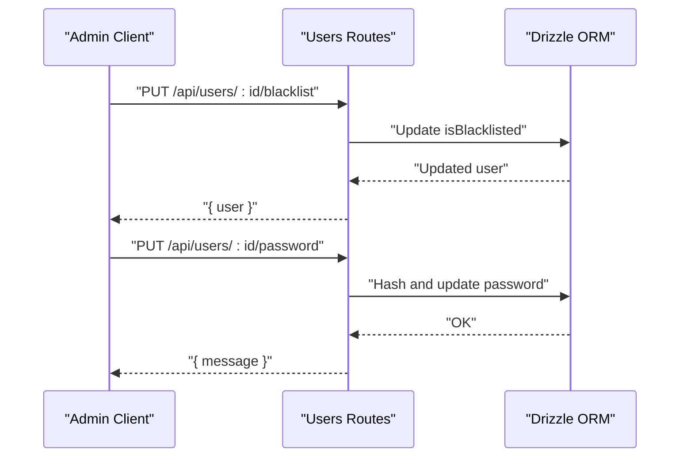
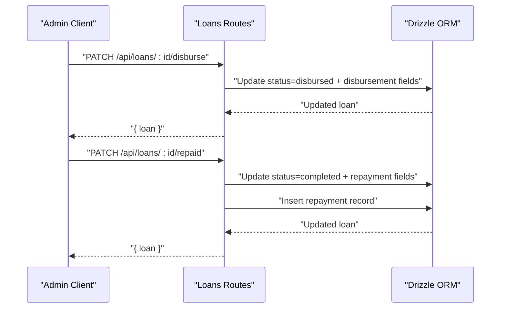
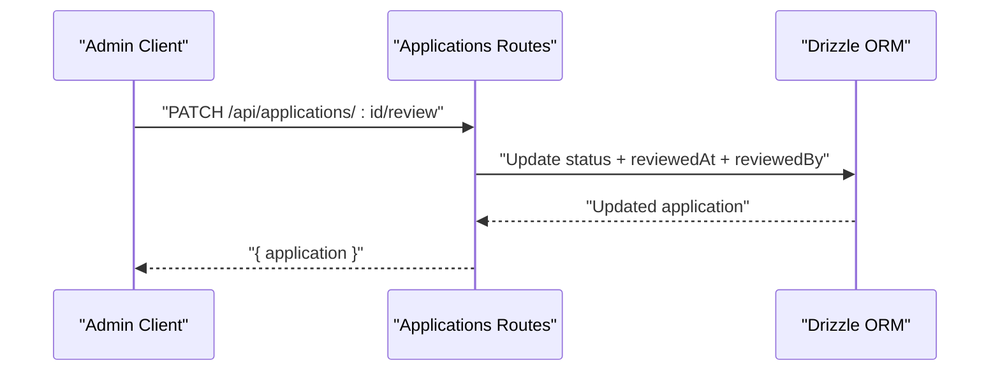
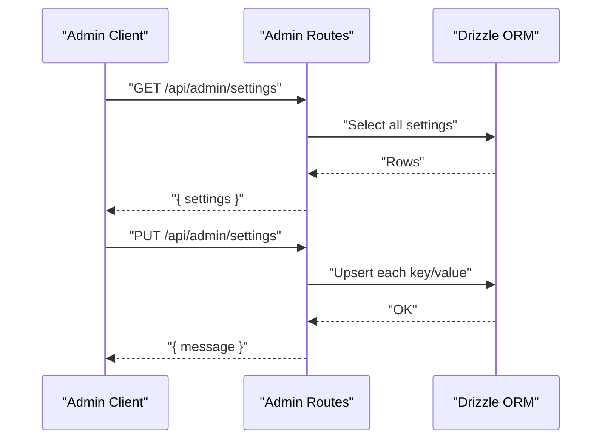
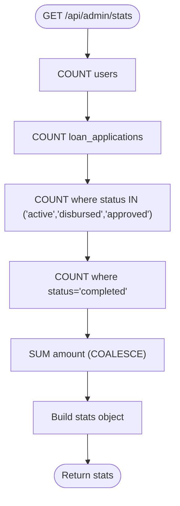
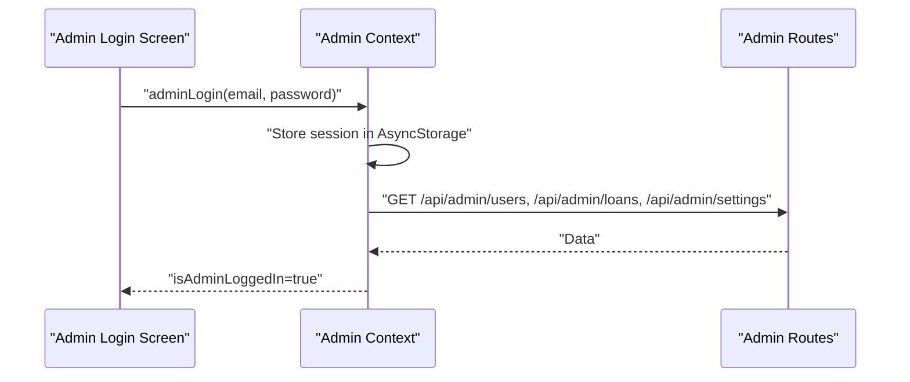
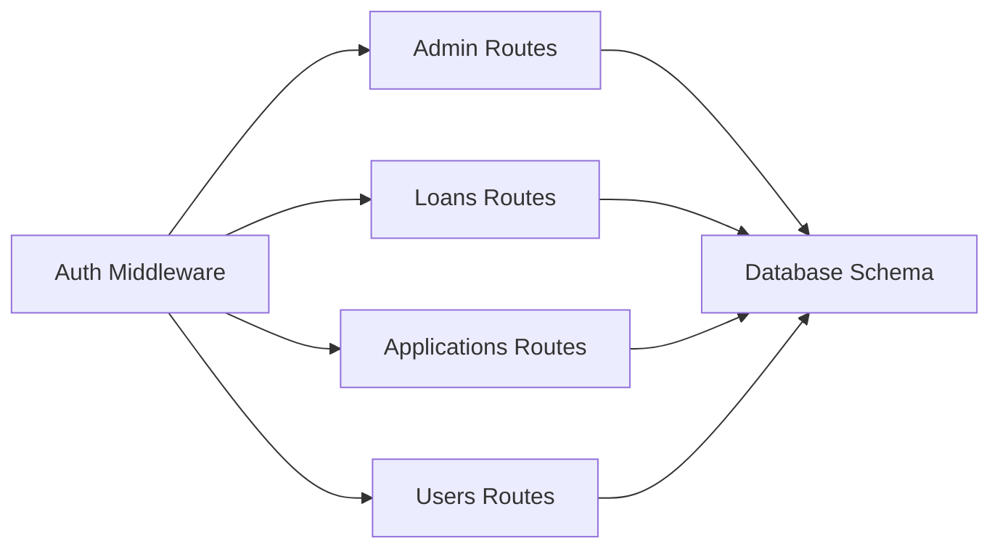

# Administrative API

<cite>
**Referenced Files in This Document**
- [backend/src/index.ts](file://backend/src/index.ts)
- [backend/src/middleware/auth.ts](file://backend/src/middleware/auth.ts)
- [backend/src/routes/admin.ts](file://backend/src/routes/admin.ts)
- [backend/src/routes/applications.ts](file://backend/src/routes/applications.ts)
- [backend/src/routes/loans.ts](file://backend/src/routes/loans.ts)
- [backend/src/routes/users.ts](file://backend/src/routes/users.ts)
- [backend/src/db/schema.ts](file://backend/src/db/schema.ts)
- [backend/create-admin-user.sql](file://backend/create-admin-user.sql)
- [backend/generate-admin-hash.js](file://backend/generate-admin-hash.js)
- [contexts/AdminContext.tsx](file://contexts/AdminContext.tsx)
- [app/admin/_layout.tsx](file://app/admin/_layout.tsx)
- [app/admin/login.tsx](file://app/admin/login.tsx)
</cite>

## Table of Contents
1. [Introduction](#introduction)
2. [Project Structure](#project-structure)
3. [Core Components](#core-components)
4. [Architecture Overview](#architecture-overview)
5. [Detailed Component Analysis](#detailed-component-analysis)
6. [Dependency Analysis](#dependency-analysis)
7. [Performance Considerations](#performance-considerations)
8. [Troubleshooting Guide](#troubleshooting-guide)
9. [Conclusion](#conclusion)
10. [Appendices](#appendices)

## Introduction
This document provides comprehensive API documentation for administrative endpoints that enable loan officers and administrators to manage users, loan applications, and system configuration. It covers HTTP methods, request/response formats, authentication and authorization, workflow examples, and integration guidance for dashboards and reporting systems.

## Project Structure
The administrative API is implemented as part of a modular backend built with Hono and Drizzle ORM, and integrated with a React Native frontend admin panel.

**Diagram sources**
- [backend/src/index.ts:54-61](file://backend/src/index.ts#L54-L61)
- [backend/src/middleware/auth.ts:10-47](file://backend/src/middleware/auth.ts#L10-L47)
- [backend/src/routes/admin.ts:6-170](file://backend/src/routes/admin.ts#L6-L170)
- [backend/src/routes/applications.ts:8-167](file://backend/src/routes/applications.ts#L8-L167)
- [backend/src/routes/loans.ts:8-319](file://backend/src/routes/loans.ts#L8-L319)
- [backend/src/routes/users.ts:6-196](file://backend/src/routes/users.ts#L6-L196)
- [backend/src/db/schema.ts:4-146](file://backend/src/db/schema.ts#L4-L146)
- [app/admin/_layout.tsx:1-12](file://app/admin/_layout.tsx#L1-L12)
- [app/admin/login.tsx:17-164](file://app/admin/login.tsx#L17-L164)
- [contexts/AdminContext.tsx:135-521](file://contexts/AdminContext.tsx#L135-L521)

**Section sources**
- [backend/src/index.ts:54-61](file://backend/src/index.ts#L54-L61)
- [backend/src/middleware/auth.ts:10-47](file://backend/src/middleware/auth.ts#L10-L47)
- [backend/src/routes/admin.ts:6-170](file://backend/src/routes/admin.ts#L6-L170)
- [backend/src/routes/applications.ts:8-167](file://backend/src/routes/applications.ts#L8-L167)
- [backend/src/routes/loans.ts:8-319](file://backend/src/routes/loans.ts#L8-L319)
- [backend/src/routes/users.ts:6-196](file://backend/src/routes/users.ts#L6-L196)
- [backend/src/db/schema.ts:4-146](file://backend/src/db/schema.ts#L4-L146)
- [app/admin/_layout.tsx:1-12](file://app/admin/_layout.tsx#L1-L12)
- [app/admin/login.tsx:17-164](file://app/admin/login.tsx#L17-L164)
- [contexts/AdminContext.tsx:135-521](file://contexts/AdminContext.tsx#L135-L521)

## Core Components
- Authentication and Authorization
  - JWT-based authentication middleware extracts user identity and role from Authorization headers.
  - Admin-only middleware enforces role-based access control for administrative endpoints.
- Administrative Endpoints
  - User management: GET /api/admin/users, PUT /api/users/:id/blacklist, PUT /api/users/:id/password
  - Loan administration: PATCH /api/loans/:id/status, PATCH /api/loans/:id/disburse, PATCH /api/loans/:id/repaid, PATCH /api/loans/:id/complete
  - Application review: PATCH /api/applications/:id/review
  - System configuration: GET /api/admin/settings, PUT /api/admin/settings
  - Dashboard statistics: GET /api/admin/stats
- Frontend Admin Integration
  - Admin login screen and context provider orchestrate administrative actions and maintain session state.

**Section sources**
- [backend/src/middleware/auth.ts:10-47](file://backend/src/middleware/auth.ts#L10-L47)
- [backend/src/routes/admin.ts:8-170](file://backend/src/routes/admin.ts#L8-L170)
- [backend/src/routes/applications.ts:140-165](file://backend/src/routes/applications.ts#L140-L165)
- [backend/src/routes/loans.ts:199-317](file://backend/src/routes/loans.ts#L199-L317)
- [backend/src/routes/users.ts:136-194](file://backend/src/routes/users.ts#L136-L194)
- [contexts/AdminContext.tsx:287-478](file://contexts/AdminContext.tsx#L287-L478)

## Architecture Overview
The administrative API follows a layered architecture:
- Transport and routing: Hono app registers routes and applies CORS and logging middleware.
- Authentication: JWT verification middleware attaches user context; admin middleware restricts endpoints.
- Business logic: Route handlers implement administrative operations against the database via Drizzle ORM.
- Data model: PostgreSQL schema defines users, loans, applications, repayments, notifications, and settings.

**Diagram sources**
- [backend/src/middleware/auth.ts:10-47](file://backend/src/middleware/auth.ts#L10-L47)
- [backend/src/routes/admin.ts:127-168](file://backend/src/routes/admin.ts#L127-L168)
- [backend/src/routes/loans.ts:199-317](file://backend/src/routes/loans.ts#L199-L317)
- [backend/src/routes/applications.ts:140-165](file://backend/src/routes/applications.ts#L140-L165)
- [backend/src/routes/users.ts:136-194](file://backend/src/routes/users.ts#L136-L194)

## Detailed Component Analysis

### Authentication and Authorization
- JWT Verification
  - Extracts Authorization header, validates Bearer token using JWT secret, and sets user context variables (userId, email, role).
- Admin-Only Enforcement
  - Middleware checks role equals "admin" and returns 403 Forbidden otherwise.
- Security Measures
  - Environment variable for JWT secret.
  - Role enforced at route level for sensitive endpoints.

**Diagram sources**
- [backend/src/middleware/auth.ts:10-47](file://backend/src/middleware/auth.ts#L10-L47)

**Section sources**
- [backend/src/middleware/auth.ts:10-47](file://backend/src/middleware/auth.ts#L10-L47)

### Administrative Endpoints

#### User Management
- GET /api/admin/users
  - Purpose: Paginated retrieval of users for administrative panels.
  - Query parameters: page (default 1), limit (max 100).
  - Response includes users array and pagination metadata.
- PUT /api/users/:id/blacklist
  - Purpose: Toggle user blacklist status.
  - Response: Updated user blacklist flag.
- PUT /api/users/:id/password
  - Purpose: Admin-initiated password reset for a user.
  - Request: { password: string } (min length 6).
  - Response: Success message.

**Diagram sources**
- [backend/src/routes/users.ts:136-194](file://backend/src/routes/users.ts#L136-L194)

**Section sources**
- [backend/src/routes/admin.ts:8-47](file://backend/src/routes/admin.ts#L8-L47)
- [backend/src/routes/users.ts:136-194](file://backend/src/routes/users.ts#L136-L194)

#### Loan Administration
- PATCH /api/loans/:id/status
  - Purpose: Update loan status (e.g., pending, approved, rejected, active, disbursed, completed, defaulted).
  - Request: { status: string }.
  - Response: Updated loan.
- PATCH /api/loans/:id/disburse
  - Purpose: Mark loan as disbursed with disbursement details.
  - Request: { disbursementMethod: string, disbursementReference: string }.
  - Response: Updated loan with timestamps and metadata.
- PATCH /api/loans/:id/repaid
  - Purpose: Mark loan as repaid and record repayment details; also creates a repayment record.
  - Request: { repaymentAmount: number, repaymentMethod: string, repaymentReference: string }.
  - Response: Updated loan.
- PATCH /api/loans/:id/complete
  - Purpose: Mark loan as completed with completion notes.
  - Request: { completionNotes: string }.
  - Response: Updated loan.

**Diagram sources**
- [backend/src/routes/loans.ts:224-290](file://backend/src/routes/loans.ts#L224-L290)

**Section sources**
- [backend/src/routes/loans.ts:199-317](file://backend/src/routes/loans.ts#L199-L317)

#### Application Review
- PATCH /api/applications/:id/review
  - Purpose: Approve or reject applications; optionally add admin notes.
  - Request: { status: "pending"|"under_review"|"approved"|"rejected", adminNotes?: string }.
  - Response: Updated application with reviewer metadata.

**Diagram sources**
- [backend/src/routes/applications.ts:140-165](file://backend/src/routes/applications.ts#L140-L165)

**Section sources**
- [backend/src/routes/applications.ts:140-165](file://backend/src/routes/applications.ts#L140-L165)

#### System Configuration
- GET /api/admin/settings
  - Purpose: Retrieve all system settings as a key-value map.
  - Response: { settings: Record<string, any> }.
- PUT /api/admin/settings
  - Purpose: Upsert settings; values are serialized to JSON strings.
  - Request: { key: value } pairs.
  - Response: Success message.

**Diagram sources**
- [backend/src/routes/admin.ts:127-168](file://backend/src/routes/admin.ts#L127-L168)

**Section sources**
- [backend/src/routes/admin.ts:127-168](file://backend/src/routes/admin.ts#L127-L168)

#### Dashboard Statistics
- GET /api/admin/stats
  - Purpose: Aggregated metrics for admin dashboards.
  - Metrics: totalUsers, totalLoans, activeLoans, completedLoans, totalDisbursed.
  - Response: { stats: object }.

**Diagram sources**
- [backend/src/routes/admin.ts:96-125](file://backend/src/routes/admin.ts#L96-L125)

**Section sources**
- [backend/src/routes/admin.ts:96-125](file://backend/src/routes/admin.ts#L96-L125)

### Administrative Workflows and Examples

#### User Management Workflow
- Bulk operations: Use GET /api/admin/users with pagination to fetch lists; apply filters client-side or server-side as needed.
- Audit logging: Track changes via admin audit logs (recommended practice) and monitor settings changes via GET/PUT /api/admin/settings.
- Example: Blacklisting a user
  - Client calls PUT /api/users/:id/blacklist.
  - Backend toggles isBlacklisted and returns updated user.

#### Loan Administration Workflow
- Approval pipeline:
  - Review application via PATCH /api/applications/:id/review.
  - Disburse loan via PATCH /api/loans/:id/disburse.
  - Mark repaid via PATCH /api/loans/:id/repaid.
  - Complete loan via PATCH /api/loans/:id/complete.
- Bulk operations: Use GET /api/admin/loans with pagination to batch-process applications; update statuses in bulk using the status endpoint.
- Example: Disbursing a loan
  - Client calls PATCH /api/loans/:id/disburse with disbursementMethod and disbursementReference.
  - Backend updates loan status and timestamps.

#### System Configuration Workflow
- Example: Updating interest rates and disbursement channels
  - Client calls PUT /api/admin/settings with structured payload.
  - Backend upserts each setting key.

**Section sources**
- [backend/src/routes/admin.ts:8-94](file://backend/src/routes/admin.ts#L8-L94)
- [backend/src/routes/users.ts:136-194](file://backend/src/routes/users.ts#L136-L194)
- [backend/src/routes/loans.ts:224-290](file://backend/src/routes/loans.ts#L224-L290)
- [backend/src/routes/applications.ts:140-165](file://backend/src/routes/applications.ts#L140-L165)
- [backend/src/routes/admin.ts:127-168](file://backend/src/routes/admin.ts#L127-L168)

### Frontend Admin Integration
- Admin Login
  - Credentials are validated locally; successful login persists session state and loads admin data.
- Admin Context
  - Provides functions for approving/rejecting loans, disbursing, marking repaid/completed, blacklisting users, updating settings, and refreshing data.
  - Integrates with backend endpoints for administrative tasks.

**Diagram sources**
- [app/admin/login.tsx:287-302](file://app/admin/login.tsx#L287-L302)
- [contexts/AdminContext.tsx:135-285](file://contexts/AdminContext.tsx#L135-L285)
- [backend/src/routes/admin.ts:8-168](file://backend/src/routes/admin.ts#L8-L168)

**Section sources**
- [app/admin/_layout.tsx:1-12](file://app/admin/_layout.tsx#L1-L12)
- [app/admin/login.tsx:17-164](file://app/admin/login.tsx#L17-L164)
- [contexts/AdminContext.tsx:135-521](file://contexts/AdminContext.tsx#L135-L521)

## Dependency Analysis
- Route Registration
  - Admin routes mounted under /api/admin to avoid conflicts with resource endpoints like /api/:id.
- Middleware Dependencies
  - Auth middleware depends on JWT secret from environment variables.
  - Admin middleware depends on role attached by auth middleware.
- Database Dependencies
  - Admin endpoints rely on users, loan_applications, and settings tables.
  - Loans endpoints depend on loans and repayments tables.

**Diagram sources**
- [backend/src/index.ts:54-61](file://backend/src/index.ts#L54-L61)
- [backend/src/middleware/auth.ts:10-47](file://backend/src/middleware/auth.ts#L10-L47)
- [backend/src/db/schema.ts:4-146](file://backend/src/db/schema.ts#L4-L146)

**Section sources**
- [backend/src/index.ts:54-61](file://backend/src/index.ts#L54-L61)
- [backend/src/middleware/auth.ts:10-47](file://backend/src/middleware/auth.ts#L10-L47)
- [backend/src/db/schema.ts:4-146](file://backend/src/db/schema.ts#L4-L146)

## Performance Considerations
- Pagination
  - Admin endpoints support page and limit parameters with a maximum limit of 100 to prevent heavy queries.
- Aggregation Queries
  - Stats endpoint uses COUNT and SUM aggregations for efficient dashboard rendering.
- Batch Operations
  - Use pagination and selective filtering to minimize payload sizes for bulk operations.

**Section sources**
- [backend/src/routes/admin.ts:10-13](file://backend/src/routes/admin.ts#L10-L13)
- [backend/src/routes/admin.ts:96-125](file://backend/src/routes/admin.ts#L96-L125)

## Troubleshooting Guide
- Authentication Failures
  - Missing or invalid Authorization header yields 401 Unauthorized.
  - Invalid JWT token yields 401 Unauthorized.
  - Non-admin role yields 403 Forbidden.
- Endpoint Errors
  - Internal server errors return 500 with error message.
  - Resource not found returns 404 for applications and loans.
- Common Issues
  - Ensure JWT_SECRET is configured in environment.
  - Verify admin role assignment in database.
  - Confirm CORS origins allow your admin portal domain.

**Section sources**
- [backend/src/middleware/auth.ts:14-44](file://backend/src/middleware/auth.ts#L14-L44)
- [backend/src/routes/applications.ts:99-101](file://backend/src/routes/applications.ts#L99-L101)
- [backend/src/routes/loans.ts:159-161](file://backend/src/routes/loans.ts#L159-L161)
- [backend/src/index.ts:21-26](file://backend/src/index.ts#L21-L26)

## Conclusion
The administrative API provides a secure, role-based interface for managing users, loan applications, and system configuration. It leverages JWT authentication, admin-only middleware, and Drizzle ORM for robust data operations. The frontend AdminContext integrates seamlessly with backend endpoints to power dashboards and reporting systems.

## Appendices

### Admin Authentication Setup
- Create admin user
  - Use provided SQL script to insert or update an admin user with role set to "admin".
- Generate admin password hash
  - Use provided script to compute bcrypt hash for admin password.

**Section sources**
- [backend/create-admin-user.sql:4-26](file://backend/create-admin-user.sql#L4-L26)
- [backend/generate-admin-hash.js:3-12](file://backend/generate-admin-hash.js#L3-L12)