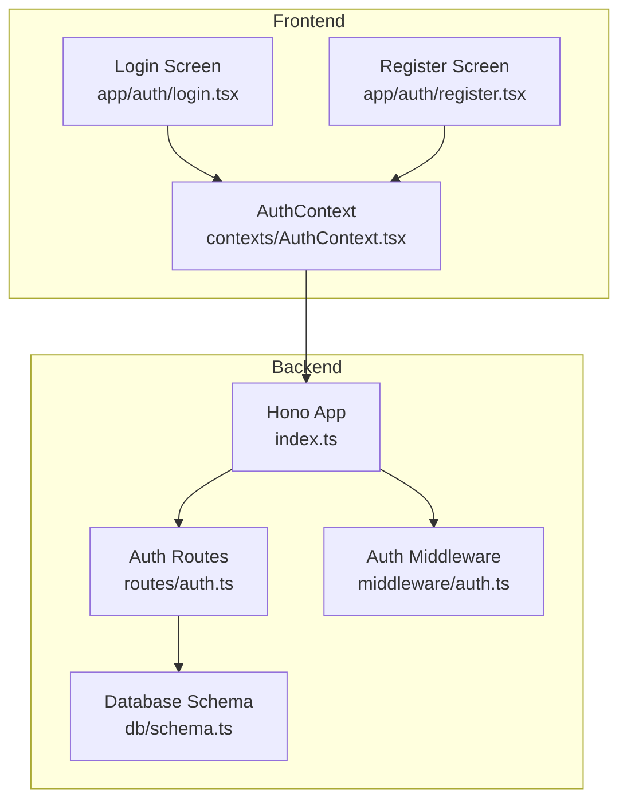
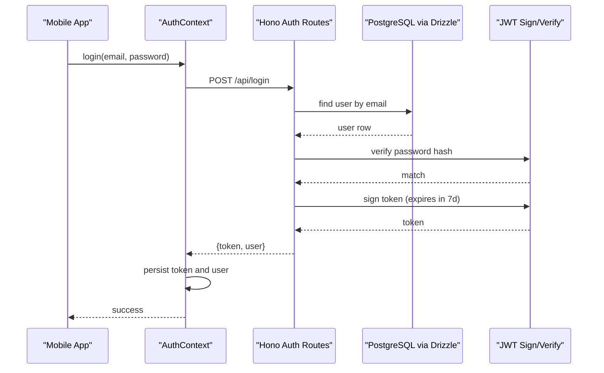
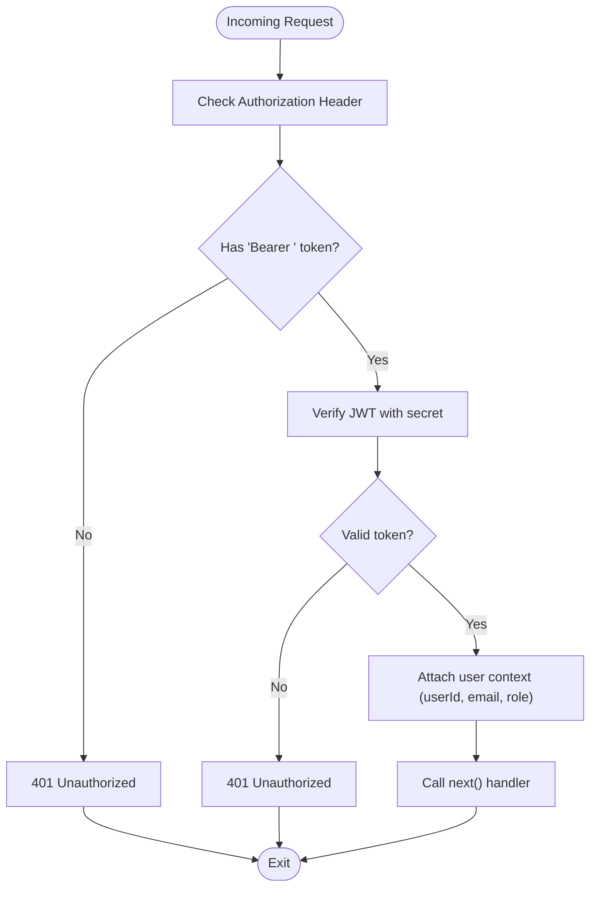
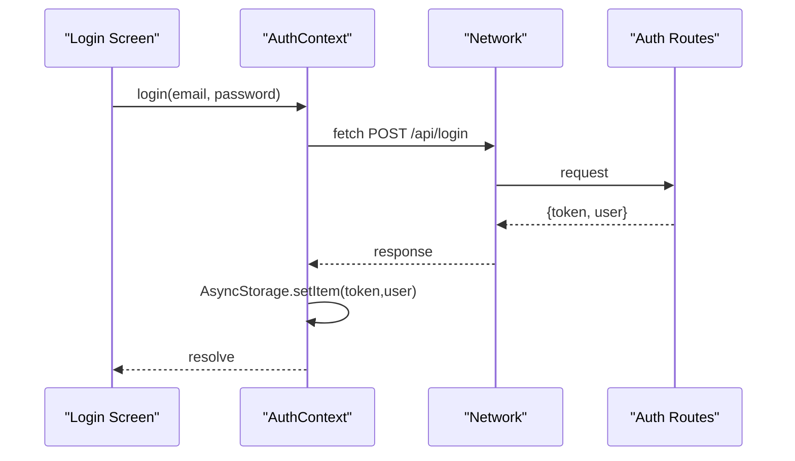
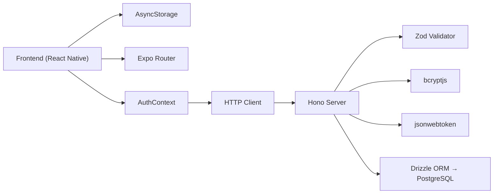

# Authentication API

<cite>
**Referenced Files in This Document**
- [auth.ts](file://backend/src/routes/auth.ts)
- [auth.ts](file://backend/src/middleware/auth.ts)
- [index.ts](file://backend/src/index.ts)
- [schema.ts](file://backend/src/db/schema.ts)
- [AuthContext.tsx](file://contexts/AuthContext.tsx)
- [login.tsx](file://app/auth/login.tsx)
- [register.tsx](file://app/auth/register.tsx)
- [package.json](file://backend/package.json)
</cite>

## Table of Contents
1. [Introduction](#introduction)
2. [Project Structure](#project-structure)
3. [Core Components](#core-components)
4. [Architecture Overview](#architecture-overview)
5. [Detailed Component Analysis](#detailed-component-analysis)
6. [Dependency Analysis](#dependency-analysis)
7. [Performance Considerations](#performance-considerations)
8. [Troubleshooting Guide](#troubleshooting-guide)
9. [Conclusion](#conclusion)

## Introduction
This document describes the authentication API for the Phoenix Loan application, covering login, registration, and JWT-based session management. It explains endpoint schemas, middleware behavior, client-side integration patterns, and security considerations. The backend is built with Hono and Drizzle ORM, while the frontend uses React Native with Expo and AsyncStorage for token persistence.

## Project Structure
The authentication system spans backend routes and middleware, database schema, and frontend authentication context and screens.

**Diagram sources**
- [index.ts:17-76](file://backend/src/index.ts#L17-L76)
- [auth.ts:10-146](file://backend/src/routes/auth.ts#L10-L146)
- [auth.ts:10-48](file://backend/src/middleware/auth.ts#L10-L48)
- [schema.ts:5-21](file://backend/src/db/schema.ts#L5-L21)
- [AuthContext.tsx:31-126](file://contexts/AuthContext.tsx#L31-L126)
- [login.tsx:80-134](file://app/auth/login.tsx#L80-L134)
- [register.tsx:178-250](file://app/auth/register.tsx#L178-L250)

**Section sources**
- [index.ts:17-76](file://backend/src/index.ts#L17-L76)
- [auth.ts:10-146](file://backend/src/routes/auth.ts#L10-L146)
- [auth.ts:10-48](file://backend/src/middleware/auth.ts#L10-L48)
- [schema.ts:5-21](file://backend/src/db/schema.ts#L5-L21)
- [AuthContext.tsx:31-126](file://contexts/AuthContext.tsx#L31-L126)
- [login.tsx:80-134](file://app/auth/login.tsx#L80-L134)
- [register.tsx:178-250](file://app/auth/register.tsx#L178-L250)

## Core Components
- Backend authentication routes:
  - POST /api/register: Validates input, checks for existing user, hashes password, inserts user record, and issues JWT.
  - POST /api/login: Finds user by email, verifies password, and issues JWT.
- Authentication middleware:
  - Extracts Authorization Bearer token, validates JWT, and attaches user context.
  - Admin-only middleware restricts access to admin role.
- Frontend authentication context:
  - Provides login, register, and logout functions.
  - Persists tokens and user data in AsyncStorage.
  - Uses EXPO_PUBLIC_API_URL for backend base URL.

**Section sources**
- [auth.ts:33-93](file://backend/src/routes/auth.ts#L33-L93)
- [auth.ts:96-143](file://backend/src/routes/auth.ts#L96-L143)
- [auth.ts:10-48](file://backend/src/middleware/auth.ts#L10-L48)
- [AuthContext.tsx:56-120](file://contexts/AuthContext.tsx#L56-L120)
- [index.ts:55-61](file://backend/src/index.ts#L55-L61)

## Architecture Overview
The authentication flow integrates frontend requests to backend endpoints, database persistence, and JWT issuance. Middleware enforces authorization on protected routes.

**Diagram sources**
- [login.tsx:101-134](file://app/auth/login.tsx#L101-L134)
- [AuthContext.tsx:56-79](file://contexts/AuthContext.tsx#L56-L79)
- [auth.ts:96-143](file://backend/src/routes/auth.ts#L96-L143)
- [schema.ts:5-21](file://backend/src/db/schema.ts#L5-L21)

## Detailed Component Analysis

### Authentication Endpoints

#### POST /api/register
- Purpose: Create a new user account with KYC fields.
- Request body schema:
  - email: string (required, valid email)
  - password: string (required, minimum length enforced)
  - fullName: string (required, minimum length enforced)
  - phone: string (optional)
  - dob: string (optional)
  - nationalId: string (optional)
  - district: string (optional)
  - area: string (optional)
  - employmentStatus: string (optional)
  - monthlyIncome: string (optional)
- Response:
  - 201 Created on success with fields: message, user (without password), token.
  - 400 Bad Request if email already exists.
  - 500 Internal Server Error on failure.
- Behavior:
  - Validates uniqueness of email.
  - Hashes password using bcrypt.
  - Inserts user with role=user and optional KYC fields.
  - Issues JWT with 7-day expiration.

**Section sources**
- [auth.ts:13-25](file://backend/src/routes/auth.ts#L13-L25)
- [auth.ts:33-93](file://backend/src/routes/auth.ts#L33-L93)
- [schema.ts:5-21](file://backend/src/db/schema.ts#L5-L21)

#### POST /api/login
- Purpose: Authenticate an existing user.
- Request body schema:
  - email: string (required, valid email)
  - password: string (required)
- Response:
  - 200 OK on success with fields: message, user (without password), token.
  - 401 Unauthorized if user not found or invalid credentials.
  - 500 Internal Server Error on failure.
- Behavior:
  - Finds user by email.
  - Compares password hash.
  - Issues JWT with 7-day expiration.

**Section sources**
- [auth.ts:27-30](file://backend/src/routes/auth.ts#L27-L30)
- [auth.ts:96-143](file://backend/src/routes/auth.ts#L96-L143)
- [schema.ts:5-21](file://backend/src/db/schema.ts#L5-L21)

### Authentication Middleware
- Purpose: Protect routes by validating Authorization header and JWT.
- Behavior:
  - Expects Authorization: Bearer <token>.
  - Verifies JWT using process.env.JWT_SECRET.
  - Attaches decoded user info (userId, email, role) to request context.
  - Returns 401 for missing/invalid tokens.
- Admin middleware:
  - Ensures role is admin; otherwise returns 403 Forbidden.

**Diagram sources**
- [auth.ts:10-36](file://backend/src/middleware/auth.ts#L10-L36)

**Section sources**
- [auth.ts:10-48](file://backend/src/middleware/auth.ts#L10-L48)

### Frontend Authentication Integration
- AuthContext:
  - login(email, password): Sends POST /api/login, stores token and user in AsyncStorage.
  - register(email, password, fullName, phone): Sends POST /api/register, stores token and user.
  - logout(): Removes token and user from AsyncStorage.
  - Loads persisted token/user on startup.
- Environment:
  - Uses EXPO_PUBLIC_API_URL for API base URL.
- Screens:
  - Login screen validates local fields and delegates to AuthContext.login.
  - Register screen collects KYC fields and calls AuthContext.register.

**Diagram sources**
- [login.tsx:101-134](file://app/auth/login.tsx#L101-L134)
- [AuthContext.tsx:56-79](file://contexts/AuthContext.tsx#L56-L79)

**Section sources**
- [AuthContext.tsx:56-120](file://contexts/AuthContext.tsx#L56-L120)
- [login.tsx:80-134](file://app/auth/login.tsx#L80-L134)
- [register.tsx:178-250](file://app/auth/register.tsx#L178-L250)

### Database Schema Notes
- Users table includes:
  - Unique email, password hash, role (default user), and KYC fields.
  - Optional flags like isBlacklisted.
- This schema supports the authentication routes and future admin features.

**Section sources**
- [schema.ts:5-21](file://backend/src/db/schema.ts#L5-L21)

## Dependency Analysis
- Backend runtime and libraries:
  - Hono for routing and middleware.
  - Zod and zod-validator for request validation.
  - bcryptjs for password hashing.
  - jsonwebtoken for JWT signing/verification.
  - Drizzle ORM with PostgreSQL adapter.
- Frontend runtime:
  - AsyncStorage for token persistence.
  - Expo Router for navigation.
  - Linear gradients and animations for UX.

**Diagram sources**
- [AuthContext.tsx:4-135](file://contexts/AuthContext.tsx#L4-L135)
- [auth.ts:1-10](file://backend/src/routes/auth.ts#L1-L10)
- [package.json:22-34](file://backend/package.json#L22-L34)

**Section sources**
- [package.json:22-34](file://backend/package.json#L22-L34)
- [AuthContext.tsx:4-135](file://contexts/AuthContext.tsx#L4-L135)
- [auth.ts:1-10](file://backend/src/routes/auth.ts#L1-L10)

## Performance Considerations
- Token lifetime: JWTs expire in 7 days, balancing usability and security.
- Password hashing cost: bcrypt is used with a standard salt round; consider monitoring DB query latency for auth-heavy periods.
- Middleware overhead: Single JWT verification per protected route; keep secrets and environment configuration secure.
- Frontend caching: Persisting tokens reduces repeated logins; ensure AsyncStorage reads/writes are batched during startup.

## Troubleshooting Guide
Common issues and resolutions:
- 401 Unauthorized on login:
  - Verify email exists and password matches hash.
  - Confirm Authorization header format: Bearer <token>.
- 400 Bad Request on register:
  - Ensure email is unique.
  - Confirm password meets minimum length requirement.
- CORS errors:
  - Ensure frontend origin is included in backend CORS configuration.
- JWT secret misconfiguration:
  - Confirm process.env.JWT_SECRET is set consistently across environments.
- AsyncStorage failures:
  - On startup, AuthContext loads persisted token/user; handle exceptions gracefully.

**Section sources**
- [auth.ts:42-44](file://backend/src/routes/auth.ts#L42-L44)
- [auth.ts:108-120](file://backend/src/routes/auth.ts#L108-L120)
- [auth.ts:14-16](file://backend/src/middleware/auth.ts#L14-L16)
- [index.ts:21-26](file://backend/src/index.ts#L21-L26)
- [AuthContext.tsx:40-54](file://contexts/AuthContext.tsx#L40-L54)

## Conclusion
The Phoenix Loan authentication system provides secure, standards-based login and registration with JWT-based sessions. The backend enforces validation and authorization, while the frontend persists tokens and orchestrates user flows. The current implementation does not include password reset, rate limiting, or brute force protection; these can be added incrementally to strengthen security.