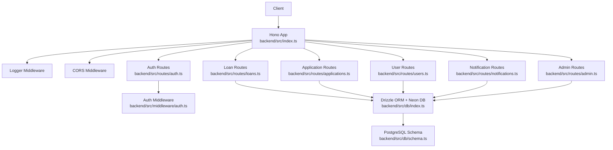
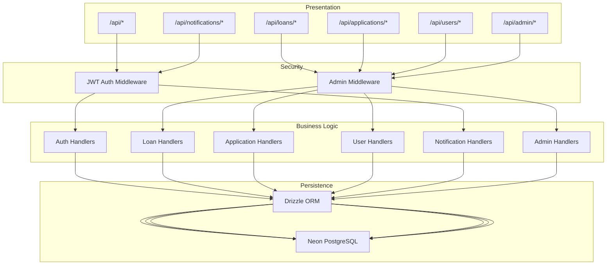
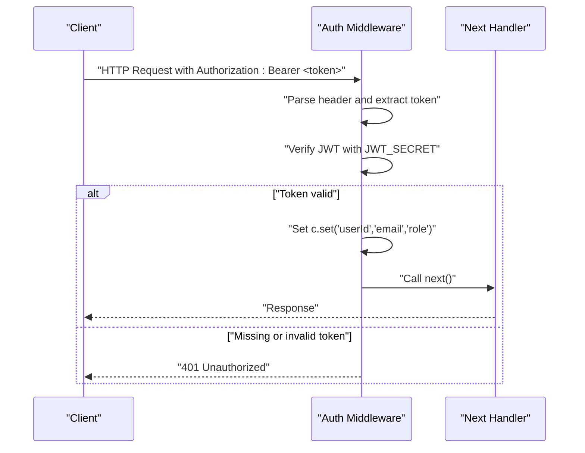
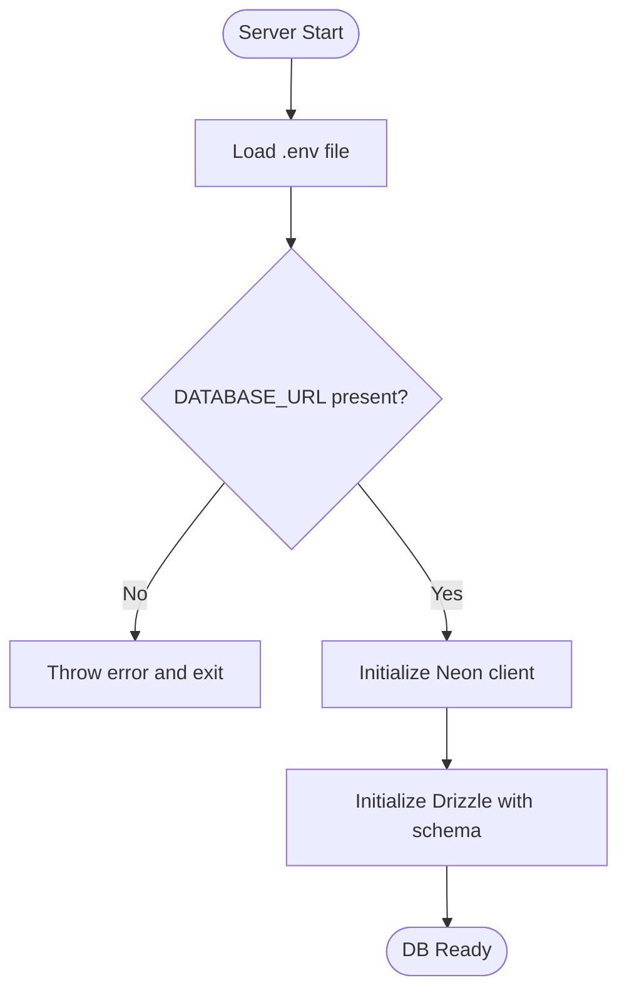
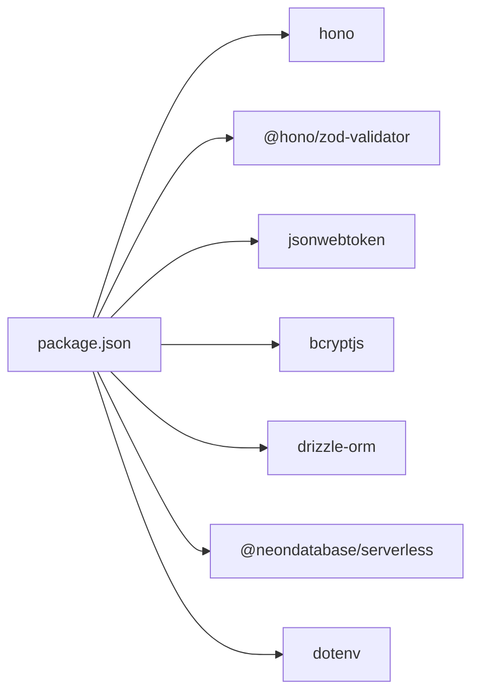
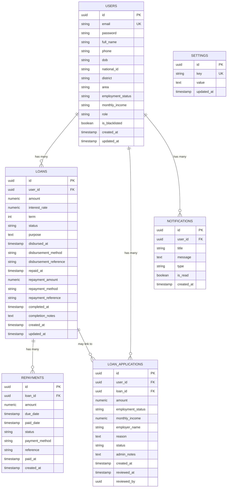

# Backend API

<cite>
**Referenced Files in This Document**
- [backend/src/index.ts](file://backend/src/index.ts)
- [backend/package.json](file://backend/package.json)
- [backend/src/middleware/auth.ts](file://backend/src/middleware/auth.ts)
- [backend/src/db/index.ts](file://backend/src/db/index.ts)
- [backend/src/db/schema.ts](file://backend/src/db/schema.ts)
- [backend/src/routes/auth.ts](file://backend/src/routes/auth.ts)
- [backend/src/routes/loans.ts](file://backend/src/routes/loans.ts)
- [backend/src/routes/applications.ts](file://backend/src/routes/applications.ts)
- [backend/src/routes/users.ts](file://backend/src/routes/users.ts)
- [backend/src/routes/notifications.ts](file://backend/src/routes/notifications.ts)
- [backend/src/routes/admin.ts](file://backend/src/routes/admin.ts)
- [backend/README.md](file://backend/README.md)
- [backend/drizzle.config.ts](file://backend/drizzle.config.ts)
- [backend/create-notifications-table.sql](file://backend/create-notifications-table.sql)
- [backend/add_loan_columns.sql](file://backend/add_loan_columns.sql)
</cite>

## Table of Contents
1. [Introduction](#introduction)
2. [Project Structure](#project-structure)
3. [Core Components](#core-components)
4. [Architecture Overview](#architecture-overview)
5. [Detailed Component Analysis](#detailed-component-analysis)
6. [Dependency Analysis](#dependency-analysis)
7. [Performance Considerations](#performance-considerations)
8. [Troubleshooting Guide](#troubleshooting-guide)
9. [Conclusion](#conclusion)
10. [Appendices](#appendices)

## Introduction
This document describes the Node.js backend API built with the Hono framework. It covers the RESTful API architecture, route organization, middleware for authentication and authorization, HTTP methods and URL patterns, request/response schemas, error handling strategies, authentication token usage, database connection management, request validation patterns, API versioning strategy, rate limiting, security measures, integration patterns with external services, webhook implementations, real-time communication protocols, performance optimization, monitoring, and debugging techniques.

## Project Structure
The backend is organized around a modular Hono application with separate route modules per domain, a shared database layer using Drizzle ORM with Neon PostgreSQL, and a JWT-based authentication middleware. Environment variables are loaded from a .env file, and OpenAPI/Swagger documentation is exposed via a dedicated endpoint and UI.

**Diagram sources**
- [backend/src/index.ts:17-76](file://backend/src/index.ts#L17-L76)
- [backend/src/routes/auth.ts:1-146](file://backend/src/routes/auth.ts#L1-L146)
- [backend/src/routes/loans.ts:1-320](file://backend/src/routes/loans.ts#L1-L320)
- [backend/src/routes/applications.ts:1-168](file://backend/src/routes/applications.ts#L1-L168)
- [backend/src/routes/users.ts:1-197](file://backend/src/routes/users.ts#L1-L197)
- [backend/src/routes/notifications.ts:1-106](file://backend/src/routes/notifications.ts#L1-L106)
- [backend/src/routes/admin.ts:1-140](file://backend/src/routes/admin.ts#L1-L140)
- [backend/src/middleware/auth.ts:1-48](file://backend/src/middleware/auth.ts#L1-L48)
- [backend/src/db/index.ts:1-44](file://backend/src/db/index.ts#L1-L44)
- [backend/src/db/schema.ts:1-146](file://backend/src/db/schema.ts#L1-L146)

**Section sources**
- [backend/src/index.ts:17-76](file://backend/src/index.ts#L17-L76)
- [backend/README.md:72-124](file://backend/README.md#L72-L124)

## Core Components
- Hono application bootstrap and middleware stack
- Route modules for authentication, loans, applications, users, notifications, and admin
- JWT-based authentication middleware and admin-only middleware
- Drizzle ORM configuration for Neon PostgreSQL
- OpenAPI/Swagger documentation endpoints

Key responsibilities:
- Central routing and middleware orchestration
- Domain-specific CRUD and administrative operations
- Token-based authentication and role checks
- Database connectivity and schema definitions
- Developer-friendly API docs via Swagger UI

**Section sources**
- [backend/src/index.ts:17-76](file://backend/src/index.ts#L17-L76)
- [backend/src/middleware/auth.ts:1-48](file://backend/src/middleware/auth.ts#L1-L48)
- [backend/src/db/index.ts:1-44](file://backend/src/db/index.ts#L1-L44)
- [backend/README.md:98-103](file://backend/README.md#L98-L103)

## Architecture Overview
The backend follows a layered architecture:
- Presentation Layer: Hono routes and middleware
- Business Logic Layer: Route handlers implementing domain logic
- Persistence Layer: Drizzle ORM with Neon PostgreSQL
- Security Layer: JWT verification and admin role enforcement

**Diagram sources**
- [backend/src/index.ts:55-61](file://backend/src/index.ts#L55-L61)
- [backend/src/middleware/auth.ts:10-47](file://backend/src/middleware/auth.ts#L10-L47)
- [backend/src/routes/auth.ts:1-146](file://backend/src/routes/auth.ts#L1-L146)
- [backend/src/routes/loans.ts:1-320](file://backend/src/routes/loans.ts#L1-L320)
- [backend/src/routes/applications.ts:1-168](file://backend/src/routes/applications.ts#L1-L168)
- [backend/src/routes/users.ts:1-197](file://backend/src/routes/users.ts#L1-L197)
- [backend/src/routes/notifications.ts:1-106](file://backend/src/routes/notifications.ts#L1-L106)
- [backend/src/routes/admin.ts:1-140](file://backend/src/routes/admin.ts#L1-L140)
- [backend/src/db/index.ts:40-43](file://backend/src/db/index.ts#L40-L43)

## Detailed Component Analysis

### Authentication Endpoints
- Base path: /api
- Methods and URLs:
  - POST /api/register
  - POST /api/login

- Request validation (Zod):
  - Register schema requires email, password, fullName; optional KYC fields
  - Login schema requires email and password

- Response formats:
  - On success: user object (without password) and JWT token
  - On failure: standardized error object with appropriate HTTP status

- Error handling:
  - 400 for invalid input or existing email during registration
  - 401 for invalid credentials during login
  - 500 for internal server errors

- Authentication token usage:
  - All protected endpoints require Authorization: Bearer <token> header

- Example interactions:
  - Registration: Send JSON payload to POST /api/register; receive token in response
  - Login: Send JSON payload to POST /api/login; receive token in response
  - Protected call: Include Authorization header with bearer token for subsequent requests

**Section sources**
- [backend/src/routes/auth.ts:13-30](file://backend/src/routes/auth.ts#L13-L30)
- [backend/src/routes/auth.ts:33-93](file://backend/src/routes/auth.ts#L33-L93)
- [backend/src/routes/auth.ts:96-143](file://backend/src/routes/auth.ts#L96-L143)
- [backend/README.md:115-124](file://backend/README.md#L115-L124)

### Loans Endpoints
- Base path: /api/loans
- Methods and URLs:
  - GET /api/loans (admin-only)
  - GET /api/loans/my-loans
  - GET /api/loans/:id
  - POST /api/loans
  - PATCH /api/loans/:id/status (admin-only)
  - PATCH /api/loans/:id/disburse (admin-only)
  - PATCH /api/loans/:id/repaid (admin-only)
  - PATCH /api/loans/:id/complete (admin-only)

- Request validation (Zod):
  - Create loan requires amount, interestRate, term; purpose optional

- Response formats:
  - Lists return arrays wrapped in objects (e.g., { loans: [...] })
  - Single resources return { loan: {...} } or similar
  - Status updates return { message, loan }

- Error handling:
  - 401 for unauthorized access (when X-User-Id is missing)
  - 404 for resource not found
  - 500 for internal server errors

- Authentication and authorization:
  - Some endpoints currently rely on X-User-Id header; future enhancement is to use JWT auth middleware consistently

- Example interactions:
  - List all loans: GET /api/loans with Authorization header (admin)
  - Get user’s loans: GET /api/loans/my-loans with Authorization header
  - Create loan: POST /api/loans with Authorization header and JSON payload
  - Update status: PATCH /api/loans/:id/status with Authorization header (admin)

**Section sources**
- [backend/src/routes/loans.ts:85-90](file://backend/src/routes/loans.ts#L85-L90)
- [backend/src/routes/loans.ts:93-113](file://backend/src/routes/loans.ts#L93-L113)
- [backend/src/routes/loans.ts:116-138](file://backend/src/routes/loans.ts#L116-L138)
- [backend/src/routes/loans.ts:141-168](file://backend/src/routes/loans.ts#L141-L168)
- [backend/src/routes/loans.ts:171-197](file://backend/src/routes/loans.ts#L171-L197)
- [backend/src/routes/loans.ts:200-222](file://backend/src/routes/loans.ts#L200-L222)
- [backend/src/routes/loans.ts:225-250](file://backend/src/routes/loans.ts#L225-L250)
- [backend/src/routes/loans.ts:253-290](file://backend/src/routes/loans.ts#L253-L290)
- [backend/src/routes/loans.ts:293-317](file://backend/src/routes/loans.ts#L293-L317)

### Applications Endpoints
- Base path: /api/applications
- Methods and URLs:
  - GET /api/applications (admin-only)
  - GET /api/applications/my-applications
  - GET /api/applications/:id
  - POST /api/applications
  - PATCH /api/applications/:id/review (admin-only)

- Request validation (Zod):
  - Create application requires amount, employmentStatus, monthlyIncome, reason; employerName optional
  - Review application requires status enum and optional adminNotes

- Response formats:
  - Lists return { applications: [...] }
  - Single resources return { application: {...} }
  - Reviews return { message, application }

- Error handling:
  - 401 for unauthorized access (when X-User-Id is missing)
  - 404 for application not found
  - 500 for internal server errors

- Authentication and authorization:
  - Similar to loans, endpoints currently rely on X-User-Id header; planned migration to JWT auth middleware

- Example interactions:
  - List all applications: GET /api/applications with Authorization header (admin)
  - Get user’s applications: GET /api/applications/my-applications with Authorization header
  - Submit application: POST /api/applications with Authorization header and JSON payload
  - Review application: PATCH /api/applications/:id/review with Authorization header (admin)

**Section sources**
- [backend/src/routes/applications.ts:11-17](file://backend/src/routes/applications.ts#L11-L17)
- [backend/src/routes/applications.ts:19-22](file://backend/src/routes/applications.ts#L19-L22)
- [backend/src/routes/applications.ts:25-53](file://backend/src/routes/applications.ts#L25-L53)
- [backend/src/routes/applications.ts:56-77](file://backend/src/routes/applications.ts#L56-L77)
- [backend/src/routes/applications.ts:80-108](file://backend/src/routes/applications.ts#L80-L108)
- [backend/src/routes/applications.ts:111-138](file://backend/src/routes/applications.ts#L111-L138)
- [backend/src/routes/applications.ts:141-165](file://backend/src/routes/applications.ts#L141-L165)

### Users Endpoints
- Base path: /api/users
- Methods and URLs:
  - GET /api/users (admin-only)
  - GET /api/users/profile
  - PUT /api/users/profile
  - GET /api/users/:id (admin-only)
  - PUT /api/users/:id/blacklist (admin-only)
  - PUT /api/users/:id/password (admin-only)

- Response formats:
  - Lists return { users: [...] }
  - Single user returns { user: {...} }
  - Profile updates return { message, user }

- Error handling:
  - 401 for unauthorized access (when X-User-Id is missing)
  - 404 for user not found
  - 500 for internal server errors

- Authentication and authorization:
  - Profile and user-specific endpoints rely on X-User-Id header; admin-only endpoints require admin role

- Example interactions:
  - List all users: GET /api/users with Authorization header (admin)
  - Get profile: GET /api/users/profile with Authorization header
  - Update profile: PUT /api/users/profile with Authorization header and JSON payload
  - Toggle blacklist: PUT /api/users/:id/blacklist with Authorization header (admin)
  - Update password: PUT /api/users/:id/password with Authorization header (admin)

**Section sources**
- [backend/src/routes/users.ts:8-39](file://backend/src/routes/users.ts#L8-L39)
- [backend/src/routes/users.ts:42-70](file://backend/src/routes/users.ts#L42-L70)
- [backend/src/routes/users.ts:73-107](file://backend/src/routes/users.ts#L73-L107)
- [backend/src/routes/users.ts:109-134](file://backend/src/routes/users.ts#L109-L134)
- [backend/src/routes/users.ts:137-161](file://backend/src/routes/users.ts#L137-L161)
- [backend/src/routes/users.ts:166-194](file://backend/src/routes/users.ts#L166-L194)

### Notifications Endpoints
- Base path: /api/notifications
- Methods and URLs:
  - GET /api/notifications
  - PATCH /api/notifications/:id/read
  - PATCH /api/notifications/read-all
  - POST /api/notifications
  - DELETE /api/notifications/read (admin-only)

- Response formats:
  - Lists return { notifications: [...], unreadCount }
  - Read operations return { message }
  - Creation returns { notification }

- Error handling:
  - 401 for unauthorized access (when X-User-Id is missing)
  - 500 for internal server errors

- Authentication and authorization:
  - Currently relies on X-User-Id header; planned migration to JWT auth middleware

- Example interactions:
  - Get notifications: GET /api/notifications with Authorization header
  - Mark as read: PATCH /api/notifications/:id/read with Authorization header
  - Mark all read: PATCH /api/notifications/read-all with Authorization header
  - Create notification: POST /api/notifications with Authorization header and JSON payload
  - Clear read notifications: DELETE /api/notifications/read with Authorization header (admin)

**Section sources**
- [backend/src/routes/notifications.ts:8-33](file://backend/src/routes/notifications.ts#L8-L33)
- [backend/src/routes/notifications.ts:35-49](file://backend/src/routes/notifications.ts#L35-L49)
- [backend/src/routes/notifications.ts:51-69](file://backend/src/routes/notifications.ts#L51-L69)
- [backend/src/routes/notifications.ts:72-90](file://backend/src/routes/notifications.ts#L72-L90)
- [backend/src/routes/notifications.ts:92-103](file://backend/src/routes/notifications.ts#L92-L103)

### Admin Endpoints
- Base path: /api/admin
- Methods and URLs:
  - GET /api/admin/users
  - GET /api/admin/loans
  - GET /api/admin/stats
  - GET /api/admin/settings
  - PUT /api/admin/settings

- Response formats:
  - Users list returns transformed user objects with computed fields
  - Loans list returns applications with user metadata
  - Stats returns aggregated metrics
  - Settings returns key-value pairs parsed from JSON strings

- Error handling:
  - 500 for internal server errors

- Authentication and authorization:
  - Admin-only endpoints require admin role

- Example interactions:
  - Get users: GET /api/admin/users with Authorization header (admin)
  - Get loans: GET /api/admin/loans with Authorization header (admin)
  - Get stats: GET /api/admin/stats with Authorization header (admin)
  - Get settings: GET /api/admin/settings with Authorization header (admin)
  - Update settings: PUT /api/admin/settings with Authorization header (admin)

**Section sources**
- [backend/src/routes/admin.ts:8-35](file://backend/src/routes/admin.ts#L8-L35)
- [backend/src/routes/admin.ts:37-61](file://backend/src/routes/admin.ts#L37-L61)
- [backend/src/routes/admin.ts:63-94](file://backend/src/routes/admin.ts#L63-L94)
- [backend/src/routes/admin.ts:96-113](file://backend/src/routes/admin.ts#L96-L113)
- [backend/src/routes/admin.ts:116-137](file://backend/src/routes/admin.ts#L116-L137)

### Authentication Middleware
- Purpose: Extract Authorization header, verify JWT, set user context variables, enforce admin role when required
- Behavior:
  - Rejects missing or malformed Authorization headers
  - Verifies JWT using JWT_SECRET
  - Sets c.set('userId', 'email', 'role') for downstream handlers
  - Returns 401 for invalid tokens and 500 for unexpected errors
  - Admin middleware checks role equals 'admin'

**Diagram sources**
- [backend/src/middleware/auth.ts:10-36](file://backend/src/middleware/auth.ts#L10-L36)

**Section sources**
- [backend/src/middleware/auth.ts:10-47](file://backend/src/middleware/auth.ts#L10-L47)

### Database Connection Management
- Drizzle ORM configured with Neon HTTP client
- Environment variable DATABASE_URL loaded from .env
- Schema module defines tables and relations
- Migration and schema generation supported via drizzle-kit

**Diagram sources**
- [backend/src/db/index.ts:9-43](file://backend/src/db/index.ts#L9-L43)

**Section sources**
- [backend/src/db/index.ts:9-43](file://backend/src/db/index.ts#L9-L43)
- [backend/drizzle.config.ts:1-14](file://backend/drizzle.config.ts#L1-L14)
- [backend/src/db/schema.ts:1-146](file://backend/src/db/schema.ts#L1-L146)

### Request Validation Patterns
- Zod schemas define strict request shapes for endpoints
- @hono/zod-validator enforces validation before handler execution
- Validation errors propagate as structured error responses

Examples of validated endpoints:
- Authentication: register and login schemas
- Loans: create loan schema
- Applications: create and review application schemas
- Users: profile update endpoint
- Notifications: create notification endpoint

**Section sources**
- [backend/src/routes/auth.ts:13-30](file://backend/src/routes/auth.ts#L13-L30)
- [backend/src/routes/loans.ts:85-90](file://backend/src/routes/loans.ts#L85-L90)
- [backend/src/routes/applications.ts:11-17](file://backend/src/routes/applications.ts#L11-L17)
- [backend/src/routes/applications.ts:19-22](file://backend/src/routes/applications.ts#L19-L22)
- [backend/src/routes/users.ts:77-77](file://backend/src/routes/users.ts#L77-L77)
- [backend/src/routes/notifications.ts:78-78](file://backend/src/routes/notifications.ts#L78-L78)

### API Versioning Strategy
- Current base path: /api
- No explicit version segment in URLs
- Suggested approach: Introduce /api/v1 and keep /api as alias for current version

**Section sources**
- [backend/src/index.ts:55-61](file://backend/src/index.ts#L55-L61)

### Rate Limiting
- Not implemented in current codebase
- Recommended: Integrate a rate-limiting middleware for production deployments

**Section sources**
- [backend/README.md:147-148](file://backend/README.md#L147-L148)

### Security Measures
- JWT-based authentication with bcrypt for password hashing
- Admin-only endpoints enforced by role checks
- CORS configured for allowed origins and methods
- Input validation with Zod
- Environment variables for secrets and configuration

**Section sources**
- [backend/src/middleware/auth.ts:10-47](file://backend/src/middleware/auth.ts#L10-L47)
- [backend/src/index.ts:21-26](file://backend/src/index.ts#L21-L26)
- [backend/README.md:142-148](file://backend/README.md#L142-L148)

### Integration Patterns with External Services
- Neon PostgreSQL for relational data persistence
- Drizzle ORM for type-safe database operations
- JWT for stateless authentication
- Zod for runtime validation

**Section sources**
- [backend/src/db/index.ts:40-43](file://backend/src/db/index.ts#L40-L43)
- [backend/package.json:22-35](file://backend/package.json#L22-L35)

### Webhook Implementations
- No webhook endpoints implemented in current codebase
- Suggested pattern: Add POST endpoints under /webhooks/<service> with signature verification

**Section sources**
- [backend/src/index.ts:55-61](file://backend/src/index.ts#L55-L61)

### Real-Time Communication Protocols
- No WebSocket or server-sent events endpoints implemented
- Suggested pattern: Integrate a WebSocket library for real-time features

**Section sources**
- [backend/src/index.ts:55-61](file://backend/src/index.ts#L55-L61)

## Dependency Analysis
External dependencies relevant to API functionality:
- Hono for routing and middleware
- @hono/zod-validator for request validation
- jsonwebtoken for JWT operations
- bcryptjs for password hashing
- drizzle-orm with @neondatabase/serverless for database access
- dotenv for environment configuration

**Diagram sources**
- [backend/package.json:22-35](file://backend/package.json#L22-L35)

**Section sources**
- [backend/package.json:22-35](file://backend/package.json#L22-L35)

## Performance Considerations
- Use pagination for large lists (e.g., notifications limit)
- Indexes recommended for frequently queried columns (see SQL script)
- Minimize payload sizes by selecting only required columns
- Consider caching for read-heavy endpoints
- Monitor database query performance and optimize slow queries

**Section sources**
- [backend/src/routes/notifications.ts:20-20](file://backend/src/routes/notifications.ts#L20-L20)
- [backend/create-notifications-table.sql:19-23](file://backend/create-notifications-table.sql#L19-L23)

## Troubleshooting Guide
Common issues and resolutions:
- Database connection errors:
  - Verify DATABASE_URL in .env
  - Ensure Neon project is active and IP is whitelisted
- Port already in use:
  - Change PORT in .env or kill the process using the port
- CORS errors:
  - Add frontend URL to allowed origins in CORS config
- Authentication failures:
  - Ensure Authorization: Bearer <token> header is present
  - Verify JWT_SECRET matches server configuration

**Section sources**
- [backend/src/db/index.ts:33-38](file://backend/src/db/index.ts#L33-L38)
- [backend/README.md:158-172](file://backend/README.md#L158-L172)

## Conclusion
The backend provides a solid foundation for a loan management system with clear separation of concerns, robust authentication, and comprehensive documentation. Future enhancements should focus on migrating from X-User-Id headers to JWT auth middleware, adding rate limiting, implementing webhooks and real-time features, and expanding monitoring and debugging capabilities.

## Appendices

### API Documentation Endpoints
- OpenAPI spec: GET /doc
- Swagger UI: GET /docs

**Section sources**
- [backend/src/index.ts:34-52](file://backend/src/index.ts#L34-L52)
- [backend/README.md:98-103](file://backend/README.md#L98-L103)

### Database Schema Overview
Tables and relationships:
- users: primary table for user accounts
- loans: loan records linked to users
- loan_applications: application records linked to users and optional loans
- repayments: repayment records linked to loans
- notifications: user-specific notifications
- settings: key-value configuration storage

**Diagram sources**
- [backend/src/db/schema.ts:4-146](file://backend/src/db/schema.ts#L4-L146)

### Database Migration and Schema Updates
- Drizzle kit configuration for migrations
- SQL scripts for notifications table and loan columns
- Recommended workflow: modify schema.ts, run db:generate, review migrations, then db:push

**Section sources**
- [backend/drizzle.config.ts:1-14](file://backend/drizzle.config.ts#L1-L14)
- [backend/create-notifications-table.sql:1-30](file://backend/create-notifications-table.sql#L1-L30)
- [backend/add_loan_columns.sql:1-12](file://backend/add_loan_columns.sql#L1-L12)