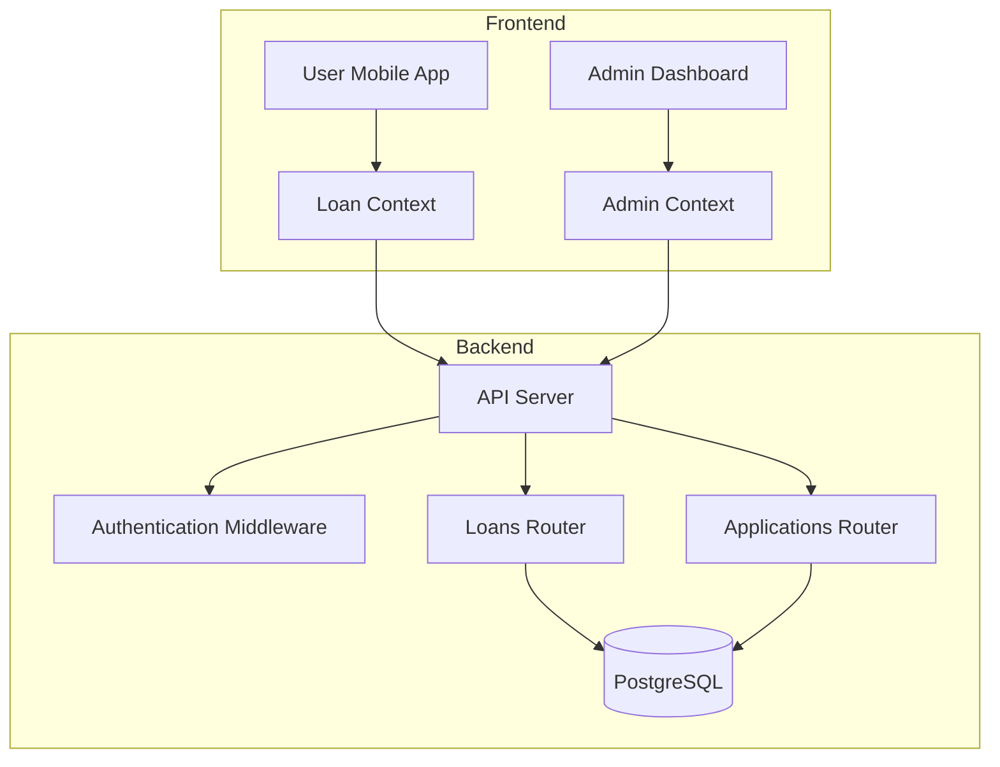
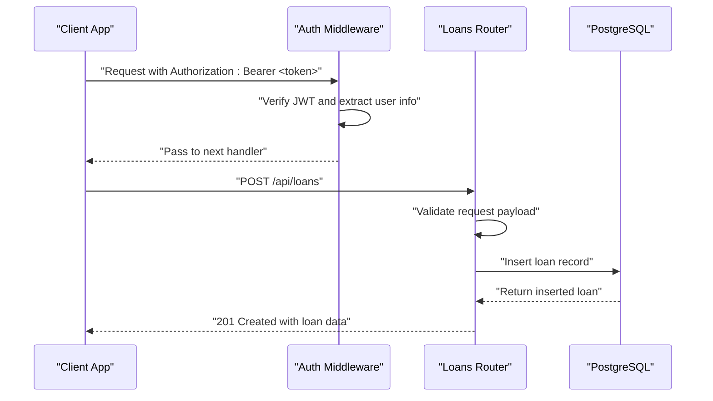
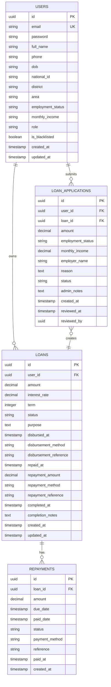
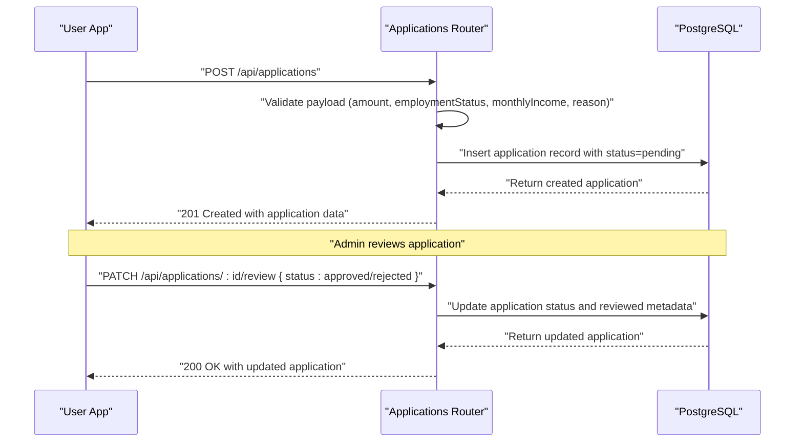
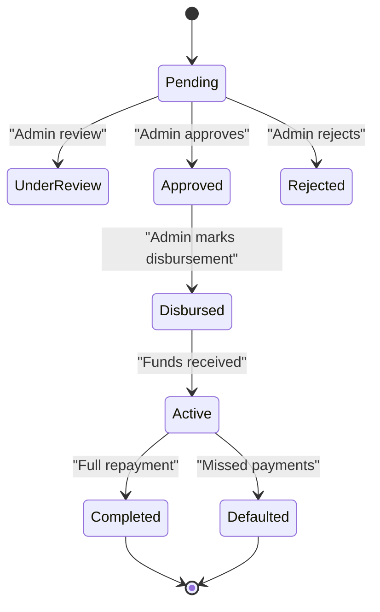
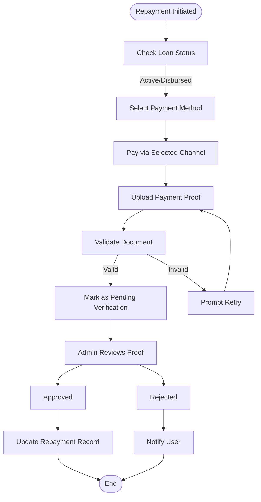
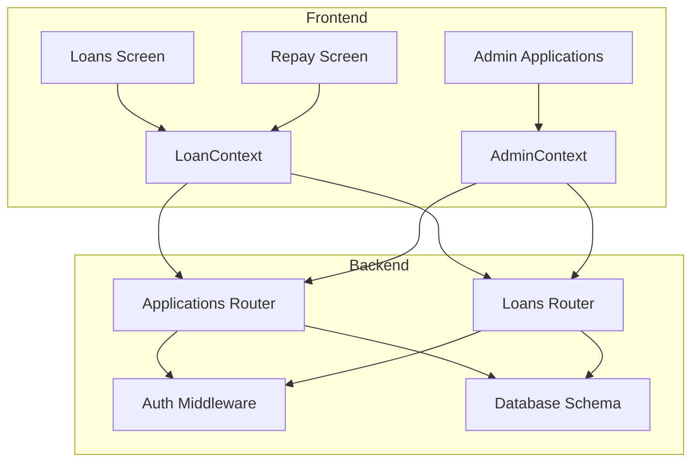

# Loan Management API

<cite>
**Referenced Files in This Document**
- [backend/src/routes/loans.ts](file://backend/src/routes/loans.ts)
- [backend/src/routes/applications.ts](file://backend/src/routes/applications.ts)
- [backend/src/db/schema.ts](file://backend/src/db/schema.ts)
- [backend/src/middleware/auth.ts](file://backend/src/middleware/auth.ts)
- [backend/src/index.ts](file://backend/src/index.ts)
- [contexts/LoanContext.tsx](file://contexts/LoanContext.tsx)
- [contexts/AdminContext.tsx](file://contexts/AdminContext.tsx)
- [app/(tabs)/loans.tsx](file://app/(tabs)/loans.tsx)
- [app/(tabs)/repay.tsx](file://app/(tabs)/repay.tsx)
- [app/admin/(tabs)/applications.tsx](file://app/admin/(tabs)/applications.tsx)
- [backend/README.md](file://backend/README.md)
</cite>

## Table of Contents
1. [Introduction](#introduction)
2. [Project Structure](#project-structure)
3. [Core Components](#core-components)
4. [Architecture Overview](#architecture-overview)
5. [Detailed Component Analysis](#detailed-component-analysis)
6. [Dependency Analysis](#dependency-analysis)
7. [Performance Considerations](#performance-considerations)
8. [Troubleshooting Guide](#troubleshooting-guide)
9. [Conclusion](#conclusion)

## Introduction
This document provides comprehensive API documentation for the loan management system, focusing on application submission, status tracking, and repayment management. It covers HTTP endpoints, request/response schemas, validation rules, business logic constraints, and integration points with the frontend application and payment processing systems.

## Project Structure
The loan management system consists of:
- Backend API built with Hono, using Drizzle ORM and PostgreSQL
- Frontend mobile application with React Native and Expo
- Admin dashboard for loan administration
- Authentication middleware supporting JWT tokens

**Diagram sources**
- [backend/src/index.ts:54-61](file://backend/src/index.ts#L54-L61)
- [backend/src/middleware/auth.ts:10-36](file://backend/src/middleware/auth.ts#L10-L36)
- [backend/src/routes/loans.ts:84-90](file://backend/src/routes/loans.ts#L84-L90)
- [backend/src/routes/applications.ts:10-17](file://backend/src/routes/applications.ts#L10-L17)

**Section sources**
- [backend/src/index.ts:17-61](file://backend/src/index.ts#L17-L61)
- [backend/README.md:72-113](file://backend/README.md#L72-L113)

## Core Components
This section outlines the primary loan-related endpoints and their responsibilities.

- Application Submission
  - POST /api/applications: Submit a new loan application with validation for amount, employment status, monthly income, and reason.
  - GET /api/applications/my-applications: Retrieve the authenticated user's applications.
  - GET /api/applications/:id: Fetch a specific application by ID.
  - PATCH /api/applications/:id/review: Update application status (admin-only).

- Loan Status Tracking
  - GET /api/loans: Retrieve all loans (admin-only).
  - GET /api/loans/my-loans: Fetch the authenticated user's loans.
  - GET /api/loans/:id: Get a specific loan by ID.
  - PATCH /api/loans/:id/status: Update loan status (admin-only).

- Repayment Management
  - PATCH /api/loans/:id/disburse: Mark a loan as disbursed with disbursement details.
  - PATCH /api/loans/:id/repaid: Mark a loan as repaid with repayment details.
  - PATCH /api/loans/:id/complete: Mark a loan as completed with completion notes.

- Authentication and Authorization
  - All protected endpoints require a JWT token in the Authorization header.
  - Admin-only endpoints require the role claim to be "admin".

**Section sources**
- [backend/src/routes/applications.ts:11-17](file://backend/src/routes/applications.ts#L11-L17)
- [backend/src/routes/applications.ts:110-138](file://backend/src/routes/applications.ts#L110-L138)
- [backend/src/routes/applications.ts:140-165](file://backend/src/routes/applications.ts#L140-L165)
- [backend/src/routes/loans.ts:84-90](file://backend/src/routes/loans.ts#L84-L90)
- [backend/src/routes/loans.ts:170-197](file://backend/src/routes/loans.ts#L170-L197)
- [backend/src/routes/loans.ts:224-250](file://backend/src/routes/loans.ts#L224-L250)
- [backend/src/routes/loans.ts:252-290](file://backend/src/routes/loans.ts#L252-L290)
- [backend/src/routes/loans.ts:292-317](file://backend/src/routes/loans.ts#L292-L317)
- [backend/src/middleware/auth.ts:10-36](file://backend/src/middleware/auth.ts#L10-L36)

## Architecture Overview
The system follows a client-server architecture with clear separation of concerns:
- Frontend clients (user and admin apps) communicate with the backend via RESTful endpoints.
- Authentication middleware validates JWT tokens and sets user context.
- Database schema defines normalized tables for users, loans, applications, repayments, and notifications.
- Business logic is encapsulated in route handlers with input validation using Zod.

**Diagram sources**
- [backend/src/middleware/auth.ts:10-36](file://backend/src/middleware/auth.ts#L10-L36)
- [backend/src/routes/loans.ts:170-197](file://backend/src/routes/loans.ts#L170-L197)
- [backend/src/db/schema.ts:23-46](file://backend/src/db/schema.ts#L23-L46)

**Section sources**
- [backend/src/index.ts:19-26](file://backend/src/index.ts#L19-L26)
- [backend/src/middleware/auth.ts:10-36](file://backend/src/middleware/auth.ts#L10-L36)
- [backend/src/routes/loans.ts:170-197](file://backend/src/routes/loans.ts#L170-L197)

## Detailed Component Analysis

### Loan Data Models
The backend defines normalized database tables for loans, applications, repayments, and users. These models drive the API schemas and ensure data consistency.

**Diagram sources**
- [backend/src/db/schema.ts:4-88](file://backend/src/db/schema.ts#L4-L88)

**Section sources**
- [backend/src/db/schema.ts:23-77](file://backend/src/db/schema.ts#L23-L77)

### Application Submission Workflow
This workflow covers the multi-step process from application creation to status updates.

**Diagram sources**
- [backend/src/routes/applications.ts:110-138](file://backend/src/routes/applications.ts#L110-L138)
- [backend/src/routes/applications.ts:140-165](file://backend/src/routes/applications.ts#L140-L165)

**Section sources**
- [backend/src/routes/applications.ts:110-165](file://backend/src/routes/applications.ts#L110-L165)

### Loan Status Tracking and Transitions
The loan lifecycle includes status transitions from pending to disbursed, active, and completed.

**Diagram sources**
- [backend/src/routes/loans.ts:224-250](file://backend/src/routes/loans.ts#L224-L250)
- [backend/src/routes/loans.ts:252-290](file://backend/src/routes/loans.ts#L252-L290)
- [backend/src/routes/loans.ts:292-317](file://backend/src/routes/loans.ts#L292-L317)

**Section sources**
- [backend/src/routes/loans.ts:224-317](file://backend/src/routes/loans.ts#L224-L317)

### Repayment Scheduling and Document Upload Handling
The repayment flow integrates with payment channels and document upload for proof verification.

**Diagram sources**
- [app/(tabs)/repay.tsx](file://app/(tabs)/repay.tsx#L238-L260)
- [contexts/LoanContext.tsx:263-273](file://contexts/LoanContext.tsx#L263-L273)

**Section sources**
- [app/(tabs)/repay.tsx](file://app/(tabs)/repay.tsx#L238-L260)
- [contexts/LoanContext.tsx:263-273](file://contexts/LoanContext.tsx#L263-L273)

### API Endpoints Reference

#### Applications
- POST /api/applications
  - Request body: { amount: string, employmentStatus: string, monthlyIncome: string, employerName?: string, reason: string }
  - Response: 201 Created with application data
  - Validation: Zod schema enforces presence and types
  - Headers: X-User-Id (temporary; later replaced by JWT)

- GET /api/applications/my-applications
  - Response: 200 OK with array of applications
  - Headers: X-User-Id (temporary)

- GET /api/applications/:id
  - Response: 200 OK with application data or 404 Not Found

- PATCH /api/applications/:id/review
  - Request body: { status: enum('pending','under_review','approved','rejected'), adminNotes?: string }
  - Response: 200 OK with updated application
  - Validation: Zod schema restricts status to allowed values

**Section sources**
- [backend/src/routes/applications.ts:11-17](file://backend/src/routes/applications.ts#L11-L17)
- [backend/src/routes/applications.ts:55-77](file://backend/src/routes/applications.ts#L55-L77)
- [backend/src/routes/applications.ts:79-108](file://backend/src/routes/applications.ts#L79-L108)
- [backend/src/routes/applications.ts:140-165](file://backend/src/routes/applications.ts#L140-L165)

#### Loans
- GET /api/loans
  - Response: 200 OK with array of loans (admin-only)
  - Requires: Authorization: Bearer <token>, role=admin

- GET /api/loans/my-loans
  - Response: 200 OK with user's loans
  - Headers: X-User-Id (temporary)

- GET /api/loans/:id
  - Response: 200 OK with loan data or 404 Not Found

- POST /api/loans
  - Request body: { amount: string, interestRate: string, term: number, purpose?: string }
  - Response: 201 Created with loan data
  - Validation: Zod schema for amount, interestRate, term, purpose

- PATCH /api/loans/:id/status
  - Request body: { status: string }
  - Response: 200 OK with updated loan
  - Requires: Authorization: Bearer <token>, role=admin

- PATCH /api/loans/:id/disburse
  - Request body: { disbursementMethod: string, disbursementReference: string }
  - Response: 200 OK with updated loan
  - Sets status to "disbursed" and timestamps disbursement fields

- PATCH /api/loans/:id/repaid
  - Request body: { repaymentAmount: number, repaymentMethod: string, repaymentReference: string }
  - Response: 200 OK with updated loan
  - Creates a repayment record and sets status to "completed"

- PATCH /api/loans/:id/complete
  - Request body: { completionNotes: string }
  - Response: 200 OK with updated loan
  - Sets status to "completed" and timestamps completion fields

**Section sources**
- [backend/src/routes/loans.ts:84-90](file://backend/src/routes/loans.ts#L84-L90)
- [backend/src/routes/loans.ts:92-113](file://backend/src/routes/loans.ts#L92-L113)
- [backend/src/routes/loans.ts:115-138](file://backend/src/routes/loans.ts#L115-L138)
- [backend/src/routes/loans.ts:140-168](file://backend/src/routes/loans.ts#L140-L168)
- [backend/src/routes/loans.ts:170-197](file://backend/src/routes/loans.ts#L170-L197)
- [backend/src/routes/loans.ts:199-222](file://backend/src/routes/loans.ts#L199-L222)
- [backend/src/routes/loans.ts:224-250](file://backend/src/routes/loans.ts#L224-L250)
- [backend/src/routes/loans.ts:252-290](file://backend/src/routes/loans.ts#L252-L290)
- [backend/src/routes/loans.ts:292-317](file://backend/src/routes/loans.ts#L292-L317)

### Validation Rules and Business Logic Constraints
- Input Validation
  - Applications: amount (string), employmentStatus (string), monthlyIncome (string), employerName (optional string), reason (string)
  - Loans: amount (string), interestRate (string), term (number), purpose (optional string)
  - Reviews: status restricted to ('pending','under_review','approved','rejected')

- Business Rules
  - Status transitions are enforced by route handlers; admin role required for status updates and disbursement/repayment/completion.
  - Disbursement sets status to "disbursed" and populates disbursement fields.
  - Repayment triggers creation of a repayment record and sets loan status to "completed".
  - Completion requires admin notes and timestamps completion fields.

**Section sources**
- [backend/src/routes/applications.ts:11-17](file://backend/src/routes/applications.ts#L11-L17)
- [backend/src/routes/loans.ts:84-90](file://backend/src/routes/loans.ts#L84-L90)
- [backend/src/routes/loans.ts:224-250](file://backend/src/routes/loans.ts#L224-L250)
- [backend/src/routes/loans.ts:252-290](file://backend/src/routes/loans.ts#L252-L290)
- [backend/src/routes/loans.ts:292-317](file://backend/src/routes/loans.ts#L292-L317)

### Integration with Payment Processing Systems
- Payment Methods
  - Airtel Money, TNM Mpamba, Bank Transfer (National Bank of Malawi)
  - Instructions and account details embedded in the repayment screen
- Document Upload
  - Image picker integration for uploading payment proof
  - Accepted formats: JPG, PNG, PDF screenshots
- Admin Workflows
  - Admin can mark loans as disbursed and repaid with payment metadata
  - Notifications sent to users upon approval and completion

**Section sources**
- [app/(tabs)/repay.tsx](file://app/(tabs)/repay.tsx#L17-L59)
- [app/(tabs)/repay.tsx](file://app/(tabs)/repay.tsx#L238-L260)
- [contexts/AdminContext.tsx:363-413](file://contexts/AdminContext.tsx#L363-L413)

## Dependency Analysis
The loan management system exhibits clear separation of concerns with explicit dependencies between frontend contexts and backend routes.

**Diagram sources**
- [contexts/LoanContext.tsx:198-261](file://contexts/LoanContext.tsx#L198-L261)
- [contexts/AdminContext.tsx:311-413](file://contexts/AdminContext.tsx#L311-L413)
- [backend/src/routes/applications.ts:110-138](file://backend/src/routes/applications.ts#L110-L138)
- [backend/src/routes/loans.ts:170-197](file://backend/src/routes/loans.ts#L170-L197)
- [backend/src/middleware/auth.ts:10-36](file://backend/src/middleware/auth.ts#L10-L36)
- [backend/src/db/schema.ts:23-77](file://backend/src/db/schema.ts#L23-L77)

**Section sources**
- [contexts/LoanContext.tsx:198-261](file://contexts/LoanContext.tsx#L198-L261)
- [contexts/AdminContext.tsx:311-413](file://contexts/AdminContext.tsx#L311-L413)
- [backend/src/routes/applications.ts:110-138](file://backend/src/routes/applications.ts#L110-L138)
- [backend/src/routes/loans.ts:170-197](file://backend/src/routes/loans.ts#L170-L197)

## Performance Considerations
- Database Indexes
  - UUID primary keys on users, loans, applications, and repayments
  - Foreign key constraints for referential integrity
- Query Patterns
  - FindMany queries with ordering by createdAt descending for recent items
  - Conditional filtering by userId for user-specific data
- Caching
  - Frontend uses AsyncStorage for offline-first behavior
  - Admin dashboard caches data locally and refreshes from backend

## Troubleshooting Guide
Common issues and resolutions:
- Unauthorized Access
  - Ensure Authorization header contains a valid JWT token
  - Admin endpoints require role=admin
- Validation Errors
  - Verify request payloads match Zod schemas for applications and loans
  - Check required fields and data types
- Database Connectivity
  - Confirm DATABASE_URL in environment variables
  - Verify Neon DB credentials and network access
- CORS Issues
  - Update allowed origins in CORS configuration
  - Ensure frontend URLs are whitelisted

**Section sources**
- [backend/src/middleware/auth.ts:10-36](file://backend/src/middleware/auth.ts#L10-L36)
- [backend/src/routes/applications.ts:110-138](file://backend/src/routes/applications.ts#L110-L138)
- [backend/src/routes/loans.ts:170-197](file://backend/src/routes/loans.ts#L170-L197)
- [backend/src/index.ts:21-26](file://backend/src/index.ts#L21-L26)

## Conclusion
The loan management API provides a robust foundation for application submission, status tracking, and repayment management. With clear validation rules, admin-controlled workflows, and integration points for payment processing and notifications, the system supports both user and administrative use cases effectively. Future enhancements could include automated payment reminders, advanced analytics, and multi-language support.