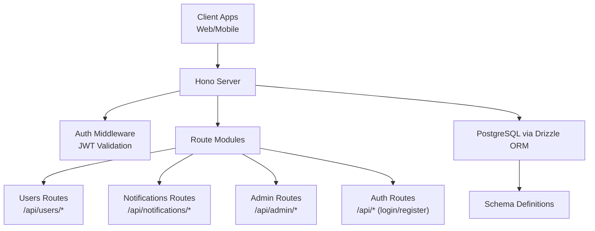
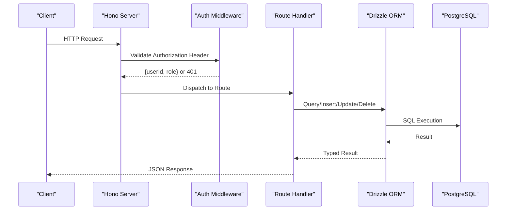
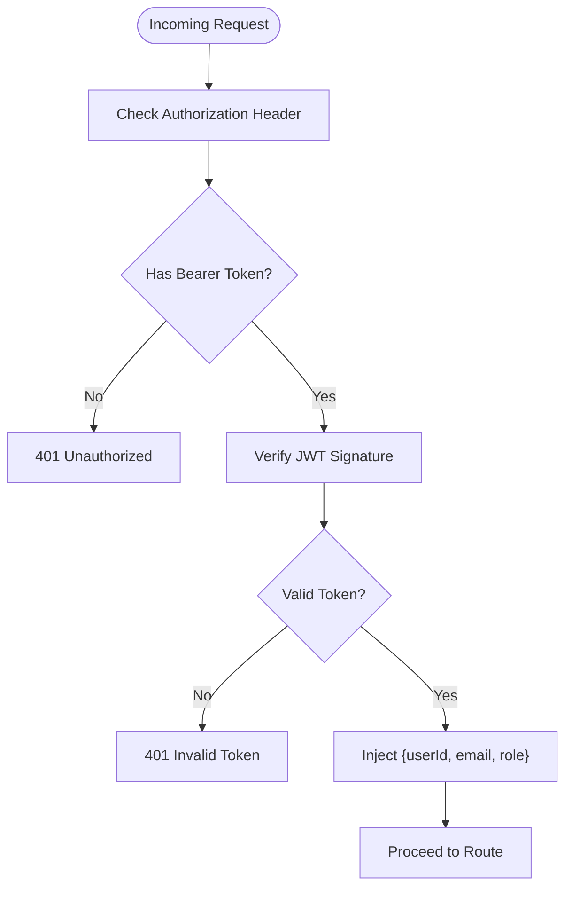
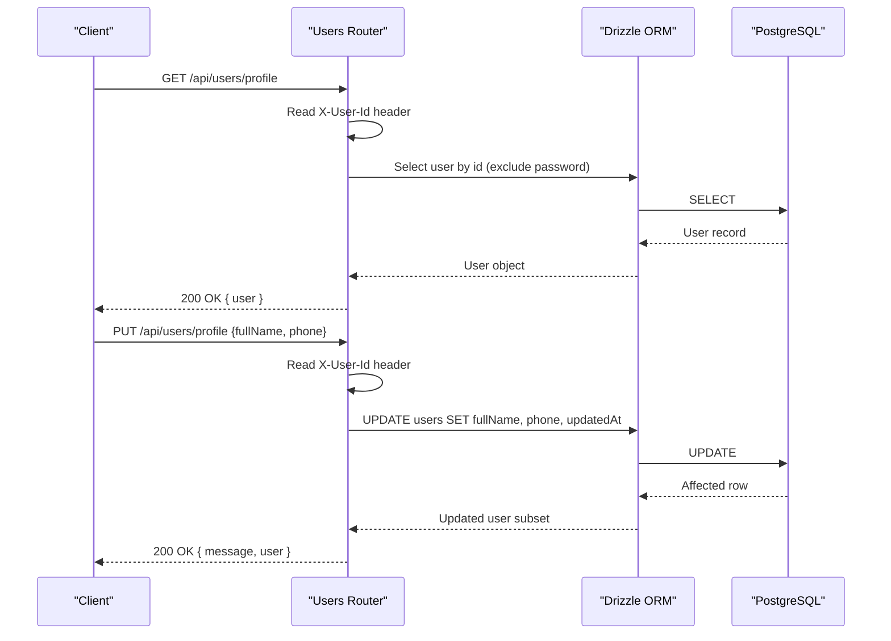
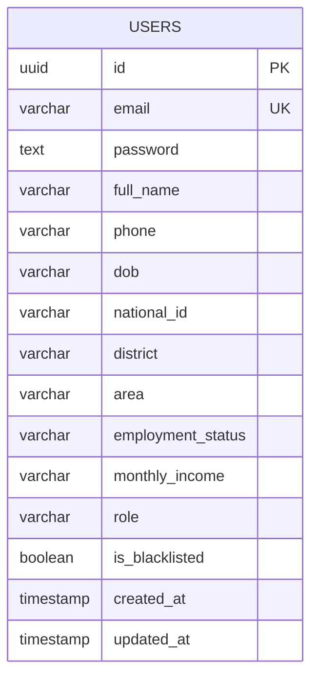
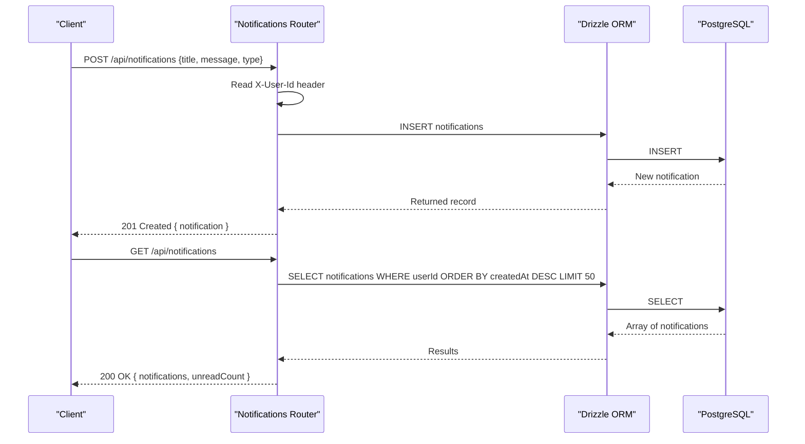
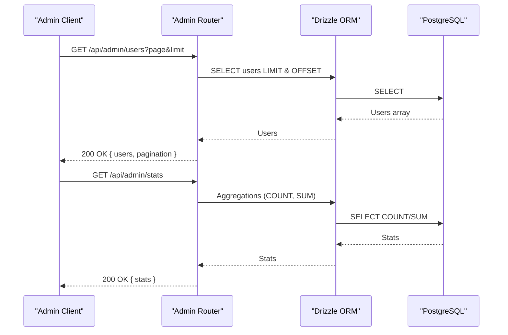
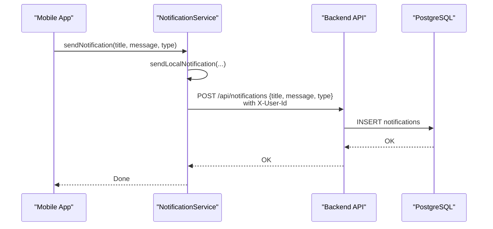
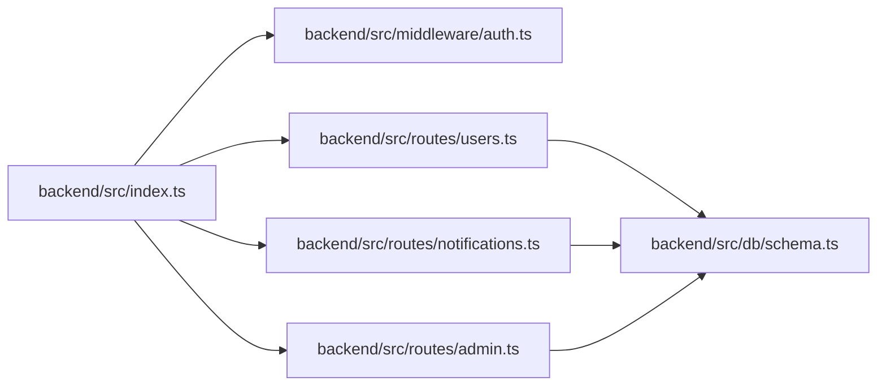

# User Management API

<cite>
**Referenced Files in This Document**
- [backend/src/index.ts](file://backend/src/index.ts)
- [backend/src/middleware/auth.ts](file://backend/src/middleware/auth.ts)
- [backend/src/db/schema.ts](file://backend/src/db/schema.ts)
- [backend/src/routes/auth.ts](file://backend/src/routes/auth.ts)
- [backend/src/routes/users.ts](file://backend/src/routes/users.ts)
- [backend/src/routes/notifications.ts](file://backend/src/routes/notifications.ts)
- [backend/src/routes/admin.ts](file://backend/src/routes/admin.ts)
- [backend/create-notifications-table.sql](file://backend/create-notifications-table.sql)
- [backend/update-schema.sql](file://backend/update-schema.sql)
- [services/NotificationService.ts](file://services/NotificationService.ts)
</cite>

## Table of Contents
1. [Introduction](#introduction)
2. [Project Structure](#project-structure)
3. [Core Components](#core-components)
4. [Architecture Overview](#architecture-overview)
5. [Detailed Component Analysis](#detailed-component-analysis)
6. [Dependency Analysis](#dependency-analysis)
7. [Performance Considerations](#performance-considerations)
8. [Troubleshooting Guide](#troubleshooting-guide)
9. [Conclusion](#conclusion)

## Introduction
This document describes the User Management API covering user profile operations, KYC-related data fields, notification handling, and administrative user management. It consolidates endpoint definitions, request/response schemas, access control, and operational flows for frontend integration and backend maintenance.

## Project Structure
The API is implemented using Hono with TypeScript and Drizzle ORM against PostgreSQL. Routes are mounted under `/api/*` with authentication middleware applied centrally. Notifications are persisted in a dedicated table and also surfaced locally via the client service.

**Diagram sources**
- [backend/src/index.ts:54-61](file://backend/src/index.ts#L54-L61)
- [backend/src/middleware/auth.ts:10-36](file://backend/src/middleware/auth.ts#L10-L36)
- [backend/src/db/schema.ts:1-146](file://backend/src/db/schema.ts#L1-L146)

**Section sources**
- [backend/src/index.ts:17-76](file://backend/src/index.ts#L17-L76)

## Core Components
- Authentication and Authorization: JWT-based with role-aware middleware supporting admin-only endpoints.
- User Management: Profile retrieval and updates, administrative user listing and actions.
- KYC Fields: Birth date, national identifier, location, employment, and income fields stored per user.
- Notifications: CRUD operations for user-specific notifications with read-state management.
- Admin Dashboard: Paginated user listing, statistics, and settings management.

**Section sources**
- [backend/src/middleware/auth.ts:10-47](file://backend/src/middleware/auth.ts#L10-L47)
- [backend/src/db/schema.ts:5-21](file://backend/src/db/schema.ts#L5-L21)
- [backend/src/db/schema.ts:79-88](file://backend/src/db/schema.ts#L79-L88)
- [backend/src/routes/admin.ts:8-47](file://backend/src/routes/admin.ts#L8-L47)

## Architecture Overview
The API follows a layered architecture:
- Transport: Hono HTTP server with CORS and logging.
- Routing: Route modules for users, notifications, admin, and auth.
- Middleware: Auth and admin guards enforce access control.
- Persistence: Drizzle ORM with PostgreSQL schema definitions.
- Client Services: Local notification delivery and backend persistence.

**Diagram sources**
- [backend/src/index.ts:19-26](file://backend/src/index.ts#L19-L26)
- [backend/src/middleware/auth.ts:10-36](file://backend/src/middleware/auth.ts#L10-L36)
- [backend/src/db/schema.ts:1-146](file://backend/src/db/schema.ts#L1-L146)

## Detailed Component Analysis

### Authentication and Authorization
- JWT Validation: Extracts Bearer token from Authorization header, verifies signature, and injects user context (userId, email, role).
- Admin Guard: Enforces admin-only access for sensitive endpoints.

**Diagram sources**
- [backend/src/middleware/auth.ts:10-36](file://backend/src/middleware/auth.ts#L10-L36)

**Section sources**
- [backend/src/middleware/auth.ts:10-47](file://backend/src/middleware/auth.ts#L10-L47)

### User Profile Management
Endpoints:
- GET /api/users/profile: Retrieve current user profile.
- PUT /api/users/profile: Update profile (fullName, phone).

Access control:
- Requires X-User-Id header (temporary implementation pending JWT middleware).

Response model (selected fields):
- id, email, fullName, phone, role, isBlacklisted, createdAt, updatedAt.

**Diagram sources**
- [backend/src/routes/users.ts:41-107](file://backend/src/routes/users.ts#L41-L107)

**Section sources**
- [backend/src/routes/users.ts:41-107](file://backend/src/routes/users.ts#L41-L107)

### KYC Verification and Data Model
KYC-related fields are part of the user schema:
- dob, nationalId, district, area, employmentStatus, monthlyIncome.

Validation and registration:
- Registration endpoint accepts optional KYC fields and stores them hashed passwords for auth.

**Diagram sources**
- [backend/src/db/schema.ts:5-21](file://backend/src/db/schema.ts#L5-L21)

**Section sources**
- [backend/src/db/schema.ts:5-21](file://backend/src/db/schema.ts#L5-L21)
- [backend/src/routes/auth.ts:33-93](file://backend/src/routes/auth.ts#L33-L93)

### Notification Handling
Endpoints:
- GET /api/notifications: List recent notifications and compute unread count.
- POST /api/notifications: Create a notification for the current user.
- PATCH /api/notifications/:id/read: Mark a notification as read.
- PATCH /api/notifications/read-all: Mark all notifications as read.
- DELETE /api/notifications/read: Delete all read notifications for the user.

Access control:
- Requires X-User-Id header (temporary) or JWT middleware (planned).

Notification model:
- id, userId, title, message, type, isRead, createdAt.

**Diagram sources**
- [backend/src/routes/notifications.ts:8-90](file://backend/src/routes/notifications.ts#L8-L90)

**Section sources**
- [backend/src/routes/notifications.ts:8-103](file://backend/src/routes/notifications.ts#L8-L103)
- [backend/src/db/schema.ts:79-88](file://backend/src/db/schema.ts#L79-L88)
- [backend/create-notifications-table.sql:1-30](file://backend/create-notifications-table.sql#L1-L30)

### Administrative User Management
Endpoints:
- GET /api/admin/users: Paginated listing of users with derived fields (creditScore, loanLimit, isKycVerified).
- GET /api/admin/loans: Paginated listing of loan applications with associated user data.
- GET /api/admin/stats: Aggregated statistics for dashboard.
- GET /api/admin/settings: Retrieve system settings.
- PUT /api/admin/settings: Upsert settings.

Access control:
- Admin-only routes protected by admin middleware.

**Diagram sources**
- [backend/src/routes/admin.ts:8-125](file://backend/src/routes/admin.ts#L8-L125)

**Section sources**
- [backend/src/routes/admin.ts:8-171](file://backend/src/routes/admin.ts#L8-L171)

### Role-Based Access Control and Security
- Roles: user and admin roles are supported; admin-only endpoints require admin middleware.
- JWT: Centralized middleware validates tokens and sets user context.
- CORS: Configured origins and headers for web clients.
- Passwords: Stored hashed; minimum length enforced during admin password updates.

**Section sources**
- [backend/src/middleware/auth.ts:10-47](file://backend/src/middleware/auth.ts#L10-L47)
- [backend/src/routes/users.ts:165-194](file://backend/src/routes/users.ts#L165-L194)

### Client-Side Notification Delivery
The client service supports:
- Push token registration (non-Expo Go environments).
- Local notifications with high priority.
- Backend persistence of notifications via POST to /api/notifications.

**Diagram sources**
- [services/NotificationService.ts:93-134](file://services/NotificationService.ts#L93-L134)
- [backend/src/routes/notifications.ts:71-90](file://backend/src/routes/notifications.ts#L71-L90)

**Section sources**
- [services/NotificationService.ts:1-135](file://services/NotificationService.ts#L1-L135)

## Dependency Analysis
Key dependencies and relationships:
- Hono server mounts route modules and applies middleware globally.
- Route handlers depend on Drizzle ORM for database operations.
- Notifications table references users with cascade delete.
- Admin routes depend on aggregated queries and user joins.

**Diagram sources**
- [backend/src/index.ts:54-61](file://backend/src/index.ts#L54-L61)
- [backend/src/db/schema.ts:1-146](file://backend/src/db/schema.ts#L1-L146)

**Section sources**
- [backend/src/index.ts:54-61](file://backend/src/index.ts#L54-L61)
- [backend/src/db/schema.ts:1-146](file://backend/src/db/schema.ts#L1-L146)

## Performance Considerations
- Pagination: Admin endpoints support page and limit parameters with a cap to prevent heavy queries.
- Indexes: Notifications table includes indexes on user_id, created_at, type, and is_read for efficient filtering and sorting.
- Aggregation: Admin stats use SQL aggregations to minimize payload sizes.
- CORS and Logging: Middleware overhead is minimal but essential for development visibility.

[No sources needed since this section provides general guidance]

## Troubleshooting Guide
Common issues and resolutions:
- Unauthorized Access: Ensure Authorization header is present and valid; for JWT, use Bearer <token>.
- Missing X-User-Id: Some endpoints currently rely on X-User-Id header; confirm client sets it.
- Internal Server Errors: Check server logs for detailed error messages; verify database connectivity and migrations.
- CORS Errors: Confirm client origin is included in allowed origins and credentials are enabled.

**Section sources**
- [backend/src/middleware/auth.ts:14-31](file://backend/src/middleware/auth.ts#L14-L31)
- [backend/src/index.ts:21-26](file://backend/src/index.ts#L21-L26)

## Conclusion
The User Management API provides a robust foundation for user profiles, KYC data, notifications, and administrative controls. It leverages JWT-based authentication, typed database schemas, and modular routing for maintainability. Clients should integrate with the documented endpoints, ensuring proper headers and error handling.