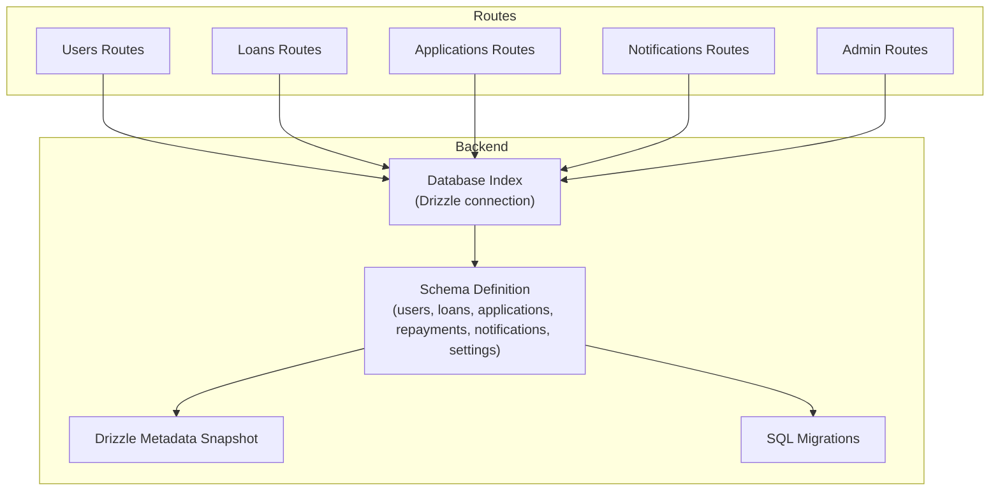
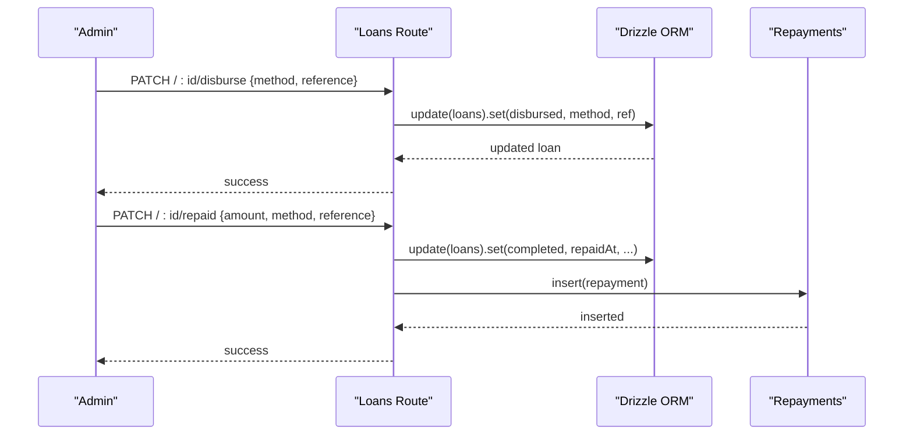
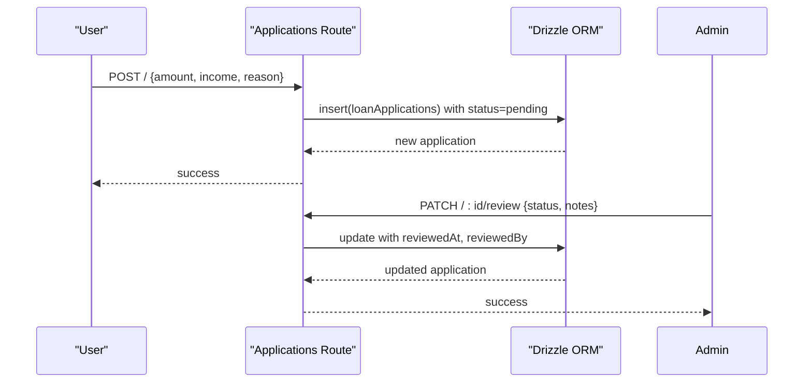
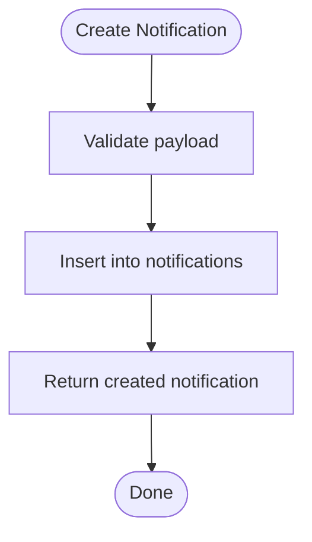
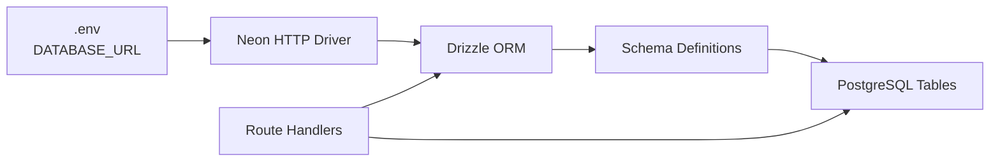
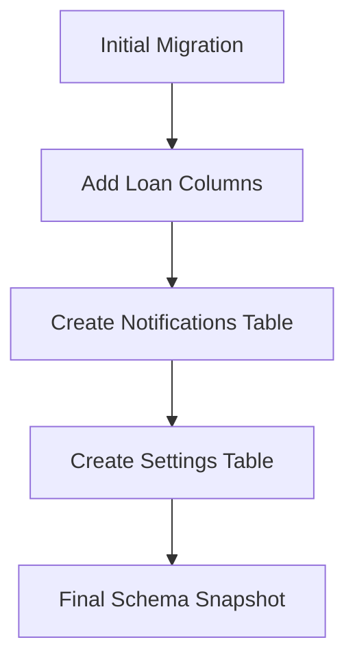

# Database Design

<cite>
**Referenced Files in This Document**
- [schema.ts](file://backend/src/db/schema.ts)
- [0000_messy_fallen_one.sql](file://backend/drizzle/0000_messy_fallen_one.sql)
- [0000_snapshot.json](file://backend/drizzle/meta/0000_snapshot.json)
- [index.ts](file://backend/src/db/index.ts)
- [drizzle.config.ts](file://backend/drizzle.config.ts)
- [admin-schema-update.ts](file://backend/admin-schema-update.ts)
- [add_loan_columns.sql](file://backend/add_loan_columns.sql)
- [migrate.sql](file://backend/migrate.sql)
- [update-schema.sql](file://backend/update-schema.sql)
- [create-notifications-table.sql](file://backend/create-notifications-table.sql)
- [users.ts](file://backend/src/routes/users.ts)
- [loans.ts](file://backend/src/routes/loans.ts)
- [applications.ts](file://backend/src/routes/applications.ts)
- [notifications.ts](file://backend/src/routes/notifications.ts)
- [admin.ts](file://backend/src/routes/admin.ts)
</cite>

## Table of Contents
1. [Introduction](#introduction)
2. [Project Structure](#project-structure)
3. [Core Components](#core-components)
4. [Architecture Overview](#architecture-overview)
5. [Detailed Component Analysis](#detailed-component-analysis)
6. [Dependency Analysis](#dependency-analysis)
7. [Performance Considerations](#performance-considerations)
8. [Troubleshooting Guide](#troubleshooting-guide)
9. [Conclusion](#conclusion)
10. [Appendices](#appendices)

## Introduction
This document describes the PHOENIX database schema and its operational design. It covers entity definitions, relationships, constraints, indexes, and referential integrity enforced by the schema. It also documents data access patterns via Drizzle ORM, query optimization strategies, lifecycle management, migration paths, and security considerations.

## Project Structure
The database layer is implemented with Drizzle ORM against PostgreSQL. The schema is defined programmatically and mirrored by SQL migration files and Drizzle metadata snapshots. Routes define CRUD operations and business workflows that rely on these schema constructs.



**Diagram sources**
- [index.ts:1-44](file://backend/src/db/index.ts#L1-L44)
- [schema.ts:1-146](file://backend/src/db/schema.ts#L1-L146)
- [0000_messy_fallen_one.sql:1-93](file://backend/drizzle/0000_messy_fallen_one.sql#L1-L93)
- [0000_snapshot.json:1-617](file://backend/drizzle/meta/0000_snapshot.json#L1-L617)
- [users.ts:1-197](file://backend/src/routes/users.ts#L1-L197)
- [loans.ts:1-320](file://backend/src/routes/loans.ts#L1-L320)
- [applications.ts:1-168](file://backend/src/routes/applications.ts#L1-L168)
- [notifications.ts:1-106](file://backend/src/routes/notifications.ts#L1-L106)
- [admin.ts:1-140](file://backend/src/routes/admin.ts#L1-L140)

**Section sources**
- [index.ts:1-44](file://backend/src/db/index.ts#L1-L44)
- [drizzle.config.ts:1-14](file://backend/drizzle.config.ts#L1-L14)

## Core Components
This section defines each table, its fields, data types, constraints, and relationships.

- Users
  - Purpose: Stores user profiles, authentication credentials, roles, and KYC-related attributes.
  - Primary key: id (UUID)
  - Unique constraints: email
  - Notable fields: email, password, fullName, phone, dob, nationalId, district, area, employmentStatus, monthlyIncome, role, isBlacklisted, timestamps.
  - Constraints: role defaults to 'user'; isBlacklisted defaults to false; timestamps default to current time.
  - Indexes: none declared in snapshot; typical performance practice would add an index on email.

- Loans
  - Purpose: Tracks loan lifecycle including amounts, rates, terms, statuses, and disbursement/repayment/completion metadata.
  - Primary key: id (UUID)
  - Foreign keys: user_id -> users.id
  - Notable fields: userId, amount, interestRate, term, status, purpose, disbursement and repayment fields, completion fields, timestamps.
  - Constraints: status defaults to 'pending'; numeric precisions defined for monetary fields.
  - Indexes: none declared in snapshot.

- Loan Applications
  - Purpose: Captures application records with status, reviewer notes, and optional linkage to a Loan.
  - Primary key: id (UUID)
  - Foreign keys: user_id -> users.id; loan_id -> loans.id; reviewed_by -> users.id
  - Notable fields: userId, loanId (optional), amount, employmentStatus, monthlyIncome, employerName, reason, status, adminNotes, timestamps, reviewedBy.
  - Constraints: status defaults to 'pending'.
  - Indexes: none declared in snapshot.

- Repayments
  - Purpose: Records scheduled and executed repayment events per loan.
  - Primary key: id (UUID)
  - Foreign keys: loan_id -> loans.id
  - Notable fields: loanId, amount, dueDate, paidDate, status, paymentMethod, reference, paidAt, timestamps.
  - Constraints: status defaults to 'pending'.
  - Indexes: none declared in snapshot.

- Notifications
  - Purpose: Stores user-specific notifications with read/unread state.
  - Primary key: id (UUID)
  - Foreign keys: user_id -> users.id (ON DELETE CASCADE)
  - Notable fields: userId, title, message, type, isRead, createdAt.
  - Constraints: isRead defaults to false; type indicates categories such as registration, loan_approved, loan_rejected, kyc_verified.
  - Indexes: none declared in snapshot; however, historical SQL adds indexes on user_id, created_at, type, is_read.

- Settings
  - Purpose: Stores key-value configuration data as JSON strings.
  - Primary key: id (UUID)
  - Unique constraints: key
  - Notable fields: key (unique), value (JSON string), updatedAt.
  - Indexes: none declared in snapshot; uniqueness is handled by unique constraint.

**Section sources**
- [schema.ts:5-21](file://backend/src/db/schema.ts#L5-L21)
- [schema.ts:24-46](file://backend/src/db/schema.ts#L24-L46)
- [schema.ts:49-63](file://backend/src/db/schema.ts#L49-L63)
- [schema.ts:66-77](file://backend/src/db/schema.ts#L66-L77)
- [schema.ts:80-88](file://backend/src/db/schema.ts#L80-L88)
- [schema.ts:91-96](file://backend/src/db/schema.ts#L91-L96)
- [0000_snapshot.json:6-604](file://backend/drizzle/meta/0000_snapshot.json#L6-L604)
- [create-notifications-table.sql:19-23](file://backend/create-notifications-table.sql#L19-L23)

## Architecture Overview
The schema enforces referential integrity through foreign keys. Users are central to the model: each loan belongs to a user, applications link to users and optionally to loans, and notifications belong to users with cascading deletion. Repayments are linked to loans. Settings provide global configuration keyed by unique identifiers.

```mermaid
erDiagram
USERS {
uuid id PK
varchar email UK
text password
varchar full_name
varchar phone
varchar dob
varchar national_id
varchar district
varchar area
varchar employment_status
varchar monthly_income
varchar role
boolean is_blacklisted
timestamp created_at
timestamp updated_at
}
LOANS {
uuid id PK
uuid user_id FK
numeric amount
numeric interest_rate
integer term
varchar status
text purpose
timestamp disbursed_at
varchar disbursement_method
varchar disbursement_reference
timestamp repaid_at
numeric repayment_amount
varchar repayment_method
varchar repayment_reference
timestamp completed_at
text completion_notes
timestamp created_at
timestamp updated_at
}
LOAN_APPLICATIONS {
uuid id PK
uuid user_id FK
uuid loan_id FK
numeric amount
varchar employment_status
numeric monthly_income
varchar employer_name
text reason
varchar status
text admin_notes
timestamp created_at
timestamp reviewed_at
uuid reviewed_by FK
}
REPAYMENTS {
uuid id PK
uuid loan_id FK
numeric amount
timestamp due_date
timestamp paid_date
varchar status
varchar payment_method
varchar reference
timestamp paid_at
timestamp created_at
}
NOTIFICATIONS {
uuid id PK
uuid user_id FK
varchar title
text message
varchar type
boolean is_read
timestamp created_at
}
SETTINGS {
uuid id PK
varchar key UK
text value
timestamp updated_at
}
USERS ||--o{ LOANS : "has many"
USERS ||--o{ LOAN_APPLICATIONS : "has many"
LOANS ||--o{ REPAYMENTS : "has many"
USERS ||--o{ NOTIFICATIONS : "has many"
LOANS --> LOAN_APPLICATIONS : "may link to"
USERS }o--|| LOAN_APPLICATIONS : "reviewed by"
```

**Diagram sources**
- [schema.ts:5-21](file://backend/src/db/schema.ts#L5-L21)
- [schema.ts:24-46](file://backend/src/db/schema.ts#L24-L46)
- [schema.ts:49-63](file://backend/src/db/schema.ts#L49-L63)
- [schema.ts:66-77](file://backend/src/db/schema.ts#L66-L77)
- [schema.ts:80-88](file://backend/src/db/schema.ts#L80-L88)
- [schema.ts:91-96](file://backend/src/db/schema.ts#L91-L96)
- [0000_snapshot.json:6-604](file://backend/drizzle/meta/0000_snapshot.json#L6-L604)

## Detailed Component Analysis

### Users
- Responsibilities: Authentication, profile management, role assignment, blacklist control, and association with loans and applications.
- Access patterns:
  - Retrieve profile by header-provided user identifier.
  - Update profile fields with audit timestamps.
  - Admin endpoints to toggle blacklist and change passwords after hashing.
- Security considerations:
  - Passwords are stored hashed; routes enforce minimum length and hash before update.
  - Profile queries exclude sensitive fields from returned payloads.

**Section sources**
- [users.ts:42-107](file://backend/src/routes/users.ts#L42-L107)
- [users.ts:137-194](file://backend/src/routes/users.ts#L137-L194)

### Loans
- Responsibilities: Track loan lifecycle, disbursement, repayment, and completion.
- Access patterns:
  - List all loans with user and repayments populated.
  - Fetch user’s loans with repayment schedule.
  - Create loan with initial status.
  - Admin updates: status, disburse, mark repaid, complete.
- Business logic constraints:
  - Status transitions are controlled via patch endpoints.
  - Disbursement sets status to disbursed and records method/reference.
  - Marking repaid updates status to completed and inserts a repayment record.
  - Completing sets completion notes and timestamp.



**Diagram sources**
- [loans.ts:225-290](file://backend/src/routes/loans.ts#L225-L290)

**Section sources**
- [loans.ts:93-168](file://backend/src/routes/loans.ts#L93-L168)
- [loans.ts:171-197](file://backend/src/routes/loans.ts#L171-L197)
- [loans.ts:200-317](file://backend/src/routes/loans.ts#L200-L317)

### Loan Applications
- Responsibilities: Capture application data, track status, and associate with users and optional loans.
- Access patterns:
  - List all applications with user, loan, and reviewer details.
  - Fetch user’s applications and create new ones.
  - Admin reviews with status and notes, linking reviewer identity.
- Validation:
  - Zod schemas enforce payload structure for creation and review.



**Diagram sources**
- [applications.ts:111-138](file://backend/src/routes/applications.ts#L111-L138)
- [applications.ts:141-165](file://backend/src/routes/applications.ts#L141-L165)

**Section sources**
- [applications.ts:25-108](file://backend/src/routes/applications.ts#L25-L108)
- [applications.ts:111-165](file://backend/src/routes/applications.ts#L111-L165)

### Repayments
- Responsibilities: Manage scheduled and paid repayment events.
- Access patterns:
  - Loans route creates repayment entries upon marking a loan as repaid.
  - No dedicated route for repayments is present; operations are driven by loan lifecycle.

**Section sources**
- [loans.ts:272-280](file://backend/src/routes/loans.ts#L272-L280)

### Notifications
- Responsibilities: Store user-specific notifications and manage read/unread state.
- Access patterns:
  - List recent notifications for a user, compute unread count client-side.
  - Mark individual or all notifications as read.
  - Create notifications with title, message, and type.
  - Delete read notifications for a user.
- Cascade behavior:
  - Deleting a user cascades to their notifications.



**Diagram sources**
- [notifications.ts:72-90](file://backend/src/routes/notifications.ts#L72-L90)

**Section sources**
- [notifications.ts:9-69](file://backend/src/routes/notifications.ts#L9-L69)
- [notifications.ts:92-103](file://backend/src/routes/notifications.ts#L92-L103)

### Settings
- Responsibilities: Centralized configuration storage keyed by unique identifiers.
- Access patterns:
  - Admin reads all settings and writes updates by key, storing values as JSON strings.

**Section sources**
- [admin.ts:97-137](file://backend/src/routes/admin.ts#L97-L137)

## Dependency Analysis
- Drizzle ORM connects to Neon PostgreSQL using DATABASE_URL from environment.
- Schema definitions drive migrations and metadata snapshots.
- Routes depend on schema relations and enforce business rules.



**Diagram sources**
- [index.ts:31-42](file://backend/src/db/index.ts#L31-L42)
- [drizzle.config.ts:6-13](file://backend/drizzle.config.ts#L6-L13)
- [schema.ts:1-146](file://backend/src/db/schema.ts#L1-L146)

**Section sources**
- [index.ts:1-44](file://backend/src/db/index.ts#L1-L44)
- [drizzle.config.ts:1-14](file://backend/drizzle.config.ts#L1-L14)

## Performance Considerations
- Current state: No explicit indexes are declared in the metadata snapshot. Typical hotspots include:
  - users.email unique lookup for auth.
  - notifications.user_id for per-user notification retrieval.
  - notifications.created_at ordering for recent lists.
  - notifications.type and notifications.is_read for filtering and read/unread counts.
- Recommended indexes (based on observed access patterns):
  - users(email)
  - notifications(user_id)
  - notifications(created_at)
  - notifications(type)
  - notifications(is_read)
- Historical script already creates these indexes for notifications.

**Section sources**
- [0000_snapshot.json:592-600](file://backend/drizzle/meta/0000_snapshot.json#L592-L600)
- [create-notifications-table.sql:19-23](file://backend/create-notifications-table.sql#L19-L23)

## Troubleshooting Guide
- Connection failures:
  - Ensure DATABASE_URL is set in .env and loaded by the database index.
  - The index logs connection attempts and throws if DATABASE_URL is missing.
- Migration drift:
  - Use Drizzle Kit config to generate diffs and keep schema.ts aligned with the database.
  - Apply manual migrations for columns not covered by Drizzle schema (e.g., disbursement/repayment fields).
- Data access errors:
  - Routes return 401 Unauthorized when user identity header is missing.
  - Routes return 404 when resources are not found; otherwise 500 for internal errors.

**Section sources**
- [index.ts:33-38](file://backend/src/db/index.ts#L33-L38)
- [users.ts:46-48](file://backend/src/routes/users.ts#L46-L48)
- [loans.ts:121-123](file://backend/src/routes/loans.ts#L121-L123)
- [applications.ts:60-62](file://backend/src/routes/applications.ts#L60-L62)
- [notifications.ts:13-15](file://backend/src/routes/notifications.ts#L13-L15)

## Conclusion
The PHOENIX schema centers around users and their loan lifecycle, with supporting entities for applications, repayments, notifications, and settings. Drizzle ORM provides a strongly-typed interface to PostgreSQL, while migrations and snapshots maintain schema evolution. Access patterns in routes enforce business rules and handle status transitions. Adding recommended indexes and keeping schema definitions synchronized with migrations will improve performance and maintainability.

## Appendices

### Field Reference and Constraints
- Users
  - id: UUID, PK
  - email: varchar(255), unique
  - password: text
  - fullName: varchar(255)
  - phone: varchar(20)
  - dob: varchar(20)
  - nationalId: varchar(50)
  - district: varchar(50)
  - area: varchar(100)
  - employmentStatus: varchar(50)
  - monthlyIncome: varchar(20)
  - role: varchar(20), default 'user'
  - isBlacklisted: boolean, default false
  - created_at, updated_at: timestamps
- Loans
  - id: UUID, PK
  - userId: UUID, FK -> users.id
  - amount: numeric(12,2)
  - interestRate: numeric(5,2)
  - term: integer
  - status: varchar(20), default 'pending'
  - purpose: text
  - disbursed_at, disbursement_method, disbursement_reference: timestamps and varchar
  - repaid_at, repayment_amount, repayment_method, repayment_reference: timestamps and numeric/varying
  - completed_at, completion_notes: timestamps and text
  - created_at, updated_at: timestamps
- Loan Applications
  - id: UUID, PK
  - userId: UUID, FK -> users.id
  - loanId: UUID, FK -> loans.id
  - amount: numeric(12,2)
  - employmentStatus: varchar(50)
  - monthlyIncome: numeric(12,2)
  - employerName: varchar(255)
  - reason: text
  - status: varchar(20), default 'pending'
  - adminNotes: text
  - created_at, reviewed_at: timestamps
  - reviewedBy: UUID, FK -> users.id
- Repayments
  - id: UUID, PK
  - loanId: UUID, FK -> loans.id
  - amount: numeric(12,2)
  - dueDate: timestamp
  - paidDate: timestamp
  - status: varchar(20), default 'pending'
  - paymentMethod: varchar(50)
  - reference: varchar(100)
  - paidAt: timestamp
  - created_at: timestamp
- Notifications
  - id: UUID, PK
  - userId: UUID, FK -> users.id (ON DELETE CASCADE)
  - title: varchar(255)
  - message: text
  - type: varchar(50)
  - isRead: boolean, default false
  - created_at: timestamp
- Settings
  - id: UUID, PK
  - key: varchar(255), unique
  - value: text
  - updated_at: timestamp

**Section sources**
- [schema.ts:5-21](file://backend/src/db/schema.ts#L5-L21)
- [schema.ts:24-46](file://backend/src/db/schema.ts#L24-L46)
- [schema.ts:49-63](file://backend/src/db/schema.ts#L49-L63)
- [schema.ts:66-77](file://backend/src/db/schema.ts#L66-L77)
- [schema.ts:80-88](file://backend/src/db/schema.ts#L80-L88)
- [schema.ts:91-96](file://backend/src/db/schema.ts#L91-L96)
- [0000_snapshot.json:6-604](file://backend/drizzle/meta/0000_snapshot.json#L6-L604)

### Data Lifecycle Management
- Retention and archival:
  - No retention policies are defined in the schema or routes.
  - Notifications support clearing read items for a user via a delete endpoint.
  - Consider implementing periodic cleanup jobs for notifications older than N days and archiving completed loans/applications to cold storage if needed.
- Audit trail:
  - created_at and updated_at timestamps are present across entities for lineage.

**Section sources**
- [notifications.ts:92-103](file://backend/src/routes/notifications.ts#L92-L103)

### Migration Paths and Versioning
- Drizzle Kit configuration points to schema.ts and outputs migrations to drizzle/.
- Initial snapshot and SQL migration files establish baseline tables and constraints.
- Additional migrations add missing columns for disbursement/repayment tracking and create notifications table with indexes.
- Manual update script adds users columns, status, and settings table.



**Diagram sources**
- [drizzle.config.ts:6-13](file://backend/drizzle.config.ts#L6-L13)
- [0000_messy_fallen_one.sql:1-93](file://backend/drizzle/0000_messy_fallen_one.sql#L1-L93)
- [migrate.sql:1-12](file://backend/migrate.sql#L1-L12)
- [add_loan_columns.sql:1-12](file://backend/add_loan_columns.sql#L1-L12)
- [update-schema.sql:12-21](file://backend/update-schema.sql#L12-L21)
- [admin-schema-update.ts:7-19](file://backend/admin-schema-update.ts#L7-L19)

**Section sources**
- [drizzle.config.ts:1-14](file://backend/drizzle.config.ts#L1-L14)
- [0000_messy_fallen_one.sql:1-93](file://backend/drizzle/0000_messy_fallen_one.sql#L1-L93)
- [migrate.sql:1-12](file://backend/migrate.sql#L1-L12)
- [add_loan_columns.sql:1-12](file://backend/add_loan_columns.sql#L1-L12)
- [update-schema.sql:1-32](file://backend/update-schema.sql#L1-L32)
- [admin-schema-update.ts:1-30](file://backend/admin-schema-update.ts#L1-L30)

### Data Access Patterns with Drizzle ORM
- Connection:
  - Neon HTTP driver is configured with DATABASE_URL; Drizzle initializes with schema definitions.
- Queries:
  - Routes use findMany/findFirst with relations and ordering.
  - Inserts and updates leverage returning clauses for minimal round-trips.
- Validation:
  - Zod validators decorate request bodies for create and review endpoints.

**Section sources**
- [index.ts:41-42](file://backend/src/db/index.ts#L41-L42)
- [users.ts:11-39](file://backend/src/routes/users.ts#L11-L39)
- [loans.ts:95-108](file://backend/src/routes/loans.ts#L95-L108)
- [applications.ts:27-53](file://backend/src/routes/applications.ts#L27-L53)
- [notifications.ts:17-33](file://backend/src/routes/notifications.ts#L17-L33)
- [admin.ts:11-35](file://backend/src/routes/admin.ts#L11-L35)

### Security, Privacy, and Access Control
- Authentication and authorization:
  - Routes currently rely on X-User-Id header for identity; production should enforce robust auth middleware.
  - Role-based access is modeled (role field) but enforcement is not visible in current routes.
- Data protection:
  - Passwords are hashed before storage; routes validate minimum length.
  - Sensitive fields (e.g., password) are excluded from profile responses.
- Cascading deletes:
  - Notifications cascade on user deletion to prevent orphaned rows.

**Section sources**
- [users.ts:165-194](file://backend/src/routes/users.ts#L165-L194)
- [users.ts:11-39](file://backend/src/routes/users.ts#L11-L39)
- [schema.ts:82](file://backend/src/db/schema.ts#L82)
- [0000_snapshot.json:342](file://backend/drizzle/meta/0000_snapshot.json#L342)