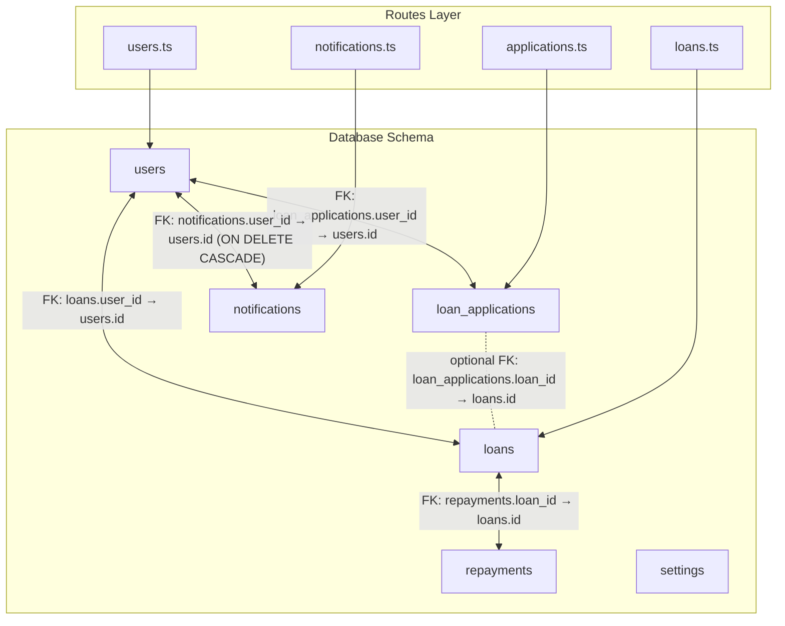
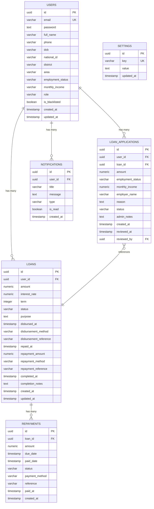
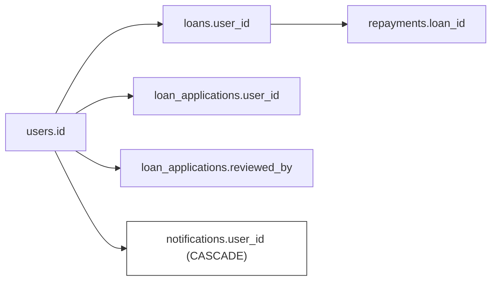

# Entity Relationships

<cite>
**Referenced Files in This Document**
- [schema.ts](file://backend/src/db/schema.ts)
- [0000_messy_fallen_one.sql](file://backend/drizzle/0000_messy_fallen_one.sql)
- [0000_snapshot.json](file://backend/drizzle/meta/0000_snapshot.json)
- [create-notifications-table.sql](file://backend/create-notifications-table.sql)
- [add_loan_columns.sql](file://backend/add_loan_columns.sql)
- [migrate.sql](file://backend/migrate.sql)
- [reset-db.sql](file://backend/reset-db.sql)
- [users.ts](file://backend/src/routes/users.ts)
- [loans.ts](file://backend/src/routes/loans.ts)
- [applications.ts](file://backend/src/routes/applications.ts)
- [notifications.ts](file://backend/src/routes/notifications.ts)
- [index.ts](file://backend/src/db/index.ts)
</cite>

## Table of Contents
1. [Introduction](#introduction)
2. [Project Structure](#project-structure)
3. [Core Components](#core-components)
4. [Architecture Overview](#architecture-overview)
5. [Detailed Component Analysis](#detailed-component-analysis)
6. [Dependency Analysis](#dependency-analysis)
7. [Performance Considerations](#performance-considerations)
8. [Troubleshooting Guide](#troubleshooting-guide)
9. [Conclusion](#conclusion)
10. [Appendices](#appendices)

## Introduction
This document describes the entity relationship model for the PHOENIX database design. It focuses on the relationships among users, loans, loan_applications, repayments, and notifications tables. The documentation covers foreign key constraints, referential integrity, cascade behaviors, and cardinalities. It also explains hierarchical relationships (users → loans → repayments), one-to-many relationships (users → applications), and many-to-one relationships (repayments → loans). Finally, it provides ER diagrams, join patterns, and examples of complex queries that demonstrate relationship-based data access.

## Project Structure
The database schema is defined in TypeScript using Drizzle ORM and is represented both programmatically and through SQL migrations. The routes layer demonstrates how these entities are accessed and joined in practice.

**Diagram sources**
- [schema.ts:24-46](file://backend/src/db/schema.ts#L24-L46)
- [schema.ts:48-63](file://backend/src/db/schema.ts#L48-L63)
- [schema.ts:65-77](file://backend/src/db/schema.ts#L65-L77)
- [schema.ts:79-88](file://backend/src/db/schema.ts#L79-L88)
- [users.ts:11-39](file://backend/src/routes/users.ts#L11-L39)
- [loans.ts:95-108](file://backend/src/routes/loans.ts#L95-L108)
- [applications.ts:27-48](file://backend/src/routes/applications.ts#L27-L48)
- [notifications.ts:17-28](file://backend/src/routes/notifications.ts#L17-L28)

**Section sources**
- [schema.ts:1-146](file://backend/src/db/schema.ts#L1-L146)
- [0000_messy_fallen_one.sql:1-93](file://backend/drizzle/0000_messy_fallen_one.sql#L1-L93)
- [0000_snapshot.json:6-617](file://backend/drizzle/meta/0000_snapshot.json#L6-L617)

## Core Components
- users: Core entity representing users with personal and administrative attributes. Enforces unique email and supports roles and blacklist flags.
- loans: Represents loan records linked to users, with lifecycle fields for disbursement, repayment, and completion.
- loan_applications: Stores application requests from users, optionally linking to a loan record and capturing reviewer actions.
- repayments: Records individual repayment events tied to a specific loan.
- notifications: Stores user-specific notifications with a cascade delete policy on user deletion.

Key constraints and behaviors:
- users.id is the primary key for users.
- loans.user_id references users.id with no action on delete.
- loan_applications.user_id references users.id with no action on delete.
- loan_applications.loan_id optionally references loans.id with no action on delete.
- loan_applications.reviewed_by references users.id with no action on delete.
- repayments.loan_id references loans.id with no action on delete.
- notifications.user_id references users.id with cascade delete.

Cardinalities:
- users → loans: one-to-many (one user can have many loans).
- users → loan_applications: one-to-many (one user can submit many applications).
- loans → repayments: one-to-many (one loan can have many repayments).
- loan_applications → loans: many-to-one (many applications can reference one loan).
- notifications → users: many-to-one (many notifications belong to one user).

**Section sources**
- [schema.ts:4-21](file://backend/src/db/schema.ts#L4-L21)
- [schema.ts:23-46](file://backend/src/db/schema.ts#L23-L46)
- [schema.ts:48-63](file://backend/src/db/schema.ts#L48-L63)
- [schema.ts:65-77](file://backend/src/db/schema.ts#L65-L77)
- [schema.ts:79-88](file://backend/src/db/schema.ts#L79-L88)
- [0000_snapshot.json:94-133](file://backend/drizzle/meta/0000_snapshot.json#L94-L133)
- [0000_snapshot.json:259-272](file://backend/drizzle/meta/0000_snapshot.json#L259-L272)
- [0000_snapshot.json:421-434](file://backend/drizzle/meta/0000_snapshot.json#L421-L434)
- [0000_snapshot.json:331-344](file://backend/drizzle/meta/0000_snapshot.json#L331-L344)

## Architecture Overview
The PHOENIX database enforces referential integrity through explicit foreign keys and Drizzle relations. The routes layer demonstrates how these relationships are leveraged for complex queries and data access patterns.

**Diagram sources**
- [schema.ts:4-21](file://backend/src/db/schema.ts#L4-L21)
- [schema.ts:23-46](file://backend/src/db/schema.ts#L23-L46)
- [schema.ts:48-63](file://backend/src/db/schema.ts#L48-L63)
- [schema.ts:65-77](file://backend/src/db/schema.ts#L65-L77)
- [schema.ts:79-88](file://backend/src/db/schema.ts#L79-L88)
- [schema.ts:90-96](file://backend/src/db/schema.ts#L90-L96)

## Detailed Component Analysis

### Users Entity
- Purpose: Central identity and profile store for all users.
- Key attributes: Unique email, role, blacklist flag, personal identifiers.
- Relationships:
  - One-to-many with loans (via user_id).
  - One-to-many with loan_applications (via user_id).
  - Many-to-one with loan_applications.reviewed_by (admin reviewer).
- Referential integrity: No cascades; updates propagate via foreign keys.

**Section sources**
- [schema.ts:4-21](file://backend/src/db/schema.ts#L4-L21)
- [schema.ts:99-102](file://backend/src/db/schema.ts#L99-L102)
- [0000_snapshot.json:94-133](file://backend/drizzle/meta/0000_snapshot.json#L94-L133)

### Loans Entity
- Purpose: Tracks loan lifecycle from creation to completion.
- Key attributes: Amount, interest rate, term, status, and disbursement/repayment/completion metadata.
- Relationships:
  - Many-to-one with users (user_id).
  - One-to-many with repayments (loan_id).
  - One-to-one with loan_applications via loanApplications.loanId.
- Referential integrity: No cascade on user deletion; repayments remain intact.

**Section sources**
- [schema.ts:23-46](file://backend/src/db/schema.ts#L23-L46)
- [schema.ts:104-111](file://backend/src/db/schema.ts#L104-L111)
- [0000_snapshot.json:259-272](file://backend/drizzle/meta/0000_snapshot.json#L259-L272)

### Loan Applications Entity
- Purpose: Captures user applications for loans, optionally linked to a loan record.
- Key attributes: Employment status, income, reason, status, admin notes, reviewer metadata.
- Relationships:
  - Many-to-one with users (user_id).
  - Many-to-one with users (reviewed_by).
  - Optional many-to-one with loans (loan_id).
- Referential integrity: No cascade; optional loan linkage.

**Section sources**
- [schema.ts:48-63](file://backend/src/db/schema.ts#L48-L63)
- [schema.ts:113-126](file://backend/src/db/schema.ts#L113-L126)
- [0000_snapshot.json:94-133](file://backend/drizzle/meta/0000_snapshot.json#L94-L133)

### Repayments Entity
- Purpose: Records repayment events against a specific loan.
- Key attributes: Amount, due date, paid date, status, payment method, reference.
- Relationships:
  - Many-to-one with loans (loan_id).
- Referential integrity: No cascade; repayments persist independently.

**Section sources**
- [schema.ts:65-77](file://backend/src/db/schema.ts#L65-L77)
- [schema.ts:128-133](file://backend/src/db/schema.ts#L128-L133)
- [0000_snapshot.json:421-434](file://backend/drizzle/meta/0000_snapshot.json#L421-L434)

### Notifications Entity
- Purpose: Stores user-specific notifications with read/unread tracking.
- Key attributes: Title, message, type, read flag, creation timestamp.
- Relationships:
  - Many-to-one with users (user_id).
- Referential integrity: Cascade delete on user deletion.

**Section sources**
- [schema.ts:79-88](file://backend/src/db/schema.ts#L79-L88)
- [schema.ts:128-133](file://backend/src/db/schema.ts#L128-L133)
- [0000_snapshot.json:331-344](file://backend/drizzle/meta/0000_snapshot.json#L331-L344)

### Routes-Level Joins and Access Patterns
- Users endpoint: Fetches users with nested loans and applications.
- Loans endpoint: Fetches loans with user and repayments.
- Applications endpoint: Fetches applications with user, loan, and reviewer.
- Notifications endpoint: Fetches notifications for a user with read count.

These patterns demonstrate:
- One-to-many expansion via nested relations.
- Optional many-to-one linkage (applications to loans).
- Aggregated metrics (unread counts).

**Section sources**
- [users.ts:11-39](file://backend/src/routes/users.ts#L11-L39)
- [loans.ts:95-108](file://backend/src/routes/loans.ts#L95-L108)
- [applications.ts:27-48](file://backend/src/routes/applications.ts#L27-L48)
- [notifications.ts:17-28](file://backend/src/routes/notifications.ts#L17-L28)

## Dependency Analysis
Foreign key dependencies and cascade behaviors are defined consistently across schema and migrations.

**Diagram sources**
- [schema.ts:26](file://backend/src/db/schema.ts#L26)
- [schema.ts:51](file://backend/src/db/schema.ts#L51)
- [schema.ts:68](file://backend/src/db/schema.ts#L68)
- [schema.ts:82](file://backend/src/db/schema.ts#L82)
- [0000_messy_fallen_one.sql:88-93](file://backend/drizzle/0000_messy_fallen_one.sql#L88-L93)

**Section sources**
- [schema.ts:26](file://backend/src/db/schema.ts#L26)
- [schema.ts:51](file://backend/src/db/schema.ts#L51)
- [schema.ts:68](file://backend/src/db/schema.ts#L68)
- [schema.ts:82](file://backend/src/db/schema.ts#L82)
- [0000_messy_fallen_one.sql:88-93](file://backend/drizzle/0000_messy_fallen_one.sql#L88-L93)

## Performance Considerations
- Indexes: The notifications table includes indexes on user_id, created_at, type, and is_read to optimize filtering and sorting.
- Selective projections: Routes commonly exclude sensitive fields (e.g., passwords) and limit selected columns to reduce payload size.
- Nested relations: Using with clauses to fetch related entities reduces round-trips but should be scoped to minimize data transfer.

[No sources needed since this section provides general guidance]

## Troubleshooting Guide
Common issues and resolutions:
- Missing columns in loans: Migration scripts add disbursement and repayment tracking columns. Ensure migrations are executed before accessing these fields.
- Cascade deletes on notifications: Deleting a user removes their notifications automatically. Confirm cascade behavior if deleting users intentionally.
- Optional loan linkage in applications: loan_id in loan_applications may be null until a loan is created; handle nulls in queries.
- Resetting schema: Use the reset script to drop tables in dependency order before reinitialization.

**Section sources**
- [migrate.sql:1-12](file://backend/migrate.sql#L1-L12)
- [add_loan_columns.sql:1-12](file://backend/add_loan_columns.sql#L1-L12)
- [reset-db.sql:1-9](file://backend/reset-db.sql#L1-L9)
- [create-notifications-table.sql:1-30](file://backend/create-notifications-table.sql#L1-L30)

## Conclusion
The PHOENIX database model establishes clear, enforceable relationships among users, loans, applications, repayments, and notifications. The schema enforces referential integrity with explicit foreign keys and cascade policies, while the routes layer demonstrates practical join patterns and relationship-based access. These foundations support robust data integrity and efficient querying across the application.

[No sources needed since this section summarizes without analyzing specific files]

## Appendices

### Relationship Cardinality Summary
- users → loans: one-to-many
- users → loan_applications: one-to-many
- loans → repayments: one-to-many
- loan_applications → loans: many-to-one (optional)
- notifications → users: many-to-one

**Section sources**
- [schema.ts:99-102](file://backend/src/db/schema.ts#L99-L102)
- [schema.ts:104-111](file://backend/src/db/schema.ts#L104-L111)
- [schema.ts:113-126](file://backend/src/db/schema.ts#L113-L126)
- [schema.ts:128-133](file://backend/src/db/schema.ts#L128-L133)

### Example Query Patterns (by reference)
- Fetch user with associated loans and applications:
  - See [users.ts:11-39](file://backend/src/routes/users.ts#L11-L39)
- Fetch loan with user and repayments:
  - See [loans.ts:95-108](file://backend/src/routes/loans.ts#L95-L108)
- Fetch application with user, loan, and reviewer:
  - See [applications.ts:27-48](file://backend/src/routes/applications.ts#L27-L48)
- Fetch notifications for a user with unread count:
  - See [notifications.ts:17-28](file://backend/src/routes/notifications.ts#L17-L28)

### Database Initialization and Connectivity
- Drizzle connection configured with environment variables and schema import:
  - See [index.ts:1-44](file://backend/src/db/index.ts#L1-L44)

**Section sources**
- [index.ts:1-44](file://backend/src/db/index.ts#L1-L44)