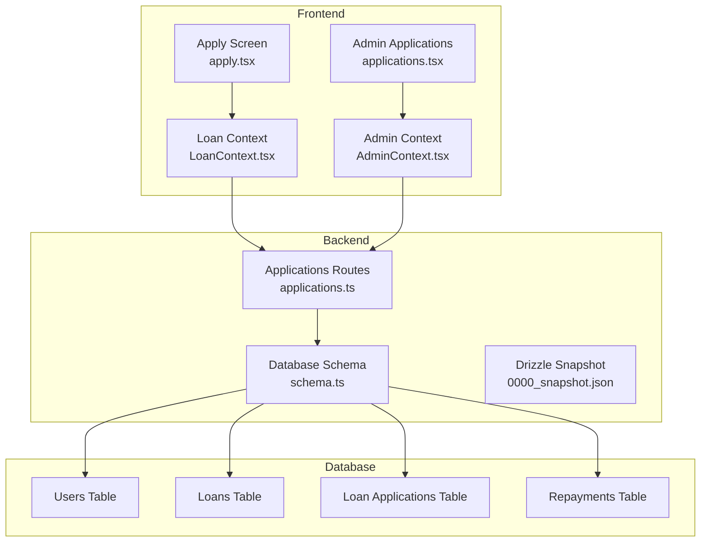
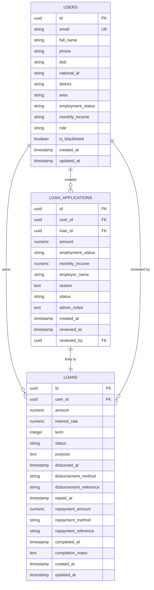
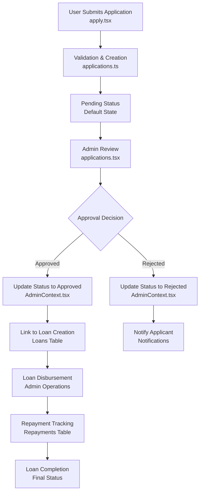
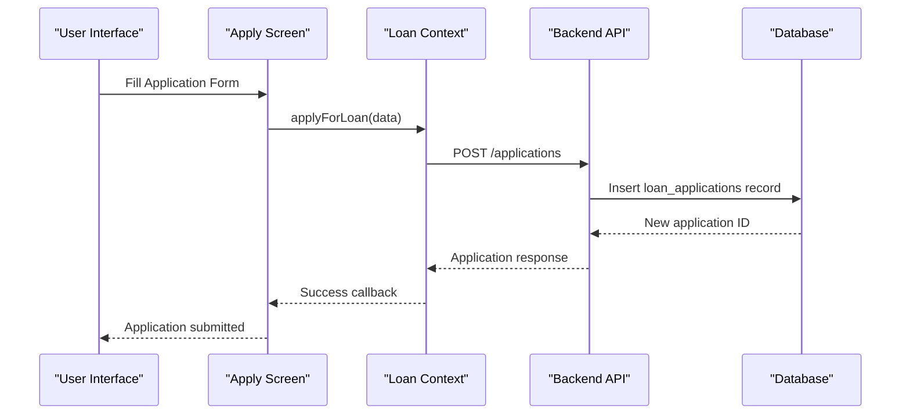
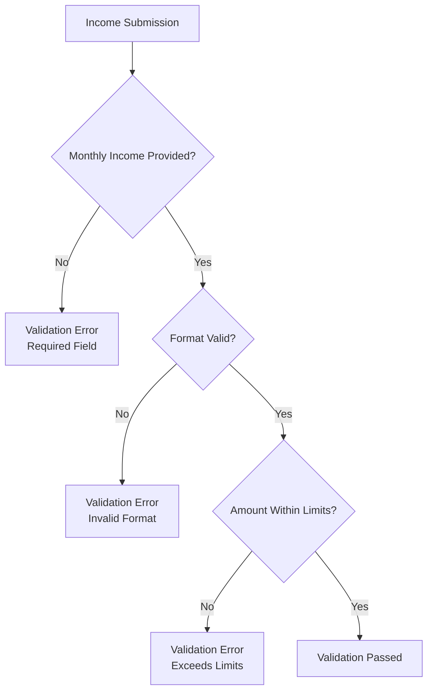
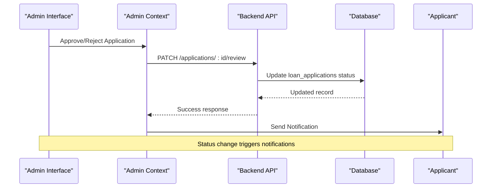
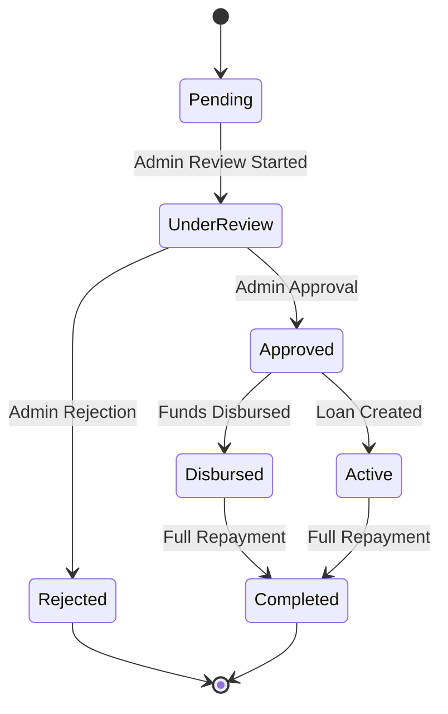
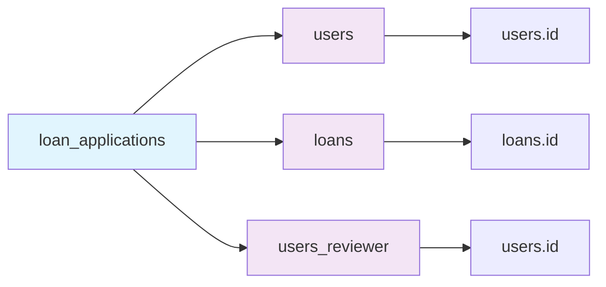
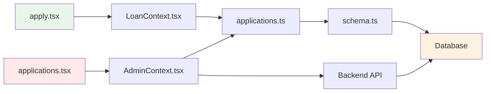

# Loan Application Schema

<cite>
**Referenced Files in This Document**
- [schema.ts](file://backend/src/db/schema.ts)
- [0000_snapshot.json](file://backend/drizzle/meta/0000_snapshot.json)
- [applications.ts](file://backend/src/routes/applications.ts)
- [apply.tsx](file://app/(tabs)/apply.tsx)
- [LoanContext.tsx](file://contexts/LoanContext.tsx)
- [applications.tsx](file://app/admin/(tabs)/applications.tsx)
- [AdminContext.tsx](file://contexts/AdminContext.tsx)
- [migrate.sql](file://backend/migrate.sql)
- [update-schema.sql](file://backend/update-schema.sql)
</cite>

## Table of Contents
1. [Introduction](#introduction)
2. [Project Structure](#project-structure)
3. [Core Components](#core-components)
4. [Architecture Overview](#architecture-overview)
5. [Detailed Component Analysis](#detailed-component-analysis)
6. [Dependency Analysis](#dependency-analysis)
7. [Performance Considerations](#performance-considerations)
8. [Troubleshooting Guide](#troubleshooting-guide)
9. [Conclusion](#conclusion)

## Introduction
This document provides comprehensive data model documentation for the Loan Application schema in PHOENIX. It details the loan_applications table structure, application-specific fields, status workflow, administrative review process, relationships with users and loans tables, validation rules, and practical examples of the complete application lifecycle.

## Project Structure
The PHOENIX application follows a clear separation between frontend and backend components, with the database schema defined in TypeScript using Drizzle ORM and PostgreSQL as the backend database.

**Diagram sources**
- [apply.tsx](file://app/(tabs)/apply.tsx#L125-L255)
- [LoanContext.tsx:198-261](file://contexts/LoanContext.tsx#L198-L261)
- [applications.tsx](file://app/admin/(tabs)/applications.tsx#L155-L328)
- [AdminContext.tsx:311-361](file://contexts/AdminContext.tsx#L311-L361)
- [schema.ts:48-63](file://backend/src/db/schema.ts#L48-L63)

**Section sources**
- [schema.ts:1-146](file://backend/src/db/schema.ts#L1-L146)
- [0000_snapshot.json:6-140](file://backend/drizzle/meta/0000_snapshot.json#L6-L140)

## Core Components

### Loan Applications Table Structure
The loan_applications table serves as the central repository for loan application data with the following key fields:

**Primary Fields:**
- `id`: UUID primary key with auto-generated random values
- `userId`: Foreign key linking to users table
- `loanId`: Optional foreign key linking to loans table (nullable)

**Financial Information:**
- `amount`: Decimal field storing loan amount with precision 12, scale 2
- `employmentStatus`: String field with maximum 50 characters
- `monthlyIncome`: Decimal field with precision 12, scale 2 for monthly income verification

**Application Details:**
- `employerName`: Optional employer name up to 255 characters
- `reason`: Optional text field for application reason
- `status`: String field with default 'pending', supporting workflow states

**Administrative Review Fields:**
- `adminNotes`: Optional text field for reviewer comments
- `reviewedAt`: Timestamp for review completion
- `reviewedBy`: Foreign key linking to users table (reviewer)

**Timestamp Management:**
- `createdAt`: Automatic timestamp for record creation

**Section sources**
- [schema.ts:48-63](file://backend/src/db/schema.ts#L48-L63)
- [0000_snapshot.json:7-91](file://backend/drizzle/meta/0000_snapshot.json#L7-L91)

### Relationship Definitions
The schema establishes clear relationships between entities:

**Diagram sources**
- [schema.ts:4-46](file://backend/src/db/schema.ts#L4-L46)
- [schema.ts:48-63](file://backend/src/db/schema.ts#L48-L63)
- [schema.ts:98-126](file://backend/src/db/schema.ts#L98-L126)

**Section sources**
- [schema.ts:98-126](file://backend/src/db/schema.ts#L98-L126)

## Architecture Overview

### Application Lifecycle Workflow
The loan application process follows a structured workflow from submission to completion:

**Diagram sources**
- [apply.tsx](file://app/(tabs)/apply.tsx#L209-L232)
- [applications.ts:111-138](file://backend/src/routes/applications.ts#L111-L138)
- [applications.tsx](file://app/admin/(tabs)/applications.tsx#L170-L204)
- [AdminContext.tsx:311-361](file://contexts/AdminContext.tsx#L311-L361)

### Frontend-Backend Integration
The system integrates frontend components with backend APIs through well-defined interfaces:

**Diagram sources**
- [apply.tsx](file://app/(tabs)/apply.tsx#L209-L232)
- [LoanContext.tsx:198-261](file://contexts/LoanContext.tsx#L198-L261)
- [applications.ts:111-138](file://backend/src/routes/applications.ts#L111-L138)

**Section sources**
- [apply.tsx](file://app/(tabs)/apply.tsx#L125-L255)
- [LoanContext.tsx:198-261](file://contexts/LoanContext.tsx#L198-L261)
- [applications.ts:111-138](file://backend/src/routes/applications.ts#L111-L138)

## Detailed Component Analysis

### Data Validation Rules

#### Income Verification Validation
The system implements comprehensive validation for income verification:

**Diagram sources**
- [apply.tsx](file://app/(tabs)/apply.tsx#L163-L171)
- [LoanContext.tsx:213-219](file://contexts/LoanContext.tsx#L213-L219)

#### Employment Status Validation
Employment status validation ensures comprehensive coverage of employment categories:

**Supported Employment Categories:**
- Employed (Government)
- Employed (Private)
- Self-Employed / Business
- Freelancer
- Student
- Unemployed
- Other

**Section sources**
- [apply.tsx](file://app/(tabs)/apply.tsx#L35-L38)
- [apply.tsx](file://app/(tabs)/apply.tsx#L163-L171)

### Administrative Review Process

#### Review Workflow Implementation
The administrative review process follows a structured approach:

**Diagram sources**
- [applications.tsx](file://app/admin/(tabs)/applications.tsx#L170-L204)
- [AdminContext.tsx:311-361](file://contexts/AdminContext.tsx#L311-L361)
- [applications.ts:141-165](file://backend/src/routes/applications.ts#L141-L165)

#### Administrative Fields Management
The review process manages several administrative fields:

**Review Tracking Fields:**
- `reviewedAt`: Timestamp of review completion
- `reviewedBy`: Foreign key linking to reviewer user
- `adminNotes`: Optional reviewer comments
- `status`: Updated to approved or rejected

**Section sources**
- [applications.ts:141-165](file://backend/src/routes/applications.ts#L141-L165)
- [applications.tsx](file://app/admin/(tabs)/applications.tsx#L111-L128)

### Application Status Workflow

#### Status Transition States
The loan application follows a defined status workflow:

**Diagram sources**
- [applications.ts:19-22](file://backend/src/routes/applications.ts#L19-L22)
- [applications.tsx](file://app/admin/(tabs)/applications.tsx#L14-L23)

#### Status Mapping
The system maintains consistent status mapping between frontend and backend:

**Backend Status Values:** pending, under_review, approved, rejected
**Frontend Status Values:** submitted, under_review, approved, rejected, disbursed, active, completed

**Section sources**
- [applications.ts:19-22](file://backend/src/routes/applications.ts#L19-L22)
- [LoanContext.tsx:118-118](file://contexts/LoanContext.tsx#L118-L118)

### Relationship with Users and Loans Tables

#### User Relationship
Each loan application is associated with a user through the `userId` foreign key, establishing bidirectional relationships:

**User-Application Relationship:**
- One-to-many: Users can have multiple applications
- Application belongs to exactly one user
- User profile information is accessible through joins

#### Loan Linkage
The optional `loanId` foreign key creates a direct relationship to the loans table:

**Loan-Application Linkage:**
- Optional relationship (nullable)
- Allows applications to be linked to created loans
- Supports approval-to-disbursement workflow
- Enables audit trail of application-to-loan mapping

**Section sources**
- [schema.ts:48-63](file://backend/src/db/schema.ts#L48-L63)
- [schema.ts:113-126](file://backend/src/db/schema.ts#L113-L126)

## Dependency Analysis

### Database Schema Dependencies
The loan applications table has well-defined foreign key relationships:

**Diagram sources**
- [schema.ts:48-63](file://backend/src/db/schema.ts#L48-L63)
- [0000_snapshot.json:94-133](file://backend/drizzle/meta/0000_snapshot.json#L94-L133)

### Frontend-Backend Data Flow
The system maintains consistent data flow between frontend and backend components:

**Diagram sources**
- [apply.tsx](file://app/(tabs)/apply.tsx#L209-L232)
- [LoanContext.tsx:198-261](file://contexts/LoanContext.tsx#L198-L261)
- [applications.ts:111-138](file://backend/src/routes/applications.ts#L111-L138)
- [applications.tsx](file://app/admin/(tabs)/applications.tsx#L170-L204)
- [AdminContext.tsx:311-361](file://contexts/AdminContext.tsx#L311-L361)

**Section sources**
- [schema.ts:98-126](file://backend/src/db/schema.ts#L98-L126)
- [0000_snapshot.json:94-133](file://backend/drizzle/meta/0000_snapshot.json#L94-L133)

## Performance Considerations

### Database Indexing Strategy
The schema includes strategic foreign key indexing for optimal query performance:

**Indexed Foreign Keys:**
- `loan_applications.user_id` - User lookup performance
- `loan_applications.loan_id` - Application-to-loan relationships
- `loan_applications.reviewed_by` - Reviewer tracking
- `loans.user_id` - User-to-loan relationships

### Query Optimization
Recommended query patterns for optimal performance:

**Common Query Patterns:**
- Application listing with user and loan details
- User-specific application filtering
- Status-based filtering for admin dashboards
- Recent application sorting by creation date

### Data Type Optimization
The schema uses appropriate data types for optimal storage and performance:

**Decimal Precision:**
- Amount fields use numeric(12,2) for financial accuracy
- Interest rates use numeric(5,2) for percentage calculations
- Monthly income uses numeric(12,2) for income verification

## Troubleshooting Guide

### Common Validation Issues

#### Income Validation Errors
**Issue:** Income format validation failures
**Solution:** Ensure income is entered as a valid numeric value without special characters

#### Employment Status Validation
**Issue:** Employment status not in accepted list
**Solution:** Select from the predefined employment categories list

#### Application Submission Failures
**Issue:** Backend submission errors
**Solution:** Check network connectivity and verify user authentication headers

### Administrative Review Issues

#### Status Update Failures
**Issue:** Review status not updating
**Solution:** Verify admin credentials and ensure proper API endpoint access

#### Notification Delivery Problems
**Issue:** Applicant notifications not received
**Solution:** Check notification service configuration and user contact information

### Database Migration Issues

#### Schema Version Conflicts
**Issue:** Migration conflicts between development and production
**Solution:** Run database migrations in proper sequence using the migration scripts

**Section sources**
- [apply.tsx](file://app/(tabs)/apply.tsx#L163-L182)
- [applications.ts:141-165](file://backend/src/routes/applications.ts#L141-L165)
- [AdminContext.tsx:311-361](file://contexts/AdminContext.tsx#L311-L361)

## Conclusion

The PHOENIX loan application schema provides a robust foundation for loan processing with comprehensive validation, clear administrative workflows, and well-defined relationships between users, applications, and loans. The system supports the complete loan lifecycle from application submission through approval, disbursement, and repayment tracking.

Key strengths of the schema include:
- Comprehensive validation rules for income verification
- Structured administrative review process
- Clear status workflow transitions
- Well-defined foreign key relationships
- Scalable data types for financial accuracy
- Complete audit trail through timestamps and reviewer tracking

The implementation demonstrates best practices in database design, API integration, and user experience, providing a solid foundation for the PHOENIX lending platform.