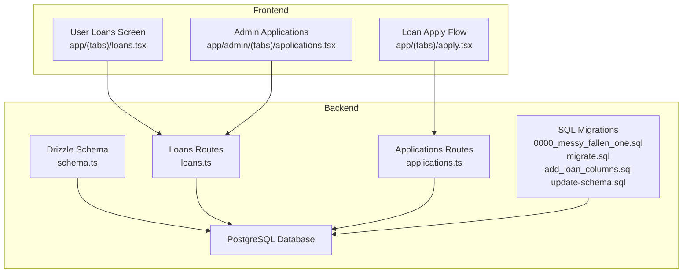
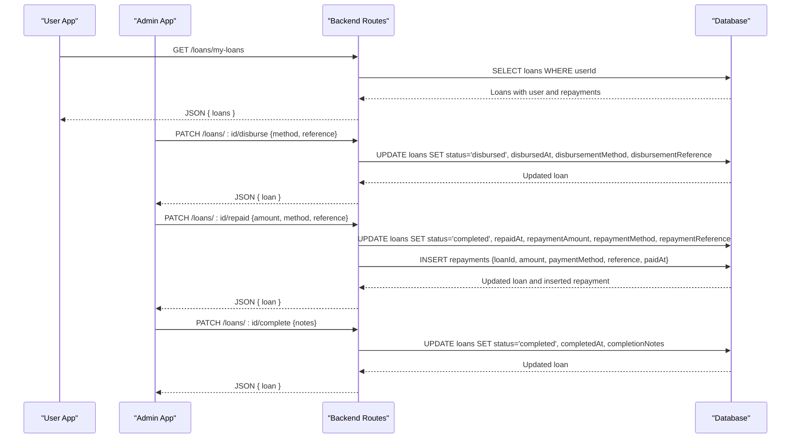
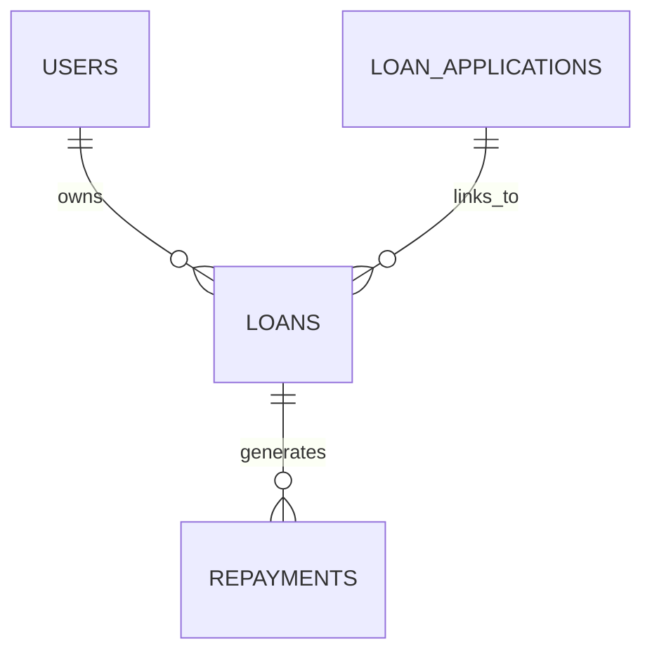
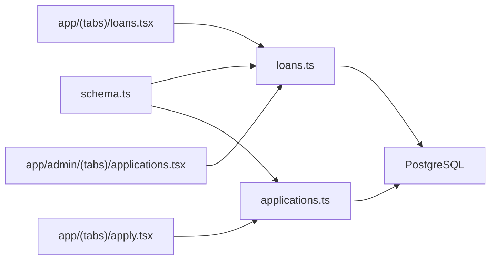

# Loan Schema

<cite>
**Referenced Files in This Document**
- [schema.ts](file://backend/src/db/schema.ts)
- [loans.ts](file://backend/src/routes/loans.ts)
- [applications.ts](file://backend/src/routes/applications.ts)
- [0000_messy_fallen_one.sql](file://backend/drizzle/0000_messy_fallen_one.sql)
- [migrate.sql](file://backend/migrate.sql)
- [add_loan_columns.sql](file://backend/add_loan_columns.sql)
- [update-schema.sql](file://backend/update-schema.sql)
- [loans.tsx](file://app/(tabs)/loans.tsx)
- [apply.tsx](file://app/(tabs)/apply.tsx)
- [applications.tsx](file://app/admin/(tabs)/applications.tsx)
</cite>

## Table of Contents
1. [Introduction](#introduction)
2. [Project Structure](#project-structure)
3. [Core Components](#core-components)
4. [Architecture Overview](#architecture-overview)
5. [Detailed Component Analysis](#detailed-component-analysis)
6. [Dependency Analysis](#dependency-analysis)
7. [Performance Considerations](#performance-considerations)
8. [Troubleshooting Guide](#troubleshooting-guide)
9. [Conclusion](#conclusion)

## Introduction
This document provides comprehensive data model documentation for the Loan schema in PHOENIX. It covers the loans table structure, lifecycle status values and their business meanings, disbursement and repayment tracking fields, relationships with users and loan applications, validation rules, and operational examples for creating loans, updating statuses, and processing disbursements. It also documents audit fields and timestamps.

## Project Structure
The Loan schema is defined in the backend database schema and exposed via backend routes. Frontend screens consume and present loan data, while administrative screens manage loan lifecycle actions.

**Diagram sources**
- [schema.ts:24-46](file://backend/src/db/schema.ts#L24-L46)
- [loans.ts:1-320](file://backend/src/routes/loans.ts#L1-L320)
- [applications.ts:1-168](file://backend/src/routes/applications.ts#L1-L168)
- [0000_messy_fallen_one.sql:17-36](file://backend/drizzle/0000_messy_fallen_one.sql#L17-L36)
- [migrate.sql:1-12](file://backend/migrate.sql#L1-L12)
- [add_loan_columns.sql:1-12](file://backend/add_loan_columns.sql#L1-L12)
- [update-schema.sql:1-32](file://backend/update-schema.sql#L1-L32)
- [loans.tsx](file://app/(tabs)/loans.tsx#L1-L545)
- [apply.tsx](file://app/(tabs)/apply.tsx#L1-L457)
- [applications.tsx](file://app/admin/(tabs)/applications.tsx#L1-L457)

**Section sources**
- [schema.ts:1-146](file://backend/src/db/schema.ts#L1-L146)
- [loans.ts:1-320](file://backend/src/routes/loans.ts#L1-L320)
- [applications.ts:1-168](file://backend/src/routes/applications.ts#L1-L168)
- [0000_messy_fallen_one.sql:1-93](file://backend/drizzle/0000_messy_fallen_one.sql#L1-L93)
- [migrate.sql:1-12](file://backend/migrate.sql#L1-L12)
- [add_loan_columns.sql:1-12](file://backend/add_loan_columns.sql#L1-L12)
- [update-schema.sql:1-32](file://backend/update-schema.sql#L1-L32)
- [loans.tsx](file://app/(tabs)/loans.tsx#L1-L545)
- [apply.tsx](file://app/(tabs)/apply.tsx#L1-L457)
- [applications.tsx](file://app/admin/(tabs)/applications.tsx#L1-L457)

## Core Components
- Loans table: central entity storing loan details, lifecycle status, disbursement and repayment metadata, and audit timestamps.
- Users table: borrower identity and profile used to establish ownership of loans.
- Loan Applications table: pre-loan application records linked to loans.
- Repayments table: scheduled and paid repayment records per loan.
- Backend routes: APIs for CRUD and lifecycle operations on loans and applications.
- Frontend screens: user and admin interfaces interacting with the backend.

Key fields in the Loans table:
- Identity: id, userId (foreign key to users)
- Loan terms: amount (precision 12, scale 2), interestRate (precision 5, scale 2), term (integer in months), purpose (text)
- Lifecycle status: status (varchar, default "pending"), with values including pending, approved, rejected, active, disbursed, completed, defaulted
- Disbursement tracking: disbursedAt (timestamp), disbursementMethod (varchar), disbursementReference (varchar)
- Repayment tracking: repaidAt (timestamp), repaymentAmount (precision 12, scale 2), repaymentMethod (varchar), repaymentReference (varchar)
- Completion: completedAt (timestamp), completionNotes (text)
- Audit: createdAt, updatedAt (timestamps)

Relationships:
- One-to-many: users → loans (via userId)
- One-to-one/many: loanApplications → loans (via loanId)
- One-to-many: loans → repayments (via loanId)

**Section sources**
- [schema.ts:24-46](file://backend/src/db/schema.ts#L24-L46)
- [schema.ts:98-133](file://backend/src/db/schema.ts#L98-L133)
- [0000_messy_fallen_one.sql:17-36](file://backend/drizzle/0000_messy_fallen_one.sql#L17-L36)

## Architecture Overview
The Loan lifecycle spans frontend user actions, backend route handlers, and database persistence. Administrative actions update loan status and associated metadata, while user-facing screens reflect current status and enable repayment actions.

**Diagram sources**
- [loans.ts:115-138](file://backend/src/routes/loans.ts#L115-L138)
- [loans.ts:224-250](file://backend/src/routes/loans.ts#L224-L250)
- [loans.ts:252-290](file://backend/src/routes/loans.ts#L252-L290)
- [loans.ts:292-317](file://backend/src/routes/loans.ts#L292-L317)

## Detailed Component Analysis

### Loans Table Data Model
The Loans table encapsulates the loan’s financial and lifecycle attributes, plus audit timestamps.

**Diagram sources**
- [schema.ts:24-46](file://backend/src/db/schema.ts#L24-L46)
- [schema.ts:48-63](file://backend/src/db/schema.ts#L48-L63)
- [schema.ts:65-77](file://backend/src/db/schema.ts#L65-L77)
- [schema.ts:98-133](file://backend/src/db/schema.ts#L98-L133)

Loan fields and constraints:
- amount: decimal(12,2), not null
- interestRate: decimal(5,2), not null
- term: integer (months), not null
- status: varchar(20), not null, default "pending"
- purpose: text
- disbursedAt: timestamp
- disbursementMethod: varchar(50)
- disbursementReference: varchar(100)
- repaidAt: timestamp
- repaymentAmount: decimal(12,2)
- repaymentMethod: varchar(50)
- repaymentReference: varchar(100)
- completedAt: timestamp
- completionNotes: text
- createdAt: timestamp, defaultNow, not null
- updatedAt: timestamp, defaultNow, not null

Foreign keys:
- userId references users(id)

**Section sources**
- [schema.ts:24-46](file://backend/src/db/schema.ts#L24-L46)
- [schema.ts:98-111](file://backend/src/db/schema.ts#L98-L111)

### Loan Lifecycle Status Values and Business Meanings
- pending: Initial state after loan creation or application submission.
- approved: Administrative approval granted; awaiting disbursement.
- rejected: Application or loan declined.
- active: Funds disbursed and loan is in repayment period.
- disbursed: Funds transferred to the borrower (commonly used during active phase).
- completed: Full repayment recorded and loan closed.
- defaulted: Borrower failed to meet repayment obligations.

Note: The backend schema defines status with values including pending, approved, rejected, active, disbursed, completed, defaulted. The frontend screens define a separate application status model with different values (submitted, under_review, approved, rejected, disbursed, active, completed, defaulted). These are distinct models for application vs. loan entities.

**Section sources**
- [schema.ts:30-30](file://backend/src/db/schema.ts#L30-L30)
- [loans.tsx](file://app/(tabs)/loans.tsx#L14-L23)
- [applications.tsx](file://app/admin/(tabs)/applications.tsx#L14-L23)

### Disbursement Fields
- disbursedAt: timestamp indicating when funds were transferred.
- disbursementMethod: varchar describing the channel (e.g., mobile money providers).
- disbursementReference: varchar reference or transaction ID.

Backend operations:
- Endpoint: PATCH /loans/:id/disburse
- Sets status to "disbursed", writes disbursedAt, disbursementMethod, disbursementReference, and updatedAt.

**Section sources**
- [schema.ts:33-35](file://backend/src/db/schema.ts#L33-L35)
- [loans.ts:224-250](file://backend/src/routes/loans.ts#L224-L250)

### Repayment Tracking Fields
- repaidAt: timestamp marking full repayment completion.
- repaymentAmount: decimal(12,2) representing total repayment amount.
- repaymentMethod: varchar describing payment channel.
- repaymentReference: varchar reference or transaction ID.

Backend operations:
- Endpoint: PATCH /loans/:id/repaid
- Sets status to "completed", writes repaidAt, repaymentAmount, repaymentMethod, repaymentReference, and updatedAt.
- On successful update, inserts a corresponding repayment record with amount, dueDate, paidDate, status, paymentMethod, reference, paidAt.

**Section sources**
- [schema.ts:37-40](file://backend/src/db/schema.ts#L37-L40)
- [loans.ts:252-290](file://backend/src/routes/loans.ts#L252-L290)
- [schema.ts:65-77](file://backend/src/db/schema.ts#L65-L77)

### Relationship with Users and Loan Applications
- User ownership: loans.userId links to users.id.
- Application linkage: loanApplications.loanId optionally links to loans.id.
- Repayment linkage: repayments.loanId links to loans.id.

Backend relations:
- loans.user, loans.repayments, loans.application
- loanApplications.user, loanApplications.loan, loanApplications.reviewer
- repayments.loan

**Section sources**
- [schema.ts:98-133](file://backend/src/db/schema.ts#L98-L133)

### Data Validation Rules and Business Constraints
Backend validation (Zod) for creating loans:
- amount: string (validated via numeric parsing)
- interestRate: string (validated via numeric parsing)
- term: number (months)
- purpose: optional string

Backend validation (Zod) for reviewing applications:
- status: enum ["pending","under_review","approved","rejected"]
- adminNotes: optional string

Numeric precision constraints enforced by schema:
- amount: decimal(12,2)
- interestRate: decimal(5,2)
- repaymentAmount: decimal(12,2)

Status transitions (administrative):
- disburse: sets status to "disbursed"
- repaid: sets status to "completed"
- complete: sets status to "completed"

**Section sources**
- [loans.ts:85-90](file://backend/src/routes/loans.ts#L85-L90)
- [applications.ts:11-22](file://backend/src/routes/applications.ts#L11-L22)
- [schema.ts:27-28](file://backend/src/db/schema.ts#L27-L28)
- [schema.ts:38-38](file://backend/src/db/schema.ts#L38-L38)

### Examples

#### Example 1: Loan Creation
- Endpoint: POST /loans
- Request payload: { amount: string, interestRate: string, term: number, purpose?: string }
- Behavior: Creates a loan with status "pending" and associates with the authenticated user.

**Section sources**
- [loans.ts:170-197](file://backend/src/routes/loans.ts#L170-L197)

#### Example 2: Status Update
- Endpoint: PATCH /loans/:id/status
- Request payload: { status: "approved"|"rejected"|"active"|"completed"|"defaulted" }
- Behavior: Updates loan status and updatedAt timestamp.

**Section sources**
- [loans.ts:199-222](file://backend/src/routes/loans.ts#L199-L222)

#### Example 3: Disbursement Process
- Endpoint: PATCH /loans/:id/disburse
- Request payload: { disbursementMethod: string, disbursementReference: string }
- Behavior: Marks loan as "disbursed", sets disbursedAt, and stores method/reference.

**Section sources**
- [loans.ts:224-250](file://backend/src/routes/loans.ts#L224-L250)

#### Example 4: Mark Loan as Repaid
- Endpoint: PATCH /loans/:id/repaid
- Request payload: { repaymentAmount: number, repaymentMethod: string, repaymentReference: string }
- Behavior: Marks loan as "completed", sets repaidAt and repayment metadata, and inserts a repayment record.

**Section sources**
- [loans.ts:252-290](file://backend/src/routes/loans.ts#L252-L290)

#### Example 5: Complete Loan
- Endpoint: PATCH /loans/:id/complete
- Request payload: { completionNotes?: string }
- Behavior: Marks loan as "completed" and sets completedAt and completionNotes.

**Section sources**
- [loans.ts:292-317](file://backend/src/routes/loans.ts#L292-L317)

### Audit Fields and Timestamp Management
- createdAt: automatically set on insert
- updatedAt: updated on each write operation (explicitly set in several endpoints)
- disbursedAt, repaidAt, completedAt: set when respective actions occur

**Section sources**
- [schema.ts:44-45](file://backend/src/db/schema.ts#L44-L45)
- [loans.ts:206-212](file://backend/src/routes/loans.ts#L206-L212)
- [loans.ts:231-240](file://backend/src/routes/loans.ts#L231-L240)
- [loans.ts:259-269](file://backend/src/routes/loans.ts#L259-L269)
- [loans.ts:299-307](file://backend/src/routes/loans.ts#L299-L307)

## Dependency Analysis
The backend routes depend on the schema definitions and Drizzle ORM for database operations. The frontend screens depend on backend routes for data and actions.

**Diagram sources**
- [schema.ts:1-146](file://backend/src/db/schema.ts#L1-L146)
- [loans.ts:1-320](file://backend/src/routes/loans.ts#L1-L320)
- [applications.ts:1-168](file://backend/src/routes/applications.ts#L1-L168)
- [loans.tsx](file://app/(tabs)/loans.tsx#L1-L545)
- [apply.tsx](file://app/(tabs)/apply.tsx#L1-L457)
- [applications.tsx](file://app/admin/(tabs)/applications.tsx#L1-L457)

**Section sources**
- [schema.ts:1-146](file://backend/src/db/schema.ts#L1-L146)
- [loans.ts:1-320](file://backend/src/routes/loans.ts#L1-L320)
- [applications.ts:1-168](file://backend/src/routes/applications.ts#L1-L168)
- [loans.tsx](file://app/(tabs)/loans.tsx#L1-L545)
- [apply.tsx](file://app/(tabs)/apply.tsx#L1-L457)
- [applications.tsx](file://app/admin/(tabs)/applications.tsx#L1-L457)

## Performance Considerations
- Numeric precision: decimal(12,2) for monetary fields ensures accurate calculations and storage limits.
- Indexes: consider adding indexes on frequently queried columns (e.g., loans.userId, loan_applications.status) to improve query performance.
- Batch operations: group updates (e.g., status + updatedAt) to minimize round-trips.
- Frontend caching: AsyncStorage usage reduces network requests but should be synchronized with backend state.

## Troubleshooting Guide
Common issues and resolutions:
- Missing disbursement/repayment/completion columns: migrations add these columns if absent.
  - See [migrate.sql:1-12](file://backend/migrate.sql#L1-L12), [add_loan_columns.sql:1-12](file://backend/add_loan_columns.sql#L1-L12), [update-schema.sql:1-32](file://backend/update-schema.sql#L1-L32)
- Unauthorized access: ensure X-User-Id header is provided for user-specific endpoints.
  - See [loans.ts:119-123](file://backend/src/routes/loans.ts#L119-L123), [applications.ts:58-62](file://backend/src/routes/applications.ts#L58-L62)
- Validation errors: confirm payload matches Zod schemas for create/update operations.
  - See [loans.ts:85-90](file://backend/src/routes/loans.ts#L85-L90), [applications.ts:11-22](file://backend/src/routes/applications.ts#L11-L22)
- Status transitions: verify allowed transitions align with business rules before calling PATCH endpoints.
  - See [loans.ts:199-222](file://backend/src/routes/loans.ts#L199-L222), [loans.ts:224-250](file://backend/src/routes/loans.ts#L224-L250), [loans.ts:252-290](file://backend/src/routes/loans.ts#L252-L290), [loans.ts:292-317](file://backend/src/routes/loans.ts#L292-L317)

**Section sources**
- [migrate.sql:1-12](file://backend/migrate.sql#L1-L12)
- [add_loan_columns.sql:1-12](file://backend/add_loan_columns.sql#L1-L12)
- [update-schema.sql:1-32](file://backend/update-schema.sql#L1-L32)
- [loans.ts:119-123](file://backend/src/routes/loans.ts#L119-L123)
- [applications.ts:58-62](file://backend/src/routes/applications.ts#L58-L62)
- [loans.ts:85-90](file://backend/src/routes/loans.ts#L85-L90)
- [applications.ts:11-22](file://backend/src/routes/applications.ts#L11-L22)
- [loans.ts:199-222](file://backend/src/routes/loans.ts#L199-L222)
- [loans.ts:224-250](file://backend/src/routes/loans.ts#L224-L250)
- [loans.ts:252-290](file://backend/src/routes/loans.ts#L252-L290)
- [loans.ts:292-317](file://backend/src/routes/loans.ts#L292-L317)

## Conclusion
The Loan schema in PHOENIX is designed around precise financial data types, clear lifecycle status tracking, robust disbursement and repayment metadata, and strong relationships with users and applications. Backend routes enforce validation and maintain audit timestamps, while frontend screens provide intuitive user and admin experiences aligned with the loan lifecycle.