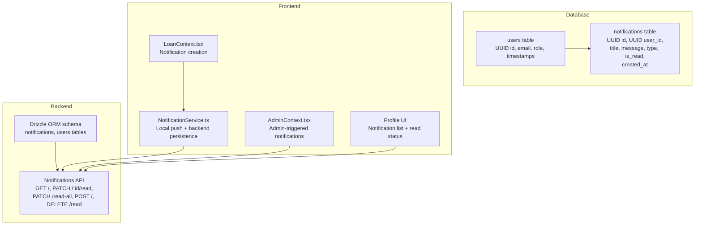
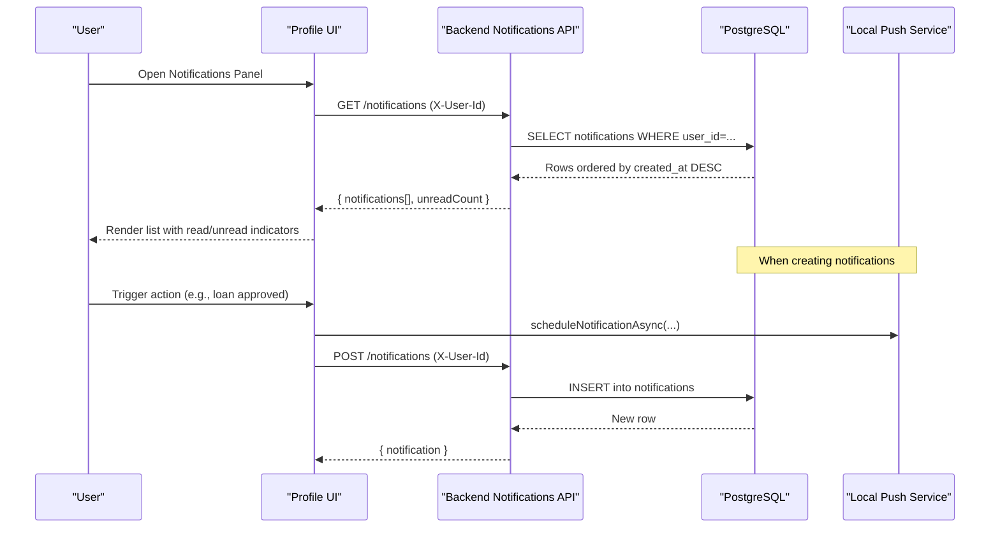
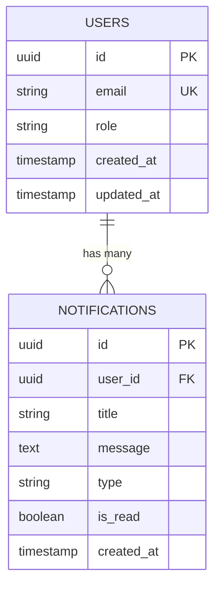
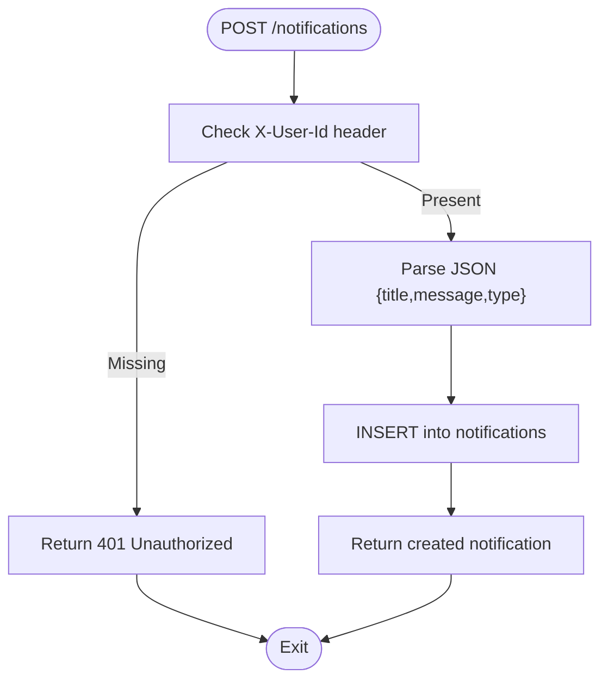
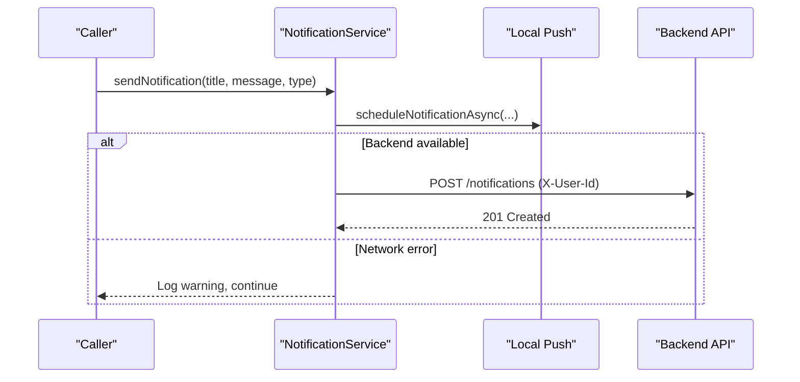
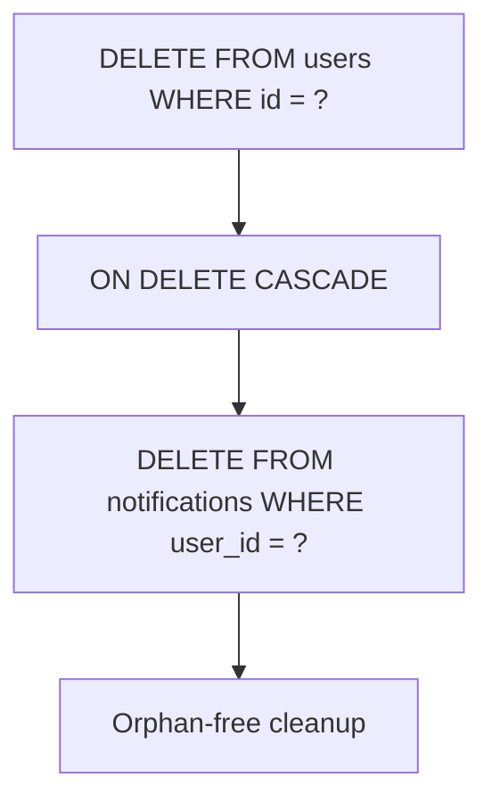
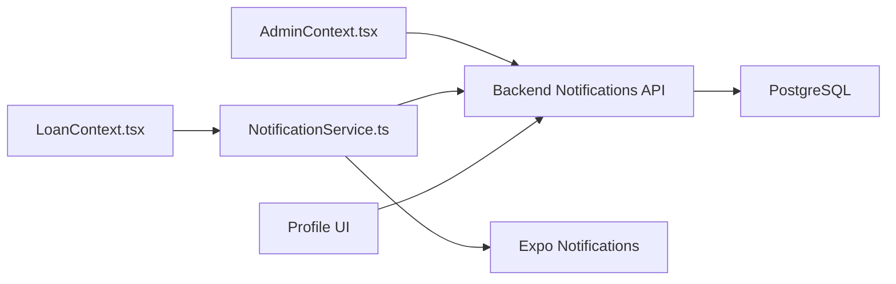

# Notification Schema

<cite>
**Referenced Files in This Document**
- [schema.ts](file://backend/src/db/schema.ts)
- [create-notifications-table.sql](file://backend/create-notifications-table.sql)
- [notifications.ts](file://backend/src/routes/notifictions.ts)
- [NotificationService.ts](file://services/NotificationService.ts)
- [LoanContext.tsx](file://contexts/LoanContext.tsx)
- [AdminContext.tsx](file://contexts/AdminContext.tsx)
- [profile.tsx](file://app/(tabs)/profile.tsx)
- [NotificationTest.tsx](file://components/NotificationTest.tsx)
- [debug-notifications.js](file://debug-notifications.js)
</cite>

## Table of Contents
1. [Introduction](#introduction)
2. [Project Structure](#project-structure)
3. [Core Components](#core-components)
4. [Architecture Overview](#architecture-overview)
5. [Detailed Component Analysis](#detailed-component-analysis)
6. [Dependency Analysis](#dependency-analysis)
7. [Performance Considerations](#performance-considerations)
8. [Troubleshooting Guide](#troubleshooting-guide)
9. [Conclusion](#conclusion)

## Introduction
This document provides comprehensive data model documentation for the Notification schema in PHOENIX. It covers the notifications table structure, foreign key relationships, type classification, read status tracking, automatic deletion behavior on user removal, and timestamp management for ordering. It also documents how notifications integrate with the push notification system and how templates are managed through the application’s frontend and backend components.

## Project Structure
The notification system spans three primary areas:
- Database schema definition and migration scripts
- Backend API routes for CRUD operations and read/unread management
- Frontend services and UI components for local push notifications and user-facing panels

**Diagram sources**
- [schema.ts:79-88](file://backend/src/db/schema.ts#L79-L88)
- [create-notifications-table.sql:5-17](file://backend/create-notifications-table.sql#L5-L17)
- [notifications.ts:8-103](file://backend/src/routes/notifictions.ts#L8-L103)
- [NotificationService.ts:93-134](file://services/NotificationService.ts#L93-L134)
- [LoanContext.tsx:136-147](file://contexts/LoanContext.tsx#L136-L147)
- [AdminContext.tsx:319-356](file://contexts/AdminContext.tsx#L319-L356)
- [profile.tsx](file://app/(tabs)/profile.tsx#L15-L45)

**Section sources**
- [schema.ts:79-88](file://backend/src/db/schema.ts#L79-L88)
- [create-notifications-table.sql:5-17](file://backend/create-notifications-table.sql#L5-L17)
- [notifications.ts:8-103](file://backend/src/routes/notifictions.ts#L8-L103)
- [NotificationService.ts:93-134](file://services/NotificationService.ts#L93-L134)
- [LoanContext.tsx:136-147](file://contexts/LoanContext.tsx#L136-L147)
- [AdminContext.tsx:319-356](file://contexts/AdminContext.tsx#L319-L356)
- [profile.tsx](file://app/(tabs)/profile.tsx#L15-L45)

## Core Components
- Notifications table
  - Fields: id (UUID), userId (UUID, references users.id with cascade delete), title (VARCHAR 255), message (TEXT), type (VARCHAR 50), isRead (BOOLEAN, default false), createdAt (TIMESTAMP, default now)
  - Indexes: user_id, created_at, type, is_read
- Backend routes
  - GET /notifications: returns user-specific notifications ordered by created_at descending with unread count
  - PATCH /notifications/:id/read: marks a single notification as read
  - PATCH /notifications/read-all: marks all notifications for a user as read
  - POST /notifications: creates a notification for the current user
  - DELETE /notifications/read: deletes all read notifications for a user
- Frontend service
  - sendNotification: triggers local push notification and persists to backend
  - postNotificationToBackend: posts notification payload to backend API
- UI integration
  - Profile screen displays notifications with type-based styling and read indicators
  - LoanContext and AdminContext trigger notifications during key lifecycle events

**Section sources**
- [schema.ts:79-88](file://backend/src/db/schema.ts#L79-L88)
- [create-notifications-table.sql:5-23](file://backend/create-notifications-table.sql#L5-L23)
- [notifications.ts:8-103](file://backend/src/routes/notifictions.ts#L8-L103)
- [NotificationService.ts:93-134](file://services/NotificationService.ts#L93-L134)
- [profile.tsx](file://app/(tabs)/profile.tsx#L15-L45)

## Architecture Overview
The notification architecture combines local push notifications with persistent storage. Local notifications are handled by the frontend service and shown immediately. Persistent notifications are stored in the database and retrieved by the user profile UI.

**Diagram sources**
- [notifications.ts:8-33](file://backend/src/routes/notifictions.ts#L8-L33)
- [NotificationService.ts:71-114](file://services/NotificationService.ts#L71-L114)
- [profile.tsx](file://app/(tabs)/profile.tsx#L15-L45)

## Detailed Component Analysis

### Notifications Table Model
The notifications table enforces referential integrity with the users table and cascades deletions. Timestamps are used for ordering, and indexes optimize common queries.

**Diagram sources**
- [schema.ts:5-21](file://backend/src/db/schema.ts#L5-L21)
- [schema.ts:79-88](file://backend/src/db/schema.ts#L79-L88)
- [create-notifications-table.sql:5-17](file://backend/create-notifications-table.sql#L5-L17)

**Section sources**
- [schema.ts:79-88](file://backend/src/db/schema.ts#L79-L88)
- [create-notifications-table.sql:5-23](file://backend/create-notifications-table.sql#L5-L23)

### Backend Routes: CRUD and Status Management
- Retrieve notifications: Filters by user_id, orders by created_at descending, limits to 50, and computes unread count client-side
- Mark as read: Updates a single record to is_read=true
- Mark all as read: Bulk update for a user
- Create notification: Inserts a new record with provided title, message, and type (defaults to info)
- Delete read notifications: Removes records where is_read=true for a user

**Diagram sources**
- [notifications.ts:71-90](file://backend/src/routes/notifictions.ts#L71-L90)

**Section sources**
- [notifications.ts:8-103](file://backend/src/routes/notifictions.ts#L8-L103)

### Frontend Notification Service
The service handles two paths:
- Local push notifications: Immediate display using device APIs
- Backend persistence: Posts notifications to the backend API with the current user’s id

**Diagram sources**
- [NotificationService.ts:116-134](file://services/NotificationService.ts#L116-L134)
- [notifications.ts:71-90](file://backend/src/routes/notifictions.ts#L71-L90)

**Section sources**
- [NotificationService.ts:93-134](file://services/NotificationService.ts#L93-L134)

### Notification Types and Business Significance
The system supports a flexible type field. Examples observed in the codebase include:
- success: Used when a loan application is approved
- warning: Used when a loan application is rejected
- info: Default type when none is provided
- Additional types may be used for registration, loan_approved, loan_rejected, kyc_verified, etc.

These types drive UI styling and user perception of notification severity.

**Section sources**
- [AdminContext.tsx:325-329](file://contexts/AdminContext.tsx#L325-L329)
- [AdminContext.tsx:351-355](file://contexts/AdminContext.tsx#L351-L355)
- [LoanContext.tsx:268-272](file://contexts/LoanContext.tsx#L268-L272)

### Automatic Deletion Behavior on User Removal
The notifications table defines a foreign key constraint with ON DELETE CASCADE on the user_id field. This ensures that when a user is deleted, all associated notifications are automatically removed from the database.

**Diagram sources**
- [schema.ts](file://backend/src/db/schema.ts#L82)
- [create-notifications-table.sql:13-17](file://backend/create-notifications-table.sql#L13-L17)

**Section sources**
- [schema.ts](file://backend/src/db/schema.ts#L82)
- [create-notifications-table.sql:13-17](file://backend/create-notifications-table.sql#L13-L17)

### Timestamp Management and Ordering
- createdAt is stored with a default timestamp and used to order notifications in descending order (most recent first)
- Indexes on created_at and user_id optimize retrieval performance

**Section sources**
- [schema.ts](file://backend/src/db/schema.ts#L87)
- [create-notifications-table.sql:20-21](file://backend/create-notifications-table.sql#L20-L21)
- [notifications.ts:17-21](file://backend/src/routes/notifictions.ts#L17-L21)

### Examples

- Creating a notification
  - From frontend: Call the service to send a local notification and persist to backend
  - From backend: POST /notifications with title, message, type, and X-User-Id header
- User-specific delivery
  - Backend routes filter by X-User-Id header
  - Frontend fetches notifications using the same header
- Read/unread status management
  - Mark single: PATCH /notifications/:id/read
  - Mark all: PATCH /notifications/read-all
  - Delete read: DELETE /notifications/read

**Section sources**
- [NotificationService.ts:93-114](file://services/NotificationService.ts#L93-L114)
- [notifications.ts:35-103](file://backend/src/routes/notifictions.ts#L35-L103)
- [LoanContext.tsx:136-147](file://contexts/LoanContext.tsx#L136-L147)

### Integration with Push Notification System and Template Management
- Local push notifications are configured in the service with platform-specific channels and priorities
- Templates are not centralized in code; instead, the application constructs notification payloads (title, message, type) at call sites and sends them to the backend for persistence
- The UI renders notifications with type-based styling and read indicators

**Section sources**
- [NotificationService.ts:12-24](file://services/NotificationService.ts#L12-L24)
- [NotificationService.ts:51-60](file://services/NotificationService.ts#L51-L60)
- [profile.tsx](file://app/(tabs)/profile.tsx#L19-L25)

## Dependency Analysis
- Backend depends on Drizzle ORM for schema definitions and PostgreSQL for storage
- Frontend depends on Expo Notifications for local push and AsyncStorage for offline caching
- Admin and Loan contexts depend on the backend notifications API to deliver user-specific alerts

**Diagram sources**
- [AdminContext.tsx:319-356](file://contexts/AdminContext.tsx#L319-L356)
- [LoanContext.tsx:136-147](file://contexts/LoanContext.tsx#L136-L147)
- [NotificationService.ts:93-134](file://services/NotificationService.ts#L93-L134)
- [notifications.ts:8-103](file://backend/src/routes/notifictions.ts#L8-L103)

**Section sources**
- [AdminContext.tsx:319-356](file://contexts/AdminContext.tsx#L319-L356)
- [LoanContext.tsx:136-147](file://contexts/LoanContext.tsx#L136-L147)
- [NotificationService.ts:93-134](file://services/NotificationService.ts#L93-L134)
- [notifications.ts:8-103](file://backend/src/routes/notifictions.ts#L8-L103)

## Performance Considerations
- Indexes on user_id, created_at, type, and is_read improve query performance for retrieving and filtering notifications
- Ordering by created_at descending is efficient due to the index
- Limiting results to 50 prevents excessive payloads
- Local push notifications avoid network latency for immediate feedback

[No sources needed since this section provides general guidance]

## Troubleshooting Guide
- Local notifications not appearing
  - Verify permissions and device support; the service checks for Expo Go and device capability
  - Use the debug script to validate scheduling
- Backend notifications not persisted
  - Ensure X-User-Id header is present when calling POST /notifications
  - Confirm the user exists and is not deleted (cascade behavior removes notifications)
- Read/unread status not updating
  - Verify PATCH requests are sent with the correct notification id or user context
  - Check that the UI reflects the updated state after backend responses

**Section sources**
- [NotificationService.ts:26-69](file://services/NotificationService.ts#L26-L69)
- [debug-notifications.js:11-29](file://debug-notifications.js#L11-L29)
- [notifications.ts:71-103](file://backend/src/routes/notifictions.ts#L71-L103)

## Conclusion
The PHOENIX notification system combines robust database modeling with a responsive frontend push mechanism. The notifications table enforces referential integrity and automatic cleanup on user deletion, while the backend API provides essential CRUD and status management capabilities. Frontend services ensure immediate user feedback via local notifications and reliable persistence through the backend, enabling a seamless user experience across loan lifecycle events and administrative actions.