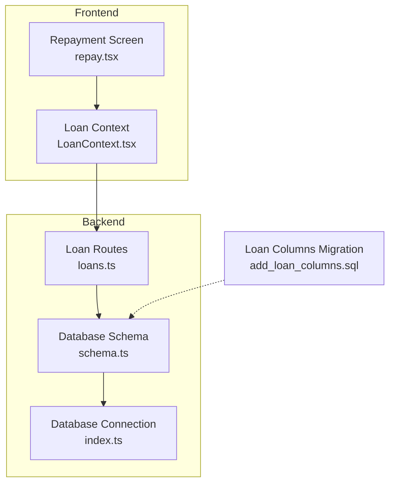
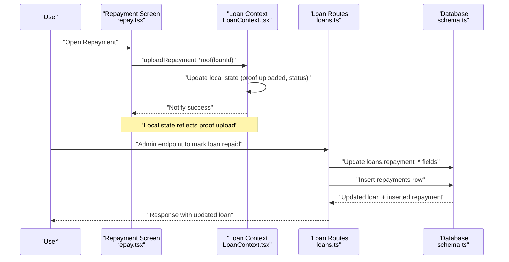
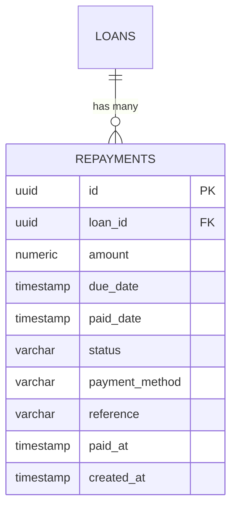
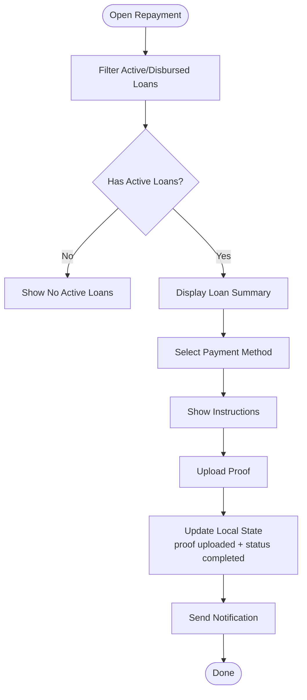
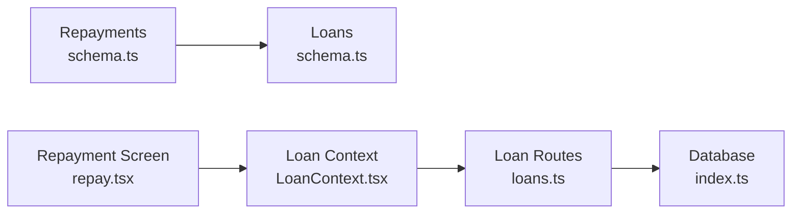

# Repayment Schema

<cite>
**Referenced Files in This Document**
- [schema.ts](file://backend/src/db/schema.ts)
- [loans.ts](file://backend/src/routes/loans.ts)
- [repay.tsx](file://app/(tabs)/repay.tsx)
- [LoanContext.tsx](file://contexts/LoanContext.tsx)
- [add_loan_columns.sql](file://backend/add_loan_columns.sql)
- [index.ts](file://backend/src/db/index.ts)
</cite>

## Table of Contents
1. [Introduction](#introduction)
2. [Project Structure](#project-structure)
3. [Core Components](#core-components)
4. [Architecture Overview](#architecture-overview)
5. [Detailed Component Analysis](#detailed-component-analysis)
6. [Dependency Analysis](#dependency-analysis)
7. [Performance Considerations](#performance-considerations)
8. [Troubleshooting Guide](#troubleshooting-guide)
9. [Conclusion](#conclusion)

## Introduction
This document provides comprehensive data model documentation for the Repayment schema in PHOENIX. It details the repayments table structure, relationships to the loan entity, repayment status system, payment method tracking, payment reference system, timestamps, and validation rules. It also explains how repayment records integrate with loan status management and outlines automated payment tracking behavior in the frontend.

## Project Structure
The repayment functionality spans three primary areas:
- Backend database schema and API routes
- Frontend repayment screen and loan context
- Supporting SQL migration script for loan table enhancements

**Diagram sources**
- [schema.ts:65-77](file://backend/src/db/schema.ts#L65-L77)
- [loans.ts:1-320](file://backend/src/routes/loans.ts#L1-L320)
- [repay.tsx:225-450](file://app/(tabs)/repay.tsx#L225-L450)
- [LoanContext.tsx:263-273](file://contexts/LoanContext.tsx#L263-L273)
- [add_loan_columns.sql:1-12](file://backend/add_loan_columns.sql#L1-L12)
- [index.ts:1-44](file://backend/src/db/index.ts#L1-L44)

**Section sources**
- [schema.ts:65-77](file://backend/src/db/schema.ts#L65-L77)
- [loans.ts:1-320](file://backend/src/routes/loans.ts#L1-L320)
- [repay.tsx:225-450](file://app/(tabs)/repay.tsx#L225-L450)
- [LoanContext.tsx:263-273](file://contexts/LoanContext.tsx#L263-L273)
- [add_loan_columns.sql:1-12](file://backend/add_loan_columns.sql#L1-L12)
- [index.ts:1-44](file://backend/src/db/index.ts#L1-L44)

## Core Components
- Repayments table: Stores individual repayment events linked to a loan, including amount, due date, paid date, status, payment method, and reference.
- Loans table: Tracks loan-level repayment metadata (repaidAt, repaymentAmount, repaymentMethod, repaymentReference) and integrates with repayments via foreign key.
- Frontend repayment screen: Guides users through payment methods, displays due dates, and allows uploading payment proof.
- Loan context: Provides local state updates for repayment proof uploads and status transitions.

Key fields and relationships:
- Repayments.loanId → Loans.id (foreign key)
- Repayments.status: pending, paid, overdue
- Repayments.paymentMethod and reference: payment channel and identifier
- Loans.repaymentAmount, repaymentMethod, repaymentReference: aggregated loan-level repayment tracking
- Frontend uploadRepaymentProof sets local status to completed and marks proof uploaded

**Section sources**
- [schema.ts:65-77](file://backend/src/db/schema.ts#L65-L77)
- [schema.ts:24-46](file://backend/src/db/schema.ts#L24-L46)
- [repay.tsx:225-450](file://app/(tabs)/repay.tsx#L225-L450)
- [LoanContext.tsx:263-273](file://contexts/LoanContext.tsx#L263-L273)

## Architecture Overview
The repayment lifecycle connects frontend actions, backend APIs, and database persistence:

**Diagram sources**
- [repay.tsx:238-260](file://app/(tabs)/repay.tsx#L238-L260)
- [LoanContext.tsx:263-273](file://contexts/LoanContext.tsx#L263-L273)
- [loans.ts:252-290](file://backend/src/routes/loans.ts#L252-L290)
- [schema.ts:65-77](file://backend/src/db/schema.ts#L65-L77)

## Detailed Component Analysis

### Repayments Table Model
The repayments table captures per-schedule-line repayment events:
- Fields:
  - id: primary key
  - loanId: foreign key to loans
  - amount: decimal amount of the repayment
  - dueDate: timestamp indicating due date
  - paidDate: timestamp when payment was recorded
  - status: pending, paid, overdue
  - paymentMethod: varchar up to 50 chars
  - reference: varchar up to 100 chars
  - paidAt: timestamp when processed
  - createdAt: audit timestamp

**Diagram sources**
- [schema.ts:65-77](file://backend/src/db/schema.ts#L65-L77)
- [schema.ts:104-111](file://backend/src/db/schema.ts#L104-L111)

**Section sources**
- [schema.ts:65-77](file://backend/src/db/schema.ts#L65-L77)

### Loans Table Integration
The loans table maintains aggregated repayment metadata:
- repaymentAmount, repaymentMethod, repaymentReference: set when a loan is marked repaid
- repaidAt: timestamp when the final repayment is recorded
- completedAt and completionNotes: optional completion tracking

The backend route for marking a loan as repaid updates these fields and inserts a corresponding repayment record.

**Section sources**
- [schema.ts:24-46](file://backend/src/db/schema.ts#L24-L46)
- [loans.ts:252-290](file://backend/src/routes/loans.ts#L252-L290)

### Frontend Repayment Flow
The repayment screen:
- Displays active loans eligible for repayment
- Shows due date countdown and overdue warnings
- Provides payment method instructions
- Allows uploading payment proof
- On upload, updates local state to reflect proof uploaded and sets status to completed

**Diagram sources**
- [repay.tsx:225-450](file://app/(tabs)/repay.tsx#L225-L450)
- [LoanContext.tsx:263-273](file://contexts/LoanContext.tsx#L263-L273)

**Section sources**
- [repay.tsx:225-450](file://app/(tabs)/repay.tsx#L225-L450)
- [LoanContext.tsx:263-273](file://contexts/LoanContext.tsx#L263-L273)

### Status System and Transition Logic
- Repayment statuses:
  - pending: scheduled but unpaid
  - paid: successfully processed
  - overdue: past due date without payment
- Transition triggers:
  - Creation: new repayment rows initialized as pending
  - Paid: upon successful processing (backend route sets paid fields and inserts repayment)
  - Overdue: calculated based on dueDate vs current time in frontend logic

Note: The backend route for marking a loan repaid updates loan-level repayment fields and inserts a repayment record. The frontend uploadRepaymentProof updates local state to reflect proof upload and completion.

**Section sources**
- [schema.ts:72](file://backend/src/db/schema.ts#L72)
- [loans.ts:252-290](file://backend/src/routes/loans.ts#L252-L290)
- [repay.tsx:300-336](file://app/(tabs)/repay.tsx#L300-L336)

### Payment Reference System and Timestamps
- Payment reference:
  - Stored in repayments.reference and loans.repaymentReference
  - Used to correlate payments with repayment records
- Timestamps:
  - dueDate: scheduling boundary
  - paidDate/paidAt: processing timestamps
  - createdAt: audit trail

**Section sources**
- [schema.ts:65-77](file://backend/src/db/schema.ts#L65-L77)
- [schema.ts:24-46](file://backend/src/db/schema.ts#L24-L46)

### Data Validation Rules
- Payment amount:
  - Decimal with precision and scale suitable for currency
- Due date:
  - Timestamp; overdue status derived from comparison with current time
- Status:
  - Enum-like constraint with allowed values
- Payment method:
  - Varchar with length limit; validated by backend route parameters

**Section sources**
- [schema.ts:69](file://backend/src/db/schema.ts#L69)
- [schema.ts:70](file://backend/src/db/schema.ts#L70)
- [schema.ts:72](file://backend/src/db/schema.ts#L72)
- [schema.ts:73](file://backend/src/db/schema.ts#L73)
- [loans.ts:252-290](file://backend/src/routes/loans.ts#L252-L290)

### Examples

#### Example 1: Creating a Repayment Schedule
- Create loan with amount, interestRate, term
- Backend ensures loan table has repayment columns
- On disbursement, loan status becomes disbursed
- Repayment schedule entries are created as repayments rows with dueDate and amount

**Section sources**
- [loans.ts:10-82](file://backend/src/routes/loans.ts#L10-L82)
- [add_loan_columns.sql:1-12](file://backend/add_loan_columns.sql#L1-L12)

#### Example 2: Recording an Individual Payment
- Admin calls endpoint to mark loan as repaid with repaymentAmount, repaymentMethod, repaymentReference
- Backend updates loans.repayment_* fields and inserts a repayments row
- Frontend receives updated loan data; user sees completed status

**Section sources**
- [loans.ts:252-290](file://backend/src/routes/loans.ts#L252-L290)

#### Example 3: Handling Overdue Payments
- Frontend calculates daysLeft from dueDate
- If negative, display overdue warning and penalty banner
- No automatic backend status change; manual admin intervention required to finalize

**Section sources**
- [repay.tsx:300-336](file://app/(tabs)/repay.tsx#L300-L336)

### Automated Payment Tracking and Loan Status Integration
- Frontend:
  - uploadRepaymentProof updates local state to mark proof uploaded and status completed
  - Immediate user feedback via notifications
- Backend:
  - Admin endpoint updates loan-level repayment fields and inserts repayment record
  - No automatic overdue-to-paid transitions; requires explicit admin action

**Section sources**
- [LoanContext.tsx:263-273](file://contexts/LoanContext.tsx#L263-L273)
- [loans.ts:252-290](file://backend/src/routes/loans.ts#L252-L290)

## Dependency Analysis
- Repayments depend on Loans via foreign key
- Frontend depends on backend routes for loan updates
- Database connection configured centrally

**Diagram sources**
- [schema.ts:65-77](file://backend/src/db/schema.ts#L65-L77)
- [schema.ts:104-111](file://backend/src/db/schema.ts#L104-L111)
- [repay.tsx:225-450](file://app/(tabs)/repay.tsx#L225-L450)
- [LoanContext.tsx:263-273](file://contexts/LoanContext.tsx#L263-L273)
- [loans.ts:1-320](file://backend/src/routes/loans.ts#L1-L320)
- [index.ts:1-44](file://backend/src/db/index.ts#L1-L44)

**Section sources**
- [schema.ts:65-77](file://backend/src/db/schema.ts#L65-L77)
- [schema.ts:104-111](file://backend/src/db/schema.ts#L104-L111)
- [repay.tsx:225-450](file://app/(tabs)/repay.tsx#L225-L450)
- [LoanContext.tsx:263-273](file://contexts/LoanContext.tsx#L263-L273)
- [loans.ts:1-320](file://backend/src/routes/loans.ts#L1-L320)
- [index.ts:1-44](file://backend/src/db/index.ts#L1-L44)

## Performance Considerations
- Prefer batched updates for repayment schedules when creating multiple installments
- Index dueDate for efficient overdue queries
- Use pagination for retrieving loan histories with many repayments
- Minimize redundant frontend state updates after backend responses

## Troubleshooting Guide
- Missing repayment columns on loans:
  - Ensure migration script has been applied to add repayment fields
- Repayment not reflected in frontend:
  - Verify uploadRepaymentProof executed and local state updated
  - Confirm backend route for marking loan repaid was called by admin
- Overdue status not updating:
  - Overdue is computed client-side; ensure dueDate is accurate and current time is correct
- Database connectivity:
  - Check DATABASE_URL environment variable and connection initialization

**Section sources**
- [add_loan_columns.sql:1-12](file://backend/add_loan_columns.sql#L1-L12)
- [LoanContext.tsx:263-273](file://contexts/LoanContext.tsx#L263-L273)
- [loans.ts:252-290](file://backend/src/routes/loans.ts#L252-L290)
- [index.ts:31-44](file://backend/src/db/index.ts#L31-L44)

## Conclusion
The Repayment schema in PHOENIX consists of a dedicated repayments table linked to loans, with robust fields for payment tracking and status management. While the frontend supports proof upload and overdue visualization, the authoritative repayment processing and status transitions are handled by backend routes. Proper migration of loan tables and careful validation of payment references ensure reliable end-to-end repayment tracking.