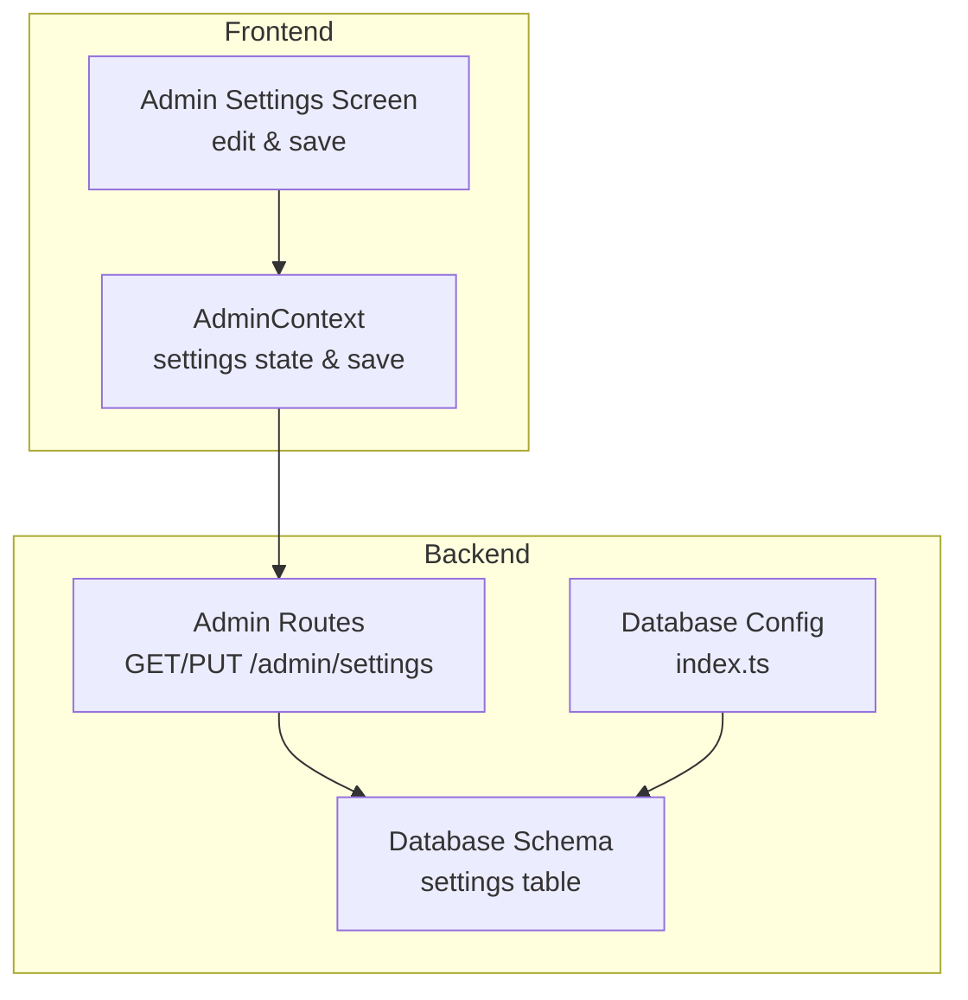
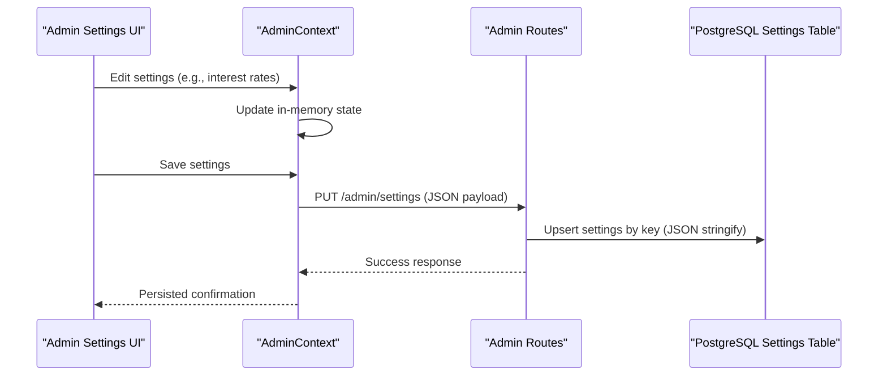
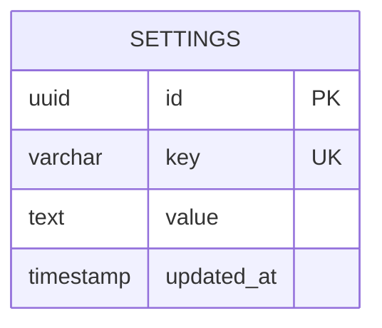
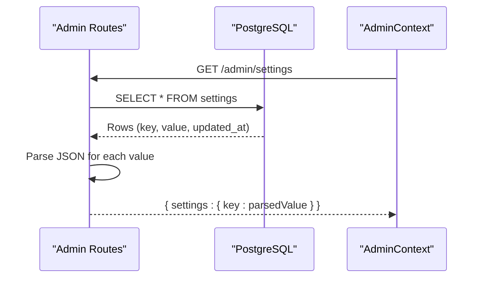
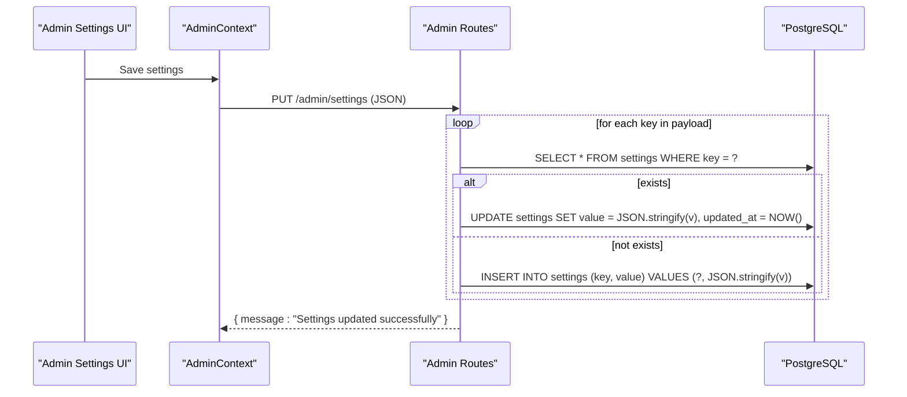
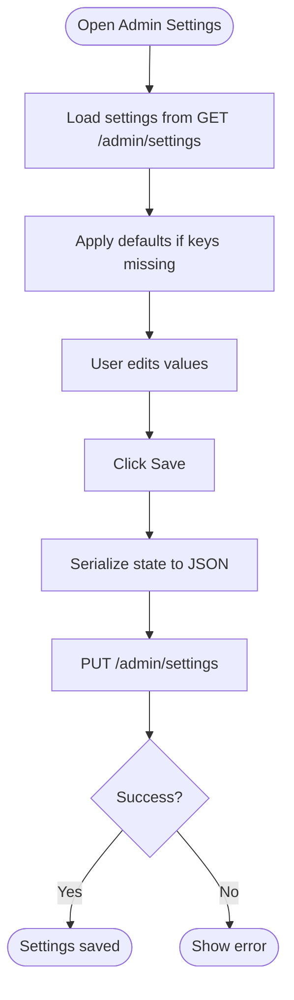
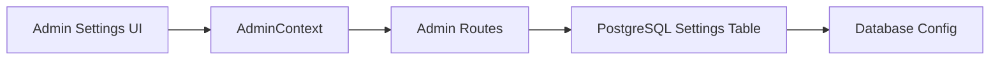

# Settings Schema

<cite>
**Referenced Files in This Document**
- [schema.ts](file://backend/src/db/schema.ts)
- [admin.ts](file://backend/src/routes/admin.ts)
- [AdminContext.tsx](file://contexts/AdminContext.tsx)
- [settings.tsx](file://app/admin/(tabs)/settings.tsx)
- [index.ts](file://backend/src/db/index.ts)
- [admin-schema-update.ts](file://backend/admin-schema-update.ts)
</cite>

## Table of Contents
1. [Introduction](#introduction)
2. [Project Structure](#project-structure)
3. [Core Components](#core-components)
4. [Architecture Overview](#architecture-overview)
5. [Detailed Component Analysis](#detailed-component-analysis)
6. [Dependency Analysis](#dependency-analysis)
7. [Performance Considerations](#performance-considerations)
8. [Troubleshooting Guide](#troubleshooting-guide)
9. [Conclusion](#conclusion)

## Introduction
This document provides comprehensive data model documentation for the Settings schema in PHOENIX. It explains how the application stores and manages dynamic configuration data using a key-value pair system, including the table structure, JSON string value storage, update tracking, and the end-to-end workflow from admin UI to backend persistence. It also covers retrieval patterns, configuration validation, and the relationship between settings and business logic implementation.

## Project Structure
The Settings schema is implemented across the backend database layer, backend API routes, and the admin frontend. The key files are:
- Backend database schema definition
- Backend settings API endpoints
- Admin context managing settings state
- Admin settings UI for editing and saving
- Database connection configuration
- Migration script for schema initialization

**Diagram sources**
- [schema.ts:90-96](file://backend/src/db/schema.ts#L90-L96)
- [admin.ts:127-168](file://backend/src/routes/admin.ts#L127-L168)
- [AdminContext.tsx:228-235](file://contexts/AdminContext.tsx#L228-L235)
- [settings.tsx](file://app/admin/(tabs)/settings.tsx#L174-L196)
- [index.ts:1-44](file://backend/src/db/index.ts#L1-L44)

**Section sources**
- [schema.ts:90-96](file://backend/src/db/schema.ts#L90-L96)
- [admin.ts:127-168](file://backend/src/routes/admin.ts#L127-L168)
- [AdminContext.tsx:228-235](file://contexts/AdminContext.tsx#L228-L235)
- [settings.tsx](file://app/admin/(tabs)/settings.tsx#L174-L196)
- [index.ts:1-44](file://backend/src/db/index.ts#L1-L44)

## Core Components
- Settings table: Stores configuration key-value pairs with JSON string values and timestamps.
- Admin GET /admin/settings: Retrieves all settings and parses JSON values.
- Admin PUT /admin/settings: Upserts settings by key, serializing values to JSON.
- AdminContext: Manages settings state in memory and persists changes via API.
- Admin Settings UI: Provides interactive controls to edit interest rates, loan parameters, processing fee, and disbursement channels.

Key characteristics:
- Unique key constraint ensures atomic updates per setting key.
- Value stored as JSON string to support structured data (arrays, objects).
- Timestamp tracking via updated_at enables auditability and change detection.

**Section sources**
- [schema.ts:90-96](file://backend/src/db/schema.ts#L90-L96)
- [admin.ts:127-168](file://backend/src/routes/admin.ts#L127-L168)
- [AdminContext.tsx:228-235](file://contexts/AdminContext.tsx#L228-L235)
- [settings.tsx](file://app/admin/(tabs)/settings.tsx#L174-L196)

## Architecture Overview
The settings architecture follows a layered approach:
- Frontend: Admin UI renders settings and collects edits.
- Context: AdminContext holds settings state and triggers saves.
- API: Admin routes handle retrieval and persistence.
- Persistence: PostgreSQL settings table with JSON value storage.

**Diagram sources**
- [settings.tsx](file://app/admin/(tabs)/settings.tsx#L174-L196)
- [AdminContext.tsx:482-494](file://contexts/AdminContext.tsx#L482-L494)
- [admin.ts:146-168](file://backend/src/routes/admin.ts#L146-L168)
- [schema.ts:90-96](file://backend/src/db/schema.ts#L90-L96)

## Detailed Component Analysis

### Settings Table Model
The settings table defines:
- id: UUID primary key
- key: Unique VARCHAR key (e.g., interest_rates, disbursement_channels)
- value: TEXT storing JSON string representation of the configuration
- updated_at: Timestamp with default NOW()

**Diagram sources**
- [schema.ts:90-96](file://backend/src/db/schema.ts#L90-L96)

**Section sources**
- [schema.ts:90-96](file://backend/src/db/schema.ts#L90-L96)

### Settings Retrieval Pattern
The GET /admin/settings endpoint:
- Fetches all rows from the settings table
- Attempts to parse each value as JSON
- Falls back to raw string if parsing fails
- Returns a flattened settings object

**Diagram sources**
- [admin.ts:127-146](file://backend/src/routes/admin.ts#L127-L146)

**Section sources**
- [admin.ts:127-146](file://backend/src/routes/admin.ts#L127-L146)

### Settings Update Pattern
The PUT /admin/settings endpoint:
- Iterates over the incoming JSON payload
- For each key-value pair:
  - Checks if a record with the key exists
  - Updates existing record with JSON.stringify(value) and updated_at
  - Inserts new record with JSON.stringify(value) if not found
- Returns success message

**Diagram sources**
- [admin.ts:146-168](file://backend/src/routes/admin.ts#L146-L168)

**Section sources**
- [admin.ts:146-168](file://backend/src/routes/admin.ts#L146-L168)

### Frontend Settings Management
AdminContext:
- Loads settings from GET /admin/settings and applies defaults if keys are missing
- Maintains in-memory state for interestRates, disbursementChannels, loanParameters, penaltyRate, processingFeeRate
- Persists changes via PUT /admin/settings

Admin Settings UI:
- Renders editable components for interest rates, loan parameters, processing fee, and disbursement channels
- Handles numeric and text edits, converting percentages and formatting values
- Triggers saveSettings() on user action

**Diagram sources**
- [AdminContext.tsx:228-235](file://contexts/AdminContext.tsx#L228-L235)
- [AdminContext.tsx:482-494](file://contexts/AdminContext.tsx#L482-L494)
- [settings.tsx](file://app/admin/(tabs)/settings.tsx#L174-L196)

**Section sources**
- [AdminContext.tsx:228-235](file://contexts/AdminContext.tsx#L228-L235)
- [AdminContext.tsx:482-494](file://contexts/AdminContext.tsx#L482-L494)
- [settings.tsx](file://app/admin/(tabs)/settings.tsx#L174-L196)

### Configuration Validation and Business Logic Relationship
- Validation occurs at the frontend level during user input (e.g., numeric conversion, percentage bounds).
- Backend validation is implicit: values are serialized to JSON strings and stored; retrieval attempts JSON.parse with fallback to raw string.
- Business logic relies on settings for:
  - Interest rate tiers and penalty rates
  - Loan parameters (min/max amounts, durations)
  - Processing fee percentage
  - Disbursement channels (mobile money and bank accounts)

These settings influence calculations and operational decisions across the application.

**Section sources**
- [AdminContext.tsx:442-460](file://contexts/AdminContext.tsx#L442-L460)
- [settings.tsx](file://app/admin/(tabs)/settings.tsx#L198-L212)

## Dependency Analysis
- AdminContext depends on:
  - GET /admin/settings for initial load
  - PUT /admin/settings for persistence
- Admin routes depend on:
  - settings table schema
  - Drizzle ORM for database operations
- Database connection depends on:
  - Environment configuration for DATABASE_URL

**Diagram sources**
- [AdminContext.tsx:228-235](file://contexts/AdminContext.tsx#L228-L235)
- [admin.ts:127-168](file://backend/src/routes/admin.ts#L127-L168)
- [schema.ts:90-96](file://backend/src/db/schema.ts#L90-L96)
- [index.ts:1-44](file://backend/src/db/index.ts#L1-L44)

**Section sources**
- [AdminContext.tsx:228-235](file://contexts/AdminContext.tsx#L228-L235)
- [admin.ts:127-168](file://backend/src/routes/admin.ts#L127-L168)
- [schema.ts:90-96](file://backend/src/db/schema.ts#L90-L96)
- [index.ts:1-44](file://backend/src/db/index.ts#L1-L44)

## Performance Considerations
- JSON serialization/deserialization overhead is minimal for typical settings payloads.
- Single upsert per key reduces write contention; consider batching if many settings are updated simultaneously.
- Indexing on key is ensured by unique constraint; reads remain efficient.
- Network round-trips: one GET on load, one PUT on save.

## Troubleshooting Guide
Common issues and resolutions:
- Settings not loading:
  - Verify GET /admin/settings returns a 200 response and includes expected keys.
  - Check AdminContext settings mapping for missing keys; defaults are applied if keys are absent.
- Save failures:
  - Confirm PUT /admin/settings returns success; inspect network errors and backend logs.
  - Ensure values are serializable to JSON; complex objects should be supported.
- Data corruption:
  - If JSON parsing fails, the raw string value is used as fallback; verify stored values in the database.
- Database connectivity:
  - Ensure DATABASE_URL is configured and reachable; verify connection in index.ts.

**Section sources**
- [admin.ts:127-168](file://backend/src/routes/admin.ts#L127-L168)
- [AdminContext.tsx:228-235](file://contexts/AdminContext.tsx#L228-L235)
- [index.ts:31-38](file://backend/src/db/index.ts#L31-L38)

## Conclusion
The Settings schema in PHOENIX provides a robust, application-wide configuration management system. It uses a simple yet powerful key-value model with JSON string storage, enabling flexible configuration of dynamic parameters such as interest rates, loan parameters, processing fees, and disbursement channels. The end-to-end flow from admin UI to backend persistence is straightforward, with clear separation of concerns between frontend state management and backend data operations. This design supports easy maintenance, auditing via timestamps, and seamless integration with business logic across the application.