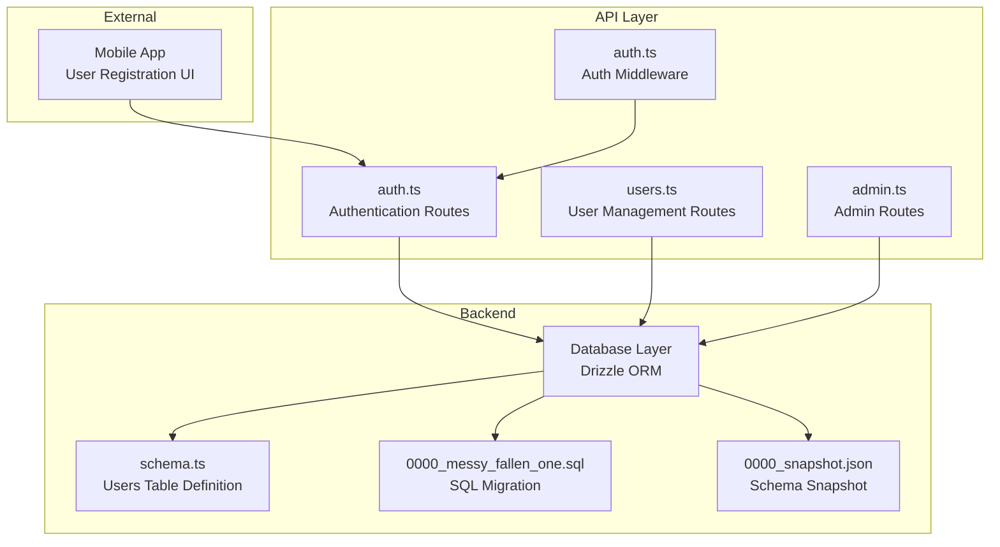
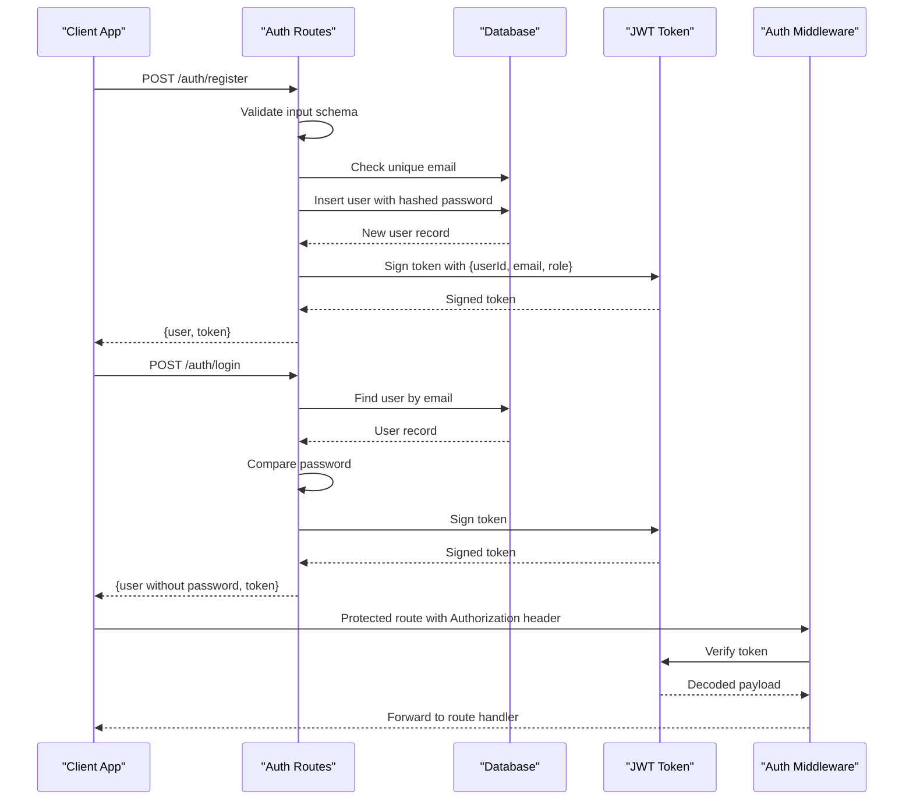
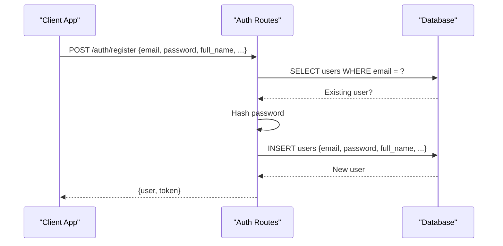
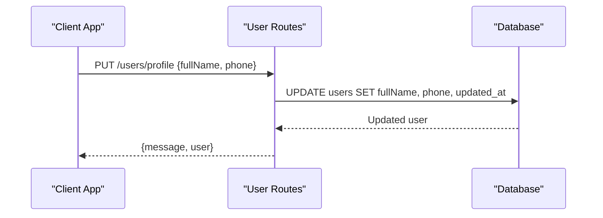
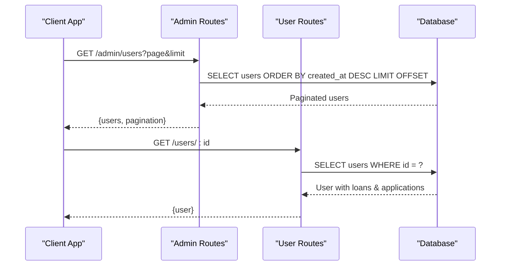
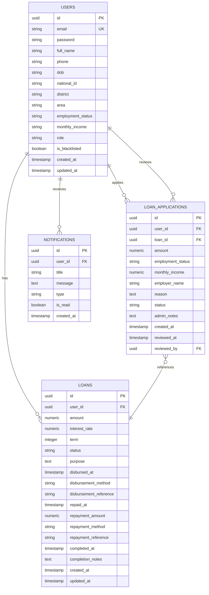
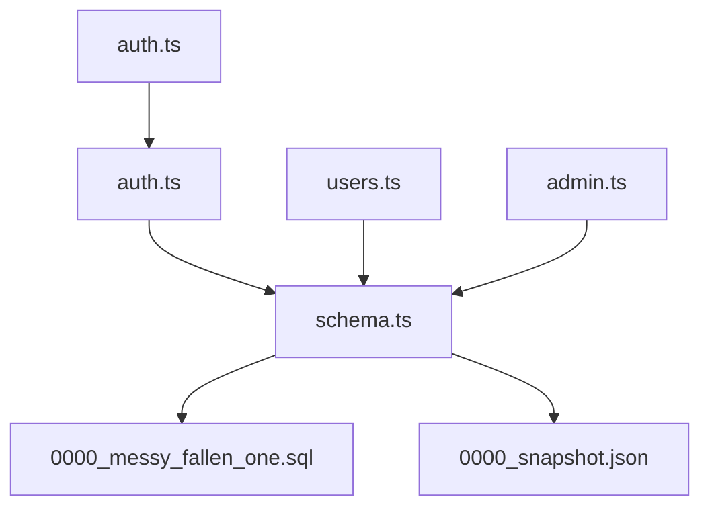

# User Schema

<cite>
**Referenced Files in This Document**
- [schema.ts](file://backend/src/db/schema.ts)
- [0000_messy_fallen_one.sql](file://backend/drizzle/0000_messy_fallen_one.sql)
- [0000_snapshot.json](file://backend/drizzle/meta/0000_snapshot.json)
- [auth.ts](file://backend/src/routes/auth.ts)
- [users.ts](file://backend/src/routes/users.ts)
- [admin.ts](file://backend/src/routes/admin.ts)
- [auth.ts](file://backend/src/middleware/auth.ts)
- [create-admin-user.sql](file://backend/create-admin-user.sql)
- [update-schema.sql](file://backend/update-schema.sql)
</cite>

## Table of Contents
1. [Introduction](#introduction)
2. [Project Structure](#project-structure)
3. [Core Components](#core-components)
4. [Architecture Overview](#architecture-overview)
5. [Detailed Component Analysis](#detailed-component-analysis)
6. [Dependency Analysis](#dependency-analysis)
7. [Performance Considerations](#performance-considerations)
8. [Troubleshooting Guide](#troubleshooting-guide)
9. [Conclusion](#conclusion)

## Introduction
This document provides comprehensive data model documentation for the User schema in PHOENIX. It details the users table structure, field definitions, data types, constraints, validation rules, and business logic. It also explains the user role system (user vs admin), KYC verification fields, personal information fields, location data, authentication fields, blacklist functionality, and audit trail fields. Additionally, it covers relationships with other entities through foreign keys and provides examples of user data creation, updates, and querying patterns.

## Project Structure
The user schema is defined in the backend database layer and integrated with route handlers and middleware for authentication and authorization. The schema definition is maintained in both TypeScript (Drizzle ORM) and SQL migration files to ensure consistency across the development and deployment environments.

**Diagram sources**
- [schema.ts:1-21](file://backend/src/db/schema.ts#L1-L21)
- [0000_messy_fallen_one.sql:69-86](file://backend/drizzle/0000_messy_fallen_one.sql#L69-L86)
- [0000_snapshot.json:489-604](file://backend/drizzle/meta/0000_snapshot.json#L489-L604)
- [auth.ts:1-146](file://backend/src/routes/auth.ts#L1-L146)
- [users.ts:1-197](file://backend/src/routes/users.ts#L1-L197)
- [admin.ts:1-171](file://backend/src/routes/admin.ts#L1-L171)
- [auth.ts:1-48](file://backend/src/middleware/auth.ts#L1-L48)

**Section sources**
- [schema.ts:1-21](file://backend/src/db/schema.ts#L1-L21)
- [0000_messy_fallen_one.sql:69-86](file://backend/drizzle/0000_messy_fallen_one.sql#L69-L86)
- [0000_snapshot.json:489-604](file://backend/drizzle/meta/0000_snapshot.json#L489-L604)

## Core Components
The users table is the central entity in PHOENIX, storing user profiles, authentication credentials, KYC information, location data, roles, blacklist status, and audit trails. It is referenced by several other tables through foreign keys, establishing relationships with loans, loan applications, and notifications.

Key characteristics:
- Primary key: id (UUID)
- Unique constraint: email
- Default values: role='user', is_blacklisted=false, timestamps default to current time
- Relationships: loans, loan_applications, notifications

**Section sources**
- [schema.ts:5-21](file://backend/src/db/schema.ts#L5-L21)
- [0000_snapshot.json:489-604](file://backend/drizzle/meta/0000_snapshot.json#L489-L604)

## Architecture Overview
The user data model integrates with the authentication pipeline and administrative controls. Authentication routes validate input, hash passwords, and issue JWT tokens. User management routes provide CRUD operations with role-based access control. Administrative routes expose user listing, KYC verification indicators, and blacklist toggling.

**Diagram sources**
- [auth.ts:13-93](file://backend/src/routes/auth.ts#L13-L93)
- [auth.ts:95-143](file://backend/src/routes/auth.ts#L95-L143)
- [auth.ts:10-36](file://backend/src/middleware/auth.ts#L10-L36)

**Section sources**
- [auth.ts:13-93](file://backend/src/routes/auth.ts#L13-L93)
- [auth.ts:95-143](file://backend/src/routes/auth.ts#L95-L143)
- [auth.ts:10-36](file://backend/src/middleware/auth.ts#L10-L36)

## Detailed Component Analysis

### Users Table Structure
The users table defines the core user entity with comprehensive fields for identity, authentication, KYC, location, employment, and governance.

Field definitions and constraints:
- id: UUID primary key with default random generator
- email: varchar(255), not null, unique
- password: text, not null
- full_name: varchar(255), not null
- phone: varchar(20)
- dob: varchar(20) - Date of birth
- national_id: varchar(50) - Supports national ID or passport
- district: varchar(50)
- area: varchar(100)
- employment_status: varchar(50)
- monthly_income: varchar(20)
- role: varchar(20), not null, default 'user'
- is_blacklisted: boolean, default false
- created_at: timestamp, default now(), not null
- updated_at: timestamp, default now(), not null

Validation rules and business logic:
- Email uniqueness enforced at database level
- Role defaults to 'user' during registration
- Passwords are hashed before insertion
- KYC verification determined by presence of dob and either national_id
- Blacklist toggled via admin endpoint
- Audit trail maintained via created_at and updated_at

**Section sources**
- [schema.ts:5-21](file://backend/src/db/schema.ts#L5-L21)
- [0000_snapshot.json:489-604](file://backend/drizzle/meta/0000_snapshot.json#L489-L604)
- [auth.ts:13-25](file://backend/src/routes/auth.ts#L13-L25)
- [admin.ts:32-32](file://backend/src/routes/admin.ts#L32-L32)

### User Role System
The role field determines access levels:
- user: default role for newly registered users
- admin: elevated privileges for administrative operations

Role enforcement:
- Authentication middleware decodes JWT and sets role context
- Admin-only routes require role='admin'
- Registration process explicitly assigns role='user'

**Section sources**
- [schema.ts:17-17](file://backend/src/db/schema.ts#L17-L17)
- [auth.ts:39-47](file://backend/src/middleware/auth.ts#L39-L47)
- [auth.ts:61-61](file://backend/src/routes/auth.ts#L61-L61)
- [create-admin-user.sql:11-11](file://backend/create-admin-user.sql#L11-L11)

### KYC Verification Fields
KYC verification is inferred from the presence of required fields:
- dob: Date of birth
- national_id: National ID or passport number

Verification logic:
- Admin dashboard computes isKycVerified as true when both dob and national_id are present
- Registration accepts optional KYC fields; they can be updated later

**Section sources**
- [admin.ts:32-32](file://backend/src/routes/admin.ts#L32-L32)
- [auth.ts:18-24](file://backend/src/routes/auth.ts#L18-L24)

### Personal Information Fields
Personal information includes:
- full_name: Required during registration
- phone: Optional contact number
- dob: Optional date of birth
- employment_status: Optional employment status
- monthly_income: Optional monthly income

Data types and constraints:
- String fields with length limits appropriate for identifiers and locations
- Optional fields allow partial profile completion

**Section sources**
- [schema.ts:9-16](file://backend/src/db/schema.ts#L9-L16)
- [auth.ts:13-25](file://backend/src/routes/auth.ts#L13-L25)

### Location Data
Location fields capture geographic information:
- district: Administrative district
- area: Specific area within district

Usage:
- Used for administrative reporting and user categorization
- Optional fields to support flexible user profiles

**Section sources**
- [schema.ts:13-14](file://backend/src/db/schema.ts#L13-L14)
- [admin.ts:34-36](file://backend/src/routes/admin.ts#L34-L36)

### Authentication Fields
Authentication is handled through:
- email: Unique identifier for login
- password: Stored as bcrypt hash, never exposed in responses

Security measures:
- Password hashing performed before insertion
- Login validates credentials against stored hash
- JWT token includes userId, email, and role for session management

**Section sources**
- [schema.ts:7-8](file://backend/src/db/schema.ts#L7-L8)
- [auth.ts:35-44](file://backend/src/routes/auth.ts#L35-L44)
- [auth.ts:102-120](file://backend/src/routes/auth.ts#L102-L120)

### Blacklist Functionality
Blacklist status:
- is_blacklisted: boolean flag indicating restricted access
- Default false for new users

Management:
- Admin endpoint toggles blacklist status
- Updates updated_at timestamp automatically

**Section sources**
- [schema.ts:18-18](file://backend/src/db/schema.ts#L18-L18)
- [users.ts:137-161](file://backend/src/routes/users.ts#L137-L161)

### Audit Trail Fields
Audit fields:
- created_at: Timestamp of user creation
- updated_at: Timestamp of last modification

Behavior:
- Default values set to current timestamp
- Explicitly updated during profile modifications and blacklist toggles

**Section sources**
- [schema.ts:19-20](file://backend/src/db/schema.ts#L19-L20)
- [users.ts:87-87](file://backend/src/routes/users.ts#L87-L87)
- [users.ts:151-151](file://backend/src/routes/users.ts#L151-L151)

### Field-Level Documentation
- id: UUID primary key; generated randomly; cannot be null
- email: Unique, validated as email; cannot be null; enforced by unique constraint
- password: Text; cannot be null; hashed before storage
- full_name: Text; cannot be null; minimum length enforced by validation
- phone: Text; optional; up to 20 characters
- dob: Text; optional; up to 20 characters
- national_id: Text; optional; up to 50 characters
- district: Text; optional; up to 50 characters
- area: Text; optional; up to 100 characters
- employment_status: Text; optional; up to 50 characters
- monthly_income: Text; optional; up to 20 characters
- role: Text; cannot be null; default 'user'; allowed values include 'user' and 'admin'
- is_blacklisted: Boolean; default false
- created_at: Timestamp; cannot be null; default current time
- updated_at: Timestamp; cannot be null; default current time

Unique constraints:
- email: Unique across users

Default values:
- role: 'user'
- is_blacklisted: false
- timestamps: current time

**Section sources**
- [schema.ts:5-21](file://backend/src/db/schema.ts#L5-L21)
- [0000_snapshot.json:592-600](file://backend/drizzle/meta/0000_snapshot.json#L592-L600)

### Examples of User Data Creation, Updates, and Querying

#### Creating a User (Registration)
- Endpoint: POST /auth/register
- Input validation: email, password, full_name, optional KYC fields
- Behavior: Checks email uniqueness, hashes password, inserts user with role='user'
- Output: Returns user (without password) and JWT token

**Diagram sources**
- [auth.ts:33-93](file://backend/src/routes/auth.ts#L33-L93)

**Section sources**
- [auth.ts:33-93](file://backend/src/routes/auth.ts#L33-L93)

#### Updating User Profile
- Endpoint: PUT /users/profile
- Input: fullName, phone
- Behavior: Updates profile fields and sets updated_at timestamp
- Access: Requires Authorization header with valid JWT

**Diagram sources**
- [users.ts:73-107](file://backend/src/routes/users.ts#L73-L107)

**Section sources**
- [users.ts:73-107](file://backend/src/routes/users.ts#L73-L107)

#### Querying User Data
- Get all users (admin): GET /users/
- Get single user (admin): GET /users/:id
- Get profile: GET /users/profile (requires Authorization)
- Admin dashboard: GET /admin/users (paginated, includes KYC verification)

**Diagram sources**
- [admin.ts:8-47](file://backend/src/routes/admin.ts#L8-L47)
- [users.ts:109-134](file://backend/src/routes/users.ts#L109-L134)

**Section sources**
- [admin.ts:8-47](file://backend/src/routes/admin.ts#L8-L47)
- [users.ts:109-134](file://backend/src/routes/users.ts#L109-L134)

### Relationship Between Users and Other Entities
Foreign key relationships:
- loans.user_id -> users.id
- loan_applications.user_id -> users.id
- loan_applications.loan_id -> loans.id
- loan_applications.reviewed_by -> users.id
- notifications.user_id -> users.id (ON DELETE CASCADE)

**Diagram sources**
- [schema.ts:24-88](file://backend/src/db/schema.ts#L24-L88)
- [0000_snapshot.json:6-140](file://backend/drizzle/meta/0000_snapshot.json#L6-L140)

**Section sources**
- [schema.ts:24-88](file://backend/src/db/schema.ts#L24-L88)
- [0000_snapshot.json:6-140](file://backend/drizzle/meta/0000_snapshot.json#L6-L140)

## Dependency Analysis
The user schema depends on:
- Drizzle ORM for type-safe database operations
- PostgreSQL for schema persistence and constraints
- JWT for authentication state management
- bcrypt for password hashing

External dependencies and integration points:
- Auth middleware verifies JWT and injects user context
- Admin routes enforce role-based access control
- Notifications table cascades deletion when a user is removed

**Diagram sources**
- [schema.ts:1-146](file://backend/src/db/schema.ts#L1-L146)
- [0000_messy_fallen_one.sql:1-93](file://backend/drizzle/0000_messy_fallen_one.sql#L1-L93)
- [0000_snapshot.json:1-617](file://backend/drizzle/meta/0000_snapshot.json#L1-L617)
- [auth.ts:1-146](file://backend/src/routes/auth.ts#L1-L146)
- [users.ts:1-197](file://backend/src/routes/users.ts#L1-L197)
- [admin.ts:1-171](file://backend/src/routes/admin.ts#L1-L171)
- [auth.ts:1-48](file://backend/src/middleware/auth.ts#L1-L48)

**Section sources**
- [schema.ts:1-146](file://backend/src/db/schema.ts#L1-L146)
- [auth.ts:10-36](file://backend/src/middleware/auth.ts#L10-L36)

## Performance Considerations
- Indexes: Consider adding indexes on frequently queried fields (e.g., email, district, area) to improve query performance.
- Pagination: Admin endpoints use pagination to limit result sets and reduce memory usage.
- Selective columns: Route handlers exclude sensitive fields (e.g., password) from responses to minimize payload size.
- Cascading deletes: Notifications are configured to cascade delete with the user, preventing orphaned records.

## Troubleshooting Guide
Common issues and resolutions:
- Duplicate email registration: Registration checks for existing email and returns an error if found.
- Invalid credentials: Login compares provided password with stored hash and rejects invalid combinations.
- Unauthorized access: Protected routes require a valid Authorization header with a signed JWT.
- Admin access denied: Admin-only routes reject requests from non-admin users.
- Blacklist status: Admin endpoint toggles is_blacklisted and updates timestamps.

**Section sources**
- [auth.ts:37-44](file://backend/src/routes/auth.ts#L37-L44)
- [auth.ts:108-120](file://backend/src/routes/auth.ts#L108-L120)
- [auth.ts:14-16](file://backend/src/middleware/auth.ts#L14-L16)
- [auth.ts:42-44](file://backend/src/middleware/auth.ts#L42-L44)
- [users.ts:137-161](file://backend/src/routes/users.ts#L137-L161)

## Conclusion
The User schema in PHOENIX provides a robust foundation for user management, authentication, and administrative oversight. Its design balances flexibility with strong constraints, ensuring data integrity while supporting KYC workflows, role-based access control, and comprehensive audit trails. The schema integrates seamlessly with Drizzle ORM and PostgreSQL, enabling scalable and maintainable operations across the application stack.