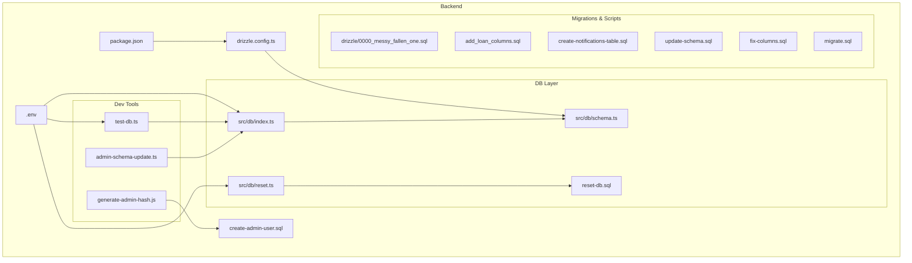
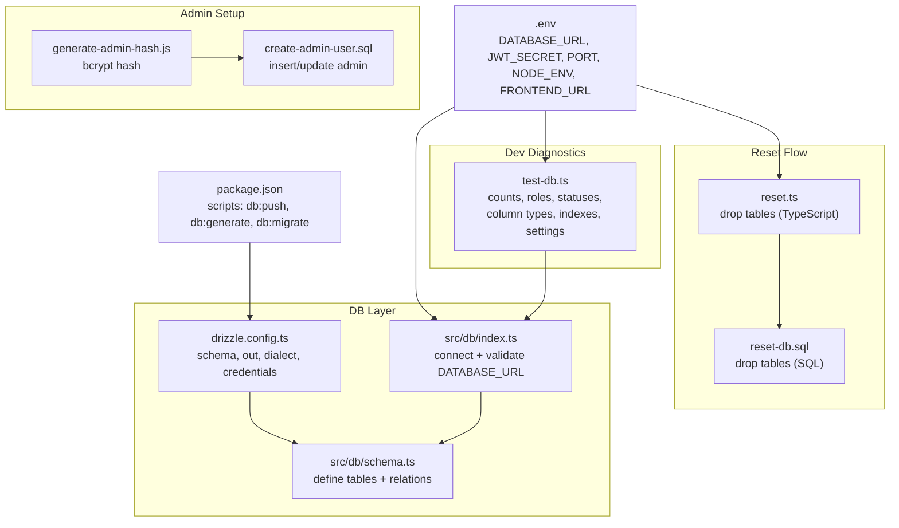
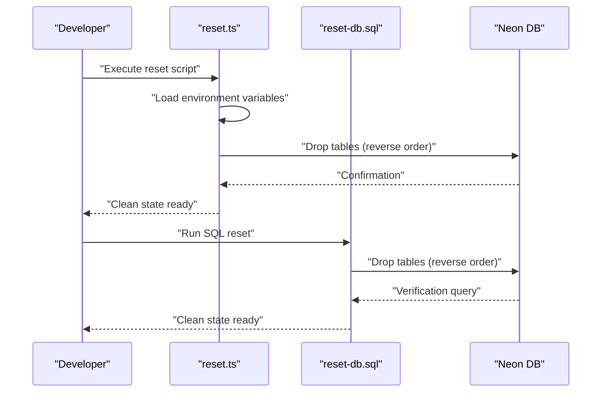
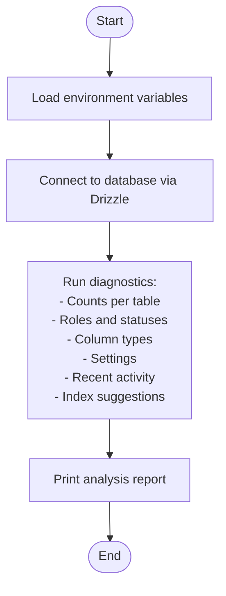
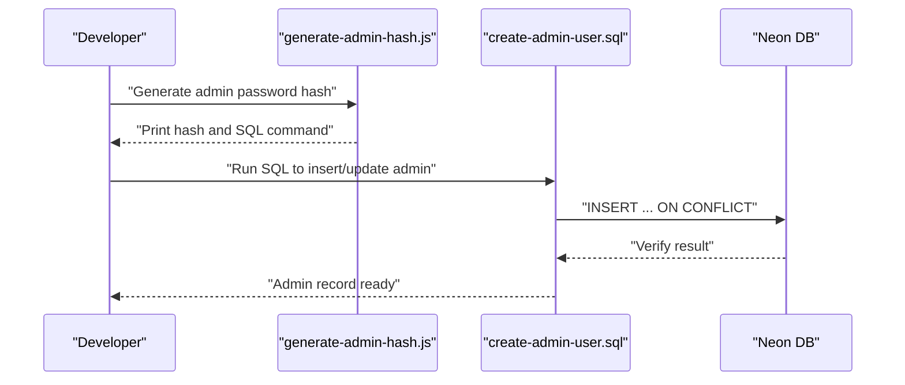
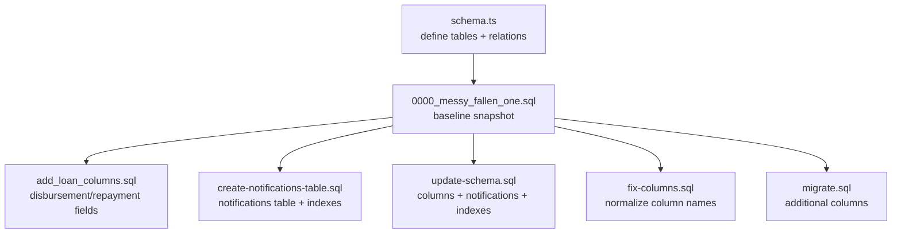
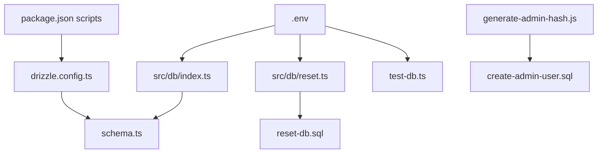

# Data Reset Procedures

<cite>
**Referenced Files in This Document**
- [reset.ts](file://backend/src/db/reset.ts)
- [reset-db.sql](file://backend/reset-db.sql)
- [test-db.ts](file://backend/test-db.ts)
- [create-admin-user.sql](file://backend/create-admin-user.sql)
- [generate-admin-hash.js](file://backend/generate-admin-hash.js)
- [drizzle.config.ts](file://backend/drizzle.config.ts)
- [index.ts](file://backend/src/db/index.ts)
- [schema.ts](file://backend/src/db/schema.ts)
- [package.json](file://backend/package.json)
- [.env](file://backend/.env)
- [admin-schema-update.ts](file://backend/admin-schema-update.ts)
- [add_loan_columns.sql](file://backend/add_loan_columns.sql)
- [create-notifications-table.sql](file://backend/create-notifications-table.sql)
- [update-schema.sql](file://backend/update-schema.sql)
- [fix-columns.sql](file://backend/fix-columns.sql)
- [migrate.sql](file://backend/migrate.sql)
- [0000_messy_fallen_one.sql](file://backend/drizzle/0000_messy_fallen_one.sql)
</cite>

## Table of Contents
1. [Introduction](#introduction)
2. [Project Structure](#project-structure)
3. [Core Components](#core-components)
4. [Architecture Overview](#architecture-overview)
5. [Detailed Component Analysis](#detailed-component-analysis)
6. [Dependency Analysis](#dependency-analysis)
7. [Performance Considerations](#performance-considerations)
8. [Troubleshooting Guide](#troubleshooting-guide)
9. [Conclusion](#conclusion)
10. [Appendices](#appendices)

## Introduction
This document provides comprehensive guidance for database reset procedures and development environment setup for the Phoenix Loan application. It explains how to clear data, drop tables, and prepare a clean environment for schema updates. It also documents development and testing database setup, including seed data creation and admin user initialization. Step-by-step instructions cover resetting the database during development, cleaning up testing data, and preparing environments. Finally, it outlines the SQL scripts used for initialization, prerequisites for successful reset operations, and strategies for backing up data before reset actions.

## Project Structure
The backend database-related assets are organized under the backend directory. Key components include:
- Drizzle ORM configuration and schema definitions
- Database reset utilities and scripts
- Admin user creation and hashing utilities
- Migration and schema update scripts
- Environment configuration and package scripts

**Diagram sources**
- [drizzle.config.ts:1-14](file://backend/drizzle.config.ts#L1-L14)
- [.env:1-13](file://backend/.env#L1-L13)
- [package.json:1-46](file://backend/package.json#L1-L46)
- [index.ts:1-44](file://backend/src/db/index.ts#L1-L44)
- [schema.ts:1-146](file://backend/src/db/schema.ts#L1-L146)
- [reset.ts:1-26](file://backend/src/db/reset.ts#L1-L26)
- [reset-db.sql:1-9](file://backend/reset-db.sql#L1-L9)
- [test-db.ts:1-183](file://backend/test-db.ts#L1-L183)
- [generate-admin-hash.js:1-13](file://backend/generate-admin-hash.js#L1-L13)
- [admin-schema-update.ts:1-30](file://backend/admin-schema-update.ts#L1-L30)
- [0000_messy_fallen_one.sql:1-93](file://backend/drizzle/0000_messy_fallen_one.sql#L1-L93)
- [add_loan_columns.sql:1-12](file://backend/add_loan_columns.sql#L1-L12)
- [create-notifications-table.sql:1-30](file://backend/create-notifications-table.sql#L1-L30)
- [update-schema.sql:1-32](file://backend/update-schema.sql#L1-L32)
- [fix-columns.sql:1-43](file://backend/fix-columns.sql#L1-L43)
- [migrate.sql:1-12](file://backend/migrate.sql#L1-L12)
- [create-admin-user.sql:1-27](file://backend/create-admin-user.sql#L1-L27)

**Section sources**
- [drizzle.config.ts:1-14](file://backend/drizzle.config.ts#L1-L14)
- [package.json:1-46](file://backend/package.json#L1-L46)
- [index.ts:1-44](file://backend/src/db/index.ts#L1-L44)
- [schema.ts:1-146](file://backend/src/db/schema.ts#L1-L146)
- [reset.ts:1-26](file://backend/src/db/reset.ts#L1-L26)
- [reset-db.sql:1-9](file://backend/reset-db.sql#L1-L9)
- [test-db.ts:1-183](file://backend/test-db.ts#L1-L183)
- [generate-admin-hash.js:1-13](file://backend/generate-admin-hash.js#L1-L13)
- [admin-schema-update.ts:1-30](file://backend/admin-schema-update.ts#L1-L30)
- [create-admin-user.sql:1-27](file://backend/create-admin-user.sql#L1-L27)
- [add_loan_columns.sql:1-12](file://backend/add_loan_columns.sql#L1-L12)
- [create-notifications-table.sql:1-30](file://backend/create-notifications-table.sql#L1-L30)
- [update-schema.sql:1-32](file://backend/update-schema.sql#L1-L32)
- [fix-columns.sql:1-43](file://backend/fix-columns.sql#L1-L43)
- [migrate.sql:1-12](file://backend/migrate.sql#L1-L12)
- [0000_messy_fallen_one.sql:1-93](file://backend/drizzle/0000_messy_fallen_one.sql#L1-L93)

## Core Components
This section highlights the primary components involved in database reset and development environment setup.

- Database connection and environment loading
  - The database connection module reads environment variables and establishes a Drizzle connection to the configured database URL. It logs connection status and enforces presence of the database URL.
  - Prerequisite: The .env file must contain a valid DATABASE_URL.

- Reset utilities
  - TypeScript reset script drops tables in dependency-aware order and logs completion status.
  - SQL reset script performs the same operation via raw SQL and verifies remaining tables.

- Schema and migrations
  - Drizzle configuration defines schema location, output directory, dialect, and credentials.
  - Initial schema snapshot and migration SQL define the baseline structure.

- Admin user initialization
  - Hash generation utility computes a bcrypt hash for the admin password.
  - SQL script inserts or updates an admin user record and verifies creation.

- Development diagnostics
  - Test database script analyzes counts, roles, statuses, column types, settings, recent activity, and suggests indexes.

**Section sources**
- [index.ts:1-44](file://backend/src/db/index.ts#L1-L44)
- [reset.ts:1-26](file://backend/src/db/reset.ts#L1-L26)
- [reset-db.sql:1-9](file://backend/reset-db.sql#L1-L9)
- [drizzle.config.ts:1-14](file://backend/drizzle.config.ts#L1-L14)
- [schema.ts:1-146](file://backend/src/db/schema.ts#L1-L146)
- [0000_messy_fallen_one.sql:1-93](file://backend/drizzle/0000_messy_fallen_one.sql#L1-L93)
- [generate-admin-hash.js:1-13](file://backend/generate-admin-hash.js#L1-L13)
- [create-admin-user.sql:1-27](file://backend/create-admin-user.sql#L1-L27)
- [test-db.ts:1-183](file://backend/test-db.ts#L1-L183)

## Architecture Overview
The reset and development setup architecture integrates environment configuration, database connection, schema definitions, and migration scripts. The following diagram maps the reset flow and development utilities to their source files.

**Diagram sources**
- [.env:1-13](file://backend/.env#L1-L13)
- [package.json:1-46](file://backend/package.json#L1-L46)
- [reset.ts:1-26](file://backend/src/db/reset.ts#L1-L26)
- [reset-db.sql:1-9](file://backend/reset-db.sql#L1-L9)
- [index.ts:1-44](file://backend/src/db/index.ts#L1-L44)
- [schema.ts:1-146](file://backend/src/db/schema.ts#L1-L146)
- [drizzle.config.ts:1-14](file://backend/drizzle.config.ts#L1-L14)
- [generate-admin-hash.js:1-13](file://backend/generate-admin-hash.js#L1-L13)
- [create-admin-user.sql:1-27](file://backend/create-admin-user.sql#L1-L27)
- [test-db.ts:1-183](file://backend/test-db.ts#L1-L183)

## Detailed Component Analysis

### Database Reset Utilities
Two complementary mechanisms exist to reset the database: a TypeScript script and a SQL script. Both drop tables in reverse dependency order and confirm readiness for schema updates.

**Diagram sources**
- [reset.ts:6-23](file://backend/src/db/reset.ts#L6-L23)
- [reset-db.sql:1-9](file://backend/reset-db.sql#L1-L9)

Prerequisites and steps:
- Ensure DATABASE_URL is set in the environment.
- Execute the TypeScript reset script for programmatic control, or run the SQL script for direct database execution.
- After reset, apply schema updates using Drizzle Kit commands.

**Section sources**
- [reset.ts:1-26](file://backend/src/db/reset.ts#L1-L26)
- [reset-db.sql:1-9](file://backend/reset-db.sql#L1-L9)
- [index.ts:31-38](file://backend/src/db/index.ts#L31-L38)

### Development and Testing Database Setup
The development environment relies on Drizzle ORM and schema definitions. The test database script provides diagnostic insights and helps validate environment health.

**Diagram sources**
- [test-db.ts:12-182](file://backend/test-db.ts#L12-L182)
- [index.ts:13-43](file://backend/src/db/index.ts#L13-L43)

Key capabilities:
- Connection verification
- Per-table record counts
- Role and status breakdowns
- Column type inspection
- Settings inspection
- Recent activity counters
- Index recommendation engine

**Section sources**
- [test-db.ts:1-183](file://backend/test-db.ts#L1-L183)
- [index.ts:1-44](file://backend/src/db/index.ts#L1-L44)

### Admin User Initialization
Admin user creation involves generating a secure hash and inserting/updating the admin record. The process supports idempotent setup.

**Diagram sources**
- [generate-admin-hash.js:3-12](file://backend/generate-admin-hash.js#L3-L12)
- [create-admin-user.sql:4-26](file://backend/create-admin-user.sql#L4-L26)

Prerequisites:
- Ensure DATABASE_URL is configured.
- Use the generated hash in the SQL script or adapt the script accordingly.

**Section sources**
- [generate-admin-hash.js:1-13](file://backend/generate-admin-hash.js#L1-L13)
- [create-admin-user.sql:1-27](file://backend/create-admin-user.sql#L1-L27)

### Schema and Migration Scripts
The project maintains a baseline schema snapshot and several migration/update scripts to evolve the database structure.

**Diagram sources**
- [schema.ts:1-146](file://backend/src/db/schema.ts#L1-L146)
- [0000_messy_fallen_one.sql:1-93](file://backend/drizzle/0000_messy_fallen_one.sql#L1-L93)
- [add_loan_columns.sql:1-12](file://backend/add_loan_columns.sql#L1-L12)
- [create-notifications-table.sql:1-30](file://backend/create-notifications-table.sql#L1-L30)
- [update-schema.sql:1-32](file://backend/update-schema.sql#L1-L32)
- [fix-columns.sql:1-43](file://backend/fix-columns.sql#L1-L43)
- [migrate.sql:1-12](file://backend/migrate.sql#L1-L12)

Operational notes:
- Use Drizzle Kit commands to manage schema changes.
- Apply migration scripts incrementally as needed.
- Admin schema updates can add missing columns and tables.

**Section sources**
- [schema.ts:1-146](file://backend/src/db/schema.ts#L1-L146)
- [0000_messy_fallen_one.sql:1-93](file://backend/drizzle/0000_messy_fallen_one.sql#L1-L93)
- [add_loan_columns.sql:1-12](file://backend/add_loan_columns.sql#L1-L12)
- [create-notifications-table.sql:1-30](file://backend/create-notifications-table.sql#L1-L30)
- [update-schema.sql:1-32](file://backend/update-schema.sql#L1-L32)
- [fix-columns.sql:1-43](file://backend/fix-columns.sql#L1-L43)
- [migrate.sql:1-12](file://backend/migrate.sql#L1-L12)

## Dependency Analysis
The reset and development utilities depend on environment configuration and database connectivity. The following diagram shows key dependencies.

**Diagram sources**
- [.env:1-13](file://backend/.env#L1-L13)
- [package.json:7-14](file://backend/package.json#L7-L14)
- [index.ts:1-44](file://backend/src/db/index.ts#L1-L44)
- [reset.ts:1-26](file://backend/src/db/reset.ts#L1-L26)
- [reset-db.sql:1-9](file://backend/reset-db.sql#L1-L9)
- [test-db.ts:1-183](file://backend/test-db.ts#L1-L183)
- [generate-admin-hash.js:1-13](file://backend/generate-admin-hash.js#L1-L13)
- [create-admin-user.sql:1-27](file://backend/create-admin-user.sql#L1-L27)
- [drizzle.config.ts:1-14](file://backend/drizzle.config.ts#L1-L14)
- [schema.ts:1-146](file://backend/src/db/schema.ts#L1-L146)

**Section sources**
- [package.json:7-14](file://backend/package.json#L7-L14)
- [index.ts:1-44](file://backend/src/db/index.ts#L1-L44)
- [reset.ts:1-26](file://backend/src/db/reset.ts#L1-L26)
- [reset-db.sql:1-9](file://backend/reset-db.sql#L1-L9)
- [test-db.ts:1-183](file://backend/test-db.ts#L1-L183)
- [generate-admin-hash.js:1-13](file://backend/generate-admin-hash.js#L1-L13)
- [create-admin-user.sql:1-27](file://backend/create-admin-user.sql#L1-L27)
- [drizzle.config.ts:1-14](file://backend/drizzle.config.ts#L1-L14)
- [schema.ts:1-146](file://backend/src/db/schema.ts#L1-L146)

## Performance Considerations
- Prefer dropping tables in reverse dependency order to avoid foreign key constraint failures.
- Use Drizzle Kit commands for schema changes to maintain consistency with the schema definition.
- Keep diagnostic scripts focused and avoid heavy queries in production environments.
- Monitor index usage and add recommended indexes to improve query performance.

## Troubleshooting Guide
Common issues and resolutions:
- Missing DATABASE_URL
  - Symptom: Connection errors or explicit warnings.
  - Resolution: Set DATABASE_URL in the environment and ensure the .env file is loaded by the connection module.

- Foreign key constraint errors during reset
  - Symptom: Errors when dropping tables.
  - Resolution: Ensure tables are dropped in reverse dependency order and verify CASCADE behavior.

- Admin user creation conflicts
  - Symptom: Duplicate key errors on email.
  - Resolution: Use ON CONFLICT handling to update the admin record with the correct hash.

- Drizzle schema mismatch
  - Symptom: Mismatch between schema and database structure.
  - Resolution: Review migration scripts and apply incremental updates. Use the test database script to identify discrepancies.

**Section sources**
- [index.ts:31-38](file://backend/src/db/index.ts#L31-L38)
- [reset.ts:15-19](file://backend/src/db/reset.ts#L15-L19)
- [create-admin-user.sql:19-23](file://backend/create-admin-user.sql#L19-L23)
- [test-db.ts:163-170](file://backend/test-db.ts#L163-L170)

## Conclusion
The Phoenix Loan backend provides robust tools for resetting the database and preparing the development environment. By combining TypeScript and SQL reset utilities, Drizzle ORM configuration, and diagnostic scripts, developers can reliably clear data, apply schema updates, and initialize admin users. Following the outlined procedures and prerequisites ensures smooth resets and environment preparation.

## Appendices

### Step-by-Step Database Reset Instructions
- Prepare environment
  - Ensure DATABASE_URL is set in the environment.
  - Confirm .env file is readable by the connection module.

- Option A: TypeScript reset
  - Execute the reset script to drop tables in reverse dependency order.
  - Verify completion logs indicating a clean state.

- Option B: SQL reset
  - Run the SQL reset script to drop tables and verify remaining tables.

- Apply schema updates
  - Use Drizzle Kit commands to push or generate schema changes.
  - Review and apply migration/update scripts as needed.

**Section sources**
- [index.ts:13-43](file://backend/src/db/index.ts#L13-L43)
- [reset.ts:6-23](file://backend/src/db/reset.ts#L6-L23)
- [reset-db.sql:1-9](file://backend/reset-db.sql#L1-L9)
- [drizzle.config.ts:6-13](file://backend/drizzle.config.ts#L6-L13)

### Admin User Initialization Steps
- Generate admin hash
  - Run the hash generation utility to compute a bcrypt hash for the admin password.
  - Capture the printed hash and SQL command.

- Insert or update admin
  - Execute the admin creation SQL script to insert or update the admin record.
  - Verify the admin record using the provided SELECT query.

**Section sources**
- [generate-admin-hash.js:3-12](file://backend/generate-admin-hash.js#L3-L12)
- [create-admin-user.sql:4-26](file://backend/create-admin-user.sql#L4-L26)

### Development Environment Preparation
- Install dependencies
  - Ensure all backend dependencies are installed.

- Configure environment
  - Set DATABASE_URL, JWT_SECRET, PORT, NODE_ENV, and FRONTEND_URL in .env.

- Validate connection
  - Use the connection module to establish and verify the database connection.

- Run diagnostics
  - Execute the test database script to analyze counts, roles, statuses, column types, settings, recent activity, and index recommendations.

**Section sources**
- [package.json:22-44](file://backend/package.json#L22-L44)
- [.env:1-13](file://backend/.env#L1-L13)
- [index.ts:13-43](file://backend/src/db/index.ts#L13-L43)
- [test-db.ts:12-182](file://backend/test-db.ts#L12-L182)

### Backup and Data Preservation Strategies
- Pre-reset backup
  - Export schema and data using database client tools or automated scripts before performing reset operations.

- Incremental backups
  - Schedule periodic backups of critical tables (users, loans, loan_applications, repayments) to preserve historical data.

- Post-reset restoration
  - Restore from backups after applying schema updates to recover test data while maintaining a clean baseline.

- Validation
  - Use the test database script to verify restored data integrity and structure.

[No sources needed since this section provides general guidance]