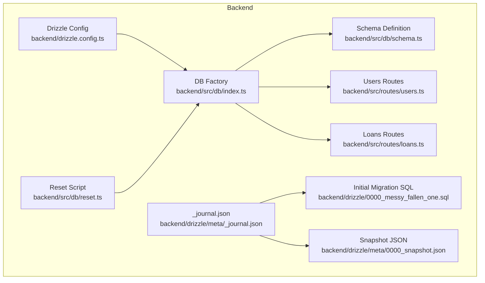
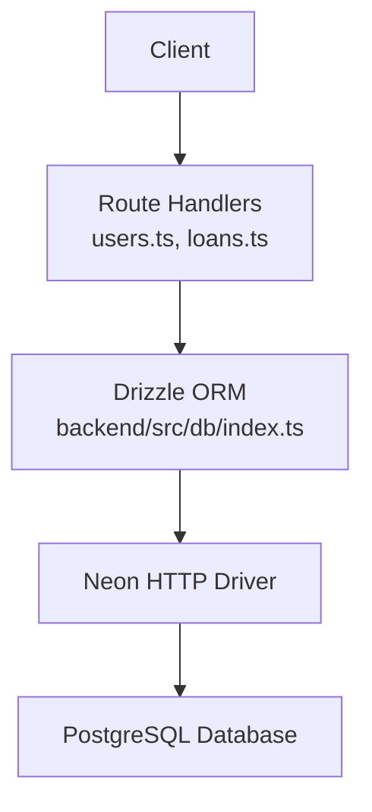
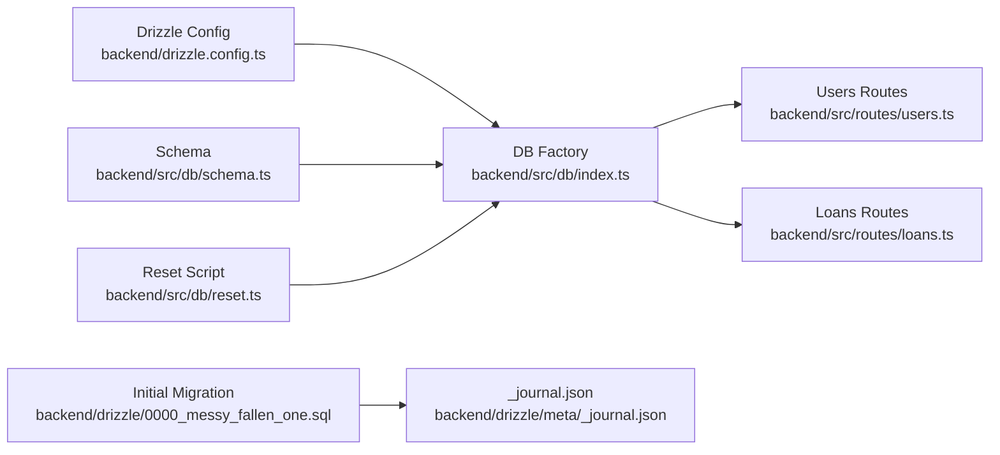
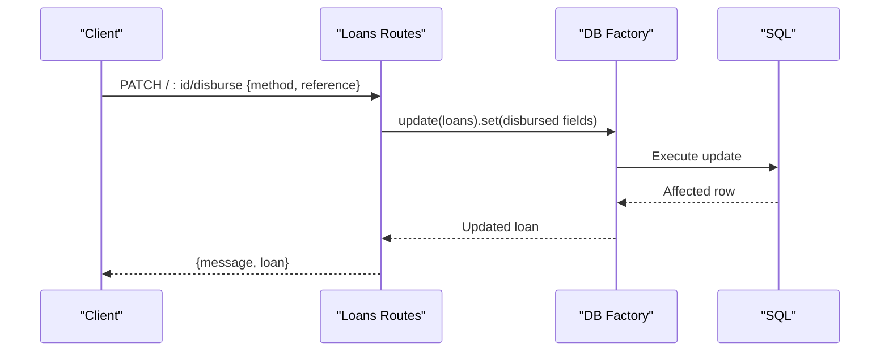
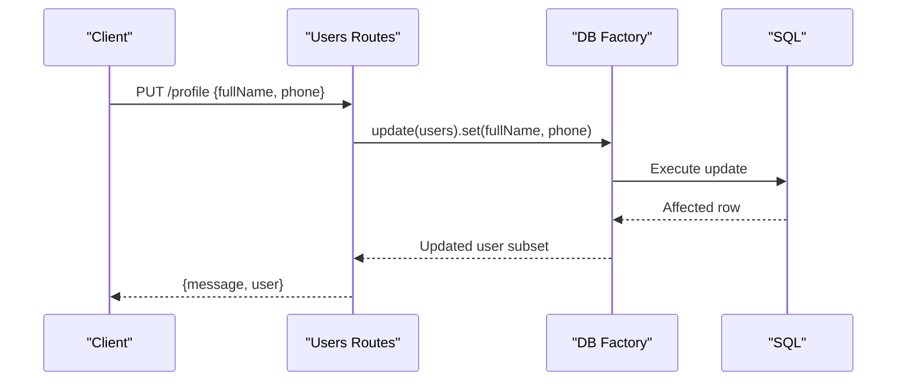

# Database Operations

<cite>
**Referenced Files in This Document**
- [drizzle.config.ts](file://backend/drizzle.config.ts)
- [drizzle.config.ts](file://drizzle.config.ts)
- [schema.ts](file://backend/src/db/schema.ts)
- [index.ts](file://backend/src/db/index.ts)
- [reset.ts](file://backend/src/db/reset.ts)
- [_journal.json](file://backend/drizzle/meta/_journal.json)
- [0000_messy_fallen_one.sql](file://backend/drizzle/0000_messy_fallen_one.sql)
- [0000_snapshot.json](file://backend/drizzle/meta/0000_snapshot.json)
- [users.ts](file://backend/src/routes/users.ts)
- [loans.ts](file://backend/src/routes/loans.ts)
- [migrate.sql](file://backend/migrate.sql)
- [reset-db.sql](file://backend/reset-db.sql)
- [create-notifications-table.sql](file://backend/create-notifications-table.sql)
- [admin-schema-update.ts](file://backend/admin-schema-update.ts)
- [update-schema.sql](file://backend/update-schema.sql)
</cite>

## Table of Contents
1. [Introduction](#introduction)
2. [Project Structure](#project-structure)
3. [Core Components](#core-components)
4. [Architecture Overview](#architecture-overview)
5. [Detailed Component Analysis](#detailed-component-analysis)
6. [Dependency Analysis](#dependency-analysis)
7. [Performance Considerations](#performance-considerations)
8. [Troubleshooting Guide](#troubleshooting-guide)
9. [Conclusion](#conclusion)
10. [Appendices](#appendices)

## Introduction
This document explains the database operations and management for the project, focusing on the Drizzle ORM configuration, migration system, and query patterns. It covers connection management, transaction handling, connection pooling strategies, CRUD operations, complex queries, data validation, migration workflows, schema evolution, database reset procedures, performance optimization, indexing strategies, query optimization, backup and recovery, data export, monitoring, and troubleshooting guidance.

## Project Structure
The database layer is organized around Drizzle ORM with PostgreSQL as the dialect. The backend defines a schema, connection factory, and migrations. Route handlers demonstrate CRUD and complex operations against the schema.

**Diagram sources**
- [drizzle.config.ts:1-14](file://backend/drizzle.config.ts#L1-L14)
- [index.ts:1-47](file://backend/src/db/index.ts#L1-L47)
- [schema.ts:1-146](file://backend/src/db/schema.ts#L1-L146)
- [_journal.json:1-13](file://backend/drizzle/meta/_journal.json#L1-L13)
- [0000_messy_fallen_one.sql:1-93](file://backend/drizzle/0000_messy_fallen_one.sql#L1-L93)
- [0000_snapshot.json:1-617](file://backend/drizzle/meta/0000_snapshot.json#L1-L617)
- [reset.ts:1-26](file://backend/src/db/reset.ts#L1-L26)
- [users.ts:1-197](file://backend/src/routes/users.ts#L1-L197)
- [loans.ts:1-320](file://backend/src/routes/loans.ts#L1-L320)

**Section sources**
- [drizzle.config.ts:1-14](file://backend/drizzle.config.ts#L1-L14)
- [index.ts:1-47](file://backend/src/db/index.ts#L1-L47)
- [schema.ts:1-146](file://backend/src/db/schema.ts#L1-L146)
- [_journal.json:1-13](file://backend/drizzle/meta/_journal.json#L1-L13)
- [0000_messy_fallen_one.sql:1-93](file://backend/drizzle/0000_messy_fallen_one.sql#L1-L93)
- [0000_snapshot.json:1-617](file://backend/drizzle/meta/0000_snapshot.json#L1-L617)
- [reset.ts:1-26](file://backend/src/db/reset.ts#L1-L26)
- [users.ts:1-197](file://backend/src/routes/users.ts#L1-L197)
- [loans.ts:1-320](file://backend/src/routes/loans.ts#L1-L320)

## Core Components
- Drizzle configuration: Defines schema path, output directory, dialect, and credentials for migration and ORM generation.
- Schema definition: Declares tables, columns, constraints, relations, and TypeScript types for strong typing.
- DB factory: Loads environment, validates DATABASE_URL, configures Neon HTTP driver, and exposes a drizzle client.
- Migrations: Drizzle-managed migrations with journal and snapshot metadata; initial SQL script defines baseline schema.
- Reset utilities: Scripts and programmatic reset to drop tables in dependency order.
- Route handlers: Demonstrate CRUD and complex operations using Drizzle ORM.

**Section sources**
- [drizzle.config.ts:1-14](file://backend/drizzle.config.ts#L1-L14)
- [schema.ts:1-146](file://backend/src/db/schema.ts#L1-L146)
- [index.ts:1-47](file://backend/src/db/index.ts#L1-L47)
- [_journal.json:1-13](file://backend/drizzle/meta/_journal.json#L1-L13)
- [0000_snapshot.json:1-617](file://backend/drizzle/meta/0000_snapshot.json#L1-L617)
- [0000_messy_fallen_one.sql:1-93](file://backend/drizzle/0000_messy_fallen_one.sql#L1-L93)
- [reset.ts:1-26](file://backend/src/db/reset.ts#L1-L26)

## Architecture Overview
The runtime database architecture integrates Drizzle ORM with a PostgreSQL-compatible provider via Neon HTTP. Requests flow through route handlers that use typed queries and updates against the schema.

**Diagram sources**
- [index.ts:1-47](file://backend/src/db/index.ts#L1-L47)
- [users.ts:1-197](file://backend/src/routes/users.ts#L1-L197)
- [loans.ts:1-320](file://backend/src/routes/loans.ts#L1-L320)

## Detailed Component Analysis

### Drizzle ORM Configuration
- Backend migration config: Points to schema, migration output, PostgreSQL dialect, and reads DATABASE_URL from environment.
- Shared migration config: Similar setup for shared schema and migrations.

Key behaviors:
- Environment-driven credentials.
- Dialect-specific SQL generation.
- Snapshot and journal tracking for migrations.

**Section sources**
- [drizzle.config.ts:1-14](file://backend/drizzle.config.ts#L1-L14)
- [drizzle.config.ts:1-15](file://drizzle.config.ts#L1-L15)

### Schema Definition and Types
Tables and relations:
- Users: identity, contact info, role, blacklist flag, timestamps.
- Loans: financial details, status lifecycle, disbursement/repayment/completion fields, timestamps.
- Loan Applications: application details, status, admin review linkage.
- Repayments: scheduled and paid records per loan.
- Notifications: user-bound messages with type and read status.
- Settings: key-value store for dynamic configuration.

Relations:
- Users has many Loans and Loan Applications.
- Loans belong to Users, have many Repayments, and optional Application.
- Loan Applications reference Users, Loans, and Reviewer Users.
- Repayments reference Loans.

Type exports enable strict typing for inserts and selections.

**Section sources**
- [schema.ts:1-146](file://backend/src/db/schema.ts#L1-L146)

### Database Connection Management and Pooling
- Connection factory loads .env, validates DATABASE_URL, configures Neon HTTP driver, and creates a drizzle client bound to the schema.
- Neon HTTP driver enables efficient connection reuse and caching via a fetch connection cache setting.

Operational notes:
- Ensure DATABASE_URL is present in environment.
- Neon HTTP driver is optimized for serverless environments and reduces cold-start overhead.

**Section sources**
- [index.ts:1-47](file://backend/src/db/index.ts#L1-L47)

### Transaction Handling
- Drizzle supports returning affected rows and structured updates/inserts.
- For multi-statement atomicity, wrap related operations in a single route handler or orchestrate at the application level.
- No explicit transaction blocks are shown in the referenced files; use Drizzle’s batch operations or provider-level transactions if needed.

**Section sources**
- [users.ts:73-107](file://backend/src/routes/users.ts#L73-L107)
- [loans.ts:224-290](file://backend/src/routes/loans.ts#L224-L290)

### Migration System and Schema Evolution
- Initial migration: Baseline SQL script defines all tables and foreign keys.
- Journal and snapshot: Track applied migrations and current schema state.
- Additional migrations:
  - Column additions for Loans via SQL and programmatic checks.
  - Notifications table creation with indexes.
  - Admin schema updates including blacklist column and settings table.
  - Generalized schema updates script adding user and loan columns plus notifications table.

Workflow:
- Define schema in Drizzle config and schema file.
- Run migrations to synchronize database state with schema.
- Use reset scripts to drop tables in dependency order when rebuilding.

**Section sources**
- [0000_messy_fallen_one.sql:1-93](file://backend/drizzle/0000_messy_fallen_one.sql#L1-L93)
- [_journal.json:1-13](file://backend/drizzle/meta/_journal.json#L1-L13)
- [0000_snapshot.json:1-617](file://backend/drizzle/meta/0000_snapshot.json#L1-L617)
- [migrate.sql:1-12](file://backend/migrate.sql#L1-L12)
- [create-notifications-table.sql:1-30](file://backend/create-notifications-table.sql#L1-L30)
- [admin-schema-update.ts:1-30](file://backend/admin-schema-update.ts#L1-L30)
- [update-schema.sql:1-32](file://backend/update-schema.sql#L1-L32)

### Database Reset Procedures
- Programmatic reset drops tables in reverse dependency order.
- SQL reset script performs the same operation and verifies remaining tables.
- Use reset during development or maintenance windows; ensure backups are taken first.

**Section sources**
- [reset.ts:1-26](file://backend/src/db/reset.ts#L1-L26)
- [reset-db.sql:1-9](file://backend/reset-db.sql#L1-L9)

### CRUD Operations and Query Patterns
- Users:
  - List users with related loans/applications, excluding sensitive fields.
  - Retrieve profile by header-provided user ID.
  - Update profile fields and return selected columns.
  - Admin-only endpoints: toggle blacklist and update password after hashing.
- Loans:
  - List all loans with user and repayments included.
  - Fetch user’s loans with repayments.
  - Create loan with validated payload.
  - Update status, disburse loan, mark repaid, and complete loan; optionally insert repayment records.

Validation:
- Zod schemas validate request bodies for loan creation.

**Section sources**
- [users.ts:8-39](file://backend/src/routes/users.ts#L8-L39)
- [users.ts:41-70](file://backend/src/routes/users.ts#L41-L70)
- [users.ts:73-107](file://backend/src/routes/users.ts#L73-L107)
- [users.ts:109-134](file://backend/src/routes/users.ts#L109-L134)
- [users.ts:136-161](file://backend/src/routes/users.ts#L136-L161)
- [users.ts:165-194](file://backend/src/routes/users.ts#L165-L194)
- [loans.ts:92-113](file://backend/src/routes/loans.ts#L92-L113)
- [loans.ts:115-138](file://backend/src/routes/loans.ts#L115-L138)
- [loans.ts:140-168](file://backend/src/routes/loans.ts#L140-L168)
- [loans.ts:170-197](file://backend/src/routes/loans.ts#L170-L197)
- [loans.ts:199-222](file://backend/src/routes/loans.ts#L199-L222)
- [loans.ts:224-250](file://backend/src/routes/loans.ts#L224-L250)
- [loans.ts:252-290](file://backend/src/routes/loans.ts#L252-L290)
- [loans.ts:292-317](file://backend/src/routes/loans.ts#L292-L317)

### Complex Queries and Data Validation Patterns
- Joins and relations: Route handlers fetch related entities (e.g., user with loans/applications, loan with repayments).
- Conditional updates: Status transitions and disbursement/repayment fields are set atomically.
- Validation: Zod-based request validation for loan creation; manual checks for password length in users routes.

**Section sources**
- [users.ts:1-197](file://backend/src/routes/users.ts#L1-L197)
- [loans.ts:1-320](file://backend/src/routes/loans.ts#L1-L320)

### Backup and Recovery Procedures
- Use your hosting provider’s managed backup features for PostgreSQL.
- Export schema and data using standard PostgreSQL tools (e.g., pg_dump) for offsite backups.
- Restore from backups by recreating the database and importing dump files.
- During maintenance, use reset procedures to drop tables and reapply migrations.

[No sources needed since this section provides general guidance]

### Monitoring and Observability
- Monitor query latency and throughput at the application layer.
- Use database provider dashboards for connection counts, slow queries, and I/O metrics.
- Log errors from route handlers and connection factory for operational visibility.

[No sources needed since this section provides general guidance]

## Dependency Analysis
The following diagram shows how components depend on each other:

**Diagram sources**
- [drizzle.config.ts:1-14](file://backend/drizzle.config.ts#L1-L14)
- [schema.ts:1-146](file://backend/src/db/schema.ts#L1-L146)
- [index.ts:1-47](file://backend/src/db/index.ts#L1-L47)
- [users.ts:1-197](file://backend/src/routes/users.ts#L1-L197)
- [loans.ts:1-320](file://backend/src/routes/loans.ts#L1-L320)
- [reset.ts:1-26](file://backend/src/db/reset.ts#L1-L26)
- [0000_messy_fallen_one.sql:1-93](file://backend/drizzle/0000_messy_fallen_one.sql#L1-L93)
- [_journal.json:1-13](file://backend/drizzle/meta/_journal.json#L1-L13)

**Section sources**
- [drizzle.config.ts:1-14](file://backend/drizzle.config.ts#L1-L14)
- [schema.ts:1-146](file://backend/src/db/schema.ts#L1-L146)
- [index.ts:1-47](file://backend/src/db/index.ts#L1-L47)
- [users.ts:1-197](file://backend/src/routes/users.ts#L1-L197)
- [loans.ts:1-320](file://backend/src/routes/loans.ts#L1-L320)
- [reset.ts:1-26](file://backend/src/db/reset.ts#L1-L26)
- [0000_messy_fallen_one.sql:1-93](file://backend/drizzle/0000_messy_fallen_one.sql#L1-L93)
- [_journal.json:1-13](file://backend/drizzle/meta/_journal.json#L1-L13)

## Performance Considerations
- Indexes: Create indexes on frequently filtered/sorted columns (e.g., notifications user_id, created_at, type, is_read).
- Query patterns: Use selective projections (exclude sensitive fields) and limit joins to necessary relations.
- Connection pooling: Neon HTTP driver improves connection reuse; avoid creating multiple clients unnecessarily.
- Data types: Use appropriate numeric precisions and scales to prevent overflow and reduce storage.
- Batch operations: Combine related updates/inserts to minimize round-trips.

**Section sources**
- [create-notifications-table.sql:19-23](file://backend/create-notifications-table.sql#L19-L23)

## Troubleshooting Guide
Common issues and resolutions:
- Missing DATABASE_URL:
  - Ensure environment variable is set and readable by the process.
  - Connection factory logs explicit guidance when DATABASE_URL is missing.
- Migration conflicts:
  - Review journal entries and snapshots to understand applied migrations.
  - Re-run migrations after resolving drift.
- Resetting the database:
  - Use reset script or SQL reset to drop tables in dependency order.
  - Confirm tables are dropped and re-run migrations.
- Route errors:
  - Inspect handler logs for internal server errors and unauthorized access scenarios.
  - Validate request payloads using schema validators.

**Section sources**
- [index.ts:31-38](file://backend/src/db/index.ts#L31-L38)
- [_journal.json:1-13](file://backend/drizzle/meta/_journal.json#L1-L13)
- [0000_snapshot.json:1-617](file://backend/drizzle/meta/0000_snapshot.json#L1-L617)
- [reset.ts:6-22](file://backend/src/db/reset.ts#L6-L22)
- [users.ts:46-48](file://backend/src/routes/users.ts#L46-L48)
- [loans.ts:118-122](file://backend/src/routes/loans.ts#L118-L122)

## Conclusion
The project employs Drizzle ORM with a PostgreSQL-compatible provider, a well-defined schema, and robust migration tooling. Route handlers demonstrate practical CRUD and complex operations with validation and relations. Connection management leverages Neon HTTP for efficient connectivity. Adhering to the migration and reset procedures, indexing strategies, and performance recommendations ensures reliable and scalable database operations.

## Appendices

### Migration Workflow Summary
- Define schema and config.
- Generate and apply migrations.
- Track state with journal and snapshot.
- Reset when necessary using provided scripts.

**Section sources**
- [drizzle.config.ts:1-14](file://backend/drizzle.config.ts#L1-L14)
- [_journal.json:1-13](file://backend/drizzle/meta/_journal.json#L1-L13)
- [0000_snapshot.json:1-617](file://backend/drizzle/meta/0000_snapshot.json#L1-L617)
- [reset.ts:1-26](file://backend/src/db/reset.ts#L1-L26)

### Example Operation Sequences

#### Loan Disbursement Flow

**Diagram sources**
- [loans.ts:224-250](file://backend/src/routes/loans.ts#L224-L250)

#### User Profile Update Flow

**Diagram sources**
- [users.ts:73-107](file://backend/src/routes/users.ts#L73-L107)