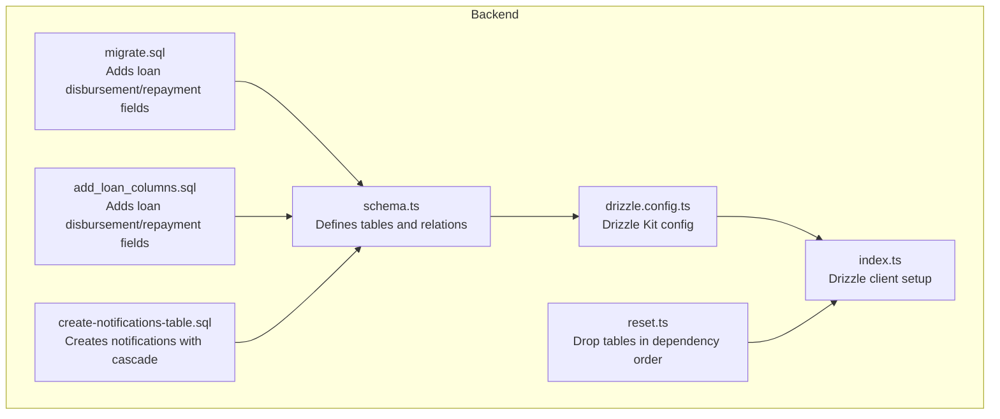
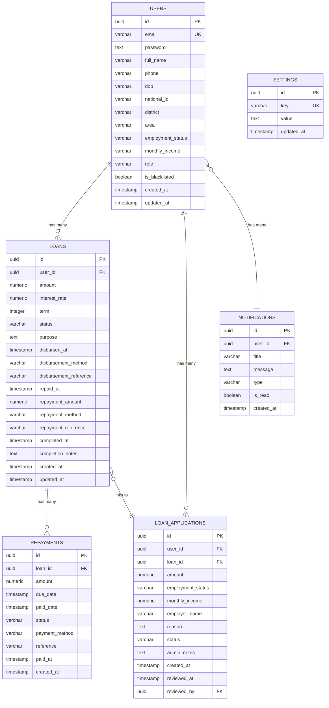
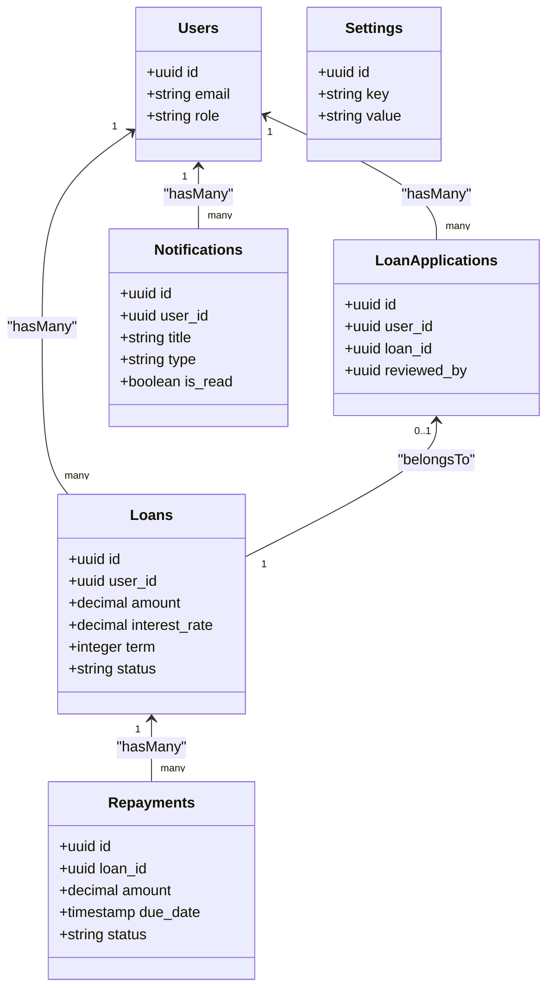
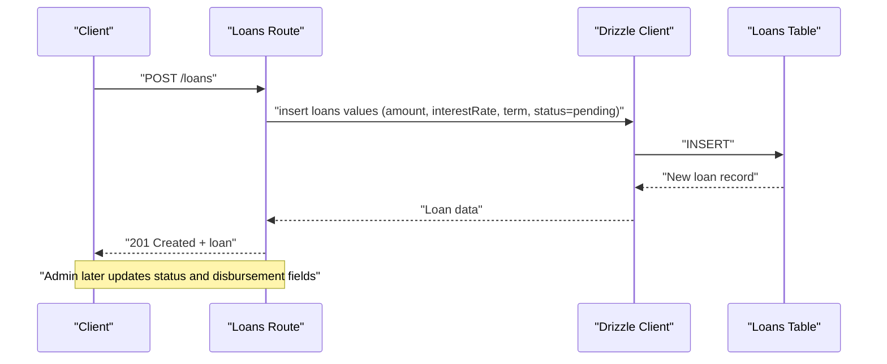
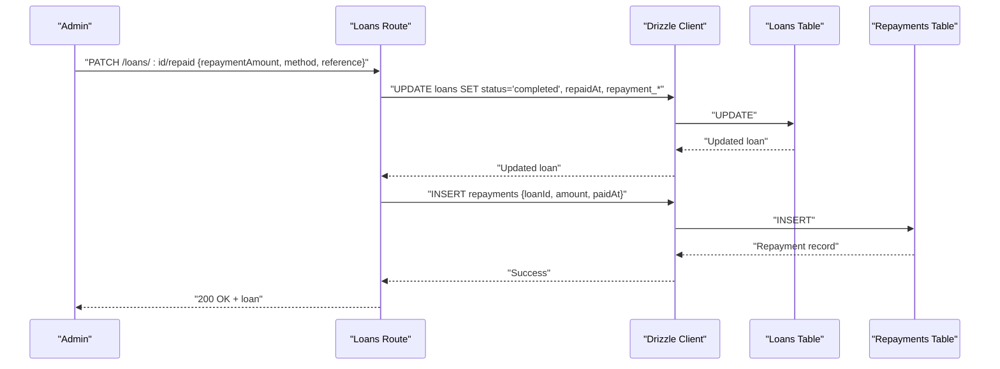
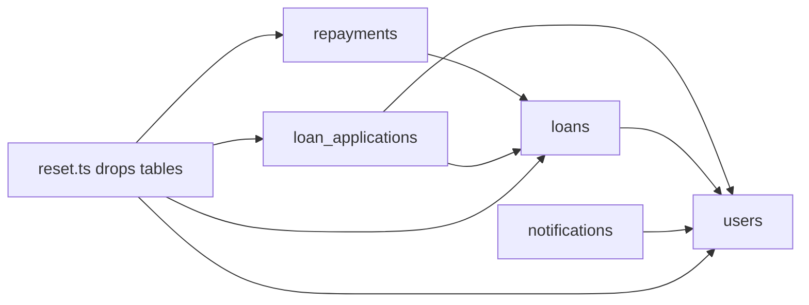

# Database Schema Design

<cite>
**Referenced Files in This Document**
- [schema.ts](file://backend/src/db/schema.ts)
- [0000_snapshot.json](file://backend/drizzle/meta/0000_snapshot.json)
- [create-notifications-table.sql](file://backend/create-notifications-table.sql)
- [migrate.sql](file://backend/migrate.sql)
- [add_loan_columns.sql](file://backend/add_loan_columns.sql)
- [drizzle.config.ts](file://backend/drizzle.config.ts)
- [index.ts](file://backend/src/db/index.ts)
- [reset.ts](file://backend/src/db/reset.ts)
- [users.ts](file://backend/src/routes/users.ts)
- [loans.ts](file://backend/src/routes/loans.ts)
- [applications.ts](file://backend/src/routes/applications.ts)
</cite>

## Table of Contents
1. [Introduction](#introduction)
2. [Project Structure](#project-structure)
3. [Core Components](#core-components)
4. [Architecture Overview](#architecture-overview)
5. [Detailed Component Analysis](#detailed-component-analysis)
6. [Dependency Analysis](#dependency-analysis)
7. [Performance Considerations](#performance-considerations)
8. [Troubleshooting Guide](#troubleshooting-guide)
9. [Conclusion](#conclusion)

## Introduction
This document describes the database schema design and entity relationships for the Phoenix lending platform. It covers the structure of the users, loans, loan_applications, repayments, notifications, and settings tables, including field definitions, data types, constraints, foreign keys, cascading rules, and referential integrity. It also explains how the schema maps to TypeScript types for Drizzle ORM, outlines indexing strategies, and highlights validation rules embedded in the schema. Business logic decisions behind each table design are explained to help developers and stakeholders understand the rationale for each field and constraint.

## Project Structure
The schema is defined using Drizzle ORM with PostgreSQL dialect. The schema file defines tables and relations, while migrations and SQL scripts manage evolving table structures. Drizzle Kit configuration ties the schema to the database connection and migration pipeline.

**Diagram sources**
- [schema.ts:1-146](file://backend/src/db/schema.ts#L1-L146)
- [migrate.sql:1-12](file://backend/migrate.sql#L1-L12)
- [add_loan_columns.sql:1-12](file://backend/add_loan_columns.sql#L1-L12)
- [create-notifications-table.sql:1-30](file://backend/create-notifications-table.sql#L1-L30)
- [drizzle.config.ts:1-14](file://backend/drizzle.config.ts#L1-L14)
- [index.ts:1-44](file://backend/src/db/index.ts#L1-L44)
- [reset.ts:1-26](file://backend/src/db/reset.ts#L1-L26)

**Section sources**
- [schema.ts:1-146](file://backend/src/db/schema.ts#L1-L146)
- [drizzle.config.ts:1-14](file://backend/drizzle.config.ts#L1-L14)
- [index.ts:1-44](file://backend/src/db/index.ts#L1-L44)
- [reset.ts:1-26](file://backend/src/db/reset.ts#L1-L26)

## Core Components
This section documents each table’s purpose, fields, data types, constraints, and business significance.

- Users
  - Purpose: Stores user profiles, authentication credentials, roles, and KYC-like attributes.
  - Key fields: id (UUID primary key), email (unique, not null), password (not null), fullName (not null), phone, dob, nationalId, district, area, employmentStatus, monthlyIncome, role (default 'user'), isBlacklisted (default false), timestamps.
  - Constraints: Unique index on email via unique constraint.
  - Relations: One-to-many with loans and loan_applications.

- Loans
  - Purpose: Tracks loan lifecycle: creation, approval, disbursement, repayment, completion, and defaults.
  - Key fields: id (UUID primary key), userId (foreign key to users), amount (decimal with precision 12, scale 2), interestRate (decimal with precision 5, scale 2), term (months), status (default 'pending'), purpose, disbursement timestamps/method/reference, repayment timestamps/amount/method/reference, completion timestamps/notes, timestamps.
  - Constraints: Foreign key to users; no explicit unique constraints on amount/term.
  - Relations: One-to-many with repayments; one-to-one with loan_applications via loanId.

- Loan Applications
  - Purpose: Captures user loan requests, admin reviews, and optional linkage to approved loans.
  - Key fields: id (UUID primary key), userId (foreign key to users), loanId (optional foreign key to loans), amount, employmentStatus, monthlyIncome, employerName, reason, status (default 'pending'), adminNotes, timestamps, reviewedAt, reviewedBy (foreign key to users).
  - Constraints: Optional foreign key to loans; multiple foreign keys to users.
  - Relations: Many-to-one with users; many-to-one with loans; many-to-one with reviewer user.

- Repayments
  - Purpose: Records scheduled and paid repayment events per loan.
  - Key fields: id (UUID primary key), loanId (foreign key to loans), amount (decimal), dueDate, paidDate, status (default 'pending'), paymentMethod, reference, paidAt, timestamps.
  - Constraints: Foreign key to loans; no unique constraints.
  - Relations: Many-to-one with loans.

- Notifications
  - Purpose: Stores user-specific notifications with types and read status.
  - Key fields: id (UUID primary key), userId (foreign key to users with ON DELETE CASCADE), title, message, type, isRead (default false), timestamps.
  - Constraints: Foreign key with cascade delete; no unique constraints.
  - Relations: Many-to-one with users.

- Settings
  - Purpose: Centralized configuration storage keyed by unique keys with JSON-like values.
  - Key fields: id (UUID primary key), key (unique, not null), value (not null), timestamps.
  - Constraints: Unique constraint on key.
  - Relations: No foreign keys.

**Section sources**
- [schema.ts:4-96](file://backend/src/db/schema.ts#L4-L96)
- [0000_snapshot.json:6-617](file://backend/drizzle/meta/0000_snapshot.json#L6-L617)
- [create-notifications-table.sql:1-30](file://backend/create-notifications-table.sql#L1-L30)

## Architecture Overview
The schema enforces referential integrity through foreign keys and supports application-level relationships via Drizzle relations. The database is accessed through a Drizzle client configured via environment variables.

**Diagram sources**
- [schema.ts:4-96](file://backend/src/db/schema.ts#L4-L96)
- [0000_snapshot.json:6-617](file://backend/drizzle/meta/0000_snapshot.json#L6-L617)

**Section sources**
- [schema.ts:98-146](file://backend/src/db/schema.ts#L98-L146)
- [index.ts:1-44](file://backend/src/db/index.ts#L1-L44)

## Detailed Component Analysis

### Users Table
- Purpose: Core identity and profile storage with role-based access and blacklist controls.
- Notable constraints:
  - Unique email via unique constraint.
  - Default role 'user'.
  - Timestamps managed by defaults.
- Business logic:
  - Blacklist flag allows administrative restriction of access.
  - Employment and income fields support credit assessment.
- TypeScript mapping:
  - Types exported for select/insert operations.

**Section sources**
- [schema.ts:5-21](file://backend/src/db/schema.ts#L5-L21)
- [0000_snapshot.json:489-604](file://backend/drizzle/meta/0000_snapshot.json#L489-L604)
- [schema.ts:136-137](file://backend/src/db/schema.ts#L136-L137)

### Loans Table
- Purpose: Loan lifecycle tracking with disbursement, repayment, and completion metadata.
- Notable constraints:
  - Foreign key to users.
  - Decimal precision chosen to support financial calculations.
  - Status defaults to 'pending'; business logic updates status during lifecycle.
- Business logic:
  - Disbursement fields capture channel and reference.
  - Repayment fields capture amounts and methods.
  - Completion fields capture notes and timestamps.
- Migration note:
  - Additional columns were added via SQL scripts to support disbursement/repayment tracking.

**Section sources**
- [schema.ts:24-46](file://backend/src/db/schema.ts#L24-L46)
- [0000_snapshot.json:141-279](file://backend/drizzle/meta/0000_snapshot.json#L141-L279)
- [migrate.sql:1-12](file://backend/migrate.sql#L1-L12)
- [add_loan_columns.sql:1-12](file://backend/add_loan_columns.sql#L1-L12)
- [loans.ts:10-82](file://backend/src/routes/loans.ts#L10-L82)

### Loan Applications Table
- Purpose: Captures loan requests, admin review trail, and optional linkage to approved loans.
- Notable constraints:
  - Foreign keys to users (applicant, reviewer).
  - Optional foreign key to loans after approval.
  - Status defaults to 'pending'.
- Business logic:
  - Admin review updates status, notes, timestamps, and reviewer.
  - Optional linking to a loan record after approval.

**Section sources**
- [schema.ts:49-63](file://backend/src/db/schema.ts#L49-L63)
- [0000_snapshot.json:7-140](file://backend/drizzle/meta/0000_snapshot.json#L7-L140)
- [applications.ts:141-165](file://backend/src/routes/applications.ts#L141-L165)

### Repayments Table
- Purpose: Tracks repayment events per loan with due/paid dates and statuses.
- Notable constraints:
  - Foreign key to loans.
  - Status defaults to 'pending'.
- Business logic:
  - Paid records include method, reference, and timestamp.
  - Application logic creates repayment entries upon marking a loan as repaid.

**Section sources**
- [schema.ts:66-77](file://backend/src/db/schema.ts#L66-L77)
- [0000_snapshot.json:352-441](file://backend/drizzle/meta/0000_snapshot.json#L352-L441)
- [loans.ts:271-280](file://backend/src/routes/loans.ts#L271-L280)

### Notifications Table
- Purpose: User-centric notification delivery with type and read status.
- Notable constraints:
  - Foreign key to users with ON DELETE CASCADE.
  - No unique constraints.
- Business logic:
  - Cascade deletion ensures cleanup when a user is removed.
  - Indexes recommended for efficient querying by user, type, and read status.

**Section sources**
- [schema.ts:79-88](file://backend/src/db/schema.ts#L79-L88)
- [0000_snapshot.json:280-351](file://backend/drizzle/meta/0000_snapshot.json#L280-L351)
- [create-notifications-table.sql:13-23](file://backend/create-notifications-table.sql#L13-L23)

### Settings Table
- Purpose: Centralized configuration storage with unique keys and JSON-like values.
- Notable constraints:
  - Unique key constraint.
- Business logic:
  - Values stored as text; application should parse as JSON when applicable.

**Section sources**
- [schema.ts:90-96](file://backend/src/db/schema.ts#L90-L96)
- [0000_snapshot.json:442-488](file://backend/drizzle/meta/0000_snapshot.json#L442-L488)

### Entity Relationship Diagrams

#### Drizzle Relations

**Diagram sources**
- [schema.ts:98-146](file://backend/src/db/schema.ts#L98-L146)

#### Application-Level Data Flow (Loan Creation and Disbursement)

**Diagram sources**
- [loans.ts:171-197](file://backend/src/routes/loans.ts#L171-L197)
- [schema.ts:24-46](file://backend/src/db/schema.ts#L24-L46)

#### Application-Level Data Flow (Loan Repayment)

**Diagram sources**
- [loans.ts:252-290](file://backend/src/routes/loans.ts#L252-L290)
- [schema.ts:66-77](file://backend/src/db/schema.ts#L66-L77)

## Dependency Analysis
Foreign keys and cascading rules ensure referential integrity across entities. The dependency order for schema changes and resets follows child-to-parent relationships to avoid constraint violations.

**Diagram sources**
- [schema.ts:24-88](file://backend/src/db/schema.ts#L24-L88)
- [reset.ts:15-19](file://backend/src/db/reset.ts#L15-L19)

**Section sources**
- [schema.ts:24-88](file://backend/src/db/schema.ts#L24-L88)
- [reset.ts:15-19](file://backend/src/db/reset.ts#L15-L19)

## Performance Considerations
- Indexing strategy:
  - Notifications table: Recommended indexes on user_id, created_at, type, is_read to optimize filtering and pagination.
  - These indexes are defined in the notifications SQL script.
- Data types:
  - Decimals with fixed precision/scale are used for monetary values to prevent floating-point errors.
- Cascading deletes:
  - Notifications cascade on user deletion to maintain data cleanliness.
- Timestamps:
  - Default timestamps reduce application-side overhead and ensure consistent audit trails.
- Query patterns:
  - Application routes demonstrate selective column retrieval and relation loading to minimize payload sizes.

**Section sources**
- [create-notifications-table.sql:19-23](file://backend/create-notifications-table.sql#L19-L23)
- [schema.ts:27, 28, 54, 55, 69, 129, 131:27-28](file://backend/src/db/schema.ts#L27-L28)
- [users.ts:11-39](file://backend/src/routes/users.ts#L11-L39)
- [loans.ts:95-106](file://backend/src/routes/loans.ts#L95-L106)
- [applications.ts:27-46](file://backend/src/routes/applications.ts#L27-L46)

## Troubleshooting Guide
- Missing loan columns:
  - The loans table may be missing disbursement/repayment fields. The ensureLoanColumns routine attempts to add them safely.
  - Manual verification and migration scripts exist to add these fields.
- Environment configuration:
  - DATABASE_URL must be present for Drizzle client initialization; otherwise, startup fails with an error.
- Resetting the database:
  - Use the reset script to drop tables in dependency order to avoid foreign key conflicts.

**Section sources**
- [loans.ts:10-82](file://backend/src/routes/loans.ts#L10-L82)
- [index.ts:31-38](file://backend/src/db/index.ts#L31-L38)
- [reset.ts:15-22](file://backend/src/db/reset.ts#L15-L22)

## Conclusion
The Phoenix database schema is designed around a clear set of entities with explicit foreign keys and cascading rules to maintain referential integrity. Drizzle ORM relations and TypeScript type exports enable strong typing and predictable data access patterns. Financial fields use precise decimals, and timestamps are consistently managed. Notifications leverage cascade deletion for user cleanup. The schema supports the full loan lifecycle and integrates with application routes for creation, review, disbursement, repayment, and completion. Recommended indexes on notifications and careful handling of loan columns will improve query performance and operational reliability.