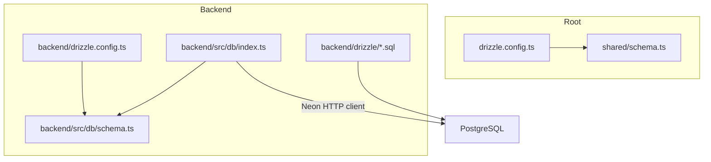
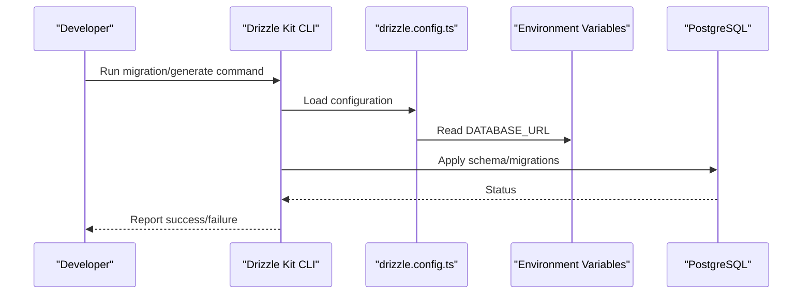
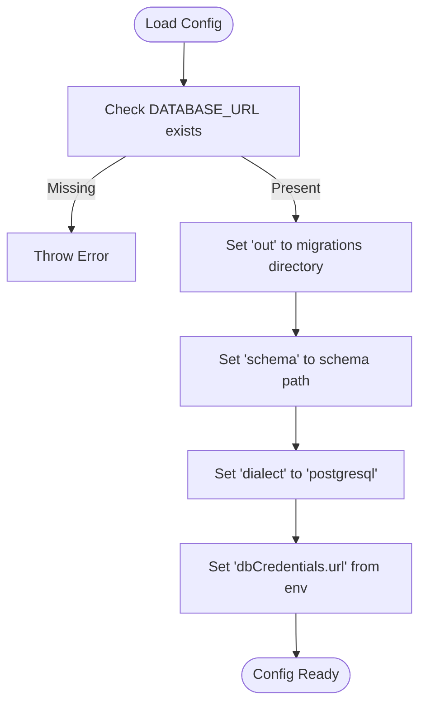
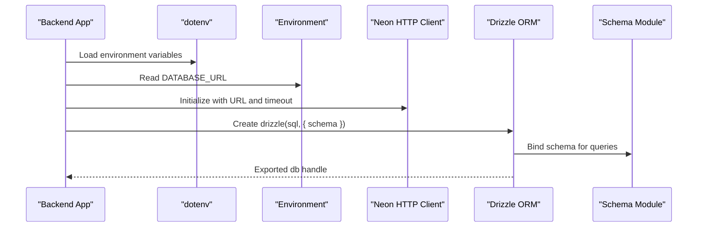
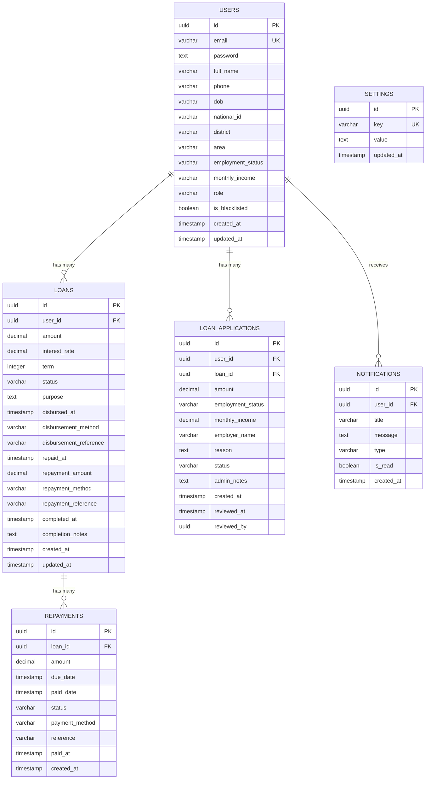
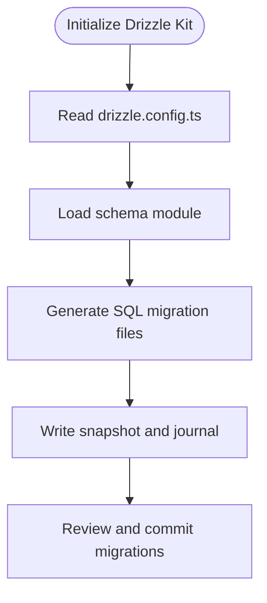
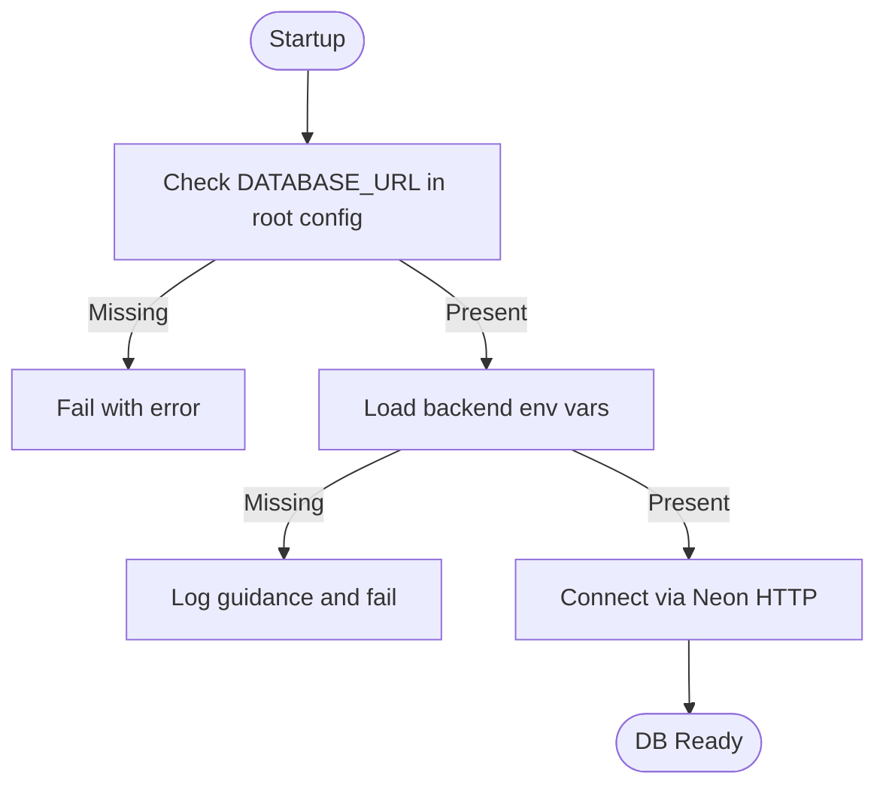
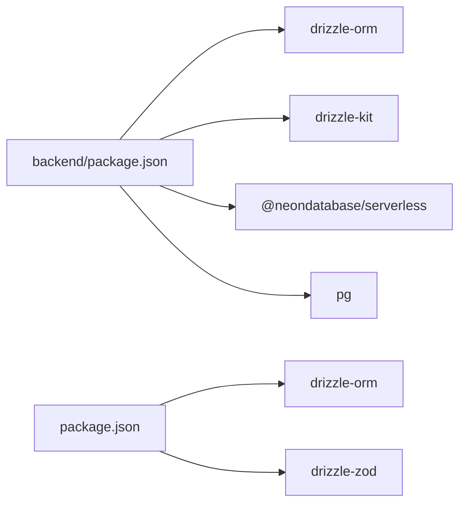

# Drizzle ORM Configuration

<cite>
**Referenced Files in This Document**
- [drizzle.config.ts](file://drizzle.config.ts)
- [backend/drizzle.config.ts](file://backend/drizzle.config.ts)
- [backend/src/db/index.ts](file://backend/src/db/index.ts)
- [backend/src/db/schema.ts](file://backend/src/db/schema.ts)
- [shared/schema.ts](file://shared/schema.ts)
- [backend/drizzle/0000_messy_fallen_one.sql](file://backend/drizzle/0000_messy_fallen_one.sql)
- [backend/src/db/reset.ts](file://backend/src/db/reset.ts)
- [backend/package.json](file://backend/package.json)
- [package.json](file://package.json)
- [server/index.ts](file://server/index.ts)
</cite>

## Table of Contents
1. [Introduction](#introduction)
2. [Project Structure](#project-structure)
3. [Core Components](#core-components)
4. [Architecture Overview](#architecture-overview)
5. [Detailed Component Analysis](#detailed-component-analysis)
6. [Dependency Analysis](#dependency-analysis)
7. [Performance Considerations](#performance-considerations)
8. [Troubleshooting Guide](#troubleshooting-guide)
9. [Conclusion](#conclusion)

## Introduction
This document explains how Drizzle ORM is configured and set up in the Phoenix project. It covers database connection configuration, schema mapping, type generation, migration setup, and environment-driven configuration for different deployment targets. It also provides guidance on connecting to PostgreSQL via Neon, managing credentials securely, and extending the configuration for development, staging, and production environments.

## Project Structure
The project contains two Drizzle configurations:
- Root-level configuration for shared schema usage
- Backend-specific configuration for local development and migrations

Key components:
- Drizzle configuration files define schema location, output directory, dialect, and credentials
- A Neon-based database client connects to PostgreSQL
- Schema definitions live in separate modules for backend and shared usage
- Migration artifacts are generated and stored under backend/drizzle

**Diagram sources**
- [drizzle.config.ts:1-15](file://drizzle.config.ts#L1-L15)
- [shared/schema.ts:1-21](file://shared/schema.ts#L1-L21)
- [backend/drizzle.config.ts:1-14](file://backend/drizzle.config.ts#L1-L14)
- [backend/src/db/index.ts:1-44](file://backend/src/db/index.ts#L1-L44)
- [backend/src/db/schema.ts:1-146](file://backend/src/db/schema.ts#L1-L146)
- [backend/drizzle/0000_messy_fallen_one.sql:1-93](file://backend/drizzle/0000_messy_fallen_one.sql#L1-L93)

**Section sources**
- [drizzle.config.ts:1-15](file://drizzle.config.ts#L1-L15)
- [backend/drizzle.config.ts:1-14](file://backend/drizzle.config.ts#L1-L14)
- [backend/src/db/index.ts:1-44](file://backend/src/db/index.ts#L1-L44)
- [backend/src/db/schema.ts:1-146](file://backend/src/db/schema.ts#L1-L146)
- [shared/schema.ts:1-21](file://shared/schema.ts#L1-L21)
- [backend/drizzle/0000_messy_fallen_one.sql:1-93](file://backend/drizzle/0000_messy_fallen_one.sql#L1-L93)

## Core Components
- Drizzle configuration (root): Defines output directory, schema path, dialect, and credentials URL sourced from environment variables. It enforces presence of DATABASE_URL at runtime.
- Drizzle configuration (backend): Loads environment variables locally, sets schema and output paths, and configures PostgreSQL dialect with credentials URL.
- Database connection (Neon HTTP): Initializes a Neon HTTP client with a configurable fetch timeout and creates a Drizzle instance bound to the schema.
- Schema definitions:
  - Backend schema: Comprehensive tables for users, loans, applications, repayments, notifications, and settings with relations and TypeScript type exports.
  - Shared schema: Minimal user table and Zod schema for insert validation.
- Migrations: SQL migration files and metadata snapshots are generated and maintained under backend/drizzle.

**Section sources**
- [drizzle.config.ts:1-15](file://drizzle.config.ts#L1-L15)
- [backend/drizzle.config.ts:1-14](file://backend/drizzle.config.ts#L1-L14)
- [backend/src/db/index.ts:1-44](file://backend/src/db/index.ts#L1-L44)
- [backend/src/db/schema.ts:1-146](file://backend/src/db/schema.ts#L1-L146)
- [shared/schema.ts:1-21](file://shared/schema.ts#L1-L21)
- [backend/drizzle/0000_messy_fallen_one.sql:1-93](file://backend/drizzle/0000_messy_fallen_one.sql#L1-L93)

## Architecture Overview
The database layer integrates Neon’s HTTP client with Drizzle ORM to connect to a PostgreSQL-compatible database. Environment variables supply the connection URL. Drizzle Kit is used for generating and pushing schema changes, while the backend maintains migration artifacts.

**Diagram sources**
- [drizzle.config.ts:1-15](file://drizzle.config.ts#L1-L15)
- [backend/drizzle.config.ts:1-14](file://backend/drizzle.config.ts#L1-L14)

## Detailed Component Analysis

### Drizzle Configuration Files
- Root drizzle.config.ts
  - Enforces DATABASE_URL presence and throws if missing
  - Sets output directory for migrations and schema path for shared schema
  - Uses PostgreSQL dialect with credentials URL
- Backend drizzle.config.ts
  - Loads environment variables via dotenv
  - Specifies schema path and output directory for Drizzle Kit
  - Uses PostgreSQL dialect with credentials URL

**Diagram sources**
- [drizzle.config.ts:1-15](file://drizzle.config.ts#L1-L15)
- [backend/drizzle.config.ts:1-14](file://backend/drizzle.config.ts#L1-L14)

**Section sources**
- [drizzle.config.ts:1-15](file://drizzle.config.ts#L1-L15)
- [backend/drizzle.config.ts:1-14](file://backend/drizzle.config.ts#L1-L14)

### Database Connection Setup (Neon HTTP)
- The backend initializes a Neon HTTP client using DATABASE_URL and applies a fetch timeout
- Drizzle ORM wraps the client and binds it to the schema module
- Environment loading is handled either via dotenv or manual parsing of .env

**Diagram sources**
- [backend/src/db/index.ts:1-44](file://backend/src/db/index.ts#L1-L44)

**Section sources**
- [backend/src/db/index.ts:1-44](file://backend/src/db/index.ts#L1-L44)

### Schema Definition Patterns
- Backend schema
  - Defines primary tables with UUID primary keys, timestamps, and foreign keys
  - Uses relations to model associations between entities
  - Exports TypeScript types for inserts and selections
- Shared schema
  - Provides a minimal user table and a Zod insert schema for validation

**Diagram sources**
- [backend/src/db/schema.ts:1-146](file://backend/src/db/schema.ts#L1-L146)

**Section sources**
- [backend/src/db/schema.ts:1-146](file://backend/src/db/schema.ts#L1-L146)
- [shared/schema.ts:1-21](file://shared/schema.ts#L1-L21)

### Migration Configuration and Artifacts
- Drizzle Kit generates SQL migrations and metadata snapshots
- Backend migration artifacts reside under backend/drizzle with snapshot and journal files
- A reset script demonstrates dropping tables in dependency order for cleanup

**Diagram sources**
- [backend/drizzle.config.ts:1-14](file://backend/drizzle.config.ts#L1-L14)
- [backend/drizzle/0000_messy_fallen_one.sql:1-93](file://backend/drizzle/0000_messy_fallen_one.sql#L1-L93)

**Section sources**
- [backend/drizzle.config.ts:1-14](file://backend/drizzle.config.ts#L1-L14)
- [backend/drizzle/0000_messy_fallen_one.sql:1-93](file://backend/drizzle/0000_messy_fallen_one.sql#L1-L93)
- [backend/src/db/reset.ts:1-26](file://backend/src/db/reset.ts#L1-L26)

### Environment Variables and Credentials Management
- DATABASE_URL is required for both configurations and is validated at startup
- Root configuration enforces DATABASE_URL presence and throws if absent
- Backend configuration loads environment variables locally and logs guidance if DATABASE_URL is missing
- The backend database index attempts to parse a local .env file manually if dotenv fails

**Diagram sources**
- [drizzle.config.ts:1-15](file://drizzle.config.ts#L1-L15)
- [backend/src/db/index.ts:1-44](file://backend/src/db/index.ts#L1-L44)

**Section sources**
- [drizzle.config.ts:1-15](file://drizzle.config.ts#L1-L15)
- [backend/src/db/index.ts:1-44](file://backend/src/db/index.ts#L1-L44)

### Extending Configuration for Different Environments
- Development: Use local .env files and backend drizzle.config.ts to manage schema and migrations
- Staging/Production: Ensure DATABASE_URL is set in the environment; the root drizzle.config.ts validates its presence
- SSL and connection tuning: Neon HTTP client supports connection-level timeouts; adjust as needed for network conditions

[No sources needed since this section provides general guidance]

### Security Considerations for Production
- Store DATABASE_URL in secure environment variables managed by your platform
- Avoid committing secrets to version control; rely on environment injection
- Restrict access to migration scripts and schema files
- Use least-privilege database credentials and rotate secrets periodically

[No sources needed since this section provides general guidance]

## Dependency Analysis
- Drizzle ORM and Drizzle Kit versions are declared in backend/package.json
- Frontend package.json includes drizzle-orm and drizzle-zod for shared schema usage
- The backend uses Neon HTTP client and pg for PostgreSQL connectivity

**Diagram sources**
- [backend/package.json:1-46](file://backend/package.json#L1-L46)
- [package.json:1-84](file://package.json#L1-L84)

**Section sources**
- [backend/package.json:1-46](file://backend/package.json#L1-L46)
- [package.json:1-84](file://package.json#L1-L84)

## Performance Considerations
- Use Neon HTTP client with appropriate fetch timeouts for network reliability
- Keep schema definitions modular to minimize unnecessary joins and optimize queries
- Prefer UUID primary keys for distributed systems and consistent indexing strategies

[No sources needed since this section provides general guidance]

## Troubleshooting Guide
Common issues and resolutions:
- DATABASE_URL not defined
  - Root configuration throws if DATABASE_URL is missing
  - Backend logs guidance and exits if DATABASE_URL is not present
- Environment loading failures
  - Backend attempts manual .env parsing if dotenv fails
- Migration errors
  - Verify schema path and output directory in drizzle.config.ts
  - Inspect backend/drizzle metadata and SQL files for correctness

**Section sources**
- [drizzle.config.ts:1-15](file://drizzle.config.ts#L1-L15)
- [backend/src/db/index.ts:1-44](file://backend/src/db/index.ts#L1-L44)
- [backend/src/db/reset.ts:1-26](file://backend/src/db/reset.ts#L1-L26)

## Conclusion
The Phoenix project uses Drizzle ORM with a dual-configuration approach: a root configuration for shared schema usage and a backend configuration for local development and migrations. Connections are established via Neon HTTP using DATABASE_URL, with schema definitions organized for maintainability and type safety. By enforcing environment-driven configuration and leveraging Drizzle Kit for migrations, the setup supports scalable development and secure production deployments.