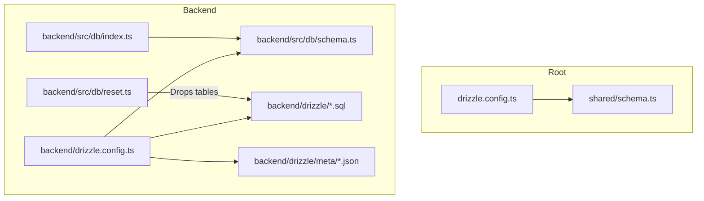
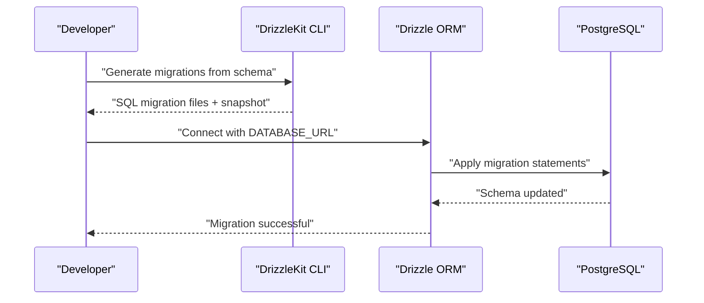
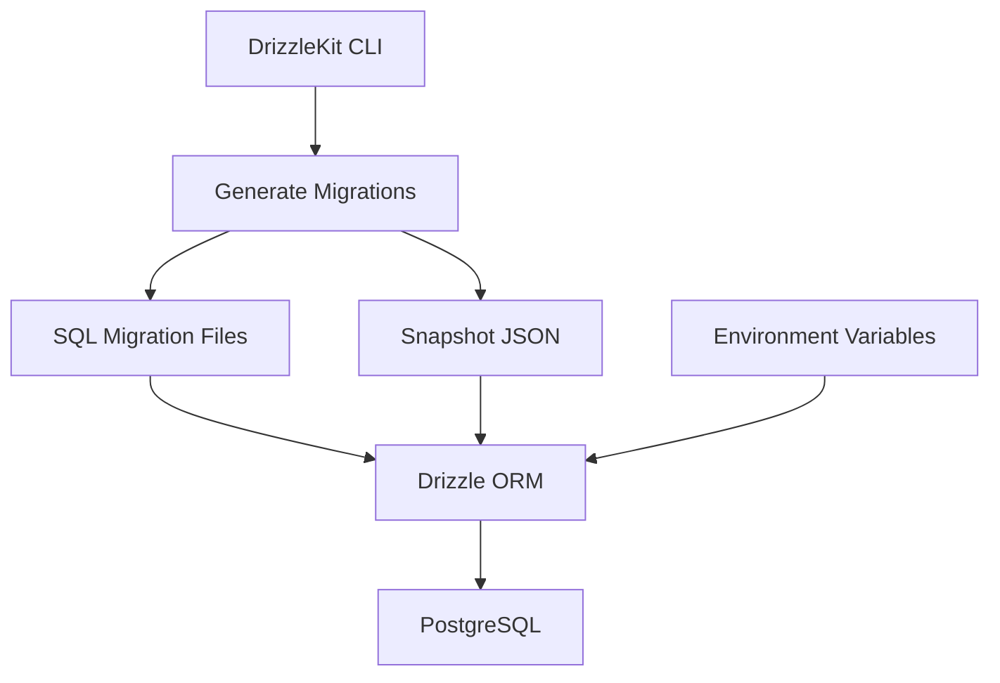

# Migration System

<cite>
**Referenced Files in This Document**
- [drizzle.config.ts](file://drizzle.config.ts)
- [backend/drizzle.config.ts](file://backend/drizzle.config.ts)
- [backend/src/db/schema.ts](file://backend/src/db/schema.ts)
- [backend/src/db/index.ts](file://backend/src/db/index.ts)
- [backend/src/db/reset.ts](file://backend/src/db/reset.ts)
- [backend/package.json](file://backend/package.json)
- [backend/README.md](file://backend/README.md)
- [backend/drizzle/meta/0000_snapshot.json](file://backend/drizzle/meta/0000_snapshot.json)
- [backend/drizzle/meta/_journal.json](file://backend/drizzle/meta/_journal.json)
- [backend/drizzle/0000_messy_fallen_one.sql](file://backend/drizzle/0000_messy_fallen_one.sql)
- [backend/create-notifications-table.sql](file://backend/create-notifications-table.sql)
- [backend/add_loan_columns.sql](file://backend/add_loan_columns.sql)
- [backend/migrate.sql](file://backend/migrate.sql)
- [backend/admin-schema-update.ts](file://backend/admin-schema-update.ts)
- [backend/update-schema.sql](file://backend/update-schema.sql)
- [backend/reset-db.sql](file://backend/reset-db.sql)
</cite>

## Table of Contents
1. [Introduction](#introduction)
2. [Project Structure](#project-structure)
3. [Core Components](#core-components)
4. [Architecture Overview](#architecture-overview)
5. [Detailed Component Analysis](#detailed-component-analysis)
6. [Dependency Analysis](#dependency-analysis)
7. [Performance Considerations](#performance-considerations)
8. [Troubleshooting Guide](#troubleshooting-guide)
9. [Conclusion](#conclusion)
10. [Appendices](#appendices)

## Introduction
This document explains the database migration system and schema evolution for the Phoenix Loan application. It covers how schema changes are modeled, generated, applied, and tracked using DrizzleKit and Drizzle ORM. It also documents snapshot management, migration file structure, naming conventions, and best practices for maintaining migration history. Practical examples demonstrate adding new tables, modifying existing schemas, and handling data transformations during migrations. Finally, it provides troubleshooting guidance for failed migrations and recovery procedures.

## Project Structure
The migration system spans two Drizzle configurations:
- A shared configuration for the monorepo-wide schema located at the repository root.
- A backend-specific configuration that targets the backend’s schema and migration output.

Key directories and files:
- Root Drizzle configuration and shared schema
- Backend Drizzle configuration, migrations, snapshots, and SQL helpers
- Database connection and schema definition for runtime usage

**Diagram sources**
- [drizzle.config.ts:1-15](file://drizzle.config.ts#L1-L15)
- [backend/drizzle.config.ts:1-14](file://backend/drizzle.config.ts#L1-L14)
- [backend/src/db/schema.ts:1-146](file://backend/src/db/schema.ts#L1-L146)
- [backend/drizzle/0000_messy_fallen_one.sql:1-93](file://backend/drizzle/0000_messy_fallen_one.sql#L1-L93)
- [backend/drizzle/meta/0000_snapshot.json:1-617](file://backend/drizzle/meta/0000_snapshot.json#L1-L617)
- [backend/src/db/index.ts:1-44](file://backend/src/db/index.ts#L1-L44)
- [backend/src/db/reset.ts:1-26](file://backend/src/db/reset.ts#L1-L26)

**Section sources**
- [drizzle.config.ts:1-15](file://drizzle.config.ts#L1-L15)
- [backend/drizzle.config.ts:1-14](file://backend/drizzle.config.ts#L1-L14)
- [backend/src/db/schema.ts:1-146](file://backend/src/db/schema.ts#L1-L146)
- [backend/drizzle/0000_messy_fallen_one.sql:1-93](file://backend/drizzle/0000_messy_fallen_one.sql#L1-L93)
- [backend/drizzle/meta/0000_snapshot.json:1-617](file://backend/drizzle/meta/0000_snapshot.json#L1-L617)
- [backend/src/db/index.ts:1-44](file://backend/src/db/index.ts#L1-L44)
- [backend/src/db/reset.ts:1-26](file://backend/src/db/reset.ts#L1-L26)

## Core Components
- Drizzle configuration
  - Root configuration defines output path, schema location, dialect, and credentials for the shared schema.
  - Backend configuration defines output path, schema location, dialect, and credentials for backend migrations.
- Schema definition
  - Runtime schema for ORM usage and relations.
- Migration artifacts
  - SQL migration files and snapshot metadata for version control and drift detection.
- Helper scripts and SQL files
  - Utility scripts for resetting the database and SQL helpers for creating tables and altering columns.

**Section sources**
- [drizzle.config.ts:1-15](file://drizzle.config.ts#L1-L15)
- [backend/drizzle.config.ts:1-14](file://backend/drizzle.config.ts#L1-L14)
- [backend/src/db/schema.ts:1-146](file://backend/src/db/schema.ts#L1-L146)
- [backend/drizzle/meta/0000_snapshot.json:1-617](file://backend/drizzle/meta/0000_snapshot.json#L1-L617)
- [backend/drizzle/meta/_journal.json:1-13](file://backend/drizzle/meta/_journal.json#L1-L13)
- [backend/drizzle/0000_messy_fallen_one.sql:1-93](file://backend/drizzle/0000_messy_fallen_one.sql#L1-L93)
- [backend/src/db/reset.ts:1-26](file://backend/src/db/reset.ts#L1-L26)

## Architecture Overview
The migration workflow integrates DrizzleKit for generating migrations from the schema and Drizzle ORM for connecting to the database at runtime. The system tracks schema state via snapshots and maintains a journal of applied migrations.

**Diagram sources**
- [backend/drizzle.config.ts:1-14](file://backend/drizzle.config.ts#L1-L14)
- [backend/src/db/index.ts:1-44](file://backend/src/db/index.ts#L1-L44)
- [backend/drizzle/meta/_journal.json:1-13](file://backend/drizzle/meta/_journal.json#L1-L13)

## Detailed Component Analysis

### Drizzle Configuration
- Root configuration
  - Defines schema path, output directory, dialect, and database credentials for the shared schema.
- Backend configuration
  - Defines schema path, output directory, dialect, and database credentials for backend migrations.

Best practices:
- Keep credentials in environment variables.
- Align schema paths with the actual TypeScript schema definition.
- Use consistent dialect selection.

**Section sources**
- [drizzle.config.ts:1-15](file://drizzle.config.ts#L1-L15)
- [backend/drizzle.config.ts:1-14](file://backend/drizzle.config.ts#L1-L14)

### Schema Definition and Relations
The schema defines core tables and their relationships. It includes:
- Users, Loans, Loan Applications, Repayments, Notifications, and Settings tables.
- Relations mapping foreign keys and one-to-many/one-to-one associations.
- Type exports for insert/select operations.

Practical implications:
- Adding new tables requires updating the schema and relations.
- Modifying existing tables requires careful handling of constraints and defaults.

**Section sources**
- [backend/src/db/schema.ts:1-146](file://backend/src/db/schema.ts#L1-L146)

### Migration Artifacts and Snapshot Management
- Initial migration file
  - Contains DDL for all core tables and foreign key constraints.
- Snapshot metadata
  - Captures the current schema state for drift detection and comparison.
- Journal
  - Tracks applied migrations and timestamps.

Workflow:
- DrizzleKit generates SQL migrations and updates the snapshot.
- The journal records applied migrations to prevent reapplication.

**Section sources**
- [backend/drizzle/0000_messy_fallen_one.sql:1-93](file://backend/drizzle/0000_messy_fallen_one.sql#L1-L93)
- [backend/drizzle/meta/0000_snapshot.json:1-617](file://backend/drizzle/meta/0000_snapshot.json#L1-L617)
- [backend/drizzle/meta/_journal.json:1-13](file://backend/drizzle/meta/_journal.json#L1-L13)

### Applying Migrations Using DrizzleKit
- Generate migrations from schema
  - Use the DrizzleKit script to produce SQL migration files and update snapshots.
- Push schema to database
  - Use the DrizzleKit push command to apply migrations directly to the database.

Recommended flow:
- After editing the schema, generate migrations locally.
- Review the generated SQL.
- Apply migrations to staging or production with caution.

**Section sources**
- [backend/package.json:7-14](file://backend/package.json#L7-L14)
- [backend/README.md:150-176](file://backend/README.md#L150-L176)

### Runtime Database Connection and Schema Usage
- The backend connects to the database using Drizzle ORM with Neon driver.
- The connection reads environment variables and applies the schema to the ORM.

Operational notes:
- Ensure DATABASE_URL is set.
- The connection logs success after establishing a connection.

**Section sources**
- [backend/src/db/index.ts:1-44](file://backend/src/db/index.ts#L1-L44)

### Resetting the Database
- A dedicated script drops all tables in dependency-aware order.
- Useful for cleaning state during development or recovery.

**Section sources**
- [backend/src/db/reset.ts:1-26](file://backend/src/db/reset.ts#L1-L26)
- [backend/reset-db.sql:1-9](file://backend/reset-db.sql#L1-L9)

### SQL Helpers for Manual Changes
- Creating a notifications table with indexes and foreign keys.
- Altering the loans table to add disbursement and repayment tracking columns.
- Updating schema with additional user and loan columns.
- General-purpose migration SQL for targeted changes.

Guidelines:
- Use IF NOT EXISTS to avoid breaking idempotent runs.
- Add indexes for frequently queried columns.
- Maintain referential integrity with foreign keys.

**Section sources**
- [backend/create-notifications-table.sql:1-30](file://backend/create-notifications-table.sql#L1-L30)
- [backend/add_loan_columns.sql:1-12](file://backend/add_loan_columns.sql#L1-L12)
- [backend/migrate.sql:1-12](file://backend/migrate.sql#L1-L12)
- [backend/update-schema.sql:1-32](file://backend/update-schema.sql#L1-L32)

### Programmatic Schema Updates
- An example script demonstrates adding a column and creating a table programmatically using Drizzle ORM.
- Useful for one-off or conditional schema changes.

**Section sources**
- [backend/admin-schema-update.ts:1-30](file://backend/admin-schema-update.ts#L1-L30)

### Migration File Structure and Naming Conventions
- SQL migration files are named with zero-padded numeric prefixes followed by a short descriptive tag.
- The initial migration includes all DDL statements and foreign key constraints.
- Snapshot JSON captures the schema state for drift detection.
- Journal JSON tracks applied migrations.

Recommendations:
- Keep migration names descriptive and consistent.
- Group related changes in a single migration.
- Preserve ordering and avoid renaming existing migration files.

**Section sources**
- [backend/drizzle/0000_messy_fallen_one.sql:1-93](file://backend/drizzle/0000_messy_fallen_one.sql#L1-L93)
- [backend/drizzle/meta/0000_snapshot.json:1-617](file://backend/drizzle/meta/0000_snapshot.json#L1-L617)
- [backend/drizzle/meta/_journal.json:1-13](file://backend/drizzle/meta/_journal.json#L1-L13)

### Common Migration Scenarios

#### Adding a New Table
- Steps:
  - Define the table in the schema.
  - Generate and apply migrations.
  - Add indexes and constraints as needed.
- Example reference:
  - Creating the notifications table with indexes and foreign keys.

**Section sources**
- [backend/create-notifications-table.sql:1-30](file://backend/create-notifications-table.sql#L1-L30)
- [backend/src/db/schema.ts:79-88](file://backend/src/db/schema.ts#L79-L88)

#### Modifying Existing Schemas
- Steps:
  - Update the schema definition.
  - Generate and review migrations.
  - Apply to staging; monitor for constraint violations.
- Example references:
  - Adding disbursement and repayment columns to the loans table.
  - Extending user and loan columns.

**Section sources**
- [backend/add_loan_columns.sql:1-12](file://backend/add_loan_columns.sql#L1-L12)
- [backend/migrate.sql:1-12](file://backend/migrate.sql#L1-L12)
- [backend/update-schema.sql:1-32](file://backend/update-schema.sql#L1-L32)
- [backend/src/db/schema.ts:23-46](file://backend/src/db/schema.ts#L23-L46)

#### Establishing New Relationships
- Steps:
  - Add foreign key columns to referencing tables.
  - Define foreign key constraints.
  - Generate and apply migrations.
- Example reference:
  - Foreign key constraints in the initial migration.

**Section sources**
- [backend/drizzle/0000_messy_fallen_one.sql:88-93](file://backend/drizzle/0000_messy_fallen_one.sql#L88-L93)

#### Handling Data Transformations During Migrations
- Steps:
  - Use programmatic scripts for conditional updates.
  - Apply schema changes alongside data updates.
  - Validate data integrity post-migration.
- Example reference:
  - A script that conditionally adds columns and creates tables.

**Section sources**
- [backend/admin-schema-update.ts:1-30](file://backend/admin-schema-update.ts#L1-L30)

### Rollback Strategy
- DrizzleKit does not provide automatic rollback.
- Recommended approaches:
  - Use reversible migrations where possible.
  - Maintain backups before applying destructive changes.
  - Use the reset script to drop tables and re-run migrations in controlled environments.

**Section sources**
- [backend/src/db/reset.ts:1-26](file://backend/src/db/reset.ts#L1-L26)
- [backend/reset-db.sql:1-9](file://backend/reset-db.sql#L1-L9)

## Dependency Analysis
The migration system depends on:
- DrizzleKit for generating migrations from the schema.
- Drizzle ORM for connecting to the database and applying migrations.
- PostgreSQL for storing schema state and enforcing constraints.
- Environment variables for database credentials.

**Diagram sources**
- [backend/drizzle.config.ts:1-14](file://backend/drizzle.config.ts#L1-L14)
- [backend/src/db/index.ts:1-44](file://backend/src/db/index.ts#L1-L44)
- [backend/drizzle/meta/0000_snapshot.json:1-617](file://backend/drizzle/meta/0000_snapshot.json#L1-L617)

**Section sources**
- [backend/drizzle.config.ts:1-14](file://backend/drizzle.config.ts#L1-L14)
- [backend/src/db/index.ts:1-44](file://backend/src/db/index.ts#L1-L44)
- [backend/drizzle/meta/0000_snapshot.json:1-617](file://backend/drizzle/meta/0000_snapshot.json#L1-L617)

## Performance Considerations
- Keep migrations small and focused to reduce downtime.
- Add indexes for frequently filtered or joined columns.
- Avoid long-running transactions in migrations.
- Test migrations on a copy of production data before applying to production.

## Troubleshooting Guide
Common issues and resolutions:
- Database connection errors
  - Verify DATABASE_URL and network connectivity.
  - Ensure the database is active and IP is whitelisted.
- Port conflicts
  - Change the port in environment variables or stop the conflicting process.
- CORS errors
  - Configure FRONTEND_URL and update CORS settings.
- Migration failures
  - Review the generated SQL and journal entries.
  - Use the reset script to clean state and re-apply migrations.
  - For programmatic changes, wrap operations in error handling and log outcomes.

**Section sources**
- [backend/README.md:158-176](file://backend/README.md#L158-L176)
- [backend/src/db/reset.ts:1-26](file://backend/src/db/reset.ts#L1-L26)

## Conclusion
The Phoenix Loan application employs a robust migration system leveraging DrizzleKit and Drizzle ORM. By modeling schema changes in TypeScript, generating SQL migrations, and tracking schema state via snapshots and journals, the system ensures predictable and auditable schema evolution. Adhering to naming conventions, keeping migrations idempotent, and validating changes in staging are essential practices for reliable deployments.

## Appendices

### Migration Workflow Checklist
- Update schema definition.
- Generate migrations.
- Review SQL and snapshot changes.
- Apply to staging.
- Monitor for errors and data integrity.
- Apply to production with backups.

### Best Practices Summary
- Use descriptive migration names.
- Keep migrations reversible where feasible.
- Add indexes proactively.
- Validate foreign keys and constraints.
- Maintain environment variable hygiene.
- Use programmatic scripts for conditional updates.