# Query Patterns and Operations

<cite>
**Referenced Files in This Document**
- [schema.ts](file://backend/src/db/schema.ts)
- [index.ts](file://backend/src/db/index.ts)
- [auth.ts](file://backend/src/middleware/auth.ts)
- [index.ts](file://backend/src/index.ts)
- [users.ts](file://backend/src/routes/users.ts)
- [applications.ts](file://backend/src/routes/applications.ts)
- [loans.ts](file://backend/src/routes/loans.ts)
- [admin.ts](file://backend/src/routes/admin.ts)
- [notifications.ts](file://backend/src/routes/notifications.ts)
- [auth.ts](file://backend/src/routes/auth.ts)
- [0000_messy_fallen_one.sql](file://backend/drizzle/0000_messy_fallen_one.sql)
</cite>

## Table of Contents
1. [Introduction](#introduction)
2. [Project Structure](#project-structure)
3. [Core Components](#core-components)
4. [Architecture Overview](#architecture-overview)
5. [Detailed Component Analysis](#detailed-component-analysis)
6. [Dependency Analysis](#dependency-analysis)
7. [Performance Considerations](#performance-considerations)
8. [Troubleshooting Guide](#troubleshooting-guide)
9. [Conclusion](#conclusion)
10. [Appendices](#appendices)

## Introduction
This document explains database query patterns and operations used in the Phoenix loan management system. It covers CRUD operations, complex joins via relational queries, aggregate analytics, authenticated user operations, loan application workflows, administrative reporting, transactions, error handling, pagination, filtering, and search patterns. The backend uses Drizzle ORM with PostgreSQL and exposes REST-like endpoints via Hono.

## Project Structure
The backend is organized into:
- Database schema and connection: schema definition, type-safe relations, and database client initialization
- Middleware: authentication and authorization guards
- Routes: user, application, loan, notification, and admin endpoints
- Entry point: server bootstrap and route registration

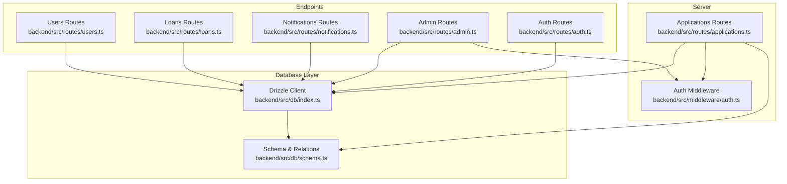

**Diagram sources**
- [index.ts:1-76](file://backend/src/index.ts#L1-L76)
- [auth.ts:1-48](file://backend/src/middleware/auth.ts#L1-L48)
- [index.ts:1-44](file://backend/src/db/index.ts#L1-L44)
- [schema.ts:1-146](file://backend/src/db/schema.ts#L1-L146)
- [users.ts:1-197](file://backend/src/routes/users.ts#L1-L197)
- [loans.ts:1-320](file://backend/src/routes/loans.ts#L1-L320)
- [applications.ts:1-168](file://backend/src/routes/applications.ts#L1-L168)
- [notifications.ts:1-106](file://backend/src/routes/notifications.ts#L1-L106)
- [admin.ts:1-171](file://backend/src/routes/admin.ts#L1-L171)
- [auth.ts:1-146](file://backend/src/routes/auth.ts#L1-L146)

**Section sources**
- [index.ts:1-76](file://backend/src/index.ts#L1-L76)
- [index.ts:1-44](file://backend/src/db/index.ts#L1-L44)
- [schema.ts:1-146](file://backend/src/db/schema.ts#L1-L146)

## Core Components
- Database schema: defines tables and relations among users, loans, applications, repayments, notifications, and settings
- Drizzle client: connects to Postgres using environment configuration
- Authentication middleware: validates JWT and attaches user context
- Route handlers: implement CRUD, joins, aggregations, and administrative operations

Key capabilities:
- Relational queries with nested selections (with relations)
- Aggregations and counts for dashboards
- Pagination via limit/offset
- Filtering by status and foreign keys
- Administrative reporting and settings management

**Section sources**
- [schema.ts:1-146](file://backend/src/db/schema.ts#L1-L146)
- [index.ts:1-44](file://backend/src/db/index.ts#L1-L44)
- [auth.ts:1-48](file://backend/src/middleware/auth.ts#L1-L48)

## Architecture Overview
The system follows a layered architecture:
- Presentation: Hono routes expose endpoints
- Application: route handlers orchestrate queries and responses
- Persistence: Drizzle ORM maps to PostgreSQL tables
- Security: JWT-based auth middleware enforces access control

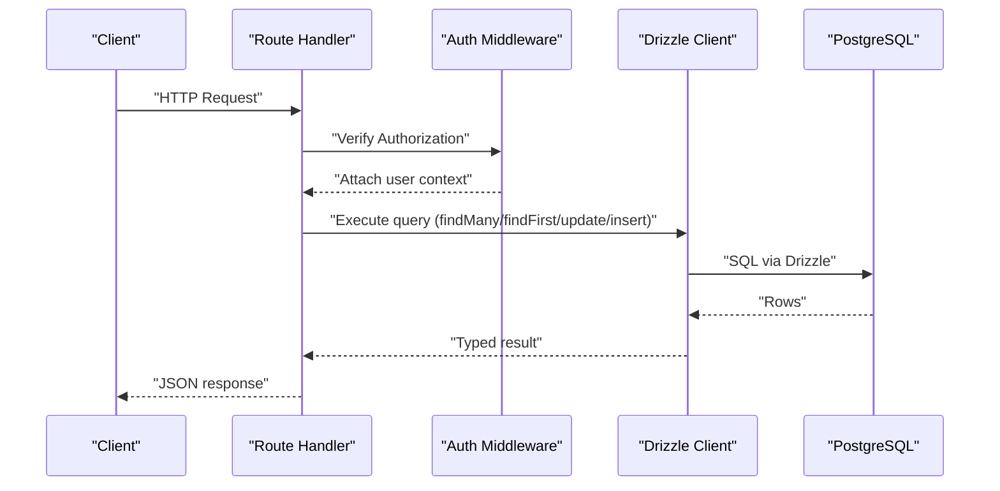

**Diagram sources**
- [index.ts:54-61](file://backend/src/index.ts#L54-L61)
- [auth.ts:10-36](file://backend/src/middleware/auth.ts#L10-L36)
- [users.ts:41-70](file://backend/src/routes/users.ts#L41-L70)
- [index.ts:40-43](file://backend/src/db/index.ts#L40-L43)

## Detailed Component Analysis

### Database Schema and Relations
The schema defines five primary tables and their relationships:
- users: personal and KYC fields, roles, blacklist flag
- loans: financial details, status lifecycle, disbursement/repayment/completion fields
- loan_applications: application records linked to users and optional loans
- repayments: scheduled and paid installments per loan
- notifications: user-specific messages
- settings: key-value configuration stored as JSON

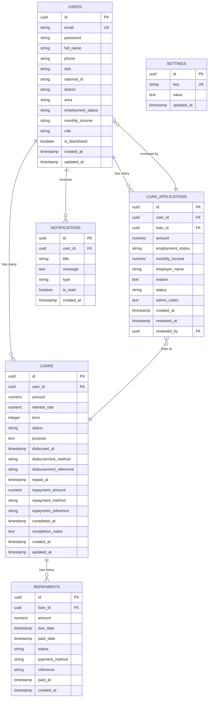

**Diagram sources**
- [schema.ts:4-146](file://backend/src/db/schema.ts#L4-L146)
- [0000_messy_fallen_one.sql:1-93](file://backend/drizzle/0000_messy_fallen_one.sql#L1-L93)

**Section sources**
- [schema.ts:1-146](file://backend/src/db/schema.ts#L1-L146)
- [0000_messy_fallen_one.sql:1-93](file://backend/drizzle/0000_messy_fallen_one.sql#L1-L93)

### Authentication and Authorization
- JWT verification extracts user identity and role
- Admin-only endpoints enforce role checks
- Route handlers rely on user context for ownership and permissions

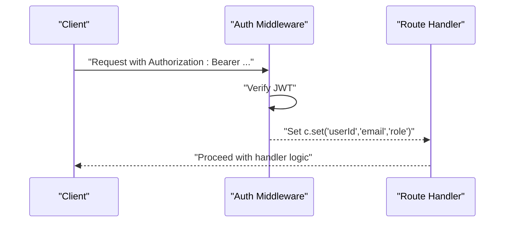

**Diagram sources**
- [auth.ts:10-47](file://backend/src/middleware/auth.ts#L10-L47)
- [users.ts:42-70](file://backend/src/routes/users.ts#L42-L70)
- [loans.ts:115-138](file://backend/src/routes/loans.ts#L115-L138)

**Section sources**
- [auth.ts:1-48](file://backend/src/middleware/auth.ts#L1-L48)

### Users: CRUD and Related Queries
Common operations:
- List all users with related loans and applications
- Retrieve profile with nested relations
- Update profile fields
- Toggle blacklist status
- Admin update user password

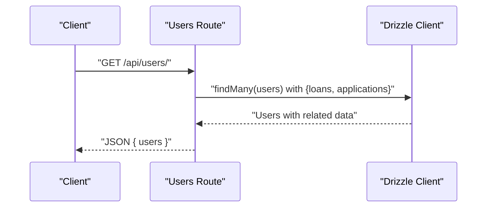

**Diagram sources**
- [users.ts:8-39](file://backend/src/routes/users.ts#L8-L39)
- [schema.ts:98-126](file://backend/src/db/schema.ts#L98-L126)

**Section sources**
- [users.ts:1-197](file://backend/src/routes/users.ts#L1-L197)
- [schema.ts:98-126](file://backend/src/db/schema.ts#L98-L126)

### Loan Applications: Status Management and Joins
Operations:
- List all applications with user and reviewer details
- Fetch user’s own applications
- Create new application
- Admin review with status transitions and notes
- Join with loan records when available

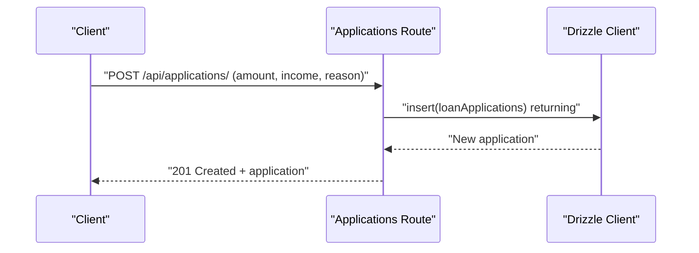

**Diagram sources**
- [applications.ts:110-138](file://backend/src/routes/applications.ts#L110-L138)
- [schema.ts:113-126](file://backend/src/db/schema.ts#L113-L126)

**Section sources**
- [applications.ts:1-168](file://backend/src/routes/applications.ts#L1-L168)
- [schema.ts:48-77](file://backend/src/db/schema.ts#L48-L77)

### Loans: Lifecycle and Disbursement
Operations:
- List all loans with user details
- Retrieve user’s loans with repayments
- Create loan with initial status
- Admin updates: status, disburse, mark repaid, complete
- Dynamic column support for extended fields

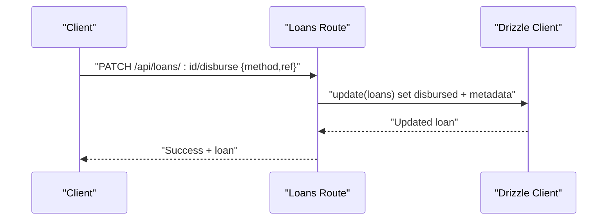

**Diagram sources**
- [loans.ts:224-250](file://backend/src/routes/loans.ts#L224-L250)
- [schema.ts:23-46](file://backend/src/db/schema.ts#L23-L46)

**Section sources**
- [loans.ts:1-320](file://backend/src/routes/loans.ts#L1-L320)
- [schema.ts:23-46](file://backend/src/db/schema.ts#L23-L46)

### Notifications: Ownership and Read Tracking
Operations:
- List user notifications with unread count
- Mark individual or all notifications as read
- Create and delete read notifications

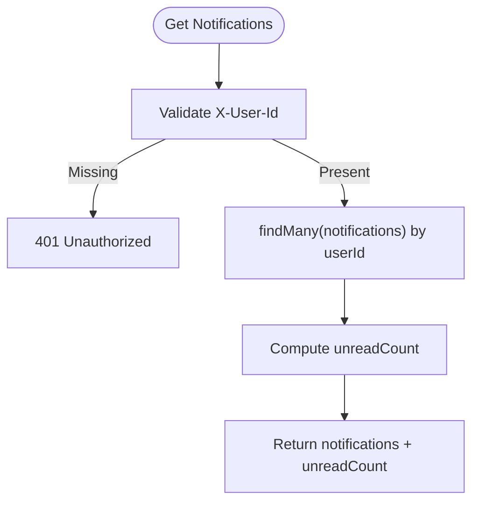

**Diagram sources**
- [notifications.ts:8-33](file://backend/src/routes/notifications.ts#L8-L33)

**Section sources**
- [notifications.ts:1-106](file://backend/src/routes/notifications.ts#L1-L106)

### Admin: Reporting, Pagination, and Settings
Operations:
- Paginated user listing with computed fields
- Paginated loan/application listing with user joins
- Dashboard statistics via aggregations
- Settings CRUD with JSON serialization

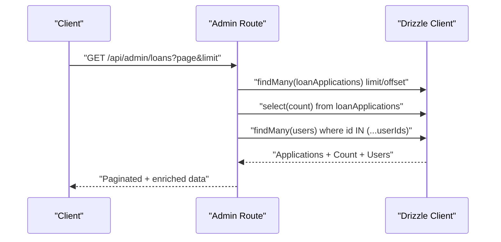

**Diagram sources**
- [admin.ts:49-94](file://backend/src/routes/admin.ts#L49-L94)
- [schema.ts:98-126](file://backend/src/db/schema.ts#L98-L126)

**Section sources**
- [admin.ts:1-171](file://backend/src/routes/admin.ts#L1-L171)

### Authentication: Registration and Login
Operations:
- Register with validation and hashing
- Login with credential verification and token issuance

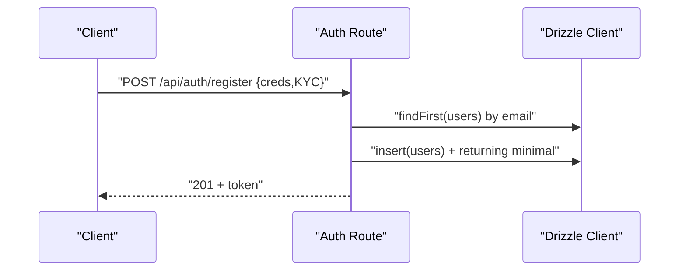

**Diagram sources**
- [auth.ts:32-93](file://backend/src/routes/auth.ts#L32-L93)
- [schema.ts:4-21](file://backend/src/db/schema.ts#L4-L21)

**Section sources**
- [auth.ts:1-146](file://backend/src/routes/auth.ts#L1-L146)

## Dependency Analysis
- Routes depend on the Drizzle client and schema types
- Admin routes depend on relations for joins and aggregations
- Authentication middleware is applied to protected endpoints
- Database connection reads environment variables and initializes Drizzle

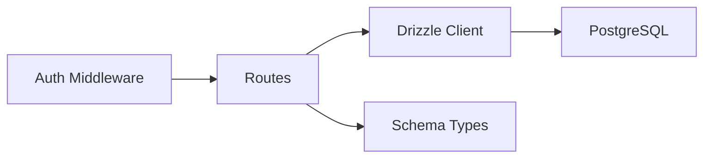

**Diagram sources**
- [index.ts:54-61](file://backend/src/index.ts#L54-L61)
- [auth.ts:10-36](file://backend/src/middleware/auth.ts#L10-L36)
- [index.ts:1-44](file://backend/src/db/index.ts#L1-L44)

**Section sources**
- [index.ts:1-76](file://backend/src/index.ts#L1-L76)
- [auth.ts:1-48](file://backend/src/middleware/auth.ts#L1-L48)
- [index.ts:1-44](file://backend/src/db/index.ts#L1-L44)

## Performance Considerations
- Prefer relational queries with selective column projection to reduce payload sizes
- Use pagination (limit/offset) for large lists; cap page size to prevent overload
- Aggregate queries for dashboards minimize round-trips
- Indexes implied by unique constraints (e.g., users.email) improve lookup performance
- Batch operations (e.g., settings updates) consolidate writes

[No sources needed since this section provides general guidance]

## Troubleshooting Guide
Common issues and resolutions:
- Unauthorized access: verify Authorization header and JWT validity
- Missing user context: ensure middleware runs before handlers
- Database connectivity: confirm DATABASE_URL and .env presence
- Internal errors: inspect server logs for route-level error handlers

Operational checks:
- Health endpoint for service status
- CORS configuration for cross-origin requests
- Environment variable loading for database and secrets

**Section sources**
- [auth.ts:10-36](file://backend/src/middleware/auth.ts#L10-L36)
- [index.ts:31-38](file://backend/src/db/index.ts#L31-L38)
- [index.ts:28-31](file://backend/src/index.ts#L28-L31)
- [index.ts:20-26](file://backend/src/index.ts#L20-L26)

## Conclusion
The Phoenix backend employs a clean separation of concerns with typed, relation-aware queries. It supports robust user-centric workflows, administrative reporting, and secure access control. Following the patterns documented here ensures consistent, maintainable, and performant database operations across the system.

[No sources needed since this section summarizes without analyzing specific files]

## Appendices

### Query Patterns Reference

- User data with related loan information
  - Use findMany with relations and column selection
  - Reference: [users.ts:8-39](file://backend/src/routes/users.ts#L8-L39)

- Filter applications by status
  - Use where clause on status field
  - Reference: [applications.ts:24-53](file://backend/src/routes/applications.ts#L24-L53)

- Admin dashboard reports
  - Aggregations and counts for totals and active/disbursed/completed
  - Reference: [admin.ts:96-125](file://backend/src/routes/admin.ts#L96-L125)

- Pagination strategies
  - Page and limit parameters with limit cap and offset calculation
  - Reference: [admin.ts:8-47](file://backend/src/routes/admin.ts#L8-L47), [admin.ts:49-94](file://backend/src/routes/admin.ts#L49-L94)

- Search and filtering patterns
  - Column projection and ordering by creation date
  - Reference: [users.ts](file://backend/src/routes/users.ts#L31), [loans.ts](file://backend/src/routes/loans.ts#L105), [applications.ts](file://backend/src/routes/applications.ts#L45)

- Transaction handling
  - Current handlers execute single statements; for multi-step operations (e.g., disburse + repayment record), wrap in a transaction block
  - Reference: [loans.ts:271-280](file://backend/src/routes/loans.ts#L271-L280)

- Error management
  - Centralized try/catch blocks return structured error responses
  - Reference: [users.ts:35-38](file://backend/src/routes/users.ts#L35-L38), [loans.ts:193-196](file://backend/src/routes/loans.ts#L193-L196)