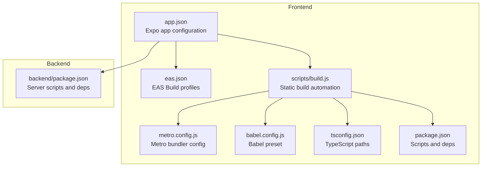
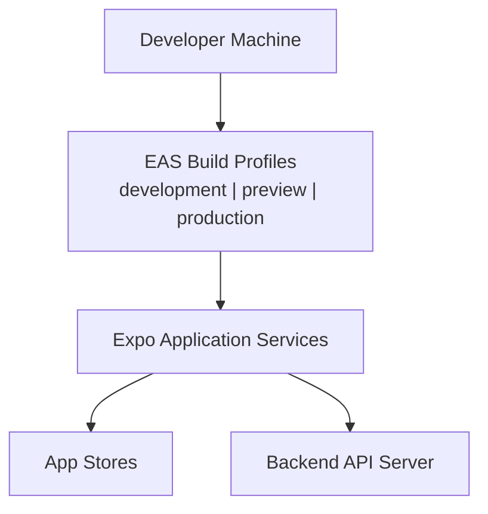
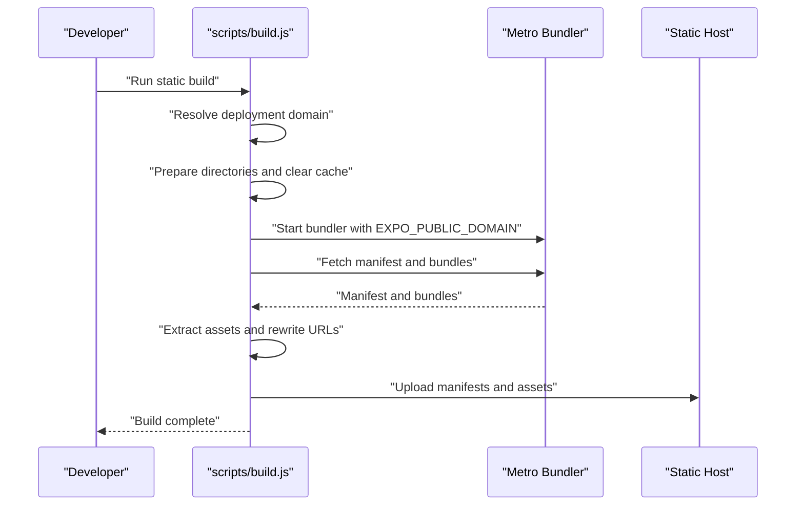
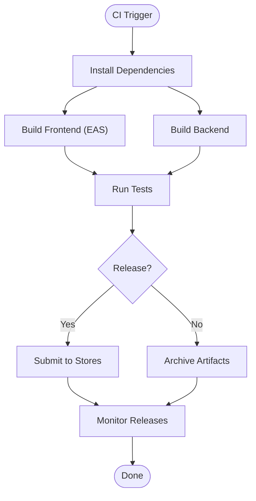
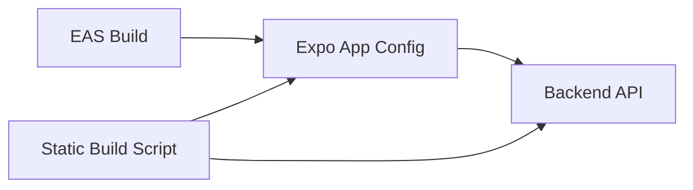

# Deployment Guide

<cite>
**Referenced Files in This Document**
- [eas.json](file://eas.json)
- [app.json](file://app.json)
- [package.json](file://package.json)
- [scripts/build.js](file://scripts/build.js)
- [metro.config.js](file://metro.config.js)
- [babel.config.js](file://babel.config.js)
- [tsconfig.json](file://tsconfig.json)
- [README.md](file://README.md)
- [README_BASIC.md](file://README_BASIC.md)
- [BACKEND_SETUP.md](file://BACKEND_SETUP.md)
- [PUSH_NOTIFICATIONS_SETUP.md](file://PUSH_NOTIFICATIONS_SETUP.md)
- [SECURITY_EMERGENCY.md](file://SECURITY_EMERGENCY.md)
- [backend/package.json](file://backend/package.json)
</cite>

## Table of Contents
1. [Introduction](#introduction)
2. [Project Structure](#project-structure)
3. [Core Components](#core-components)
4. [Architecture Overview](#architecture-overview)
5. [Detailed Component Analysis](#detailed-component-analysis)
6. [Dependency Analysis](#dependency-analysis)
7. [Performance Considerations](#performance-considerations)
8. [Troubleshooting Guide](#troubleshooting-guide)
9. [Conclusion](#conclusion)
10. [Appendices](#appendices)

## Introduction
This document provides a comprehensive deployment guide for the PHOENIX application. It covers the build process using EAS Build, environment configuration across development, staging, and production, and production deployment procedures. It also documents Expo Application Services integration, app store submission processes, CI/CD pipeline configuration, environment variable management, secrets handling, deployment automation, rollback procedures, monitoring setup, performance optimization, security hardening, and maintenance procedures. The guide is intended for both technical and non-technical readers and includes diagrams and practical examples mapped to actual repository files.

## Project Structure
The PHOENIX project is organized into a frontend Expo application and a backend Node.js API server. Key deployment-related files include configuration for EAS Build, Expo app metadata, build scripts, Metro bundler configuration, and backend setup documentation.

**Diagram sources**
- [app.json:1-77](file://app.json#L1-L77)
- [eas.json:1-22](file://eas.json#L1-L22)
- [scripts/build.js:1-564](file://scripts/build.js#L1-L564)
- [metro.config.js:1-18](file://metro.config.js#L1-L18)
- [babel.config.js:1-7](file://babel.config.js#L1-L7)
- [tsconfig.json:1-22](file://tsconfig.json#L1-L22)
- [package.json:1-84](file://package.json#L1-L84)
- [backend/package.json:1-46](file://backend/package.json#L1-L46)

**Section sources**
- [app.json:1-77](file://app.json#L1-L77)
- [eas.json:1-22](file://eas.json#L1-L22)
- [scripts/build.js:1-564](file://scripts/build.js#L1-L564)
- [metro.config.js:1-18](file://metro.config.js#L1-L18)
- [babel.config.js:1-7](file://babel.config.js#L1-L7)
- [tsconfig.json:1-22](file://tsconfig.json#L1-L22)
- [package.json:1-84](file://package.json#L1-L84)
- [backend/package.json:1-46](file://backend/package.json#L1-L46)

## Core Components
- EAS Build configuration defines build profiles for development, preview, and production, including distribution modes and auto-increment settings.
- Expo app configuration centralizes app metadata, plugins, and project identifiers used by EAS and Expo services.
- Static build automation script orchestrates Metro bundler startup, manifest and bundle downloads, asset extraction, URL rewriting, and manifest updates for static hosting.
- Backend server scripts define development, build, and production commands for the Node.js API.

Key deployment commands and flows are documented in the project’s README files and backend setup guide.

**Section sources**
- [eas.json:6-21](file://eas.json#L6-L21)
- [app.json:35-74](file://app.json#L35-L74)
- [scripts/build.js:499-555](file://scripts/build.js#L499-L555)
- [backend/package.json:7-14](file://backend/package.json#L7-L14)
- [README_BASIC.md:304-315](file://README_BASIC.md#L304-L315)

## Architecture Overview
The deployment architecture integrates the frontend Expo app with EAS Build and Expo Application Services, and connects to a backend API server. The static build script enables hosting the Expo client bundles and assets behind a CDN or static host.

**Diagram sources**
- [eas.json:6-21](file://eas.json#L6-L21)
- [app.json:63-74](file://app.json#L63-L74)
- [README_BASIC.md:304-315](file://README_BASIC.md#L304-L315)

## Detailed Component Analysis

### EAS Build Configuration
- Profiles:
  - development: internal distribution with development client enabled.
  - preview: internal distribution for pre-release testing.
  - production: auto-increment enabled for versioning.
- CLI settings include remote app version source for centralized control.

Operational notes:
- Use the development profile for internal testing and QA.
- Use the preview profile for external pre-release demos.
- Use the production profile for release builds.

**Section sources**
- [eas.json:2-5](file://eas.json#L2-L5)
- [eas.json:6-21](file://eas.json#L6-L21)

### Expo App Configuration
- App metadata: name, slug, version, orientation, scheme, and splash configuration.
- Platform identifiers: iOS bundle identifier and Android package name.
- Plugins:
  - expo-router with origin configuration.
  - expo-font with custom fonts.
  - expo-web-browser.
  - expo-notifications with channel defaults, icon, color, and project ID.
- Experiments: typedRoutes and reactCompiler enabled.
- Extra: router origin and EAS project ID.

These settings are consumed by EAS and Expo services during builds and submissions.

**Section sources**
- [app.json:2-34](file://app.json#L2-L34)
- [app.json:35-61](file://app.json#L35-L61)
- [app.json:63-74](file://app.json#L63-L74)

### Static Build Automation Script
The script automates the creation of a static Expo deployment by:
- Determining the deployment domain via environment variables.
- Preparing build directories and clearing Metro caches.
- Starting the Metro bundler with the correct public domain.
- Downloading platform-specific bundles and manifests.
- Extracting assets from bundles and downloading them.
- Rewriting bundle URLs and updating manifests for the static host.
- Producing platform manifests and a landing page.

**Diagram sources**
- [scripts/build.js:499-555](file://scripts/build.js#L499-L555)
- [scripts/build.js:108-152](file://scripts/build.js#L108-L152)
- [scripts/build.js:244-284](file://scripts/build.js#L244-L284)
- [scripts/build.js:355-417](file://scripts/build.js#L355-L417)
- [scripts/build.js:419-497](file://scripts/build.js#L419-L497)

**Section sources**
- [scripts/build.js:41-59](file://scripts/build.js#L41-L59)
- [scripts/build.js:61-80](file://scripts/build.js#L61-L80)
- [scripts/build.js:82-95](file://scripts/build.js#L82-L95)
- [scripts/build.js:97-106](file://scripts/build.js#L97-L106)
- [scripts/build.js:108-152](file://scripts/build.js#L108-L152)
- [scripts/build.js:154-188](file://scripts/build.js#L154-L188)
- [scripts/build.js:190-212](file://scripts/build.js#L190-L212)
- [scripts/build.js:214-242](file://scripts/build.js#L214-L242)
- [scripts/build.js:244-284](file://scripts/build.js#L244-L284)
- [scripts/build.js:286-353](file://scripts/build.js#L286-L353)
- [scripts/build.js:355-417](file://scripts/build.js#L355-L417)
- [scripts/build.js:419-497](file://scripts/build.js#L419-L497)
- [scripts/build.js:499-555](file://scripts/build.js#L499-L555)

### Backend Server Scripts
The backend package.json defines scripts for development, building, and running the server, including database migration and generation tasks.

**Section sources**
- [backend/package.json:7-14](file://backend/package.json#L7-L14)

### Environment Configuration and Secrets
- Frontend environment variables:
  - EXPO_PUBLIC_* variables are embedded at build time.
  - EXPO_PUBLIC_DOMAIN drives the static build domain.
  - EXPO_PUBLIC_API_URL and EXPO_PUBLIC_ENVIRONMENT are referenced in documentation.
- Backend environment variables:
  - DATABASE_URL, JWT_SECRET, PORT, NODE_ENV, FRONTEND_URL are configured in backend/.env.
- Secrets handling:
  - Keep .env files out of version control.
  - Use CI/CD secrets management for EAS and backend deployments.
  - Rotate secrets regularly and audit access logs.

Examples of environment variable management and secrets handling are covered in the backend setup guide and emergency security guide.

**Section sources**
- [README_BASIC.md:214-219](file://README_BASIC.md#L214-L219)
- [BACKEND_SETUP.md:69-83](file://BACKEND_SETUP.md#L69-L83)
- [SECURITY_EMERGENCY.md:19-31](file://SECURITY_EMERGENCY.md#L19-L31)

### CI/CD Pipeline Configuration
Recommended CI/CD pipeline stages:
- Build:
  - Install dependencies for both frontend and backend.
  - Run EAS builds for preview and production profiles.
- Test:
  - Execute backend tests and linters.
  - Validate frontend bundle generation.
- Release:
  - Submit builds to app stores via EAS submit.
  - Tag releases and publish artifacts.
- Rollback:
  - Maintain previous build artifacts.
  - Use EAS rollback to previous successful builds.

[No sources needed since this diagram shows conceptual workflow, not actual code structure]

### Production Deployment Procedures
- Prepare:
  - Ensure backend is deployed and reachable.
  - Configure production EAS profile and distribution settings.
- Build:
  - Run production EAS build.
  - Validate build logs and artifacts.
- Submit:
  - Use EAS submit to publish to app stores.
- Post-deploy:
  - Monitor crash reports and analytics.
  - Verify API connectivity and push notifications.

**Section sources**
- [eas.json:14-16](file://eas.json#L14-L16)
- [README_BASIC.md:304-315](file://README_BASIC.md#L304-L315)

### Expo Application Services Integration
- Project ID:
  - Configure expo-notifications plugin with a valid project ID.
  - Replace placeholder with your actual Expo project ID.
- Push notifications:
  - Local notifications work in Expo Go.
  - Push notifications require a development build on a physical device.

**Section sources**
- [app.json:53-61](file://app.json#L53-L61)
- [PUSH_NOTIFICATIONS_SETUP.md:3-21](file://PUSH_NOTIFICATIONS_SETUP.md#L3-L21)

### App Store Submission Processes
- Configure EAS submit profile for production.
- Build and validate binaries.
- Submit to Apple App Store and Google Play Store.
- Monitor store approval status and resolve rejections promptly.

**Section sources**
- [eas.json:18-20](file://eas.json#L18-L20)
- [README_BASIC.md:312-314](file://README_BASIC.md#L312-L314)

### Environment Relationship: Development, Staging, Production
- Development:
  - Internal distribution with development client.
  - Used for QA and feature testing.
- Preview:
  - Internal distribution for pre-release demos.
- Production:
  - Auto-increment enabled for versioning.
  - Used for live releases.

**Section sources**
- [eas.json:7-16](file://eas.json#L7-L16)

### Rollback Procedures
- Maintain artifact retention for recent builds.
- Use EAS rollback to revert to the last known good build.
- Communicate rollback to stakeholders and monitor post-rollback metrics.

[No sources needed since this section provides general guidance]

### Monitoring Setup
- Crash reporting and analytics:
  - Integrate crash reporting SDKs.
  - Monitor app store reviews and ratings.
- Backend monitoring:
  - Track API response times and error rates.
  - Set up alerts for critical incidents.

[No sources needed since this section provides general guidance]

## Dependency Analysis
The deployment pipeline depends on:
- EAS Build for generating native binaries and distributing builds.
- Expo Application Services for notifications and project metadata.
- Backend API for data and business logic.
- Static build script for hosting Expo bundles and assets.

**Diagram sources**
- [eas.json:6-21](file://eas.json#L6-L21)
- [app.json:35-74](file://app.json#L35-L74)
- [scripts/build.js:499-555](file://scripts/build.js#L499-L555)
- [backend/package.json:7-14](file://backend/package.json#L7-L14)

**Section sources**
- [eas.json:6-21](file://eas.json#L6-L21)
- [app.json:35-74](file://app.json#L35-L74)
- [scripts/build.js:499-555](file://scripts/build.js#L499-L555)
- [backend/package.json:7-14](file://backend/package.json#L7-L14)

## Performance Considerations
- Bundle size and startup time:
  - Optimize images and assets.
  - Enable minification and tree shaking.
- Backend performance:
  - Use connection pooling and optimize queries.
  - Enable caching for frequently accessed data.
- Network:
  - Ensure low-latency connectivity to backend APIs.
  - Implement retry logic and timeouts.

[No sources needed since this section provides general guidance]

## Troubleshooting Guide
Common issues and resolutions:
- Metro timeout during static build:
  - Check network connectivity and port availability.
  - Increase timeouts or rebuild on a stable network.
- Missing deployment domain:
  - Set REPLIT_INTERNAL_APP_DOMAIN, REPLIT_DEV_DOMAIN, or EXPO_PUBLIC_DOMAIN.
- Asset download failures:
  - Verify asset URLs and hashes.
  - Re-run the build script after fixing asset paths.
- Backend connectivity:
  - Ensure backend is running and reachable.
  - Check CORS settings and environment variables.
- Security exposure:
  - Make repository private immediately.
  - Remove exposed credentials and rotate secrets.

**Section sources**
- [scripts/build.js:557-563](file://scripts/build.js#L557-L563)
- [scripts/build.js:41-59](file://scripts/build.js#L41-L59)
- [scripts/build.js:154-188](file://scripts/build.js#L154-L188)
- [BACKEND_SETUP.md:172-185](file://BACKEND_SETUP.md#L172-L185)
- [SECURITY_EMERGENCY.md:10-25](file://SECURITY_EMERGENCY.md#L10-L25)

## Conclusion
This guide outlines the PHOENIX deployment process using EAS Build, environment configuration, and production procedures. By following the outlined steps, leveraging the provided scripts and configurations, and implementing robust CI/CD, monitoring, and security practices, teams can reliably deploy and maintain the application across development, staging, and production environments.

[No sources needed since this section summarizes without analyzing specific files]

## Appendices

### Appendix A: Environment Variable Reference
- Frontend:
  - EXPO_PUBLIC_DOMAIN: Base URL for static build hosting.
  - EXPO_PUBLIC_API_URL: API base URL for frontend.
  - EXPO_PUBLIC_ENVIRONMENT: Environment label (development, staging, production).
- Backend:
  - DATABASE_URL: Neon database connection string.
  - JWT_SECRET: Secret for signing tokens.
  - PORT: Backend server port.
  - NODE_ENV: Node environment.
  - FRONTEND_URL: Allowed origin for CORS.

**Section sources**
- [README_BASIC.md:214-219](file://README_BASIC.md#L214-L219)
- [BACKEND_SETUP.md:69-83](file://BACKEND_SETUP.md#L69-L83)

### Appendix B: Build and Submit Commands
- Development build:
  - eas build --profile development --platform all
- Preview build:
  - eas build --profile preview
- Production build:
  - eas build --profile production
- Submit to stores:
  - eas submit --platform all

**Section sources**
- [README_BASIC.md:304-315](file://README_BASIC.md#L304-L315)