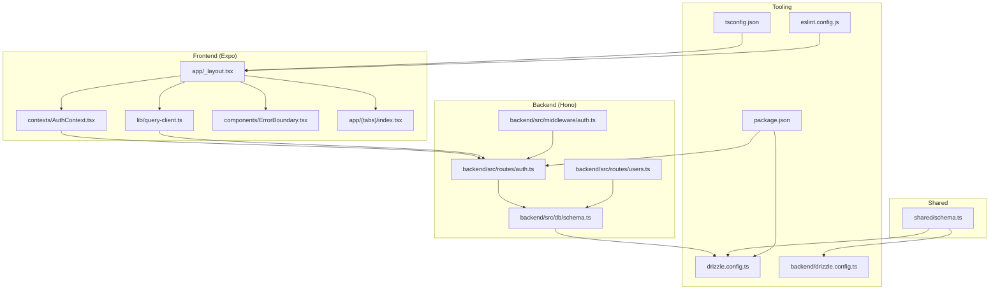
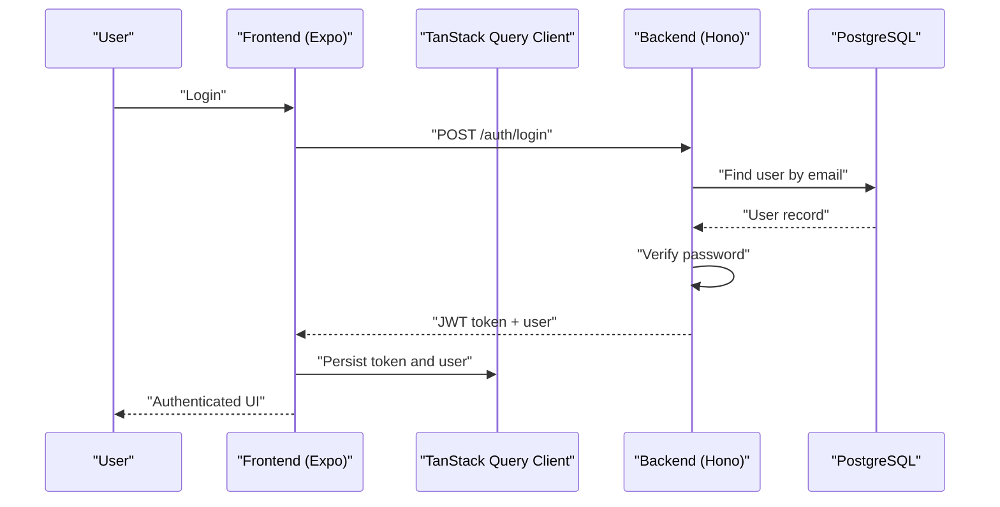
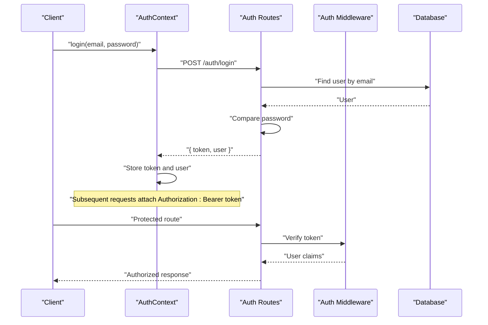
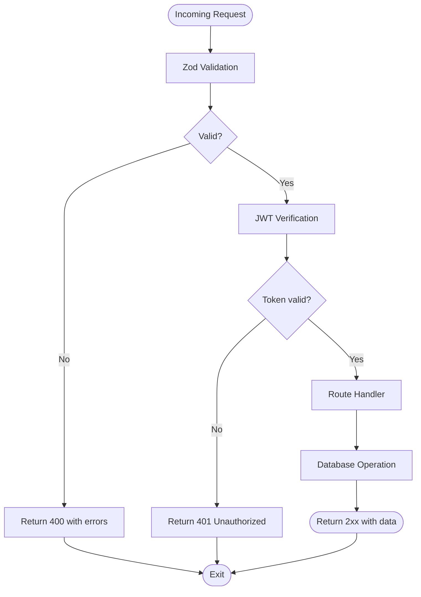
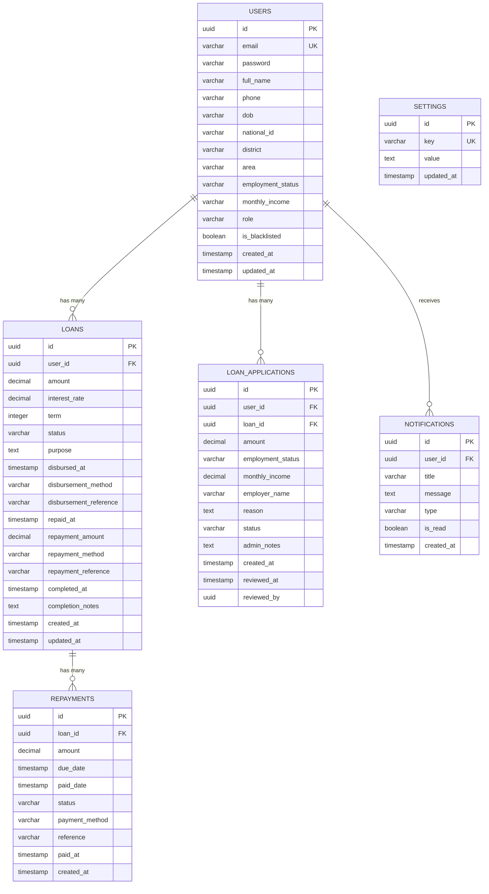
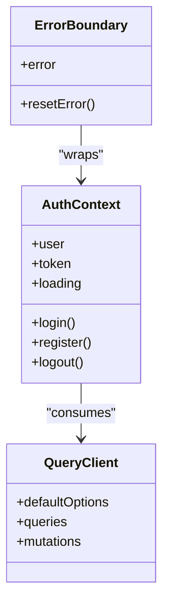
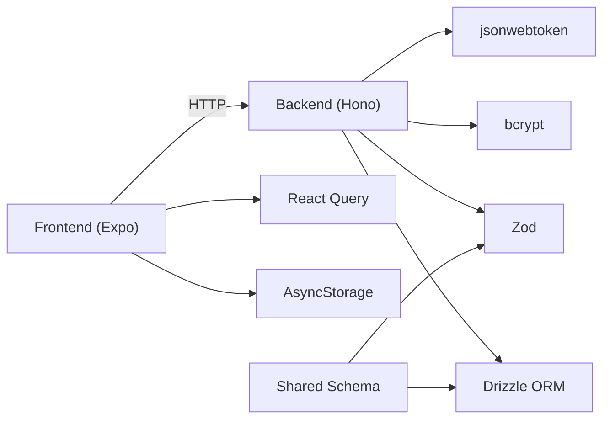

# Development Guidelines

<cite>
**Referenced Files in This Document**
- [eslint.config.js](file://eslint.config.js)
- [tsconfig.json](file://tsconfig.json)
- [package.json](file://package.json)
- [drizzle.config.ts](file://drizzle.config.ts)
- [backend/drizzle.config.ts](file://backend/drizzle.config.ts)
- [backend/src/db/schema.ts](file://backend/src/db/schema.ts)
- [shared/schema.ts](file://shared/schema.ts)
- [backend/src/middleware/auth.ts](file://backend/src/middleware/auth.ts)
- [contexts/AuthContext.tsx](file://contexts/AuthContext.tsx)
- [lib/query-client.ts](file://lib/query-client.ts)
- [app/_layout.tsx](file://app/_layout.tsx)
- [app/(tabs)/index.tsx](file://app/(tabs)/index.tsx)
- [backend/src/routes/auth.ts](file://backend/src/routes/auth.ts)
- [backend/src/routes/users.ts](file://backend/src/routes/users.ts)
- [components/ErrorBoundary.tsx](file://components/ErrorBoundary.tsx)
</cite>

## Table of Contents
1. [Introduction](#introduction)
2. [Project Structure](#project-structure)
3. [Core Components](#core-components)
4. [Architecture Overview](#architecture-overview)
5. [Detailed Component Analysis](#detailed-component-analysis)
6. [Dependency Analysis](#dependency-analysis)
7. [Performance Considerations](#performance-considerations)
8. [Security Best Practices](#security-best-practices)
9. [Accessibility Guidelines](#accessibility-guidelines)
10. [Configuration Management](#configuration-management)
11. [Build System Setup](#build-system-setup)
12. [Development Workflow and Branching](#development-workflow-and-branching)
13. [Code Review Process](#code-review-process)
14. [Troubleshooting Guide](#troubleshooting-guide)
15. [Conclusion](#conclusion)

## Introduction
This document defines comprehensive development guidelines and standards for the Phoenix project. It consolidates code formatting standards, TypeScript configuration, ESLint rules, component and API development patterns, database migration practices, architectural decisions, performance and security standards, accessibility guidelines, configuration management, build system setup, development workflow, branching strategy, code review processes, and troubleshooting guidance. The goal is to ensure consistent, maintainable, and secure development across the mobile front-end (React Native/Expo), backend (Hono/Drizzle), and shared data contracts.

## Project Structure
Phoenix follows a hybrid monorepo-like structure:
- Frontend (Expo/React Native) under the repository root, organized by feature-based navigation and shared contexts/services.
- Backend (Node.js/Hono) under the backend directory with Drizzle ORM for database schema and migrations.
- Shared data contracts under shared/schema.ts for cross-service validation.
- Tooling configurations for TypeScript, ESLint, Drizzle, and build scripts in the root package.json.

**Diagram sources**
- [app/_layout.tsx:1-83](file://app/_layout.tsx#L1-L83)
- [contexts/AuthContext.tsx:1-135](file://contexts/AuthContext.tsx#L1-L135)
- [lib/query-client.ts:1-81](file://lib/query-client.ts#L1-L81)
- [components/ErrorBoundary.tsx:1-55](file://components/ErrorBoundary.tsx#L1-L55)
- [app/(tabs)/index.tsx](file://app/(tabs)/index.tsx#L1-L506)
- [backend/src/routes/auth.ts:1-146](file://backend/src/routes/auth.ts#L1-L146)
- [backend/src/routes/users.ts:1-197](file://backend/src/routes/users.ts#L1-L197)
- [backend/src/middleware/auth.ts:1-48](file://backend/src/middleware/auth.ts#L1-L48)
- [backend/src/db/schema.ts:1-146](file://backend/src/db/schema.ts#L1-L146)
- [shared/schema.ts:1-21](file://shared/schema.ts#L1-L21)
- [tsconfig.json:1-22](file://tsconfig.json#L1-L22)
- [eslint.config.js:1-10](file://eslint.config.js#L1-L10)
- [drizzle.config.ts:1-15](file://drizzle.config.ts#L1-L15)
- [backend/drizzle.config.ts:1-14](file://backend/drizzle.config.ts#L1-L14)
- [package.json:1-84](file://package.json#L1-L84)

**Section sources**
- [app/_layout.tsx:1-83](file://app/_layout.tsx#L1-L83)
- [package.json:1-84](file://package.json#L1-L84)

## Core Components
- TypeScript configuration: Extends Expo’s base config, enables strict mode, and sets module resolution paths for clean imports.
- ESLint configuration: Uses the Expo flat config with project-wide ignores.
- Build scripts: Unified commands for Expo dev, server dev/build, and database operations.
- Drizzle configuration: Centralized for both shared and backend schemas with PostgreSQL dialect and credential sourcing from environment variables.

Key standards:
- Strict TypeScript compilation and path aliases improve developer productivity and reduce import errors.
- ESLint with Expo’s recommended rules ensures consistent formatting and safer defaults.
- Drizzle configurations enforce schema-driven database evolution and centralized credentials.

**Section sources**
- [tsconfig.json:1-22](file://tsconfig.json#L1-L22)
- [eslint.config.js:1-10](file://eslint.config.js#L1-L10)
- [package.json:5-21](file://package.json#L5-L21)
- [drizzle.config.ts:1-15](file://drizzle.config.ts#L1-L15)
- [backend/drizzle.config.ts:1-14](file://backend/drizzle.config.ts#L1-L14)

## Architecture Overview
Phoenix uses a layered architecture:
- Frontend (Expo) orchestrates UI, state via React Context, and data fetching via TanStack Query.
- Backend (Hono) exposes REST-like endpoints with Zod validation and JWT-based authentication.
- Database (PostgreSQL) managed by Drizzle ORM with explicit schema definitions and migrations.
- Shared contracts (Zod) validate inputs and outputs consistently across services.

**Diagram sources**
- [contexts/AuthContext.tsx:56-79](file://contexts/AuthContext.tsx#L56-L79)
- [backend/src/routes/auth.ts:95-143](file://backend/src/routes/auth.ts#L95-L143)
- [lib/query-client.ts:67-81](file://lib/query-client.ts#L67-L81)

**Section sources**
- [contexts/AuthContext.tsx:1-135](file://contexts/AuthContext.tsx#L1-L135)
- [backend/src/routes/auth.ts:1-146](file://backend/src/routes/auth.ts#L1-L146)
- [lib/query-client.ts:1-81](file://lib/query-client.ts#L1-L81)

## Detailed Component Analysis

### Authentication and Authorization
- Frontend authentication context manages tokens and user state, persists to AsyncStorage, and integrates with API routes.
- Backend authentication routes handle registration and login with Zod validation, bcrypt password hashing, and JWT issuance.
- Middleware enforces bearer token verification and role-based access control for admin endpoints.

**Diagram sources**
- [contexts/AuthContext.tsx:56-79](file://contexts/AuthContext.tsx#L56-L79)
- [backend/src/routes/auth.ts:95-143](file://backend/src/routes/auth.ts#L95-L143)
- [backend/src/middleware/auth.ts:10-36](file://backend/src/middleware/auth.ts#L10-L36)

**Section sources**
- [contexts/AuthContext.tsx:1-135](file://contexts/AuthContext.tsx#L1-L135)
- [backend/src/routes/auth.ts:1-146](file://backend/src/routes/auth.ts#L1-L146)
- [backend/src/middleware/auth.ts:1-48](file://backend/src/middleware/auth.ts#L1-L48)

### API Development Standards
- Route organization: Feature-based grouping under backend/src/routes with dedicated files per domain (auth, users, loans, notifications, admin).
- Validation: Zod schemas define request/response contracts; enforced via @hono/zod-validator.
- Security: JWT secret sourced from environment variables; middleware verifies tokens and restricts admin endpoints.
- Error handling: Centralized logging and structured JSON responses with appropriate HTTP status codes.

**Diagram sources**
- [backend/src/routes/auth.ts:12-31](file://backend/src/routes/auth.ts#L12-L31)
- [backend/src/middleware/auth.ts:10-36](file://backend/src/middleware/auth.ts#L10-L36)

**Section sources**
- [backend/src/routes/auth.ts:1-146](file://backend/src/routes/auth.ts#L1-L146)
- [backend/src/routes/users.ts:1-197](file://backend/src/routes/users.ts#L1-L197)
- [backend/src/middleware/auth.ts:1-48](file://backend/src/middleware/auth.ts#L1-L48)

### Database Schema and Migrations
- Schema definitions: Strongly typed tables and relations using Drizzle ORM pg-core; includes users, loans, applications, repayments, notifications, and settings.
- Shared schema: Zod-backed insert schemas for cross-service validation.
- Migration configuration: Centralized Drizzle configs for both shared and backend schemas with PostgreSQL dialect and DATABASE_URL.

**Diagram sources**
- [backend/src/db/schema.ts:1-146](file://backend/src/db/schema.ts#L1-L146)
- [shared/schema.ts:1-21](file://shared/schema.ts#L1-L21)

**Section sources**
- [backend/src/db/schema.ts:1-146](file://backend/src/db/schema.ts#L1-L146)
- [shared/schema.ts:1-21](file://shared/schema.ts#L1-L21)
- [drizzle.config.ts:1-15](file://drizzle.config.ts#L1-L15)
- [backend/drizzle.config.ts:1-14](file://backend/drizzle.config.ts#L1-L14)

### Component Development Patterns
- Context providers: AuthProvider, LoanProvider, AdminProvider wrap the app layout to share state across screens.
- Error boundaries: Class-based ErrorBoundary with a fallback component to gracefully handle rendering errors.
- UI composition: Feature-specific screens under app/(tabs) demonstrate modular layouts, animations, and responsive design.

**Diagram sources**
- [contexts/AuthContext.tsx:1-135](file://contexts/AuthContext.tsx#L1-L135)
- [components/ErrorBoundary.tsx:1-55](file://components/ErrorBoundary.tsx#L1-L55)
- [lib/query-client.ts:67-81](file://lib/query-client.ts#L67-L81)

**Section sources**
- [app/_layout.tsx:1-83](file://app/_layout.tsx#L1-L83)
- [components/ErrorBoundary.tsx:1-55](file://components/ErrorBoundary.tsx#L1-L55)
- [lib/query-client.ts:1-81](file://lib/query-client.ts#L1-L81)

### Naming Conventions and Code Organization
- File naming: PascalCase for components (e.g., ErrorBoundary.tsx), kebab-case for pages (e.g., index.tsx), plural nouns for directories (e.g., contexts/, services/).
- Module aliases: Path aliases (@/*, @shared/*) simplify imports and decouple from nested relative paths.
- Feature-based grouping: Screens under app/(tabs) and backend routes grouped by domain.

**Section sources**
- [tsconfig.json:6-13](file://tsconfig.json#L6-L13)
- [app/(tabs)/index.tsx](file://app/(tabs)/index.tsx#L1-L506)

## Dependency Analysis
- Frontend depends on React Query for caching and state, AsyncStorage for persistence, and Expo ecosystem packages.
- Backend depends on Hono for routing, Zod for validation, bcrypt for password hashing, jsonwebtoken for tokens, and Drizzle ORM for database operations.
- Shared contracts depend on Zod and Drizzle-Zod for schema generation.

**Diagram sources**
- [package.json:22-68](file://package.json#L22-L68)
- [backend/src/routes/auth.ts:1-146](file://backend/src/routes/auth.ts#L1-L146)
- [shared/schema.ts:1-21](file://shared/schema.ts#L1-L21)

**Section sources**
- [package.json:1-84](file://package.json#L1-L84)
- [backend/src/db/schema.ts:1-146](file://backend/src/db/schema.ts#L1-L146)

## Performance Considerations
- Minimize unnecessary re-renders: Use React.memo, useMemo, and useCallback judiciously in components.
- Optimize network requests: Configure TanStack Query with appropriate staleTime, refetch intervals, and caching strategies.
- Image and asset optimization: Prefer vector graphics and compressed images; lazy-load heavy assets.
- Animations: Use react-native-reanimated for smooth UI transitions; avoid layout thrashing.
- Database queries: Use selective column projections and joins; leverage indexes on frequently queried fields.

## Security Best Practices
- Secrets management: Store DATABASE_URL and JWT_SECRET in environment variables; never commit secrets to version control.
- Input validation: Enforce Zod schemas on all endpoints and form submissions.
- Authentication: Use HTTPS, secure cookies (when applicable), and short-lived tokens with refresh strategies.
- Authorization: Implement role-based access control and verify permissions on protected routes.
- Sanitization: Escape user-generated content and validate file uploads.

## Accessibility Guidelines
- Semantic UI: Use accessible components and ARIA attributes where needed.
- Color contrast: Ensure sufficient contrast ratios for text and interactive elements.
- Touch targets: Make buttons and controls easily tappable on mobile devices.
- Keyboard navigation: Support tab navigation and focus management.
- Screen readers: Provide meaningful labels and announcements for dynamic content.

## Configuration Management
- Environment variables: Define required variables (DATABASE_URL, JWT_SECRET, EXPO_PUBLIC_DOMAIN) and validate presence during runtime.
- Drizzle configs: Centralize migration and schema locations; ensure DATABASE_URL is set before running migrations.
- TypeScript paths: Keep path aliases consistent across frontend and backend projects.

**Section sources**
- [lib/query-client.ts:8-18](file://lib/query-client.ts#L8-L18)
- [drizzle.config.ts:3-5](file://drizzle.config.ts#L3-L5)
- [backend/drizzle.config.ts:3-4](file://backend/drizzle.config.ts#L3-L4)

## Build System Setup
- Scripts: Unified commands for development, building, and exporting across platforms.
- Toolchain: TypeScript, ESLint, Drizzle Kit, and Expo CLI orchestrate the build pipeline.
- Server bundling: esbuild used to bundle the server entrypoint for production deployment.

**Section sources**
- [package.json:5-21](file://package.json#L5-L21)

## Development Workflow and Branching
- Branching model: Use feature branches for new features; keep main stable and protected.
- Commit hygiene: Write clear, concise commit messages; group related changes; reference issues.
- Local development: Run npm install, configure environment variables, and start services with npm scripts.
- Testing: Add unit and integration tests for critical paths; validate database migrations locally.

## Code Review Process
- Pull requests: Open PRs early for visibility; include screenshots or videos for UI changes.
- Checklist: Validate TypeScript correctness, ESLint pass, database migrations, and security considerations.
- Approval: Require at least one approving review; address comments promptly.

## Troubleshooting Guide
- Lint failures: Run npm run lint and npm run lint:fix; resolve conflicts reported by ESLint.
- Database connectivity: Verify DATABASE_URL; check PostgreSQL service availability; confirm Drizzle config matches schema.
- Authentication errors: Confirm JWT_SECRET is set; ensure Authorization header is present and valid; check middleware logs.
- Network issues: Validate EXPO_PUBLIC_DOMAIN; inspect API responses and status codes; enable verbose logging.
- Build errors: Clear node_modules and reinstall; ensure TypeScript and ESLint versions match project requirements.

**Section sources**
- [eslint.config.js:1-10](file://eslint.config.js#L1-L10)
- [drizzle.config.ts:3-5](file://drizzle.config.ts#L3-L5)
- [lib/query-client.ts:8-18](file://lib/query-client.ts#L8-L18)
- [contexts/AuthContext.tsx:56-79](file://contexts/AuthContext.tsx#L56-L79)

## Conclusion
These guidelines establish a consistent, secure, and scalable foundation for Phoenix development. By adhering to the outlined standards—code formatting, TypeScript configuration, ESLint rules, component and API patterns, database migrations, performance, security, and accessibility—you ensure maintainability and reliability across the entire stack. Regular adherence to the development workflow, branching, and code review processes further strengthens team collaboration and product quality.