# Frontend Application

<cite>
**Referenced Files in This Document**
- [app/_layout.tsx](file://app/_layout.tsx)
- [app/(tabs)/_layout.tsx](file://app/(tabs)/_layout.tsx)
- [app/(tabs)/index.tsx](file://app/(tabs)/index.tsx)
- [app/(tabs)/apply.tsx](file://app/(tabs)/apply.tsx)
- [app/(tabs)/loans.tsx](file://app/(tabs)/loans.tsx)
- [app/(tabs)/profile.tsx](file://app/(tabs)/profile.tsx)
- [app/(tabs)/repay.tsx](file://app/(tabs)/repay.tsx)
- [app/auth/_layout.tsx](file://app/auth/_layout.tsx)
- [app/auth/login.tsx](file://app/auth/login.tsx)
- [app/admin/_layout.tsx](file://app/admin/_layout.tsx)
- [contexts/AuthContext.tsx](file://contexts/AuthContext.tsx)
- [contexts/LoanContext.tsx](file://contexts/LoanContext.tsx)
- [contexts/AdminContext.tsx](file://contexts/AdminContext.tsx)
- [services/NotificationService.ts](file://services/NotificationService.ts)
- [components/ErrorBoundary.tsx](file://components/ErrorBoundary.tsx)
</cite>

## Table of Contents
1. [Introduction](#introduction)
2. [Project Structure](#project-structure)
3. [Core Components](#core-components)
4. [Architecture Overview](#architecture-overview)
5. [Detailed Component Analysis](#detailed-component-analysis)
6. [Dependency Analysis](#dependency-analysis)
7. [Performance Considerations](#performance-considerations)
8. [Troubleshooting Guide](#troubleshooting-guide)
9. [Conclusion](#conclusion)

## Introduction
This document describes the React Native frontend application built with Expo Router for navigation. It explains the tab-based navigation system, global layout providers, screen organization for loan management, user profiles, and repayment tracking. It also documents global state management via Context providers, navigation patterns, responsive design considerations, and integration with mobile-specific features such as push notifications, image picking for repayment proof uploads, and offline data handling. Practical examples focus on component composition, state management patterns, and user interaction flows. Performance optimization and platform-specific considerations for iOS and Android deployment are included.

## Project Structure
The application is organized into:
- app: Entry points and routing with nested stacks and tabs
- app/(tabs): User-facing primary navigation tabs
- app/auth: Authentication screens
- app/admin: Admin portal with separate routing
- contexts: Global state providers (Auth, Loan, Admin)
- services: Mobile-specific integrations (notifications)
- components: Shared UI and error handling

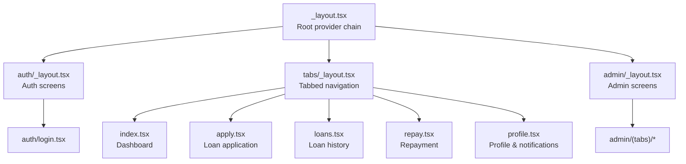

**Diagram sources**
- [app/_layout.tsx:31-82](file://app/_layout.tsx#L31-L82)
- [app/(tabs)/_layout.tsx](file://app/(tabs)/_layout.tsx#L141-L146)
- [app/auth/_layout.tsx:4-12](file://app/auth/_layout.tsx#L4-L12)
- [app/admin/_layout.tsx:4-11](file://app/admin/_layout.tsx#L4-L11)

**Section sources**
- [app/_layout.tsx:1-83](file://app/_layout.tsx#L1-L83)
- [app/(tabs)/_layout.tsx](file://app/(tabs)/_layout.tsx#L1-L163)
- [app/auth/_layout.tsx:1-13](file://app/auth/_layout.tsx#L1-L13)
- [app/admin/_layout.tsx:1-12](file://app/admin/_layout.tsx#L1-L12)

## Core Components
- Root layout provider chain establishes:
  - Error boundary wrapper
  - TanStack Query client provider
  - Admin, Auth, and Loan providers
  - Gesture and keyboard providers
  - Splash screen and font loading
  - Push notification registration and foreground listener
- Tab layout supports native and classic modes with badges and dynamic tab icons
- Auth context manages user session, token persistence, and role-based routing
- Loan context orchestrates offline-first data, backend synchronization, and notifications
- Admin context manages admin session, settings, and loan/user administration
- Notification service integrates Expo push/local notifications and backend posting

**Section sources**
- [app/_layout.tsx:31-82](file://app/_layout.tsx#L31-L82)
- [app/(tabs)/_layout.tsx](file://app/(tabs)/_layout.tsx#L12-L146)
- [contexts/AuthContext.tsx:31-126](file://contexts/AuthContext.tsx#L31-L126)
- [contexts/LoanContext.tsx:82-329](file://contexts/LoanContext.tsx#L82-L329)
- [contexts/AdminContext.tsx:135-521](file://contexts/AdminContext.tsx#L135-L521)
- [services/NotificationService.ts:26-69](file://services/NotificationService.ts#L26-L69)

## Architecture Overview
The frontend uses a layered provider pattern:
- Providers wrap the app in a strict order to ensure downstream consumers can access state safely
- Navigation is declarative with Expo Router stacks and tabs
- Offline-first state management with AsyncStorage fallback and optimistic updates
- Push notifications handled via Expo Notifications with local and backend persistence

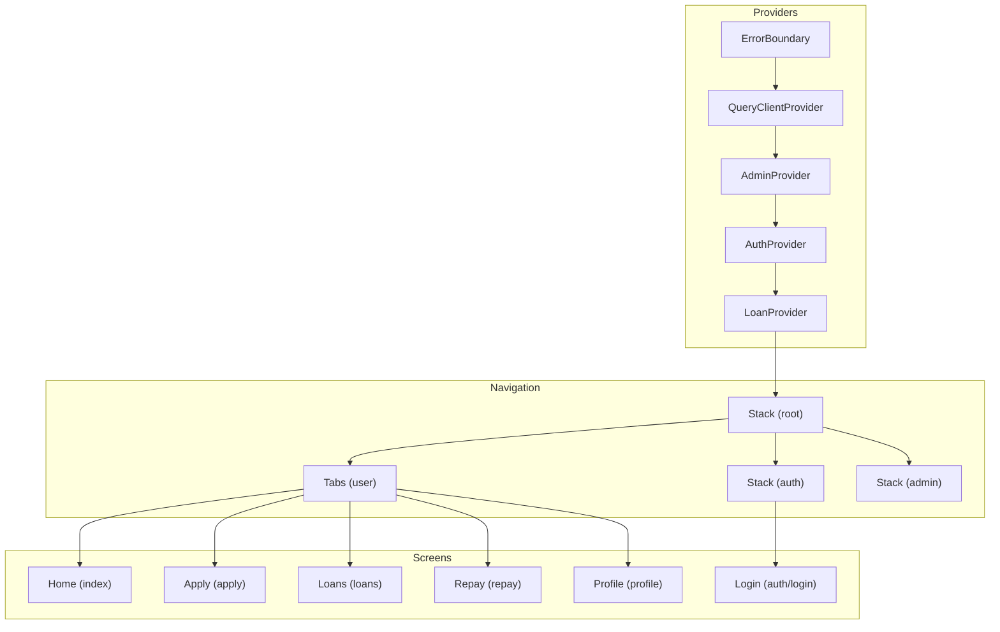

**Diagram sources**
- [app/_layout.tsx:65-81](file://app/_layout.tsx#L65-L81)
- [app/(tabs)/_layout.tsx](file://app/(tabs)/_layout.tsx#L141-L146)
- [app/auth/_layout.tsx:4-12](file://app/auth/_layout.tsx#L4-L12)
- [app/admin/_layout.tsx:4-11](file://app/admin/_layout.tsx#L4-L11)

## Detailed Component Analysis

### Global Layout Providers and Navigation Entrypoints
- Root layout configures splash screen, fonts, push notifications, and provider order
- Tab layout switches between native and classic modes with platform-aware styling and badges
- Auth and Admin layouts define isolated stacks for login and tabbed sections

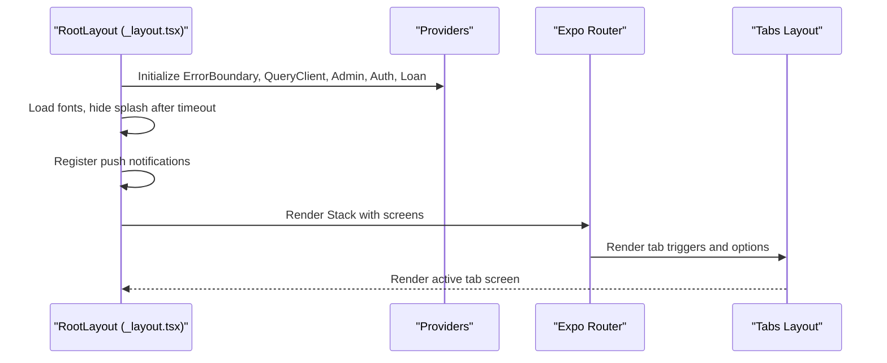

**Diagram sources**
- [app/_layout.tsx:31-82](file://app/_layout.tsx#L31-L82)
- [app/(tabs)/_layout.tsx](file://app/(tabs)/_layout.tsx#L141-L146)

**Section sources**
- [app/_layout.tsx:31-82](file://app/_layout.tsx#L31-L82)
- [app/(tabs)/_layout.tsx](file://app/(tabs)/_layout.tsx#L12-L146)
- [app/auth/_layout.tsx:4-12](file://app/auth/_layout.tsx#L4-L12)
- [app/admin/_layout.tsx:4-11](file://app/admin/_layout.tsx#L4-L11)

### Authentication Flow and Role-Based Routing
- Login validates credentials, persists tokens, and routes based on user role
- Auth provider stores user and token in AsyncStorage for persistence
- Role-based redirect ensures users land on appropriate tabbed interface

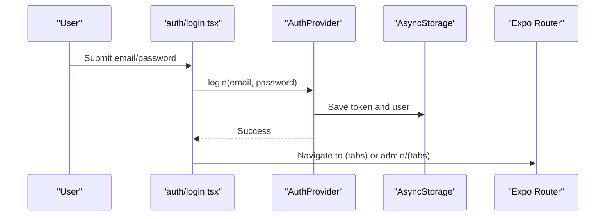

**Diagram sources**
- [app/auth/login.tsx:101-134](file://app/auth/login.tsx#L101-L134)
- [contexts/AuthContext.tsx:56-119](file://contexts/AuthContext.tsx#L56-L119)

**Section sources**
- [app/auth/login.tsx:80-134](file://app/auth/login.tsx#L80-L134)
- [contexts/AuthContext.tsx:31-126](file://contexts/AuthContext.tsx#L31-L126)

### Loan Management Screens

#### Dashboard (Home)
- Displays user greeting, loan limit, active loan, KYC status, and recent loans
- Uses animated cards and gradients for visual hierarchy
- Pull-to-refresh triggers loan data refresh

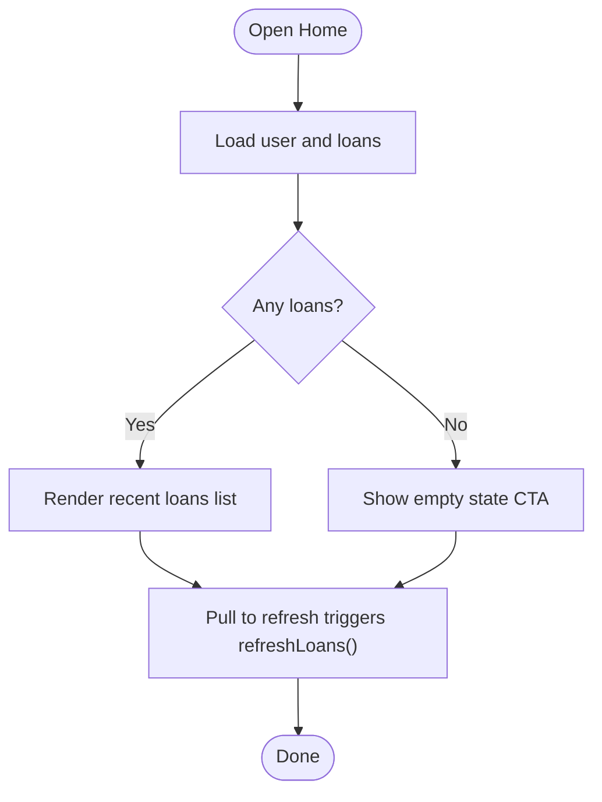

**Diagram sources**
- [app/(tabs)/index.tsx](file://app/(tabs)/index.tsx#L195-L206)

**Section sources**
- [app/(tabs)/index.tsx](file://app/(tabs)/index.tsx#L195-L345)

#### Apply for Loan
- Multi-step form with calculator, personal details, and disbursement options
- Validates inputs, enforces limits, and submits application
- Optimistically updates state and posts notifications

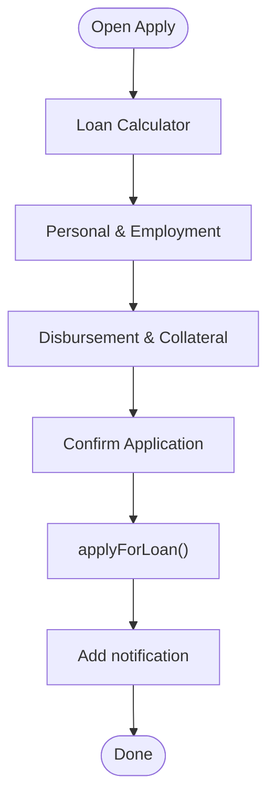

**Diagram sources**
- [app/(tabs)/apply.tsx](file://app/(tabs)/apply.tsx#L125-L255)
- [contexts/LoanContext.tsx:198-261](file://contexts/LoanContext.tsx#L198-L261)

**Section sources**
- [app/(tabs)/apply.tsx](file://app/(tabs)/apply.tsx#L125-L515)
- [contexts/LoanContext.tsx:82-176](file://contexts/LoanContext.tsx#L82-L176)

#### Loan History
- Filters by status, shows timeline, and opens detailed modals
- Supports pull-to-refresh and empty states

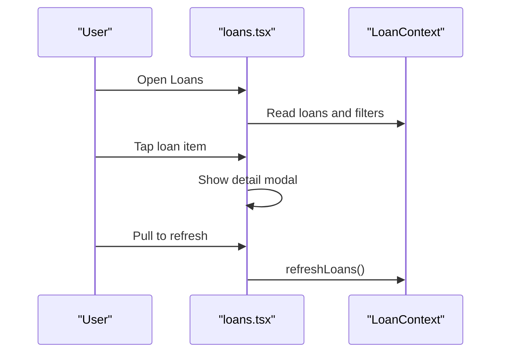

**Diagram sources**
- [app/(tabs)/loans.tsx](file://app/(tabs)/loans.tsx#L309-L323)
- [contexts/LoanContext.tsx:311-313](file://contexts/LoanContext.tsx#L311-L313)

**Section sources**
- [app/(tabs)/loans.tsx](file://app/(tabs)/loans.tsx#L309-L441)
- [contexts/LoanContext.tsx:311-329](file://contexts/LoanContext.tsx#L311-L329)

#### Repayment
- Guides payment via mobile money or bank transfer
- Uploads proof of payment and triggers rating modal
- Shows payment history and success metrics

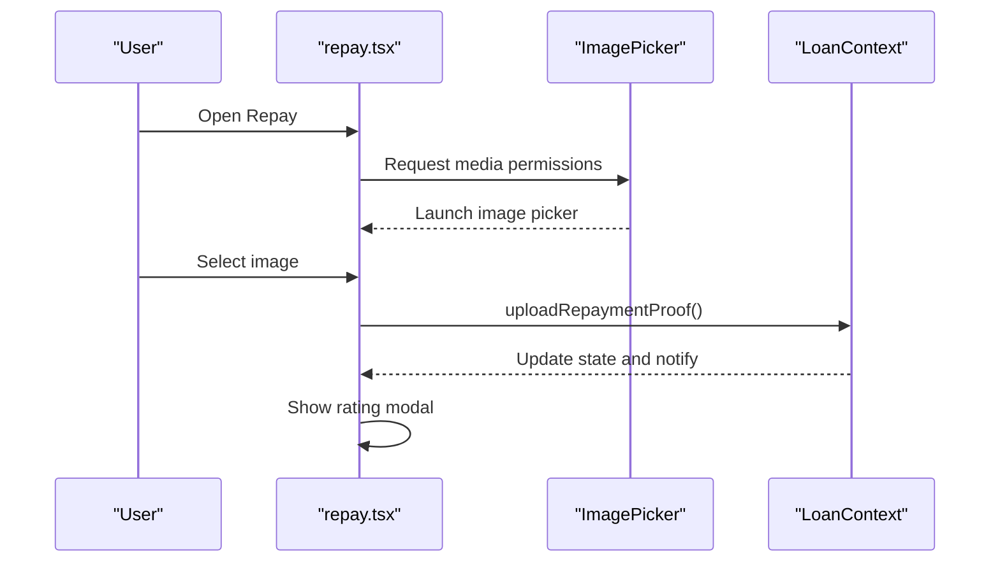

**Diagram sources**
- [app/(tabs)/repay.tsx](file://app/(tabs)/repay.tsx#L225-L260)
- [contexts/LoanContext.tsx:263-273](file://contexts/LoanContext.tsx#L263-L273)

**Section sources**
- [app/(tabs)/repay.tsx](file://app/(tabs)/repay.tsx#L225-L450)
- [contexts/LoanContext.tsx:263-280](file://contexts/LoanContext.tsx#L263-L280)

### Profile and Notifications
- Displays personal info, stats, and tabs for profile, notifications, and settings
- Supports marking notifications read, toggling preferences, and logging out

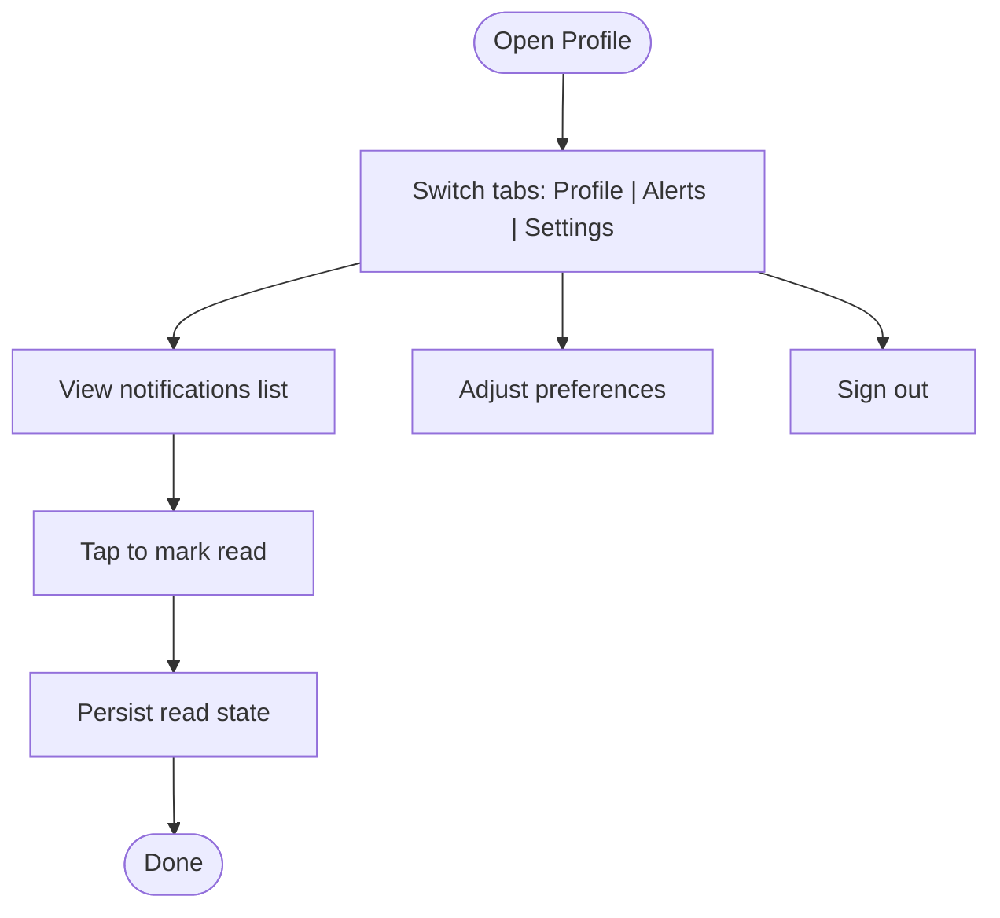

**Diagram sources**
- [app/(tabs)/profile.tsx](file://app/(tabs)/profile.tsx#L127-L154)
- [contexts/LoanContext.tsx:282-309](file://contexts/LoanContext.tsx#L282-L309)

**Section sources**
- [app/(tabs)/profile.tsx](file://app/(tabs)/profile.tsx#L127-L435)
- [contexts/LoanContext.tsx:282-320](file://contexts/LoanContext.tsx#L282-L320)

### Admin Portal
- Admin login, settings, and loan/user management
- Synchronizes with backend and falls back to AsyncStorage when offline

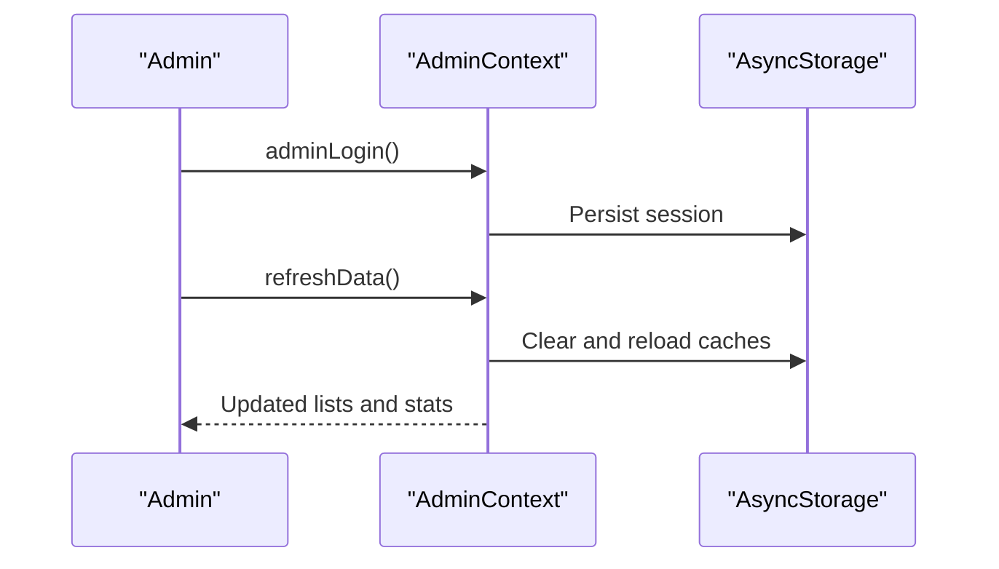

**Diagram sources**
- [contexts/AdminContext.tsx:287-302](file://contexts/AdminContext.tsx#L287-L302)
- [contexts/AdminContext.tsx:480-491](file://contexts/AdminContext.tsx#L480-L491)

**Section sources**
- [contexts/AdminContext.tsx:135-521](file://contexts/AdminContext.tsx#L135-L521)

### Global State Management Patterns
- AuthContext: token and user persistence, role-based routing
- LoanContext: offline-first, optimistic updates, backend sync, notifications
- AdminContext: admin session, settings, and administrative actions

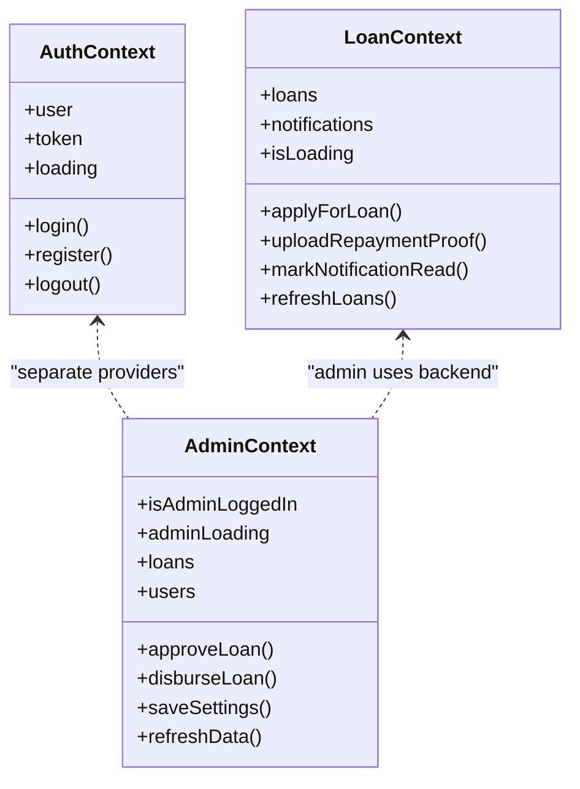

**Diagram sources**
- [contexts/AuthContext.tsx:20-126](file://contexts/AuthContext.tsx#L20-L126)
- [contexts/LoanContext.tsx:50-329](file://contexts/LoanContext.tsx#L50-L329)
- [contexts/AdminContext.tsx:77-521](file://contexts/AdminContext.tsx#L77-L521)

**Section sources**
- [contexts/AuthContext.tsx:31-135](file://contexts/AuthContext.tsx#L31-L135)
- [contexts/LoanContext.tsx:82-336](file://contexts/LoanContext.tsx#L82-L336)
- [contexts/AdminContext.tsx:135-528](file://contexts/AdminContext.tsx#L135-L528)

### Responsive Design and Platform Considerations
- Safe areas and platform-specific paddings
- Dark mode awareness and tab styling
- Web-friendly adjustments for tab height and borders
- Animated transitions and haptic feedback for interactions

**Section sources**
- [app/(tabs)/_layout.tsx](file://app/(tabs)/_layout.tsx#L42-L90)
- [app/(tabs)/index.tsx](file://app/(tabs)/index.tsx#L196-L200)
- [app/(tabs)/loans.tsx](file://app/(tabs)/loans.tsx#L310-L323)

### Mobile-Specific Integrations
- Push notifications:
  - Permission checks and channel creation on Android
  - Foreground listeners and local scheduling
  - Backend posting for persistent alerts
- Image picker for repayment proof uploads
- Biometric login toggle in settings (UI present, logic placeholder)

**Section sources**
- [services/NotificationService.ts:26-69](file://services/NotificationService.ts#L26-L69)
- [services/NotificationService.ts:116-134](file://services/NotificationService.ts#L116-L134)
- [app/(tabs)/repay.tsx](file://app/(tabs)/repay.tsx#L238-L260)
- [app/(tabs)/profile.tsx](file://app/(tabs)/profile.tsx#L332-L342)

## Dependency Analysis
Key dependencies and relationships:
- Root providers depend on each other in a strict order
- Screens consume contexts and call their methods
- Notification service depends on Expo Notifications and AsyncStorage
- Admin and Loan contexts both interact with backend APIs and AsyncStorage

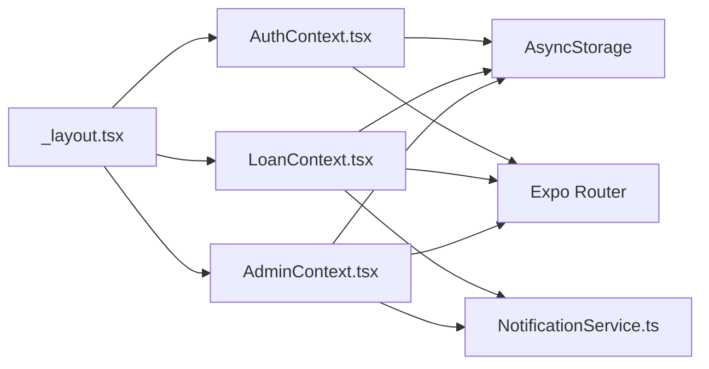

**Diagram sources**
- [app/_layout.tsx:65-81](file://app/_layout.tsx#L65-L81)
- [contexts/AuthContext.tsx:40-54](file://contexts/AuthContext.tsx#L40-L54)
- [contexts/LoanContext.tsx:91-176](file://contexts/LoanContext.tsx#L91-L176)
- [contexts/AdminContext.tsx:146-285](file://contexts/AdminContext.tsx#L146-L285)
- [services/NotificationService.ts:93-114](file://services/NotificationService.ts#L93-L114)

**Section sources**
- [app/_layout.tsx:65-81](file://app/_layout.tsx#L65-L81)
- [contexts/AuthContext.tsx:40-54](file://contexts/AuthContext.tsx#L40-L54)
- [contexts/LoanContext.tsx:91-176](file://contexts/LoanContext.tsx#L91-L176)
- [contexts/AdminContext.tsx:146-285](file://contexts/AdminContext.tsx#L146-L285)
- [services/NotificationService.ts:93-114](file://services/NotificationService.ts#L93-L114)

## Performance Considerations
- Provider order minimizes re-renders by placing heavy providers close to root
- Memoized values in contexts reduce prop drilling overhead
- Offline-first design reduces network latency and improves resilience
- Animated components use shared values and spring/timing for smooth UX
- Avoid unnecessary subscriptions; remove listeners on unmount (splash, fonts, notifications)
- Use FlatList or similar for long lists where applicable (not shown in current screens)

## Troubleshooting Guide
- Error boundaries:
  - Class-based error boundary wraps the app to gracefully handle rendering errors
  - Provides a fallback UI and optional error callback
- Common issues:
  - Font loading timeouts: splash hides after timeout to prevent hanging
  - Push notification permissions: handled with checks and Expo Go warnings
  - Async storage failures: contexts fall back to cached data when backend is unavailable
  - Navigation redirects: ensure role-based routing after login

**Section sources**
- [components/ErrorBoundary.tsx:16-54](file://components/ErrorBoundary.tsx#L16-L54)
- [app/_layout.tsx:39-48](file://app/_layout.tsx#L39-L48)
- [services/NotificationService.ts:26-49](file://services/NotificationService.ts#L26-L49)
- [contexts/LoanContext.tsx:132-176](file://contexts/LoanContext.tsx#L132-L176)
- [contexts/AdminContext.tsx:150-162](file://contexts/AdminContext.tsx#L150-L162)

## Conclusion
The frontend employs a robust provider chain, declarative navigation, and offline-first state management to deliver a responsive and resilient mobile experience. The tabbed interface organizes core workflows—dashboard, application, loan history, repayment, and profile—while global contexts coordinate authentication, loan lifecycle, and admin operations. Mobile-specific integrations like push notifications and image picking are integrated thoughtfully, with platform-aware behavior and graceful degradation. The architecture supports maintainability, scalability, and cross-platform deployment.