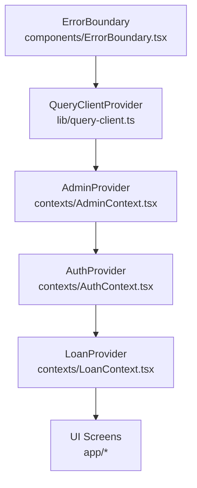
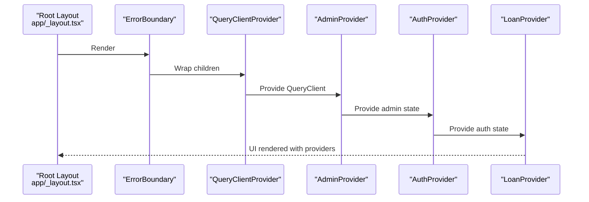
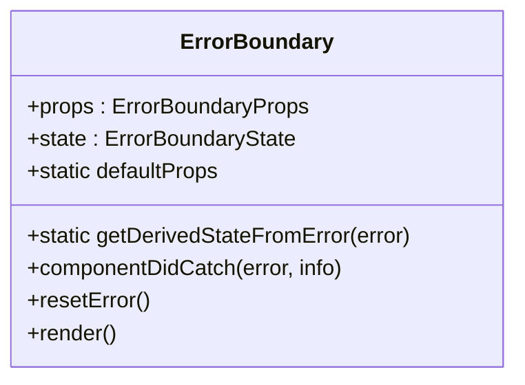
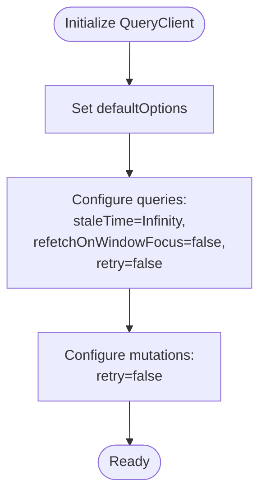
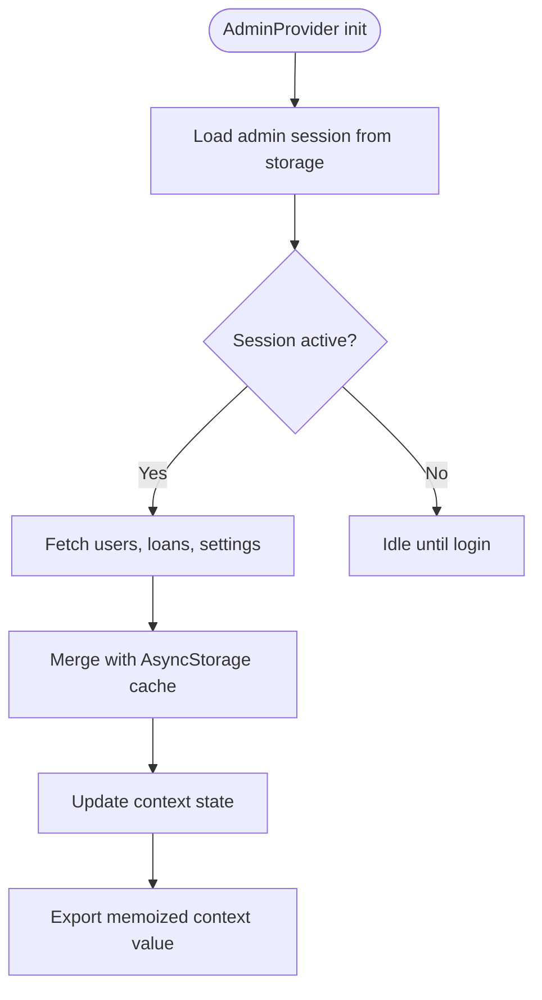
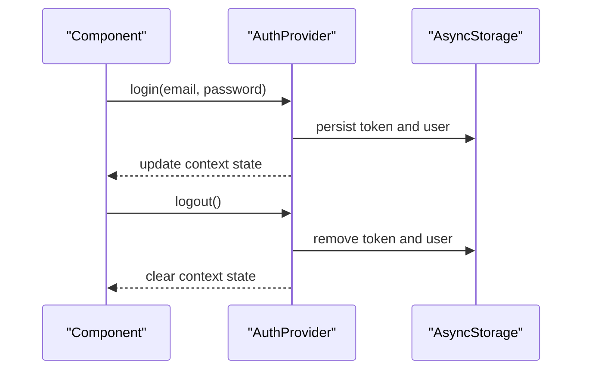
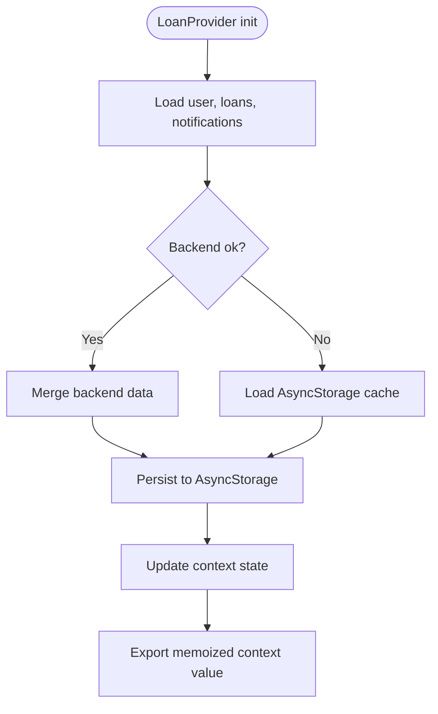
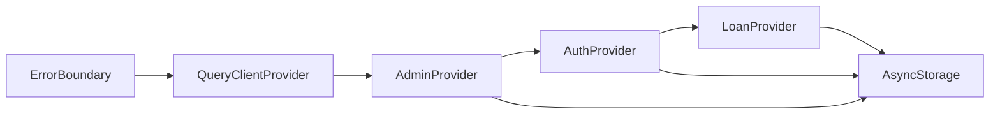

# Global Providers

<cite>
**Referenced Files in This Document**
- [app/_layout.tsx](file://app/_layout.tsx)
- [components/ErrorBoundary.tsx](file://components/ErrorBoundary.tsx)
- [components/ErrorFallback.tsx](file://components/ErrorFallback.tsx)
- [lib/query-client.ts](file://lib/query-client.ts)
- [contexts/AuthContext.tsx](file://contexts/AuthContext.tsx)
- [contexts/LoanContext.tsx](file://contexts/LoanContext.tsx)
- [contexts/AdminContext.tsx](file://contexts/AdminContext.tsx)
- [app/index.tsx](file://app/index.tsx)
- [app/(tabs)/loans.tsx](file://app/(tabs)/loans.tsx)
- [app/(tabs)/apply.tsx](file://app/(tabs)/apply.tsx)
- [app/admin/(tabs)/applications.tsx](file://app/admin/(tabs)/applications.tsx)
</cite>

## Table of Contents
1. [Introduction](#introduction)
2. [Project Structure](#project-structure)
3. [Core Components](#core-components)
4. [Architecture Overview](#architecture-overview)
5. [Detailed Component Analysis](#detailed-component-analysis)
6. [Dependency Analysis](#dependency-analysis)
7. [Performance Considerations](#performance-considerations)
8. [Troubleshooting Guide](#troubleshooting-guide)
9. [Conclusion](#conclusion)

## Introduction
This document explains the global state management system built with React Context providers. It covers the provider hierarchy, responsibilities, data flows, and integration points with TanStack Query and error boundaries. It also provides guidance on context consumption, state synchronization, performance optimization, and memory leak prevention.

## Project Structure
The global providers are wired at the root of the application and nested in a specific order to ensure proper data availability and lifecycle management. The providers are declared in the root layout and consumed by downstream components.

**Diagram sources**
- [app/_layout.tsx:65-81](file://app/_layout.tsx#L65-L81)
- [lib/query-client.ts:67-81](file://lib/query-client.ts#L67-L81)
- [contexts/AdminContext.tsx:135-521](file://contexts/AdminContext.tsx#L135-L521)
- [contexts/AuthContext.tsx:31-126](file://contexts/AuthContext.tsx#L31-L126)
- [contexts/LoanContext.tsx:82-329](file://contexts/LoanContext.tsx#L82-L329)

**Section sources**
- [app/_layout.tsx:1-83](file://app/_layout.tsx#L1-L83)

## Core Components
- ErrorBoundary: Catches rendering errors and renders a fallback UI. Must wrap the entire provider tree to ensure top-level error handling.
- QueryClientProvider: Provides TanStack Query’s caching and data fetching capabilities to the app.
- AdminProvider: Manages admin-specific state, settings, and administrative actions.
- AuthProvider: Manages user authentication state and persistence.
- LoanProvider: Manages loan applications, notifications, and user-related loan operations.

Responsibilities and data flow patterns:
- Providers initialize state, hydrate from persistent storage, and expose memoized values via context.
- Child components consume context via dedicated hooks and trigger updates that propagate through the tree.
- TanStack Query is configured centrally to standardize network requests and caching behavior.

**Section sources**
- [components/ErrorBoundary.tsx:16-54](file://components/ErrorBoundary.tsx#L16-L54)
- [lib/query-client.ts:67-81](file://lib/query-client.ts#L67-L81)
- [contexts/AdminContext.tsx:135-521](file://contexts/AdminContext.tsx#L135-L521)
- [contexts/AuthContext.tsx:31-126](file://contexts/AuthContext.tsx#L31-L126)
- [contexts/LoanContext.tsx:82-329](file://contexts/LoanContext.tsx#L82-L329)

## Architecture Overview
The provider hierarchy ensures correct initialization order and dependency relationships:
- ErrorBoundary wraps the entire tree to guarantee error resilience.
- QueryClientProvider enables caching and data fetching for the app.
- AdminProvider initializes admin session and loads admin data, exposing admin actions.
- AuthProvider depends on admin session availability and manages user authentication.
- LoanProvider depends on user identity and manages loan and notification state.

**Diagram sources**
- [app/_layout.tsx:65-81](file://app/_layout.tsx#L65-L81)

## Detailed Component Analysis

### ErrorBoundary
- Purpose: Acts as a class-based error boundary to catch rendering errors and present a fallback UI.
- Behavior: Captures errors via lifecycle methods, exposes a reset handler, and conditionally renders fallback UI.
- Integration: Must wrap the entire provider tree to ensure top-level error handling.

**Diagram sources**
- [components/ErrorBoundary.tsx:16-54](file://components/ErrorBoundary.tsx#L16-L54)

**Section sources**
- [components/ErrorBoundary.tsx:16-54](file://components/ErrorBoundary.tsx#L16-L54)
- [components/ErrorFallback.tsx:21-180](file://components/ErrorFallback.tsx#L21-L180)

### QueryClientProvider
- Purpose: Centralizes TanStack Query configuration and caching behavior.
- Configuration highlights:
  - Default query function uses a shared API request utility.
  - Unauthorized responses handled per configuration.
  - Stale time set to Infinity to avoid automatic refetches.
  - Refetch on window focus disabled to reduce unnecessary network activity.
  - Retry disabled globally for predictable error handling.

**Diagram sources**
- [lib/query-client.ts:67-81](file://lib/query-client.ts#L67-L81)

**Section sources**
- [lib/query-client.ts:1-81](file://lib/query-client.ts#L1-L81)

### AdminProvider
- Responsibilities:
  - Manage admin session state and persistence.
  - Load and maintain admin data (users, loans, settings).
  - Expose administrative actions (approve/reject/disburse/complete loans, manage KYC, update settings).
  - Compute derived statistics and counts.
- Data flow:
  - Hydrates from persistent storage on mount.
  - Loads data from backend APIs and merges with local cache.
  - Updates state immutably and persists changes where applicable.
- Derived values:
  - Pending approvals, revenue metrics, and aggregated stats computed via memoization.

**Diagram sources**
- [contexts/AdminContext.tsx:146-285](file://contexts/AdminContext.tsx#L146-L285)
- [contexts/AdminContext.tsx:493-518](file://contexts/AdminContext.tsx#L493-L518)

**Section sources**
- [contexts/AdminContext.tsx:135-521](file://contexts/AdminContext.tsx#L135-L521)

### AuthProvider
- Responsibilities:
  - Manage user authentication state and persistence.
  - Provide login, register, and logout functions.
  - Hydrate state from persistent storage on mount.
- Data flow:
  - Persists tokens and user data to storage after successful auth.
  - Clears storage on logout.

**Diagram sources**
- [contexts/AuthContext.tsx:31-126](file://contexts/AuthContext.tsx#L31-L126)

**Section sources**
- [contexts/AuthContext.tsx:31-126](file://contexts/AuthContext.tsx#L31-L126)

### LoanProvider
- Responsibilities:
  - Manage user loan applications and notifications.
  - Provide application submission, repayment proof upload, rating, and notification marking.
  - Hydrate from backend and persistent storage, with optimistic updates.
- Data flow:
  - Fetches user-specific data and notifications from backend.
  - Merges with AsyncStorage cache and updates state immutably.
  - Emits local notifications and persists updates.

**Diagram sources**
- [contexts/LoanContext.tsx:91-176](file://contexts/LoanContext.tsx#L91-L176)
- [contexts/LoanContext.tsx:322-329](file://contexts/LoanContext.tsx#L322-L329)

**Section sources**
- [contexts/LoanContext.tsx:82-329](file://contexts/LoanContext.tsx#L82-L329)

## Dependency Analysis
Provider dependencies and coupling:
- ErrorBoundary depends on UI fallback components and is agnostic of app logic.
- QueryClientProvider depends on shared API utilities and TanStack Query.
- AdminProvider depends on AuthProvider indirectly via session management and user context.
- AuthProvider depends on AsyncStorage for persistence.
- LoanProvider depends on AuthProvider for user identity and on AsyncStorage for caching.

**Diagram sources**
- [app/_layout.tsx:65-81](file://app/_layout.tsx#L65-L81)
- [contexts/AdminContext.tsx:135-521](file://contexts/AdminContext.tsx#L135-L521)
- [contexts/AuthContext.tsx:31-126](file://contexts/AuthContext.tsx#L31-L126)
- [contexts/LoanContext.tsx:82-329](file://contexts/LoanContext.tsx#L82-L329)

**Section sources**
- [app/_layout.tsx:1-83](file://app/_layout.tsx#L1-L83)

## Performance Considerations
- Memoized context values: All providers compute and export memoized context values to minimize re-renders.
- TanStack Query defaults:
  - Stale time set to Infinity to prevent unnecessary refetches.
  - Refetch on window focus disabled to reduce background network activity.
  - Retry disabled to keep error handling predictable.
- Local caching: Providers use AsyncStorage to reduce network calls and improve perceived performance.
- Derived computations: Stats and counts are computed via memoization to avoid recalculating on every render.

Recommendations:
- Prefer server-driven updates for critical state and invalidate caches selectively.
- Use TanStack Query’s query invalidation and selective refetches for data that changes frequently.
- Avoid deep object mutations; prefer immutable updates to preserve referential equality.

**Section sources**
- [lib/query-client.ts:67-81](file://lib/query-client.ts#L67-L81)
- [contexts/AdminContext.tsx:510-518](file://contexts/AdminContext.tsx#L510-L518)
- [contexts/LoanContext.tsx:322-329](file://contexts/LoanContext.tsx#L322-L329)

## Troubleshooting Guide
Common issues and resolutions:
- Provider not found errors:
  - Ensure components consuming context are wrapped within the appropriate provider.
  - Verify hook usage adheres to the provider hierarchy.
- Authentication state not persisting:
  - Confirm AsyncStorage keys exist and are written on login/logout.
  - Check for exceptions during storage operations.
- Loans or notifications not updating:
  - Verify backend endpoints and headers (X-User-Id).
  - Confirm AsyncStorage keys for cached data are present.
- Error boundary not catching errors:
  - Ensure ErrorBoundary wraps the entire provider tree.
  - Confirm fallback component renders without errors.

**Section sources**
- [contexts/AuthContext.tsx:128-134](file://contexts/AuthContext.tsx#L128-L134)
- [contexts/LoanContext.tsx:331-335](file://contexts/LoanContext.tsx#L331-L335)
- [contexts/AdminContext.tsx:523-527](file://contexts/AdminContext.tsx#L523-L527)
- [components/ErrorBoundary.tsx:16-54](file://components/ErrorBoundary.tsx#L16-L54)

## Conclusion
The global state management system leverages a clear provider hierarchy, robust error handling, and centralized data fetching to deliver a reliable and performant user experience. By structuring providers correctly, memoizing context values, and integrating TanStack Query thoughtfully, the app maintains predictable state synchronization and efficient resource usage. Following the consumption patterns and troubleshooting steps outlined here will help sustain and extend the system effectively.