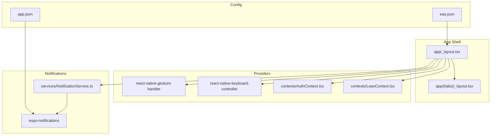
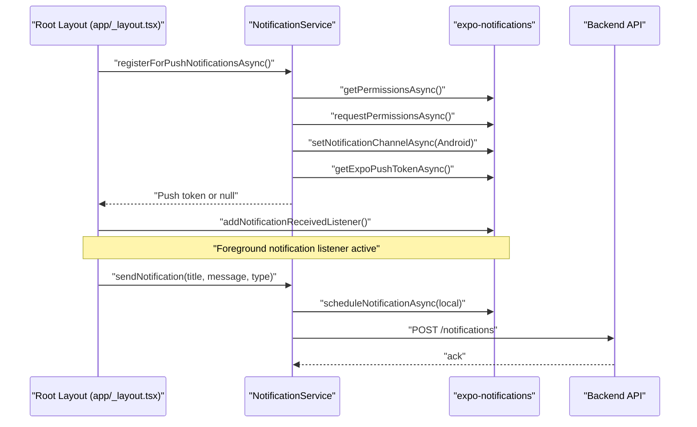
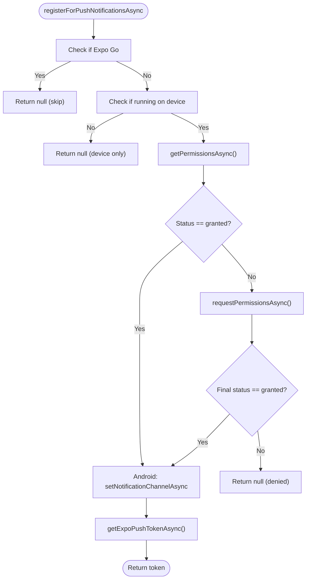
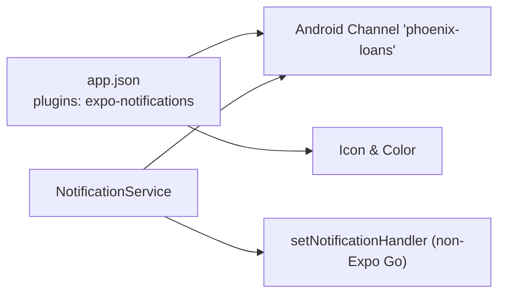
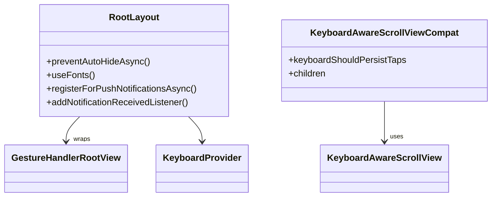
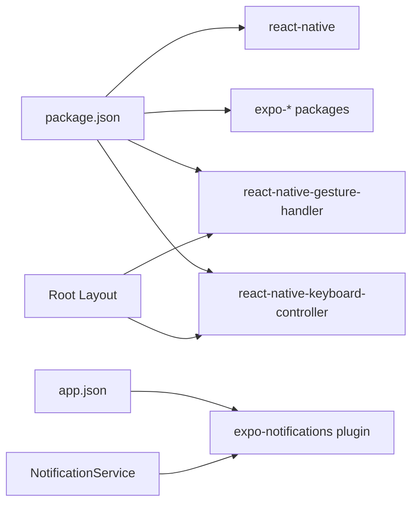

# Mobile Integrations

<cite>
**Referenced Files in This Document**
- [app.json](file://app.json)
- [package.json](file://package.json)
- [services/NotificationService.ts](file://services/NotificationService.ts)
- [components/NotificationTest.tsx](file://components/NotificationTest.tsx)
- [debug-notifications.js](file://debug-notifications.js)
- [app/_layout.tsx](file://app/_layout.tsx)
- [app/(tabs)/_layout.tsx](file://app/(tabs)/_layout.tsx)
- [components/KeyboardAwareScrollViewCompat.tsx](file://components/KeyboardAwareScrollViewCompat.tsx)
- [contexts/LoanContext.tsx](file://contexts/LoanContext.tsx)
- [contexts/AuthContext.tsx](file://contexts/AuthContext.tsx)
- [eas.json](file://eas.json)
</cite>

## Table of Contents
1. [Introduction](#introduction)
2. [Project Structure](#project-structure)
3. [Core Components](#core-components)
4. [Architecture Overview](#architecture-overview)
5. [Detailed Component Analysis](#detailed-component-analysis)
6. [Dependency Analysis](#dependency-analysis)
7. [Performance Considerations](#performance-considerations)
8. [Troubleshooting Guide](#troubleshooting-guide)
9. [Conclusion](#conclusion)

## Introduction
This document explains the mobile-specific integrations and features implemented in the Phoenix Loan application. It focuses on push notifications (registration, permissions, delivery), Expo Notifications API integration, local notification scheduling, background notification processing, and mobile UI/gesture/keyboard enhancements. It also covers splash screen management, platform-specific considerations, performance optimization tips, and troubleshooting common mobile integration issues.

## Project Structure
The mobile application is an Expo Router-based React Native app configured with native plugins for fonts, router, web browser, and notifications. The app initializes providers for navigation, authentication, loans, gestures, and keyboard handling. Notifications are centrally managed by a service module and integrated into the root layout and contexts.

**Diagram sources**
- [app/_layout.tsx:1-83](file://app/_layout.tsx#L1-83)
- [app/(tabs)/_layout.tsx](file://app/(tabs)/_layout.tsx#L1-163)
- [services/NotificationService.ts:1-135](file://services/NotificationService.ts#L1-135)
- [app.json:1-77](file://app.json#L1-77)
- [eas.json:1-22](file://eas.json#L1-22)

**Section sources**
- [app/_layout.tsx:1-83](file://app/_layout.tsx#L1-83)
- [app/(tabs)/_layout.tsx](file://app/(tabs)/_layout.tsx#L1-163)
- [app.json:1-77](file://app.json#L1-77)
- [eas.json:1-22](file://eas.json#L1-22)

## Core Components
- NotificationService: Centralizes push token registration, Android channel creation, local notification scheduling, and backend persistence of notifications.
- Root layout: Initializes splash screen, fonts, providers, and registers for push notifications on startup. Subscribes to foreground notifications.
- LoanContext: Integrates notifications into user actions (e.g., submitting an application triggers a notification).
- Keyboard-aware scroll: Provides cross-platform keyboard handling compatible with react-native-keyboard-controller.
- Gesture handler: Wraps the app to enable gesture-based navigation and interactions.

**Section sources**
- [services/NotificationService.ts:1-135](file://services/NotificationService.ts#L1-135)
- [app/_layout.tsx:17-61](file://app/_layout.tsx#L17-61)
- [contexts/LoanContext.tsx:183-196](file://contexts/LoanContext.tsx#L183-196)
- [components/KeyboardAwareScrollViewCompat.tsx:1-31](file://components/KeyboardAwareScrollViewCompat.tsx#L1-31)

## Architecture Overview
The mobile app integrates Expo Notifications with a layered approach:
- App initialization configures splash screen and providers, registers for push tokens, and subscribes to foreground notifications.
- NotificationService encapsulates permission checks, channel setup, token retrieval, local scheduling, and backend posting.
- LoanContext triggers notifications for lifecycle events and persists them locally and remotely.
- UI components leverage gesture and keyboard controllers for smooth mobile UX.

**Diagram sources**
- [app/_layout.tsx:50-61](file://app/_layout.tsx#L50-L61)
- [services/NotificationService.ts:26-69](file://services/NotificationService.ts#L26-69)
- [services/NotificationService.ts:116-134](file://services/NotificationService.ts#L116-134)

## Detailed Component Analysis

### Push Notifications Implementation
- Permission handling: Checks existing status, requests permission if not granted, and handles denial gracefully.
- Token registration: Skips registration in Expo Go; requires a physical device; creates Android notification channel.
- Foreground handling: Adds a listener for received notifications while the app is active.
- Local notifications: Schedules immediate notifications with sound and high priority.
- Backend persistence: Posts notifications to the backend using the current user’s ID.

**Diagram sources**
- [services/NotificationService.ts:26-69](file://services/NotificationService.ts#L26-69)

**Section sources**
- [services/NotificationService.ts:12-24](file://services/NotificationService.ts#L12-24)
- [services/NotificationService.ts:26-69](file://services/NotificationService.ts#L26-69)
- [services/NotificationService.ts:71-91](file://services/NotificationService.ts#L71-91)
- [services/NotificationService.ts:93-114](file://services/NotificationService.ts#L93-114)
- [services/NotificationService.ts:116-134](file://services/NotificationService.ts#L116-134)
- [app/_layout.tsx:56-61](file://app/_layout.tsx#L56-L61)

### Expo Notifications API Integration
- Plugin configuration: The app.json plugin section configures the default channel, icon, color, and sounds for notifications.
- Android channel: Sets importance, vibration pattern, sound, and light color for the “phoenix-loans” channel.
- iOS behavior: Foreground presentation is controlled via setNotificationHandler except in Expo Go.

**Diagram sources**
- [app.json:53-61](file://app.json#L53-61)
- [services/NotificationService.ts:12-24](file://services/NotificationService.ts#L12-24)
- [services/NotificationService.ts:51-60](file://services/NotificationService.ts#L51-60)

**Section sources**
- [app.json:53-61](file://app.json#L53-61)
- [services/NotificationService.ts:12-24](file://services/NotificationService.ts#L12-24)
- [services/NotificationService.ts:51-60](file://services/NotificationService.ts#L51-60)

### Local Notification Scheduling
- Immediate delivery: Uses a null trigger to schedule notifications instantly.
- Priority and sound: Configured to high priority and default sound.
- Error handling: Catches and logs failures during scheduling.

**Section sources**
- [services/NotificationService.ts:71-91](file://services/NotificationService.ts#L71-91)

### Background Notification Processing
- Foreground listener: Subscribes to received notifications when the app is active.
- Backend persistence: Attempts to post notifications to the backend; logs success/failure but continues with local notification.

**Section sources**
- [app/_layout.tsx:56-61](file://app/_layout.tsx#L56-L61)
- [services/NotificationService.ts:93-114](file://services/NotificationService.ts#L93-114)
- [services/NotificationService.ts:116-134](file://services/NotificationService.ts#L116-134)

### Notification Types and Custom Handling
- Types: Supports info, success, warning, error notification types.
- Custom handling: Notifications carry optional data payload and are persisted locally and remotely.
- UI integration: LoanContext triggers notifications for application submission and repayment proof upload.

**Section sources**
- [services/NotificationService.ts:93-114](file://services/NotificationService.ts#L93-114)
- [contexts/LoanContext.tsx:183-196](file://contexts/LoanContext.tsx#L183-196)
- [contexts/LoanContext.tsx:263-273](file://contexts/LoanContext.tsx#L263-273)

### Debugging Techniques
- Notification test script: Demonstrates local notification scheduling outside the app runtime.
- Console logs: Extensive logging for token retrieval, permission status, and backend posting outcomes.
- Expo Go limitations: Logs guidance to use development builds for push tokens.

**Section sources**
- [debug-notifications.js:1-32](file://debug-notifications.js#L1-32)
- [services/NotificationService.ts:26-31](file://services/NotificationService.ts#L26-31)
- [services/NotificationService.ts:122-133](file://services/NotificationService.ts#L122-133)

### Mobile-Specific UI Components
- Gesture handling: Root layout wraps the app in GestureHandlerRootView to support gesture-based navigation and interactions.
- Keyboard handling: KeyboardAwareScrollViewCompat provides a cross-platform wrapper around react-native-keyboard-controller for mobile and falls back to ScrollView on web.
- Splash screen: Prevents auto-hide until fonts are loaded or timeout occurs; hides when ready.

**Diagram sources**
- [app/_layout.tsx:17-48](file://app/_layout.tsx#L17-48)
- [app/_layout.tsx:71-75](file://app/_layout.tsx#L71-75)
- [components/KeyboardAwareScrollViewCompat.tsx:10-30](file://components/KeyboardAwareScrollViewCompat.tsx#L10-30)

**Section sources**
- [app/_layout.tsx:17-48](file://app/_layout.tsx#L17-48)
- [app/_layout.tsx:71-75](file://app/_layout.tsx#L71-75)
- [components/KeyboardAwareScrollViewCompat.tsx:1-31](file://components/KeyboardAwareScrollViewCompat.tsx#L1-31)

### Tab Navigation Enhancements
- Native tabs: Uses unstable-native-tabs when available for a native feel; otherwise falls back to classic tab rendering with blur/backdrops.
- Badge indicators: Unread notification count shown on the Profile tab.
- Platform awareness: Adapts tab bar styling and background per platform and theme.

**Section sources**
- [app/(tabs)/_layout.tsx](file://app/(tabs)/_layout.tsx#L142-145)
- [app/(tabs)/_layout.tsx](file://app/(tabs)/_layout.tsx#L41-139)
- [contexts/LoanContext.tsx](file://contexts/LoanContext.tsx#L320)

### Authentication and Notification Context
- AuthContext: Manages user session and stores credentials in AsyncStorage; used by NotificationService to post notifications with the X-User-Id header.
- LoanContext: Integrates notifications into loan lifecycle events and maintains a local notification list with read/unread state.

**Section sources**
- [contexts/AuthContext.tsx:40-54](file://contexts/AuthContext.tsx#L40-54)
- [contexts/AuthContext.tsx:56-112](file://contexts/AuthContext.tsx#L56-112)
- [contexts/LoanContext.tsx:183-196](file://contexts/LoanContext.tsx#L183-196)
- [contexts/LoanContext.tsx:263-273](file://contexts/LoanContext.tsx#L263-273)

## Dependency Analysis
- Expo Notifications plugin: Declared in app.json and used by NotificationService for permissions, channels, and scheduling.
- Development client: eas.json enables internal distribution for development and preview builds.
- Third-party libraries: react-native-gesture-handler and react-native-keyboard-controller are integrated at the root layout level.

**Diagram sources**
- [package.json:22-68](file://package.json#L22-68)
- [app.json:53-61](file://app.json#L53-61)
- [services/NotificationService.ts:1-6](file://services/NotificationService.ts#L1-6)
- [app/_layout.tsx:5-6](file://app/_layout.tsx#L5-6)

**Section sources**
- [package.json:22-68](file://package.json#L22-68)
- [app.json:53-61](file://app.json#L53-61)
- [eas.json:7-16](file://eas.json#L7-16)

## Performance Considerations
- Minimize foreground notification overhead: Avoid heavy work in notification listeners; defer non-critical tasks.
- Batch backend writes: Group notification posts to reduce network calls.
- Use AsyncStorage for quick local reads/writes: NotificationService already persists notifications locally.
- Platform-specific rendering: Prefer native tabs on devices where available to reduce layout thrash.
- Font loading: Keep splash screen visible until fonts are loaded to avoid layout shifts.

[No sources needed since this section provides general guidance]

## Troubleshooting Guide
- Push token missing in Expo Go: Expected behavior; use a development build for push token registration.
- Permission denied: Re-check permission status and request again; ensure device-only mode.
- Android channel not appearing: Confirm channel creation and importance settings; verify device supports channels.
- Local notifications not firing: Validate scheduling parameters and ensure the app has focus or background permissions.
- Backend posting fails: Inspect user ID header and network connectivity; fallback to local notifications is automatic.
- Keyboard overlaps content on mobile: Use KeyboardAwareScrollViewCompat to adjust scroll behavior.

**Section sources**
- [services/NotificationService.ts:26-31](file://services/NotificationService.ts#L26-31)
- [services/NotificationService.ts:46-49](file://services/NotificationService.ts#L46-49)
- [services/NotificationService.ts:51-60](file://services/NotificationService.ts#L51-60)
- [services/NotificationService.ts:71-91](file://services/NotificationService.ts#L71-91)
- [services/NotificationService.ts:116-134](file://services/NotificationService.ts#L116-134)
- [components/KeyboardAwareScrollViewCompat.tsx:15-21](file://components/KeyboardAwareScrollViewCompat.tsx#L15-21)

## Conclusion
The Phoenix Loan app implements robust mobile-specific integrations centered around Expo Notifications. It handles permissions, registers push tokens on devices, schedules local notifications, and persists notifications to the backend. The UI leverages gesture and keyboard controllers for a native feel, and splash screen management ensures a smooth launch. Following the outlined debugging and performance practices will help maintain reliability and responsiveness across platforms.