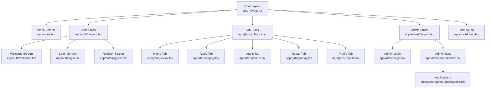
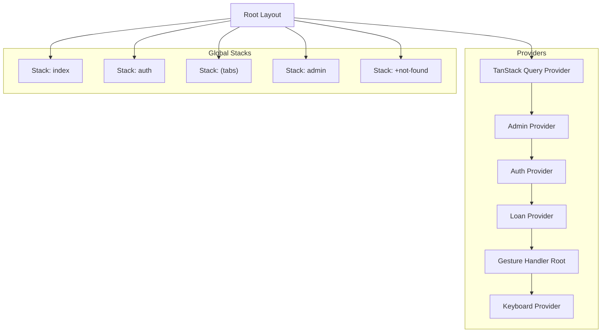
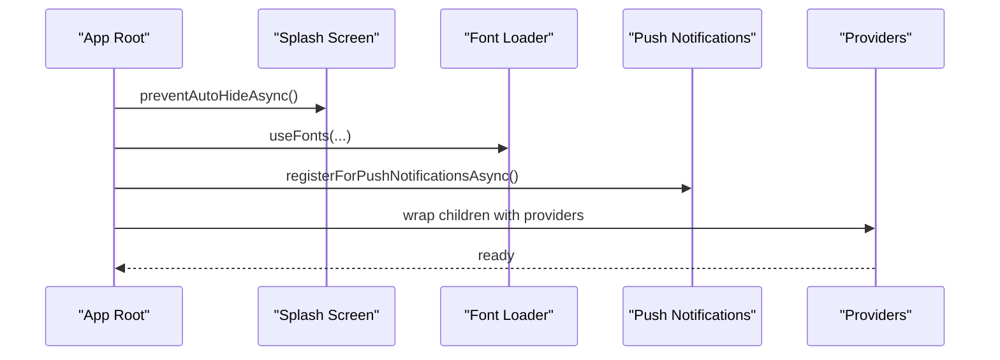
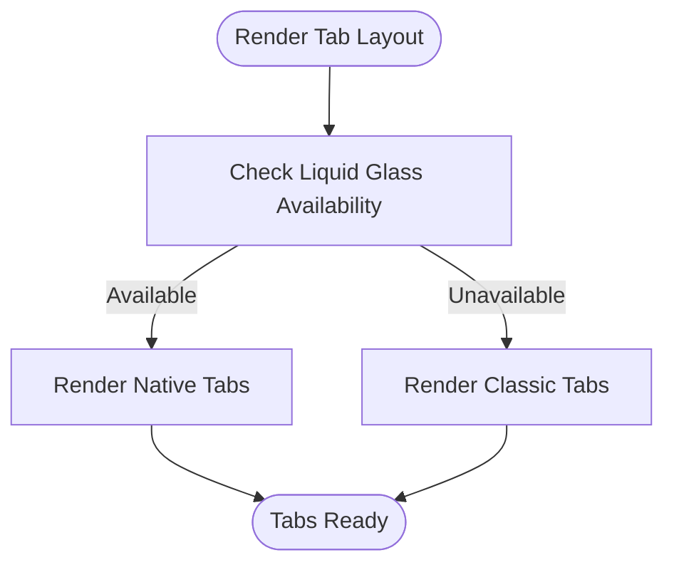
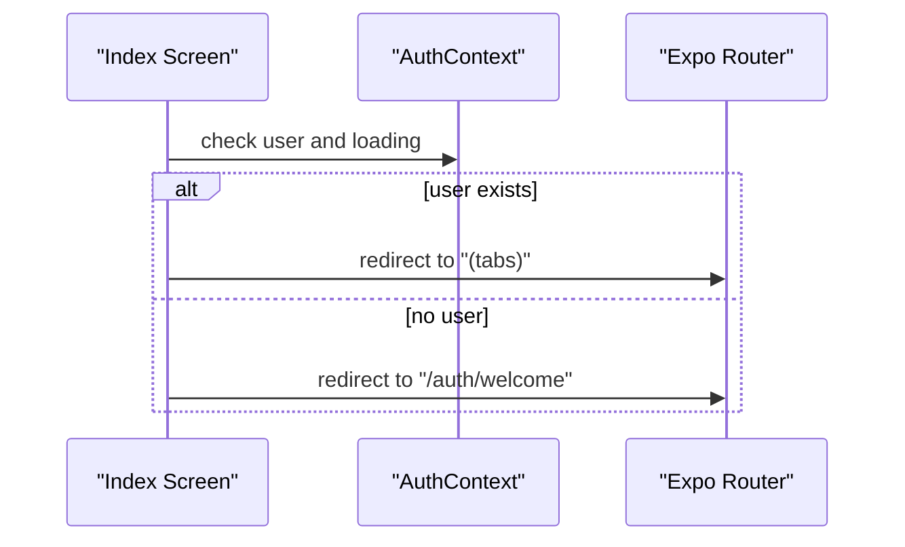
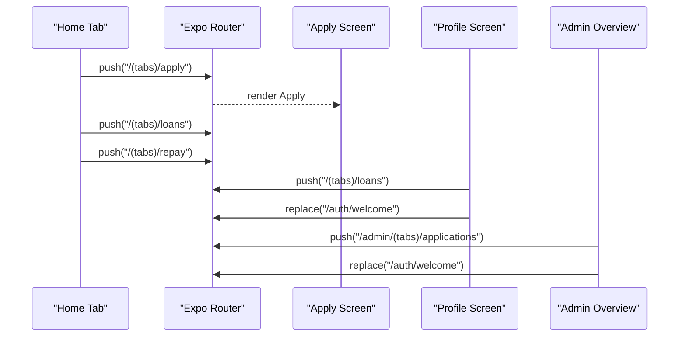
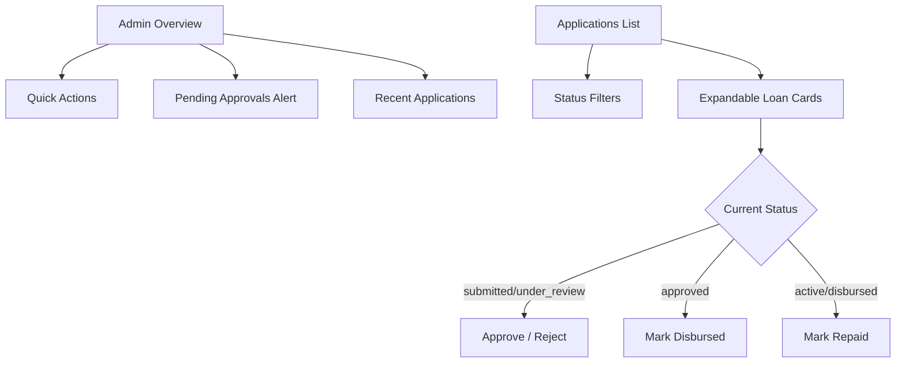
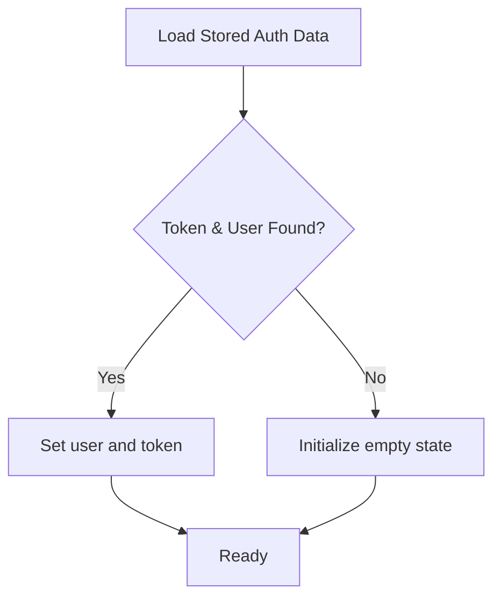
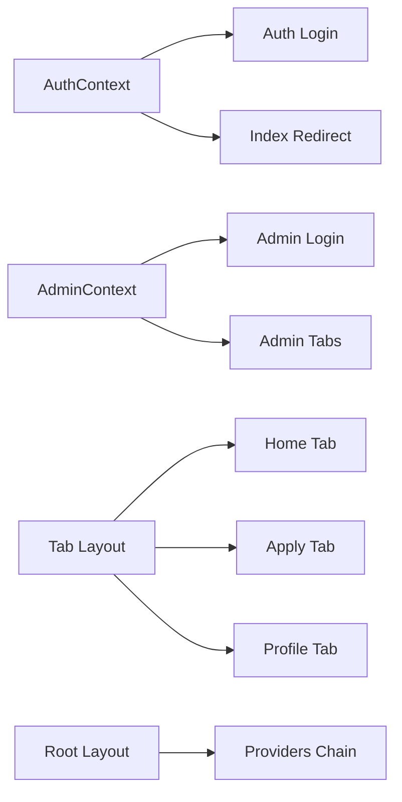

# Navigation System

<cite>
**Referenced Files in This Document**
- [app/_layout.tsx](file://app/_layout.tsx)
- [app/(tabs)/_layout.tsx](file://app/(tabs)/_layout.tsx)
- [app/admin/_layout.tsx](file://app/admin/_layout.tsx)
- [app/auth/_layout.tsx](file://app/auth/_layout.tsx)
- [app/index.tsx](file://app/index.tsx)
- [app/auth/login.tsx](file://app/auth/login.tsx)
- [app/admin/login.tsx](file://app/admin/login.tsx)
- [app/(tabs)/index.tsx](file://app/(tabs)/index.tsx)
- [app/(tabs)/apply.tsx](file://app/(tabs)/apply.tsx)
- [app/(tabs)/profile.tsx](file://app/(tabs)/profile.tsx)
- [app/admin/(tabs)/index.tsx](file://app/admin/(tabs)/index.tsx)
- [app/admin/(tabs)/applications.tsx](file://app/admin/(tabs)/applications.tsx)
- [app/+not-found.tsx](file://app/+not-found.tsx)
- [contexts/AuthContext.tsx](file://contexts/AuthContext.tsx)
- [contexts/AdminContext.tsx](file://contexts/AdminContext.tsx)
</cite>

## Table of Contents
1. [Introduction](#introduction)
2. [Project Structure](#project-structure)
3. [Core Components](#core-components)
4. [Architecture Overview](#architecture-overview)
5. [Detailed Component Analysis](#detailed-component-analysis)
6. [Dependency Analysis](#dependency-analysis)
7. [Performance Considerations](#performance-considerations)
8. [Troubleshooting Guide](#troubleshooting-guide)
9. [Conclusion](#conclusion)

## Introduction
This document explains the Expo Router-based navigation system used in the Phoenix application. It covers the hierarchical routing structure (root layout, tab navigation, nested routes), the tab-based interface pattern, route protection mechanisms, parameter passing between screens, deep linking configuration, integration with authentication state, navigation state persistence, and performance optimization techniques for smooth transitions. Practical examples illustrate common navigation patterns such as bottom tabs, stack navigation, and modal presentations.

## Project Structure
The navigation is organized around a root layout that defines global stacks and nested layouts for tabs and admin sections. Key files:
- Root layout defines top-level stacks for index, auth, tabs, admin, and not-found.
- Tab layout defines bottom tab navigation with native and classic variants.
- Auth and Admin layouts define their own stacks for login and dashboard flows.
- Screens under tabs implement dashboard, apply, loans, repay, and profile views.
- Admin tabs implement overview and applications review screens.

**Diagram sources**
- [app/_layout.tsx:19-29](file://app/_layout.tsx#L19-L29)
- [app/index.tsx:6-22](file://app/index.tsx#L6-L22)
- [app/auth/_layout.tsx:4-11](file://app/auth/_layout.tsx#L4-L11)
- [app/(tabs)/_layout.tsx](file://app/(tabs)/_layout.tsx#L141-L146)
- [app/admin/_layout.tsx:4-11](file://app/admin/_layout.tsx#L4-L11)
- [app/+not-found.tsx:5-17](file://app/+not-found.tsx#L5-L17)

**Section sources**
- [app/_layout.tsx:19-29](file://app/_layout.tsx#L19-L29)
- [app/(tabs)/_layout.tsx](file://app/(tabs)/_layout.tsx#L141-L146)
- [app/admin/_layout.tsx:4-11](file://app/admin/_layout.tsx#L4-L11)
- [app/auth/_layout.tsx:4-11](file://app/auth/_layout.tsx#L4-L11)

## Core Components
- Root layout: Defines global stacks for index, auth, tabs, admin, and not-found. Wraps providers for error boundary, TanStack Query, Auth, Loan, Admin, gesture handling, and keyboard handling.
- Tab layout: Renders either a native tab bar or a classic cross-platform tab bar with icons, labels, badges, and platform-specific styling.
- Auth layout: Manages welcome, login, and register flows.
- Admin layout: Manages admin login and admin tabs.
- Index screen: Redirects authenticated users to tabs or unauthenticated users to auth welcome.
- Tab screens: Home, Apply, Loans, Repay, Profile with navigation helpers and state.
- Admin screens: Overview and Applications review with status actions.

**Section sources**
- [app/_layout.tsx:31-82](file://app/_layout.tsx#L31-L82)
- [app/(tabs)/_layout.tsx](file://app/(tabs)/_layout.tsx#L12-L146)
- [app/auth/_layout.tsx:4-11](file://app/auth/_layout.tsx#L4-L11)
- [app/admin/_layout.tsx:4-11](file://app/admin/_layout.tsx#L4-L11)
- [app/index.tsx:6-22](file://app/index.tsx#L6-L22)

## Architecture Overview
The navigation architecture follows a layered approach:
- Providers at the root configure global state and UI behavior.
- Global stacks define top-level routes.
- Nested stacks encapsulate tab groups and admin sections.
- Route protection is enforced at the index screen and within screens using auth context.
- Navigation actions use Expo Router’s imperative APIs to navigate, replace, and go back.

**Diagram sources**
- [app/_layout.tsx:65-81](file://app/_layout.tsx#L65-L81)
- [app/_layout.tsx:19-29](file://app/_layout.tsx#L19-L29)

**Section sources**
- [app/_layout.tsx:65-81](file://app/_layout.tsx#L65-L81)
- [app/_layout.tsx:19-29](file://app/_layout.tsx#L19-L29)

## Detailed Component Analysis

### Root Layout and Providers
- Initializes splash screen, fonts, push notifications, and error boundary.
- Provides Auth, Loan, Admin, QueryClient, Gesture, and Keyboard contexts.
- Declares global stacks for index, auth, tabs, admin, and not-found.

**Diagram sources**
- [app/_layout.tsx:17-63](file://app/_layout.tsx#L17-L63)
- [app/_layout.tsx:65-81](file://app/_layout.tsx#L65-L81)

**Section sources**
- [app/_layout.tsx:17-63](file://app/_layout.tsx#L17-L63)
- [app/_layout.tsx:65-81](file://app/_layout.tsx#L65-L81)

### Tab Layout and Bottom Navigation
- Supports native tabs on platforms where available; otherwise renders a classic tab bar.
- Uses dynamic tab icons, labels, and badges (e.g., unread count).
- Configures tab bar appearance and background styles per platform and theme.

**Diagram sources**
- [app/(tabs)/_layout.tsx](file://app/(tabs)/_layout.tsx#L141-L146)

**Section sources**
- [app/(tabs)/_layout.tsx](file://app/(tabs)/_layout.tsx#L12-L146)

### Authentication-Based Routing and Protection
- Index screen checks auth state and redirects accordingly.
- Auth login uses imperative navigation to redirect after successful login, considering user roles.
- Admin login similarly redirects to admin tabs upon success.

**Diagram sources**
- [app/index.tsx:6-22](file://app/index.tsx#L6-L22)

**Section sources**
- [app/index.tsx:6-22](file://app/index.tsx#L6-L22)
- [contexts/AuthContext.tsx:56-119](file://contexts/AuthContext.tsx#L56-L119)

### Navigation Patterns and Parameter Passing
- Home tab navigates to Apply, Loans, and Repay screens using imperative navigation.
- Profile tab navigates to Loans and handles logout with replacement navigation.
- Admin Overview navigates to Applications and logs out with replacement navigation.
- Applications screen demonstrates filtering and status actions with callbacks.

**Diagram sources**
- [app/(tabs)/index.tsx](file://app/(tabs)/index.tsx#L268-L271)
- [app/(tabs)/profile.tsx](file://app/(tabs)/profile.tsx#L141-L154)
- [app/admin/(tabs)/index.tsx](file://app/admin/(tabs)/index.tsx#L218-L220)
- [app/admin/(tabs)/index.tsx](file://app/admin/(tabs)/index.tsx#L153-L162)

**Section sources**
- [app/(tabs)/index.tsx](file://app/(tabs)/index.tsx#L268-L271)
- [app/(tabs)/profile.tsx](file://app/(tabs)/profile.tsx#L141-L154)
- [app/admin/(tabs)/index.tsx](file://app/admin/(tabs)/index.tsx#L218-L220)
- [app/admin/(tabs)/index.tsx](file://app/admin/(tabs)/index.tsx#L153-L162)

### Admin Dashboard and Applications Review
- Admin overview aggregates stats and pending approvals, with quick actions.
- Applications screen filters by status, expands cards for details, and performs actions (approve, reject, disburse, complete).

**Diagram sources**
- [app/admin/(tabs)/index.tsx](file://app/admin/(tabs)/index.tsx#L121-L298)
- [app/admin/(tabs)/applications.tsx](file://app/admin/(tabs)/applications.tsx#L155-L327)

**Section sources**
- [app/admin/(tabs)/index.tsx](file://app/admin/(tabs)/index.tsx#L121-L298)
- [app/admin/(tabs)/applications.tsx](file://app/admin/(tabs)/applications.tsx#L155-L327)

### Route Protection Mechanisms
- Authenticated state is checked in the index screen to redirect users appropriately.
- Auth provider persists tokens and user data in secure storage and exposes login, register, and logout functions.
- Admin provider manages admin session state and loads data on login.

**Diagram sources**
- [contexts/AuthContext.tsx:36-54](file://contexts/AuthContext.tsx#L36-L54)
- [contexts/AdminContext.tsx:146-162](file://contexts/AdminContext.tsx#L146-L162)

**Section sources**
- [contexts/AuthContext.tsx:36-54](file://contexts/AuthContext.tsx#L36-L54)
- [contexts/AdminContext.tsx:146-162](file://contexts/AdminContext.tsx#L146-L162)

### Deep Linking Configuration
- The repository does not expose explicit deep linking configuration files. Navigation relies on internal routing via Expo Router stacks and imperative navigation APIs. If deep linking is required, configure it in the app configuration file and define linking prefixes and custom schemes.

[No sources needed since this section provides general guidance]

### Navigation State Persistence
- Auth and Admin contexts persist state locally using secure storage to restore sessions on app launch.
- Loan context maintains application state for the user and admin dashboards.

**Section sources**
- [contexts/AuthContext.tsx:40-54](file://contexts/AuthContext.tsx#L40-L54)
- [contexts/AdminContext.tsx:150-162](file://contexts/AdminContext.tsx#L150-L162)

### Performance Optimization Techniques
- Animated components and Reanimated are used for smooth UI transitions in tab screens.
- Gradient backgrounds and platform-aware styling reduce rendering overhead.
- Lazy loading of fonts and controlled splash screen hiding improve perceived performance.

**Section sources**
- [app/(tabs)/index.tsx](file://app/(tabs)/index.tsx#L29-L44)
- [app/(tabs)/index.tsx](file://app/(tabs)/index.tsx#L195-L262)
- [app/_layout.tsx:32-48](file://app/_layout.tsx#L32-L48)

## Dependency Analysis
The navigation system depends on:
- Expo Router for declarative and imperative navigation.
- React Contexts for Auth, Loan, and Admin state.
- Platform-specific UI libraries for tabs and blur effects.
- Providers for error boundaries, query caching, gesture handling, and keyboard management.

**Diagram sources**
- [contexts/AuthContext.tsx:121-126](file://contexts/AuthContext.tsx#L121-L126)
- [contexts/AdminContext.tsx:520-521](file://contexts/AdminContext.tsx#L520-L521)
- [app/(tabs)/_layout.tsx](file://app/(tabs)/_layout.tsx#L141-L146)
- [app/_layout.tsx:65-81](file://app/_layout.tsx#L65-L81)

**Section sources**
- [contexts/AuthContext.tsx:121-126](file://contexts/AuthContext.tsx#L121-L126)
- [contexts/AdminContext.tsx:520-521](file://contexts/AdminContext.tsx#L520-L521)
- [app/(tabs)/_layout.tsx](file://app/(tabs)/_layout.tsx#L141-L146)
- [app/_layout.tsx:65-81](file://app/_layout.tsx#L65-L81)

## Performance Considerations
- Prefer lazy-loaded screens and minimal re-renders by leveraging context and memoization.
- Use animated transitions sparingly and tune animation durations for responsiveness.
- Avoid heavy computations in render paths; compute off-screen or cache results.
- Keep tab bar icons lightweight and avoid excessive shadow/elevation on web.

[No sources needed since this section provides general guidance]

## Troubleshooting Guide
- If navigation fails after login, verify that the auth provider sets token and user and that the login function resolves successfully before navigation.
- If tabs do not render, confirm that the tab layout exports a default component and that the tab group folder name matches the route segment.
- If splash screen remains visible, ensure fonts are loaded or timeout conditions are met before hiding the splash.
- For not-found routes, verify that the +not-found screen is declared in the global stack and that fallback links are present.

**Section sources**
- [contexts/AuthContext.tsx:56-119](file://contexts/AuthContext.tsx#L56-L119)
- [app/(tabs)/_layout.tsx](file://app/(tabs)/_layout.tsx#L141-L146)
- [app/_layout.tsx:17-48](file://app/_layout.tsx#L17-L48)
- [app/+not-found.tsx:5-17](file://app/+not-found.tsx#L5-L17)

## Conclusion
The Phoenix navigation system leverages Expo Router’s hierarchical routing to deliver a structured, protected, and performant user experience. Root-level stacks manage global flows, nested tab layouts provide intuitive bottom navigation, and context providers enforce authentication and admin protections. With clear navigation patterns, state persistence, and optimization techniques, the system supports smooth transitions and scalable growth.