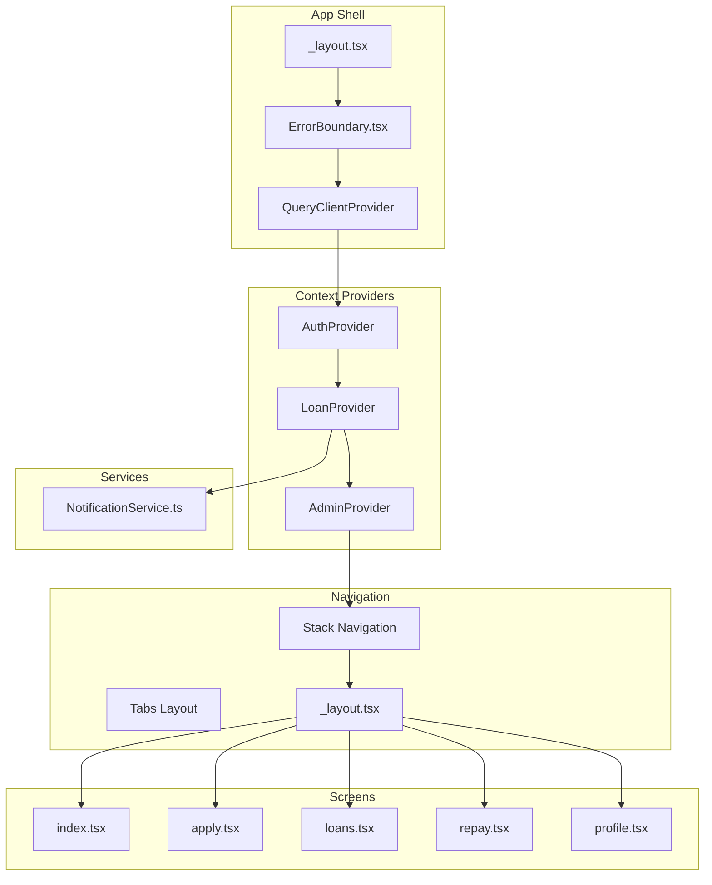
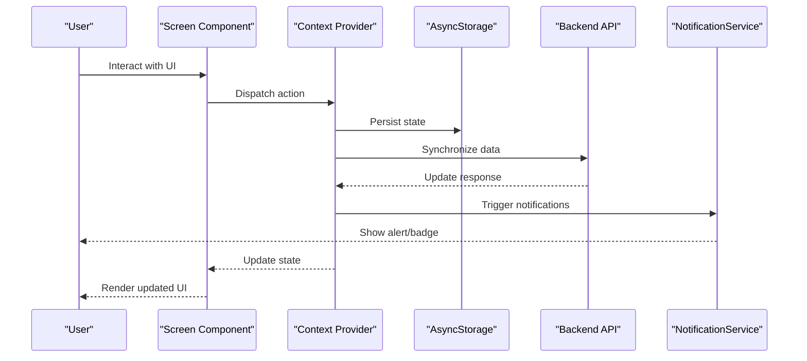
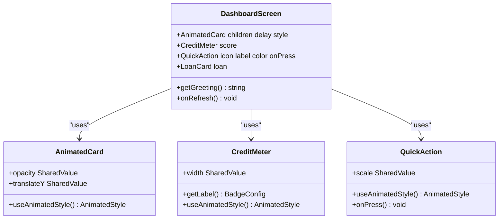
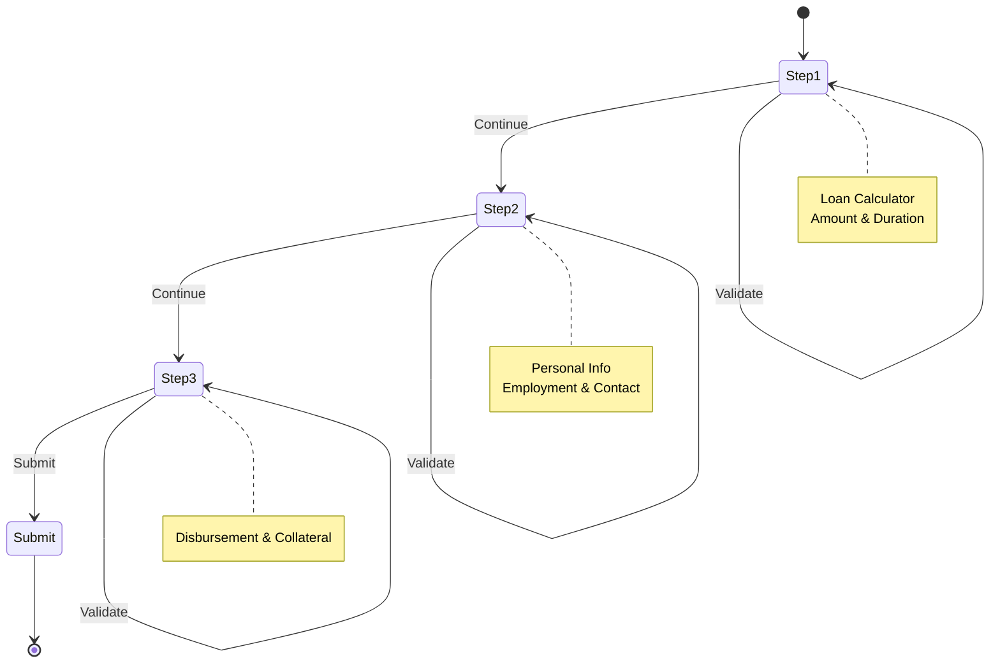
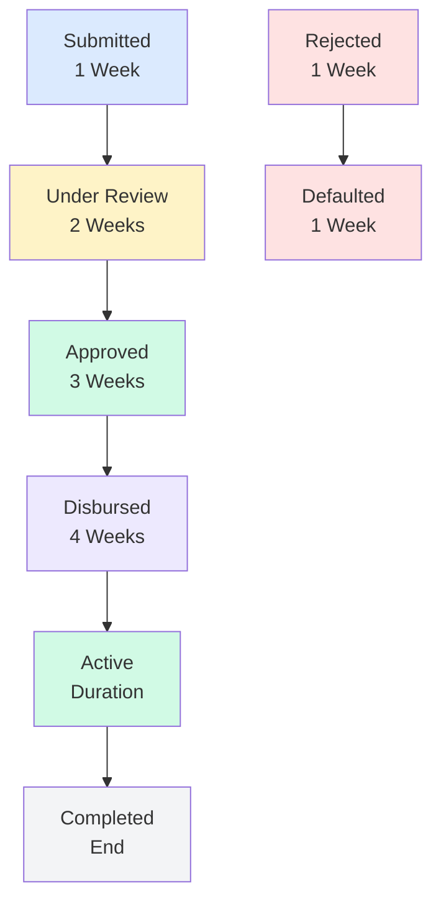
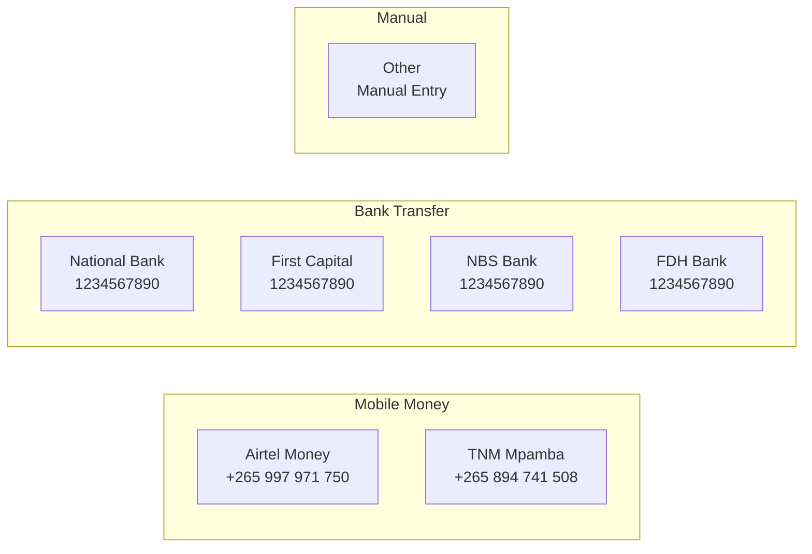
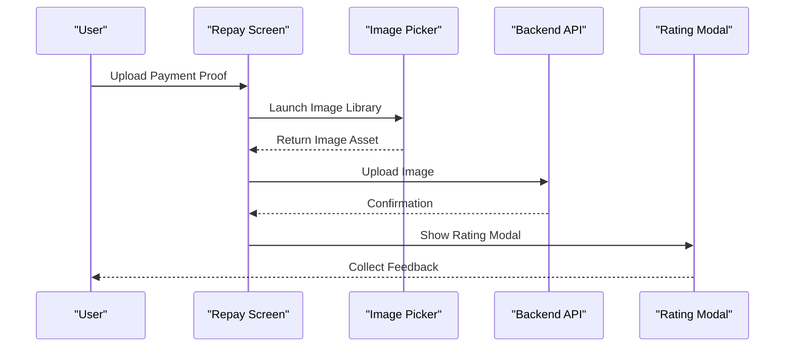
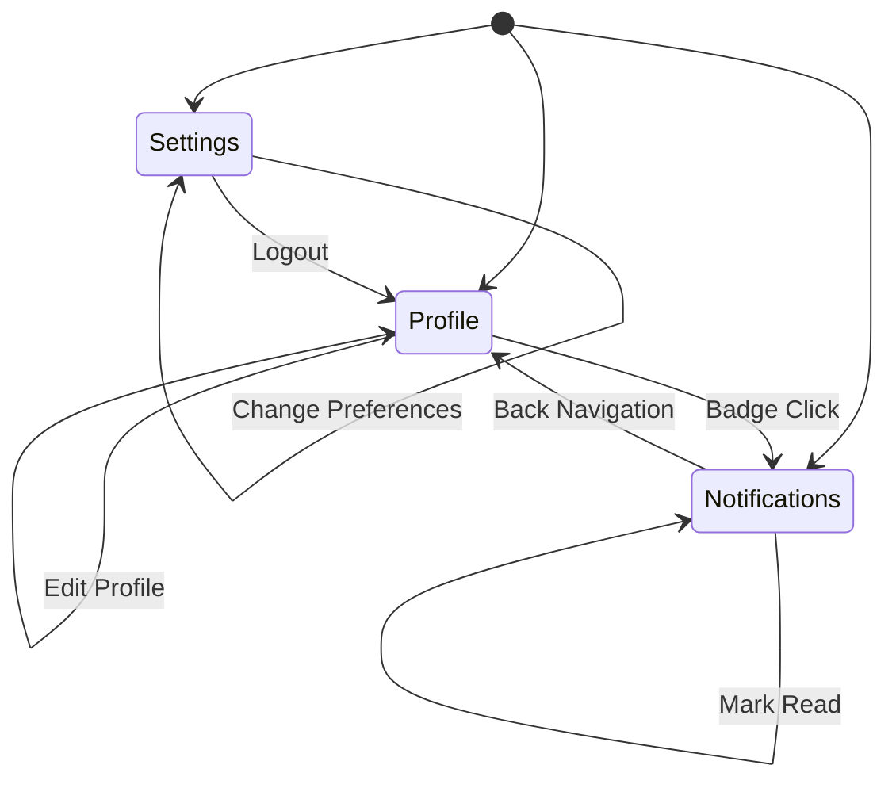
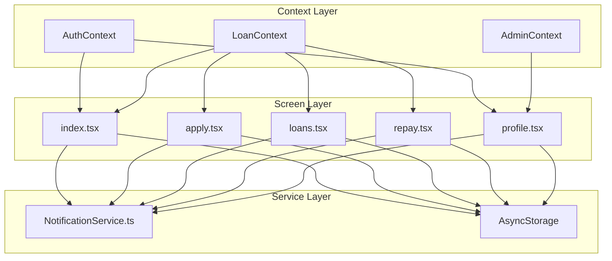

# Screen Components

<cite>
**Referenced Files in This Document**
- [index.tsx](file://app/(tabs)/index.tsx)
- [apply.tsx](file://app/(tabs)/apply.tsx)
- [loans.tsx](file://app/(tabs)/loans.tsx)
- [repay.tsx](file://app/(tabs)/repay.tsx)
- [profile.tsx](file://app/(tabs)/profile.tsx)
- [_layout.tsx](file://app/(tabs)/_layout.tsx)
- [_layout.tsx](file://app/_layout.tsx)
- [LoanContext.tsx](file://contexts/LoanContext.tsx)
- [AuthContext.tsx](file://contexts/AuthContext.tsx)
- [AdminContext.tsx](file://contexts/AdminContext.tsx)
- [NotificationService.ts](file://services/NotificationService.ts)
- [ErrorBoundary.tsx](file://components/ErrorBoundary.tsx)
</cite>

## Table of Contents
1. [Introduction](#introduction)
2. [Project Structure](#project-structure)
3. [Core Components](#core-components)
4. [Architecture Overview](#architecture-overview)
5. [Detailed Component Analysis](#detailed-component-analysis)
6. [Dependency Analysis](#dependency-analysis)
7. [Performance Considerations](#performance-considerations)
8. [Troubleshooting Guide](#troubleshooting-guide)
9. [Conclusion](#conclusion)

## Introduction
This document provides comprehensive technical documentation for the Phoenix mobile application's screen components. It covers the five main screens: Home dashboard, Loan Application form, Loan status tracking, Repayment scheduler, and User Profile management. The documentation explains screen-specific UI patterns, form handling, data visualization components, user interaction flows, navigation, data fetching strategies, error handling, responsive design considerations, and accessibility features.

## Project Structure
The application follows a tab-based navigation architecture built with Expo Router. Each screen is organized under the `(tabs)` route group with dedicated layout configurations and context providers for state management.

**Diagram sources**
- [_layout.tsx:31-82](file://app/_layout.tsx#L31-L82)
- [_layout.tsx](file://app/(tabs)/_layout.tsx#L141-L146)

**Section sources**
- [_layout.tsx:1-83](file://app/_layout.tsx#L1-L83)
- [_layout.tsx](file://app/(tabs)/_layout.tsx#L1-L163)

## Core Components
The screen components are built around several core patterns:

### State Management Architecture
- **Context Providers**: Centralized state management through React Context APIs
- **Local Storage**: Persistent caching using AsyncStorage for offline capabilities
- **Real-time Updates**: Push notifications and backend synchronization
- **Form Validation**: Comprehensive client-side validation with real-time feedback

### UI Patterns
- **Animated Transitions**: Smooth animations using react-native-reanimated
- **Gradient Theming**: Consistent visual hierarchy with gradient backgrounds
- **Card-based Design**: Modular content organization with consistent spacing
- **Responsive Layouts**: Adaptive designs for mobile and web platforms

### Data Flow
- **Provider Pattern**: Context-based state sharing across components
- **Event-driven Updates**: Real-time state updates through notifications
- **Caching Strategy**: Local-first approach with backend synchronization

**Section sources**
- [LoanContext.tsx:82-336](file://contexts/LoanContext.tsx#L82-L336)
- [AuthContext.tsx:31-135](file://contexts/AuthContext.tsx#L31-L135)
- [AdminContext.tsx:135-528](file://contexts/AdminContext.tsx#L135-L528)

## Architecture Overview
The application employs a layered architecture with clear separation of concerns:

**Diagram sources**
- [LoanContext.tsx:198-261](file://contexts/LoanContext.tsx#L198-L261)
- [NotificationService.ts:116-134](file://services/NotificationService.ts#L116-L134)

The architecture ensures:
- **Consistent State Management**: All screens share state through context providers
- **Offline Capability**: Local storage enables offline functionality
- **Real-time Updates**: Push notifications keep users informed
- **Error Resilience**: Graceful degradation when backend is unavailable

## Detailed Component Analysis

### Home Dashboard Screen
The Home screen serves as the primary dashboard, displaying user information, quick actions, and recent loan activity.

#### Key Features
- **Animated Elements**: Smooth entrance animations using react-native-reanimated
- **Credit Score Visualization**: Interactive credit meter with animated progress
- **Quick Action Cards**: Touch-responsive action buttons with haptic feedback
- **Loan Summary Cards**: Dynamic loan status display with color-coded indicators
- **Interest Rate Display**: Gradient cards showcasing current interest rates

#### UI Components

**Diagram sources**
- [index.tsx](file://app/(tabs)/index.tsx#L29-L44)
- [index.tsx](file://app/(tabs)/index.tsx#L46-L84)
- [index.tsx](file://app/(tabs)/index.tsx#L103-L123)

#### Data Visualization
The screen implements several visualization patterns:
- **Progress Indicators**: Animated credit score meter with color transitions
- **Status Badges**: Color-coded status indicators with icons
- **Timeline Visualization**: Loan status progression visualization
- **Statistical Cards**: Gradient cards for key metrics display

#### Interaction Patterns
- **Pull-to-refresh**: Refresh control for manual data updates
- **Touch Feedback**: Haptic feedback for all interactive elements
- **Navigation Gestures**: Smooth transitions between screens
- **Animation Timing**: Staggered animations for visual hierarchy

**Section sources**
- [index.tsx](file://app/(tabs)/index.tsx#L1-L506)

### Loan Application Form
The application form implements a sophisticated multi-step wizard with comprehensive validation and real-time calculation.

#### Multi-Step Wizard Architecture

**Diagram sources**
- [apply.tsx](file://app/(tabs)/apply.tsx#L125-L255)

#### Form Components
The application form consists of specialized input components:

##### Field Component
- **Input Validation**: Real-time validation with error messaging
- **Focus States**: Visual feedback for input focus
- **Icon Integration**: Consistent iconography for field types
- **Error Handling**: Color-coded borders for invalid states

##### SelectField Component
- **Dropdown Interface**: Custom dropdown with scrollable options
- **Selection Persistence**: Maintains selection state
- **Accessibility**: Proper focus management and keyboard navigation
- **Visual Feedback**: Selected state highlighting

##### Toggle Component
- **Smooth Animation**: Spring-based transitions for state changes
- **Visual Indicators**: Thumb movement with color changes
- **Accessibility**: Proper ARIA attributes and screen reader support

#### Calculation Engine
The form includes a dynamic calculation engine:
- **Interest Rate Calculation**: Based on loan duration tiers
- **Processing Fee**: Fixed percentage of principal amount
- **Total Repayment**: Sum of principal, interest, and fees
- **Due Date Calculation**: Business day calculations

#### Validation Strategy
- **Step-based Validation**: Validation occurs at each step boundary
- **Real-time Feedback**: Immediate validation errors display
- **Cross-field Validation**: Dependencies between form fields
- **Format Validation**: Phone number and amount formatting

**Section sources**
- [apply.tsx](file://app/(tabs)/apply.tsx#L1-L816)

### Loan Status Tracking
The loan tracking screen provides comprehensive visibility into loan lifecycle stages with detailed status information.

#### Status Timeline Visualization

**Diagram sources**
- [loans.tsx](file://app/(tabs)/loans.tsx#L14-L23)

#### Detail Modal Architecture
The screen implements a sophisticated modal system for detailed loan information:

##### Modal Components
- **Status Timeline**: Visual loan progression indicator
- **Loan Details**: Comprehensive breakdown of loan terms
- **Payment Information**: Disbursement and repayment details
- **Action Buttons**: Contextual actions based on loan status

##### Responsive Design
- **Slide-up Animation**: Smooth modal presentation
- **Adaptive Height**: Content-aware modal sizing
- **Safe Area Handling**: Proper viewport adaptation
- **Platform Optimization**: iOS and Android specific UI patterns

#### Filtering and Organization
- **Status-based Filtering**: Real-time loan filtering by status
- **Empty State Management**: Helpful guidance for users with no loans
- **Quick Access**: Direct navigation to relevant sections
- **Visual Hierarchy**: Clear organization of loan information

**Section sources**
- [loans.tsx](file://app/(tabs)/loans.tsx#L1-L545)

### Repayment Scheduler
The repayment screen focuses on payment processing with comprehensive payment methods and verification workflows.

#### Payment Methods Integration

**Diagram sources**
- [repay.tsx](file://app/(tabs)/repay.tsx#L17-L59)

#### Countdown Timer Implementation
The screen features an animated countdown timer:
- **Dynamic Color Coding**: Changes based on due date proximity
- **Gradient Backgrounds**: Visual emphasis on urgency
- **Real-time Updates**: Live countdown calculations
- **Overdue Detection**: Special handling for late payments

#### Payment Verification Workflow

**Diagram sources**
- [repay.tsx](file://app/(tabs)/repay.tsx#L238-L260)

#### Payment History Management
- **Transaction Records**: Complete payment history display
- **Success Indicators**: Visual confirmation of completed payments
- **Feedback Collection**: Post-payment satisfaction surveys
- **Statistics Display**: Loan performance metrics

**Section sources**
- [repay.tsx](file://app/(tabs)/repay.tsx#L1-L671)

### User Profile Management
The profile screen consolidates user information, preferences, and account management in a tabbed interface.

#### Tabbed Interface Architecture

**Diagram sources**
- [profile.tsx](file://app/(tabs)/profile.tsx#L125-L160)

#### Notification Management
The profile screen implements comprehensive notification handling:
- **Type-based Styling**: Color-coded notifications by type (info, success, warning, error)
- **Read/Unread States**: Visual distinction between read and unread notifications
- **Batch Operations**: Mark all notifications as read
- **Real-time Updates**: Live notification stream

#### Settings Management
- **Security Settings**: Biometric authentication and KYC verification
- **Preference Toggles**: User preference management
- **Support Integration**: Direct contact with customer support
- **Account Management**: Logout functionality with confirmation

#### Statistics and Analytics
- **Loan History**: Comprehensive loan performance statistics
- **Credit Metrics**: Credit score and borrowing capacity display
- **Membership Duration**: Account longevity indicators
- **Success Rate**: Historical loan approval and repayment rates

**Section sources**
- [profile.tsx](file://app/(tabs)/profile.tsx#L1-L618)

## Dependency Analysis

### Context Provider Dependencies

**Diagram sources**
- [LoanContext.tsx:82-336](file://contexts/LoanContext.tsx#L82-L336)
- [AuthContext.tsx:31-135](file://contexts/AuthContext.tsx#L31-L135)
- [AdminContext.tsx:135-528](file://contexts/AdminContext.tsx#L135-L528)

### Navigation Dependencies
The tab-based navigation system creates specific dependency patterns:
- **Tab Layout**: Centralized navigation configuration
- **Route Parameters**: Context-dependent navigation targets
- **State Propagation**: Context data passed through navigation
- **Platform Adaptation**: Native vs classic tab layouts

### State Management Dependencies
- **Provider Hierarchy**: Nested context providers
- **State Synchronization**: Cross-context state updates
- **Local Storage Integration**: Persistent state management
- **Error Boundaries**: Global error handling

**Section sources**
- [_layout.tsx](file://app/(tabs)/_layout.tsx#L141-L146)
- [LoanContext.tsx:82-336](file://contexts/LoanContext.tsx#L82-L336)

## Performance Considerations

### Rendering Optimizations
- **Memoization**: Strategic use of useMemo and useCallback hooks
- **Virtualized Lists**: Efficient rendering of large datasets
- **Lazy Loading**: On-demand component loading
- **Image Optimization**: Compressed asset loading

### Memory Management
- **Context Cleanup**: Proper cleanup of subscriptions and timers
- **Async Storage**: Efficient key-value pair management
- **Animation Optimization**: Hardware-accelerated animations
- **Network Caching**: Intelligent request caching strategies

### Network Performance
- **Batch Requests**: Combined API calls where possible
- **Retry Logic**: Robust error handling with exponential backoff
- **Offline First**: Local-first approach with conflict resolution
- **Connection Monitoring**: Adaptive behavior based on connectivity

### Accessibility Features
- **Screen Reader Support**: Comprehensive ARIA labeling
- **High Contrast Mode**: Color scheme adaptation
- **Text Scaling**: Dynamic font size support
- **Keyboard Navigation**: Full keyboard accessibility

## Troubleshooting Guide

### Common Issues and Solutions

#### Navigation Problems
- **Symptom**: Screens not loading or navigation failing
- **Cause**: Context provider hierarchy issues
- **Solution**: Verify provider order in root layout

#### State Synchronization Issues
- **Symptom**: UI not reflecting backend changes
- **Cause**: Asynchronous state updates
- **Solution**: Implement proper refresh mechanisms

#### Performance Degradation
- **Symptom**: Slow screen transitions or animations
- **Cause**: Unoptimized rendering or excessive re-renders
- **Solution**: Implement memoization and virtualization

#### Error Handling
The application implements comprehensive error handling:
- **Global Error Boundary**: Centralized error catching
- **Context Error Handling**: Specific error management per context
- **User Feedback**: Meaningful error messages and recovery options
- **Logging Integration**: Error tracking and reporting

**Section sources**
- [ErrorBoundary.tsx:16-54](file://components/ErrorBoundary.tsx#L16-L54)
- [LoanContext.tsx:171-176](file://contexts/LoanContext.tsx#L171-L176)

## Conclusion
The Phoenix mobile application demonstrates a mature approach to mobile banking interface design with comprehensive state management, robust error handling, and thoughtful user experience considerations. The screen components showcase modern React Native patterns including context-based state management, animated UI components, and responsive design principles.

Key strengths of the implementation include:
- **Consistent Architecture**: Clear separation of concerns across screens
- **Robust State Management**: Comprehensive context providers with persistence
- **User-Centric Design**: Intuitive navigation and meaningful feedback
- **Performance Optimization**: Efficient rendering and memory management
- **Accessibility Compliance**: Comprehensive accessibility features

The modular design allows for easy maintenance and extension, while the centralized context providers ensure consistent state management across all application screens. The implementation serves as a strong foundation for future feature additions and platform-specific optimizations.