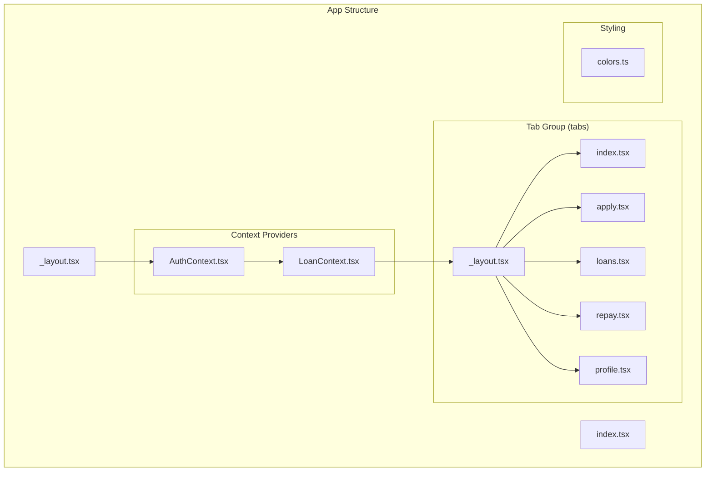
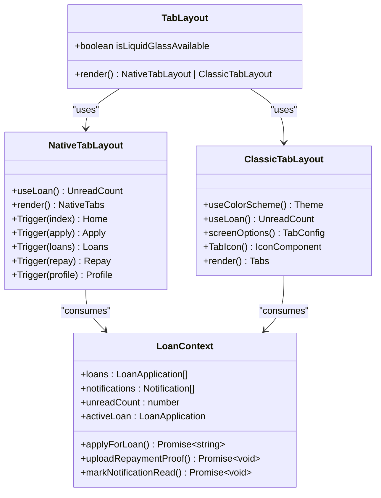
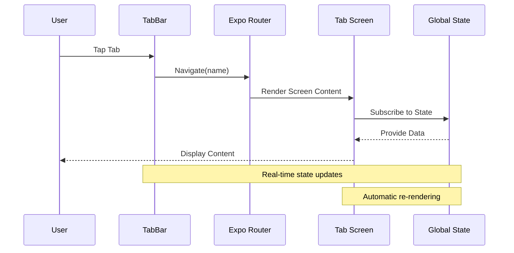
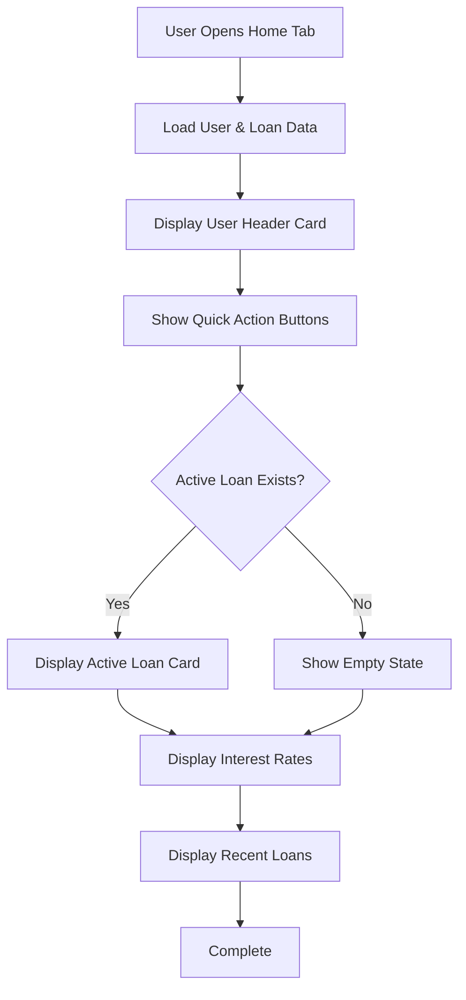
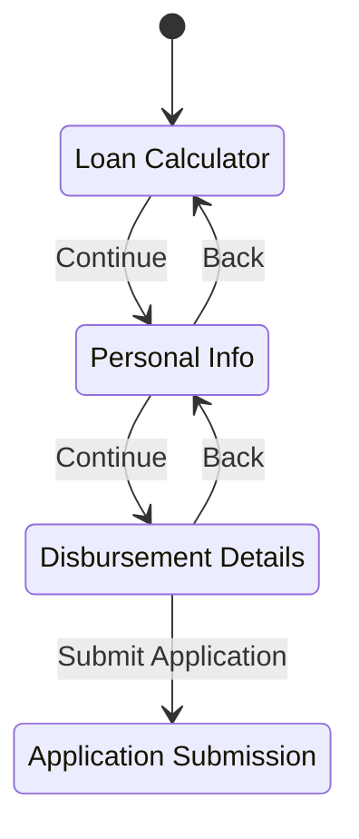
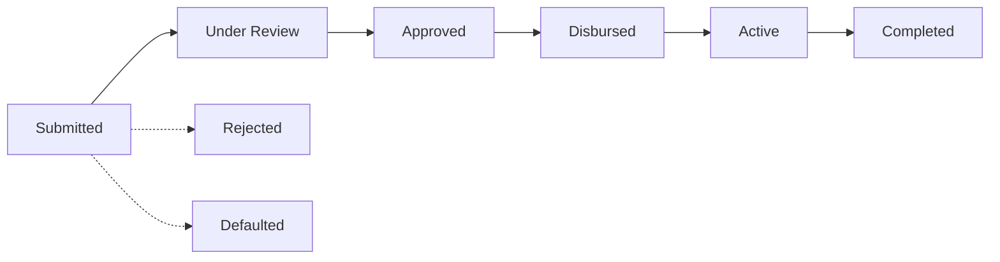
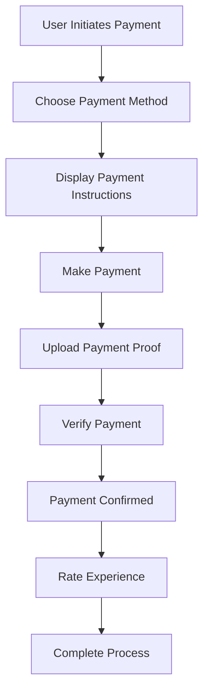
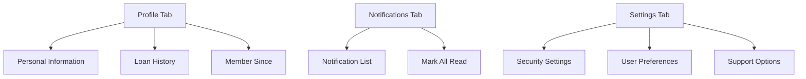
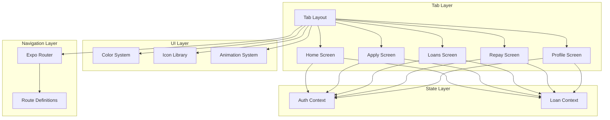
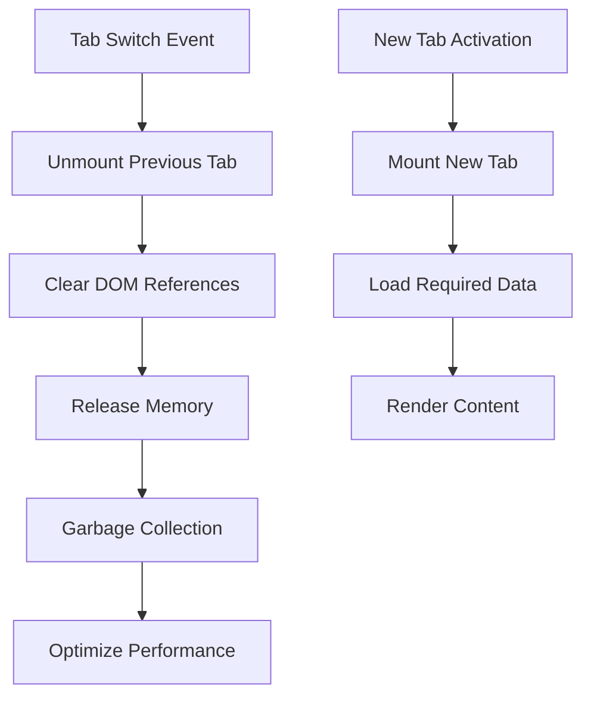

# Tab Interface

<cite>
**Referenced Files in This Document**
- [app/(tabs)/_layout.tsx](file://app/(tabs)/_layout.tsx)
- [app/(tabs)/index.tsx](file://app/(tabs)/index.tsx)
- [app/(tabs)/apply.tsx](file://app/(tabs)/apply.tsx)
- [app/(tabs)/loans.tsx](file://app/(tabs)/loans.tsx)
- [app/(tabs)/repay.tsx](file://app/(tabs)/repay.tsx)
- [app/(tabs)/profile.tsx](file://app/(tabs)/profile.tsx)
- [contexts/LoanContext.tsx](file://contexts/LoanContext.tsx)
- [contexts/AuthContext.tsx](file://contexts/AuthContext.tsx)
- [constants/colors.ts](file://constants/colors.ts)
- [app/_layout.tsx](file://app/_layout.tsx)
- [app/index.tsx](file://app/index.tsx)
</cite>

## Table of Contents
1. [Introduction](#introduction)
2. [Project Structure](#project-structure)
3. [Core Components](#core-components)
4. [Architecture Overview](#architecture-overview)
5. [Detailed Component Analysis](#detailed-component-analysis)
6. [Dependency Analysis](#dependency-analysis)
7. [Performance Considerations](#performance-considerations)
8. [Troubleshooting Guide](#troubleshooting-guide)
9. [Conclusion](#conclusion)

## Introduction

The Phoenix Loan application features a sophisticated tab-based user interface designed to provide seamless navigation and optimal user experience across five core functional areas. This documentation provides comprehensive coverage of the tab interface implementation, including tab bar configuration, active state indicators, tab switching behavior, and the integration with global state management.

The tab interface serves as the primary navigation hub for users, offering intuitive access to loan application processes, loan management, repayment procedures, and personal profile management. The implementation leverages modern React Native patterns with Expo Router for navigation and React Context for state management.

## Project Structure

The tab interface is organized within the `(tabs)` route group, which provides a clean separation of concerns and enables efficient routing between different application sections.

**Diagram sources**
- [app/_layout.tsx:19-29](file://app/_layout.tsx#L19-L29)
- [app/(tabs)/_layout.tsx:12-39](file://app/(tabs)/_layout.tsx#L12-L39)

**Section sources**
- [app/_layout.tsx:19-29](file://app/_layout.tsx#L19-L29)
- [app/(tabs)/_layout.tsx:12-39](file://app/(tabs)/_layout.tsx#L12-L39)

## Core Components

The tab interface consists of two primary layout components that provide different visual experiences based on device capabilities and platform support.

### Tab Layout Architecture

The system implements a dual-tab layout system that automatically adapts between native liquid glass tabs and classic styled tabs:

**Diagram sources**
- [app/(tabs)/_layout.tsx:12-146](file://app/(tabs)/_layout.tsx#L12-L146)
- [contexts/LoanContext.tsx:50-62](file://contexts/LoanContext.tsx#L50-L62)

### Tab Bar Configuration

The tab bar configuration implements sophisticated styling and behavior patterns:

| Property | Value | Purpose |
|----------|--------|---------|
| **Active Tint Color** | Primary purple (`#6B21A8`) | Indicates current tab selection |
| **Inactive Tint Color** | Light gray (`#9B8AA8`) | Shows available tabs |
| **Background Style** | Transparent blur (iOS) | Modern glass effect |
| **Platform Adaptation** | Web adds 84px height | Desktop optimization |
| **Label Font** | DM Sans Medium | Consistent typography |

**Section sources**
- [app/(tabs)/_layout.tsx:62-90](file://app/(tabs)/_layout.tsx#L62-L90)
- [app/(tabs)/_layout.tsx:148-162](file://app/(tabs)/_layout.tsx#L148-L162)

## Architecture Overview

The tab interface architecture demonstrates excellent separation of concerns and follows modern React Native patterns:

**Diagram sources**
- [app/(tabs)/_layout.tsx:141-146](file://app/(tabs)/_layout.tsx#L141-L146)
- [contexts/LoanContext.tsx:322-329](file://contexts/LoanContext.tsx#L322-L329)

The architecture integrates seamlessly with the global state management system, ensuring that tab content remains synchronized with application state across all screens.

## Detailed Component Analysis

### Home Tab Implementation

The Home tab serves as the primary dashboard, showcasing user information, loan summaries, and quick actions.

#### Dashboard Features

The Home screen implements sophisticated data visualization and interactive elements:

**Diagram sources**
- [app/(tabs)/index.tsx:195-345](file://app/(tabs)/index.tsx#L195-L345)

#### Animation System

The Home tab utilizes a sophisticated animation system for enhanced user experience:

| Animation Type | Component | Purpose |
|----------------|-----------|---------|
| **Fade & Slide** | Header Cards | Smooth entrance animations |
| **Scale Effects** | Quick Actions | Interactive feedback |
| **Progressive Timing** | Content Sections | Sequential loading experience |
| **Spring Physics** | Interactive Elements | Natural motion effects |

**Section sources**
- [app/(tabs)/index.tsx:29-44](file://app/(tabs)/index.tsx#L29-L44)
- [app/(tabs)/index.tsx:103-123](file://app/(tabs)/index.tsx#L103-L123)

### Apply Tab Implementation

The Apply tab implements a multi-step loan application process with comprehensive validation and user guidance.

#### Multi-Step Form Architecture

**Diagram sources**
- [app/(tabs)/apply.tsx:125-255](file://app/(tabs)/apply.tsx#L125-L255)

#### Form Validation Strategy

The application implements comprehensive form validation with real-time feedback:

| Validation Stage | Fields Validated | Error Handling |
|------------------|------------------|----------------|
| **Step 1** | Loan Amount, Duration | Numeric validation, min/max checks |
| **Step 2** | Employment Status, Income, Next of Kin | Required field validation, phone format |
| **Step 3** | Disbursement Method, Account Details, Collateral | Conditional validation, collateral requirements |

**Section sources**
- [app/(tabs)/apply.tsx:163-182](file://app/(tabs)/apply.tsx#L163-L182)
- [app/(tabs)/apply.tsx:184-255](file://app/(tabs)/apply.tsx#L184-L255)

### Loans Tab Implementation

The Loans tab provides comprehensive loan management with detailed status tracking and interactive modals.

#### Status Timeline Visualization

**Diagram sources**
- [app/(tabs)/loans.tsx:14-23](file://app/(tabs)/loans.tsx#L14-L23)

#### Modal Interaction Pattern

The Loans tab implements a sophisticated modal system for detailed loan information:

| Modal Trigger | Content | Purpose |
|---------------|---------|---------|
| **Loan Card Tap** | Detailed Loan Information | View comprehensive loan details |
| **Repay Button** | Repayment Navigation | Direct repayment process |
| **Filter Selection** | Status-based Filtering | Loan organization |

**Section sources**
- [app/(tabs)/loans.tsx:133-224](file://app/(tabs)/loans.tsx#L133-L224)
- [app/(tabs)/loans.tsx:309-441](file://app/(tabs)/loans.tsx#L309-L441)

### Repay Tab Implementation

The Repay tab focuses on loan repayment with multiple payment methods and proof upload functionality.

#### Payment Method Integration

The repayment system supports multiple payment channels with detailed instructions:

| Payment Method | Key Features | Requirements |
|----------------|--------------|--------------|
| **Airtel Money** | Mobile money transfer | PIN confirmation required |
| **TNM Mpamba** | Mobile network payment | Network-specific instructions |
| **Bank Transfer** | Traditional banking | Bank account details required |

#### Proof Upload Workflow

**Diagram sources**
- [app/(tabs)/repay.tsx:225-450](file://app/(tabs)/repay.tsx#L225-L450)

**Section sources**
- [app/(tabs)/repay.tsx:17-59](file://app/(tabs)/repay.tsx#L17-L59)
- [app/(tabs)/repay.tsx:225-450](file://app/(tabs)/repay.tsx#L225-L450)

### Profile Tab Implementation

The Profile tab implements a sophisticated three-tab interface with integrated notification system.

#### Tabbed Profile Interface

**Diagram sources**
- [app/(tabs)/profile.tsx:127-435](file://app/(tabs)/profile.tsx#L127-L435)

#### Notification Management

The Profile tab integrates with the global notification system for real-time updates:

| Notification Type | Visual Indicator | Action |
|-------------------|------------------|--------|
| **Information** | Blue circle | Standard notification |
| **Success** | Green check | Positive confirmation |
| **Warning** | Yellow exclamation | Important alert |
| **Error** | Red X | Error condition |

**Section sources**
- [app/(tabs)/profile.tsx:15-78](file://app/(tabs)/profile.tsx#L15-L78)
- [app/(tabs)/profile.tsx:127-435](file://app/(tabs)/profile.tsx#L127-L435)

## Dependency Analysis

The tab interface demonstrates excellent dependency management and follows clean architecture principles.

**Diagram sources**
- [app/(tabs)/_layout.tsx:12-39](file://app/(tabs)/_layout.tsx#L12-L39)
- [contexts/LoanContext.tsx:82-336](file://contexts/LoanContext.tsx#L82-L336)
- [contexts/AuthContext.tsx:31-135](file://contexts/AuthContext.tsx#L31-L135)

### State Management Integration

The tab interface integrates deeply with the global state management system:

| Context Provider | Consumed By | Purpose |
|------------------|-------------|---------|
| **AuthContext** | All Screens | User authentication state |
| **LoanContext** | Home, Apply, Loans, Repay, Profile | Loan and notification data |
| **AdminContext** | Admin Screens | Administrative functionality |

**Section sources**
- [app/_layout.tsx:67-79](file://app/_layout.tsx#L67-L79)
- [contexts/LoanContext.tsx:322-329](file://contexts/LoanContext.tsx#L322-L329)

## Performance Considerations

The tab interface implements several performance optimization strategies:

### Lazy Loading Implementation

Each tab screen implements intelligent loading patterns:

- **Home Screen**: Progressive content loading with staggered animations
- **Apply Screen**: Step-by-step rendering to reduce initial load
- **Loans Screen**: Virtualized lists for large loan collections
- **Repay Screen**: Conditional rendering based on active loan status
- **Profile Screen**: Tab-specific content loading

### Memory Management

**Diagram sources**
- [app/(tabs)/index.tsx:195-345](file://app/(tabs)/index.tsx#L195-L345)

### Animation Performance

The interface implements optimized animation patterns:

| Animation Type | Performance Strategy | Benefit |
|----------------|---------------------|---------|
| **Reanimated** | Hardware-accelerated | Smooth 60fps animations |
| **Linear Gradient** | Pre-computed | Reduced rendering overhead |
| **Conditional Rendering** | Lazy evaluation | Minimized DOM tree size |
| **Memoization** | Cached computations | Reduced CPU usage |

**Section sources**
- [app/(tabs)/index.tsx:14-16](file://app/(tabs)/index.tsx#L14-L16)
- [app/(tabs)/apply.tsx:14-16](file://app/(tabs)/apply.tsx#L14-L16)

## Troubleshooting Guide

### Common Tab Issues

#### Tab Switching Problems

**Issue**: Tabs not responding to user input
**Solution**: 
1. Verify tab names match route definitions
2. Check for navigation conflicts in parent layouts
3. Ensure proper context provider setup

#### State Synchronization Issues

**Issue**: Tab content not updating with state changes
**Solution**:
1. Verify context providers wrap the tab layout
2. Check for proper subscription patterns
3. Ensure state updates trigger re-renders

#### Performance Issues

**Issue**: Slow tab switching or animations
**Solution**:
1. Implement lazy loading for heavy components
2. Use memoization for expensive calculations
3. Optimize image loading and caching

### Debugging Strategies

| Issue Category | Debug Steps | Tools |
|----------------|-------------|-------|
| **Navigation** | Check route definitions, verify tab names | React DevTools, Expo DevTools |
| **State** | Monitor context updates, check for infinite loops | React DevTools, Reactotron |
| **Performance** | Profile animations, measure render times | React DevTools Profiler, Flipper |
| **Styling** | Verify theme consistency, check responsive behavior | Browser DevTools, React Native Debugger |

**Section sources**
- [app/(tabs)/_layout.tsx:141-146](file://app/(tabs)/_layout.tsx#L141-L146)
- [contexts/LoanContext.tsx:322-329](file://contexts/LoanContext.tsx#L322-L329)

## Conclusion

The Phoenix Loan tab interface represents a sophisticated implementation of modern mobile application navigation patterns. The system successfully balances aesthetic appeal with functional efficiency, providing users with intuitive access to all core application features.

Key strengths of the implementation include:

- **Adaptive Design**: Automatic adaptation between native and classic tab styles
- **Performance Optimization**: Intelligent lazy loading and memory management
- **State Integration**: Seamless integration with global state management
- **Accessibility**: Comprehensive accessibility features and responsive design
- **Scalability**: Clean architecture supporting future feature additions

The tab interface serves as an excellent foundation for the Phoenix Loan application, providing a solid user experience while maintaining technical excellence in implementation. The modular design ensures maintainability and extensibility for future development needs.